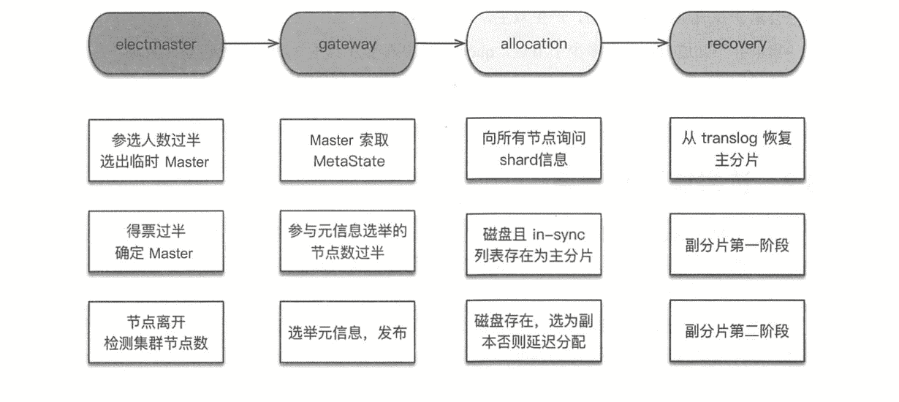
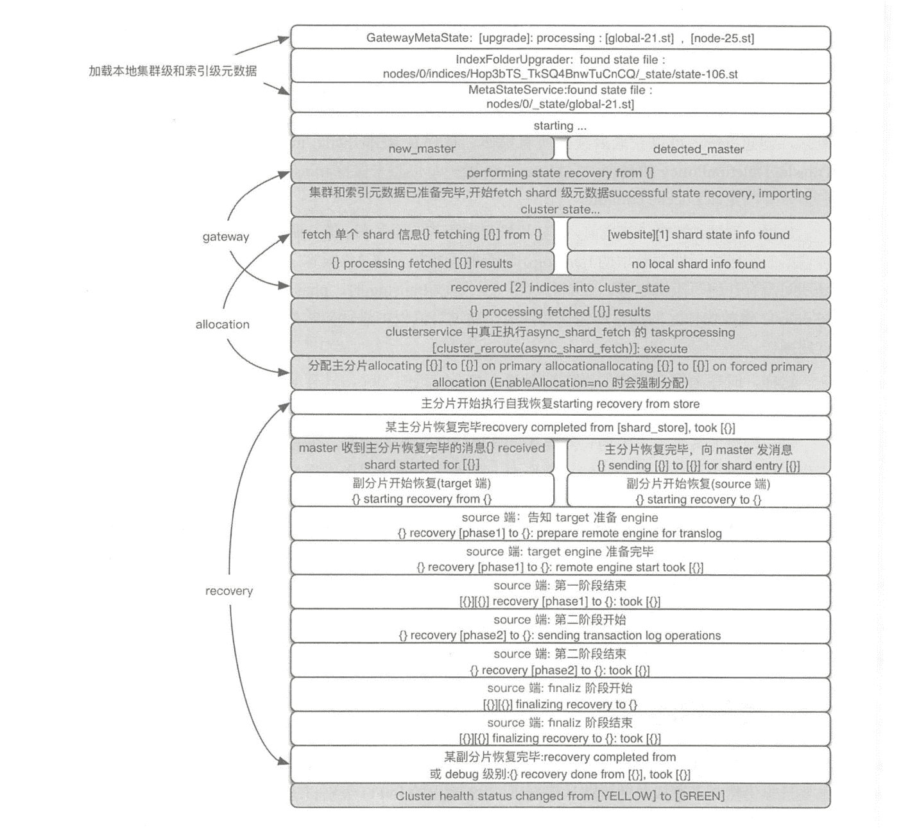

# 《Elasticsearch 源码解析与优化实战》第 3 章：集群启动流程

> 原文：[https://cloud.tencent.com/developer/article/1831195](https://cloud.tencent.com/developer/article/1831195)

# 简介

让我们从启动流程开始，先在宏观上看看整个集群是如何启动的，集群状态如何从 Red 变成 Green，不涉及代码，然后分析其他模块的流程。

本书中，集群启动过程指集群完全重启时的启动过程，期间要经历选举主节点、主分片、数据恢复等重要阶段，理解其中原理和细节，对于解决或避免集群维护过程中可能遇到的脑裂、无主、恢复慢、丟数据等问题有重要作用。

集群启动的整体流程如下图所示。

<figure class=""></figure>

# 选举主节点

假设有若干节点正在启动，**集群启动的第一件事是从已知的活跃机器列表中选择一个作为主节点，选主之后的流程由主节点触发。**

ES 的选主算法是基于 Bully 算法的改进，主要思路是对节点 ID 排序，取 ID 值最大的节点作为 Master，每个节点都运行这个流程。是不是非常简单。选主的目的是确定唯一的主节点，初学者可能认为选举出的主节点应该持有最新的元数据信息，实际上这个问题在实现上被分解为两步：先确定唯一的、大家公认的主节点，再想办法把最新的机器元数据复制到选举出的主节点上。

基于节点 ID 排序的简单选举算法有三个附加约定条件：

*   **参选人数需要过半，达到 quorum (多数)后就选出了临时的主。**为什么是临时的? 每个节点运行排序取最大值的算法，结果不一定相同。举个例子，集群有 5 台主机，节点 ID 分别是 1、2、3、4、5。当产生网络分区或节点启动速度差异较大时，节点 1 看到的节点列表是 1、2、3、4，选出 4；节点 2 看到的节点列表是 2、3、4、5，选出 5。结果就不一致了，由此产生下面的第二条限制。
*   **得票数需过半。某节点被选为主节点，必须判断加入它的节点数过半，才确认 Maste 身份。**
*   **当探测到节点离开事件时，必须判断当前节点数是否过半。**如果达不到 quorum，则放弃 Master 身份，重新加入集群。如果不这么做，则设想以下情况：假设 5 台机器组成的集群产生网络分区，2 台一组，3 台一组，产生分区前，Master 位于 2 台中的一个，此时 3 台一组的节点会重新并成功选取 Master，产生双主，俗称脑裂。

集群并不知道自己共有多少个节点，quorum 值从配置中读取，我们需要设置配置项：

```java
discovery.zen.minimum_master_nodes
```

# 选举集群元信息

**被选出的`Master` 和集群元信息的新旧程度没有关系。因此它的第一个任务是选举元信息，让具有`master`资格的节点把各自存储的元信息发过来（等待回复，必须收到所有节点的回复无论成功还是失败，没有超时。在收齐的这些回复中，有效元信息的总数必须达到指定数量），根据版本号（较大版本号）确定最新的元信息，然后把这个信息广播下去，这样集群的所有节点（`master`资格节点和数据节点）都有了最新的元信息。**

**集群元信息的选举包括两个级别：集群级和索引级。**不包含哪个 shard 存于哪个节点这种信息。这种信息以节点磁盘存储的为准，需要上报。为什么呢？因为读写流程是不经过 Master 的，Master 不知道各 shard 副本直接的数据差异。HDFS 也有类似的机制，block 信息依赖于 DataNode 的上报。

**为了集群一致性，参与选举的元信息数量需要过半，Master 发布集群状态成功的规则也是等待发布成功的节点数过半。在选举过程中，不接受新节点的加入请求。**

集群元信息选举完毕后，Master 发布首次集群状态，然后开始选举 shard 级元信息。

# Allocation 过程

**选举`shard`级元信息，构建内容路由表，是在`allocation`模块完成的。**在初始阶段，所有的 shard 都处于 UNASSIGNED (未分配)状态。ES 中通过分配过程决定哪个分片位于哪个节点，重构内容路由表。此时，首先要做的是分配主分片。

## 选主分片

现在看某个主分片[website][0]是怎么分配的。**所有的分配工作都是`Master`来做的，此时，`Master`不知道主分片在哪，它向集群的所有数据节点询问并期望得到指定数据量的响应：大家把`[website][0]`分片的元信息发给我。然后，`Master`等待所有的请求返回，正常情况下它就有了这个`shard`的信息，然后根据某种策略选一个分片作为主分片。**是不是效率有些低？这种询问量 = shard 数 * 节点数。所以说我们最好控制 shard 的总规模别太大。

现在有了 shard[website][0]的分片的多份信息，具体数量取决于副本数设置了多少。现在考虑把哪个分片作为主分片。**ES 5.x 以下的版本，通过对比`shard`级元信息的版本号来决定。在多副本的情况下，考虑到如果只有一个`shard`信息汇报上来，则它一定会被选为主分片，但也许数据不是最新的，版本号比它大的那个`shard`所在节点还没启动。在解决这个问题的时候，`ES5.x`开始实施一种新的策略: 给每个`shard`都设置一个`UUID`，然后在集群级的元信息中记录哪个`shard`是最新的，因为`ES`是先写主分片，再由主分片节点转发请求去写副分片，所以主分片所在节点肯定是最新的，如果它转发失败了，则要求`Master`删除那个节点。所以，`ES5.x`开始，主分片选举过程是通过集群级元信息中记录的“最新主分片的列表”来确定主分片的：汇报信息中存在，并且这个列表中也存在。通过`allocator`得到这个列表，然后对每个节点依次执行`decider`，只要有一个`decider`拒绝，就拒绝执行本次分配。决策之后的结果可能会有多个节点，取第一个。至此，主分片选取完成。然后，将相关内容路由信息添加到集群中，`Master`把新的集群状态广播下去，当数据节点发现某个分片分配给自己，开始执行分片的`recovery`。**

如果集群设置了:

```java
"cluster.routing.allocation.enable": "none"
```

禁止分配分片，集群仍会强制分配主分片。因此，在设置了上述选项的情况下，集群重启后的状态为 Yellow，而非 Red。

## 选副分片

**主分片选举完成后，从上一个过程汇总的 shard 信息中选择一个副本作为副分片。如果汇总信息中不存在，则分配一个全新副本。**

操作依赖于延迟配置项：

```java
index.unassigned.node_left.delayed_timeoult
```

我们的线上环境中最大的集群有 100+节点，掉节点的情况并不罕见，很多时候不能第一时间处理，这个延迟我们一般配置为以天为单位。最后，**`allocation` 过程中允许新启动的节点加入集群。**

# Index recovery

**分片分配成功后进入`recovery`流程。主分片的`recovery`不会等待其副分片分配成功才开始`recovery`。它们是独立的流程，只是副分片的`recovery`需要主分片恢复完毕才开始。**

为什么需要 recovery？对于主分片来说，可能有一些数据没来得及刷盘；对于副分片来说，一是没刷盘，二是主分片写完了，副分片还没来得及写，主副分片数据不一致。

## 主分片 recovery

由于每次写操作都会记录事务日志(translog)， 事务日志中记录了哪种操作，以及相关的数据。**因此将最后一次提交(`Lucene` 的一次提交就是一次`fsync`刷盘的过程)之后的`translog`中进行重放，建立`Lucene`索引，如此完成主分片的`recovery`。**

## 副分片 recovery

副分片的恢复是比较复杂的，在 ES 的版本迭代中，副分片恢复策略有过不少调整。副分片需要恢复成与主分片一致，同时，恢复期间允许新的索引操作。

**在`1.x`版本时代，通过阻止刷新(`refresh`)操作，让 translog 都保留下来，但是这样可能会产生很大的 translog。**

*   **`phase1`：将主分片的`Lucene`做快照，发送到`target`。期间不阻塞索引操作，新增数据写到主分片的`translog`。**
*   **`phase2`：将主分片`translog`做快照，发送到`target`重放，期间不阻塞索引操作。**
*   **`phase3`：为主分片加写锁，将剩余的`translog` 发送到`target`。此时数据量很小，写入过程的阻塞很短。**

**在`2.0 ~ 5.x`版本时代，引入了`translog.view`概念。**

`**6.0**`**版本开始，**`**translog.vie**`**被移除。**引入 TranslogDeletionPolicy(事务日志删除策略)的概念，负责维护活跃的 translog 文件。这个类的实现非常简单，它将 tanslog 做一个快照来保持 translog 不被清理。这样使用者只需创建一个快照，无需担心视图之类。恢复流程实际上确实需要一个视图，现在可以通过获取一个简单的保留锁来防止清理 translog。这消除了视图概念的需求。

*   `**phase1**`：**在主分片所在节点，获取**`**translog**`**保留锁，**从获取保留锁开始，会保留 translog 不受刷盘清空的影响。**然后调用 Lucene 接口把 shard 做快照，快照含有 shard 中已经刷到磁盘的文件引用，把这些 shard 数据复制到副本节点。**在 phase1 结束前，会向副分片发生告知对方启动 Engine，在 phase2 开始之前，副分片就可以正常处理写请求了。
*   `**phase2**`**：对 translog 做快照，这个快照包含从 phase1 开始，到执行 translog 快照期间的新增索引。将这些 translog 发送到副分片所在节点进行重放。**

由于需要支持恢复期间的新增写操作(让 ES 的可用性更强)，这两个阶段中需要重点关注以下几个问题。

分片数据完整性：如何做到副分片不丢数据？第二阶段的 translog 快照包括第一阶段所有的新增操作。那么第一阶段执行期间如果发生“Lucene commit" (将文件系统写缓冲中的数据刷盘,并清空 translog)，清除 translog 怎么办？在 ES 2.0 之前，是阻止了刷新操作，以此让 translog 都保留下来。从 2.0 版本开始，为了避免这种做法产生过大的 translog，引入了 translog.view 的概念，创建 view 可以获取后续的所有操作。从 6.0 版本开始，translog.view 被移除。引入 TranslogDeletionPolicy 的概念，它将 translog 做一个快照来保持 translog 不被清理。这样实现了在第一阶段允许 Lucene commit。

数据一致性：在 ES2.0 之前，副分片恢复过程有三个阶段，第三阶段会阻塞新的索引操作，传输第二阶段执行期间新增的 translog，这个时间很短。自 2.0 版本之后，第三阶段被删除，恢复期间没有任何写阻塞过程。在副分片节点，重放 translog 时，phase1 和 phase2 之间的写操作与 phase2 重放操作之间的时序错误和冲突，通过写流程中进行异常处理，对比版本号来过滤掉过期操作。这样，时序上存在错误的操作被忽略，对于特定的 doc，只有最新一次操作生效，保证了主副分片一致。

**第一阶段尤其漫长，因为它需要从主分片拉取全量的数据，在`ES 6.x`中，有两个机会可以跳过`phase1`：**

1.  **如果主副分片有相同的`synid`且`doc`数量相同，则跳过`phase1`；**
2.  **如果可以基于恢复请求中的`SequenceNumber`进行恢复，则跳过`phase1`；**

### 1\. Synid 方式

**为了解决副本分片恢复过程第一阶段时间太长而引入了`synced [sɪŋk] flush`，默认情况下 5 分钟没有写入操作的索引被标记`inactive`(不活跃)，执行`synced flush`，生成一个唯一的`synid`(同步标志)，写入分片的所有副本中。这个`syncid`是分片级，意味着拥有相同`syncid`的分片具有相同的`Lucene`索引。**

**synced flush 本质上是一次普通的 flush 操作，只是在 Lucene 的 commit 过程中多写了一个 syncid。**原则上，在没有数据写入的情况下，各分片在同一时间“flush”成功后，他们理应由相同的 Lucene 索引内容，无论 Lucene 分段是否一致。于是给分片分配一个 id，表示数据一致。**但是显然`synced flush`期间不能有新写入的内容，如果`synced flush`执行期间收到写请求，则`ES`选择了写入可用性：让`synced flush`失败，让写操作成功。在没有执行`flush`的情况下已有`syncid`不会失效。**

**在某个分片上执行普通`flush`操作会删除已有`syncid`。因此，`synced flush`操作是一个不可靠操作，只适用于冷索引。**

### 2\. SequenceNumber 方式

# 节点下线

设想当我们为 ES 集群更新配置、升级版本时，需要通过“kill" ES 进程来关闭节点。但是 kill 操作是否安全？如果此时节点有正在执行的读写操作会有什么影响？

答案是：ES 进程会捕获 SIGTERM 信号(kill 命令默认信号)进行处理，调用各模块的 stop 方法，让它们有机会停止服务，安全退出。

## 主节点下线

如果主节点被关闭，则集群会重新选主，在这期间，集群有一个短暂的无主状态。如果集群中的主节点是单独部署的，则新主当选后，可以跳过 gateway 和 recovery 流程，否则新主需要重新分配旧主所持有的分片：提升其他副本为主分片，以及分配新的副分片。

## 数据节点下线

如果数据节点被关闭，则读写请求的 TCP 连接也会因此关闭，对客户端来说写操作执行失败。但写流程已经到达 Engine 环节的会正常写完，只是客户端无法感知结果。此时客户端重试，如果使用自动生成 ID，则数据内容会重复。

*   **写入过程中关闭：线程在写入数据时，会对 Engine 加写锁。**IndicesService 的 doStop 方法对本节点上全部索引并行执行 removeIndex，当执行到 Engine 的 flushAndClose (先 flush 然后关闭 Engine)，也会对 Engine 加写锁。**由于写入操作已经加了写锁，此时写锁会等待，直到写入执行完毕。因此数据写入过程不会被中断。但是由于网络模块被关闭，客户端的连接会被断开。客户端应当作为失败处理，虽然 ES 服务端的写流程还在继续。**
*   **读取过程中关闭：线程在读取数据时，会对 Engine 加读锁。**flushAndClose 时的写锁会等待读取过程执行完毕**。但是由于连接被关闭，无法发送给客户端，导致客户端读失败。**

# 集群启动日志

日志是分布式系统中排查问题的重要手段，虽然 ES 提供了很多便于排查问题的接口，但重要日志仍然是不可或缺的。默认情况下，ES 输出的 INFO 级别日志较少，许多重要模块的关键环节是 DEBUG 或 TRACE 级别的，下图列出了集群启动过程相关的重要日志，部分调整到了 INFO 级别。

<figure class=""></figure>

# 小结

索引数据恢复是最漫长的过程。当 shard 总量达到十万级的时候，6.x 之前的版本集群从 Red 变为 Green 的时间可能需要小时级。ES6.x 中的副本允许从本地 translog 恢复是一次重大的改进，避免了从主分片所在节点拉取全量数据，为恢复过程节约了大量时间。