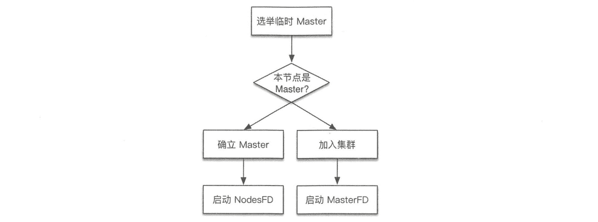
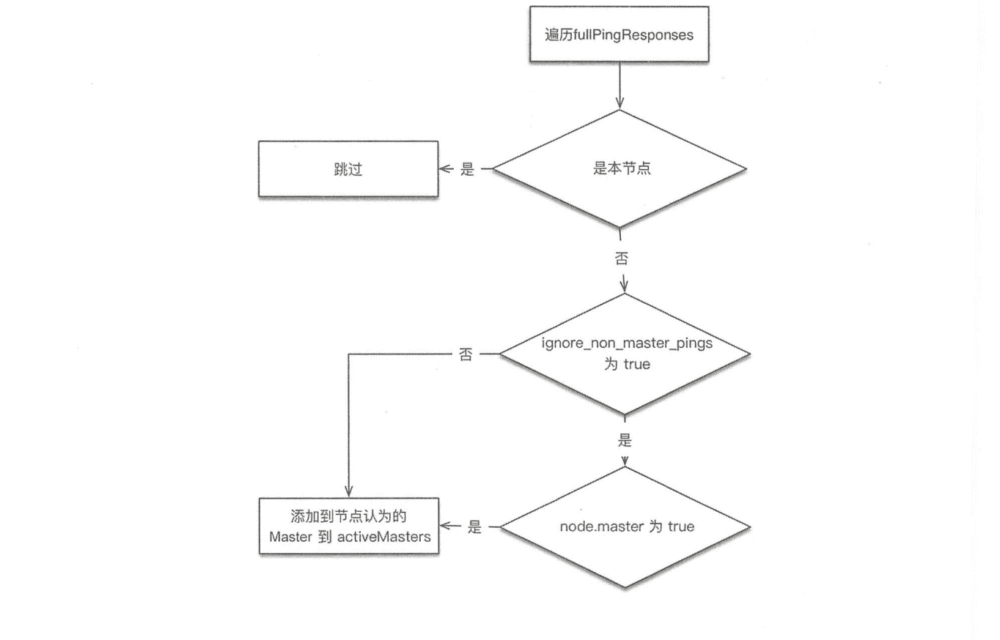
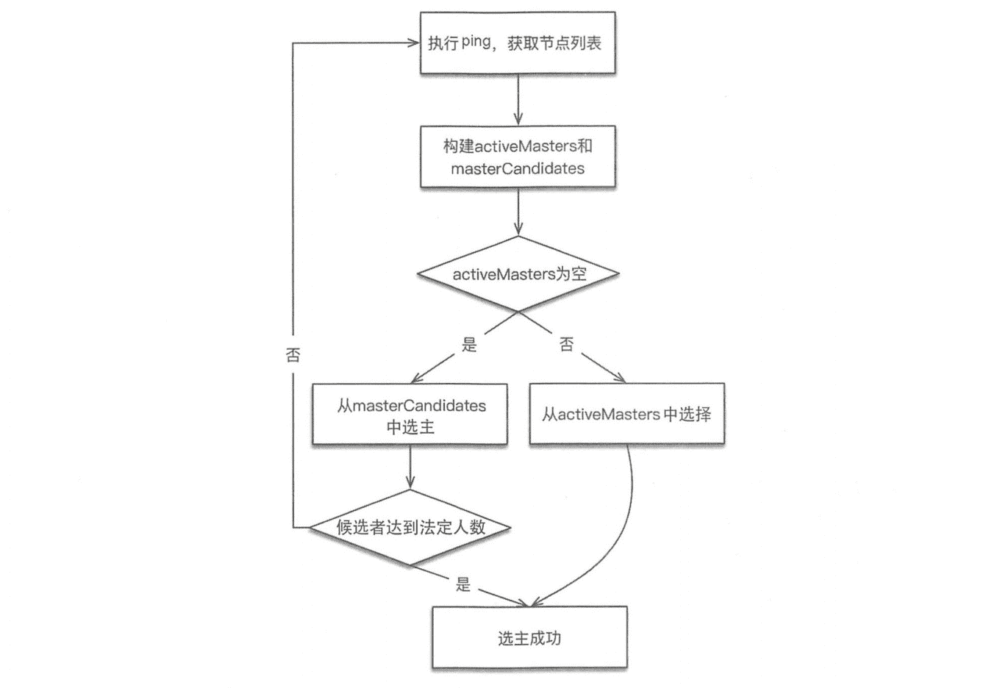

# 《Elasticsearch 源码解析与优化实战》第 5 章：选主流程

> 原文：[https://cloud.tencent.com/developer/article/1831817](https://cloud.tencent.com/developer/article/1831817)

# 简介

Discovery 模块负责发现集群中的节点，以及选择主节点。ES 支持多种不同 Discovery 类型选择，内置的实现称为 Zen Discovery,其他的包括公有云平台亚马逊的 EC2、谷歌的 GCE 等。

本章讨论内置的 Zen Discovery 实现。Zen Discovery 封装了节点发现(Ping)、选主等实现过程，现在我们先讨论选主流程，在后面的章节中整体性介绍 Discovery 模块。

# 设计思想

所有分布式系统都需要以某种方式处理一致性问题。一般情况下，可以将策略分为两组：试图避免不一致及定义发生不一致之后如何协调它们。后者在适用场景下非常强大，但对数据模型有比较严格的限制。因此这里研究前者，以及如何应对网络故障。

# 为什么使用主从模式

除主从(Leader/Follower) 模式外，另一种选择是分布式哈希表(DHT)，可以支持每小时数千个节点的离开和加入，其可以在不了解底层网络拓扑的异构网络中工作，查询响应时间大约为 4 到 10 跳(中转次数)，例如，Cassandra 就使用这种方案。但是在相对稳定的对等网络中，主从模式会更好。

ES 的典型场景中的另一个简化是集群中没有那么多节点。通常，节点的数量远远小于单个节点能够维护的连接数，并且网络环境不必经常处理节点的加入和离开。这就是为什么主从模式更合适 ES。

# 选举算法

在主节点选举算法的选择上，基本原则是不重复造轮子。最好实现一个众所周知的算法，这样的好处是其中的优点和缺陷是已知的。ES 的选举算法的选择上主要考虑下面两种。

## Bully 算法

Leader 选举的基本算法之一。**它假定所有节点都有一个唯一的 ID，使用该 ID 对节点进行排序。任何时候的当前 Leader 都是参与集群的最高 ID 节点。**该算法的优点是易于实现。但是，当拥有最大 ID 的节点处于不稳定状态的场景下会有问题。例如，Master 负载过重而假死，集群拥有第二大 ID 的节点被选为新主，这时原来的 Master 恢复，再次被选为新主，然后又假死......

ES 通过推迟选举，直到当前的 Master 失效来解决上述问题，只要当前主节点不挂掉，就不重新选主。但是容易产生脑裂(双主)，为此，再通过“法定得票人数过半”解决脑裂问题。

## Paxos 算法

Paxos 非常强大，尤其在什么时机，以及如何进行选举方面的灵活性比简单的 Bully 算法有很大的优势，因为在现实生活中，存在比网络连接异常更多的故障模式。但 Paxos 实现起来非常复杂。

# 相关配置

与选主过程相关的重要配置有下列几个，并非全部配置。

`discovery.zen.minimum_master_nodes`：最小主节点数，这是防止脑裂、防止数据丢失的极其重要的参数。这个参数的实际作用早已超越了其表面的含义。除了在选主时用于决定“多数”，还用于多处重要的判断，至少包含以下时机：

*   触发选主：进入选主的流程之前，参选的节点数需要达到法定人数。
*   决定 Master：选出临时的 Master 之后，这个临时 Master 需要判断加入它的节点达到法定人数，才确认选主成功。
*   gateway 选举元信息：向有 Master 资格的节点发起请求，获取元数据，获取的响应数量必须达到法定人数，也就是参与元信息选举的节点数。
*   Master 发布集群状态：发布成功数量为多数。

为了避免脑裂，它的值应该是半数以上(quorum)：`(master_eligible_nodes /2)+1`

```java
例如：如果有 3 个具备 Master 资格的节点，则这个值至少应该设置为(3/2) + 1=2。

该参数可以动态设置:
PUT /_cluster/settings
{
    "persistent" : {
        "discovery.zen.minimum master_nodes" : 2 
    }
}
```

`discovery.zen.ping.unicast.hosts`：**集群的种子节点列表，构建集群时本节点会尝试连接这个节点列表，那么列表中的主机会看到整个集群中都有哪些主机。**可以配置为部分或全部集群节点。可以像下面这样指定：

```java
discovery.zen.ping.unicast.hosts:
    - 192.168.1.10:9300
    - 192.168.1.11
    - seeds.mydomain.com
```

默认使用 9300 端口，如果需要更改端口号，则可以在 IP 后手工指定端口。也可以设置一个域名，让该域名解析到多个 IP 地址，ES 会尝试连接这个 IP 列表中的全部地址。

*   `discovery.zen.ping.unicast.hosts.resolve_timeout: DNS`解析超时时间，默认为 5 秒。
*   `discovery.zen.join_timeout`: 节点加入现有集群时的超时时间，默认为 ping_ timeout 的 20 倍。
*   `discovery.zen.join_retry_attemptsjoin_timeout`：超时之后的重试次数,默认为 3 次。
*   `discovery.zen.join_retry_delayjoin_timeout`：超时之后，重试前的延迟时间，默认为 100 毫秒。
*   `discovery.zen.master_election.ignore_non_master_ pings`：设置为 true 时，选主阶段将忽略来自不具备 Master 资格节点(node.master: false)的 ping 请求，默认为 false。
*   `discovery.zen.fd.ping_interval`：故障检测间隔周期，默认为 1 秒。
*   `discovery.zen.fd.ping_timeout`：故障检测请求超时时间，默认为 30 秒。
*   `discovery.zen.fd.ping_retries`：故障检测超时后的重试次数，默认为 3 次。

# 流程概述

ZenDiscovery 的选主过程如下：

*   **每个节点计算最小的已知节点 ID，该节点为临时 Master。向该节点发送领导投票。**
*   **如果一个节点收到足够多的票数，并且该节点也为自己投票，那么它将扮演领导者的角色，开始发布集群状态。**
*   **所有节点都会参与选举，并参与投票，但是，只有有资格成为 Master 的节点(node.maste 为 true)的投票才有效。**

获得多少选票可以赢得选举胜利，就是所谓的法定人数。在 ES 中，法定大小是一个可配置的参数。配置项: `discovery.zen.minimum master_ nodes`。 为了避免脑裂，最小值应该是有 Maste 资格的节点数 n/2+1。

# 流程分析

整体流程可以概括为：

*   **选举临时 Master；**
*   **投票-确认 Master，如果本节点当选，则等待确立 Master，如果其他节点当选，则尝试加入集群，然后启动节点失效探测器；**
*   **失效节点探测；**

具体如下图所示。

<figure class=""></figure>

执行本流程的线程池: generic。

下面我们具体分析每个步骤的实现。

## 选举临时 Maste

选举过程的实现位于`ZenDiscovery#findMaster`。 该函数查找当前集群的活跃 Master，或者从候选者中选择新的 Master。如果选 主成功，则返回选定的 Master，否则返回空。

为什么是临时 Master？因为还需要等待下一个步骤，该节点的得票数足够时，才确立为真正的 Master。

临时 Master 的选举过程如下:

*   **“ping”所有节点，获取节点列表 fullPingResponses， ping 结果不包含本节点，把本节点单独添加到 fullPingResponses 中。**
*   **构建两个列表。**

**activeMasters 列表：存储集群当前活跃 Master 列表。**遍历第一步 获取的所有节点，将每个节点所认为的当前 Master 节点加入 activeMasters 列表中(不包括本节点)。在遍历过程中，如果配置了`discovery.zen.master_election.ignore_non_master_pings` 为 true ( 默认为 false)，而节点又不具备 Master 资格，则跳过该节点。

具体流程如下图所示。

<figure class=""></figure>

这个过程是将集群当前已存在的 Master 加入 activeMasters 列表，正常情况下只有一个。如果集群已存在 Master，则每个节点都记录了当前 Master 是哪个，考虑到异常情况下，可能各个节点看到的当前 Master 不同。在构建 activeMasters 列表过程中，如果节点不具备 Master 资格，则可以通过`ignore_non_master_pings` 选项忽略它认为的那个 Master。

**masterCandidates 列表：存储 master 候选者列表。**遍历第一步获取列表，去掉不具备 Maste 资格的节点，添加到这个列表中。如果 activeMasters 为空，则从 masterCandidates 中选举，结果可能选举成功，也可能选举失败。如果不为空，则从 activeMasters 中选择最合适的作为 Master。

整体流程如下图所示。

<figure class=""></figure>

### 从 masterCandidates 中选主

与选主的具体细节实现封装在 ElectMasterService 类中，例如，判断候选者是否足够，选择具体的节点作为 Master 等。

从 masterCandidates 中选主时，首先需要判断当前候选者人数是否达到法定人数，否则选主失败。

```java
public boolean hasEnoughCandidates (Collection<MasterCandidate> candidates) {
    //候选者为空，返回失败
    if (candidates.isEmpty()) {
        return false;
    }
    //默认值为-1， 确保单节点的集群可以正常选主
    if (minimumMasterNodes < 1) {
        return true;
    }
    return candidates .size () >= minimumMasterNodes;
}
```

当候选者人数达到法定人数后，从候选者中选一个出来做 Master：

```java
public MasterCandidate electMaster (Collection<MasterCandidate> candidates) {
    List<MasterCandidate> sortedCandidates = new ArrayList<> (candidates);
    //通过自定义的比较函数对候选者节点从小到大排序
    sortedCandidates.sort (MasterCandidate :: compare);
    //返回最新的作为 Master
    return sortedCandidates.get(0);
}
```

可以看出这里只是将节点排序后选择最小的节点作为 Master。但是排序时使用自定义的比较函数 MasterCandidate::compare，早期的版本中只是对节点 ID 进行排序，现在会优先把集群状态版本号高的节点放在前面。

使用默认比较函数的情况下，sort 结果为从小到大排序。参考 Long 类型的比较函数的实现：

```java
public static int compare (1ong X，long y) {
    return(x<y)?-1:((x==y)?0:1);
}

自定义比较函数的实现:
public static int compare(MasterCandidate cl, MasterCandidate c2) {
    //先比较集群状态版本，注意此处 c2 在前，c1 在后
    int ret = Long.compare(c2.clusterStateVersion, c1.clusterStateVersion);
    //如果版本号相同，则比较节点 ID
    if(ret==0){
        ret = compareNodes (c1.getNode()，c2.getNode());
    }
    return ret;
}
```

节点比较函数 compareNodes 的实现：对于排序效果来说，如果传入的两个节点中，有一个节点具备 Master 资格，而另一个不具备，则把有 Master 资格的节点排在前面。如果都不具备 Master 资格，或者都具备 Master 资格，则比较节点 ID。

但是，masterCandidates 列表中的节点都是具备 Master 资格的。compareNodes 比较函数的两个 if 判断是因为在别的函数调用中会存在节点列表中可能存在不具备 Master 资格节点的情况。因此此处只会比较节点 ID。

```java
private static int compareNodes (DiscoveryNode o1, DiscoveryNode o2) {
    //两个 if 处理两节点中一个具备 Master 资格而另一个不具备的情况
    if (o1.isMasterNode() && !o2.isMasterNode () ) {
        return -1;
    }
    if (!o1.isMasterNode() && o2.isMasterNode()) {
        return 1;
    }
    //通过节点 ID 排序
    return o1.getId().compareTo(o2.getId());
}
```

从 activeMasters 列表中选择列表存储着集群当前存在活跃的 Master，从这些已知的 Master 节点中选择一个作为选举结果。选择过程非常简单，取列表中的最小值，比较函数仍然通过 compareNodes 实现，activeMasters 列表中的节点理论情况下都是具备 Master 资格的。

```java
public DiscoveryNode tieBreakActiveMasters (Collection<DiscoveryNode> activeMasters)
    return activeMasters.stream().min(ElectMasterService ::compareNodes).get();
}
```

## 投票与得票的实现

在 ES 中，发送投票就是发送加入集群(JoinRequest)请求。得票就是申请加入该节点的请求的数量。收集投票，进行统计的实现在`ZenDiscovery#handleJoinRequest`方法中，收到的连接被存储到`ElectionContext#joinRequestAccumulator`中。当节点检查收到的投票是否足够时，就是检查加入它的连接数是否足够，其中会去掉没有 Master 资格节点的投票。

```java
public synchronized int getPendingMasterJoinsCount() {
    int pendingMasterJoins = 0;
    //遍历当前收到的 join 请求
    for (DiscoveryNode node : joinReques tAccumulator .keySet()) {
        //过滤不具备 master 资格的节点
        if (node. isMasterNode()) {
            pendingMasterJoins++;
        }
    }
    return pendingMasterJoins;
}
```

## 确立 Master 或加入集群

选举出的临时 Master 有两种情况：该临时 Master 是本节点或非本节点。为此单独处理。现在准备向其发送投票。

**如果临时 Master 是本节点：**

*   **等待足够多的具备 Master 资格的节点加入本节点(投票达到法定人数)，以完成选举。超时(默认为 30 秒，可配置)后还没有满足数量的 join 请求，则选举失败，需要进行新一轮选举。**
*   **成功后发布新的 clusterState。**

**如果其他节点被选为 Master：**

*   **不再接受其他节点的 join 请求。**
*   **向 Master 发送加入请求，并等待回复。超时时间默认为 1 分钟(可配置)，如果遇到异常，则默认重试了 3 次(可配置)。这个步骤在 joinElectedMaster 方法中实现。**
*   **最终当选的 Master 会先发布集群状态，才确认客户的 join 请求，因此, joinElectedMaster 返回代表收到了 join 请求的确认，并且已经收到了集群状态。本步骤检查收到的集群状态中的 Master 节点如果为空，或者当选的 Master 不是之前选择的节点，则重新选举。**

# 节点失效检测

到此为止，选主流程已执行完毕，Master 身份已确认，非 Master 节点已加入集群。节点失效检测会监控节点是否离线，然后处理其中的异常。失效检测是选主流程之后不可或缺的步骤，不执行失效检测可能会产生脑裂(双主或多主)。在此我们需要启动两种失效探测器：

*   **在 Master 节点，启动 NodesFaultDetection，简称 NodesFD。定期探测加入集群的节点是否活跃。**
*   **在非 Master 节点启动 MasterFaultDetection，简称 MasterFD。定期探测 Master 节点是否活跃。**

**NodesFaultDetection 和 MasterFaultDetection 都是通过定期(默认为 1 秒)发送的 ping 请求探测节点是否正常的，当失败达到一定次数(默认为 3 次)，或者收到来自底层连接模块的节点离线通知时，开始处理节点离开事件。**

## NodesFaultDetection 事件处理

**检查一下当前集群总节点数是否达到法定节点数(过半)，如果不足，则会放弃 Master 身份，重新加入集群。**为什么要这么做?设想下面的场景，如下图所示。

<figure class=""></figure>

假设有 5 台机器组成的集群产生网络分区，2 台组成一组，另外 3 台组成一组，产生分区前，原 Master 为 Node1。此时 3 台一组的节点会重新选举并成功选取 Noded3 作为 Master，会不会产生双主?`NodesFaultDetection`就是为了避免上述场景下产生双主。

对应事件处理主要实现如下：在`ZenDiscovery#handleNodeFailure`中执行`NodeRemoval-ClusterStateTaskExecutor#execute`。

```java
public ClusterTasksResult<Task> execute (final ClusterState currentState, final List<Task> tasks) throws Exception {
    //判断剩余节 点是否达到法定人数
    if (electMasterService.hasEnoughMasterNodes (remainingNodesClusterState.nodes()) == false) {
        final int masterNodes = electMas terService.countMasterNodes(remainingNodesClusterState.nodes());
        rejoin.accept(LoggerMessageFormat.format("not enough master nodes(has [{}]， but needed [{}])", masterNodes, electMasterService.minimumMasterNodes()));
        return resultBuilder .build (currentState) ;
    } else {
        return resultBuilder.build (allocationService.deassociateDeadNodes(remainingNodesClusterState, true, describeTasks(tasks)));
    }
}
```

**主节点在探测到节点离线的事件处理中，如果发现当前集群节点数量不足法定人数，则放弃 Master 身份，从而避免产生双主。**

## MasterFaultDetection 事件处理

**探测 Master 离线的处理很简单，重新加入集群。**本质上就是该节点重新执行一遍选主的流程。对应事件处理主要实现如下: `ZenDiscovery#handleMasterGone`

```java
private void handleMasterGone (final DiscoveryNode masterNode, final Throwable cause, final String reason) {
    synchronized(stateMutex) {
        if (localNodeMaster() == false && masterNode.equals (committedState.get().nodes ().getMasterNode())) {
            pendingStatesQueue.failAllStatesAndClear (new ElasticsearchException("master left[[)]", reason));
            //重新加入集群
            rejoin ("master left (reason = " + reason + ")");
        }
    }
}
```

# 小结

**选主流程在集群中启动，从无主状态到产生新主时执行，同时集群在正常运行过程中，Master 探测到节点离开，非 Master 节点探测到 Master 离开时都会执行。**