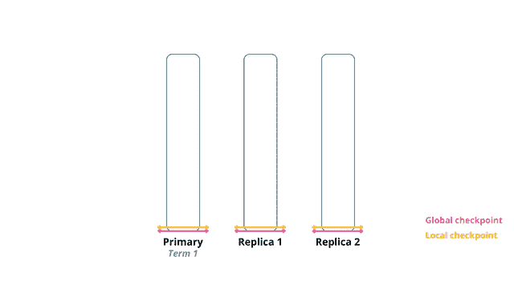

# 《Elasticsearch 源码解析与优化实战》第 6 章：数据模型

> 原文：[https://cloud.tencent.com/developer/article/1765826](https://cloud.tencent.com/developer/article/1765826)

# 简介

Elasticsearch（ES）可用于全文检索、日志分析、指标分析、APM 等众多场景，而且搭建部署容易，后期弹性扩容、故障处理简单。ES 在一定程度上实现了一套系统支持多个场景的希望，大幅度降低使用多套专用系统的运维成本（当然 ES 不是万能的，不能满足事务等场景）。正是因为其通用性和易用性，ES 自 2010 年发布首个版本以来得到爆发式的发展，广泛应用于各类互联网公司的不同业务场景。

 ES 使用开源的 Lucene 作为存储引擎，它赋予 ES 高性能的数据检索能力，但 Lucene 仅仅是一个单机索引库。ES 基于 Lucene 进行分布式封装，以支持集群管理、分布式查询、聚合分析等功能。从使用的直观感受看，ES 按照下图方式实现了分布式查询：

<figure class=""></figure>

QUERY_THEN_FETCH：这是最常用的查询类型，可以完成大多数的分布式查询和聚合分析功能。在这类查询中，协调节点实际需要向其他节点分发两轮任务，也就说前面流程图描述的任务分发阶段（2&3）会有两轮，具体如下：

*   **`Query Phase`：进行分片粒度的数据检索和聚合，注意此轮调度仅返回文档`id`集合，并不返回实际数据。**
    *   **协调节点：解析查询后，向目标数据分片发送查询命令。**
    *   **数据节点：在每个分片内，按照过滤、排序等条件进行分片粒度的文档 id 检索和数据聚合，返回结果。**
*   **`Fetch Phase`：生成最终的检索、聚合结果。**
    *   **协调节点：归并`Query Phase`的结果，得到最终的文档`id`集合和聚合结果，并向目标数据分片发送数据抓取命令。**
    *   **数据节点：按需抓取实际需要的数据内容。**

QUERY_AND_FETCH：**对于查询仅涉及单个分片的场景，ES 会自动对查询流程做优化，在数据节点进行`Query Phase`的最后，直接执行`Fetch`操作。**此类查询为 QUERY_AND_FETCH。通过去除一轮任务调度优化查询性能，优化过程由 ES 自动完成，用户不感知。

DFS_QUERY_THEN_FETCH：这类查询用于解决 ES 在多分片、少数据量的场景下计算相关度不准确的问题：以 TF/IDF 算法为例，ES 在计算相关度时仅考虑单个分片内的 IDF，可能导致查询结果中，类似的文档因为在不同分片而相关度大为不同的问题。此时可以使用此类查询，在 QUERY_THEN_FETCH 之前再增加一轮任务调度，用于计算分布式的 IDF。但通常情况下，局部和全局 IDF 的差异会随着索引里文档数的增多渐渐消失，在真实世界的数据量下，这个问题几乎没有影响，没有必要使用此类查询增加一轮任务调度的开销。

```java
$ curl -XGET 'localhost:9200/startswith/test/_search?pretty=true&search_type=dfs_query_then_fetch' -d '{        "query": {        "match_phrase_prefix": {           "title": {             "query": "d",             "max_expansions": 5           }         }       }     }' | grep title       "_score" : 1.9162908, "_source" : {"title":"dzone"}      "_score" : 1.9162908, "_source" : {"title":"data"}      "_score" : 1.9162908, "_source" : {"title":"drunk"}      "_score" : 1.9162908, "_source" : {"title":"drive"}
```

# **PacificA 算法**

ES 的数据副本模型基于主从模式，在实现过程中参考了微软的 PacificA [pəˈsɪfɪk]算法（借鉴了其中部分思想，并非完全按照这个模型实现，我们先看一下 PacificA 算法的几个特点）。

*   Replica Group：一个互为副本的数据集合称为副本组，其中只有一个副本是主数据（Primary），其他为从数据（Secondary）。
*   Configuration：配置信息中描述了一个副本组都有哪些副本，Primary 是谁，以及他们位于哪个节点。
*   Configuration Version：配置信息的版本号，每次发生变更时递增。
*   Serial Number：代表每个写操作的顺序，每次写操作时递增，简称 SN。每个主分片节点维护自己的递增 SN。
*   Prepare List：写操作的准备序列。存储来自外部请求的列表，将请求按照 SN 排序，向列表中插入的序列号必须大于列表中最大的 SN，每个副本上都有自己的 Prepare List。
*   Committed List：写操作的提交列表。

## 数据副本策略

分片副本使用主存模式。多个副本中存在一个主分片和多个副本分片。所有的数据写入操作都是进入主分片，当主分片出现故障无法访问时，系统从其他副本分片中选择合适的副本作为新的主分片。

数据写入流程如下：

1.  写请求进入主分片节点，节点为该写操作分配 SN，使用该 SN 创建 UpdateRequest 结构。然后将该 UpdateRequest 插入自己的 Prepare List。
2.  主分片将携带 SN 的 UpdateRequest 发送到副本分片节点，副本分片节点收到后同样插入到自己的 Prepare List，完成后给主分片节点回复一个 ACK。
3.  一旦主分片节点收到所有副本分片节点的响应，确定该数据已经被正确写入所有副本节点，此时认为可以提交了。将此 UpdateRequest 放入 Committed List，Committed List 向前移动。
4.  主分片节点恢复客户端更新成功完成。对每一个 Prepare 消息，主分片节点向副本分片节点发送一个 commit 通知，告诉它们自己的 committed point 位置，副本分片节点收到通知后根据指示移动 committed point 到相同位置。

因为主分片只有在所有副本将请求添加进 Prepare List 之后才可以通过移动 committed point 的方式将该请求插入 Committed List 中，因此主分片的 Committed List 是任何一个副本分片的 Prepare List 的前缀（或者称为前缀）。例如，副本分片 Prepare List 的 SN 为 1、2、3、4；主分片 Committed List 中 SN 一定不会大于 4，如 1、2、3。

同时，因为一个副本分片只有在主分片将一个请求添加进 Committed List 后才会把同样的请求添加进 Committed List 中，因此一个副本分片上的 Committed List 是主分片上 Committed List 的前缀。

## **配置管理**

全局的配置管理器负责管理所有副本组的配置。节点可以向管理器提出添加/移除副本的请求，每次请求都需要附带当前配置的版本号，只有这个版本号和管理器记录的版本号一致才会被执行，如果请求成功，则这个新配置会被赋予新的版本号。

## **错误检测**

分布式系统经常存在网络分区、节点离线等异常。全局的配置管理器维护权威配置信息。但其他各节点上的配置信息不一定同步，我们必须处理旧的主副本和新的主副本同时存在的情况。旧的主副本可能没有意识到重新分配了一个新的主副本，从而违反了强一致性。PacificA 使用了租约（lease）机制来解决这个问题。

主副本定期向其他从副本获取租约。这个过程中可能产生两种情况:

*   如果主副本节点在一定时间内(lease period)未收到从副本节点的租约回复，则主副本节点认为从副本节点异常，向配置管理器汇报，将该异常从副本从副本组中移除，同时，它也将自己降级，不再作为主副本节点。
*   如果从副本节点在一定时间内(grace period) 未收到主副本节点的租约请求，则认为主副本异常，向配置管理器汇报，将主副本从副本组中移除，同时将自己提升为新的主。如果存在多个从副本，则哪个从副本先执行成功，哪个从副本就被提升为新主。

假设没有时钟漂移，只要 grace period≥lease period，则租约机制就可以保证主副本会比任意从副本先感知到租约失效。同时任何一个从副本只有在它租约失效时才会争取去当新的主副本，因此保证了新主副本产生之前，旧的主分片已降级，不会产生两个主副本。

其他系统也经常将租约机制作为故障检测手段，如 GFS、Bigtable.

PacificA 算法的这些概念对应在 ES 中：

*   Master 负责维护索引元信息，类似配置管理器维护配置信息。
*   集群状态中的 routing_table 存储了所有索引、索引有哪些 shard、各自的主分片，以及位于哪个节点等信息，类似副本组。
*   SequenceNumber 和 Checkpoint 类似 PacificA 算法中的 Serial Number 和 Comited Point。

# 数据副本模型

[https://www.elastic.co/guide/en/elasticsearch/reference/6.3/docs-replication.html](https://www.elastic.co/guide/en/elasticsearch/reference/6.3/docs-replication.html)

**`ES`中的每个索引都会被拆分为多个分片，并且每个分片都有多个副本，这些副本称为 replication group(副本组，与 PaificA 中的副本组概念一致)， 并且在删除或添加文档的时候，各个副本之间必须同步。否则，从不同副本中读取的数据会不一致。**我们把保持分片副本之间的同步，以及从中读取的过程称为数据副本模型(data replication model)。

**ES 的数据副本模型基于主备模式(`primary-backup model`)，主分片是所有索引操作的入口。它负责验证索引操作是否有效。一旦主分片接受一个索引操作，主分片的副分片也会接受该操作。**

## 基本写入模型

**每个索引操作首先会使用`routing`参数解析到副本组，通常基于文档`ID`。一且确定副本组，就会内部转发该操作到分片组的主分片中。主分片负责验证操作和转发它到其他副分片。`ES`维护一个可以接收该操作的分片的副本列表。这个列表叫作同步副本列表(`in-sync copies`)，并由`Master`节点维护。**正如它的名字，这个“良好的”分片副本列表中的分片，都会保证已成功处理所有的索引和删除操作，并给用户返回 ACK。主分片负责维护不变性（各个副本保持一致），因此必须复制这些操作到这个列表中的每个副本。

写入过程遵循以下基本流程：

1.  **客户端发送索引请求到达协调节点，协调节点先验证操作，如果有错就拒绝该操作。然后根据当前集群状态，请求被路由到主分片所在节点。**
2.  **该索引操作在主分片上本地执行，例如，索引、更新或删除文档。这也会验证字段的内容，如果未通过就拒绝操作(例如，字段串的长度超出`Lucene`定义的长度)。**
3.  **主分片操作成功执行后， 转发该操作到当前`in-syne`副本组的所有副分片。 如果有多个副分片，则会并行转发。**
4.  **一旦所有的副分片成功执行操作并回复主分片，主分片会把请求执行成功的信息返回给协调节点，协调节点返回给客户端。**

**`Lucene`仅支持对文档的整体更新，`ES`为了支持局部更新，在`Lucene`的`Store`索引中存储了一个`_source`字段，该字段的`key`值是文档`ID`， 内容是文档的原文。当进行更新操作时先从`_source`中获取原文，与更新部分合并后，再调用`lucene API`进行全量更新。** 对于写入了 ES 但是还没有 refresh 的文档，可以从 translog 中获取。另外为了防止读取文档过程后执行更新前有其他线程修改了文档，ES 增加了版本机制，当执行更新操作时发现当前文档的版本与预期不符，则会重新获取文档再更新。

## 写故障处理

写入期间可能会发生很多错误一硬盘损坏、 节点离线，或者某些配置错误，这些错都可能导致无法在副分片上执行某个操作，虽然这比较少见，但是主分片必须汇报这些错误信息。

**对于主分片自身错误的情况，它所在的节点会发送一个消息到`Master`节点，同时将有问题的分片从`in-sync replica set`中移除。这个索引操作会等待(默认为最多一分钟) `Master`节点提升一个副分片为主分片。 这个操作会被转发给新的主分片。注意，`Master`同样会监控节点的健康，并且可能会主动降级主分片。这通常发生在主分片所在的节点离线的时候。**

在主分片上执行的操作成功后，该主分片必须处理在副分片上潜在发生的错误。错误发生的原因可能是在副分片上执行操作时发生的错误，也可能是因为网络阻塞，导致主分片无注转发操作到副分片，或者副分片无法返回结果给主分片。这些错误都会导致相同的结果：**`in-syne replica set`中的一个分片丢失一个即将要向用户确认的操作。为了避免出现不一致，主分片会发送一条消息到`Master`节点，要求它把有问题的分片从`in-sync replica set`中移除。一旦`Master`确认移除了该分片，主分片就会确认这次操作。注意，`Master`也会指导另一个节点建立个新的分片副本，以便把系统恢复成健康状态。**

**在转发请求到副分片时，主分片会使用副分片来验证它是否仍是一个活跃的主分片。如果主分片因为网络原因(或很长时间的`GC`)被隔离，则在它意识到被降级之前可能会继续处理传入的索引操作。来自陈旧的主分片的操作将会被副分片拒绝。当它接收来自副分片的拒绝其请求的响应时，它将会访问一下`Master`节点， 然后就会知道自己已被替换。最后将操作路由到新的主分片。**

如果没有副分片呢，出现这种场景可能是因为索引配置或所有副分片都发生故障。在这种情况下，主分片处理的操作没有经过任何外部验证，可能会导致问题。另方面，主分片节点将副分片失效的消息告知主节点，主节点知道主分片是唯可用的副本。 因此我们确保主节点不会提升任何其他分片副本(过时的)为主分片，并且索引到主分片上的任何操作都不会丢失。当然，由于只运行单个数据副本，当物理硬件出问题时可能会丢失数据。可以使用 [wait for active shards](https://www.elastic.co/guide/en/elasticsearch/reference/6.3/docs-index_.html#index-wait-for-active-shards) 缓解此类问题。

**在写操作返回应答之前读取：主分片首先在本地进行索引，然后转发请求，由于主分片已经写成功，因此在并行的读请求中，有可能在写请求返回成功之前就可以读取更新的内容。**

## 基本读取模型

通过 ID 读取是非常轻量级的操作，而一个巨大的复杂的聚合查询请求需要消耗大量 CPU 和内存资源。主从模式的一个好处是保证所有的分片副本都是一致的(正在执行的操作例外)。因此，单个 in-sync 中的某个副本也可以提供服务。

当一个读请求被节点接收，这个节点负责转发它到其他涉及相关分片的节点，并整理响应结果发送给客户端。接收用户请求的这个节点称为协调节点。

基本流程如下:

1.  **把读请求发送到相关分片。 注意，因为大多数搜索都会发送到一个或多个索引，通常需要从多个分片中读取， 每个分片都保存这些数据的一部分。**
2.  **从副本组中选择一个相关分片的活跃副本。它可以是主分片或副分片。默认情况下，ES 会简单地循环遍历这些分片。**
3.  **发送分片级的读请求到被选中的副本。**
4.  **协调节点合井结果并给客户端返回响应。注意，针对通过`ID`查找的`get`请求，会跳过这个步骤，因为只有一个相关的分片。**

### 1\. 检索数据过程

*   **客户端发送请求到一个`coordinate node`**
*   **协调节点将搜索请求转发到数据节点，该数据节点包含索引所有的 shard 对应的`primary shard` 或 `replica shard` 上**
*   `**query phase**`**：数据节点上的每个 shard 将自己的搜索结果（其实就是一些** `**doc id**` **）返回给协调节点，由协调节点进行数据的合并、排序、分页等操作，产出最终结果。**
*   `**fetch phase**`**（读数据过程）：接着由协调节点根据**`**doc id**` **去各个数据节点上拉取实际的**`**doc**`**数据，最终返回给客户端。**

### 2\. 读数据过程

可以通过`doc id`来查询，会根据`doc id`进行 `hash`，判断出来当时把`doc id` 分配到了哪个 `shard` 上面去，从那个 `shard` 去查询。

1.  **客户端发送请求到任意一个`coordinate node`**
2.  **协调节点 对 doc id 进行哈希路由，将请求转发到对应的数据节点，此时会使用` round-robin`随机轮训算法，在`primary shard` 以及其所有`replica node`中随机选择一个，让读请求负载均衡**
3.  **接收请求的数据节点返回 doc 给 `coordinate node` ，`coordinate node`返回 doc 给客户端**

## 读故障处理

**当分片不能响应一个读请求时，协调节点会从副本组中选择另一个副本，将请求转发给它。没有可用的分片副本会导致重复的错误。在某些情况下，例如，`_search`，`ES`倾向于尽早响应，即使只有部分结果，也不等待问题被解决(可以在响应结果的`shards`字段中检查本次结果是完整的还是部分的)。**

**高效读取：在正常操作下，读操作在相关副本组中只执行一次。只有在出错的时候，才会在同一个分片的不同副本中执行多次。**

# Allocation IDs

[https://www.elastic.co/cn/blog/tracking-in-sync-shard-copies](https://www.elastic.co/cn/blog/tracking-in-sync-shard-copies)

ES 从 5.x 版本开始引入 Allocation（ [ˌæləˈkeɪʃn]分配，配置；安置） IDs 的概念，用于主分片选举策略。**每个分片有自己唯一的`Allocation ID`，同时集群元信息中有一个列表，记录了哪些分片拥有最新数据（`in-sync`同步分片标识列表）。**

ES 通过在集群中保留多个数据副本的方式提供故障转移功能，当出现网络分区或节点挂掉时，更改操作可能无法在所有副本上完成，此时我们希望把写失败的副本标记出来。

**ES 的数据副本模型会假定其中一个数据副本为权威副本，称之为主分片。所有的索引操作写主分片，完成后，主分片所在节点会负责把更改转发到活跃的备份副本，称之为副分片。如果当前主分片临时或永久地变为不可用状态，则另一个分片副本将被提升为主分片。因为主分片是权威的数据副本，因此在这个模型中，只把含有最新数据的分片作为主分片是至关重要的。**如果将一个旧数据的分片作为主分片，则它将作为最终副本，从而导致这个副本之后的数据将会丢弃。下面我们介绍如何追踪到那个可以安全地被选为主分片的副本，也称之为同步(in-sync)分片副本。

## 安全地分配主分片

**分片分配就是决定哪个节点应该存储一个活跃分片的过程，构建内容路由表。分片决策过程在`Master`节点完成，并记录在集群状态中，该数据结构还包含了其他元数据，如索引设置及映射。分配决策包含两部分：哪个分片应该分配到哪个节点，以及哪个分片作为主分片，哪些作为副分片。`Master`节点广播集群状态到集群的所有节点。这样每个节点都有了集群状态，它们就可以实现对请求的智能路由。**因为每个节点都知道主副分片分配到了哪里。

**每个节点都会通过检查集群状态来判断某个分片是否可用。如果一个分片被指定为主分片，则这个节点只需要加载本地分片副本，使之可以用于搜索即可。如果一个分片被分配为副分片，则节点首先需要从主分片所在结点复制差异数据。**当集群中可用副分片不足时（在索引设置中指定：`index.number_of_replicas`），主节点也可以将副分片分配到不含任何分片副本的节点，从而指示这些节点创建主分片的完整副本。

在创建新索引时，Master 节点在选择哪个节点作为主分片方面有很大的灵活性，会将集群均衡和其他约束(如分配感知及过滤器)考虑在内。分配已存在的分片副本为主分片是比较少见的情况。例如，集群完全重启(ull restart), 所有分片都是未分配状态，或者短时间内所有活跃副本都变为不可用。在这种情况下，Master 节点询问所有节点，找到磁盘中存在的分片副本，根据找到的副本，决定是否将其中一个作为主分片。为了确保安全，Master 节点必须确保被选为主分片的副本含有最新数据。为此，ES 使用 Allocation IDs 的概念，这是区分不同分片的唯一标识(UUIDS)。

**`Allocation IDs`由`Master`节点在分片分配时指定，并由数据节点存储在磁盘中，紧邻实际的数据分片。`Master`节点负责追踪包含最新数据副本的子集。这些副本集合称为同步分片标识(`in-sync allocation IDs`)，存储于集群状态中。集群状态存在于集群的`Master`节点和所有数据节点。**对集群状态的更改由 zen discovery 模块实现一致性支持。它确保集群中有共同的理解，即哪些分片副本被认为是同步的(in-sync)，隐式地将那些不在同步集合中的分片副本标记为陈旧(stale)。

也就是说，**`Alocation IDs`存储在`shard`级元信息中，每个`shard`都有自己唯一的`Allocation ID`，同时集群级元信息中记录了一个被认为是最新`shard`的`Alocationon ID`集合，这个集合称为`in-sync allocation IDs`。**

**当分配主分片时，`Master`节点检查磁盘中存储的`Allocation ID`是否会在集群状态的`in-sync allocationis IDs`集合中出现，只有在这个集合中找到了，此分片才有可能被选为主分片。**如果活跃副本中的主分片挂了，则 in-sync 集合中的活跃分片会被提升为主分片，确保集群的写入可用性不变。

## 将分配标记为陈旧

在 Elasticsearch 中，数据副本和元信息副本使用不同的副本策略，元信息的改变需要在集群层面达成一致，而数据副本使用简单的主备方法。系统的这两个层面可以使数据副本更简单、更快。只有在特殊情况下才需要与集群一致(consensus) 层交互。处理写请求过程中，当网络产生分区、节点故障，或者部分节点未启动，主分片本地执行完写操作，转发到副分片时，转发操作可能在一个或多个副分片上没能执行成功，这意味着主分片中含有一些没有传播到所有分片的数据，如果这些副分片仍然被认为是同步的，那么即使它们遗漏了一些变化，它们也可能稍后被选为主分片，结果丢失数据。

解决这种问题有两种方法：

*   **让写请求失败，已经写的做回滚处理。**
*   **确保差异的(divergent) 分片不再被视为同步。**

**ES 在这种情况下选择了写入可用性：主分片所在节点命令`Master`节点将差异分片的`Allocations IDs`从同步集合(`in-sync set`)中删除。然后，主分片所在节点等待`Master`节点删除成功的确认消息，这个确认消息意味着集群一致层(`consensus layer`)已成功更新，之后才向客户端确认写请求，这样确保只有包含了所有已确认写入的分片副本才会被主节点选为主分片。**

## 一个例子

我们跟随一个简单的例子(来自官网)来说明上述情况，在一个小型集群中包含一个主节点和两个数据节点。为了保持例子简单，我们创建只有 1 个主分片和 1 个副分片的索引。最初一个数据节点拥有主分片，另一个数据节点拥有副分片。我们使用 cluster state API 来查阅集群状态中的 in-sync 分片信息，并使用“filter path" query 参数过滤出感兴趣的结果：

```java
GET /_cluster/state?filter_path=metadata.indices.my_index.in_sync_allocations.*,routing_table.indices.my_index.*
```

```java
{
  "metadata": {
    "indices": {
      "my_index": {
        "in_sync_allocations": {
          "0": [
            "HNeGpt5aS3W9it3a7tJusg",
            "wP-Z5fuGSM-HbADjMNpSIQ"
          ]
        }
      }
    }
  },
  "routing_table": {
    "indices": {
      "my_index": {
        "shards": {
          "0": [
            {
              "primary": true,
              "state": "STARTED",
              "allocation_id": { "id": "HNeGpt5aS3W9it3a7tJusg" },
              "node": "CX-rFmoPQF21tgt3MYGSQA",
              ...
            },
            {
              "primary": false,
              "state": "STARTED",
              "allocation_id": { "id": "wP-Z5fuGSM-HbADjMNpSIQ" },
              "node": "AzYoyzzSSwG6v_ypdRXYkw",
              ...
            }
          ]
        }
      }
    }
  }
}
```

集群状态显示出主分片和副分片都已启动，主分片分配在数据节点“CX-rFmo”，副分片分配在数据节点“AzYoyz”。它们都有唯一的 allocation id, 同时出现在 in_sync_ allocations 集合中。

让我们看看当关闭主分片所在节点时会发生什么。由于这并不改变分片上的数据，所以两个分片副本应该保持同步。在没有主分片的情况下，副分片也应该被提升为主分片，这些都会反映在集群状态中:

```java
{
  "metadata": {
    "indices": {
      "my_index": {
        "in_sync_allocations": {
          "0": [
            "HNeGpt5aS3W9it3a7tJusg",
            "wP-Z5fuGSM-HbADjMNpSIQ"
          ]
        }
      }
    }
  },
  "routing_table": {
    "indices": {
      "my_index": {
        "shards": {
          "0": [
            {
              "primary": true,
              "state": "STARTED",
              "allocation_id": { "id": "wP-Z5fuGSM-HbADjMNpSIQ" },
              "node": "AzYoyzzSSwG6v_ypdRXYkw",
              ...
            },
            {
              "primary": false,
              "state": "UNASSIGNED",
              "node": null,
              "unassigned_info": {
                "details": "node_left[CX-rFmoPQF21tgt3MYGSQA]",
                ...
              }
            }
          ]
        }
      }
    }
  }
}
```

由于只有一个数据节点，副分片停留在未分配状态。如果我们再次启动第二个节点，则副分片将自动分配在这个节点上。为了使这个场景更有趣，我们不启动第二个节点，相反我们索引一个文档到新提升的主分片中。由于分片副本现在是差异的(diverging), 不活跃的那个副本变为陈旧的，因此它的 ID 被主节点从 in-sync 集合中删除:

```java
{
  "metadata": {
    "indices": {
      "my_index": {
        "in_sync_allocations": {
          "0": [
            "wP-Z5fuGSM-HbADjMNpSIQ"
          ]
        }
      }
    }
  },
  "routing_table": {
    ... // same as in previous step
  }
}
```

现在只剩下一个同步的分片副本，让我们看看如果该副本变为不可用，那么系统将如何处理。为此，我们关闭当前唯一的数据节点，然后启动前一个拥有陈旧分片副本的数据节点，之后 cluster health API 显示 cluser health 为 Red，集群状态显示主分片尚未分配:

```java
{
  "metadata": {
    "indices": {
      "my_index": {
        "in_sync_allocations": {
          "0": [
            "wP-Z5fuGSM-HbADjMNpSIQ"
          ]
        }
      }
    }
  },
  "routing_table": {
    "indices": {
      "my_index": {
        "shards": {
          "0": [
            {
              "primary": true,
              "state": "UNASSIGNED",
              "recovery_source": { "type": "EXISTING_STORE" },
              "unassigned_info": {
                "allocation_status": "no_valid_shard_copy",
                "at": "2017-01-26T09:20:24.054Z",
                "details": "node_left[AzYoyzzSSwG6v_ypdRXYkw]"
              },
              ...
            },
            {
              "primary": false,
              "state": "UNASSIGNED",
              "recovery_source": { "type": "PEER" },
              "unassigned_info": {
                "allocation_status": "no_attempt",
                "at": "2017-01-26T09:14:47.689Z",
                "details": "node_left[CX-rFmoPQF21tgt3MYGSQA]"
              },
              ...
            }
          ]
        }
      }
    }
  }
}
```

让我们再看看`cluster allocation explian API`，这是一个调试分配问题的好工具。运行不带参数的`explain`命令将提供系统找到的第一个未分配分片的说明:

```java
GET /cluster/allocation/explain
```

`explain API`告诉我们为什么主分片处于未分配状态，同时还提供了基于每个节点上的更详细的分配信息。在这个例子中，主节点在集群当前可用节点中无法找到同步的（in-sync）分片副本。

```java
{
  "index" : "my_index",
  "shard" : 0,
  "primary" : true,
  "current_state" : "unassigned",
  "unassigned_info" : {
    "reason" : "NODE_LEFT",
    "at" : "2017-01-26T09:20:24.054Z",
    "last_allocation_status" : "no_valid_shard_copy"
  },
  "can_allocate" : "no_valid_shard_copy",
  "allocate_explanation" : "cannot allocate because all found copies of the shard are either stale or corrupt",
  "node_allocation_decisions" : [
    {
      "node_id" : "CX-rFmoPQF21tgt3MYGSQA",
      "node_name" : "CX-rFmo",
      "transport_address" : "127.0.0.1:9301",
      "node_decision" : "no",
      "store" : {
        "in_sync" : false,
        "allocation_id" : "HNeGpt5aS3W9it3a7tJusg"
      }
    }
  ]
} 
```

该 API 还显示在节点“CY-rFmo”上可用的分片副本是陈旧的(store.in sync = false)。 启动拥有 in-sync 分片副本的那个节点将使集群的状态重新变为 Green。如果那个节点永远都不回来了呢?

## 不会丢失全部

发生严重灾难时，集群中可能会出现只有陈旧副本可用的情况。ES 不会把这些分片自动分配为主分片，集群将持续保持 Red 状态，如果所有 in-sync 副本都消失了，则集群仍有可能使用陈旧副本进行恢复，但这需要管理员手动干预。

正如我们在前面的例子中看到的，理解分片问题的第一步是使用 [cluster allocation explain API](https://www.elastic.co/guide/en/elasticsearch/reference/current/cluster-allocation-explain.html)，它显示节点是否具有分片的副本，以及相应的副本是否处于同步集合中。在文件系统损坏的情况下，它也显示了访问磁盘信息时抛出的异常。在前面的例子中，allocation explain 的输出显示在集群中的节点“CX-rFmo”上找到了现在的分片副本，但该副本未包含最新的数据（in-sync：false）。

[reroute API](https://www.elastic.co/guide/en/elasticsearch/reference/current/cluster-reroute.html)提供了一个子命令 allocate_stale_primary，该子命令用于将陈旧的分片副本分配为主分片。使用此命令意味着丢失给定分片副本中缺少的数据。如果同步分片副本只是暂时不可用，则使用此命名意味着会丢失同步分片副本最近更新的数据。应该把它看做使集群至少运行一些数据的最后一种措施。在所有分片副本都不存在的情况下，还可以强制 ES 使用空分片副本分配主分片，这意味着丢失与该分片相关联的所有先前数据。不言而喻，`allocate_empty_primary`命令只能用于最糟糕的情况，其含义很好理解。

# Sequence IDs

[https://www.elastic.co/cn/blog/elasticsearch-sequence-ids-6-0](https://www.elastic.co/cn/blog/elasticsearch-sequence-ids-6-0)

**Es 从 6.0 开始引入了 `Sequence  [ˈsiːkwəns] IDs` 概念，使用唯一的 ID 来标记每个索引操作。通过这个 id 我们有了索引操作的总排序。**

写操作先到达主分片，主分片写完后转发到副分片，在转发到副分片之前，增加一个计数器，为每个操作分配一个序列号是很简单的。但是，由于节点离线随时可能发生，例如网络分区等，主分片可能被其他副分片取代，仅仅由主分片分配一个序列号无法保证全局唯一性和单调性。因此，**我们把当前主分片做一个标记，放到每个操作中，这就是`Primary  [ˈpraɪməri] Terms`。**这样，来自旧的主分片的迟到的操作就可以被检测到然后拒绝。（虽然 Allocation IDs 可以让主分片分配在拥有最新数据的分片上，但仍然可能存在某些情况下主分片上的数据并非最新，例如手工分配主分片到有旧数据的副本）

## Primary Terms 和 Sequence Numbers

**第一步是能够区分新旧两种主分片，我们必须找到一种方法来识别来自于较旧的主分片操作还是来自较新的主分片的操作。最重要的是，整个集群需要达成一致。为此，我们添加了`primary terms`。它由`Master`节点分配，当一个主分片被提升时，`primary terms`递增。然后持久化到集群状态中，从而表示集群主分片所处的一个版本。**有了 primary terms，操作历史中的任何冲突都可以通过查看操作的 primary terms 来解决。新的 terms 优先于旧 terms，拒绝过时的操作，避免混乱的情况。

**一旦我们有了`primary terms`的保护，我们就可以添加了一个简单的计数器，给每个操作分配一个`sequence number`（序列号）。`sequence number`使我们能够理解发生在主分片节点上的索引操作的特定顺序，接下来讨论`sequence number`带来的各种好处。**你可以在 Response 中看到分配的 sequence number 和 primary term：

```java
 curl -H 'Content-Type: application/json' -XPOST http://127.0.0.1:9200/foo/doc?pretty -d '{ "bar": "baz" }'
{
  "_index" : "foo",
  "_type" : "doc",
  "_id" : "MlDBm10BditXXu4kjj5E",
  "_version" : 1,
  "result" : "created",
  "_shards" : {
    "total" : 2,
    "successful" : 1,
    "failed" : 0
  },
  "_seq_no" : 19,
  "_primary_term" : 1
}
```

我们再次整理下这两个概念：

*   **`Primary Terms`：由`Master`节点分配给每个主分片，每次主分片发生变化时递增。**这和 Raft 中的 term，以及 Zab 中 Viewstamped Replication 的 view-number 概念很相似。
*   **`Sequence Numbers`：标记发生在某个分片上的写操作。由主分片分配，只对写操作分配。**假设索引：website 有 2 个主分片和 1 个副分片，当分片 website[0] 的序列号增加到 5 时，他的主分片离线，副分片被提升为新的主分片，对于后续写操作，序列号从 6 开始递增。分片 website[1]有自己独立的序列号计数器。

**主分片每次向副分片转发写请求时，会带上这两个值。**为了实现将操作排序，当我们比较两个操作 o1 和 o2 时，如果我们说 o1 < o2，那意味着：

```java
s1.seq# < s2.seq#

或者

(s1.seq# == s2.seq# and s1.term < s2.term)

“等于”和以上“大于“以类似的方式定义。
```

## 本地及全局检查点

有了 Primary Terms 和 Sequence Numbers，我们就有了在理论上能够检测出分片之间差异，并在主分片失效时，重新对齐他们的工具。旧主分片就可以恢复为与拥有更高 primary term 值的新主分片一致：从旧主分片中删除新主分片操作历史中不存在的操作，并将缺少的操作索引到旧主分片。

遗憾的是，当你同时为每秒成百上千的事件做索引时，比较数百万个操作的历史是不切实际的。存储成本变得非常昂贵，直接比较的计算工作量太长了。为了解决这个问题，es 维护了一个名为“全局检查点”（global checkpoint）的安全标记。

**全局检查点是所有活跃分片历史都已对齐到的序列号，换句话说，所有低于全局检查点的操作都保证已被所有活跃的分片处理完毕。这意味着，当主分片失效，我们只需要比较新主分片与其他副分片之间的最后一个全局检查点之后的操作。当旧主分片恢复时，我们使用它知道的全局检查点，与新主分片进行比较。这样，我们只有小部分操作需要比较。不用比较全部。**

**主分片负责推进全局检查点，它通过跟踪在副分片上完成的操作来实现。一旦它检测到所有副分片已经超出给定序列号，它将相应地更新全局检查点。副分片不会跟踪所有操作，而是维护一个类似全局检查点局部变量，称为本地检查点。**

本地检查点也是一个序列号，所有序列号低于它的操作都已在该分片上处理（lucene 和 translog 写成功，不一定刷盘）完毕。当副分片确认(ack)一个写操作到主分片节点时，他们也会更新本地检查点。使用本地检查点，主分片节点能够更新全局检查点，然后在下一次索引操作时将其发送到所有分片副本。

全局检测点和本地检查点在内存中维护，但也会保存在每个 lucene 提交的元数据中。

下面演示在写入过程中，全局/本地检查点的更新情况（来自官网）：某索引由 1 个主分片，2 个副分片，初始状态，没有数据，全局检查点和本地检查点都在 0 位置。

<figure class=""></figure>

1.  **主分片写入一条数据成功后，本地检查点向前推进，主分片将写请求转发到副分片**
2.  **副分片本地处理成功后，将本地检查点向前推进**
3.  **主分片收到到所有副分片都处理成功的消息，根据汇报的各副本上的本地检查点，更新全局检查点**
4.  **在下一次索引操作时，主分片节点将全局检查点发送到所有分片副本**

全局检查点还有另外一个很好的属性——它代表了已经保证存盘的操作边界(存储在所有活跃分片中)。如果主分片故障，数据没有来得及复制到副分片，该区域（大于全局检测点的）可以包含可能需要回滚的操作。这是一个微妙而重要的属性，对于未来的更改 API 或跨数据中心复制功能来说至关重要。

## 用于快速恢复（Recovery）

**当`Es`恢复一个分片时，需要保证恢复之后与主分片一致。对于冷数据来说， `synced flush` 可以快速验证副分片与主分片是否相同，但对于热数据来说，恢复过程需要从主分片拷贝整个`Lucene`分段，如果分段很大，这是非常耗时的操作。**

现在，我们使用副本所知道的最后一个全局检查点，重放来着主分片事务日志（`translog`）中的相关更改就可以，也就是说，现在可以计算出待恢复分片与主分片数据的差异范围，因此避免拷贝整个分片。同时，我们多保留一些事务日志（默认 512M，12 小时），直到”太大“或”太老“。如果不能从事务日志重复，再使用旧的恢复模式。

# _version

**每个文档都有一个版本号 (`_version`)，当文档被修改时版本号递增。 `Es`使用这个 `_version` 来确保变更以正确顺序得到执行。如果旧版本的文档在新版本之后到达，它可以被简单的忽略。**例如，索引`recovery` 阶段就利用了这个特性。

**版本号由主分片生成，在将请求转发的副本片时将携带此版本号。**

版本号的另一个作用是实现乐观锁。如同其他数据库的乐观锁一样。我们在写请求中指定文档的版本号，如果文档的当前版本与请求中指定的版本号不同，请求就会失败。

例如（示例来自官网），先写入一条文档：

```java
curl -XPUT 'localhost:9200/website/blog/1/_create?pretty' -H 'Content-Type: application/json' -d'
{
  "title": "My first blog entry",
  "text":  "Just trying this out..."
}
'
获得的响应信息如下：

{
  "_index" : "website",
  "_type" : "blog",
  "_id" : "1",
  "_version" : 1,
  "result" : "created",
  "_shards" : {
    "total" : 2,
    "successful" : 1,
    "failed" : 0
  },
  "_seq_no" : 0,
  "_primary_term" : 5
}
```

响应体中可以看到，这个新创建的文档版本号为 1 。现在假设我们想编辑这个文档，当我们再次更新这个文档时，指定一个版本号：

```java
curl -XPUT 'localhost:9200/website/blog/1?version=1&pretty' -H 'Content-Type: application/json' -d'
{
  "title": "My first blog entry",
  "text":  "Starting to get the hang of this..."
}
'
```

这个更新请求中，只有版本号设置为 1，本次更新才能成功。否则 es 会返回 409 Conflict 状态码。