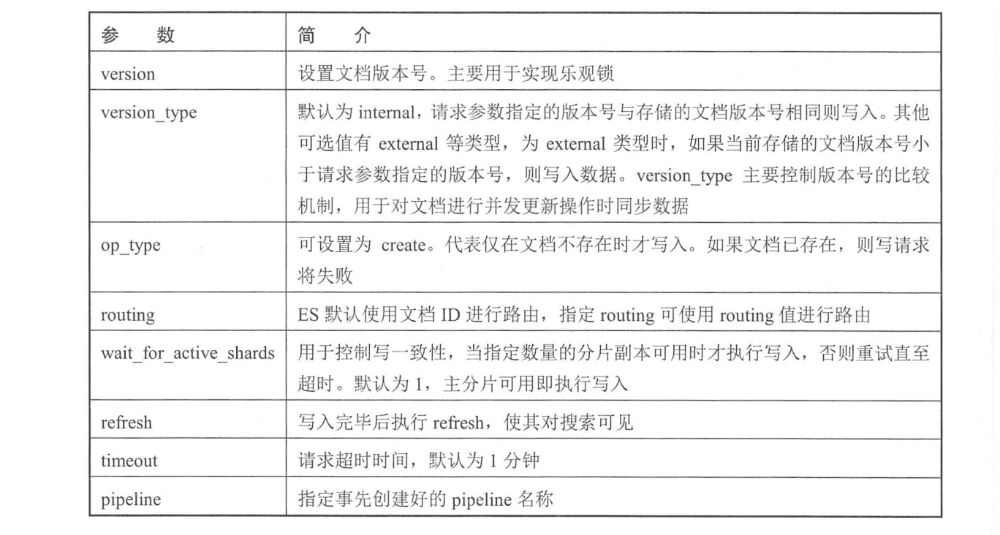
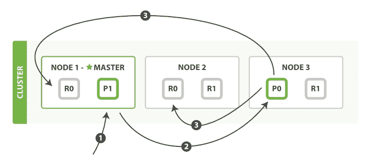
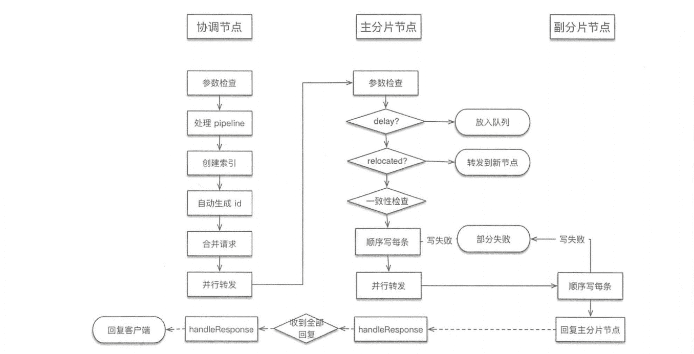
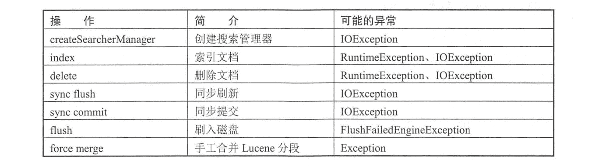

# 《Elasticsearch 源码解析与优化实战》第 7 章：写流程

> 原文：[https://cloud.tencent.com/developer/article/1828243](https://cloud.tencent.com/developer/article/1828243)

# 简介

本章分析 ES 写入单个和批量文档写请求的处理流程，仅限于 ES 内部实现，并不涉及 Lucene 内部处理。在 ES 中，**写入单个文档的请求称为 Index 请求，批量写入的请求称为 Bulk 请求。**写单个和多个文档使用相同的处理逻辑，请求被统一封装为 BulkRequest。

在分析写流程时，我们把流程按不同节点执行的操作进行划分。写请求的例子可以参考上一章。

# 文档操作的定义

在 ES 中，对文档的操作有下面几种类型:

```java
enum OpType {
    INDEX(0),
    CREATE(1)，
    UPDATE(2)，
    DELETE(3);
}
```

*   `INDEX`：向索引中“put”一个文档的操作称为“索引”一个文档。此处“索引”为动词。
*   `CREATE`：put 请求可以通过 op_type 参数设置操作类型为 create, 在这种操作下，如果文档已存在，则请求将失败。
*   `UPDATE`：默认情况下，“put”一个文档时，如果文档已存在，则更新它。
*   `DELETE`：删除文档。

在 put API 中，通过 op_type 参数来指定操作类型。

# 可选参数

Index API 和 Bulk API 有一些可选参数，这些参数在请求的 URI 中指定，例如:

```java
PUT my_index/my_type/my_id?pipeline=my_pipeline_id
    "foo": "bar"
}
```

下面简单介绍各个参数的作用，这些参数在接下来的流程分析中都会遇到，如下表所示。

<figure class=""></figure>

# Index/Bulk 基本流程

新建、索引（这里的索引是动词，指写入操作，将文档添加到 Lucene 的过程称为索引一个文档）和删除请求都是写操作。**写操作必须先在主分片执行成功后才能复制到相关的副分片。**

写单个文档的流程(图片来自官网)如下图所示。.

<figure class=""></figure>

以下是写单个文档所需的步骤：

*   **客户端向 NODE1 发送写请求。**
*   **NODE1 使用文档 ID 来确定文档属于分片 0，通过集群状态中的内容路由表信息获知分片 0 的主分片位于 NODE3，因此请求被转发到 NODE3 上。**
*   **NODE3 上的主分片执行写操作。如果写入成功，则它将请求并行转发到 NODE1 和 NODE2 的副分片上，等待返回结果。当所有的副分片都报告成功，NODE3 将向协调节点报告成功，协调节点再向客户端报告成功。**

在客户端收到成功响应时，意味着写操作已经在主分片和所有副分片都执行完成。

写一致性的默认策略是 quorum，即多数的分片(其中分片副本可以是主分片或副分片)在写入操作时处于可用状态。

```java
quorum = int( (primary + number_of_replicas) / 2 ) + 1
```

# Index/Bulk 详细流程

以不同角色节点执行的任务整理流程如下图所示。

<figure class=""></figure>

下面分别讨论各个节点上执行的流程。

## 协调节点流程

**协调节点负责创建索引、转发请求到主分片节点、等待响应、回复客户端。**实现位于`TransportBulkAction`。执行本流程的线程池：`http_server_worker`。

### 1\. 参数检查

**如同我们平常设计的任何一个对外服务的接口处理一样，收到用户请求后首先检测请求的合法性，把检查操作放在处理流程的第一步，有问题就直接拒绝，对异常请求的处理代价是最小的。**

检查操作进行以下参数检查，如下表所示。

| 

参数

 | 

检查

 |
| --- | --- |
| 

index

 | 

不可为空

 |
| 

type

 | 

不可为空

 |
| 

source

 | 

不可为空

 |
| 

contentType

 | 

不可为空

 |
| 

opТуре

 | 

当前操作类型如果是创建索引，则校验 VersionType 必须为 internal, 且 Version 不可为 MATCH_DELETED

 |
| 

resolvedVersion

 | 

校验解析的 Version 是否合法

 |
| 

versionType

 | 

不可为 FORCE 类型，此类型已废弃

 |
| 

id

 | 

非空时，长度不可大于 512，以及为空时对 versionType 和 resolvedVersion 的检查

 |

每项检查遇到异常都会拒绝当前请求。

### 2\. 处理 pipeline 请求

数据预处理(ingest)工作通过定义 pipeline 和 processors 实现。pipeline 是一系 列 processors 的定义，processors 按照声明的顺序执行。添加一个 pipeline 的简单例子如下:

```java
PUT _ingest/pipeline/my_pipeline_id 
{
    "description" : "describe pipeline",
    "processors" : [
        "set" : {
            "field": "foo",
            "value": "bar"
        }
    ]
}
```

my_pipeline_id 是自定义的 pipeline 名称，processors 中定义了一系列的处理器，本例中只有 set。

**如果 Index 或 Bulk 请求中指定了 pipeline 参数，则先使用相应的 pipeline 进行处理。如果本节点不具备预处理资格，则将请求随机转发到其他具备预处理资格的节点。**预处理节点资格的配置参考第 1 章中的节点角色。

### 3\. 自动创建索引

**如果配置为允许自动创建索引( 默认允许)，则计算请求中涉及的索引，可能有多个，其中有哪些索引是不存在的，然后创建它。**如果部分索引创建失败，则涉及创建失败索引的请求被标记为失败。其他索引正常执行写流程。

**创建索引请求被发送到 Master 节点，待收到全部创建请求的 Response(无论成功还是失败的) 之后，才进入下一个流程。** Master 节点什么时候返回 Response? **在 Master 节点执行完创建索引流程，将新的 clusterState 发布完毕才会返回。**那什么才算发布完毕呢？**默认情况下，Maste 发布 clusterState 的 Request 收到半数以上的节点 Response，认为发布成功。**负责写数据的节点会先执行一遍内容路由的过程以处理没有收到最新 clusterState 的情况。

简化的实现如下:

```java
//遍历所有需要创建的索引
for (String index : autoCreateIndices) {
    //发送创建索引请求
    createIndex (index，bulkRequest.timeout()，new ActionListener<CreateIndexResponse>() {
        //下面是 listener 的定义
        //收到执行成功响应
        public void onResponse (CreateIndexResponse result) {
            //将计数器递减，计数器的值为需要创建的索引数量
            if (counter.decrementAndGet()== 0) {
                //全部创建完毕时执行后面的流程，参数省略
                executeBulk(. ..) ;
            }
            //收到失败的响应
            public void onFailure (Exception e) {
                //将创建失败索引对应的请求置空
                for (int i = 0; i < bulkRequest. requests.size(); i++) {
                    if (request != null && setResponseFailureI fIndexMatches(...))
                        bul kRequest.requests.set(i, null) ;
                    }
                }
                if (counter.decrementAndGet()==0) {
                    executeBulk(. . .) ;
                }
    }) ;
}
```

### 4\. 对请求的预先处理

这里不同于对数据的预处理，对请求的预先处理只是检查参数、自动生成 id、处理 routing 等。

**由于上一步可能有创建索引操作，所以在此先获取最新集群状态信息。然后遍历所有请求，从集群状态中获取对应索引的元信息，检查 mapping、routing、 id 等信息。如果 id 不存在，则生成一个 UUID 作为文档 id。**

实现位于`TransportBulkAction.BulkOperation#doRun`

### 5\. 检测集群状态

**协调节点在开始处理时会先检测集群状态，若集群异常则取消写入。**例如，Master 节点不存在，会阻塞等待 Master 节点直至超时。

```java
final ClusterState clusterState = observer.setAndGetObservedState();
if (handleBlockExceptions (clusterState)) {
    return;
}
```

因此索引为 Red 时，如果 Master 节点存在，则数据可以写到正常 shard, Master 节点不存在，协调节点会阻塞等待或取消写入。

### 6\. 内容路由，构建基于 shard 的请求

**将用户的 bulkRequest 重新组织为基于 shard 的请求列表。**例如，原始用户请求可能有 10 个写操作，如果这些文档的主分片都属于同一个，则写请求被合并为 1 个。所以这里本质上是合并请求的过程。此处尚未确定主分片节点。

基于 shard 的请求结构如下:

```java
Map<ShardId, List<BulkItemRequest>> requestsByShard = new HashMap<>();
```

根据路由算法计算某文档属于哪个分片。遍历所有的用户请求，重新封装后添加到上述 map 结构。

ShardId 类的主要结构如下，shard 编号是从 0 开始递增的序号:

```java
public class ShardId {
    //分片所属的索引
    private Index index;
    //从 0 开始的递增的序号
    private int shardId;
    private int hashCode;
}
```

### 7\. 路由算法

**路由算法就是根据 routing 和文档 id 计算目标 shardid 的过程。**一般情况下，路由计算方式为下面的公式:

```java
shard_num = hash(routing) % num_primary_shards
```

**默认情况下，routing 值就是文档 id。**

ES 使用随机 id 和 Hash 算法来确保文档均匀地分配给分片。当使用自定义 id 或 routing 时，id 或 routing 值可能不够随机，造成数据倾斜，部分分片过大。在这种情况下，可以使用`index.routing_partition_size` 配置来减少倾斜的风险。`routing_partition_size` 越大，数据的分布越均匀。

在设置了`index.routing_partition_size`的情况下，计算公式为：

```java
shard_num = (hash(routing) + hash(id) % routing_partition_size) % num_primary_shards
```

也就是说，routing 字段用于计算索引中的一组分片，然后使用 id 来选择该组内的分片。

`index.routing_partition_size` 取值应具有大于 1 且小于`index.number_of_shards`的值。

计算过程的实现如下:

```java
private static int calculateScaledShardId (IndexMetaData indexMetaData, String effectiveRouting, int partitionOffset) {
    final int hash = Murmur3HashFunction.hash(effectiveRouting) + partitionOffset;
    return Math.floorMod(hash, indexMetaData.getRoutingNumShards()) / indexMetaData.getRoutingFactor();
}
```

effectiveRouting 是 id 或设置的 routing 值。partitionOffset 一般是 0。在设置了`index.routing_partition_size` 的情况下其取值为：

```java
partitionOffset = Math.floorMod(Murmur3HashFunction.hash(id), indexMetaData.getRoutingPartitionSize());
```

`indexMetaData.getRoutingNumShards()` 的值为`routingNumShards`，其取决于配置：

`index.number_of_routing_shards` 。如果没有配置，则`routingNumShards`的值等于`numberOfShards`。

`indexMetaData.getRoutingFactor()`的值为：

```java
routingNumShards / numberOfShards
```

`numberOfShards`的值取决于配置：`index.number_of_shards`。

实现过程与公式稍有区别，最后多了一个值，这个值和索引拆分(split) 过程有关，此处不详细讨论。

### 8\. 转发请求并等待响应

**主要是根据集群状态中的内容路由表确定主分片所在节点，转发请求并等待响应。**

遍历所有需要写的 shard，将位于某个 shard 的请求封装为`BulkShardRequest`类，调用`TransportShardBulkActionexecute`执行发送，在 listener 中等待响应，每个响应也是以 shard 为单位的。如果某个 shard 的响应中部分 doc 写失败了，则将异常信息填充到 Response 中，整体请求做成功处理。**待收到所有响应后(无论成功还是失败的)，回复给客户端。**

转发请求的具体实现位于`TransportReplicationAction.ReroutePhase#doRun`。

**转发前先获取最新集群状态，根据集群状态中的内容路由表找到目的 shard 所在的主分片，如果主分片不在本机，则转发到相应的节点，否则在本地执行。**

```java
//获取主分片所在节点
final ShardRouting primary = primary (state);
final DiscoveryNode node = state.nodes().get(primary.currentNodeId());
//如果主分片在本节点，则在本地执行，否则转发出去
if (primary.currentNodeId().equals(state.nodes().getLocalNodeId())) {
    performLocalAction(state, primary, node，indexMetaData) ;
else {
    performRemoteAction (state, primary, node); 
}
```

## 主分片节点流程

执行本流程的线程池: `bulk`。**主分片所在节点负责在本地写主分片，写成功后，转发写副本片请求，等待响应，回复协调节点。**

### 1\. 检查请求

**主分片所在节点收到协调节点发来的请求后也是先做了校验工作，主要检测要写的是否是主分片，AllocationId (后续章节会介绍)是否符合预期，索引是否处于关闭状态等。**

### 2\. 是否延迟执行

**判断请求是否需要延迟执行，如果需要延迟则放入队列，否则继续下面的流程。**

### 3\. 判断主分片是否已经发生迁移

**如果已经发生迁移，则转发请求到迁移的节点。**

### 4\. 检测写一致性

**在开始写之前，检测本次写操作涉及的 shard，活跃 shard 数量是否足够，不足则不执行写入。默认为 1，只要主分片可用就执行写入。**

```java
public boolean enoughShardsActive (final IndexShardRoutingTable shardRoutingTable) {
    final int activeShardCount = shardRoutingTable.activeShards ().size();
    if (this == ActiveShardCount.ALL) (
        return activeShardCount == shardRoutingTable.replicaShards().size() + 1;
    } else if (this == ActiveShardCount.DEFAULT) {
        return activeShardCount >= 1;
    } else {
        return activeShardCount >= value;
    }
}
```

### 5\. 写 Lucene 和事务日志

**遍历请求，处理动态更新字段映射，然后调用 InternalEngine#index 逐条对 doc 进行索引。**

Engine 封装了 Lucene 和 translog 的调用，对外提供读写接口。**在写入`Lucene`之前，先生成`Sequence Number`和`Version`。**这些都是在 InternalEngine 类中实现的。**`Sequence Number`每次递增 1，`Version`根据当前`doc`的最大版本加 1。**

**索引过程为先写`Lucene`，后写`translog`。因为`Lucene`写入时对数据有检查，写操作可能会失败。如果先写`translog`, 写入`Lucene`时失败，则还需要对`translog`进行回滚处理。**

### 6\. flush translog

**根据配置的`translog flush`策略进行刷盘控制，定时或立即刷盘。**

```java
private void maybeSyncTranslog (final IndexShard indexShard) throws IOException {
    final Translog translog = indexShard.getTranslog();
    if (indexShard. getTranslogDurability() == Translog.Durability.REQUEST &&
            translog.getLastSyncedGlobalCheckpoint () < indexShard.getGlobalCheckpoint()) {
            indexShard.getTranslog().sync();
    }
}
```

### 7\. 写副分片

**现在已经为要写的副本 shard 准备了一个列表，循环处理每个`shard`，跳过`unassigned`状态的`shard`，向目标节点发送请求，等待响应。这个过程是异步并行的。**

**转发请求时会将`SequenceID`、`PrimaryTerm`、`GlobalCheckPoint`、`version` 等传递给副分片。**

```java
replicasProxy.performOn(shard, replicaRequest, globalCheckpoint, .. .);
```

**在等待 Response 的过程中，本节点发出了多少个 Request，就要等待多少个 Response。无论这些 Response 是成功的还是失败的，直到超时。收集到全部的 Response 后，执行 finish()。给协调节点返回消息，告知其哪些成功、哪些失败了。**

### 8\. 处理副分片写失败情况

**主分片所在节点将发送一个`shardFailed`请求给`Master`。**

```java
replicasProxy.failShardIfNeeded(shard, message,
    replicaException, ReplicationOperation.this::decPendingAndFinishIfNeeded,
    ReplicationOperation.this::onPrimaryDemoted, throwable -> decPendingAndFinishIfNeeded());
```

向 Master 发送 shardFailed 请求:

```java
sendShardAction(SHARD_FAILED_ACTION_NAME, currentState, shardEntry, listener);
```

**然后`Master`会更新集群状态，在新的集群状态中，这个`shard` 将：**

*   **从`in_sync_allocations`列表中删除（同步分片标识）；**
*   **在`routing_table`的`shard`列表中將`state`由`STARTED`更改カ`UNASSIGNED`；**
*   **添加到`routingNodes`的`unassignedShards`列表；**

## 副分片节点流程

执行本流程的线程池: bulk。**执行与主分片基本相同的写 doc 过程，写完毕后回复主分片节点。**

```java
protected void doRun() throws Exception {
    setPhase (task, "replica");
    final String actualAllocationId = this.replica.routingEntry().allocationId().getId();
    //检查 AllocationId
    if (actualAllocationId.equals(targetAllocationID) == false) {
        throw new Sha rdNotFoundException() ;
        replica.acquireReplicaOperationPermit(primaryTerm, globalCheckpoint, this, executor);
    }
```

在副分片的写入过程中，参数检查的实现与主分片略有不同，最终都调用`IndexShard-OperationPermits#acquire`判断是否需要 delay，继续后面的写流程。

# I/O 异常处理

在一个 shard 上执行的一些操作可能会产生 I/O 异常之类的情况。一个 shard 上的 CRUD 等操作在 ES 里由一个 Engine 对象封装，在 Engine 处理过程中，部分操作产生的部分异常 ES 会认为有必要关闭此 Engine，上报 Master。例如，系统 I/O 层面的写入失败，这可能意味着磁盘损坏。

对 Engine 异常的捕获目前主要通过 IOException 实现。例如，索引文档过程中的异常处理：

```java
try {
    //索引文档到 Lucene
    indexResult = indexIntoLucene (index, plan) ;
} catch (RuntimeException| IOException e){
    try {
        maybeFailEngine ("index", e) ;
    } catch (Exception inner) {
        e. addSuppressed (inner) ;
    }
    throw e;
}
```

Engine 类中的`maybeFailEngine()`负责检查是否应当关闭引擎`failEngine()`。可能会触发 maybeFailEngine()的操作如下表所示。

<figure class=""></figure>

**注意：其中不包含 get 操作，也就是说，读取 doc 失败不会触发 shard 迁移。**

## Engine 关闭过程

将 Lucene 标记为异常，简化的实现如下：

```java
public void failEngine (String reason, @Nullable Exception failure) {
    failedEngine.set( (failure != null) ? failure : new IllegalSta teException (reason));
    store.markStoreCorrupted (new IOException("failed engine ( reason:["+ reason +"]) ", failure));
}
```

关闭 shard，然后汇报给 Master：

```java
private void fai lAndRemoveShard(...) {
    // 关闭 shard
    indexService.removeShard (shardRouting.shardId().id(), message);
    //向 Master 节点发送 SHARD_ FAILED_ ACTION_ NAME 请求
    sendFailShard(shardRouting, message, failure, state);
}
```

## Master 的对应处理

收到节点的`SHARD_FAILED_ACTION_NAME`消息后，Master 通过 reroute 将失败的 shard 通过 reroute 迁移到新的节点，并更新集群状态。

## 异常流程总结

*   **如果请求在协调节点的路由阶段失败，则会等待集群状态更新，拿到更新后，进行重试，如果再次失败，则仍旧等集群状态更新，直到超时 1 分钟为止。超时后仍失败则进行整体请求失败处理。**
*   **在主分片写入过程中，写入是阻塞的。只有写入成功，才会发起写副本请求。如果主 shard 写失败，则整个请求被认为处理失败。如果有部分副本写失败，则整个请求被认为处理成功。**
*   **无论主分片还是副分片，当写一个 doc 失败时，集群不会重试，而是关闭本地 shard，然后向 Master 汇报，删除是以 shard 为单位的。**

# 系统特性

ES 本身也是一个分布式存储系统，如同其他分布式系统-样，我们经常关注的一些特性如下。

*   **数据可靠性：通过分片副本和事务日志机制保障数据安全。**
*   **服务可用性：在可用性和一致性的取舍方面，默认情况下 ES 更倾向于可用性，只要主分片可用即可执行写入操作。**
*   **一致性：笔者认为是弱一致性。只要主分片写成功，数据就可能被读取。因此读取操作在主分片和副分片上可能会得到不同结果。**
*   **原子性：索引的读写、别名更新是原子操作，不会出现中间状态。但 bulk 不是原子操作，不能用来实现事务。**
*   **扩展性：主副分片都可以承担读请求，分担系统负载。**

# 思考

分析完写入流程后，也许读者已经意识到了这个过程的一些缺点：

*   副分片写入过程需要重新生成索引，不能单纯复制数据，浪费计算能力，影响入库速度。
*   磁盘管理能力较差，对坏盘检查和容忍性比 HDFS 差不少。例如，在配置多磁盘路径的情况下，有一块坏盘就无法启动节点。