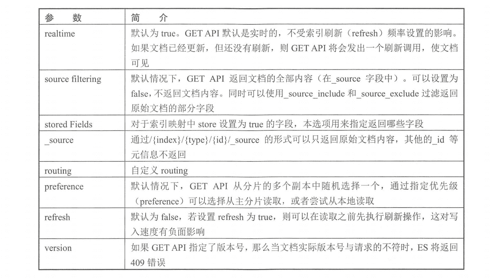
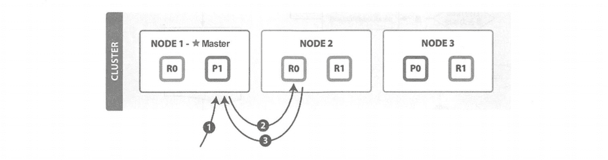
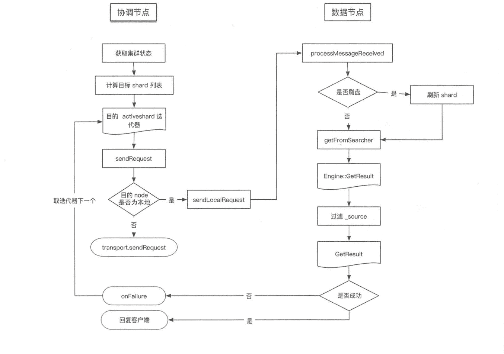
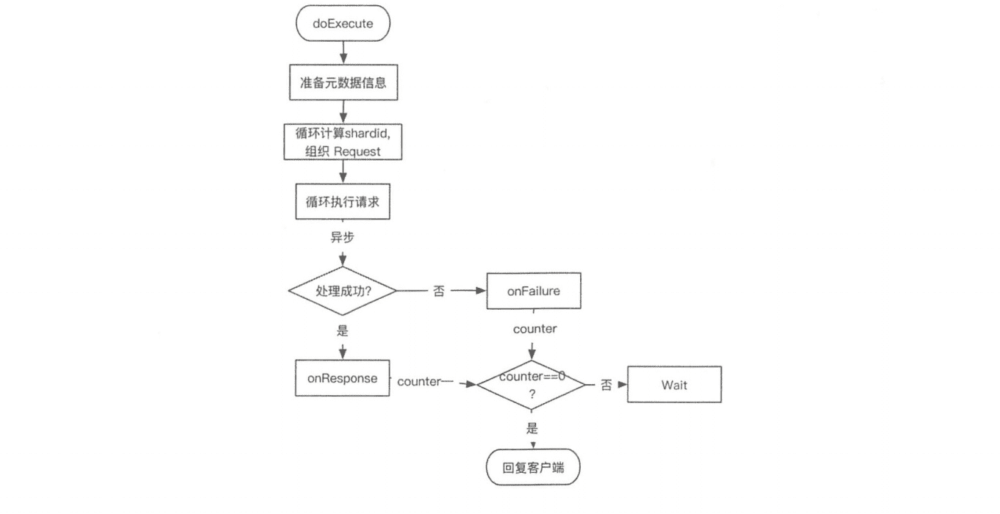

# 《Elasticsearch 源码解析与优化实战》第 8 章：GET 流程

> 原文：[https://cloud.tencent.com/developer/article/1834395](https://cloud.tencent.com/developer/article/1834395)

# 简介

**ES 的读取分为 Get 和 Search 两种操作，这两种读取操作有较大的差异，GET/MGET 必须指定三元组：index、_type、_id。 也就是说，根据文档 id 从正排索引中获取内容。而 Search 不指定 _id，根据关键词从倒排索引中获取内容。**本章分析 GET/MGET 过程，下一章分析 Search 过程。

一个 GET 请求的简单例子(来自官网)如下:

```java
curl -XGET http://127.0.0.1: 9200/website/blog/1?pretty
    "_ index" : "website",
    "_type" : "blog",
    "id" : "1",
    "version" : 21,
    " found" : true,
    "_source" : {
        "first name" : "John",
        "last_ name" : "Smith",
        "age" : 25,
        "about" : "I
        "love to go rock c1 imbing",
        "interests" :[
            "sports",
            "music"
        ]
    }
}
```

# 可选参数

与写请求相同，GET 请求时可以在 URI 中设置一些可选参数，如下表所示。

<figure class=""></figure>

# GET 基本流程

搜索和读取文档都属于读操作，可以从主分片或副分片中读取数据。读取单个文档的流程(图片来自官网)如下图所示。

<figure class=""></figure>

这个例子中的索引有一个主分片和两个副分片。以下是从主分片或副分片中读取时的步骤：

*   **客户端向协调节点 NODE1 发送读请求。**
*   **NODE1 使用文档 ID 来确定文档属于分片 0，通过集群状态中的内容路由表信息获知分片 0 有三个副本数据，位于所有的三个节点中，此时它可以将请求发送到任意节点，这里它将请求转发到 NODE2。**
*   **NODE2 将文档返回给 NODE1，NODE1 将文档返回给客户端。**

**NODE1 作为协调节点，会将客户端请求轮询发送到集群的所有副本来实现负载均衡。**

**在读取时，文档可能已经存在于主分片上，但还没有复制到副分片。在这种情况下，读请求命中副分片时可能会报告文档不存在，但是命中主分片可能成功返回文档。一旦写请求成功返回给客户端，则意味着文档在主分片和副分片都是可用的。**

# GET 详细分析

**`GET/MGET`流程涉及两个节点：协调节点和数据节点**，流程如下图所示。.

<figure class=""></figure>

## 协调节点

执行本流程的线程池：`http_server_worker`

`TransportSingleShardAction`类用来处理存在于一个单个(主或副)分片上的读请求。**将请求转发到目标节点，如果请求执行失败，则尝试转发到其他节点读取。**在收到读请求后，处理过程如下。

### 1\. 内容路由

*   **在`TransportSingleShardAction.AsyncSingleAction`构造函数中，准备集群状态、节点列表等信息。**
*   **根据内容路由算法计算目标`shardid`，也就是文档应该落在哪个分片上。**
*   **计算出目标`shardid`后，结合请求参数中指定的优先级和集群状态确定目标节点，由于分片可能存在多个副本，因此计算出的是一个列表。**

```java
private AsyncSingleAction (Request request, ActionListener<Response> listener) {
    ClusterState clusterState = clusterService.state();
    //集群 nodes 列表
    nodes = clusterState.nodes();
    //解析请求，更新自定义 routing
    resolveRequest(clusterState, internalRequest);
    //根据路由算法计算得到目的 shard 迭代器，或者根据优先级选择目标节点
    this.shardIt = shards(clusterState, internalRequest);
}
```

具体的路由算法参考写流程分析。

### 2\. 转发请求

**作为协调节点，向目标节点转发请求，或者目标是本地节点，直接读取数据。**发送函数声明了如何对 Response 进行处理：AsyncSingleAction 类中声明对 Response 进行处理的函数。无论请求在本节点处理还是发送到其他节点，均对 Response 执行相同的处理逻辑：

```java
private void perform (@Nullable final Exception currentFailure) {
    DiscoveryNode node = nodes.get(shardRouting.currentNodeId());
    if (node == null) {
    onFailure (shardRouting, new NoShardAvailableActionException(shardRouting.shardId()));
    } else {
        inte.rnalRequest.request().internalShardId = shardRouting.shardId();
        transportService.sendRequest(node,  . . .
            public void handleResponse (final Response response) {
                listener.onResponse(response);
            }
            public void handleException (TransportException exp) {
                onFailure(shardRouting, exp);
            }
        ]);
    }
}
```

发送的具体过程：

*   在 TransportService::sendRequest 中检查目标是否是本地 node。
*   如果是本地 node，则进入 TransportServicel#sendLocalRequest 流程，sendLocalRequest 不发送到网络，直接根据 action 获取注册的 reg，执行 processMessageReceived：

```java
private void sendLocalRequest (long requestId, final String action, final
    TransportRequest request, TransportRequestOptions options) {
        inal DirectResponseChannel channel = new DirectResponseChannel (logger, localNode, action, requestId, this, threadPool);
        try {
            //根据 action 获取注册的 reg
            final RequestHandlerRegistry reg = getRequestHandler(action);
            reg.processMessageReceived (request, channel);
        }
}
```

*   如果发送到网络，则请求被异步发送，“sendRequest” 的时候注册 handle， 等待处理 Response，直到超时。
*   等待数据节点的回复，如果数据节点处理成功，则返回给客户端；如果数据节点处理失败，则进行重试：

```java
private void onFailure (ShardRouting shardRouting, Exception e) {
    perform(e);
}
```

内容路由结束时构造了目标节点列表的迭代器，重试发送时，目标节点选择迭代器的下一个。

## 数据节点

执行本流程的线程池：`get`

数据节点接收协调节点请求的入口为：`TransportSingleShardAction.ShardTransportHandler#messageReceived`

读取数据并组织成 Response，给客户端 channel 返回：

```java
public void messageReceived(final Request request, final TransportChannel channel) throws Exception {
    Response response = shardOperation (request，request.internalShardId);
    channel.sendResponse (response);
}
```

shardOperation 先检查是否需要 refresh，然后调用 indexShard.getService().get()读取数据并存储到 GetResult 中。

### 1\. 读取及过滤

在 ShardGetService#get()函数中，调用：

```java
GetResult getResult = innerGet();
```

获取结果。GetResult 类用于存储读取的真实数据内容。核心的数据读取实现在 ShardGetService#innerGet()函数中：

```java
private GetResult innerGet(...) {
    final Collection<String> types;
    / /处理 all 选项
    if (type == null || type.equals("_ all")) {
        ....
    }
    Engine. GetResult get = null;
    for (String typeX : types) {
    //调用 Engine 读取数据
    get = indexShard.get(new Engine.Get (realtime, typeX, id, uidTerm).version (version).versionType (versionType));
    try {
        //过滤返回结果
        return innerGetLoadFromStoredFields (type, id, gFields, fetchSourceContext, get, mapperService);
    } finally {
        get.release();
    }
} 
```

*   通过 indexShard.get()获取 Engine.GetResult。 Engine.GetResult 类与 innerGet 返回的 GetResult 是同名的类，但实现不同。indexShard.get()最终调用 InternalEngine#get 读取数据。
*   调用 ShardGetService#innerGetLoadFromStoredFields()，根据 type、id、DocumentMappe 等信息从刚刚获取的信息中获取数据，对指定的 field、source 进行过滤( source 过滤只支持对字段)，把结果存于 GetResult 对象中。

### 2\. InternalEngine 的读取过程

InternalEngine#get 过程会加读锁。处理 realtime 选项，如果为 true，则先判断是否有数据可以刷盘，然后调用 Searcher 进行读取。Searcher 是对 IndexSearcher 的封装。

**在早期的 ES 版本中，如果开启( 默认) realtime，则会尝试从 translog 中读取，刚写入不久的数据可以从 translog 中读取；从 ES5.x 开始不会从 translog 中读取，只从 Lucene 中读 orealtime 的实现机制变成依靠 refresh 实现。**参考官方链接：https://github.com/elastic/elasticsearch/pull/20102

```java
public GetResult get (Get get, BiFunction<String, SearcherScope, Searcher>searcherFactory) throws EngineException {
    try (ReleasableLock ignored = readLock.acquire() ) {
        ensureOpen();
        SearcherScope scope;
        //处理 realtime 选项，判断是否需要刷盘
        if (get.realtime()) {
            //versionMap 中的值是写入索引的时候添加的，不会写磁盘
            VersionValue versionValue = versionMap.getUnderLock(get.uid().bytes());
            if (versionValue != null) {
                if (versionValue.isDelete()) {
                    return GetResult.NOT.EXISTS;
                }
                if (get.versionType().isVersionConflictForReads(versionValue.version, get.version())){
                    throw new VersionConflictEngineException(...);
                }
                //执行刷盘操作
                refresh ("realtime get", Searcher Scope . INTERNAL);
            }
            scope = SearcherScope.INTERNAL;
        } else {
            scope = SearcherScope.EXTERNAL;
        }
    //调用 Searcher 读取数据
    return getFromSearcher(get, searcherFactory, scope) ;
} 
```

# MGET 流程分析

MGET 的主要处理类: TransportMultiGetAction，通过封装单个 GET 请求实现，处理流程如下图所示。

<figure class=""></figure>

主要流程如下：

*   遍历请求，计算出每个 doc 的路由信息，得到由 shardid 为 key 组成的 request map。这个过程没有在 TransportSingleShardAction 中实现，是因为如果在那里实现，shardid 就会重复，这也是合并为基于分片的请求的过程。
*   循环处理组织好的每个 shard 级请求，调用处理 GET 请求时使用 TransportSingle-ShardAction#AsyncSingleAction 处理单个 doc 的流程。
*   收集 Response，全部 Response 返回后执行 finishHim()，给客户端返回结果。

**回复的消息中文档顺序与请求的顺序一致。如果部分文档读取失败，则不影响其他结果，检索失败的 doc 会在回复信息中标出。**

# 思考

**我们需要警惕实时读取特性，GET API 默认是实时的，实时的意思是写完了可以立刻读取，但仅限于 GET、MGET 操作，不包括搜索。在 5.x 版本之前，GET/MGET 的实时读取依赖于从 translog 中读取实现，5.x 版本之后的版本改为 refresh，因此系统对实时读取的支持会对写入速度有负面影响。**

由此引出另一个较深层次的问题是, update 操作需要先 GET 再写，为了保证一致性, update 调用 GET 时将 realtime 选项设置为 true，并且不可配置。因此 update 操作可能会导致 refresh 生成新的 Lucene 分段。.

*   读失败是怎么处理的？尝试从别的分片副本读取。
*   优先级 优先级策略只是将匹配到优先级的节点放到了目标节点列表的前面。