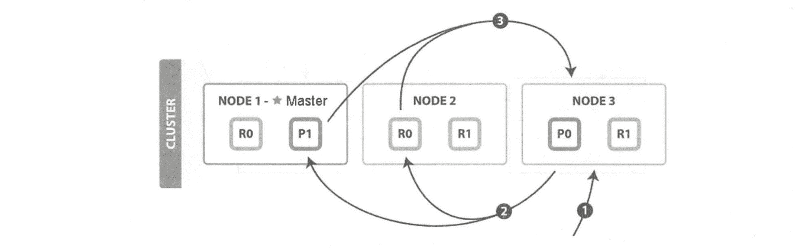
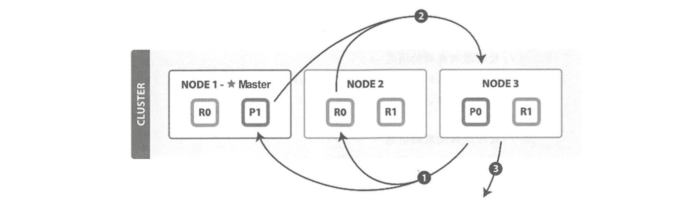

# 《Elasticsearch 源码解析与优化实战》第 9 章：Search 流程

> 原文：[https://cloud.tencent.com/developer/article/1835369](https://cloud.tencent.com/developer/article/1835369)

# 简介

**GET 操作只能对单个文档进行处理，由 _ index、_type 和 id 三元组来确定唯一文档。 但搜索需要一种更复杂的模型，因为不知道查询会命中哪些文档。**

**找到匹配文档仅仅完成了搜索流程的一半，因为多分片中的结果必须组合成单个排序列表。集群的任意节点都可以接收搜索请求，接收客户端请求的节点称为协调节点。在协调节点，搜索任务被执行成一个两阶段过程，即 query then fetch。真正执行搜索任务的节点称为数据节点。**

**需要两个阶段才能完成搜索的原因是，在查询的时候不知道文档位于哪个分片，因此索引的所有分片(某个副本)都要参与搜索，然后协调节点将结果合并，再根据文档 ID 获取文档内容。**例如，有 5 个分片，查询返回前 10 个匹配度最高的文档，那么每个分片都查询出当前分片的 TOP 10，协调节点将 5X10= 50 的结果再次排序，返回最终 TOP 10 的结果给客户端。

一个简单的搜索请求示例如下:

```java
curl -XGET "localhost: 9200/_ search?q= first&pretty"
{
    "took" : 3,
    "timed out" : false,
    "shards" : {
        "total" : б,
        "successful" : б,
        "skipped" : O,
        "failed" : O
    },
    "hits" : {
        "total" : 1,
        "max_ score" : 0.2876821,
        "hits" : [ {
            " index" : "website",
            "_type" : "blog",
            "_ id" : "2",
            "_ score" : 0.2876821,
            "source" : [
                "title" : "My first blog entry",
                "text" : "Just trying this out. . ."
            }
        }]
    }
}
```

在上面的例子中，我们从所有字段搜索“first" 关键词，返回信息中几个基本字段的含义如下:

*   took 代表搜索执行时间( 单位:毫秒)
*   total 代表本次搜索命中的文档数量
*   max_score 为最大得分，代表文档匹配度
*   hits 为搜索命中的结果列表，默认为 10 条

# 索弓|和搜索

ES 中的数据可以分为两类：精确值和全文。

*   **精确值，比如日期和用户 id、IP 地址等。**
*   **全文，指文本内容，比如一条日志，或者邮件的内容。**

这两种类型的数据在查询时是不同的：对精确值的比较是二进制的，查询要么匹配，要么不匹配；全文内容的查询无法给出“有”还是“没有”的结果，它只能找到结果是“看起来像”你要查询的东西，因此把查询结果按相似度排序，评分越高，相似度越大。

对数据建立索引和执行搜索的原理如下图所示。

<figure class=""></figure>

## 建立索引

如果是全文数据，则对文本内容进行分析，这项工作在 ES 中由分析器实现。分析器实现如下功能:

*   **字符过滤器。**主要是对字符串进行预处理，例如，去掉 HTML，将&转换成 and 等。
*   **分词器(Tokenizer)。**将字符串分割为单个词条，例如，根据空格和标点符号分割，输出的词条称为词元(Token)。
*   **Token 过滤器。**根据停止词(Stop word) 删除词元，例如，and、 the 等无用词，或者根据同义词表增加词条，例如，jump 和 leap。
*   **语言处理。**对上一步得到的 Token 做一些和语言相关的处理，例如，转为小写，以及将单词转换为词根的形式。语言处理组件输出的结果称为词(Term)。

分析完毕后，将分析器输出的词(Term) 传递给索引组件，生成倒排和正排索引，再存储到文件系统中。

## 执行搜索

搜索调用 Lucene 完成，如果是全文检索，则：

*   **对检索字段使用建立索引时相同的分析器进行分析，产生 Token 列表;**
*   **根据查询语句的语法规则转换成一棵语法树;**
*   **查找符合语法树的文档;**
*   **对匹配到的文档列表进行相关性评分，评分策略一般使用 TF/IDF;**
*   **根据评分结果进行排序。**

## search type

ES 目前有两种搜索类型:

```java
DFS_QUERY_THEN_FETCH
QUERY_THEN_FETCH (默认)
```

两种不同的搜索类型的区别在于查询阶段，DFS 查询阶段的流程要多一些，它使用全局信息来获取更准确的评分。

本章的流程分析默认搜索类型。下面我们仍旧按照请求涉及的节点来分析流程，搜索流程涉及两个节点：协调节点和数据节点。

# 分布式搜索过程

**一个搜索请求必须询问请求的索引中所有分片的某个副本来进行匹配。假设一个索引有 5 个主分片，每个主分片有 1 个副分片，共 10 个分片，一次搜索请求会由 5 个分片来共同完成，它们可能是主分片，也可能是副分片。也就是说，一次搜索请求只会命中所有分片副本中的一个。**

当搜索任务执行在分布式系统上时，整体流程如下图所示。

<figure class=""></figure>

## 协调节点流程

两阶段相应的实现位置：

*   **查询(Query) 阶段**——`search.InitialSearchPhase`
*   **取回(Fetch)阶段**——`search.FetchSearchPhase`

它们都继承自`SearchPhase`， 如下图所示。

<figure class=""></figure>

### 1\. Query 阶段

**在初始查询阶段，查询会广播到索引中每一个分片副本(主分片或副分片)。每个分片在本地执行搜索并构建一个匹配文档的优先队列。**

**优先队列是一个存有 topN 匹配文档的有序列表。优先队列大小为分页参数`from + size`。**

分布式搜索的 Query 阶段(图片来自官网)如下图所示。

<figure class=""></figure>

QUERY_THEN_FETCH 搜索类型的查询阶段步骤如下：

*   **客户端发送 search 请求到 NODE3**
*   **Node3 将查询请求转发到索引的每个主分片或副分片中**
*   **每个分片在本地执行查询，并使用本地的 Term/Document Frequency 信息进行打分，添加结果到大小为 from + size 的本地有序优先队列中**
*   **每个分片返回各自优先队列中所有文档的 ID 和排序值给协调节点，协调节点合并这些值到自己的优先队列中，产生一个全局排序后的列表**

**协调节点广播查询请求到所有相关分片时，可以是主分片或副分片，协调节点将在之后的请求中轮询所有的分片副本来分摊负载。**查询阶段并不会对搜索请求的内容进行解析，无论搜索什么内容，只看本次搜索需要命中哪些 shard，然后针对每个特定 shard 选择一个副本，转发搜索请求。

Query 阶段源码分析

执行本流程的线程池：http_server_work。

*   解析请求

```java
在 RestSearchAction#prepareRequest 方法中将请求体解析为 SearchRequest 数据结构: 
public RestChannelConsumer prepareRequest(.. .) {
    SearchRequest searchRequest = new SearchRequest();
    request.withContentOrSourceParamParserOrNull (parser ->
        parseSearchRequest (searchRequest, request, parser, setSize));
}
```

*   构造目的 shard 列表

将请求涉及的本集群 shard 列表和远程集群的 shard 列表(远程集群用于跨集群访问)合并：

```java
private void executeSearch(.. .) {
    GroupShardsI terator<shardIterator> localShardsIterator =
        clusterService.operationRouting().searchShards (clusterState,
        concreteIndices, routingMap, searchRequest.preference (),
        searchService.getResponseCollectorService(), nodeSearchCounts);
    GroupShardsIterator <SearchShardIterator> shardIterators =
        mergeShards Iterators (localShardsIterator, localIndices, remoteShardIterators);
}
```

*   遍历所有 shard 发送请求

请求是基于 shard 遍历的，如果列表中有 N 个 shard 位于同一个节点，则向其发送 N 次请求，并不会把请求合并为一个。

```java
public final void run() throws IOException {
    if (shardsIts.size() > 0) {
        //最大发分片请求数可以通过 max_ concurrent_ shard_ requests 参数配置(v6.0 新增)
        int maxConcurrentShardRequests = Math.min(this.maxConcurrentShardRequests, shardsIts.size());
        for(int index = 0; index < maxConcurrentShardRequests; index++) {
            final SearchShardIterator shardRoutings = shardsIts.get (index);
            //执行 shard 级请求
            performPhaseOnShard (index, shardRoutings, shardRoutings.nextOrNull());
        }
    }
}
```

shardsIts 为本次搜索涉及的所有分片，shardRoutings.nextOrNull()从某 个分片的所有副本中选择一个，例如，从 website 中选择主分片。

转发请求同时定义一个 Listener，用于处理 Response：

```java
private void performPhaseOnShard(. ..) {
    executePhaseOnShard(.. .) {
        //收到执行成功的回复
        public void inne rOnResponse (FirstResult result) {
            maybeFork (thread, () -> onShardResult (result，shardIt) );
        }
        //收到执行失败的回复
        public void onFailure (Exception t) {
            maybeFork(thread, () -> onShardFailure (shardIndex, shard, shard. currentNodeId()，shardIt, t));
        }
    });
}
```

发送过程依然调用 transport 模块实现。

*   收集返回结果

本过程在 search 线程池中执行：

```java
private void onShardResult (FirstResult result, SearchShardIterator shardIt) {
    onShardSuccess(result);
    success fulShardExecution(shardIt);
}
```

onShardSuccess 对收集到的结果进行合并。successfulShardExecution 方法检查是否所有请求都已收到回复，是否进入下一阶段：

```java
private void successfulShardExecution (SearchShardIterator shardsIt) {
    //计数器累加.
    final int xTotalOps = totalOps.addAndGet (remainingOpsOnIterator);
    //检查是否收到全部回复
    if (xTotalOps == expectedTotalOps) {
        onPhaseDone ();
    } else if (xTota1Ops > expectedTotal0ps) {
        throw new AssertionError(. ..);
    }
}
```

onPhaseDone 会调用 executeNextPhase，从而开始执行取回阶段。

### 2\. Fetch 阶段

**Query 阶段知道了要取哪些数据，但是并没有取具体的数据，这就是 Fetch 阶段要做的。**

分布式搜索的 Fetch 阶段(图片来自官网)如下图所示。

<figure class=""></figure>

Fetch 阶段由以下步骤构成：

*   **协调节点向相关 NODE 发送 GET 请求**
*   **分片所在节点向协调节点返回数据**
*   **协调节点等待所有文档被取得，然后返回给客户端**

分片所在节点在返回文档数据时，处理有可能出现的 _source 字段和高亮参数

协调节点首先决定哪些文档“确实”需要被取回，例如，如果查询指定了{ "from": 90, "size":10}，则只有从第 91 个开始的 10 个结果需要被取回。

**为了避免在协调节点中创建的 number_of_shards*(from+size)优先队列过大，应尽量控制分页深度。**

Fetch 阶段的目的是通过文档 ID 获取完整的文档内容。

执行本流程的线程池: search。

*   发送 Fetch 请求

Query 阶段的 executeNextPhase 方法触发 Fetch 阶段，Fetch 阶段的起点为 FetchSearchPhase#innerRun 函数，从查询阶段的 shard 列表中遍历，跳过查询结果为空的 shard，对特定目标 shard 执行 executeFetch 来获取数据，其中包括分页信息。对 scroll 请求的处理也在 FetchSearchPhase#innerRun 函数中。

```java
executeFetch 的主要实现：

private void executeFetch(...) {
    // 发送请求
    context.getSearchTransport ().sendExecuteFetch (connection, fetchSearchRequest, context.getTask(),
        new SearchAct ionListener<FetchSearchResult> (shardTarget, shardIndex) {
            //处理返回成功的消息
            public void innerOnResponse (FetchSearchResult result) {
                counter.onResult (result);
            }
            //处理返回失败的消息
            public void onFailure (Exception е) {
                try {
                    counter.onFailure(shardIndex, shardTarget, е);
                } finally {
                    releaseIrrelevantSearchContext (querySearchResult);
                }
            }
    });
}
```

executeFetch 的参数 querySearchResult 中包含分页信息，最后定义一个 Listener，每成功获取一个 shard 数据后就执行 counter.onResult，其中调用对结果的处理回调，把 result 保存到数组中，然后执行 countDown：

```java
void onResult (R result) {
    try {
        resultConsumer.accept(result);
    } finally {
        countDown();
}
```

*   收集结果

收集器的定义在 innerRun 中，包括收到的 shard 数据存放在哪里，收集完成后谁来处理：

```java
final CountedCollector<FetchSearchResult> counter = new CountedCollector<>
    (r -> fetchResults.set(r.getShardIndex()，r), docIdsToLoad.length, finishPhase，context);
```

fetchResults 用于存储从某个 shard 收集到的结果，每收到一个 shard 的数据就执行一次 counter.countDown()。当所有 shard 数据收集完毕后，countDown 会出触发执行 finishPhase：

```java
final Runnable finishPhase = () -> moveToNextPhase(searchPhaseController, scrollId,
    reducedQueryPhase, queryAndFetchOptimization ? queryResults : fetchResults);
```

moveToNextPhase 方法执行下一阶段，下-阶段要执行的任务定义在 FetchSearchPhase 构造 函数中，主要是触发 ExpandSearchPhase：

```java
FetchSearchPhase(InitialSearchPhase.SearchPhaseResults<SearchPhaseResult> resultConsumer, SearchPhaseController searchPhaseController, SearchPhaseContext context) { 
    this(resul tConsumer, searchPhaseController, context,(response, scrollId) -> newExpandSearchPhase(context, response,
        // collapse only happens if the request has inner hits
        (finalResponse)->sendResponsePhase(finalResponse, scrollId, context)));
}
```

*   ExpandSearchPhase

取回阶段完成之后执行 ExpandSearchPhase#run，主要判断是否启用字段折叠，根据需要实现字段折叠功能，如果没有实现字段折叠，则直接返回给客户端。

*   回复客户端

ExpandSearchPhase 执行完之后回复客户端，在 sendResponsePhase 方法中实现：

```java
private static SearchPhase sendResponsePhase(...) {
    return new SearchPhase ("response") {
        public void run() throws IOException {
            context . onResponse (context . buildSearchResponse (response, scrollId));
        }
    };
}
```

## 执行搜索的数据节点流程

执行本流程的线程池: search。

对各种 Query、Fetch 请求的处理入口注册于 SearchTransportServiceregisterRequestHandler。

### 1\. 响应 Query 请求

以常见的 Query 请求为例，其 action 为：indices:data/read/search [phase/query]

主要过程就是执行查询，然后发送 Response：

```java
transportService.registerRequestHandler (QUERY_ACTION_NAME, ShardSearchTransportRequest::new, ThreadPool.Names.SAME,
    new TaskAwareTransportRequestHandler <ShardSearchTransportRequest>() {
        //收到 Query 请求
        public void messageReceived(. ..) throws Exception {
            //执行查询
            searchService.executeQueryPhase (request, (SearchTask) task, new ActionListener<SearchPhaseResult>() {
            //处理查询成功的情况
                public void onResponse (SearchPhaseResult searchPhaseResult) {
                    channel . sendResponse (searchPhaseResult) ;
                }
                //处理查询失败的情况
                public void onFailure (Exception е) {
                    channel.sendResponse(e);
                }
            });
        }
    });
```

查询实现入口在 searchService.executeQueryPhase 中( 完全封装在这个方法中)。查询时，先看是否允许 cache，由以下配置决定：`index.requests.cache.enable`

默认为 true，会把查询结果放到 cache 中，查询时优先从 cache 中取。这个 cache 由节点的所有分片共享，基于 LRU 算法实现：空间满的时候删除最近最少使用的数据。cache 并不缓存全部检索结果。

核心的查询封装在 queryPhase.execute(context)中，其中调用 Lucene 实现检索，同时实现聚合：

```java
public void execute (SearchContext searchContext) {
    aggregationPhase.preProcess (searchContext);
    boolean rescore = execute ( searchContext, searchContext.searcher(), searcher::setCheckCancelled, indexSort);
    if (rescore) {
        rescorePhase.execute (searchContext);
        suggestPhase.execute (searchContext);
        aggregationPhase.execute (searchContext);
    }
}
```

其中包含几个核心功能:

*   execute()，调用 Lucene、searcher.search()实现搜索
*   rescorePhase，全文检索且需要打分
*   suggestPhase，自动补全及纠错
*   aggregationPhase，实现聚合

总结：

*   慢查询 Query 日志的统计时间在于本阶段的处理时间。
*   聚合操作在本阶段实现，在 Lucene 检索后完成。

### 2\. 响应 Fetch 请求

以常见的基于 id 进行 Fetch 请求为例，其 action 为：indices:data/read/search [phase/fetch/id]

主要过程是执行 Fetch，然后发送 Response：

```java
transportService. registerRequestHandler (FETCH_ ID_ ACTION_ NAME,
    ShardFetchSearchRequest::new，ThreadPool.Names.SEARCH, new TaskAwareTransportRequestHandler<ShardFetchSearchRequest>() {
        //收到 Fetch 请求
        public void messageReceived(.. .) throws Exception {
            / /执行 Fetch
            FetchSearchResult result = searchService.executeFetchPhase(request, (SearchTask)task);
            channel.sendResponse(result);
        }
}); 
```

对 Fetch 响应的实现封装在 searchService.executeFetchPhase 中，核心是调用 fetchPhase.execute(context)。按照命中的 doc 取得相关数据，填充到 SearchHits 中，最终封装到 FetchSearchResult 中。

总结：慢查询 Fetch 日志的统计时间在于本阶段的处理时间。

# 小结

*   聚合是在 ES 中实现的，而非 Lucene
*   Query 和 Fetch 请求之间是无状态的，除非是 scroll 方式
*   分页搜索不会单独“cache”，cache 和分页没有关系
*   **每次分页的请求都是一次重新搜索的过程，而不是从第一次搜索的结果中获取。看上去不太符合常规的做法，事实上互联网的搜索引擎都是重新执行了搜索过程：人们基本只看前几页，很少深度分页；重新执行一次搜索很快；如果缓存第一次搜索结果等待翻页命中，则这种缓存的代价较大，意义却不大，因此不如重新执行一次搜索。**
*   **搜索需要遍历分片所有的 Lucene 分段，因此合并 Lucene 分段对搜索性能有好处**