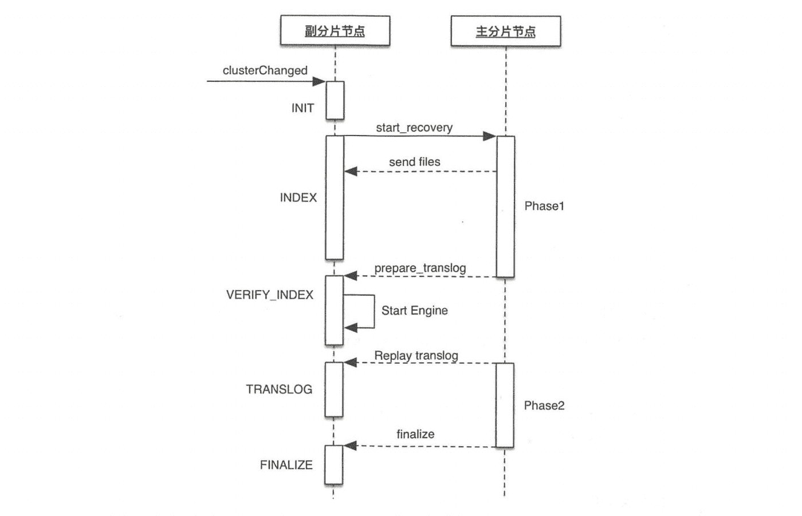
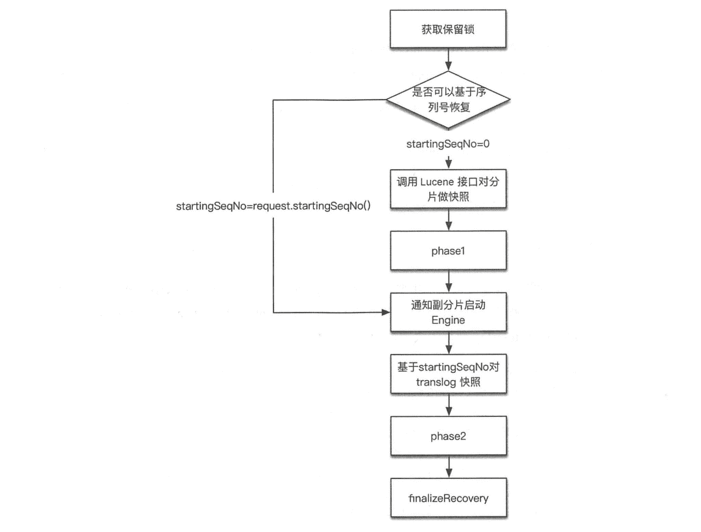
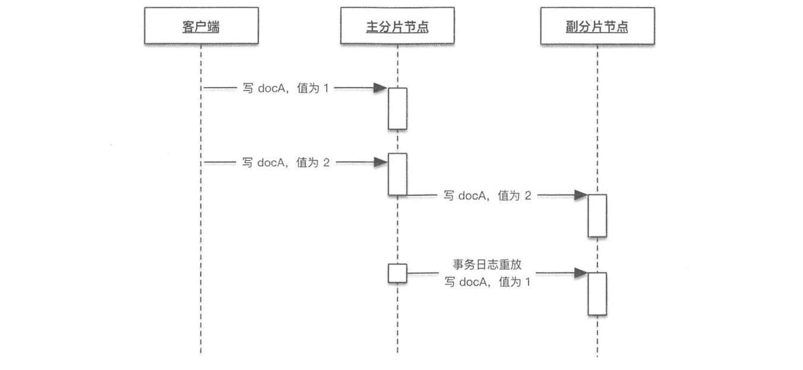

# 《Elasticsearch 源码解析与优化实战》第 10 章：索引恢复流程分析

> 原文：[https://cloud.tencent.com/developer/article/1829171](https://cloud.tencent.com/developer/article/1829171)

# 简介

**索引恢复(index.recovery)是 ES 数据恢复过程。待恢复的数据是客户端写入成功，但未执行刷盘(flush)的 Lucene 分段。**例如，当节点异常重启时，写入磁盘的数据先到文件系统的缓冲，未必来得及刷盘，如果不通过某种方式将未刷盘的数据找回来，则会丢失一些数据，这是保持数据完整性的体现；另一方面，由于写入操作在多个分片副本上没有来得及全部执行，副分片需要同步成和主分片完全一致，这是数据副本一致性的体现。

**根据数据分片性质，索引恢复过程可分为主分片恢复流程和副分片恢复流程。**

*   **主分片从 translog 中自我恢复，尚未执行 flush 到磁盘的 Lucene 分段可以从 translog 中重建；**
*   **副本分片需要从主分片中拉取 Lucene 分段和 translog 进行恢复。但是有机会跳过拉取 Lucene 分段的过程；**

索引恢复的触发条件包括：快照备份恢复、节点加入和离开、索引的 _open 操作等。恢复工作一般经历以下阶段(stage)，如下表所示：

| 

阶段

 | 

简介

 |
| --- | --- |
| 

INIT (init)

 | 

恢复尚未启动

 |
| 

INDEX (index)

 | 

恢复 Lucene 文件，以及在节点间负责索引数据

 |
| 

VERIFY_INDEX (verify_index)

 | 

验证索引

 |
| 

TRANSLOG (translog)

 | 

启动 engine，重放 translog，建立 Lucene 索引

 |
| 

FINALIZE (finalize)

 | 

清理工作

 |
| 

DONE (done)

 | 

完毕

 |

**主分片和副本分片恢复都会经历这些阶段，但有时候会跳过具体执行过程，只是在流程上体现出经历了这个短暂阶段。**例如副本分片恢复时会跳过 TRANSLOG 重放过程；主分片恢复过程中的 INDEX 阶段不会在节点直接复制数据。

## 相关配置

| 

配置

 | 

简介

 |
| --- | --- |
| 

indices.recovery.max_bytes_per_sec

 | 

副本分片恢复的 phase1 过程中，主副分片节点之间传输数据的速度限制，默认为 40MB/s，单位为字节。设置为 0 则不限速。

 |
| 

indices.recovery.retry_delay_state_sync

 | 

由于集群状态同步导致 recovery 失败时，重试 recovery 前的等待时间，默认 500ms。

 |
| 

indices.recovery.retry_delay_network

 | 

由于网络问题导致 recovery 失败时，重试 recovery 前的等待时间，默认 5s。

 |
| 

indices.recovery.internal_action_timeout

 | 

用于某些恢复请求的 RPC 超时时间，默认为 15 min，例如：perpare_translog、clean_files 等。

 |
| 

indices.recovery.internal_action_long_timeout

 | 

与上面的用处相同，但是超时时间更长，默认为前者的 2 倍。

 |
| 

indices.recovery.recovery_activity_timeout

 | 

不活跃的 recovery 超时时间，默认值等于 indices.recovery.internal_action_long_timeout

 |

# 流程概述

recovery 由 clusterChanged 触发，从触发到开始执行恢复的调用关系如下：

```java
IndicesClusterStateService#applyClusterState
    -> createOrUpdateShards()
    -> createShard()
    -> IndicesService.createShard()
    -> IndexShard.startRecovery()
```

`IndexShard#startRecovery`执行对一个特定分片的恢复流程，根据此分片的恢复类型执行相应的恢复过程：

```java
public void startRecovery(RecoveryState recoveryState, PeerRecoveryTargetService recoveryTargetService,
                              PeerRecoveryTargetService.RecoveryListener recoveryListener, RepositoriesService repositoriesService,
                              BiConsumer<String, MappingMetaData> mappingUpdateConsumer,
                              IndicesService indicesService) {

    assert recoveryState.getRecoverySource().equals(shardRouting.recoverySource());
    switch (recoveryState.getRecoverySource().getType()) {
        case EMPTY_STORE:
        case EXISTING_STORE:
            markAsRecovering("from store", recoveryState); // mark the shard as recovering on the cluster state thread
            threadPool.generic().execute(() -> {
                try {
                    //主分片从本地恢复
                    if (recoverFromStore()) {
                        recoveryListener.onRecoveryDone(recoveryState);
                    }
                } catch (Exception e) {
                    recoveryListener.onRecoveryFailure(recoveryState,
                            new RecoveryFailedException(recoveryState, null, e), true);
                }
            });
            break;
        case PEER:
            try {
                markAsRecovering("from " + recoveryState.getSourceNode(), recoveryState);
                //副分片从远程主分片恢复
                recoveryTargetService.startRecovery(this, recoveryState.getSourceNode(), recoveryListener);
            } catch (Exception e) {
                failShard("corrupted preexisting index", e);
                recoveryListener.onRecoveryFailure(recoveryState,
                        new RecoveryFailedException(recoveryState, null, e), true);
            }
            break;
        case SNAPSHOT:
            markAsRecovering("from snapshot", recoveryState); // mark the shard as recovering on the cluster state thread
            SnapshotRecoverySource recoverySource = (SnapshotRecoverySource) recoveryState.getRecoverySource();
            threadPool.generic().execute(() -> {
                try {
                    final Repository repository = repositoriesService.repository(recoverySource.snapshot().getRepository());
                    //从快照恢复
                    if (restoreFromRepository(repository)) {
                        recoveryListener.onRecoveryDone(recoveryState);
                    }
                } catch (Exception e) {
                    recoveryListener.onRecoveryFailure(recoveryState,
                            new RecoveryFailedException(recoveryState, null, e), true);
                }
            });
            break;
        case LOCAL_SHARDS:
            final IndexMetaData indexMetaData = indexSettings().getIndexMetaData();
            final Index resizeSourceIndex = indexMetaData.getResizeSourceIndex();
            final List<IndexShard> startedShards = new ArrayList<>();
            final IndexService sourceIndexService = indicesService.indexService(resizeSourceIndex);
            final Set<ShardId> requiredShards;
            final int numShards;
            if (sourceIndexService != null) {
                requiredShards = IndexMetaData.selectRecoverFromShards(shardId().id(),
                        sourceIndexService.getMetaData(), indexMetaData.getNumberOfShards());
                for (IndexShard shard : sourceIndexService) {
                    if (shard.state() == IndexShardState.STARTED && requiredShards.contains(shard.shardId())) {
                        startedShards.add(shard);
                    }
                }
                numShards = requiredShards.size();
            } else {
                numShards = -1;
                requiredShards = Collections.emptySet();
            }

            if (numShards == startedShards.size()) {
                assert requiredShards.isEmpty() == false;
                markAsRecovering("from local shards", recoveryState); // mark the shard as recovering on the cluster state thread
                threadPool.generic().execute(() -> {
                    try {
                        //从本节点其他分片恢复(shrink 时)
                        if (recoverFromLocalShards(mappingUpdateConsumer, startedShards.stream()
                                .filter((s) -> requiredShards.contains(s.shardId())).collect(Collectors.toList()))) {
                            recoveryListener.onRecoveryDone(recoveryState);
                        }
                    } catch (Exception e) {
                        recoveryListener.onRecoveryFailure(recoveryState,
                                new RecoveryFailedException(recoveryState, null, e), true);
                    }
                });
            } else {
                final RuntimeException e;
                if (numShards == -1) {
                    e = new IndexNotFoundException(resizeSourceIndex);
                } else {
                    e = new IllegalStateException("not all required shards of index " + resizeSourceIndex
                            + " are started yet, expected " + numShards + " found " + startedShards.size() + " can't recover shard "
                            + shardId());
                }
                throw e;
            }
            break;
        default:
            throw new IllegalArgumentException("Unknown recovery source " + recoveryState.getRecoverySource());
    }
}
```

此时线程池为`ClusterApplierService#updateTask`。执行具体的恢复工作时，会到另一个线程池中执行。无论哪种恢复类型，都在`generic`线程池中。

本章我们主要介绍主分片和副分片的恢复流程。`Snapshot`和`shrink`属于比较独立的功能，在后续的章节中单独分析。

# 主分片恢复流程

## INIT 阶段

一个分片的恢复流程中，从开始执行恢复的那一刻起，被标记为 INIT 阶段，INIT 阶段在`IndexShard#startRecovery`函数的参数中传入，在判断此分片属于恢复类型之前就被设置为 INIT 阶段。

```java
markAsRecovering("from store", recpveryState);

public IndexShardState markAsRecovering(String reason, RecoveryState recoveryState) throws IndexShardStartedException,
        IndexShardRelocatedException, IndexShardRecoveringException, IndexShardClosedException {
    synchronized (mutex) {
        if (state == IndexShardState.CLOSED) {
            throw new IndexShardClosedException(shardId);
        }
        if (state == IndexShardState.STARTED) {
            throw new IndexShardStartedException(shardId);
        }
        if (state == IndexShardState.RECOVERING) {
            throw new IndexShardRecoveringException(shardId);
        }
        if (state == IndexShardState.POST_RECOVERY) {
            throw new IndexShardRecoveringException(shardId);
        }
        this.recoveryState = recoveryState;
        return changeState(IndexShardState.RECOVERING, reason);
    }
}
```

然后在新的线程池中执行主分片恢复流程：

```java
threadPool.generic().execute(() -> {    
    try {
        //主分片从本地恢复
        if (recoverFromStore()) {
            //恢复成功
            //向 Master 发送 action 为 internal:cluster/shard/started 的 RPC 请求
            recoveryListener.onRecoveryDone(recoveryState);
        }
    } catch (Exception e) {
        //恢复失败
        //关闭 Engin，向 Master 发送 internal:cluster/shard/failure 的 RPC 请求
        recoveryListener.onRecoveryFailure(recoveryState,
                            new RecoveryFailedException(recoveryState, null, e), true);
    }
});
```

接下来，恢复流程在新的线程池中开始执行，开始阶段主要是一下验证工作，例如校验当前分片是否为主分片，分片状态是否异常等。

做完简单的校验工作后，进入 INDEX 阶段：

```java
public void prepareForIndexRecovery() {

    if (state != IndexShardState.RECOVERING) {
        throw new IndexShardNotRecoveringException(shardId, state);
    }
    recoveryState.setStage(RecoveryState.Stage.INDEX);
    assert currentEngineReference.get() == null;
}
```

## INDEX 阶段

本阶段从 Lucene 读取最后一次提交的分段信息，`StoreRecovery#internalRecoverFromStore`获取其中的版本号，更新当前索引版本：

```java
private void internalRecoverFromStore(IndexShard indexShard) throws IndexShardRecoveryException {
    final RecoveryState recoveryState = indexShard.recoveryState();
    final boolean indexShouldExists = recoveryState.getRecoverySource().getType() != RecoverySource.Type.EMPTY_STORE;
    //进入 INDEX 阶段
    indexShard.prepareForIndexRecovery();
    SegmentInfos si = null;
    final Store store = indexShard.store();
    store.incRef();
    try {
        try {
            store.failIfCorrupted();
            try {
                //获取 Lucene 最后一次提交的分段信息，得到其中的版本号
                si = store.readLastCommittedSegmentsInfo();
            } catch (Exception e) {
                String files = "_unknown_";
                try {
                    files = Arrays.toString(store.directory().listAll());
                } catch (Exception inner) {
                    inner.addSuppressed(e);
                    files += " (failure=" + ExceptionsHelper.detailedMessage(inner) + ")";
                }
                if (indexShouldExists) {
                    throw new IndexShardRecoveryException(shardId,
                            "shard allocated for local recovery (post api), should exist, but doesn't, current files: " + files, e);
                }
            }
            if (si != null && indexShouldExists == false) {
                // it exists on the directory, but shouldn't exist on the FS, its a leftover (possibly dangling)
                // its a "new index create" API, we have to do something, so better to clean it than use same data
                logger.trace("cleaning existing shard, shouldn't exists");
                Lucene.cleanLuceneIndex(store.directory());
                si = null;
            }
        } catch (Exception e) {
            throw new IndexShardRecoveryException(shardId, "failed to fetch index version after copying it over", e);
        }
        if (recoveryState.getRecoverySource().getType() == RecoverySource.Type.LOCAL_SHARDS) {
            assert indexShouldExists;
            bootstrap(indexShard, store);
            writeEmptyRetentionLeasesFile(indexShard);
        } else if (indexShouldExists) {
            if (recoveryState.getRecoverySource().shouldBootstrapNewHistoryUUID()) {
                store.bootstrapNewHistory();
                writeEmptyRetentionLeasesFile(indexShard);
            }
            // since we recover from local, just fill the files and size
            try {
                final RecoveryState.Index index = recoveryState.getIndex();
                if (si != null) {
                    addRecoveredFileDetails(si, store, index);
                }
            } catch (IOException e) {
                logger.debug("failed to list file details", e);
            }
        } else {
              store.createEmpty(indexShard.indexSettings().getIndexVersionCreated().luceneVersion);
            final String translogUUID = Translog.createEmptyTranslog(
                    indexShard.shardPath().resolveTranslog(), SequenceNumbers.NO_OPS_PERFORMED, shardId,
                    indexShard.getPendingPrimaryTerm());
            store.associateIndexWithNewTranslog(translogUUID);
                writeEmptyRetentionLeasesFile(indexShard);
        }
        //从 tanslog 恢复数据
        indexShard.openEngineAndRecoverFromTranslog();
        indexShard.getEngine().fillSeqNoGaps(indexShard.getPendingPrimaryTerm());
        //进入 FINALIZE 状态
        indexShard.finalizeRecovery();
        //进入 DONE 阶段
        indexShard.postRecovery("post recovery from shard_store");
    } catch (EngineException | IOException e) {
        throw new IndexShardRecoveryException(shardId, "failed to recover from gateway", e);
    } finally {
        store.decRef();
    }
}
```

## VERIFY_INDEX 阶段

VERIFY_INDEX `verify [ˈverɪfaɪ]`中的 INDEX 指 Lucene index，因此本阶段的作用是验证当前分片是否损坏，是否进行本项检查取决于配置项：

```java
index.shard.check_on_startup=true
```

该配置的取值如下表所示：

| 

阶段

 | 

简介

 |
| --- | --- |
| 

false

 | 

默认值，打开分片时不检查分片是否损坏

 |
| 

checksum

 | 

检查物理损坏

 |
| 

true

 | 

检查物理和逻辑损坏，这将消耗大量的内存和 CPU 资源

 |
| 

fix

 | 

检查物理和逻辑损坏。损坏的分段将被集群自动删除，这将导致数据丢失。使用时请考虑清楚

 |

在索引的数据量较大时，分片检查会消耗更多的时间。验证工作在`IndexShard#checkIndex`函数中完成。验证过程通过对比元信息中记录的 checksum 与 Lucene 文件的实际值，或者调用`LuceneCheckIndex`类中的`checkIndex、exorciseIndex`方法完成。

## TRANSLOG 阶段

一个 Lucene 索引由许多分段组成，每次搜索时遍历所有分段。内部维护了一个称为“提交点”的信息，其描述了当前 Lucene 索引都包括哪些分段，这些分段已经被 fsync 系统调用，从操作系统的 cache 刷入磁盘。每次提交操作都会将分段刷入磁盘实现持久化。

本阶段需要重放事务日志中尚未刷入磁盘的信息，因此，根据最后一次提交的信息做快照，来确定事物日志中哪些数据需要重放。重放完毕后将新生成的 Lucene 数据刷入磁盘。

实现类：`InternalEngine#recoverFromTranslogInternal`

```java
/**
 * 重放 translog 日志
 * @param translogRecoveryRunner
 * @param recoverUpToSeqNo
 * @throws IOException
 */
private void recoverFromTranslogInternal(TranslogRecoveryRunner translogRecoveryRunner, long recoverUpToSeqNo) throws IOException {
    Translog.TranslogGeneration translogGeneration = translog.getGeneration();
    final int opsRecovered;
    //根据最后一次提交的信息生成 translog 快照
    final long translogFileGen = Long.parseLong(lastCommittedSegmentInfos.getUserData().get(Translog.TRANSLOG_GENERATION_KEY));
    try (Translog.Snapshot snapshot = translog.newSnapshotFromGen(
            new Translog.TranslogGeneration(translog.getTranslogUUID(), translogFileGen), recoverUpToSeqNo)) {
        //重放这些日志
        opsRecovered = translogRecoveryRunner.run(this, snapshot);
    } catch (Exception e) {
        throw new EngineException(shardId, "failed to recover from translog", e);
    }
    // flush if we recovered something or if we have references to older translogs
    // note: if opsRecovered == 0 and we have older translogs it means they are corrupted or 0 length.
    assert pendingTranslogRecovery.get() : "translogRecovery is not pending but should be";
    pendingTranslogRecovery.set(false); // we are good - now we can commit
    //将重放后新生成的数据刷入硬盘
    if (opsRecovered > 0) {
        logger.trace("flushing post recovery from translog. ops recovered [{}]. committed translog id [{}]. current id [{}]",
                     opsRecovered, translogGeneration == null ? null :
                    translogGeneration.translogFileGeneration, translog.currentFileGeneration());
        commitIndexWriter(indexWriter, translog, null);
        refreshLastCommittedSegmentInfos();
        refresh("translog_recovery");
    }
    translog.trimUnreferencedReaders();
}
```

遍历所有需要重放的事务日志，执行具体的写操作，如同执行写入过程一样：

实现类：`TransloHandler#run`

```java
@Override
public int run(Engine engine, Translog.Snapshot snapshot) throws IOException {
    int opsRecovered = 0;
    Translog.Operation operation;
    while ((operation = snapshot.next()) != null) {
        //执行具体的写操作
        applyOperation(engine, convertToEngineOp(operation, Engine.Operation.Origin.LOCAL_TRANSLOG_RECOVERY));
        opsRecovered++;
        appliedOperations.incrementAndGet();
    }
    engine.syncTranslog();
    return opsRecovered;
}
```

事务日志重放完毕后，`StoreRecovery#internalRecoverFromStrore`方法调用`indexShard.finalizeRecovery()`进入 FINALIZE 阶段。

## FINALIZE 阶段

本阶段执行刷新(refresh)操作，将缓冲的数据写入文件，但不刷盘，数据在操作系统的 cache 中。

```java
public void finalizeRecovery() {
    recoveryState().setStage(RecoveryState.Stage.FINALIZE);
    Engine engine = getEngine();
    //执行 refresh 操作
    engine.refresh("recovery_finalization");
    engine.config().setEnableGcDeletes(true);
}
```

然后在`StoreRecovery#internalRecoverFromStore`方法中调用`indexShard.postRecovery`，将阶段设置为 DONE。

## DONE 阶段

DONE 阶段是恢复工作的最后一段，进入 DONE 阶段之前再次执行 refresh，然后更新分片状态。

```java
public void postRecovery(String reason) throws IndexShardStartedException, IndexShardRelocatedException, IndexShardClosedException {

    synchronized (postRecoveryMutex) {
        //再次执行刷新
        getEngine().refresh("post_recovery");
        synchronized (mutex) {
            if (state == IndexShardState.CLOSED) {
                throw new IndexShardClosedException(shardId);
            }
            if (state == IndexShardState.STARTED) {
                throw new IndexShardStartedException(shardId);
            }
            recoveryState.setStage(RecoveryState.Stage.DONE);
            //更新分片状态
            changeState(IndexShardState.POST_RECOVERY, reason);
        }
    }
}
```

至此，主分片恢复完毕，对恢复结果进行处理。

*   恢复成功：如果恢复成功，则执行`IndicesClusterStateService.RecoveryListener#onRecoveryDone`。主要实现是向 Master 发送 action 为`internal:cluster/shard/started`的 RPC 请求。

```java
sendShardAction(SHARD_STARTED_ACTION_NAME, currentState, entry, listener);
```

*   恢复失败：如果恢复失败，则执行`IndicesClusterStateService#handleRecoveryFailure`。向 Master 发送`internal:cluster/shard/failure`的 RPC 请求。

```java
private void failAndRemoveShard(ShardRouting shardRouting, boolean sendShardFailure, String message, @Nullable Exception failure,
                                    ClusterState state) {
    try {
        AllocatedIndex<? extends Shard> indexService = indicesService.indexService(shardRouting.shardId().getIndex());
        if (indexService != null) {
            //关闭 shard
            indexService.removeShard(shardRouting.shardId().id(), message);
        }
    } catch (ShardNotFoundException e) {
        // the node got closed on us, ignore it
    } catch (Exception inner) {
        inner.addSuppressed(failure);
        logger.warn(() -> new ParameterizedMessage(
                    "[{}][{}] failed to remove shard after failure ([{}])",
                    shardRouting.getIndexName(),
                    shardRouting.getId(),
                    message),
                inner);
    }
    if (sendShardFailure) {
        //向 Master 节点发生 SHARD_FAILED_ACTION_NAME 请求
        sendFailShard(shardRouting, message, failure, state);
    }
}
```

# 副分片恢复流程

**副分片恢复的核心思想是从主分片拉取 Lucene 分段和 translog 进行恢复。按数据传递的方向，主分片节点称为 Source，副分片称为 Traget。**

**为什么需要拉取主分片的 translog？因为在副本恢复期间允许新的写操作，从复制 Lucene 分段的那一刻开始，所恢复的副分片数据不包括新增的内容，而这些内容存在于主分片中的 translog 中，因此副分片需要从主分片节点拉取 translog 进行重放，以获取新增内容。这就是需要主分片节点的 translog 不被清理。为防止主分片节点的 translog 被清理，这方面的实现机制经历了多次迭代。**

**在 1.x 版本时代，通过阻止刷新(refresh)操作，让 translog 都保留下来，但是这样可能会产生很大的 translog。**

*   **phase1：将主分片的 Lucene 做快照，发送到 target。期间不阻塞索引操作，新增数据写到主分片的 translog。**
*   **phase2：将主分片 translog 做快照，发送到 target 重放，期间不阻塞索引操作。**
*   **phase3：为主分片加写锁，将剩余的 translog 发送到 target。此时数据量很小，写入过程的阻塞很短。**

**在 2.0 ~ 5.x 版本时代，引入了 translog.view 概念。**

**6.0 版本开始，translog.vie 被移除。引入 TranslogDeletionPolicy(事务日志删除策略)的概念，负责维护活跃的 translog 文件。这个类的实现非常简单，它将 tanslog 做一个快照来保持 translog 不被清理。**这样使用者只需创建一个快照，无需担心视图之类。恢复流程实际上确实需要一个视图，现在可以通过获取一个简单的保留锁来防止清理 translog。这消除了视图概念的需求。

在保证 translog 不被清理后，恢复核心处理过程由两个内部阶段组成。

*   **phase1：在主分片所在节点，获取 translog 保留锁，从获取保留锁开始，会保留 translog 不受刷盘清空的影响。**然后调用 Lucene 接口把 shard 做快照，快照含有 shard 中已经刷到磁盘的文件引用，把这些 shard 数据复制到副本节点。在 phase1 结束前，会向副分片发生告知对方启动 Engine，在 phase2 开始之前，副分片就可以正常处理写请求了。
*   **phase2：对 translog 做快照，这个快照包含从 phase1 开始，到执行 translog 快照期间的新增索引。将这些 translog 发送到副分片所在节点进行重放。**

由于 phase1 需要通过网络复制大量数据，过程非常长，在 ES 6.x 中，有两个机会可以跳过 phase1：

1.  **如果主副分片有相同的 synid 且 doc 数量相同，则跳过 phase1；**
2.  **如果可以基于恢复请求中的 SequenceNumber 进行恢复，则跳过 phase1；**

在数据模型一章中介绍过 SequenceNumber，现在介绍 syncid 的概念。

## synced flush(同步刷新)机制

**为了解决副本分片恢复过程第一阶段时间太长而引入了 synced [sɪŋk] flush，默认情况下 5 分钟没有写入操作的索引被标记 inactive(不活跃)，执行 synced flush，生成一个唯一的 synid(同步标志)，写入分片的所有副本中。这个 syncid 是分片级，意味着拥有相同 syncid 的分片具有相同的 Lucene 索引。**

**synced flush 本质上是一次普通的 flush 操作，只是在 Lucene 的 commit 过程中多写了一个 syncid。原则上，在没有数据写入的情况下，各分片在同一时间“flush”成功后，他们理应由相同的 Lucene 索引内容，无论 Lucene 分段是否一致。于是给分片分配一个 id，表示数据一致。**

**但是显然 synced flush 期间不能有新写入的内容，如果 synced flush 执行期间收到写请求，则 ES 选择了写入可用性：让 synced flush 失败，让写操作成功。在没有执行 flush 的情况下已有 syncid 不会失效。**

**在某个分片上执行普通 flush 操作会删除已有 syncid。因此，synced flush 操作是一个不可靠操作，只适用于冷索引。**

下面详细介绍整个副分片恢复过程。

## 副分片节点处理过程

副本分片恢复的 VERIFY_INDEX、TRANSLOG、FINALIZE 三个阶段由主分片节点的 RPC 调用触发，如下图所示：

<figure class=""></figure>

在副分片恢复过程中，副分片节点会向主分片节点发送`start_recovery`的 RPC 请求，主分片节点对此请求的处理注册在`PeerRecoverySourceService`类中，内部类`PeerRecoverySourceService.StartRecoveryTransportRequestHandler`负责处理此 RPC 请求。

类似的，主分片节点也会向副分片节点发送一些 RPC 请求，副分片节点对这些请求的处理以`XXXRequestHandler`的方式注册在`PeerRecoveryTargetService`类中，包括接收 Lucene 文件、接收 translog 并重放、执行清理等操作，如下图所示：

<figure class=""></figure>

### INIT 阶段

本阶段在副本节点执行。

与主分片恢复的 INIT 阶段类型，恢复任务开始是被设置为 INIT 阶段，进行副分片恢复时，在新的线程池中执行恢复任务：

```java
public void startRecovery(final IndexShard indexShard, final DiscoveryNode sourceNode, final RecoveryListener listener) {
    final long recoveryId = onGoingRecoveries.startRecovery(indexShard, sourceNode, listener, recoverySettings.activityTimeout());
    threadPool.generic().execute(new RecoveryRunner(recoveryId));
}
```

构建准备发往主分片的`StartRecoveryRequest`请求，请求中包括将本次要恢复的 shard 相关信息，如 shardid、metadataSnapshot 等。metadataSnapshot 中包含 syncid。然后进入 INDEX 阶段。

```java
public void prepareForIndexRecovery() {
    if (state != IndexShardState.RECOVERING) {
        throw new IndexShardNotRecoveringException(shardId, state);
    }
    //设置状态为 index
    recoveryState.setStage(RecoveryState.Stage.INDEX);
    assert currentEngineReference.get() == null;
}
```

### INDEX 阶段

INDEX 阶段负责将主分片的 Lucene 数据复制到副分片节点。

向主分片节点发送 action 为`internal:index/shard/recovery/start_recovery`的 RPC 请求，并阻塞当前线程，等待响应，直到对方处理完成。然后设置为 DONE 阶段。

概括来说，主分片节点接收到请求后把 Lucene 和 translog 发送给副分片，具体参考下节：主分片节点处理过程。下面是副分片节点发送请求并等待响应的过程：

```java
private void doRecovery(final long recoveryId) {
    cancellableThreads.executeIO(() ->
                transportService.submitRequest(request.sourceNode(), PeerRecoverySourceService.Actions.START_RECOVERY, request,
                    new TransportResponseHandler<RecoveryResponse>() {
                        @Override
                        public void handleResponse(RecoveryResponse recoveryResponse) {
                            final TimeValue recoveryTime = new TimeValue(timer.time());
                            // do this through ongoing recoveries to remove it from the collection
                            //响应成功，设置为 DONE 阶段
                            onGoingRecoveries.markRecoveryAsDone(recoveryId);
                        }
                        @Override
                        public void handleException(TransportException e) {
                            handleException.accept(e);
                        }

                        @Override
                        public String executor() {
                            return ThreadPool.Names.GENERIC;
                        }

                        @Override
                        public RecoveryResponse read(StreamInput in) throws IOException {
                            return new RecoveryResponse(in);
                        }
                    })
            );
}
```

线程阻塞等待 INDEX 阶段完成，然后直接到 DONE 阶段。在这期间主分片节点会发送几次 RPC 调用，通知副分片节点启动 Engine，执行清理等操作。VERIFY_INDEX 和 TRANSLOG 阶段也是由主分片节点的 RPC 调用触发的。

### VERIFY_INDEX 阶段

副分片的索引验证过程和主分片相同，是否进行验证取决于配置，默认为不执行索引验证。

主分片节点执行完 phase1 后，调用`prepareTargetForTranslog`方法，向副分片节点发送 action 为`internal:index/shard/recovery/prepare_translog`的 RPC 请求。副分片对此 action 的主要处理是启动 Engine，使副分片可以正常接收写请求。副本的 VERIFY_INDEX、TRANSLOG 两阶段也是在对这个 action 的处理中触发的。`IndexShard#recoverLocallyUpToGlobalCheckpoint`实现如下：

```java
public long recoverLocallyUpToGlobalCheckpoint() {
        assert Thread.holdsLock(mutex) == false : "recover locally under mutex";
        if (state != IndexShardState.RECOVERING) {
            throw new IndexShardNotRecoveringException(shardId, state);
        }
        assert recoveryState.getStage() == RecoveryState.Stage.INDEX : "unexpected recovery stage [" + recoveryState.getStage() + "]";
        assert routingEntry().recoverySource().getType() == RecoverySource.Type.PEER : "not a peer recovery [" + routingEntry() + "]";
        final Optional<SequenceNumbers.CommitInfo> safeCommit;
        final long globalCheckpoint;
        try {
            final String translogUUID = store.readLastCommittedSegmentsInfo().getUserData().get(Translog.TRANSLOG_UUID_KEY);
            globalCheckpoint = Translog.readGlobalCheckpoint(translogConfig.getTranslogPath(), translogUUID);
            safeCommit = store.findSafeIndexCommit(globalCheckpoint);
        } catch (org.apache.lucene.index.IndexNotFoundException e) {
            logger.trace("skip local recovery as no index commit found");
            return UNASSIGNED_SEQ_NO;
        } catch (Exception e) {
            logger.debug("skip local recovery as failed to find the safe commit", e);
            return UNASSIGNED_SEQ_NO;
        }
        if (safeCommit.isPresent() == false) {
            logger.trace("skip local recovery as no safe commit found");
            return UNASSIGNED_SEQ_NO;
        }
        assert safeCommit.get().localCheckpoint <= globalCheckpoint : safeCommit.get().localCheckpoint + " > " + globalCheckpoint;
        try {
            //验证索引
            maybeCheckIndex(); // check index here and won't do it again if ops-based recovery occurs
            //进入 translog 阶段
            recoveryState.setStage(RecoveryState.Stage.TRANSLOG);
            if (safeCommit.get().localCheckpoint == globalCheckpoint) {
                logger.trace("skip local recovery as the safe commit is up to date; safe commit {} global checkpoint {}",
                    safeCommit.get(), globalCheckpoint);
                recoveryState.getTranslog().totalLocal(0);
                return globalCheckpoint + 1;
            }
            if (indexSettings.getIndexMetaData().getState() == IndexMetaData.State.CLOSE ||
                IndexMetaData.INDEX_BLOCKS_WRITE_SETTING.get(indexSettings.getSettings())) {
                logger.trace("skip local recovery as the index was closed or not allowed to write; safe commit {} global checkpoint {}",
                    safeCommit.get(), globalCheckpoint);
                recoveryState.getTranslog().totalLocal(0);
                return safeCommit.get().localCheckpoint + 1;
            }
            try {
                final Engine.TranslogRecoveryRunner translogRecoveryRunner = (engine, snapshot) -> {
                    recoveryState.getTranslog().totalLocal(snapshot.totalOperations());
                    final int recoveredOps = runTranslogRecovery(engine, snapshot, Engine.Operation.Origin.LOCAL_TRANSLOG_RECOVERY,
                        recoveryState.getTranslog()::incrementRecoveredOperations);
                    recoveryState.getTranslog().totalLocal(recoveredOps); // adjust the total local to reflect the actual count
                    return recoveredOps;
                };
                innerOpenEngineAndTranslog(() -> globalCheckpoint);
                //从 translog 恢复
                getEngine().recoverFromTranslog(translogRecoveryRunner, globalCheckpoint);
                logger.trace("shard locally recovered up to {}", getEngine().getSeqNoStats(globalCheckpoint));
            } finally {
                synchronized (engineMutex) {
                    IOUtils.close(currentEngineReference.getAndSet(null));
                }
            }
        } catch (Exception e) {
            logger.debug(new ParameterizedMessage("failed to recover shard locally up to global checkpoint {}", globalCheckpoint), e);
            return UNASSIGNED_SEQ_NO;
        }
        try {
            // we need to find the safe commit again as we should have created a new one during the local recovery
            final Optional<SequenceNumbers.CommitInfo> newSafeCommit = store.findSafeIndexCommit(globalCheckpoint);
            assert newSafeCommit.isPresent() : "no safe commit found after local recovery";
            return newSafeCommit.get().localCheckpoint + 1;
        } catch (Exception e) {
            logger.debug(new ParameterizedMessage(
                "failed to find the safe commit after recovering shard locally up to global checkpoint {}", globalCheckpoint), e);
            return UNASSIGNED_SEQ_NO;
        }
}
```

### TRANSLOG 阶段

TRANSLOG 阶段负责将主分片的 translog 数据复制到副本分片节点进行重放。

先创建新的 Engine，跳过 Engine 自身的 translog 恢复。此时主分片的 phase2 尚未开始，接下来的 TRANSLOG 阶段就是等待主分片节点将 translog 发到副分片节点进行重放，也就是 phase2 的执行过程。

### FINALIZE 阶段

主分片节点执行完 phase2，调用 finalizeRecovery，向副分片节点发送 action 为`internal:index/shard/recovery/finalize`的 RPC 请求，副分片节点对此 action 的处理为先更新全局检查点，然后执行与主分片相同的清理操作，实现类 RecoveryTarget：

```java
public void finalizeRecovery(final long globalCheckpoint, final long trimAboveSeqNo, ActionListener<Void> listener) {
    ActionListener.completeWith(listener, () -> {
        //更新全局检查点，还没有进入 FINALIZE 阶段
        indexShard.updateGlobalCheckpointOnReplica(globalCheckpoint, "finalizing recovery");
        // Persist the global checkpoint.
        indexShard.sync();
        indexShard.persistRetentionLeases();
        if (trimAboveSeqNo != SequenceNumbers.UNASSIGNED_SEQ_NO) {
            indexShard.rollTranslogGeneration();
            indexShard.afterWriteOperation();
            indexShard.trimOperationOfPreviousPrimaryTerms(trimAboveSeqNo);
        }
        if (hasUncommittedOperations()) {
            indexShard.flush(new FlushRequest().force(true).waitIfOngoing(true));
        }
        //进入 FINALIZE 阶段
        indexShard.finalizeRecovery();
        return null;
    });
}
```

### DONE 阶段

副分片节点等待 INDEX 阶段执行完成后，调用`onGoingRecoveries.markRecoveryAsDone(recoveryId);`进入 DONE 阶段。主要处理调用`indexShard#postRecovery`，与主分片的`postRecovery`处理过程相同，包括对恢复成功或失败的处理，也和主分片的处理过程相同。

## 主分片节点处理过程

副分片恢复的 INDEX 阶段向主分片节点发送 action 为`internal:index/shard/recovery/start_recovery`的恢复请求，主分片对此请求的处理过程是副本恢复的核心流程。核心流程如下图所示：

<figure class=""></figure>

整体处理流程

主分片节点收到副分片节点发送的恢复请求，执行恢复，然后返回结果，这里也是阻塞处理的过程，下面的消息处理在 generic 线程池中执行。

```java
/**
* 处理副分片的索引恢复响应
*/
class StartRecoveryTransportRequestHandler implements TransportRequestHandler<StartRecoveryRequest> {
    @Override
    public void messageReceived(final StartRecoveryRequest request, final TransportChannel channel, Task task) throws Exception {
        recover(request, new ChannelActionListener<>(channel, Actions.START_RECOVERY, request));
    }
}
```

主要处理流程位于`RecoverySourceHandler#recoverToTarget`。首先获取一个保留锁，使得 translog 不被清理：

```java
//获取一个保留锁，使得 translog 不被清理
final Closeable retentionLock = shard.acquireRetentionLock();
```

判断是否可以从 SequenceNumber 恢复：

```java
final boolean isSequenceNumberBasedRecovery
                = request.startingSeqNo() != SequenceNumbers.UNASSIGNED_SEQ_NO
                && isTargetSameHistory()
                && shard.hasCompleteHistoryOperations("peer-recovery", request.startingSeqNo())
                && (useRetentionLeases == false
                || (retentionLeaseRef.get() != null && retentionLeaseRef.get().retainingSequenceNumber() <= request.startingSeqNo())); 
```

除了异常检测和版本号检测，主要在`shard.hasCompleteHistoryOperations()`方法中判断请求的序列号是否小于主分片节点的`localCheckpoint`，以及 translog 中的数据是否足以恢复(有可能因为 translog 数据太大或者过期删除而无法恢复)。

# Recovery 速度优化

众所周知，索引恢复是集群启动过程中最缓慢的过程，集群完全重启，或者 Master 节点挂掉之后，新选的 Master 也有可能执行这个过程。官方也一直在优化索引恢复速度，陆续添加了 syncid 和 SequenceNumber。下面归纳提升索引恢复速度的方法：

```java
#单个节点执行副分片 recovery 时的最大并发数，默认 2
cluster.routing.allocation.node_concurrent_recoveries: 2

#节点间复制数据是的限速，适当提高或取消限速，默认 40M，0 不限速
indices.recovery.max_bytes_per_sec: 40M

#单个节点主分片 recovery 时的最大并发数，默认 4，多个数据磁盘的情况下，可以适当提高
cluster.routing.allocation.node_initial_primaries_recoveries: 4

#重启集群前，先停止写入端，执行 sync flush，让恢复过程有机会跳过 phase1

#适当多保留一些 translog
index.translog.retention.size: 512MB
index.translog.retention.age: 12h

#合并 Lucene 分段，对于冷索引甚至不再更新的索引执行 _forcemerge
#较少的 Lucene 分段可以提升恢复效率，例如，减少对比，降低文件传输请求数量
```

# 保证副分片和主分片一致

索引恢复过程的一个难点在于如何维护主副分片的一致性。假设副分片恢复期间一直有写操作，如何实现一致呢?

我们先看看早期的做法：在 2.0 版本之前，副分片恢复要经历三个阶段。

*   **phase1：将主分片的 Lucene 做快照，发送到 target。期间不阻塞索引操作，新增数据写到主分片的 translog。**
*   **phase2：将主分片 translog 做快照，发送到 target 重放，期间不阻塞索引操作。**
*   **phase3：为主分片加写锁，将剩余的 translog 发送到 target。此时数据量很小，写入过程的阻塞很短。**

从理论上来说，只要流程上允许将写操作阻塞一段时间，实现主副一致是比较容易的。但是后来(从 2.0 版本开始)，也就是引入 translog.view 概念的同时，phase3 被删除。

phase3 被删除，这个阶段是重放操作(operations)， 同时防止新的写入 Engine。这是不必要的，因为自恢复开始，标准的 index 操作会发送所有的操作到正在恢复中的分片。重放恢复开始时获取的 view 中的所有操作足够保证不丢失任何操作。

阻塞写操作的 phase3 被删除，恢复期间没有任何写阻塞过程。接下来需要处理的就是解决 phase1 和 phase2 之间的写操作与 phase2 重放操作之间的时序和冲突问题。在副分片节点，phase1 结束后，假如新增索引操作和 translog 重放操作并发执行，因为时序的关系会出现新老数据交替。如何实现主副分片一致呢?

假设在第一阶段执行期间，有客户端索引操作要求将 docA 的内容写为 1，主分片执行了这个操作，而副分片由于尚未就绪所以没有执行。第二阶段期间客户端索引操作要求写 docA 的内容为 2，此时副分片已经就绪，先执行将 docA 写为 2 的新增请求，然后又收到了从主分片所在节点发送过来的 translog 重复写 docA 为 1 的请求该如何处理？具体流程如下图所示。

<figure class=""></figure>

**答案是在写流程中做异常处理，通过版本号来过滤掉过期操作。写操作有三种类型：索引新文档、更新、删除。索引新文档不存在冲突问题，更新和删除操作采用相同的处理机制。每个操作都有一个版本号，这个版本号就是预期 doc 版本，它必须大于当前 Lucene 中的 doc 版本号，否则就放弃本次操作。**对于更新操作来说，预期版本号是 Lucene doc 版本号+1。**主分片节点写成功后新数据的版本号会放到写副本的请求中，这个请求中的版本号就是预期版本号。**这样，时序上存在错误的操作被忽略，对于特定 doc，只有最新一次操作生效，保证了主副分片一致。

我们分别看一下写操作三种类型的处理机制。

### 1\. 索引新文档

不存在冲突问题，不需要处理。

### 2\. 更新

**判断本次操作的版本号是否小于 Lucene 中 doc 的版本号，如果小于，则放弃本次操作。Index、Delete 都继承自 Operation， 每个 Operation 都有一个版本号，这个版本号就是 doc 版本号。对于副分片的写流程来说，正常情况下是主分片写成功后，相应 doc 写入的版本号被放到转发写副分片的请求中。对于更新来说，就是通过主分片将原 doc 版本号+1 后转发到副分片实现的。**在对比版本号的时候：

```java
expectedVersion = 写副分片请求中的 version = 写主分片成功后的 version
通过下面的方法判断当前操作的版本号是否低于 Lucene 中的版本号:
EXTERNAL( (byte) 1) {
    @Override
    public boolean isVersionConflictForWrites (long currentVersion, long expectedVersion, boolean deleted) {
        if (currentVersion == Versions .NOT_ FOUND) {
            return false;
        }
        if (expectedVersion == Versions . MATCH ANY) {
            return true;
        }
        if (currentVersion >= expectedVersion) {
            return true ;
        }
        return false;
    }
}
如果 translog 重放的操作在写一条“老”数据，则 compareOpToLuceneDocBasedOnVersions 会返回 OpVsLuceneDocStatus.OP_STALE_OR_EQUAL。
```

如果 translog 重放的操作在写一条“老”数据，则`compareOpToLuceneDocBasedOnVersions`会返回`OpVsLuceneDocStatus.OP_STALE_OR_EQUAL`

```java
private OpVsLuceneDocStatus compa reOpToLucene DocBasedOnVersions (final Operation оp) throws IOException {
    final VersionValue versionValue = resolveDocVersion(op) ;
    if (versionValue == null) {
        return OpVs LuceneDocSta tus . LUCENE_ DOC_ NOT_ FOUND;
    } else if {
        return op.versionType().isVersionConflictForWrites (versionValue.version, op.version(), versionValue.isDelete()) ? OpVsLuceneDocStatus.OP_STALE_OR_EQUAL : OpVsLuceneDocStatus.OP_NEWER;
    }
}
```

副分片在`InternalEngine#index`函数中通过 plan 判断是否写到 Lucene：

```java
// non-primary mode (i.e.n replica or recovery)
plan = planIndexingAsNonPrimary (index) ;
```

在`planIndexingAsNonPrimary`函数中，plan 的最终结果就是`plan = IndexingStrategy.processButSkipLucene`，后面会跳过写 Lucene 和 translog 的逻辑。

### 3\. 删除

判断本次操作中的版本号是否小于 Lucene 中 doc 的版本号，如果小于，则放弃本次操作。通过`compareOpToLuceneDocBasedOnVersions`方法判断本次操作是否小于 Lucenne 中 doc 的版本号，与 Index 操作时使用相同的比较函数。类似的，在`InternalEngine#delete`函数中判断是否写到 Lucene：`plan = planDeletionAsNonPrimary (delete) ;`

如果 translog 重放的是一个“老”的删除操作，则`compareOpToLuceneDocBasedOnVersions`会返回`OpVsLuceneDocStatus.OP_STALE_OR_EQUAL`。 .

plan 的最终结果就是`plan=DeletionStrategy.processButSkipLucene`，后面会跳过 Lucene 删除的逻辑。

# recovery 相关监控命令

在实际生产环境中我们经常需要了解 recovery 的进度和状态，ES 提供了丰富的 API 可以获取这些信息。

### 1\. _cat/recovery

列出活跃的和已完成的 recovery 信息:

```java
curl localhost: 9200/_cat/recovery
website  O  30ms  peer done  127.0.0.1 fc6s0S0 127 .0.0.1 iV6xmvW n/a n/a O O 0.0% 0000.0% 0 0 0 100.0%
website  0  30ms  existing_ store done n/a n/a 127.0.0.1 fc6s0S0 n/a n/a0OO100.0%14OO100.0%13825OO100.0%

使用?v 参数可以显示列名: GET_ cat/ recovery?v
```

这个 API 提供的信息包括 recovery 类型，`existing_store` 意味着主分片本地恢复，peer 代表副分片从其他节点恢复，以及数据传输的源节点和目的节点信息，数据传输进度，总体文件大小和已传输字节数，等等。

此 API 的完整的参数列表请参考手册地址：[htps://www.elastic.co/guide/en/elasticsearch/reference/current/catrecovery.html](http://htps://www.elastic.co/guide/en/elasticsearch/reference/current/catrecovery.html)

### 2\. {index}/_recovery

此 API 展示特定索引的 recovery 所处阶段，以及每个分片、每个阶段的详细信息。以索引“website"为例，返回信息摘要如下:

```java
curl "localhost:9200/website/_recovery?pretty" {
    "id" : 4
    "type" :
    "PEER",
    "stage" : "DONE",
    "primary" : false,
    "source" : {
        ......
    }
    "target" : {
        ......
    }
    "index" : {
        "size" : {
            "total_ in_ bytes" : O,
            "reused_ in_ bytes" : O,
            "recovered_ in_ bytes" : 0,
            "percent" : "0.0%"
        }
        "total_ time_ in_ millis" : 6,
        "source_ throttle_ time_ in_ millis" : 0,
        "target_ throttle_ time_ in_ millis" : 0
    }
    "translog" : {
        " recovered" : 0 ,
        "total" : 0,
        "percent" : "100.0%",
        "total on start" : - 1 ,
        "total time in millis" : 13
    },
    "verify_ index" : {
        "check index time in millis" : O,
        "total time in millis" : 0
    }
} 
```

除了基础信息，此 API 还给出了 index、translog、 verify_index 三个耗时最长的重要阶段的详细信息。例如，传输字节数、限速信息等。如果更关注进度信息，则可以过滤 stage 和 percent 字段。

### 3\. _stats

有时我们想知道 sync flush 是否完成，stats API 可以给出分片级信息，包括分片的`sync_id`、`local_checkpoint`、 `global_checkpoint` 等，可以通过指定索引名称实现，或者使用 _all 输出全部索引的信息。

```java
curl -s "127.0.0.1:9200/_all/_stats?level=shards&pretty" | grep sync_id | wC -1
```

这个示例统计集群所有分片中有多少个分片拥有`sync_id`。 这意味着 sync flush 成功。

# 小结

*   主分片恢复的阶段是 TRANSLOG 阶段
*   副分片恢复的主要阶段是 INDEX 和 TRANSLOG 阶段
*   只有 phase1 有限速配置，phase2 不限速
*   Lucene 的“提交”概念就是从操作系统内存 cache，fsync 到磁盘的过程。

```java
查看 recovery 状态的命令:

curl localhost:9200/{index}/_stats?level=shards&pretty
curl localhost:9200/{index}/_recovery?pretty&human&detailed=true
curl localhost:9200/_cat/recovery
```