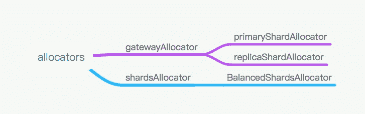

# 《Elasticsearch 源码解析与优化实战》第 12 章：allocation 模型分析

> 原文：[https://cloud.tencent.com/developer/article/1829016](https://cloud.tencent.com/developer/article/1829016)

# 简介

本文主要分析 allocation 模块的结构和原理，然后以集群启动过程为例分析 allocation 模块的工作过程

# 什么是 allocation

**分片分配就是把一个分片指派到集群中某个节点的过程。分配决策由主节点完成，分配决策包含两方面：**

*   **哪些分片应该分配给哪些节点**
*   **哪个分片作为主分片，哪些作为副本分片**

**对于新建索引和已有索引, 分片分配过程也不尽相同，不过不管哪种场景，ElasticSearch 都通过两个基础组件完成工作：`allocators [ˈæləʊkeɪtə(r)] 分配者`和`deciders */dɪˈsaɪdə/ 决定者*` Allocators 尝试寻找最优的节点来分配分片，Deciders 则负责判断并决定是否要进行这次分配.**

*   **对于新建索引，allocators 负责找出拥有分片数最少的节点列表，并按分片数量增序排序，因此分片较少的节点会被优先选择。所以对于新建索引，allocators 的目标就是以更为均衡的方式为把新索引的分片分配到集群的节点中。然后 deciders 依次遍历 allocators 给出的节点，并判断是否把分片分配到该节点。**例如：如果分配过滤规则中禁止节点 A 持有索引 sphinx-doctor 中的任一分片，那么过滤器也阻止把索引 sphinx-doctor 分配到节点 A 中，即便 A 节点是 allocators 从集群负载均衡角度选出的最优节点。需要注意的是 allocators 只关心每个节点上的分片数，而不管每个分片的具体大小。这恰好是 deciders 工作的一部分，即阻止把分片分配到将超出节点磁盘容量阈值的节点上。
*   **对于已有索引，则要区分主分片还是副本分片。对于主分片，allocators 只允许把主分片指定在已经拥有该分片完整数据的节点上。而对于副本分片，allocators 则是先判断其他节点上是否已有该分片的数据的拷贝(即便数据不是最新的)。如果有这样的节点，allocators 就优先把把分片分配到这其中一个节点。因为副本分片一旦分配，就需要从主分片中进行数据同步，所以当一个节点只拥分片中的部分时，也就意思着那些未拥有的数据必须从主节点中复制得到。这样可以明显的提高副本分片的数据恢复过程。**

# 触发 Allocation

```java
1.index 增删
2.node 增删
3.replica 数量改变
4.手工 reroute
5.集群重启
```

# Allocation 模块结构概述

这个复杂的分配过程在一个叫 reroute 的函数中实现：`AllocationService.reroute`

此函数对外有两种重载，一种是通过接口调用的手工 reroute，另一种是内部模块调用的 reroute。本章以内部模块调用的 reroute 为例，手工 reroute 过程与此类似。

`AllocationService.reroute`对一个或多个主分片或副分片执行分配，分配以后产生新的集群状态。**Master 节点将新的集群状态广播下去，触发后续的流程。**对于内部模块调用，返回值为新产生的集群状态，对于手工执行的 reroute 命令，返回命令执行结果。

# Allocators

Es 中有以下几个类型的 allocator：

<figure class=""></figure>

Allocator 负责为某个特定的 shard 分配目的节点。每个 Allocator 的主要工作是根据某种逻辑得到一个节点列表，然后调用 deciders 去决策，根据决策结果选择一个目的 node。

**Allocators 分为 gatewayAllocator 和 shardsAllocator 两种。gatewayAllocator 是为了找到现有分片，shardsAllocator 是根据权重策略在集群的各节点间均衡分片分布。其中 gatewayAllocator 又分主分片和副分片的 allocator。**下面概述每个 allocator 的作用。

*   **primaryShardAllocator：找到那些拥有某分片最新数据的节点;**
*   **replicaShardAllocator：找到磁盘上拥有这个分片数据的节点;**
*   **BalancedShardsAllocator：找到拥有最少分片个数的节点。**

**对于这两类 Allocator，我的理解是 gatewayAllocator 是为了找到现有 shard，shardsAllocator 是为了分配全新 shard。**

# Deciders

目前有下列类型的决策器：

```java
public static Collection<AllocationDecider> createAllocationDeciders(...) {
    Map<Class, AllocationDecider> deciders = new LinkedHashMap<>();
    addAllocationDecider (deciders, new MaxRetryAllocationDecider(settings));
    addAllocationDecider (deciders, new ResizeAllocationDecider(settings));
    addAllocationDecider (deciders, new ReplicaAfterPrimaryActiveAllocation-Decider(settings));
    addAllocationDecider (deciders, new RebalanceOnlyWhenActiveAllocation-Decider(settings));
    addAllocationDecider (deciders, new ClusterRebalanceAllocationDecider(settings, clusterSettings));
    addAllocationDecider (deciders, new ConcurrentRebalanceAllocationDecider(settings, clusterSettings));
    addAllocationDecider (deciders, new EnableAllocationDecider(settings, clusterSettings));
    addAllocationDecider (deciders, new NodeVersionAllocationDecider(settings));
    addAllocationDecider (deciders, new SnapshotInProgressAllocationDecider(settings));
    addAllocationDecider (deciders, new RestoreInProgressAllocationDecider(settings));
    addAllocationDecider (deciders, new FilterAllocationDecider(settings, clusterSettings));
    addAllocationDecider (deciders, new SameShardAllocationDecider(settings, clusterSettings));
    addAllocationDecider (deciders, new DiskThresholdDecider(settings, clusterSettings));
    addAllocationDecider (deciders, new ThrottlingAllocationDecider(settings, clusterSettings));
    addAllocationDecider (deciders, new ShardsLimitAllocationDecider(settings, clusterSettings));
    addAllocationDecider (deciders, new AwarenessAllocationDecider(settings, clusterSettings));

    return deciders.values();
}
```

它们继承自 AllocationDecider，需要实现的接口有：

*   canRebalance：给定分片是否可以“re-balanced” 到给定 allocation；
*   canAllocate：给定分片是否可以分配到给定节点；
*   canRemain：给定分片是否可以保留在给定节点；
*   canForceAllocatePrimary：给定主分片是否可以强制分配在给定节点；

这些 deciders 在 ClusterModule#createAllocationDeciders 中全部添加进去，decider 运行之后可能产生的结果有以下几种：

```java
ALWAYS、YES、NO、THROTTLE
```

这些 deciders 大致可以分为以下几类。

## 负载均衡类

```java
SameShardAllocationDecider
避免主副分片分配到同一个节点

AwarenessAllocationDecider
感知分配器，感知服务器、机架等，尽量分散存储 shard
有两种参数用于调整:
    cluster.routing.allocation.awareness.attributes: rack_id
    cluster.routing.allocation.awareness.attributes: zone

ShardsLimitAllocationDecider
同一个节点上允许存在的同一个 index 的 shard 数目
```

## 并发控制类

```java
ThrottlingAllocationDecider
recovery 阶段的限速配置，包括: 
    cluster.routing.allocation.node_concurrent_recoveries
    cluster.routing.allocation.node_initial_primaries_recoveries
    cluster.routing.allocation.node_concurrent_incoming_recoveries
    cluster.routing.allocation.node_concurrent_outgoing_recoveries

ConcurrentRebalanceAllocationDecider
rebalance 并发控制，可以通过下面的参数配置:
    cluster.routing.allocation.cluster_concurrent_rebalance

DiskThresholdDecider
根据磁盘空间进行决策的分配器
```

## 条件限制类

```java
RebalanceOnlyWhenActiveAllocationDecider
所有 shard 都处在 active 状态下，才可以执行 rebalance 操作

FilterAllocationDecider
可以调整的参数如下，可以通过接口动态设置:
    index.routing.allocation.require.* [ 必须] ]
    index.routing.allocation.include.* [ 允许 ]
    index.routing.allocation.exclude.* [ 排除 ]
    cluster.routing.allocation.require.*
    cluster.routing.allocation.include.*
    cluster.routing.allocation.exclude.*
    配置的目标为节点 IP 或节点名等。cluster 级别设置会覆盖 index 级别设置。

ReplicaAfterPrimaryActiveAllocationDecider
保证只会在主分片分配完毕后才开始分配分片副本。

ClusterRebalanceAllocationDecider
通过集群中 active 的 shard 状态来决定是否可以执行 rebalance，通过下面的配置控制，可以动态生效:
    cluster.routing.allocation.allow_rebalance
```

可配置的值如下表所示：

| 

取值

 | 

含义

 |
| --- | --- |
| 

indices_ all_active

 | 

当集群所有的节点分配完毕，才认定集群 rebalance 完成(默认)

 |
| 

indices_primaries_active

 | 

只要所有主分片分配完毕，就可以认定集群 rebalance 完成

 |
| 

always

 | 

即使当主分片和分片副本都没有分配，也允许 rebalance 操作

 |

# 核心 reroute 实现

reroute 中主要实现两种 allocator：

*   **gatewayAllocator：用于分配现实已存在的分片，从磁盘中找到它们；**
*   **shardsAllocator：用于平衡分片在节点间的分布；**

```java
private void reroute (RoutingAllocation allocation) {
    if(allocation.routingNodes().unassigned().size() > 0) {
        removeDelayMarkers (allocation) ;
        //gateway 分配器
        gatewayAllocator.allocateUnassigned (allocation);
    }
    //分片均衡分配器
    shardsAllocator.allocate(allocation);
}
```

reroute 流程全部运行于 `masterService#updateTask`线程。

## 集群启动时 reroute 的触发时机

gateway 结束前调用 submitStateUpdateTask 提交任务，任务被 clusterService 放入队列，在 Master 节点顺序执行。

执行到任务中的：`allocationService.reroute`

收集各个节点的 shard 元数据，待某个 shard 的 Response 从所有节点全部返回后，执行 finishHim()，然后对收集到的数据进行处理：`AsyncShardFetch#processAsyncFetch`

`allocationService.reroute`执行完毕返回新的集群状态。下面以集群启动时 gateway 之后的 reroute 为背景分析流程。

## 流程分析

**gateway 阶段恢复的集群状态中，我们已经知道集群一共有多少个索引，每个索引的主副分片各有多少个，但是不知道它们位于哪个节点，现在需要找到它们都位于哪个节点。集群完全重启的初始状态，所有分片都被标记为未分配状态，此处也被称作分片分配过程。因此分片分配的概念不仅仅是分配一个全新分片。对于索引某个特定分片的分配过程中，先分配其主分片，后分配其副分片。**

## GatewayAllocator

gatewayAllocator 分为主分片和副分片分配器:

```java
primaryShardAllocator.allocateUnassigned (allocation) ;
replicaShardAllocator.processExistingRecoveries (allocation) ;
replicaShardAllocator.allocateUnassigned (allocation) ;
```

它们都继承自 BaseGatewayShardAllocator ，如下图所示。

<figure class=""></figure>

### 主分片分配器

`primaryShardAllocatorallocateUnassigned`函数实现整个分配过程。

主分片分配器与副分片分配器都继承自`BaseGatewayShardAllocator`， 执行相同的`allocateUnassigned`函数，只是执行`makeAllocationDecision`时，主副分片分配器各自执行自己的策略。

`allocateUnassigned`的流程是：遍历所有`unassigned shard`, 依次处理，通过`decider`决策分配，期间可能需要`fetchData`获取这个 shard 对应的元数据。如果决策结果为 YES，则将其初始化。

```java
public void allocateUnassigned (RoutingAllocation allocation) {
    //遍历未分配的分片
    while (unassignedIterator.hasNext() ) {
        final ShardRouting shard = unassignedIterator.next() ;
        //调用主分片分配器的 makeAllocationDecision 进行决策
        final AllocateUnassignedDecision allocateUnassignedDecision = makeAllocationDecision (shard, allocation，logger);
        //根据决策器结果决定是否初始化分片
        if (allocateUnas signedDecision.getAllocationDecision() == AllocationDecision.YES) {
            unassignedIterator. initialize(...);
        } else {
            unassignedIterator . removeAndIgnore(. ..) ;
        }
    }
}
```

主副分片执行同的 `unassigned!terator.initialize` 函数，将分片的 `unassigned` 状态改为 `initialize` 状态：

```java
public ShardRouting initializeShard(. ..) {
    //初始化一个 ShardRouting
    ShardRouting initializedShard = unassignedShard.initialize(nodeId, existingAllocationId, expectedSize);
    //添加到目的节点的 shard 列表
    node (nodeId).add(initializedShard);
    addRecovery (initializedShard);
    //添加到 assignedshards 列表
    assignedShardsAdd (initial i zedShard);
    //设置状态已更新
    routingChangesObserver.shardInitialized (unassignedShard, initializedShard);
    return initializedShard;
}
```

在`routingChangesObserver.shardInitialized`中设置`RoutingNodes`已更新。更新的内容大约就是某个 shard 被分配到了某个节点，这个 shard 是主还是副，副的话会设置 recoverySource 为 PEER，但只是一个类型，并没有告诉节点 recovery 的时候从哪个节点恢复，节点恢复时自己从集群状态中的路由表中查找。

reroute 完成后构建新的集群状态：

```java
protected ClusterState reroute (final ClusterState clusterState, String reason, boolean debug) {
    reroute (allocation);
    if (allocation.routingNodesChanged() == false) {
        return clusterState;
    }
    return buildResultAndLogHealthChange(clusterState, allocation, reason);
}
```

然后，**Master 把新的集群状态广播下去，当数据节点发现某个分片分配给自己，开始执行分片的 recovery。**

`PrimaryShardAllocator#makeAllocationDecision`主分片分配器的`makeAllocationDecision`过程返回指定的分片是否可以被分配，如果还没有这个分片的信息，则向集群的其他节点去请求该信息；如果已经有了，则根据 decider 进行决策。

**首次进入函数时，还没有任何分片的元信息，发起向集群所有数据节点获取某个 shard 元信息的 fetchData 请求。之所以把请求发到所有节点，是因为它不知道哪个节点有这个 shard 的数据。集群启动的时候，遍历所有 shard，再对每个 shard 向所有数据节点发 fetchData 请求。如果集群有 100 个节点、1000 个分片，则总计需要请求 100X 1000= 100000 次。虽然是异步的，但仍然存在效率问题。当 ES 集群规模比较大、分片数非常多的时候，这个请求的总量就会很大。**

### 1\. 向各节点发起 fetchData 请求

**从所有数据节点异步获取某个特定分片的信息，没有超时设置。**

```java
void asyncFetch (final DiscoveryNode[] nodes， long fetchingRound) {
    //nodes 为节点列表
    action.list(shardId, nodes, new ActionListener<BaseNodesResponse<T>>() {
        //收到成功的回复
        public void onResponse (BaseNodesResponse<T> response) {
            processAsyncFetch (response .getNodes()，response. failures() , fetchingRound);
        }
        //收到失败的回复
        public void onFailure (Exception e) {
            List<FailedNodeException> failures = new ArrayList<>(nodes.length);
            for (final Di scoveryNode node: nodes) {
                failures.add(. ..);
            }
            processAsyncFetch(null, failures, fetchingRound);
        }
    });
}
```

请求节点 shard 元信息的 action 为：

```java
internal:gateway/local/started_ shards
```

遍历发送的过程主要实现位于：

```java
TransportNodesAction.AsyncAction#start
```

### 2\. 数据节点的响应

对端对此响应的模块为:

```java
gateway.TransportNodesListGatewayStartedShards#nodeOperation
```

其中读取本地 shard 元数据返回请求方。

### 3\. 收集返回结果并处理

对于一个特定 shard，当 Response 达到期望数量(发出请求时的节点数)时执行 finishHim，调用处理模块：

```java
AsyncShardFetch#processAsyncFetch
```

在这里实现收到各节点返回的 shard 级别元数据的对应处理，将 Response 信息放到 this.cache 中，下次“reroute” 的时候从 cache 里取，然后再次执行 reroute。

```java
reroute(shardId, "post_ response");
//接着调用-->
routingService.reroute ("async_ shard_ fetch"); 
```

主要实现是对当前 ClusterState 提交一个任务，再次执行`allocationService.reroute`，此时 this.cache 中已经有了 shard 元数据，进入主分片分配过程，依据这些元信息选择主分片。

**4\. 主分片选举实现**

**ES5 之后的主分片选举与之前的版本机制是不一样的。ES5 之前的版本依据分片元数据的版本号对比实现，选择分片元信息中版本号高的分片来选举主分片，ES5 及之后的版本依据 allocation id 从 inSyncAllocationIds 列表中选择一个作为主分片。 这种改变的主要原因是依据版本号无法保证版本号最高的分片一定被选为主分片。**例如，当前只有一个活跃分片，那它一定被选为主分片，而拥有最新数据的分片尚未启动。具体请参考“数据模型”章节。

在 makeAllocationDecision 函数中，从 inSyncAllocationIds 集合中找到活跃的 shard, 得到一个列表，把这个列表中的节点依次执行 decider，决策结果：

```java
//根据 shard id 从集群状态获取同步 ID 列表
final Set<String> inSyncAllocationIds = indexMetaData.inSyncAllocationIds(unassignedShard.id());
//构建匹配同步 ID 的目标节点列表
final NodeShardsResult nodeShardsResult = buildNodeShardsResult(unassignedShard, snapshotRestore, allocation.getIgnoreNodes(unassignedShard.shardId()), inSyncAllocationIds, shardState, logger);
//对上一步得到的列表中的节点依次执行 decider,决策结果
NodesToAllocate nodesToAllocate = buildNodesToAllocate(allocation, nodeShardsResult.orderedAllocationCandidates, unassignedShard, false);
```

具体的决策过程会依次遍历全部 decider：

```java
public Decision canAllocate (ShardRouting shardRouting, RoutingNode node, RoutingAllocation allocation) {
    //遍历全部 decider
    for(AllocationDecider allocationDecider : allocations) {
        Decision decision = allocationDecider.canAllocate(shardRouting, node, allocation);
        if (decision == Decision.NO) {
            if (!allocation. debugDecision()) {
                return decision;
            } else {
                ret.add (decision);
        } else if (decision != Decision.ALWAYS && (allocation.getDebugMode() != EXCLUDE_ YES_ DECISIONS || decision.type() != Decision.Type.YES)) {
            ret.add (decision);
        }
    return ret;
}
```

**只要有一个 decider 拒绝，就拒绝执行本次分配。决策之后的结果可能会有多个节点，取第一个。至此，主分片选取完成。**

`cluster.routing.allocation.enable` 对主分片分配的影响，在集群完全重启的操作流程中，要求把这个选项先设置为 none，然后重启集群。分片分配时，在 EnableAllocationDecider 中对这个选项进行判断和实施，主分片的分配会被拦截吗?答案是肯定的，主分片被这个 decider 拦截。但是在主分片的分配过程中有另外一层逻辑：如果被 decider 拦截，返回 NO，则尝试强制分配。给`buildNodesToAllocate` 的最后一个参数传入 true，接下来尝试强制分配，逻辑如下:

```java
public Decision canForceAllocatePrimary (ShardRouting shardRouting, RoutingNode node, RoutingAl location allocation) {
    Decision decision = canAllocate (shardRouting, node, allocation);
    if (decision.type() == Type.NO) {
        // On a NO decision, by default, we allow force allocating the primary.
        return allocation. decision (Decision.YES, decision.label(),
            "primary shard [%s] allowed to force allocate on node [%s]",
            shardRouting. shardId() , node.nodeId());
    } else {
        // On a THROTTLE/ YES decision, we use the same decision instead of forcing allocation
        return decision;
    }
}
```

如果 decider 返回 NO，则直接设置成 YES，这种情况只在分配一个磁盘上已经存在的 unassigned primary shards 时出现。

### 副分片分配器

与主分片分配器同理，replicaShardAllocator.allocateUnassigned 函数实现了副分片的分配过程。其 allocateUnasigned 过程与 primaryShardAllocator.allocateUnassigned 执行的是基类的同一个函数。

```java
ReplicaShardAllocator#makeAllocationDecision
```

副分片决策过程中也需要“fetchData”，只不过主分片分配节点已经“fetch”过，可以直接从结果中获取。但是在“fetchData”之前先运行一遍 allocation.deciders().canAllocate，来判断是否至少可以在一个 node 上分配(canBeAllocatedToAtLeastOneNode)，如果分配不了就省略后面的逻辑了，例如，其主分片尚未就绪等。

**然后根据“fetchData”到的 shard 元信息，分配到已经拥有这个 shard 副本的节点**，如果没有相关节点，则判断是否需要“delay"，否则返回 NOT_TAKEN。分配成功之后一样进入 INIT 过程。

是否“delay”由下面的配置项控制，可以动态调整：

```java
index.unassigned.node_left.delayed_timeout
```

## ShardsAllocator

shardsAllocator 由 BalancedShardsAllocator 类完成，其中有三个配置项用于控制权重：

```java
cluster.routing.allocation.balance.index 
cluster.routing.allocation.balance.shard 
cluster.routing.allocation.balance.threshold
```

这些权重参数的具体作用建议参考 MasteringElasticsearch 或官方手册。

具体实现如下:

```java
public void allocate (RoutingAllocation allocation) {
    final Balancer balancer = new Balancer (logger, allocation, weightFunction, threshold);
    balancer.allocateUnassigned();
    balancer.moveShards();
    balancer.balance();
}
```

*   `allocateUnassigned`：根据权重算法和 decider 决定把 shard 分配到哪个节点。同样将决策后的分配信息更新到集群状态，由 Master 广播下去。
*   `moveShards`：对状态为 started 的分片根据 decider 来判断是否需要“move"，move 过程中此 shard 的状态被设置为 RELOCATING，在目标上创建这个 shard 时状态为 INITIALIZING，同时版本号会加 1。
*   `balance`：根据权重函数平衡集群模型上的节点。

# 从 gateway 到 allocation 流程的转换

**两者之间没有明显的界限，gateway 的最后一步执行 reroute，等待这个函数返回，然后打印 gateway 选举结果的日志，集群完全重启时，reroute 向各节点发起的询问 shard 级元数据的操作基本还没执行完，因此一般只有少数主分片被选举完了，gateway 流程的结束只是集群级和索引级的元数据已选举完毕，主分片的选举正在进行中。**

# 从 allocation 流程到 recovery 流程的转换

`makeAllocationDecision`成功后，`unassignedIterator.initialize` 初始化这个 shard，创建一个新的 ShardRouting 对象，把相关信息添加到集群状态，设置`routingChangesObserver` 为已经发生变化，后面的流程就会把新的集群状态广播出去。到此，reroute 函数执行完毕。

节点收到广播下来的集群状态，进入`IndicesClusterStateService#applyClusterState` 处理所有相关操作，其中，`createOrUpdateShards` 执行到 createShard 时，准备 recovery 相关信息：

```java
private void createShard (DiscoveryNodes nodes, RoutingTable routingTable, ShardRouting shardRouting, ClusterState state) {
    if (shardRouting.recoverySource().getType() == Type.PEER) {
        sourceNode = findSourceNodeForPeerRecovery (logger, routingTable, nodes, shardRouting);
        try {
            RecoveryState recoveryState = new RecoveryState(shardRouting, nodes.getLocalNode(), sourceNode);
            indicesService. createShard(...);
        } catch (Exception e) {
            failAndRemoveShard ( shardRouting, true, "failed to create shard", e, state);
        }
    }
}
```

接下来`IndicesService.createShard`开始执行`recovery`：

```java
public IndexShard createShard(. . .) throws IOException {
    IndexService indexService = indexService(shardRouting. index());
    IndexShard indexShard = indexService.createShard (shardRouting, globalCheckpointSyncer);
    indexShard.addShardFailureCallback(onShardFailure);
    indexShard.startRecover (recoveryState, recoveryTargetService, recoveryListener, repositoriesService,
        (type, mapping) -> {
            try (
                //concrete index - no name clash, it uses uuid
                client.admin().indices().preparePutMapping().setConcreteIndex(shardRouting.index()) 
                    .setType (type)
                    .setSource(mapping.source().string(), XContentType.JSON)
                    .get () ;
            } catch ( IOException ex) {
                throw new ElasticsearchException("failed to stringify mapping source", exx);
        ), this);
    return indexShard;
}
```

# 思考

*   请求分片信息的 fetchData 请求效率低，可以借鉴 HDFS 的上报块状态流程。
*   不需要等所有主分片都分配完才执行副分片的分配。每个分片有自己的分配流程。
*   不需要等所有分片都分配完才执行 recovery 流程。
*   主分片不需要等副分片分配成功才进入主分片的 recovery，主副分片有自己的 recovery 流程。