# 《Elasticsearch 源码解析与优化实战》第 13 章：Snapshot 模块分析

> 原文：[https://cloud.tencent.com/developer/article/1836496](https://cloud.tencent.com/developer/article/1836496)

# 简介

快照模块是 ES 备份、迁移数据的重要手段。它支持增量备份，支持多种类型的仓库存储。本章我们先来看看如何使用快照，以及它的一些细节特性，然后分析创建、删除及取消快照的实现原理。

仓库用于存储快照，支持共享文件系统(例如, NFS)，以及通过插件支持的 HDFS、AmazonS3、Microsoft Azure、Google GCS。

在跨版本支持方面，可以支持不跨大版本的快照和恢复。

*   在 6.x 版本中创建的快照可以恢复到 6.x 版本;
*   在 2.x 版本中创建的快照可以恢复到 5.x 版本;
*   在 1.x 版本中创建的快照可以恢复到 2.x 版本。

相反，1.x 版本创建的快照不可以恢复到 5.x 版本和 6.0 版本，2.x 版本创建的快照不可以恢复到 6.x 版本。升级集群前建议先通过快照备份数据。跨越大版本的数据迁移可以考虑使用 reindexAPI。

**当需要迁移数据时，可以将快照恢复到另一个集群。快照不仅可以对索引备份，还可以将模板一起保存。恢复到的目标集群不需要相同的节点规模，只要它的存储空间足够容纳这些数据即可。**

要使用快照，首先应该注册仓库。快照存储于仓库中。

# 仓库

仓库用于存储创建的快照。建议为每个大版本创建单独的快照存储库。如果使用多个集群注册相同的快照存储库，那么最好只有一个集群对存储库进行写操作。连接到该存储库的其他集群都应该将存储库设置为 readonly 模式。

使用下面的命令注册一个仓库：

```java
curl -X PUT " localhost: 9200/_ snapshot/my_ backup" -H ' Content-Type: application/json' -d'
{
    "type": "fs",
    "settings": {
        "location": "/mnt/my_backup"
    }
}
```

本例中，注册的仓库名称为 my_backup, type 为 fs，指定仓库类型为共享文件系统。共享文件系统支持的配置如下表所示。

| 

参数

 | 

简介

 |
| --- | --- |
| 

location

 | 

指定了一个已挂载的目的地址

 |
| 

compress

 | 

**是否开启压缩。压缩仅对元数据进行(mapping 及 settings)， 不对数据文件进行压缩，默认为 true**

 |
| 

chunk_ size

 | 

传输文件时数据被分解为块，此处配置块大小，单位为字节，默认为 null (无限块大小)

 |
| 

max_snapshot_bytes_per_sec

 | 

**快照操作时节点间限速值，默认为 40MB**

 |
| 

max_restore_bytes_per_ sec

 | 

**从快照恢复时节点间限速值，默认为 40MB**

 |
| 

readonly

 | 

**设置仓库属性为只读，默认为 false**

 |

要获取某个仓库配置信息，可以使用下面的 API：

```java
curl -X GET "localhost:9200/_snapshot/my_backup"
```

返回信息如下：

```java
{
    "my_ backup": {
        "type": "fs",
        "settings": {
            "location": "/mnt/my_backup"
        }
    }
}
```

要获取多个存储库的信息，可以指定一个以逗号分隔的存储库列表，还可以在指定存储库名称时使用“*”通配符。例如:

```java
curl -X GET "localhost:9200/_snapshot/repo*,*backup*"
```

要获取当前全部仓库的信息，可以省略仓库名称，使用 _ all:

```java
curl -X GET "localhost:9200/_snapshot"
或
curl -X GET "localhost:9200/_snapshot/_all"
```

可以使用下面的命令从仓库中删除快照:

```java
curl -X DELETE "localhost:9200/_snapshot/my_backup/snapshot_1"
```

可以使用下面的命令删除整个仓库:

```java
curl -X DELETE "localhost:9200/_snapshot/my_backup"
```

**当仓库被删除时，ES 只是删除快照的仓库位置引用信息，快照本身没有删除。**

### **共享文件系统**

**当使用共享文件系统时，需要将同一个共享存储挂载到集群每个节点的同一个挂载点(路径)，包括所有数据节点和主节点。然后将这个挂载点配置到 elasticsearch.yml 的 path.repo 字段。**例如，挂载点为/mnt/my_backup， 那么在 elasticsearch.yml 中应该添加如下配置：

```java
path.repo: ["/mnt/my_backups"]
```

path.repo 配置以数组的形式支持多个值。如果配置多个值，则不像 path.data 一样同时使用这些路径，相反，应该为每个挂载点注册不同的仓库。例如，一个挂载点存储空间不足以容纳集群所有数据，可使用多个挂载点，同时注册多个仓库，将数据分开快照到不同的仓库。

path.repo 支持微软的 UNC 路径，配置格式如下:

```java
path.repo: ["\\\\MY_SERVER\\Snapshots"]
```

当配置完毕，需要重启所有节点使之生效。然后就可以通过仓库 API 注册仓库，执行快照了。

使用共享存储的优点是跨版本兼容性好，适合迁移数据。缺点是存储空间较小。如果使用 HDFS，则受限于插件使用的 HDFS 版本。插件版本要匹配 ES，而这个匹配的插件使用固定版本的 HDFS 客户端。一个 HDFS 客户端只支持写入某些兼容版本的 HDFS 集群。

# 快照

## 创建快照

存储库可以包含同一集群的多个快照。每个快照有唯一的名称标识。通过以下命令在 my_backup 仓库中为全部索引创建名为 snapshot_1 的快照：

```java
curl -X PUT "localhost:9200/_snapshot/my_backup/snapshot_1?wait_for_completion=true"
```

`**wait_for_completion**` **参数是可选项，默认情况下，快照命令会立即返回，任务在后台执行，如果想等待任务完成 API 才返回，则可以将 wait_for_completion 参数设置为 true，默认为 false。**

上述命令会为所有 open 状态的索引创建快照。如果想对部分索引执行快照，则可以在请求的 indices 参数中指定：

```java
curl -X PUT "localhost:9200/_snapshot/my_backup/snapshot_2?wait_for_completion=true" -H 'Content-Type: application/json' -d'
{
    "indices": "index_1, index_2",
    "ignore_unavailable": true,
    "include_global_state": true
}
```

indices 字段支持多索引语法，index_ *完整的语法参考: [https://www.elastic.co/guide/en/elasticsearch/reference/current/ multi-index.html](https://www.elastic.co/guide/en/elasticsearch/reference/current/multi-index.html)

另外两个参数：

*   `**ignore_unavailable**`**，跳过不存在的索引。默认为 false, 因此默认情况下遇到不存在的索引快照失败。**
*   `**include_global_state**`**，不快照集群状态。默认为 false。注意，集群设置和模板保存在集群状态中，因此默认情况下不快照集群设置和模板，但是一般情况下我们需要将这些信息一起保存。**

**快照操作在主分片上执行。快照执行期间，不影响集群正常的读写操作。在快照开始前，会执行一次 flush，将操作系统内存“cache”的数据刷盘。因此通过快照可以获取从成功执行快照的时间点开始，磁盘中存储的 Lucene 数据，不包括后续的新增内容。但是每次快照过程是增量的，下一次快照只会包含新增内容。**

**可以在任何时候为集群创建一个快照过程，无论集群健康是 Green、Yellow，还是 Red。执行快照期间，被快照的分片不能移动到另一个节点，这可能会干扰重新平衡过程和分配过滤( alocation filtering)。这种分片迁移只可以在快照完成时进行。**

快照开始后，可以用快照信息 API 和 status API 来监控进度。

## 获取快照信息

当快照开始后，使用下面的 API 来获取快照的信息：

```java
curl -X GET "localhost:9200/_snapshot/my_backup/snapshot_1"
```

返回信息摘要如下：

```java
{
    " snapshots": [
    {
       "snapshot": "snapshot_1",
       "version": "6.1.2",
        "indices": [
            "website"
        ],
        "state": " SUCCESS",
        "start_time": "2018-05-15T03:40:06.571Z",
        "end_time": "2018-05-15T07:53:40.977Z",
        "duration_in_millis": 15214406,
        " failures": [] ,
        "shards": {
            "total": б,
            "failed": O,
            "successful": 6
        }
    }
  ]
}
```

主要是开始结束时间、集群版本、当前阶段、成功及失败情况等基本信息。快照执行期间会经历以下几个阶段，如下表所示。

| 

阶段

 | 

简介

 |
| --- | --- |
| 

IN_PROGRESS

 | 

**快照正在运行**

 |
| 

SUCCESS

 | 

**快照创建完成，并且所有分片都存储成功**

 |
| 

FAILED

 | 

**快照创建失败，没有存储任何数据**

 |
| 

PARTIAL

 | 

全局集群状态已储存，但至少有一个分片的数据没有存储成功。在返回的 failure 字段中包含了关于未正确处理分片的详细信息

 |
| 

INCOMPATIBLE

 | 

快照与当前集群版本不兼容

 |

使用下面的命令可以获取多个快照信息：

```java
curl -X GET "localhost: 9200/_snapshot/my_backup/snapshot_*, other_snapshot"
```

以及获取指定仓库下的全部快照信息:

```java
curl -X GET "localhost:9200/_snapshot/my_backup/_all"
```

如果一些快照不可用导致命令失败，则可以通过设置布尔参数 ignore_unavailable 来返回当前可用的所有快照。

可以使用下面的命令来查询正在运行中的快照：

```java
curl -X GET "localhost:9200/_snapshot/my_backup/_current"
```

## 快照 status

`_status API`用于返回快照的详细信息。

可以使用下面的命令来查询当前正在运行的全部快照的详细状态信息：

```java
curl -X GET "localhost:9200/_snapshot/_status"
```

返回的信息摘要如下：

```java
"stats": {
    "number_of_files": 31,
    "processed_files": 31,
    "total_size_in_bytes": 33802,
    "processed_size_in_bytes": 33802,
    "start_time_in_millis": 1526355676967,
    "time_in_millis": 15144003
}
```

主要是已处理的文件数和字节数等进度信息，但没有计算成百分比的形式。

使用下面的命令可以返回特定仓库中正在运行的所有快照的信息：

```java
curl -X GET "localhost:9200/_snapshot/my_backup/_status"
```

如果同时指定仓库名称和快照 ID，则此命令将返回指定快照的状态信息，即使它已经执行完成：

```java
curl -X GET "localhost:9200/_snapshot/my_backup/snapshot_1, snapshot_2/status"
```

## 取消、删除快照和恢复操作

**在设计上，快照和恢复在同一个时间点只允许运行一个快照或一个恢复操作。如果想终止正在进行的快照操作，则可以使用删除快照命令来终止它。删除快照操作将检查当前快照是否正在运行，如果正在运行，则删除操作会先停止快照，然后从仓库中删除数据。如果是已完成的快照，则直接从仓库中删除快照数据。**

```java
curl -x DELETE "localhost:9200/_snapshot/my_backup/snapshot_1"
```

**恢复操作使用标准分片恢复机制。因此，如果要取消正在运行的恢复，则可以通过删除正在恢复的索引来实现。注意，索引数据将全部删除。**

# 从快照恢复

**要恢复一个快照，目标索引必须处于关闭状态。**

使用下面的命令恢复一个快照：

```java
curl -X POST "localhost:9200/snapshot/my_backup/snapshot_1/_restore'
```

**默认情况下，快照中的所有索引都被恢复，但不恢复集群状态。通过调节参数，可以有选择地恢复部分索引和全局集群状态。索引列表支持多索引语法。**例如:

```java
curl -X POST " localhost:9200/snapshot/mybackup/snapshot_1/_restore" -H 'Content-Type: application/json' -d'
{
    "indices": "index_1, index_2" ,
    "ignore_unavailable": true,
    "include_global_state": true,
    "rename_pattern": "index_(.+)",
    "rename_replacement": "restored_index_$1"
}
```

具体参数介绍如下表所示。

| 

参数

 | 

简介

 |
| --- | --- |
| 

indices

 | 

**要恢复的索引列表。支持多索引语法(multi index syntax)**

 |
| 

ignore_unavailable

 | 

**与快照时含义相同**

 |
| 

include_global_state

 | 

**是否恢复集群状态，默认为 false。 设置为 true 时，快照中的模板被恢复，如果当前集群存在同名的模板，则会被覆盖。集群设置(persistent settings)同样被恢复**

 |
| 

rename_pattern

 | 

如下

 |
| 

rename_replacement

 | 

与上一个参数配合，通过正则表达式对恢复的索引重命名

 |
| 

partial

 | 

**是否允许在遇到错误时恢复部分数据，默认为 false**

 |

**恢复完成后，当前集群与快照同名的索引、模板会被覆盖。在集群中存在，但快照中不存在的索引、索引别名、模板不会被删除。因此恢复并非同步成与快照一致。**

## 部分恢复

**默认情况下，在恢复操作时，如果参与恢复的一个或多个索引在快照中没有可用分片，则整个恢复操作失败。这可能是因为创建快照时一些分片备份失败导致的。可以通过设置 partial 参数为 true 来尽可能恢复。但是，只有备份成功的分片才会成功恢复，丟失的分片将被创建一个空的分片。**

## 恢复过程中更改索引设置

**大多数的索引设置可以在恢复过程中被重写。**例如，下面的指令将在恢复索引 index_1 时不创建任何副本，以及采用默认的索引刷新间隔：

```java
curl -X POST "localhost:9200/_snapshot/my_backup/snapshot_1/_restore" -H 'Content-Type: application/json' -d'
    "indices": "index_ 1",
    "index settings": {
        " index.number_of_replicas": 0
    }
    "ignore_index_settings": [
        "index.refresh_interval"
    ]
}
```

有一些设置不能在恢复时修改，比如`index.number_of_shards`。

## 监控恢复进度

恢复过程是基于 ES 标准恢复机制的，因此标准的恢复监控服务可以用来监视恢复的状态。当执行集群恢复操作时通常会进入 Red 状态，这是因为恢复操作是从索引的主分片开始的，在此期间主分片状态变为不可用，因此集群状态表现为 Red。一旦 ES 主分片恢复完成，整个集群的状态将被转换成 Yellow，并且开始创建所需数量的副分片。一旦创建了所有必需的副分片，集群转换到 Green 状态。

查看集群的健康情况只是在恢复过程中比较高级别的状态，还可以通过使用 indices recovery 与 cat recovery 的 API 来获得更详细的恢复过程信息与索引的当前状态信息。

# 创建快照的实现原理

在快照的实现原理中我们重点关注几个问题：快照是如何实现的？增量过程是如何实现的？为什么删除旧快照不影响其他快照？

**ES 的快照创建是基于 Lucene 快照实现的。但是 Lucene 中的快照概念与 ES 的并不相同。Lucene 快照是对最后一个提交点的快照，一次快照包含最后一次提交点的信息，以及全部分段文件。因此这个快照实际上就是对已刷盘数据的完整的快照。注意 Lucene 中没有增量快照的概念。每一次都是对整个 Lucene 索引完整快照，它代表这个 Lucene 索引的最新状态。之所以称为快照，是因为从创建一个 Lucene 快照开始，与此快照相关的物理文件都保证不会删除。**在 Lucene 中，快照通过 SnapshotDeletionPolicy 实现。从 Lucene 2.3 版本开始支持。

你可能还记得，在副分片的恢复过程中，也需要对主分片创建 Lucene 快照，然后复制数据文件。

因此总结来说：

*   **Lucene 快照负责获取最新的、已刷盘的分段文件列表，并保证这些文件不被删除，这个文件列表就是 ES 要执行复制的文件。**
*   **ES 负责数据复制、仓库管理、增量备份，以及快照删除。**

创建快照的整体过程如下图所示。

<figure class=""></figure>

ES 创建快照的过程涉及 3 种类型的节点：

*   **协调节点：接收客户端请求，转发到主节点。**
*   **主节点：将创建快照相关的请求信息放到集群状态中广播下去，数据节点收到后执行数据复制。同时负责在仓库中写入集群状态数据。**
*   **数据节点：负责将 Lucene 文件复制到仓库，并在数据复制完毕后清理仓库中与任何快照都不相关的文件。由于数据分布在各个数据节点，因此复制操作必须由数据节点执行。每个数据节点将快照请求中本地存储的主分片复制到仓库。**

**快照过程是对 Lucene 物理文件的复制过程，一个 Lucene 索引由许多不同类型的文件组成。**完整的介绍可以参考 Lucene 官方手册，当前版本的地址为: [http://lucene.apache.org/core/7_3_1/index.html](http://lucene.apache.org/core/7_3_1/index.html)。

**如果数据节点在执行快照过程中异常终止，例如，I/O 错误，进程被“kill", 服务器断电等异常，则这个节点上执行的快照尚未成功，当这个节点重新启动，不会继续之前的数据复制流程。对于整个快照进程来说，最终结果是部分成功、部分失败。快照信息中会记录失败的节点和分片，以及与错误相关的原因。**

## Lucene 文件格式简介

### 1.定义

Lucene 中基本的概念包括 index、document、field 和 term。一个 index 包含一系列的 document：

*   一个 document 是一系列的 fields
*   一个 field 是一系列命名的 terms
*   一个 term 是一系列 bytes

### 2.分段

Lucene 索引可能由多个分段(segment) 组成，每个分段是一个完全独立的索引，可以独立执行搜索。有两种情况产生新的分段：

*   **refresh 操作产生一个 Lucene 分段。为新添加的 documents 创建新的分段。**
*   **已存在的分段合并，产生新分段。**

一次对 Lucene 索引的搜索需要搜索全部分段。

### 3.文件命名规则

属于一个段的所有文件都具有相同的名称和不同的扩展名。当使用复合索引文件(默认)时，除.si write.lock .del 外的其他文件被合并压缩成单个.cfs 文件。

文件名不会被重用，也就是说，任何文件被保存到目录中时，它有唯一的文件名。 这是通过简单的生成方法实现的，例如，第一个分段文件名为 segments_1，接下来是 segments_2。

### 4.文件扩展名摘要

下表总结了 Lucene 中文件的名称和扩展名。

<figure class="">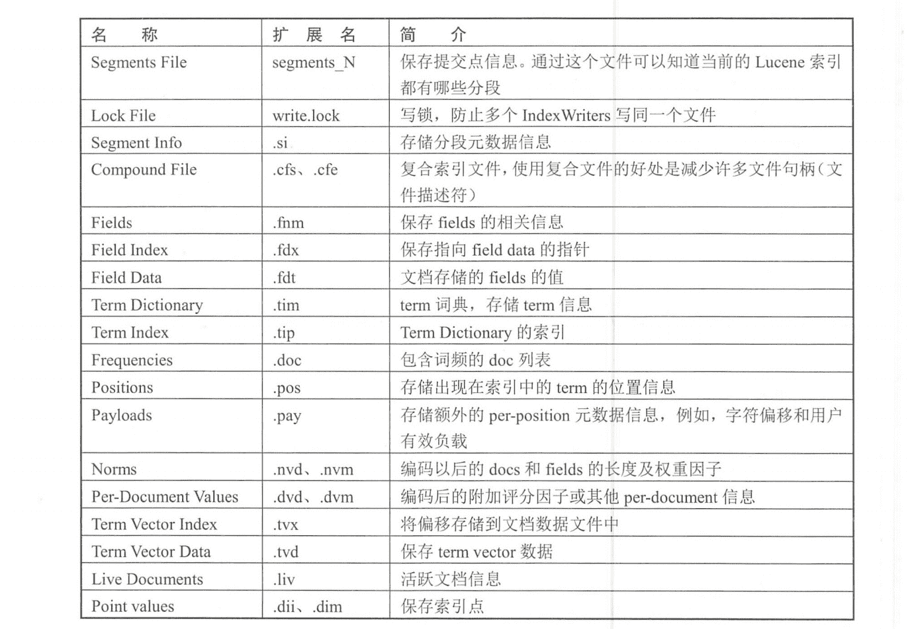</figure>

下面我们开始分析三种类型节点各自的执行流程。

## 协调节点流程

**协调节点负责解析请求，将请求转发给主节点。**

处理线程: `http_server_worker`。

协调节点注册的 REST action 为 create_snapshot_action，相应的 Handler 为 RestCreate-SnapshotAction 类。当协调节点收到客户端请求后，在 BaseRestHandler#handleRequest 中处理请求，调用 RestCreateSnapshotAction#prepareRequest 解析 REST 请求，将请求封装为 CreateSnapshotRequest 结构，然后将该请求发送到 Master 节点。

```java
public RestChannelConsumer prepareRequest (final RestRequest request, final NodeClient client) throws IOException {
    //将请求封装为 CreateSnapshotRequest 结构
    CreateSnapshotRequest createSnaps hotRequest = createSnapshotRequest(request.param ("repository"), request.param("snapshot"));
    request.applyContentParser(p -> createSnapshotRequest.source(p.mapOrdered()));
    //设置超时 wait_for_completion 等待参数信息
    createSnapshotRequest.masterNodeTimeout(request.paramAsTime("master_timeout", createSnapshotRequest.masterNodeTimeout()));
    createSnapshotRequest.waitForCompletion(request.par amAsBoolean("wait_for_completion", false));
    return channel -> client.admin().cluster().createSnapshot(createSnapshotRequest, new RestToXContentListener<> (channel));
}
```

在 TransportMasterNodeAction.AsyncSingleAction#doStart 方法中，判断本地是否是主节点，如果是主节点，则转移到 snapshot 线程处理，否则发送 action 为 cluster:pdmin/snapshot/create 的 RPC 请求到主节点，request 为组装好的 CreateSnapshotRequest 结构。

```java
代码摘要如下：
protected void doStart (ClusterState clusterState) {
    if (nodes. isLocalNodeElectedMaster () ll localExecute (request) ) {
        //本地是主节点，在新的线程池中处理请求
        threadPool.executor(executor).execute(new ActionRunnable (delegate) {
            protected void doRun() throws Exception {
                masterOperation(task, request, clusterState, delegate) ;
            }
        ]);
    } else { //转发到主节点。request 为组装好的 CreateSnapshotRequest 结构
        transportService.sendRequest (masterNode, actionName, request, new ActionLi stenerResponseHandler <Response> (listener,
        TransportMasterNodeAction.this::newResponse)
    }
}
```

从实现角度来说，协调节点和主节点都会执行 TransportMasterNodeAction.AsyncSingleActiont#doStart 方法，只是调用链不同。

## 主节点流程

主节点的主要处理过程是将请求转换成内部需要的数据结构，提交一个集群任务进行处理，集群任务处理后生成的集群状态中会包含请求快照的信息，**主节点将新生成的集群状态广播下去，数据节点收到后执行相应的实际数据的快照处理**。

执行本流程的线程池: `http_server_worker->snapshot->masterService#updateTask`。

如上一节所述，主节点收到协调节点发来的请求也是在 TransportMasterNodeAction。AsyncSingleAction#doStart 方法中处理的，在 snapshot 线程池中执行 TransportCreateSnapshot-Action#masterOperation 方法。将收到的 CreateSnapshotRequest 请求转换成 SnapshotsService.SnapshotRequest 结构，调用 snapshotsService.createSnapshot 方法提交一个集群任务。

```java
protected void masterOperation(.. .) {
    snapshotsService.createSnapshot (snapshotRequest, new SnapshotsService.CreateSnapshotListener () {
        public void onResponse () {
            //根据需要注册一个 Listener, 快照执行完毕才返回响应给客户端.
            if (request.waitForCompletion()) {
            snapshotsService.addListener (new SnapshotsService.SnapshotCompletionListener () {
                public void onSnapshotCompletion (Snapshot snapshot, SnapshotInfo snapshotInfo) {
                    ......
                }
                public void onSnapshotFailure (Snapshot snapshot, Exception e) {
                    ......
                }
            ]) ;
        } else {//给客户端返回结果，快照任务后台执行
            listener.onResponse (new CreateSnapshotResponse());
        }
    }
    //对执行失败的处理
    public void onFailure (Exception е) {
        listener. onFailure (е) ;
    }
}) ;
```

我们忽略对请求的验证和超时处理，以及失败处理等不重要的细节，摘取 snapshotsService.createSnapshot 的主要实现如下:

```java
public void createSnapshot (final SnapshotRequest request, final CreateSnapshotListener listener) {
    clusterService.submitStateUpdateTask (request.cause()，new ClusterStateUpdateTask() {
        //定义要执行的任务
        public ClusterState execute (ClusterState currentState) {
            //快照任务不能并行，同一时间只能有一个快照在执行
            if (snapshots == null || snapshots.entries().isEmpty()) {
                //要快照的索引列表
                List<IndexId> snapshotIndices = repositoryData.resolveNewIndices (indices);
                newSnapshot = new SnapshotsInProgress.Entry (new Snapshot(repositoryName，snapshotId),
                    request.includeGlobalState(), 
                    request.partial(),
                    State.INIT, //初始状态为 INIT 
                    snapshotIndices,
                    System.currentTimeMillis()，
                    repositoryData.getGenId(),
                    null) ;
                snapshots = new SnapshotsInProgress (newSnapshot);
            } else {
                throw new ConcurrentSnapshotExecut ionException (repositoryName, snapshotName，" a snapshot is already running");
                //根据 snapshots 信息生成新的集群状态
                return ClusterState.builder (currentState).putCustom(SnapshotsInProgress.TYPE，snapshots).build();
            }
            //待 state 为 INIT 集群状态处理成功后，发送 State 为 START 的集群状态
            public void clusterStateProcessed(String source, ClusterState oldState, final ClusterState newState) {
                if (newSnapshot != null) {
                    threadPool.executor(ThreadPool.Names.SNAPSHOT).execute(() ->
                        beginSnapshot (newState, newSnapshot, request.partia (), listener)
                );
            }
        }
    }
}
```

提交的任务在`masterService#updateTask`线程中执行。在任务中对请求做非法检查，以及是否已经有快照在执行等验证操作，然后将快照请求的相关信息放入集群状态中，广播到集群的所有节点，触发数据节点对实际数据的处理。快照信息在集群状态的 customs 字段中，其组织结构如下图所示。

<figure class="">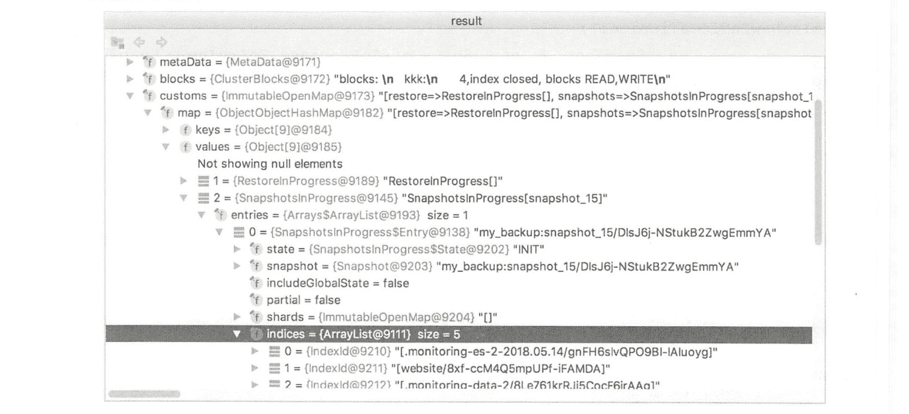</figure>

**主节点控制数据节点执行快照的方式，就是通过把要执行的快照命令放到集群信息中广播下去。在执行快照过程中，主节点分成两个步骤，下发两次集群状态。首次发送时，快照信息中的 State 设置为 INIT，数据节点进行一些初始化操作。待数据节点将这个集群状态处理完毕后，主节点准备下发第二次集群状态。第二次集群状态在 SnapshotsService#beginSnapshot 方法中构建。**

**在下发第二次集群状态前，主节点会先将全局元信息和索引的元数据信息写入仓库。**

```java
public void initializeSnapshot (SnapshotId snapshotId, List<IndexId> indices, MetaData clusterMetaData) {
    try {
        //写全局元信息
        globalMetaDataFormat.write (clusterMetaData, snapshotsBlobContainer, snapshotId.getUUID());
        //为快照的每个索引写索引级元信息
        for (IndexId index : indices) {
            final IndexMetaData indexMetaData = clusterMetaData.index.(index.getName());
            final BlobPath indexPath = basePath().add ("indices").add(index.getId());
            final BlobContainer indexMetaDataBlobContainer = blobStore().blobContainer(indexPath) ;
            indexMetaDataFormat.write (indexMetaData, indexMetaDataBlobContainer, snapshotId.getUUID());
        } catch (IOException ех) {
            throw new SnapshotCreationException (metadata.name(), snapshotId, ex);
        }
    }
}
```

**在新的集群状态中，将 State 设置为 STARTED，并且根据将要快照的索引列表计算出分片 列表(注意全是主分片)，数据节点收到后真正开始执行快照。**

## 数据节点流程

**数据节点负责实际的快照实现，从全部将要快照的分片列表中找出存储于本节点的分片，对这些分片创建 Lucene 快照，复制文件。**

### 1\. 对 ClusterState 的处理

对收到的集群状态的处理在`clusterApplierService#updateTask` 线程池中。启动快照时，在 snapshot 线程池中。

数据节点对主节点发布的集群状态( ClusterState)的统一处理在`ClusterApplierService#callClusterStateListeners`方法中，`clusterStateListeners` 中存储了所有需要对集群状态进行处理的模块。当收到集群状态时，遍历这个列表，调用各个模块相应的处理函数。快照模块对此的处理在`SnapshotShardsService#clusterChanged`方法中。在该方法中，在做完一些简单的验证之后,调用`SnapshotShardsServicet#processIndexShardSnapshots`进入主要处理逻辑。数据节点对第一次集群状态的处理实际上没做什么有意义的操作。对第二次集群状态的处理是真正快照的核心实现。主节点第二次下发的集群状态中包含了要进行快照的分片列表。数据节点收到后过滤一下本地有哪些分片，构建一个新的列表，后续要进行快照的分片就在这个列表中。

```java
for (Obj ectObjectCursor<ShardId, ShardSnapshotStatus> shard : entry.shards ()) {
    //准备本节点要处理的分片
    if (localNodeId. equals (shard. value.nodeId())) {
        if (shard. value.state() == State. INIT && (snapshotShards == null || ! snapshotShard .shards.containsKey(shard.key))) {
            logger.trace("[(]] - Adding shard to the queue", shard.key);
            startedShards.put (shard.key, new IndexShardSnapshotStatus());
        }
    }
}
//本节点要处理的分片列表
newSnapshots.put(entry.snapshot(), startedshards) ;
```

然后遍历本地要处理的分片列表，在`snapshot`线程池中对分片并行执行快照处理。并行数量取决于 snapshot 线程池中的线程个数，默认的线程数最大值为: `min(5，(处理器数量) /2)`

处理完毕后，向主节点发送 RPC 请求以更新相应分片的快照状态。

```java
if (newSnapshots. isEmpty() == false) {
    Executor executor.= threadPool.executor (ThreadPool.Names.SNAPSHOT);
    for (final Map. Entry<Snapshot, Map<ShardId, IndexShardSnapshotStatus>> entry : newSnapshots.entrySet()) {
        //shard 级并发执行快照
        for (final Map.Entry<ShardId, IndexShardSnapshotstatus> shardEntry : entry.getValue().entrySet()) {
            executor.execute (new Abs tractRunnable () {
                public void doRun() {
                    //对特定分片执行快照
                    snapshot (indexShard, snapshot, indexId, shardEntry.getValue());
                        public void onAfter () {
                            //向 Master 节点发送请求以更新快照状态
                            final Exception exception = failure.get ();
                            if (exception != null) l
                                final String failure = ExceptionsHelper.detailedMessage(exception) ;
                                notifyFailedSnapshotShard (snapshot, shardId, localNodeId, failure, masterNode) ;
                            } else {
                                notifySuccess fulSnapshotShard (snapshot, shardId, localNodeId, masterNode);
                            }
                        }
                ]) ;
            }
       }
}
```

### 2\. 对一个特定分片的快照实现

现在我们讨论数据节点对单个分片执行快照的过程，所有的分片执行一样的流程。本节以单个分片的处理为背景。

*   `Lucene`快照

由于 ES 的快照基于 Lucene 快照实现，本节我们先介绍 Lucene 快照的实现原理。Lucene 的快照在`SnapshotDeletionPolicy#snapshot`方法中实现。该方法返回一个提交点，通过提交点可以获取分片的最新状态，包括全部 Lucene 分段文件的列表。从得到这个列表开始，列表中的文件都不会被删除，直到释放提交点。

先看一下 Lucene 快照的实现：

```java
IndexCommitRef (SnapshotDeletionPolicy deletionPolicy) throws IOException {
    //调用 Lucene 接口创建快照，返回提交点
    indexCommit = deletionPolicy. snapshot() ;
    //处理完毕，释放快照资源
    onClose = () -> deletionPolicy. release (indexCommit) ;
}
```

`deletionPolicy`初始化时使用的是`KeepOnlyLastCommitDeletionPolicy`, 对最后一次提交进行快照，包含全部 Lucene 分段，代表 Lucene 索引在磁盘中的最新状态。

```java
this.deletionPolicy = new CombinedDeletionPolicy (
new SnapshotDeletionPolicy (new KeepOnlyLastCommi tDeletionPolicy()), ...);
```

*   `ES`快照整体过程

数据节点在 snapshot 线程池中执行`SnapshotShardsService#snapshot`方法，对特定分片创建快照。

在做完一些验证工作后，调用 Lucene 接口创建快照，返回 Engine.IndexCommitRef，其中含有最重要的提交点。然后根据 Lucene 提交点创建 ES 快照：

```java
//创建 Lucene 快照，快照前先执行 flush 操作，但不执行 refresh 操作（flush 操作时，会执行一次 fresh）
try (Engine.IndexCommitRef snapshotRef = indexShard.acquireIndexCommit (true)) {
    //根据 Lucene 提交点创建快照
    repository.snapshotShard (indexShard, snapshot. getSnapshotId(), indexId, snapshotRef.getIndexCommit()，snapshotStatus);
}
```

我们通过一个例子来分析整个过程，为了简化场景，我们在单节点的集群上创建了只有一个主分片的索引 website。写入数据，执行两次提交，每次提交后创建一个 ES 快照。在第二次执行快照 snapshot_2 时，ES 数据磁盘中存储的数据文件如下：

<figure class=""></figure>

<figure class=""></figure>

可以看到 Lucene 文件中存在两个分段，分别是 _0.*和 _1.*。其中，分段 0 有三个文件：_0.cfe、_0.cfs、_0.si。获取 Lucene 快照后，返回值 snapshotRef 中包含提交点( indexCommit)信息|，其中 Lucene 的文件列表如下图所示。

<figure class="">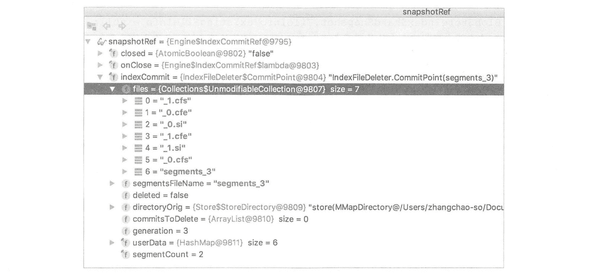</figure>

files 中包含全部两个 Lucene 分段文件。接下来处理这个 Lucene 提交点。

ES 快照的核心流程就是根据这个提交点创建快照。封装的方法为`BlobStoreRepository.SnapshotContext#snapshot`。下面介绍主要实现过程。

*   根据 Lucene 提交点计算两个列表

当前的 Lucene 提交点代表分片的最新状态，它包含全部 Lucene 分段。如果不考虑增量备份，则把这个文件列表全部复制到仓库就可以了。但是我们要实现的是每次快照都是增量的。

实现方法就是计算出两个列表：

**(1) 新增文件列表，代表将要复制到仓库的文件。遍历 Lucene 提交点中的文件列表，如果仓库中已存在，则过滤掉，得到一个新增文件列表。**

**(2) 当前快照使用的全部文件列表，未来通过它找到某个快照相关的全部相关文件。这个列表的内容就是 Lucene 提交点中的文件列表的全部文件。**

计算两个文件列表的过程如下:

```java
fileNames = snapshotIndexCommit.getFileNames () ;
//遍历 Lucene 提交点中的文件列表
for (String fileName : fileNames) {
    //检查是否需要中止快照
    if (snapshotStatus. aborted() ) {
        throw new IndexShardSnapshotFailedException (shardId, "Aborted") ;
    }
    BlobStoreIndexShardSnapshot.FileInfo existingFileInfo = null;
    //在仓库中查找这个文件是否存在，由于 Lucene 文件的不变性，只要文件名存在，文件就是相同的，不检测校验和
    List<BlobStore IndexShardSnapshot.FileInfo> filesInfo = snapshots.findPhysicalIndexFiles (fileName) ;
    if (filesInfo != null) {
        for (BlobStore IndexShardSnapshot. FileInfo fileInfo : filesInfo) {
            if (fileInfo.isSame (md) && snapshotFileExistsInBlobs (fileInfo, blobs)) {
                // 仓库中已存在
                existingFileInfo = fileInfo;
                break;
            }
        }
    }
    if (existingFileInfo == null) {
        BlobStoreIndexShardSnapshot. FileInfo snapshotFileInfo = new BlobStoreIndexShardSnapshot.FileInfo(.. .) ;
        indexCommitPointFiles.add (snapshotFileInfo) ;  //添加到本次快照的全部文件列表
        filesToSnapshot. add (snapshotFileInfo) ;//添加到新增文件列表
    } else {
        indexCommi tPointFiles . add (existingFileInfo) ;/ /添加到本次快照的全部文件列表
    }
}
```

在此我们需要介绍 Lucene 文件的“不变性”，除了 write.lock、segments.gen 两个文件，其他所有文件都不会更新，只写一次 (write once)。 锁文件 write.lock 不需要复制。segments.gen 是较早期的 Lucene 版本中存在的一种文件，我们不再讨论。因此，所有需要复制的文件都是不变的，无须考虑被更新的可能。**所以在增量备份时，通过文件名就可以识别唯一的文件。但是在存储到仓库时，ES 将文件全部重命名为以一个递增序号为名字的文件，并维护了对应关系。**

在本例中，两个列表计算完的结果如下图所示。

<figure class=""></figure>

**新增文件列表 filesToSnapshot 只包含从上一次快照之后到当前的新增文件。**以第一条 为例，_4 为复制到仓库时的目标文件名，1.cfs 为源文件名。

完整文件列表 indexCommitPointFiles 包含分片的全部 Lucene 分段和最后的提交点文件(segments_ 3)，如下图所示。

<figure class="">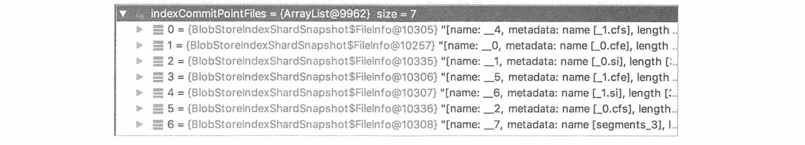</figure>

*   复制 Lucene 物理文件

在开始复制之前，快照任务被设置为 STARTED 阶段。

现在开始复制新增文件，遍历新增文件列表，将这些文件复制到仓库:

```java
for (BlobStoreIndexShardSnapshot.FileInfo snapshotFileInfo : filesToSnapshot) {
    snapshotFile (snapshotFileInfo) ;
}
```

**复制过程中实现限速，并且计算校验和。Lucene 每个文件的元信息中有计算好的校验和，在数据复制过程中，一边复制，一边计算，复制完毕后对比校验和是否相同，以验证复制结果是否正确。校验和很重要，在手工备份数据时，复制完毕后我们实际上不知道复制的数据是否正确。校验和是对数据进行整型加法的计算，不会消耗多少 CPU 资源。**

```java
private void snapshotFile (final BlobStoreIndexShardSnapshot.FileInfo fileInfo) throws IOException {
    final String file = fileInfo.physicalName () ;
    try (IndexInput indexInput = store. openVeri fyingInput (file, IOContext.READONCE, fileInfo.metadata() ) ) {
        for (int i = O; i < fileInfo.numberOfParts() ; i++) {
            InputStream inputStream = inputStreamIndexInput;
            //初始化限速模块
            if (snapshotRateLimiter != null) {
                inputStream = new RateLimitingInputStream(inputStreamIndexInput, snapshotRateLimiter, snapshotRateLimitingTime InNanos :: inc) ;
            }
            inputStream = new AbortableInputStream (inputStream, fileInfo.physicalName()) ;
            //复制文件
            blobContainer.writeBlob (fileInfo.partName(i), inputStream, partBytes) ;
        }
        //比较 checksum 是否正确。- -是 Lucene 元信息中存储的校验和，二是数据复制到目
        //的地址过程中，计算出来的校验和
        Store.verify (indexInput) ;
        snapshotStatus.addProcessedFile (fileInfo.length()) ;
    }
}
```

复制文件的 blobContainer.writeBlob 是一个虚方法，对于不同的仓库文件系统有不同的实现，对于共享文件系统( fs )来说，复制过程通过 Streams.copy 实现，并在复制完成后执行 IOUtils.fsync 刷盘。

*   生成快照文件

这个文件是快照的描述信息，包含本次快照的相关描述，以及与其相关的 Lucene 文件。

```java
BlobStoreIndexShardSnapshot snapshot = new BlobStoreIndexShardSnapshot(snapshotId.getName(), snapshotIndexCommit.getGeneration(), indexCommitPointFiles, snapshotStatus.startTime (), System.currentTimeMillis() - snapshotStatus.startTime() , indexNumberOfFiles, indexTotalFilesSize) ;
//写快照文件，快照文件中描述了本次快照要使用的所有相关 Lucene 分段
indexSha rdSnapshotFormat.write (snapshot, blobContainer, snapshotId.getUUID());
```

在本例中，快照文件内容如下图所示。

<figure class="">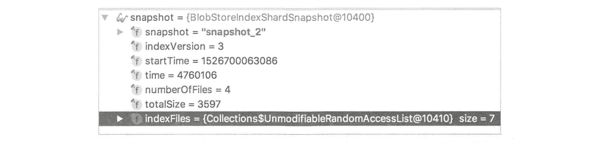</figure>

文件列表代表分片的最新状态，包括分片的全部 Lucene 分段。

*   删除快照无关文件

**遍历仓库中的全部快照，包括刚刚执行完的快照，删除仓库中不被任何快照关联的文件。**`BlobStoreRepository.Context#finalize`方法负责找出这些文件并删除。

```java
protected void finalize (List<SnapshotFiles> snapshots, int fileListGeneration, Map<String，BlobMetaData> blobs) {
    BlobStore IndexShardSnapshots newSnapshots = new BlobStore IndexShardSnapshots (snapshots) ;
    //从当前分片的快照中删除索引 index-*, 这个 index-*文件是对快照列表的索引
    //blobName 是仓库中分片下一个具体的文件，例如，_ 1、 index-*、 snap-*
    for (String blobName : blobs.keySet()) {
        if (indexShardSnapshotsFormat.isTempBl obName (blobName) || blobName.startsWith (SNAPSHOT INDEX_ PREFIX)) {
            blobContainer.deleteBlob (blobName);
        }
        //遍历当前分片仓库中的数据文件，删除快照中未使用的文件
        for (String blobName : blobs.keySet()) {
            //删除无用的文件，数据 BLOB 前缀 DATA_BLOB_PREFIX 值为
            if (blobName.startsWith (DATA_BLOB_PREFIX)) {
                if (newSnapshots.findNameFile (BlobStoreIndexShardSnapshot.FileInfo.canonicalName (blobName)) == null) {
                    blobContainer.deleteBlob (blobName) ;
                }
            }
        }
        //如果全部快照都删除，则不创建 index-*索引文件
        if (snapshots.size() > 0) {
            //写 index-*索引文件
            indexSha rdSnapshotsFormat.writeAtomic (newSnapshots, blobContainer, Integer.toString (fileListGeneration)) ;
        }
    }
}
```

此处传入 finalize 方法的第一个参数是该分片的全部快照的列表，然后做了三件事:

1.  删除旧的 index-*索引文件;
2.  删除仓库中不被快照使用的文件，快照列表由函数第一个参数传入，值为分片的全部快照;
3.  创建新的 index-*索引文件。

finalize 方法执行完成后，快照任务被设置为 DONE 阶段。

思考一下，在 finalize 方法的参数中，传入的快照列表如果不是全部快照，而是其中一部分，则会发生什么?

*   回顾

简单回顾一下两次快照的过程。第一次创建快照时，snapshot_1 的文件列表如下表所示。

<figure class="">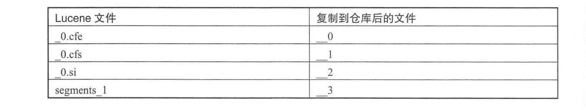</figure>

第二次创建快照时，snapshot_2 的文件列表如下表左列所示。segments_1 已删除，不属于 snapshot_2，只有加粗的文件是 snapshot_2 需要复制的新增内容。

<figure class="">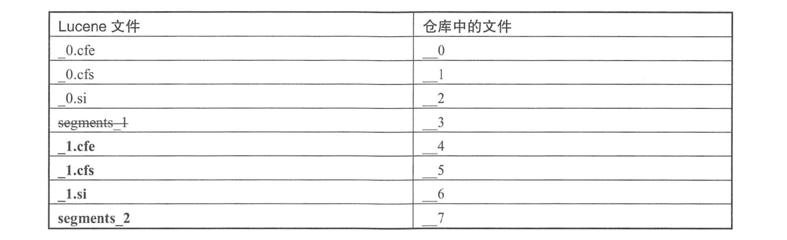</figure>

第二次快照文件执行完毕后，仓库中的文件结构如下所示。

<figure class="">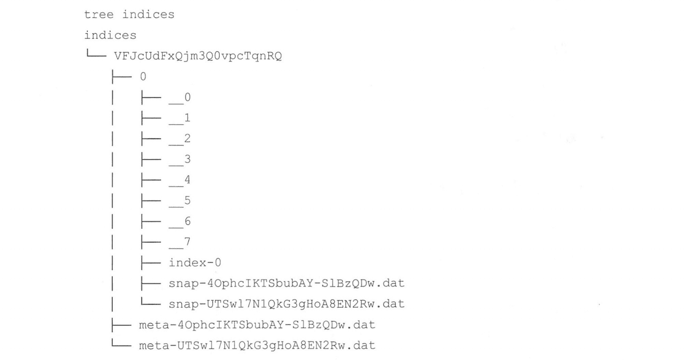</figure>

仓库中有三种类型的文件：

*   **以下划线为前缀的是数据文件，是 Lucene 中的分段(segment) 文件被重命名后的文件。**
*   **snap-*.dat 为快照文件，描述了快照名称，与快照相关的数据文件(使用的文件列表)等信息。**
*   **index-*中描述了当前分片所有的快照信息，是快照列表的索引文件。**
*   **meta-*为索引的元数据信息，仓库根目录下也有 meta-*文件， 根目录下的是全局集群元信息。**

```java
-rw-rw-r--  1 avatar avatar   29 Aug  6 11:15 incompatible-snapshots
-rw-rw-r--  1 avatar avatar 3743 Aug 13 01:01 index-4
-rw-rw-r--  1 avatar avatar 2920 Aug 13 01:02 index-5
-rw-rw-r--  1 avatar avatar    8 Aug 13 01:02 index.latest
drwxrwxr-x 25 avatar avatar 4096 Aug 13 01:02 indices
-rw-rw-r--  1 avatar avatar  103 Aug  9 01:00 meta-GgFN1wAqQm65dDXZyEaJgg.dat
-rw-rw-r--  1 avatar avatar  103 Aug 13 01:00 meta-rPBlWtpkQgSp7eEAObC2UA.dat
-rw-rw-r--  1 avatar avatar  488 Aug  9 01:13 snap-GgFN1wAqQm65dDXZyEaJgg.dat
-rw-rw-r--  1 avatar avatar  493 Aug 13 01:01 snap-rPBlWtpkQgSp7eEAObC2UA.dat
```

# 删除快照实现原理

**ES 删除快照的核心思想就是，在要删除的快照所引用的物理文件中，对不被任何其他快照使用的文件执行删除。每个快照都在自己的元信息文件(snap-*)中描述了本快照使用的文件列表。想要删除一些文件时，也不需要引用计数，只要待删除文件不被其他快照使用就可以安全删除。**

快照删除过程/取消过程涉及 3 种类型的节点：

*   **协调节点：接收客户端请求、转发到主节点。**
*   **主节点：将删除创建快照相关的请求信息放到集群状态中广播下去，删除快照和取消运行中的快照是同一个请求。数据节点负贵取消运行中的快照创建任务，主节点负责删除已创建完毕的快照。无论如何，集群状态都会广播下去。当集群状态发布完毕，主节点开始执行删除操作。所以现在知道为什么主节点也要访问仓库了。删除操作确实没有必要要求各个数据节点去执行，任何节点都能看到仓库的全部数据，只需要单一节点执行删除即可，因此删除操作由主节点执行。**
*   **数据节点：负责取消正在运行的快照任务。**

## 协调节点流程

**协调节点的任务与创建快照时相同，负责协调节点负责解析请求，将请求转发给主节点。**

处理线程: `http_server_worker`。

删除快照的相应的 REST action 为 delete_ snapshot_ action。 注册的`Handler` 为`RestDelete-SnapshotAction`。收到删除快照的 REST 请求后，同样在`BaseRestHandler#handleRequest`中进行处理，然后调用`RestDeleteSnapshotAction#prepareRequest` 解析`REST`请求，将请求封装为

`DeleteSnapshotRequest`结构，然后将该请求发送到`Master`节点。

由于处理过程与创建快照时类似，我们省略相关代码的引用。

同样在`TransportMasterNodeAction.AsyncSingleAction#doStart`方法中判断本地是否是主节点，如果是主节点，则本地在`snapshot` 线程池中执行，否则将转发过去，请求的`action`为`cluster:admin/snapshot/delete`。

## 主节点流程

**主节点收到协调节点的请求后提交集群任务，将请求信息放到新的集群状态中广播下去，数据节点收到后检查是否有运行中的快照任务需要取消，如果没有，则不做其他操作。主节点的集群状态发布成功后，执行快照删除操作。**

执行本流程的线程池: `http_server_worker->generic->masterService#updateTask->snapshot`

主节点收到协调节点发来的请求也是在`TransportMasterNodeAction.AsyncSingleAction#doStart`方法中处理的，在`generic`线程池中执行`TransportDeleteSnapshotAction#masterOperation`， 接着调用`SnapshotsService#deleteSnapshot`提交集群任务。

### 1\. 提交集群任务

将删除快照请求信息放到集群状态中，当集群状态发布成功后，执行删除快照逻辑。

```java
private void deleteSnapshot(...) {
    //提交集群任务
    clusterService.submitStateUpdateTask ("delete snapshot", new ClusterStateUpdateTask (priority) {
        public ClusterState execute (ClusterState currentState) throws Exception {
            SnapshotsInProgress snapshots = currentState.custom(SnapshotsInProgress.TYPE);
            SnapshotsInProgress.Entry snapshotEntry = snapshots!= null ? snapshots.snapshot (snapshot) : null; 
            if (snapshotEntry == null) {
                //快照没有运行，将删除请求信息放到 Custom 字段的
                //SnapshotDeletionsInProgress 结构中
                clusterStateBuilder.putCustom (SnapshotDeletions InProgress.TYPE, deletionsInProgress) ;
            } else {
                //将删除快照请求的相关信息放到 Customs 的 SnapshotsInProgress 中，
                //并将 state 设置为 ABORTED
                SnapshotsInProgress . Entry newSnapshot = new SnapshotsInProgress.Entry (snapshotEntry, State.ABORTED, shards) ;
                snapshots = new SnapshotsInProgress (newSnapshot) ;
                clusterStateBuilder.putCustom (SnapshotsInProgress.TYPE, snapshots) ;
            }
            snapshots = new SnapshotsInProgress (newSnapshot) ;
            clusterStateBuilder.putCustom (Snapshots InProgress.TYPE，snapshots) ;
            return clusterStateBuilder.build() ;
        }
        //处理集群状态发布失败的情况
        public void onFailure (String source, Exception e) {}
        //集群状态发布完毕
        public void clusterStateProcessed (String source, ClusterState oldState，ClusterState newState) {
            if (waitForSnapshot) {
                //处理客户端等待完成的情况
            } else
                //删除快照文件
                deleteSnapshotFromRepository (snapshot, listener, repositoryStateId) ;
            }
        }
    }) ;
}
```

**主节点会判断要删除的快照是正在进行中的，还是已完成的，对进行中的快照执行取消逻辑，对已完成的快照执行删除逻辑，构建出的集群状态是不同的。**

对于删除过程，下发的集群状态内容如下图所示。删除请求信息放在`customs 的 Snapshot-DeletionsInProgress`字段中。

<figure class="">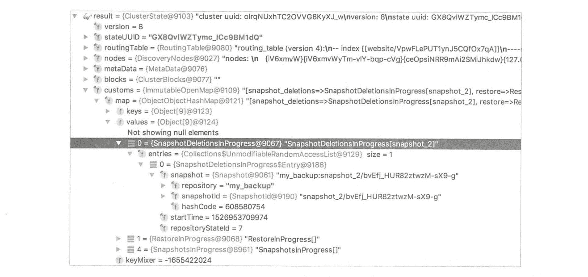</figure>

对于取消过程，下发的集群状态内容如下图所示。删除请求信息放在`customs` 的`SnapshotsInProgress`字段中，并将`State`设置为`ABORTED`.创建快照时也放在`SnapshotsInProgress`字段中，区别就是创建快照时`State`为`STARTED`。

<figure class="">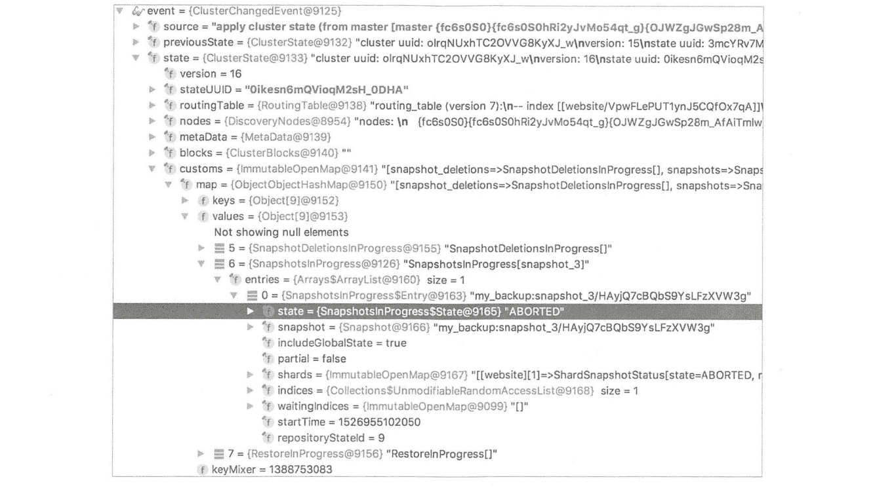</figure>

由于删除操作在主节点上执行，接下来我们进入主节点的快照删除过程。

### 2\. 快照删除

主节点的集群状态发布完毕，`clusterStateProcessed` 方法负责发布成功后的处理逻辑。执行该方法的线程池为`masterService#updateTask`，它调用`SnapshotsService#deleteSnapshotFromRepository`方法执行删除。该方法会转移到 snapshot 线程池执行具体的删除工作。

```java
private void deleteSnapshotFromRepository(...) {
    threadPool.executor (ThreadPool.Names.SNAPSHOT).execute(() --> {
        //执行删除
        repository.deleteSnapshot (snapshot.getSnapshotId()，repositoryStateId) ;
        removeSnapshotDeletionFromClusterState (snapshot, null, listener) ;
    }) ;
}
```

需要删除的内容包括元信息文件、索引分片，以及有可能要删除的整个索引目录，并且更新快照列表的`index`文件(`index-*`)。 主要删除逻辑如下:

```java
public void deleteSnapshot (SnapshotId snapshotId, 1ong repositoryStateId) {
    MetaData metaData = readSnapshotMetaData (snapshotId, snapshot.version() , repositoryData.resolveIndices (indices)，true);
    try {
        //更新快照列表的索引文件 index-*，将快照信息从快照列表中删除
        final RepositoryData updatedRepositoryData = repositoryData.removeSnapshot (snapshotId) ;
        writeIndexGen (updatedRepositoryData, repositoryStateId) ;
        //删除全局快照文件(仓库根目录下的) snap-*
        deleteSnapshotBlobIgnoringErrors (snapshot, snapshotId.getUUID()) ;
        //删除全局元信息文件 meta-* .dat
        deleteGlobalMetaDataBlobIgnoringErrors (snapshot, snapshotId.getUUID()) ;
        //删除全部索引
        for (String index : indices) {
            //删除索引的元信息文件 meta-* .dat
            indexMetaDataFormat.delete (indexMetaDataBlobContainer, snapshotId.getUUID()) ;
            if (metaData != null) {
                IndexMetaData indexMetaData = metaData.index (index) ;
                if (indexMetaData != null) {
                    for (int shardId= 0; shardId < indexMetaData.getNumberOfShards () ; shardId++) {
                        //删除分片快照，这里是删除实际的 Lucene 文件
                        delete (snapshotId, snapshot. version()，indexId, new ShardId (indexMetaData.getIndex()，shardId) ) ;
                    }
                }
            }
        }
        //删除仓库中已经不存在的索引目录
        for (final IndexId indexId : indicesToCleanUp) {
            indicesBlobContainer . deleteBlob(indexId.getId() ) ;
        }
    }
}
```

快照是对每个分片创建的，如何删除分片快照是核心过程。接下来我们看一下如何删除分片的快照：

```java
public void delete() {
    Tuple<BlobStoreIndexShardSnapshots, Integer> tuple = buildBlobStore IndexShardSnapshots (blobs) ;
    //仓库现有的快照列表
    BlobStore IndexShardSnapshots snapshots = tuple.v1() ;
    int fileListGeneration = tuple.v2 () ;
    //删除分片的 snapshot 文件
    indexShardSnapshotFormat (version).delete (blobContainer, snapshotId.getUUID()) ;
    //构建需要保留的快照列表
    List<SnapshotFiles> newSnapshotsList = new ArrayList<> () ;
    for (SnapshotFiles point : snapshots) {
        if (!point.snapshot ().equals (snapshotId.getName())) {
            newSnapshotsList.add (point) ;
        }
    }
    //传入需要保留的快照列表，而非要删除的快照列表。仓库中存在的, 但不被列表中快照使用的文件被删除
    finalize (newSnapshotsList, fileListGeneration + 1, blobs) ;
}
```

调用创建快照时相同的`finalize` 方法，调用该方法时传入一个快照列表，内部执行时遍历仓库中的文件，删除不被快照列表引用的文件。在创建快照时传入全部快照列表，在删除快照时，传入的是需要保留的快照列表。

以上一节创建快照中的例子为基础，我们删除`snapshot_2`,看看哪些文件被删除。在删除`snapshot_2`之前，仓库中一共有 `snapshot_1`、`snapshot_2`两个快照。

```java
属于 snapshot_1 的文件有：
_0
_1
_2
_3

属于 snapshot _2 的文件有:
_0
_1
_2
_3
_4
_5
_6
_7
```

删除`snapshot_2`时, `finalize` 方法传入的快照列表为`snapshot_1`, 最终被删除的文件为 4、5、6、7，如下图所示。左列为该分片仓库中的现有文件，右列为`snapshot_1`的文件列表。

<figure class="">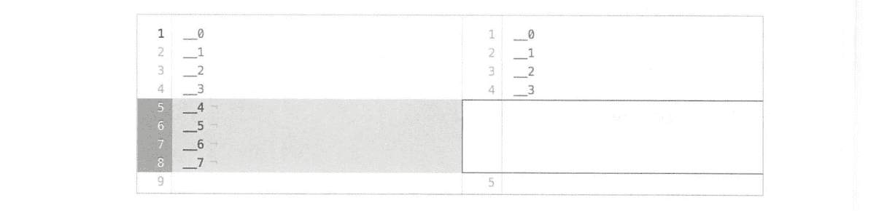</figure>

### 3\. 数据节点的取消过程

取消快照请求信息放在`customs`的`SnapshotsInProgress`字段中，`State` 为`ABORTED`。数据节点对此的处理在`SnapshotShardsService#processIndexShardSnapshots`方法中，创建快照的主要过程也在这个方法中，根据`State`状态判断需要启动或取消运行中的快照。

```java
private void process IndexShardSnapshots (ClusterChangedEvent event) {
    if (snapshotsInProgress !=null) {
        for (SnapshotsInProgress . Entry entry : snapshots InProgress.entries()) {
            if (entry.state() == State . STARTED) {
                //处理快照创建
            } else if (entry.state() == State. ABORTED) {
                //处理快照取消
                if (snapshotShards != null) {
                    for (Obj ectObjectCursor<ShardId, ShardSnapshotStatus> shard : entry.shards () ) {
                        if (snapshotStatus != null) {
                            switch (snapshotStatus.stage()) {
                                case INIT:
                                case STARTED:
                                    //设置中止标识
                                    snapshotStatus.abort() ;
                                case ....
                            }
                        }
                    }
                }
            }
        }
    }
}
```

取消快照的`abort`实现只是设置了中止标识，运行中的快照会检查这个标识：

```java
public void abort() {
    this.aborted = true;
}
```

快照运行过程中有多处会检查中止标识：

*   在计算需要复制的 Lucene 文件列表时;
*   在开始执行复制之前;
*   在数据开始复制数据之后的读取过程中。

由于运行中的快照大部分时间在执行数据复制，因此取消操作大部分在读取数据时中断。

```java
public int read (byte[] b，int off，int len) throws IOException {
    checkAborted() ;
    return in. read(b, off, len) ;
}

private void checkAborted() {
    if (snapshotStatus.aborted() ) {
        throw new IndexShardSnapshotFailedException (shardId, "Aborted") ;
    }
}
```

**运行中的快照被取消后，复制到一半的快照数据文件由主节点负责清理。这个过程在主节点发布集群状态成功之后的快照删除逻辑中执行，对一个已经取消的快照，执行正常的快照删除过程。**

# 思考与总结

*   **主节点将快照命令放到集群状态中广播下去，以此控制数据节点执行任务。数据节点执行完毕向主节点主动汇报状态。**
*   ES 的配置文件更新后不能动态生效。但是提供了 REST 接口来调整需要动态更新的参数。path.repo 字段需要写到配置文件中。当需要迁移数据时就要先改配置重启集群，这样就不够方便。为什么不放在 REST 请求信息中，而要求配置到文件里?
*   集群永久设置、模板都保存在集群状态中，默认为不进行快照和恢复。注意索引别名不在集群状态中。快照默认会保存别名信息。
*   Lucene 段合并会导致增量快照时产生新增内容。当段文件比较小时，在 HDFS 中可能会产生许多小文件。因此通过`force_merge API`手工合并分段也有利于减少 HDFS 上的这些小文件。
*   **快照写入了两个层面的元数据信息：集群层和索引层。**
*   **快照与集群是否健康无关，集群 Red 时也可以对部分索引执行快照。**
*   **数据复制过程中会计算校验和，确保复制后数据的正确性。**
*   数据节点并发复制数据时取决于线程池的线程数的最大值，该值为`min(5，(处理器数量)/2)`。
*   **快照只对主分片执行。**