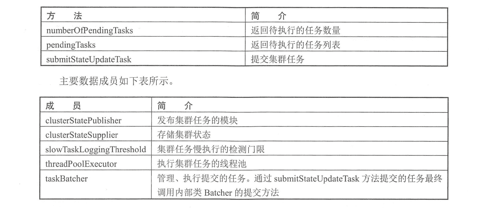
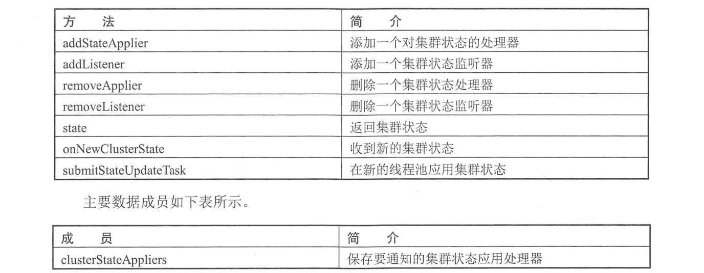
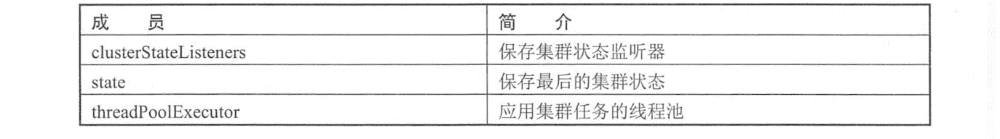
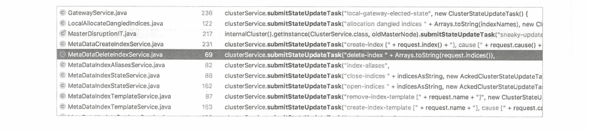
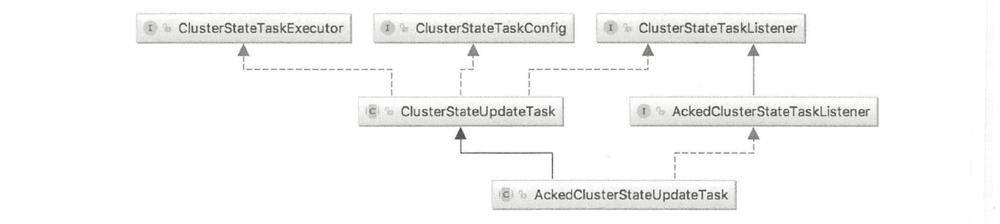
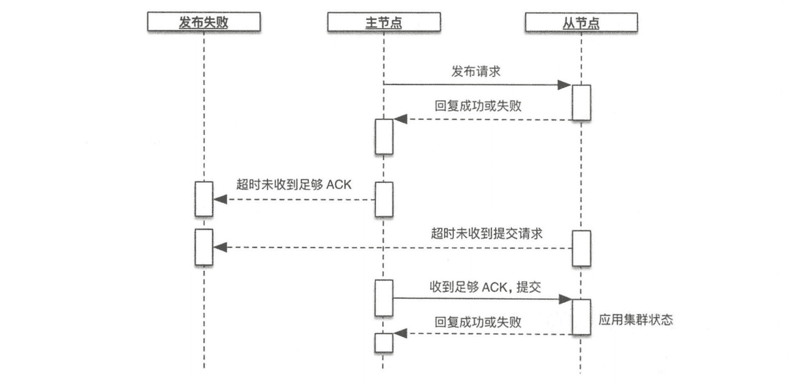
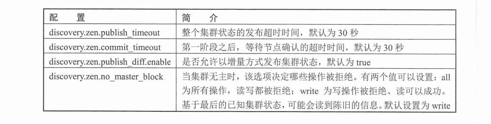

# 《Elasticsearch 源码解析与优化实战》第 14 章：Cluster 模块分析

> 原文：[https://cloud.tencent.com/developer/article/1860217](https://cloud.tencent.com/developer/article/1860217)

Cluster 模块封装了在集群层面要执行的任务。例如，把分片分配给节点属于集群层面的工作，在节点间迁移分片以保持数据均衡，集群健康、集群级元信息管理，以及节点管理都属于集群层面工作。本章重点论述集群任务的执行，以及集群状态的下发过程。分片分配和节点管理等单独讨论更合适一-些。

在 _ cluster/health API 中看到的 number_of_pending_tasks (任务数量)就是等待执行的“集群任务”的任务数量，通过 _ cat/pending_tasks API 可以列出具体的任务列表。本章介绍主节点都会执行哪些任务，以及任务的执行细节。这些任务由主节点执行，如果其他节点产生某些事件涉及集群层面的变更，则它需要向主节点发送一个 RPC 请求，然后由主节点执行集群任务。例如，在数据写入过程中，主分片写副分片失败，它会向主节点发送一个 RPC 请求，将副分片从同步分片列表中移除。

集群任务执行完毕，可能会产生新的集群状态。如果产生新的集群状态，则主节点会把它广播到其他节点。主节点和其他节点的通信使用最广泛的方式，就是通过下发集群状态让从节点执行相应的处理。控制信息、变更信息都存储在集群状态中。我们先来看看集群状态中存在哪些内容。

# 集群状态

集群状态在 ES 中封装为 ClusterState 类。可以通过 cluster/state API 来获取集群状态。

```java
curl -X GET "localhost: 9200/_cluster/state"
```

响应信息中提供了集群名称、集群状态的总压缩大小(下发到数据节点时是被压缩的)和集群状态本身，请求时可以通过设置过滤器来获取特定内容。

默认情况下，协调节点在收到这个请求后会把请求路由到主节点执行，确保获取最新的集群状态。可以通过在请求中添加 local=true 参数，让接收请求的节点返回本地的集群状态。例如，在排查问题时如果怀疑节点的集群状态是否最新，则可以用这种方式来验证。

集群状态返回的信息比较多，为了节省篇幅，摘取关键信息如下。

```java
{
    "cluster_name" : "elasticsearch",
    "compressed_size_in_bytes" : 1383, //压缩后的字节数
    "version" : 5, //当前集群状态的版本号
    "state_uuid" : "MMXpwaedThCVDIkzn9vpgA",
    "master_node" : " fc6s0S0hRi2yJvMo54qt_g",
    "blocks" : { }, //阻塞信息
    "nodes" : {
        " fc6s0S0hRi2yJvMo54qt_g" : {
            //节点名称、监听地址和端口等信息
        }
    }
    "metadata" : {//元数据
        "cluster_uuid" : "olrqNUxhTC20VVG8KyXJ_w",
        "templates" : {
            //全部模板的具体内容
        }，
        "indices" : {//索引列表
            "website" : {
                "state" : "open",
                "settings" : {
                    //setting 的具体内容
                },
                "mappings": {
                    //mapping 的具体内容
                }
                "aliases" : [ ],//索引别名
                "primary_ terms" : {
                    //某个分片被选为主分片的次数，用于区分新旧主分片(具体请参考数据模型一章)
                    "0" : 4,
                    "1" : 5
                }
                "in_sync_allocations" : {
                    //同步分片列表，代表某个分片中拥有最新数据的分片列表
                    "1":[
                        "jalbPWjJST2bDPCU008ScQ" //这个值是 allocation_id
                    ],
                    "0":[
                        "1EjTXE1CSZ-C1DYlEFRXtw"
                    ]
                }
            }
        },
        "repositories" : {
            //为存储快照而创建的仓库列表
        }，
        "index-graveyard" : {
            //索引墓碑。记录已删除的索引，并保存一段时间。索引删除是主节点通过下发
            //集群状态来执行的
            //各节点处理集群状态是异步的过程。例如，索引分片分布在 5 个节点上，删除
            //索引期间，某个节点是“down”掉的，没有执行删除逻辑
            //当这个节点恢复的时候，其存储的已删除的索引会被当作孤立资源加入集群,
            //索引死而复活。墓碑的作用就是防止发生这种情况
            "tombstones" : [
                //已删除的索引列表
            ]
        }
    },
    "routing_table" : { //内容路由表。存储某个分片位于哪个节点的信息。通过分片
        //找到节点
        "indices" : { //全部索引列表
            "website" : {//索引名称
                "shards" : {//该索引的全部分片列表 .
                    "1" : [//分片 1
                        {
                            "state" : "STARTED",    //分片可能的状态: UNASSIGNED、INITIALIZING、
                                                    //STARTED、RELOCATING
                             "primary" : true， //是否是主分片
                             "node" : "fc6s0S0hRi2yJvMo54qt_g", //所在分片
                             "relocating_node" : null, //正在“relocation”到哪个节点
                             "shard" : 1, // 分片 1
                             "index" : "website", // 索引名
                             "allocation_ id" : {
                                "id" : "jalbPWj JST2bDPCUO08ScQ" // 分片唯一的 allocation_id 配合 in_sync_allocations 使用
                             }
                         }
                     ]
                 }
             }
         }
     },
     "routing nodes" : {//存储某个节点存储了哪些分片的信息。通过节点找到分片
        "unassigned" : [//未分配的分片列表
                {//某个分片的信息
                    "state" : "UNASSIGNED",
                    "primary" : true,
                    "node" : null,
                    "relocating_ node" : null,
                    "shard" : 0，
                    "index" : "website",
                    " recovery_ source" : {
                    "type" : "EXISTING_ STORE"
                },
                "unassigned_ info" : {//未 分配的具体信息
                    "reason" : "CLUSTER RECOVERED",
                    "at" : "2018-05-27T08:17:56.381Z",
                    "delayed" : false,
                    "allocation status" : "no_ valid_ shard copy"
                }
            }
        ],
        "nodes" : {//节点列表
        "fc6s0S0hRi2yJvMo54qt_g" : [//某个节点 上的分片列表        
            {      
                "state" : "STARTED"， //分片信息， 同上
                "primary" : true,
                "node" : " fc6s0S0hRi2yJvMo54qt_g",
                "relocating_ node" : null,
                "shard" : 1,
                "index" : "website",
                "allocation_id" : {
                    "id" : "jalbPWjJST2bDPCU008ScQ"
                },
                "snapshot_deletions" : {//请 求删除快照的信息
                    "snapshot_deletions" :[ ]
                },
                "snapshots" : {//请求创 建快照的信息
                    "snapshots" : [ ]
                },
                "restore" : {//请求恢 复快照的信息
                    "snapshots" : [ ]  
                }
            }
        }
    }
} 
```

由于集群状态需要频繁下发，而且内容较多，从 ES 2.0 版本开始，主节点发布集群信息时支持在相邻的两个版本号之间只发送增量内容。

# 内部封装和实现

下面介绍两个重要的类, MasterService 和 ClusterApplierService 分别负责运行任务和应用任务产生的集群状态。

## MasterService

MasterService 类负贵集群任务管理、运行等工作。其对外提供提交任务的接口，内部维护一个线程池运行这些任务。对外提供的主要接口如下表所示。

<figure class=""></figure>

只有主节点会执行这个类中的方法。也就是说，只有主节点会提交集群任务到内部的队列，并运行队列中的任务。.

## ClusterApplierService

ClusterApplierService 类负责管理需要对集群任务进行处理的模块(Applier)和监听器(Listener)，以及通知各个 Applier 应用集群状态。其对外提供接收集群状态的接口，当传输模块收到集群状态时，调用这个接口将集群状态传递过来，内部维护一个线程池用于应用集群状态。对外提供的主要接口如下表所示。

<figure class=""></figure>

<figure class=""></figure>

主节点和从节点都会应用集群状态，因此都会执行这个类中的方法。如果某个模块需要处理集群状态，则调用 addStateApplier 方法添加一一个处理器。如果想监听集群状态的变化，则通过 addListener 添加一一个监听器。Applier 负责将集群状态应用到组件内部，对 Applier 的调用在集群状态可见(ClusterService#state 获取到的)之前，对 Listener 的通知在新的集群状态可见之后。

**实现一个 Applie**

如果模块需要对集群状态进行处理，则需要从接口类 ClusterStateApplier 实现，实现其中的 applyClusterState 方法，例如:

```java
public class GatewayMetaState extends AbstractComponent implements ClusterStateApplier {
    public void applyClusterState (Clus terChangedEvent event) {
        //实现对集群状态的处理
    }
}
```

类似的, SnapshotsService、RestoreService、IndicesClusterStateService 都从 ClusterStateApplie 接口实现。

实现 ClusterStateApplier 的子类后，在子类中调用 addStateApplier 将类的实例添加到 Applie 列表。当应用集群状态时，会遍历这个列表通知各个模块执行应用。

```java
clusterService.addStateApplier (this);
```

**实现一个 Listene**

大部分的组件只需要感知产生了新的集群状态，针对新的集群状态执行若干操作。如果模块需要在产生新的集群状态时被通知，则需要实现接口类 ClusterStateListener，实现其中的 clusterChanged 方法。例如:

```java
public class GatewayService extends AbstractLifecycleComponent implements ClusterStateListener {
    public void clusterChanged (final Clus terChangedEvent event) {
        //处理集群状态变化
    }
}
```

类似的，实现 ClusterStateListener 接口的类还有 IndicesStore， DanglingIndicesState 、MetaDataUpdateSettingsService 和 SnapshotShardsService 等。

实现 ClusterStateListener 的子类后，在子类中调用 addListener 将类的实例添加到 Listene 列表。当集群状态应用完毕，会遍历这个列表通知各个模块集群状态已发生变化。

```java
clusterService.addListener(this);
```

## 线程池

运行集群任务、应用集群任务都在各自的线程池执行，它们的线程池的大小都是 1。

**运行集群任务的线程池**

执行集群任务的线程池为单个线程的线程池。因此，集群任务被串行地执行。线程池类型为 PrioritizedEsThreadPoolExecutor，支持优先级。其初始化在 MasterService#doStart 方法中:

```java
threadPoolExecutor = EsExecutors.newSinglePrioritizing (MASTER_UPDATE_THREAD_NAME, daemonThreadFactory(settings, MASTER_UPDATE_THREAD_NAME), threadPool.getThreadContext()，threadPool.scheduler());
```

该线程池的名称为 masterService#updateTask。

在 newSinglePrioritizing 方法中可以看到 corePoolSize 、maximumPoolSize 都等于 1, keepAliveTime 为 0。

```java
public static PrioritizedEsThreadPoolExecutor newSinglePrioritizing(String name， ThreadFactory threadFactory, ThreadContext contextHolder, ScheduledExecutorService timer) {
    return new PrioritizedEsThreadPoolExecutor (name, 1, 1, 0L, TimeUnit.MILLISECONDS，threadFactory, contextHolder, timer);
}
```

继续跟踪到 PrioritizedEsThreadPoolExecutor 构造函数，可以看到线程池使用带优先级的阻塞队列 PriorityBlockingQueue。

```java
PrioritizedEsThreadPoolExecutor (String name， int corePoolSize, int maximumPoolSize，long keepAliveTime, TimeUnit unit,
    ThreadFactory threadFactory, ThreadContext contextHolder,
    ScheduledExecutorService timer) {
        super (name, corePoolSize, maximumPoolSize, keepAliveTime, unit, new PriorityBlockingQueue<>()，threadFactory, contextHolder);
        this. timer = timer;
}
```

任务优先级定义在 common.Priority 中，有 6 种类型的优先级: IMMEDIATE、 URGENT、HIGH、NORMAL、LOW 和 LANGUID。默认为 NORMAL。

**应用集群任务的线程池**

应用集群任务的线程池也是单个线程的线程池，集群任务被串行地应用。与运行集群任务时相同，该线程池类型为 PrioritizedEsThreadPoolExecutor， 其初始化在 ClusterApplierService#doStart 方法中:

```java
threadPoolExecutor = EsExecutors.newSinglePrioritizing (CLUSTER_UPDATE_THREAD_NAME, daemonThreadFactory(settings, CLUSTER_UPDATE_THREAD_NAME)，threadPool.getThreadContext()，threadPool.scheduler());
```

该线程池的名称为 clusterApplierService#updateTask。

该线程池的构建过程及优先级信息与运行集群任务的线程池相同。

# 提交集群任务

什么情况下会提交集群任务?通过查看对 ClusterService#submitStateUpdateTask 方法的调用，可以看到哪些模块会提交集群任务，这个任务会做什么事情也基本能看出来。下图并非完整调用。

<figure class=""></figure>

整理这些调用模块，直接或间接提交集群任务的时机可以归纳为以下几种情况。

*   集群拓扑变化;
*   模板、索引 map、别名的变化;
*   索引操作:创建、删除、open、 close;
*   pipeline 的增删;
*   脚本的增删;
*   gateway 模块发布选举出的集群状态;
*   分片分配;
*   快照、reroute api 等触发。

## 内部模块如何提交任务

内部模块通过 clusterService. submitStateUpdateTask 来提交-一个集群任务。 该方法有 3 种重载，参数大同小异，我们以最常见的方式为例来说明情况。函数原型如下:

```java
public <T extends ClusterStateTaskConfig & ClusterStateTaskExecutor<T> & ClusterStateTaskListener> void submitStateUpdateTask(String source, T updateTask)
```

第一个参数是事件源，第二个参数是要提交的具体的任务，这个任务有多种类封装，比如 ClusterStateUpdateTask、AckedClusterStateUpdateTask、 LocalClusterUpdateTask 等，最具代表性是 ClusterStateUpdateTask，许多其他任务类型从它这里继承，或者与它的结构相似。

ClusterStateUpdateTask 的类图结构如下图所示。

<figure class=""></figure>

*   ClusterStateTaskListener：提交任务时实现- -些回调函数，例如，对任务处理失败、集群状态处理完毕时的处理。
*   ClusterStateTaskExecutor：主要是定义要执行的任务。每个任务在执行时会传入当前集群状态，任务执行完毕返回新产生的集群状态。如果没有产生新的集群状态，则返回原集群状态的实例。
*   ClusterStateTaskConfig:任务的配置信息，包括超时和优先级。任务类 ClusterStateUpdateTask 实现了这三个接口，总体来说就是要定义执行的任务，以及实现一些事件通知函数。当某个模块提交任务时，使用下面的简单方式:

```java
clusterService.submitStateUpdateTask ("allocation dangled indices "， new ClusterStateUpdateTask() {
    //实现要执行的具体任务，任务返回新的集群状态
    public ClusterState execute (ClusterState currentState) {}
    //任务执行失败的回调
    public void onFailure (String source, Exception e) {}
    //集群状态处理完毕的回调，当集群状态已经被全部 Appliers 和 Listeners 处理完毕后调用
    public void clusterStateProcessed (String source, ClusterState oldState, ClusterState newState) {}
});
```

任务类 AckedClusterStateUpdateTask 在 ClusterStateUpdateTask 的基础上增加了更多的回调通知，其类结构如下图所示。

<figure class=""></figure>

在绝大部分情况下，各个模块提交任务时只提交一个任务，只有两种情况下可能会提交多个任务，都在选主流程中:

**1\. ElectionContext#closeAndBecomeMaste**

```java
Map<DiscoveryNode, ClusterStateTaskListener> tasks = getPendingAsTasks();
tasks.put(BECOME_MASTER_TASK，(sourcel, e) -> {}); // noop listener, the election finished listener determines result .
tasks.put(FINISH_ELECTION_TASK，electionFinishedListener);
masterService.submitStateUpdateTasks(source, tasks, ClusterStateTaskConfig.build (Priority.URGENT)，joinTaskExecutor);
```

**2\. ElectionContext#closeAndProcessPending**

```java
Map<DiscoveryNode, ClusterStateTaskListener> tasks = getPendingAsTasks();
tasks.put(FINISH_ELECTION_TASK, electionFinishedListener);
masterService.submitStateUpdateTasks(source, tasks, ClusterStateTaskConfig.build(Priority.URGENT)，joinTaskExecutor);
```

两处的 getPendingAsTasks 返回的并非执行集群任务线程池的等待队列，而是选主流程中等待加入集群的请求数量。

现在我们来看一下 submitStateUpdateTask 具体执行过程。

## 任务提交过程实现

无论提交单个任务，还是提交多个任务，submitStateUpdateTask 最终通过 TaskBatcher#submitTasks 来提交任务。该方法的实现有些难以理解。其核心工作就是将提交的任务交给线程池执行。但是在此基础上实现了部分场景下的任务去重。

去重的原理是：拥有相同 ClusterStateTaskExecutor 对象实例的任务只执行一个。

去重在实现时并没有在线程池队列的列表上操作，而是将任务列表添加到-一个独立于线程池任务队列之外的 HashMap 中：tasksPerBatchingKey。这个 HashMap 保存的也是待执行的任务。与线程池任务队列不同的是，当提交多个任务时，线程池队列中只保存第一个，而 tasksPerBatchingKey 以 ClusterState TaskExecutor 为 Key, Value 是提交的整个任务列表。当从线程池任务队列中取出任务准备执行时,先根据任务的 ClusterStateTaskExecutor 从 tasksPerBatchingKey 中找到它的任务列表，然后批量执行这个任务列表。所谓批量执行实际上只执行一个，然后对其他任务赋予相同的执行结果。

换句话说，区分重复任务的方式是通过定义的任务本身实现的，即定义具有相同的 ClusterStateTaskExecutor 对象。去重的方式并非将重复的任务从列表中删除，而是在执行完任务后赋予重复任务相同的执行结果。

去重的时机有两方面：

*   提交的任务列表本身的去重。
*   提交的任务在任务队列 tasksPerBatchingKey 中已存在，也就是存在尚未执行的相同任务，此时新提交的任务被追加到 tasksPerBatchingKey 某个 k 对应的 v 中。

提交的任务列表本身任务数量大于 1 个的情况如上一小节所述,只在选主的流程中。那么，拥有相同 ClusterStateTaskExecutor 对象的是什么情况?一般情况下，各模块调用 clusterService.submitStateUpdateTask 提交任务，如果在任务执行之前提交多次，则不认为这些是重复的任务。因为一般每次提交会创建不同的 ClusterStateUpdateTask 对象，因此也拥有不同的 ClusterStateTaskExecutor 实例。例如，提交两次相同的创建索引请求，两次请求都会被加入任务队列，然后执行 2 次。

只有模块在提交任务时明确使用了相同的 ClusterStateTaskExecutor 对象，才可能会在执行时去重。例如，每次提交 shard-started 任务时使用创建好的 ClusterStateTaskExecutor，因此是同一个 ClusterState' TaskExecutor 对象实例。

```java
clusterService.submitStateUpdateTask (
    "shard-started " + request,
    request,
    ClusterStateTaskConfig.build (Priority URGENT) ,
    shardStartedClusterStateTaskExecutor,
    shardStartedClusterStateTaskExecutor);
channel.sendResponse(TransportResponse.Empty.INSTANCE);
```

下面我们看一下任务提交过程 submitTasks 的具体实现。

submitTasks 的核心工作就是将待执行任务加入任务队列。每个任务都有优先级，线程池的任务队列也是支持优先级的 PriorityBlockingQueue。

各个入口的 submitStateUpdateTask 最终通过 TaskBatcher 提交任务:

```java
taskBatcher.submitTasks (safeTasks，config.timeout());
```

第一个参数为任务列表，第二个参数为超时时间。提交的任务本质上是一个 Runnable。

UpdateTask 的类图结构如下图所示。

<figure class=""></figure>

submitTasks 方法的主要实现过程如下:

```java
public void submitTasks (List<? extends BatchedTask> tasks， @Nullable TimeValue timeout) throws EsRejectedExecutionException {
    //batchingKey 为 ClusterStateTaskExecuto
    //BatchedTask: :getTask 返回完整的 task <T extends ClusterStateTaskConfig
    //& ClusterStateTaskExecutor<T> & ClusterStateTas kListener>
    //例如，ClusterStateUpdateTask 对象
    final BatchedTask firstTask = tasks.get(0);
    //如果一次提交多个任务，则必须有相同的 batchingKey，这些任务将被批量执行
    asserttasks.stream().allMatch(t -> t.batchingKey == firstTask.batchingKey) :
        "tasks submitted in a batch should share the same batching key: " +  tasks;
    //将 tasks 从 List 转换为 Map, key 为 task 对象，例如，ClusterStateUpdateTask,
    //如果提交的任务列表存在重复则抛出异常
    final Map<0bject, BatchedTask> tasksIdentity = tasks.stream().collect(Collectors.toMap (BatchedTask::getTask, Function. identity(), (a, b) -> { throw new IllegalStateException ("cannot add，duplicate task: " + a); }, IdentityHashMap: :new)) ;
    //tasksPerBatchingKey 在这里添加，在任务执行线程池中,在任务真正开始运行之前“remove"
    //key 为 batchingKey,值为 tasks
    synchronized (tasks PerBatchingKey) {
        //如果不存在 batchingKey,则添加进去，如果存在则不操作
        //computeIfAbsent 返回新添加的 k 对应的 v，或者已存在的 k 对应的 v
        LinkedHashSet<BatchedTask> existingTasks = tasksPerBatchingKey.computeI fAbsent (firstTask.batchingKey, k -> new LinkedHashSet<> (tasks.size())) ;
        for (BatchedTask existing : existingTasks) {
            //一个 batchingKey 对应的任务列表不可有相同的 identity, identity 是任务
            //本身，例如，ClusterStateUpdateTask 对象
            BatchedTask duplicateTask = tasksIdentity.get (existing.getTask()) ;
            if (duplicateTask != null) {
                throw new IllegalStateException() ;
            }
        }
        //添加到 tasksPerBatchingKey 的 value 中。如果提交了相同的任务,
        //则新任务被追加到这里
        existingTasks.addAll (tasks) ;
    }
    //交给线程执行
    if (timeout != null) {
        threadExecutor.execute(firstTask, timeout, () -> onTimeoutInternal(tasks, timeout));
    } else {
        threadExecutor.execute (firstTask);
    }
}
```

虽然只将传，入任务列表的第-一个任务交个线程池执行，但是任务列表的全部任务被添加到 tasksPerBatchingKey 中，线程池执行任务时，根据任务的 batchingKey 从 tasksPerBatchingKey 中获取任务列表，然后批量执行这个任务列表。

当调用 threadExecutor.execute 将其交任务给线程池执行时，如果线程池中没有任务运行，则立刻执行这个任务，否则将任务加入线程池的任务队列。

# 集群任务的执行过程

masterServiceupdateTask 线程池负责执行集群任务，任务的执行入口为 TaskBatcher.BatchedTask#run，但是线程池队列中的这个任务并非真实要执行的任务，而是任务的一-部分。

**1.构建任务列表**

先根据任务的 batchingKey 从提交任务时记录的 HashMap ( tasksPerBatchingKey)中提取要执行的任务列表。这个任务列表是拥有相同 ClusterStateTaskExecutor 的任务。用这个任务列表中尚未执行的任务构建新的列表，这个新列表就是真实要执行的任务列表：

```java
void runIfNotProcessed (BatchedTask updateTask) {
    if (updateTask .processed.get() == false) {
        synchronized (tasksPerBatchingKey) {
            //根据 batchingKey 获取任务列表
            LinkedHashSet<BatchedTask> pending = tasksPerBatchingKey.remove(updateTask.batchingKey);
            if (pending != null) {
                for (BatchedTask task : pending) {
                    if (task.processed.getAndSet(true) == false) {
                        //构建要执行的任务列表
                        toExecute.add(task) ;
                        processTasksBySource.computeIfAbsent(task.source, s -> new ArrayList<>()).add(task);
                    }
                }
            }
        }
        if (toExecute. isEmpty() == false) {
            //执行任务列表
            run (updateTask.batchingKey, toExecute，tasksSummary);
        }
    }
}
```

这个任务列表接下来被批量执行，由于要执行的内容相同,所以列表中的任务只会执行一个。

**2.执行任务**

执行任务并发布集群状态的总体过程在 MasterService#runTasks 方法中实现。在该方法中，在执行任务前先确认本节点是否为主节点，然后将当前的集群状态传递给任务执行函数，在 MasterService#executeTasks 中回调提交任务时定义 execute 方法，任务执行完毕，将任务列表赋予相同的执行结果。

```java
public final ClusterTasksResult<...) throws Exception {
    //执行提交任务时定义 execute 方法.
    ClusterState result = execute (currentState) ;
    //将任务列表赋予相同的执行结果
    return ClusterTasksResult.<ClusterStateUpdateTask>builder().successes(tasks).build(result);
}
```

如果任务执行失败，则回调 onFailure 方法通知 Listener。如果执行成功并产生新的集群状态，则进入集群状态发布过程。

**3.发布集群状态**

通过 clusterStatePublisher 发布集群状态，并在成功或失败后通知相关回调函数:

```java
protected void runTasks (TaskInputs taskInputs) {
    //是否产生新的集群状态
    if (taskOutputs . clusterStateUnchanged()) {

    } else {
        try {
            //发布集群状态
            clusterStatePublisher.accept (clusterChangedEvent，taskOutputs.createAckListener(threadPool, newClusterState));
        } catch (Discovery.FailedToCommi tClusterStateException t) {
            / 回调 listener.onFailure
            taskOutputs.publishingFailed(t);
            return;
        }
        //集群状态发布成功，回调 listener .clusterStateProcessed
        taskOutputs.processedDifferentClusterState (previousClusterState, newClusterState);
        //回调 clusterStatePublished
        taskOutputs.clusterStatePublished (clusterChangedEvent);
    }
}
```

# 集群状态的发布过程

发布集群状态是-一个分布式事务操作，分布式事务需要实现原子性:要么所有参与者都提交事务，要么都取消事务。ES 使用二段提交来实现分布式事务。二段提交可以避免失败回滚，其基本过程是:把信息发下去，但不应用，如果得到多数节点的确认，则再发-一个请求出去要求节点应用。

ES 实现二段提交与标准二段提交有一些区别，发布集群状态到参与者的数量并非定义为全部，而是多数节点成功就算成功。多数的定义取决于配置项:

```java
discovery.zen.minimum_master_nodes
```

两个阶段过程如下。

*   发布阶段：发布集群状态，等待响应。
*   提交阶段：收到的响应数量大于 minimum master_ nodes 数量，发送 commit 请求。

二段提交图例如下图所示。

<figure class=""></figure>

二段提交不能保证第二阶段节点收到 commit 请求后正确应用事务。它只能保证参与者都提交了事务，不能保证事务在单个节点上提交成功还是失败，因此事务的执行可能在部分节点失败。

主节点把集群状态发下去，节点收到后不应用，当主节点在`discovery.zen.commit.timeout`超时时间内，收到来节点的确认数量达到`discovery.zen.minimum_master_nodes-1` (减去本节点)时，主节点开始发送提交请求，如果节点在`discovery.zen.commit_timeout`超时时间内没有收到主节点提交请求，则拒绝该集群状态。

当节点收到主节点的提交请求后，开始应用集群状态。主节点等待响应，直到收到全部响应(注意是全部，而非`discovery.zen.minimum_master_nodes-1` )，或者达到`discovery.zen.publish_timeout`超时，整个发布流程结束。`discovery.zen.publish_timeout` 计时器是从发送第一个请求时就开始计时的。

与集群状态发布相关的配置项如下表所示。

<figure class=""></figure>

发布集群状态的实现入口在`ZenDiscoveryt#publish`, 我们重点关注发布过程中的几个问题，增量发布是如何实现的?二段提交是如何实现的?

## 增量发布的实现原理

每个集群状态都有自己唯--的版本号,ES 在发布集群状态时允许在相邻版本号之间只发送增量内容。在发布之前的准备工作中，先准备发布集群状态的目的节点列表，这个列表只是在已知集群列表中移除了本地节点。

```java
nodes = clusterChangedEvent.state().nodes();
for (final DiscoveryNode node : nodes) {
    if (node.equals (localNode) == false) {
        nodesToPublishTo.add(node);
    }
}
```

遍历这个节点列表，如果上次发布时这个节点成功了，则给它准备增量的信息，否则准备全量的信息。

```java
private void buildDi ffAndSerializeStates(. ..) {
    Diff<ClusterState> diff = null ;
    for (final DiscoveryNode node : nodesToPublishTo) {
        if (sendFullVersion || previousState.node ().nodeExists (node) ) {
            //准备全量内容
            if (serializedStates.containsKey (node.getVersion()) == false) {
                serializedStates.put(node.getVersion(), serializeFullClusterState(clusterState, node.getVersion() ) ;
            } else {
                //准备增量内容
                if (diff == null) {
                    diff = clusterState.diff (previousState) ;
                    if (serializedDiffs.containsKey (node.getVersion()) == false) {
                        serializedDiffs.put (node. getVersion(), serializeDiffClusterState (diff, node.getVersion()));
                    }
                }
            }
        }
    }
}
```

增量和全量的集群状态都会被序列化并压缩，全量的信息保存在 serializedStates 中，增量的信息保存在 serializedDiffs 中。

此时，对于发布过程来说的必备信息:目标节点列表，以及增量或全量数据已准备完毕。进入发布过程：`PublishClusterStateAction#innerPublish`

## 二段提交总流程

二段提交发送的第一个请求是发布的集群状态数据。在发送第一个请求的响应处理中检查是否达到发送第二个请求的条件，触发提交阶段。

```java
private void innerPublish(...) {
    //publish_ timeout 计时器开始
    final long publishingStartInNanos = System.nanoTime();
    //遍历节点，异步发送全量或增量内容，这是二段提交的第一个请求
    for (final DiscoveryNode node : nodesToPublishTo) {
        if (sendFullVersion || previousState.nodes().nodeExists(node)) {
            sendFullClusterState (clusterState, serializedStates，node, publishTimeout, sendingController);
        } else {
            sendClusterStateDiff (clusterState, serializedDiffs, serializedStates, node, publishTimeout, sendingController) ;
        }
        //等待第一个请求收到的响应足够，或者达到 commit_timeout 超时时间，如果超
        //时后仍未收到足够数量的响应，则抛出异常，结束发布过程
        sendingController.waitForCommit (discoverySettings.getCommitTimeout());
        //第一阶段已正常完成，等待第二个请求，也就是提交请求完成
        try {
            long timeLe ftInNanos = Math.max (0, publishTimeout.nanos() - (System.nanoTime() - publishingStartInNanos));
            final BlockingClusterStatePublishResponseHandlerpublishResponseHandler = sendingController.getPublishResponseHandler();
            //等待提交请求收到足够的回复，或者达到 publish_ timeout 超时
            sendingController.setPublishingTimedOut (!publishResponseHandler.awaitAllNodes(TimeValue.timeValueNanos(timeLeftInNanos)));
        } catch (Inter ruptedException е) {
            //ignore & restore interrupt
            Thread.currentThread().interrupt ();
        }
    }
}
```

## 发布过程

无论发送全量还是增量内容，最终都通过 PublishClusterStateAction#sendClusterStateToNode 实现发送。

该方法调用 transportService 异步发送数据,并在请求的响应中判断是否可以进入提交阶段，整体过程如下:

```java
private void sendClusterStateToNode(...) {
    try {
        transportService.sendRequest(... new EmptyTransportResponseHandler() {
            public void handleResponse (TransportResponse.Empty response) {
                //检查收到响应是否足够，符合条件是发送提交请求
                sendingController.onNodeSendAck(node);
                public void handleException (TransportException exp) {
                    sendingController.onNodeSendFailed(node, exp) ;
                });
            } catch (Exception e) {
                sendingController.onNodeSendFailed(node, e) ;
            }
        }
    }
}
```

handleException 的处理只是将计数器 latch 减一，该计数器的总大小为发布过程要通知的节点总数: nodesToPublishTo。 该计数器用于判断整个发布过程是否已结束: publishTimeout 计时器超时，或者该计数器为 0。

在发布请求的响应处理中，当收到足够数量的( discovery.zen.minimum_master_nodes-1 )节点正常返回的响应数量(即 handleResponse 的数量，如果主节点在发布阶段收到节点异常返回则不计算在其中)，主节点发送提交请求。如果太多节点返回异常，则导致没有收到足够数量的(discovery.zen.minimum_master_nodes-1) 节点确认，不会执行提交过程。

下面验证是否满足条件，执行提交的过程：

```java
private synchronized void checkForCommitOrFailIfNoPending (DiscoveryNode masterNode) {
    neededMastersToCommit--;
    //收到足够的正常的响应数量后发送提交请求
    if (neededMastersToCommit == 0) {
        if (markAsCommitted()) {
            for(DiscoveryNode nodeToCommit : sendAckedBeforeCommit) {
                //发送提交请求
                sendCommitToNode (nodeToCommit, clusterState, this) ;
                sendAckedBeforeCommit.clear() ;
            }
        }
    }
    decrementPendingMasterAcksAndChangeForFailure();
}
```

## 提交过程

当条件满足后，正式发送提交请求，发送过程仍然通过 transportService 异步发送。

```java
private void sendCommitToNode(.. .) {
    try {
        transportService.sendRequest(...
            new EmptyTransportResponseHandler() {
                //记录收到的响应数量，收到足够数量的响应，或 publish_timeout 超时后，发布过程结束
                public void handleResponse(TransportResponse.Empty response) {
                    sendingController . getPublishResponseHandler().onResponse(node);
                }
                public void handleException (TransportException exp) {
                    sendingController.getPublishResponseHandler().onFailure(node, exp) ;
                }
            ]) ;
    } catch (Exception t) {
        sendingController.getPublishResponseHandler ().onFailure(node, t) ;
    }
}
```

在对请求的响应处理.上,handleResponse 与 handleException 本质上执行相同的处理，onResponse 和 onFailure 只是将计数器 latch 减一，该计数器与上一小节的相同。如果某个节点应用失败了，则只能让它失败，其他节点正常应用集群状态。

## 异常处理.

什么算发布成功，什么算发布失败?除了准备数据阶段将集群状态序列化，压缩过程产生的 I/O 异常等内部错误，成功与否取决于二段提交的执行结果。二段提交过程只有一次中止分布式事务的机会，就是在提交阶段，没有收到足够节点 ACK (回复正常的响应)。在这种情况下，主节点会重新加入集群。

一旦进入提交阶段，发布过程就进入不可逆状态，如果有节点应用失败了，则整个发布过程不会被认为失败。即使只有少数节点正常应用集群状态，最终也只能接受这种结果。

如果从节点在应用集群状态时中止，例如，节点被“kill", 服务器断电等异常，则节点的集群状态应用失败。当节点重启之后，主动从 Master 节点获取最新的集群状态并应用。

# 应用集群状态

新的集群状态生成之后，主节点和其他从节点都会应用集群状态。主节点在发布集群状态时在目的节点列表中排除了自己，但是在发布成功之后会应用这个集群状态。主节点应用集群状态在 ZenDiscovery#publish 方法中，发布成功之后执行，从节点在对集群状态的响应处理在 PublishClusterStateAction#handleCommitRequest 方法中，主从节点最终都调用 ZenDiscovery#processNextCommittedClusterState 应用集群状态。

应用集群状态，通知要对集群状态处理的模块，封装在 ClusterApplierService 类中。当准备应用一个集群状态,在做完一些 异常处理后,调用该类的 onNewClusterState 方法进入应用过程，并在 submitStateUpdateTask 方法中將集群状杰立用任各交給銭程池抉行：

```java
private void submitStateUpdateTask(...) {
    UpdateTask updateTask = new UpdateTask (config.priority() , source, new SafeClusterStateTaskListener(listener, logger), executor);
    threadPoolExecutor.execute(updateTask);
}
```

UpdateTask 类本质上是一个线程任务( Runnable)，其类结构如下图所示。

<figure class=""></figure>

线程池 clusterApplierService#updateTask 运行任务时执行 ClusterApplierService#runTask 方法，同样先进行异常检查，例如，检查应用的集群状态是否与上一个相同，如果相同则不应用。在正常情况下，进入 applyChanges 应用集群状态，该方法中正式调用各个模块的 Applier 和 Listener，并更新本节点存储的集群状态。

```java
private void applyChanges (UpdateTask task, ClusterState previousClusterState, ClusterState newClusterState) {
    //通知所有 Appliers
    callClusterStateAppliers (clusterChangedEvent) ;
    //更新本 类存储的集群状态信息
    state.set(newClusterState) ;
    //通知所有 Listeners
    callClusterStateListeners (clusterChangedEvent) ;
    //回调 clusterStateProcessed
    task.listener.clusterStateProcessed(task.source, previousClusterState, newClusterState);
}
```

在调用各模块对集群状态进行处理时，具体方式就是遍历 Applier,依次调用各模块的处理函数，没有先后顺序关系:

```java
private void callClusterStateAppliers (ClusterChangedEvent clusterChangedEvent) {
    //遍历全部的 Applier,依次调用各模块对集群状态的处理
    clusterStateAppliers.forEach(applier -> {
        try {
            //调用各模块实现的 applyClusterState
            applier.applyClusterState (clusterChangedEvent) ;
        } catch (Exception ex) {
            //某个模块应用集群状态出现异常时打印日志，但应用过程不会终止
            logger.warn("failed to notify ClusterStateApplier", ex) ;
        }
    });
}
```

同理，当执行完各模块的 applyClusterState 后，遍历通知所有的 Listener：

```java
private void callClusterStateListeners (ClusterChangedEvent clusterChangedEvent) {
    //遍历通知全部 Listene
    Stream.concat (clusterStateListeners.stream(), timeoutClusterStateListeners.stream()).forEach(listener -> {
        try {
            //调用各模块实现的 clusterChanged
            listener.clusterChanged (clusterChangedEvent) ;
        } catch (Exception ex) {
            //某个模块执行出现异常时打印日志，但通知过程不会终止
            logger.warn("failed to notify ClusterStateListener", ex) ;
        }
    });
}
```

# 查看等待执行的集群任务

通过/_cluster/health API 可以查看等待任务的总数，该 API 用于简单地查看一些汇总信息。等待任务数为返回信息的 number_of_pending_tasks 字段。其返回信息如下：

```java
{
    "cluster_name" : "testcluster",
    "status" : "yellow",
    "timed_ out" : false,
    "number_ of_ nodes" : 1
    "number_ of_ data_ nodes" : 1,
    "active_ primary_ shards" : 5,
    "active_ shards" : 5,
    "relocating_ shards" : O,
    "initializing_ shards" : O,
    "unassigned_ shards" : 5,
    "delayed_ unassigned_ shards": O,
    "number_ of_ pending_ tasks" : 0,
    "number_ of_ in_ flight_ fetch": O,
    "task_ max_ waiting_ in_ queue_ millis": 0,
    "active_ shards_ percent_ as_ number": 50.0
} 
```

更进一步地，如果想查看等待执行的具体是什么任务，则可以使用/_cluster/pending_ tasks 或/_cat/pending_tasks API，它们返回的信息基本相同。例如:

```java
{
    "tasks": [
        {
            "insert_order": 101,
            "priority": "URGENT",
            "source": "create-index [foo_9]，cause [api]",
            "time_in_queue_millis": 86,
            "time_in_queue": "86ms "
        }
    ]
}
```

返回信息中包含了任务插入顺序、优先级，以及具体的任务名称。source 字段是提交任务时第一个参数指定的，表示提交任务的源，通过它可以看出要执行什么样的任务。

# 任务管理 API

与集群层面执行的任务不同，任务管理 API 中的“任务”不一定是集群层面的任务，一般指周期性执行的任务，或者用户发起的任务。例如，node stats、search queries、create index 等，

如果一个用户发起的任务引起了集群状态的变化，则这个任务可能会同时被 task API 和上一节的 pending cluster tasks API 列出。

## 列出运行中的任务

任务管理 API 允许检索当前在集群中的-一个或多个节点上执行的任务的信息。下面的命令可以返回集群所有节点正在运行的任务：

```java
curl -X GET "localhost: 9200/_tasks'
```

也可以查看特定节点上运行的任务，下面的命令返回在节点 nodeId1 和 nodeId2 上运行的所有任务：

```java
curl -X GET "localhost: 9200/_tasks?nodes=nodeId1, nodeId2"
```

还可以过滤出与集群相关的任务，下面的命令返回节点 nodeId1 和 nodeId2.上运行的所有与集群相关的任务:

```java
curl -X GET "localhost: 9200/_tasks?nodes=nodeId1, nodeId2&actions=cluster: *"
```

还可以使用 actions=*search&detailed 返回正在执行的搜索任务, detailed 参数表示返回详细信息。返回信息大致如下：

```java
{
    "nodes" : {
        "oTUltX4IQMOUUVeiohTt8A" : {
            "name" : "H5dfFeA",
            "transport_address" : "127.0.0.1 : 9300",
            "host" : "127.0.0.1",
            "ip" : "127.0.0.1: 9300" ,
            "tasks" : {
                "oTUltX4 IQMOUUVeiohTt8A:464" : {
                    "node" : "oTUltX4IQMOUUVeiohTt8A",
                    "id" : 464,
                    "type" : "transport",
                    "action" : "indices:data/read/search",
                    "description" : "indices[test], types[test], search_type [QUERY_THEN_FETCH] , source[fl"queryl": ...)]",
                    "start_ time_ in_ millis" : 1483478610008,
                    "running_ time_ in_ nanos" : 13991383,
                    "cancellable" : true 
                }
            }
        }
    }
}
```

## 取消任务

如果任务支持被取消，则可以使用下面的方式取消一个长时间运行的任务:

```java
curl -X POST "localhost: 9200/_tasks/node_id:task_id/_cancel"
```

任务取消命令支持与列出任务相同的任务选择参数，因此可以同时取消多个任务。例如，下面的命令将取消在节点 nodeId1 和 nodeId2.上运行的所有重建索引任务。

```java
curl -X POST " localhost: 9200/_tasks/_cancel?nodes=nodeId1, nodeId2 &actions=*reindex"
```

本节只是给出了任务管理 API 的基本使用方式，完整命令请参考官方手册: htpsp//www.elastico/guide/en/elasticsearch/reference/master/tasks.html。

# 思考与总结

*   对任务的去重只在提交任务的调用方明确定义了相同 ClusterStateTaskExecutor 对象的情况下有效。
*   二段提交的成功意味着 minimum_ master_ nodes 个数的节点执行了对集群状态的应用，但无法保证节点是否正常应用，如果应用时产生错误，则不会认为发布失败。