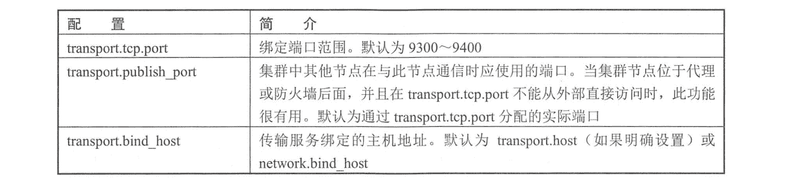
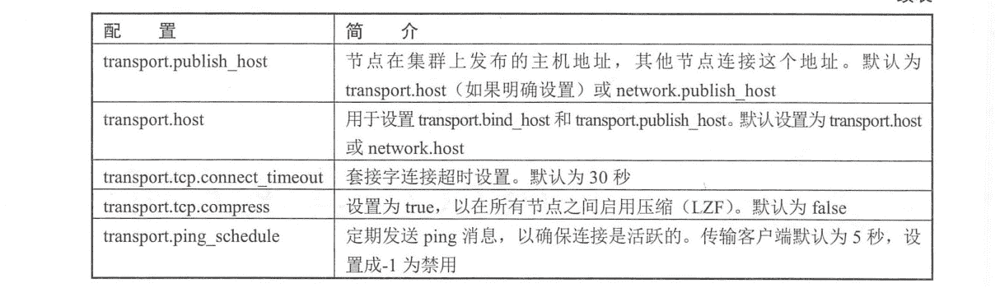
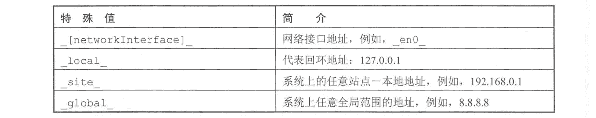
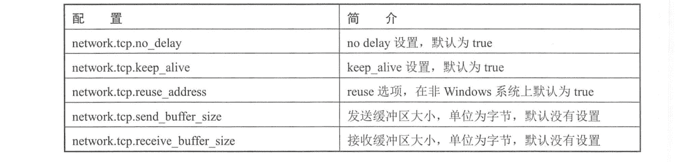
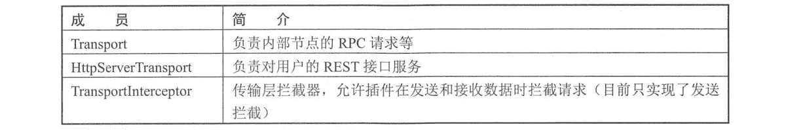
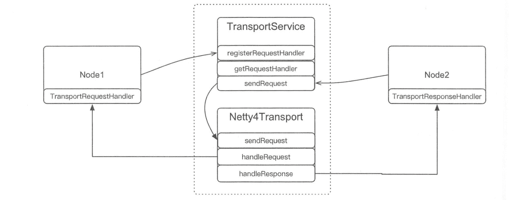
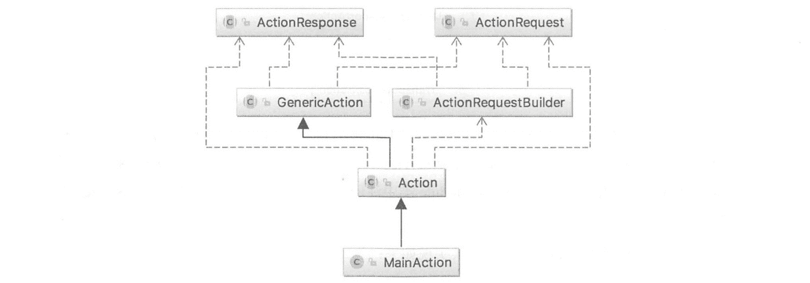
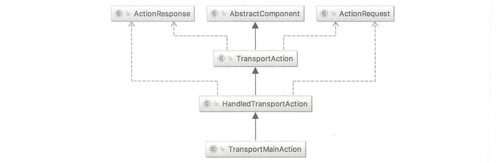

# 《Elasticsearch 源码解析与优化实战》第 15 章：Transport 模块分析

> 原文：[https://cloud.tencent.com/developer/article/1862076](https://cloud.tencent.com/developer/article/1862076)

# 简介

传输模块用于集群内节点之间的内部通信。从一个节点到另一个节点的每个调用都使用传输模块。例如，当一个节点处理 HTTP GET 请求时，实际上是由持有该数据的另一个节点处理的，这就需要处理 HTTP GET 请求的节点将请求通过传输模块转发给另一个节点。

传输机制是完全异步的，这意味着没有阻塞线程等待响应。使用异步通信的好处是解决了 C10k 问题，也是广播请求/收集结果(例如，ES 中的搜索)的理想解决方案。

# 配置信息

## 传输模块配置

TCP transport 是传输模块基于 TCP 的实现，有以下配置，如下表所示。

<figure class=""></figure>

<figure class=""></figure>

默认情况下，传输模块使用 9300 端口通信。该端口承载了三种不同的业务：客户端的 JavaAPI 通信，节点间的内部通信，以及自动发现的通信。使用 transport profiles， 可以将三者配置到不同的地址和端口。例如:

```java
transport.profiles.default.port: 9300-9400
transport.profiles.default.bind_host: 10.0.0.1
transport.profiles.client.port: 9500-9600
transport.profiles.client.bind_host: 192.168.0.1
transport.profiles.dmz.port: 9700-9800
transport.profiles.dmz.bind_host: 172.16.1.2
```

这在部分场景下很有用，例如，想保护集群内部通信的 9300 端口，只对外开放 9200 端口，但又不想影响 Java API 的使用，那么可以为 Java API 单独配置一个服务端口。

传输模块有一个专用的 tracer 日志，当它被激活时，日志系统会记录传入和传出的请求。可以通过动态设置`org.elasticsearch.transport.TransportService.tracer`为 TRACE 级别来开启:

```java
curl -X PUT "localhost:9200/_cluster/settings" -H 'Content-Type: application/json' -d'
{
    "transient" : {
        "logger.org.elasticsearch.transport.TransportService.tracer" : "TRACE"
    }
}
```

还可以使用一组 include 和 exclude 通配符模式来控制 tracer 的内容。默认情况下，除了 ping 的故障检测请求，所有请求都将被跟踪：

```java
curl -X PUT "localhost:9200/_ cluster/settings" -H 'Content- -Type: application/json' -d'
{
    "transient" : {
        "transport.tracer.include" : "*",
        "transport.tracer.exclude" : "internal:discovery/zen/ fd*"
    }
}
```

## 通用网络配置

除了传输模块配置，还有一些其他的网络配置信息。

```java
network.host
```

节点将绑定到此主机名或 IP 地址，并将此主机公布到集群中的其他节点。接受一个 IP 地址、主机名、一个特殊值，或者是这些内容任意组合的数组。默认为`_local_` 。

```java
discovery.zen.ping.unicast.hosts
```

为了加入集群，节点需要知道集群中一些其他节点的主机名或 IP 地址。此设置提供节点将尝试联系其他节点的初始列表，接受 IP 地址或主机名。如果主机名被解析为多个 IP 地址，那么每个 IP 地址都将用于 discovery。轮询 DNS 也可以在 discovery 中使用，每次返回一个不同的 IP 地址，如果 IP 地址不存在则抛出异常，并在下一轮 ping 时重新解析(取决于 JVM DNS 缓存)。默认值为["127.0.0.1", "[:1]"]。

```java
http.port
```

用于接受 HTTP 请求的绑定端口。接受单个值或范围。如果指定了一个范围，则该节点将绑定到该范围内的第一个可用端口。默认为 9200~9300。

```java
transport.tcp.port
```

为节点之间的通信绑定端口。接受单个值或范围。如果指定了一个范围，则该节点将绑定到该范围内的第一个可用端口。默认为 9300~9400。 `network.host`允许设置以下特殊值，如下表所示。

<figure class=""></figure>

默认情况下，这些特殊的值在 IPv4 和 IPv6 上都可以正常工作，但是也可以使用`:ipv4`或`:pv6`说明符来明确指定。例如，`en0:ipv4_`只绑定到 en0 的 IPv4 地址。

`network.host`是常用的设置监听地址的方式，同时设置绑定主机和发布主机。在一些高级用例中，可能需要为它们设置不同值。

```java
network.bind_host
```

指定节点应该绑定到哪个网络接口，以便监听传入的请求。一个节点可以绑定到多个接口，例如，两个网卡，或者一个站点本地地址和一个回环地址。默认为`network.host`。

```java
network.publish_host
```

发布主机是节点向集群中发布的单个网口，以便其他节点可以连接它。目前，ES 可以绑定到多个地址，但只发布一个地址。如果没有指定，则默认为来自`network..host`的“最佳”地址。按 IPv4/IPv6 栈优先排序，然后是可达性。如果为`network.host`设置多个地址，但在节点到节点的通信中依赖于特定的地址，那么应该显式地设`network.publish_host`。

以上两个配置都可以像`network.host`一样配置。它们接收 IP 地址、主机名和特殊值。

基于 TCP 的所有组件(如 HTTP 和传输模块)共享以下高级设置，如下表所示。

<figure class=""></figure>

# Transport 总体架构

ES 的传输模块和 HTTP 传输模块都是基于 Netty 实现的。Netty 是一个 Java 实现的高性能异步网络通信库，基于 epoll/kqueue 实现事件处理。

我们说的传输模块，目前只有一种实现，就是 TCP 传输模块。如上节所述，TCP 传输模块有三类用处：内部节点间通信(我们称为 RPC)、JavaAPI 客户端，以及节点发现。HTTP 模块负责服务用户的 REST 请求。

## 网络层

网络层是对内部各种传输模块的抽象，使得上层发送/接收数据时不必关心底层的实现，使用 Netty 还是其他类库，上层并不关心。 在内部实现中，传输模块和 HTTP 模块统一封装到 NetworkModule 类中。顾名思义，该类是在 TCP 传输模块和 HTTP 传输模块之上封装的，实现了对各种传输模块的初始化，上层的发送和接收依赖对网络模块的引用。

该类的几个重要数据成员如下表所示。

<figure class=""></figure>

上述三个成员在 NetworkModule 的构造函数(节点启动时调用)中通过插件方式加载。

主要对外接口如下表所示。

<figure class=""></figure>

### 1\. 网络模块初始化

初始化 NetworkModule 传输模块和 HTTP 传输模块之后，上层就可以通过该类对外提供的接口获取某个传输模块了。该类返回的各种传输模块和拦截器都是虚类型，因此本质上就是对网络层的一个抽象。

NetworkModule 内部组件的初始化是通过插件方式加载的。在其构造函数中传入 NetworkPlugin 列表，NetworkPlugin 是一个接口类， Netty4Plugin 从这个接口实现，如下图所示。

<figure class=""></figure>

在 Netty4Plugin 中，分别构建了 Netty4Transport 和 Netty4HttpServerTransport，用于传输模块和 HTTP 传输模块：

```java
public class Netty4Plugin extends Plugin implements NetworkPlugin {
    //构建 Netty4Transport 作为 Transport
    public Map<String, Supplier<Transport>> getTransports(...) {
        return Collections.singletonMap (NETTY_TRANSPORT_NAME, () -> new Netty4Transport (settings, threadPool, networkService, bigArrays, namedWriteableRegistry, circuitBreakerService));
    }
    // 构建 Netty4HttpServerTransport MF h HttpServerTransport
    public Map<String, Supplier<HttpServerTransport>> getHttpTransports(...) {
        return Collections.singletonMap (NETTY_HTTP_TRANSPORT_NAME, () -> new Netty4HttpServerTransport (settings, networkService,bigArrays, threadPool, xContentRegistry, dispatcher));
    }
}
```

根据加载的 NetworkPlugin 插件和定义好的 REST 处理器初始化 NetworkModule：

```java
//已注册好的 REST 请求处理器
final RestController restController = actionModule.getRestController() ;
//初始化 Networ kModule
final NetworkModule networkModule = new NetworkModule (settings, false, pluginsService.filterPlugins (NetworkPlugin.class), threadPool, bigArrays, circuitBreakerService, namedWriteableRegistry, xContentRegistry, networkService, restController);
```

### 2\. Netty4Transport

Netty4Transport 用于 RPC 等内部通信，其继承自 TcpTransport, 类结构如下图所示。

<figure class=""></figure>

在初始化时构建了 Client 和 Server：

```java
protected void doStart () {
    //初始化 Client
    bootstrap = createBootstrap() ;
    if (NetworkService . NETWORK_ SERVER.get (settings)) {
        for(ProfileSettings profileSettings : profileSettings) {
            //初始化 Serve
            createServerBootstrap (profileSettings) ;
            bindServer (profileSettings) ;
        }
    }
}
```

### 3\. Netty4HttpServerTransport

Netty4HttpServerTransport 用于响应 REST 请求，其继承自 HttpServerTransport，如下图所示：

<figure class=""></figure>

同样在 Netty4HttpServerTransport#doStart 中创建一个 HTTP Server 监听端口，当收到用户请求时，调用 dispatchRequest 对不同的请求执行相应的处理。哪种请求被哪个类处理这种信息注册在 ActionModule 类中。

## 服务层

服务层指网络模块的.上层应用层，基于网络模块提供的 Transport 来收/发数据。本节重点分析节点间通信，该通信使用 TransportService 类实现，在网络模块提供的 Transport 基础上，该类提供连接到节点、发送数据、注册事件响应函数等方法。其初始化过程如下:

```java
//通过网络模块获取已初始化的 Transport
final Transport transport = networkModule.getTransportSupplier().get() ;
//基于网络模块的 Transport 构建 TransportService
final TransportService transportService = newTransportService(settings, transport，threadPool, networkModule.getTransportInterceptor()，localNodeFactory, settingsModule.getClusterSettings());
```

在节点内部任何通信前，首先需要连接到集群的其他节点。

### 1\. 连接到节点

在默认配置下，ES 的每个节点与其他节点都会保持 13 个长连接。每个连接有各自的用途。可以通过配置调节某种业务使用的连接数。

当本节点连接到某个特定的节点时, TransportService 通过网络层提供的 transport.connectToNode 完成连接。在完成连接后，内部维护一个 NodeChannels 类对象，表示节点到节点的连接。其中包括多个 TCP 连接(默认为 13 个)，并记录了每个连接的用途。目前，这些连接有以下几类用途，定义在 TransportRequestOptions.Type 中。

```java
public enum Type {
    RECOVERY,//用于恢复.
    BULK,//用于批量写入
    REG, //其他用途，例如，加入集群等
    STATE, //传输集群状态
    PING //用 作 nodeFD 或 masterFD 的 ping 请求
}
```

这些连接被 ConnectionProfile 统一管理:

```java
static ConnectionProfile buildDe faul tConnect ionProfile (Settings settings) {
    //默认为 2 个
    int connectionsPerNodeRecovery = CONNECTIONS_PER_NODE_RECOVERY.get(settings);
    //默认为 3 个
    int connections PerNodeBulk = CONNECTIONS_PER_NODE_BULK.get(settings) ;
    //默认为 6 个
    int connect ionsPerNodeReg = CONNECTIONS_PER_NODE_REG.get(settings) ;
    //默认为 1 个
    int connectionsPerNodeState = CONNECTIONS_PER_NODE_STATE.ge (settings) ;
    //默认为 1 个
    int connectionsPerNodePing = CONNECTIONS_PER_NODE_PING.get(settings) ;
    ConnectionProfile.Builder builder = new ConnectionProfile.Builder();
    builder.addConnections (connectionsPerNodeBulk, TransportRequestoptions.Type.BULK);
    // .....
    return builder.build();
}
```

节点间每种用途的连接数量可以通过以下配置进行调整:

```java
transport.connections_per_node.recovery 
transport.connections_per_node.bulk 
transport.connections_per_node.reg 
transport.connections_per_node.state 
transport.connections_per_node.ping 
```

NodeChannels 类保存了这些连接，当发送数据时,根据请求类型找到对应的连接来发送数据。

```java
public final classNodeChannelsimplementsConnection{
    //保存每个请求对应的连接
    private final Map<TransportRequestoptions.Type，ConnectionProfile.ConnectionTypeHandle> typeMapping;
    //保存已建立的 TCP 连接
    private final List<TcpChannel> channels;
    //目的节点是哪个
    private final DiscoveryNode node;
}
```

建立连接过程如下，如果 13 个连接中有一个连接失败，则整体认为失败，关闭已建立的连接。

```java
public final NodeChannels openConnection (DiscoveryNode node, ConnectionProfile connectionProfile) throws IOException {
    //获取总连接数
    int numConnections = connectionProfile.getNumConnections();
    List<TcpChannel> channels = new ArrayList<> (numConnections);
    for (int i = 0; i < numConnections; ++i) {
        try {
            //建立一个连接.
            TcpChannel channel = initiateChannel (node，connectionProfile.getConnectTimeout()，connectFuture) ;
            channels.add(channel);
        } catch (Exception e) {
            //如果产生异常，则关闭所有连接
            TcpChannel.closeChannels(channels, false);
            throw e ;
        }
    }
    //构建并返回 NodeChannels
    nodeChannels = new NodeChannels (node, channels, connectionProfile, version);
    return nodeChannels;
}
```

### 2.发送请求

内部的 RPC 请求通过 TransportService#sendRequest 发送，在之前的章节中经常可以见到这种发送请求的调用。sendRequest 会检查目的节点是否是本节点，如果是本节点，则在 sendLocalRequest 方法中直接通过 action 获取对应的 Handler,调用对应的处理函数。简化的实现过程如下:

```java
private void sendLocalRequest(...) {
    final RequestHandlerRegistry reg = getRequestHandler(action);
    reg.processMessageReceived (request, channel) ;
}
```

当需要发送到网络时，调用 asyncSender.sendRequest 执行发送，最终通过 TcpTransport.NodeChannels#sendRequest 发送数据，先根据请求类型获取相应的连接，某种类型如果有多个连接，例如，BULK 请求，则会在多个连接中轮询选择。

```java
public void sendRequest (long requestId, String action, TransportRequest request, TransportRequestoptions options) {
    //通过请求类型获取 13 个连接中的相应连接
    TcpChannel channel = channel (options. type()) ;
    //发送请求
    sendRequestToChannel (this.node, channel, requestId, action，request, options, getVersion()，(byte) 0);
}
```

### 3\. 定义对 Response 的处理

当通过 TransportService#sendRequest 发送一个 RPC 请求时，本节点作为 RPC 客户端，需要同时定义当服务器执行完 RPC，返回 Response 后，对这个 Response 如何处理。Transport-ResponseHandler 类负责定义对这个 Response 的处理。在发送请求的 sendRequest 函数的最后一个参数中定义，例如：

```java
transportService . sendRequest (primaryNode, IN_FLIGHT_OPS_ACTION_NAME，new InFlightOpsRequest(shardId), new TransportResponseHandler<InFlightOpsResponse>() {
    //返回一个新的 response
    public InFlightOpsResponse newInstance () {
        return new InFlightOpsResponse() ;
    }
    //对远程节点执行成功的处理
    public void handleResponse (InFlightOpsResponse response) {
        listener.onResponse(response);
    }
    //对远程节点执行失败的处理
    public void handleException (TransportException exp) {
        logger.debug("{} unexpected error while retrieving in flightop count", shardId) ;
        listener . onFailure(exp) ;
    }
    //返回线程池名称
    public String executor() {
        return ThreadPool.Names.SAME ; 
    }
}) ;
```

TransportResponseHandler 类主要定义了对远程节点执行 RPC 请求后返回成功还是失败处理。

### 4\. 定义对请求的处理

本节点也需要处理来自其他节点的 RPC 请求，因此需要定义对每个 RPC 使用哪个模块进行处理。具体参考 RPC 一节。

# REST 解析和处理

对 REST 请求的处理就是定义某个 URI 应该由哪个模块处理。在 ES 中, REST 请求和 RPC 请求都称为 Action，对 REST 请求执行处理的类命名规则为 Rest* Action。

ActionModule 类中注册了某个类对某个 REST 请求的处理，并对外提供这种映射关系，每个 REST 处理类继承自 RestNodesInfoAction。处理类在 ActionModule 中的注册过程如下：

```java
public void initRestHandlers (Supplier<DiscoveryNodes> nodesInCluster) {
    registerHandler.accept (new RestMainAction (settings, restController) ) ;
    registerHandler.accept (new RestNodesInfoAction (settings, restController, settingsFilter)) ;
    registerHandler.accept (new RestRemoteClusterInfoAction (settings, restController)) ;
    //省略大部分的注册
}
```

以 RestNodesInfoAction 为例，在构造函数中注册对某个 URL 的处理如下

```java
public Res tNodes InfoAction (Settings settings, RestController controller, SettingsFilter settingsFilter) {
    super (settings) ;
    controller.registerHandler (GET, "/_nodes", this) ;
    controller.registerHandler (GET, "/_nodes/(nodeId]", this) ;
    this.settingsFilter = settingsFilter;
}
```

同时，每个 REST 请求处理类需要实现一个 prepareRequest 函数，用于在收到请求时，对请求执行验证工作等，当一个请求到来时，网络层调用 BaseRestHandler#handleRequest。 在这个函数中，会调用子类的 prepareRequest,然后执行这个 Action：

```java
public final void handleRequest (RestRequest request, RestChannel channel, NodeClient client) throws Exception {
    //调用子类的 prepareRequest
    final RestChannelConsumer action = prepareRequest(request, client) ;
    //执行子类定义的任务
    action.accept(channel);
}
```

对 Action 的具体处理定义在处理类的 prepareRequest 的 Lambda 表达式中，例如:

```java
public RestChannelConsumer prepareRequest (final RestRequest request, final NodeClient client) throws IOException {
    //省略对请求的预处理
    //Action 具体要执行的任务
    return channel -> client.admin().cluster().getSnapshots(getSnapshotsRequest, new RestToXContentListener<> (channel));
}
```

当 Netty 收到 HTTP 请求后，调用 Netty4HttpServerTransport#dispatchRequest， 该方法根据 定义好的 Action 调用对应的 Rest*Action 处理类。

# RPC 实现

RPC 是远程过程调用的简称，当一个节点需要另一个节点执行某些操作时，例如，创建、删除索引等，向这个节点发送一个 RPC 请求，ES 的 RPC 基于 TCP 实现，底层是 Netty 的 Netty4Transport。每个 RPC 在内部称为 Action,有唯一的名称， 例如，cluster:monitor/main。 当传输模块收到一个 RPC 请求时，会根据这个 Action 名称获取对应的处理类。

TransportService 类是在网络层之.上对 RPC 的发送与接收的服务层封装，虽然从模块设计角度来说，网络层的设计对内部是否使用 Netty 框架是解耦的，除 Netty 外，也可以使用其他通信框架，但是为了让读者更容易理解，我们看一下从 TransportService 到 Netty4Transport 的联系，

如下图所示。

<figure class=""></figure>

在上图中, Node2 调用 sendRequest 发送请求，发送时传入定义好的 TransportResponseHandler，TransportService 调用 Netty4Transport 的 sendRequest 发送数据。当远程节点处理完毕，Netty4Transport 的 handleResponse 方法最终回调发送请求时定义的 TransportResponseHandler。

Node1 接收请求，通过 registerRequestHandler 注册 Action 和对应的处理类 TransportRequest-Handler。TransportService 类中维护了 Action 与处理类的对应关系。当 Netty4Transport 收到请求后，handleRequest 方法中调用 TransportService 类的 getRequestHandler(action)通过(客户端请求中的) Action 获取相应的处理类，最终调用 TransportRequestHandler 执行对 RPC 的处理逻辑。

## RPC 的注册和映射

一个 RPC 请求与处理模块的对应关系在两方面维护：

*   在 ActionModule 类中注册 Action 与处理类的映射;
*   通过 TransportService#registerRequestHandler 方法注册 Action 名称与对应处理器的映射。

这两种映射关系同时存在。RPC 先在 ActionModule 类中注册，再调用 TransportService#registerRequestHandler 在 TransportService 类中注册。在大部分情况下，网络层收到请求后根据 TransportService 注册的 Action 信息获取对应的处理模块。

### 1\. ActionModule 类中的注册

与 REST Action 的注册类似，内部 RPC 也注册在 ActionModule 类中，描述某个 Action 应该被哪个类处理。一个 Action 可以理解为 RPC 调用的名称。Action 与处理类的映射关系如下:

```java
static Map<String, ActionHandler<?, ?>> setupActions (List<ActionPlugin> actionPlugins) {
    ActionRegistry actions = new ActionRegistry() ;
    actions.register (MainAction.INSTANCE, TransportMainAction.class) ;
    actions.register (NodesInfoAction.INSTANCE,
    TransportNodesInfoAction.class) ;
    actions.register (RemoteIn foAction.INSTANCE,
    TransportRemoteInfoAction.class) ;
    //省略大部分 Action 的注册
}
```

register 函数的第-一个参数是名称规则为*Action 的类，以比较简单的 MainAction 为例，其 类结构如下图所示。

<figure class=""></figure>

这个类主要定义了 Action 的名称及返回响应，同样以 MainAction 为例，其实现如下:

```java
public class MainAction extends Action<MainRequest, MainResponse, MainReques tBuilder> {
    //定义 Action 名称，后续会根据 Action 名称找到对应的处理类
    public static final String NAME = "cluster:monitor/main";
    public static final MainAction INSTANCE = new MainAction() ;
    public MainRequestBuilder newRequestBuilder (ElasticsearchClient client) {
        return new MainRequestBuilder (client，INSTANCE) ;
    }
    public MainResponse newResponse() {
        return new MainResponse() ;
    }
}
```

第二个参数是名称规则为 Transport*Action 的类,在这个类中定义对此 Action 的具体处理。 以 TransportMainAction 类为例，其类结构如下图所示。

<figure class=""></figure>

注意，许多 Transport* Action 类都会继承自 HandledTransportAction。 而在 HandledTransport-Action 类的构造函数中，会调用 TransportServce#registerRequestHandler 在 TransportService 类中注册处理器。因此，许多在 ActionModule 类中注册的 RPC 信息会自动在 TransportService 中添加映射关系。

以 TransportMainAction 类为例，其实现如下:

```java
public class TransportMainAction extends HandledTransportAction<MainRequest, MainResponse> {
    public Transpor tMainAction() {
    }
    //定义对此 RPC 的处理.
    protected void doExecute (MainRequest request, ActionListener<MainResponse> listener) {
    }
}
```

doExcute 函数汇总需要实现最重要的对 RPC 请求的具体处理逻辑。

### 2\. TransportService 类中的注册

在 TransportService 中注册 RPC 信息是为了在收到传输层的请求后，通过 Action 字符串找到对应的处理类。注册过程需要提供两个关键信息: Action 名称与请求处理类(TransportRequestHandler 对象)。

在 TransportService 类中通过 registerRequestHandler 注册 RPC 信息的来源可以分为两种，一种 是来自 ActionModule 的注册，Transport* Action 类的父类 HandledTransportAction 在其构造函数中自动调用 registerRequestHandler;另一种 是来自其他模块的直接调用 registerRequestHandler，例如，TransportReplicationAction 和 MasterFaultDetection。

以 HandledTransportAction 类在 TransportService 中的注册为例，其注册过程如下:

```java
transportService.registerRequestHandler (actionName，request, ThreadPool.Name.SAME，false canTripCircuitBreaker, new TransportHandler());
```

TransportService 将映射维护在一个 Map 中：

```java
Map<String，RequestHandlerRegistry>
```

Map 的 key 为 Action 名称，RequestHandlerRegistry 中封装了与 RPC 相关的 Action 名称、处理器等信息。通过它可以找到对应的处理模块。为 registerRequestHandler 传入的最后一个参数就是定义的处理器。这个处理器需要从 TransportRequestHandler 类继承。如前所述，在 TransportService 类中注册 RPC 的时机来源于 ActionModule 和 HandledTransportAction 的构造函数，我们以 HandledTransportAction 构造函数中注册时为例，其处理器定义如下:

```java
class TransportHandler implements Transpor tReques tHandler<Request> {
    //当收到 RPC 请求
    public final void messageReceived (final Request request, final TransportChannel channel, Task task) throws Exception {
        //执行这个 RPC 请求
        execute(task, request, new ActionListener<Response>() {
        //执行成功， 将产生的响应回复客户端
            public void onResponse (Response response) {
                channel.sendResponse (response) ;
            }
            //执行失败，向客户端回复失败原因
            public void onFailure (Exception e) {
                channel.sendResponse (e) ;
            }
        }) ;
    }
}
```

对请求的处理方法 execute 定义在 TransportAction 类中，它先检测请求的合法性，然后调用 Transport*Action 中定义的 doExecute 函数执行真正的 RPC 处理逻辑。

```java
public final void execute (Task task, Request request, ActionListener<Response> listener) {
    //验证请求
    ActionRequestValidationException validationException = request.validate() ;
    RequestFilterChain<Request, Response> requestFilterChain = new RequestFilterChain<>(this, logger) ;
    //调用 Action 定义的 doExecute 函数执行用户定义的处理
    requestFilterChain.proceed(task, actionName，request, listener) ;
}
```

## 根据 Action 获取处理类

当收到一个 RPC 请求进行处理时，由于触发点的不同，有多种途径找到这个 RPC 对应的处理模块是哪个。

### 1\. REST 请求触发

某些 REST 请求会触发内部的 RPC 请求，在这种情况下，在 NodeClient#executeLocally 方法中通过 Action 获取 TransportAction，Actions 是 ActionModule 类中注册的 RPC 列表。

```java
TransportAction transportAction (Gener icAction<Request, Response> action) {
    Transpor tAction<Request, Response> transportAction = actions.get(action) ;
    return transportAction; 
}
```

获取 TransportAction 后，调用 execute 执行处理。处理过程与，上一节所述相同，在 requestFilterChain.proceed 方法中调用此 Action 的 doExecute 函数进行处理。

### 2\. TcpTransport 收到 RPC 请求

从 TCP 传输层(也就是 9300 端口)收到一个 RPC 请求是最常见的方式。当收到一个请求时，首先在 TcpTransport#messageReceived 中进行基本的处理，然后到 handleRequest 方法中处理请求，在这个方法中，调用 TransportService 通过 Action 获取处理类。

```java
//通过 Action 获取处理模块
final RequestHandlerRegistry reg = transportService.getRequestHandler(action); 
//调用处理模块执行对 RPC 的处理逻辑
threadPool.executor(reg.getExecutor()).execute (new RequestHandler(reg, request, transportChannel));
```

# 思考与总结

*   本章主要分析了 REST API 和内部 RPC 的解析与调用，以及网络层与服务层的关系。
*   默认情况下，ES 的每个节点与其他节点都保持 13 个长连接，这在集群规模较大时，

例如，达到 1000 节点时，会维护非常多的连接。在这种情况下，如果重新启动集群，由于需要在短时间内建立大量连接，则新建连接的请求有可能被操作系统认为是 SYN 攻击。