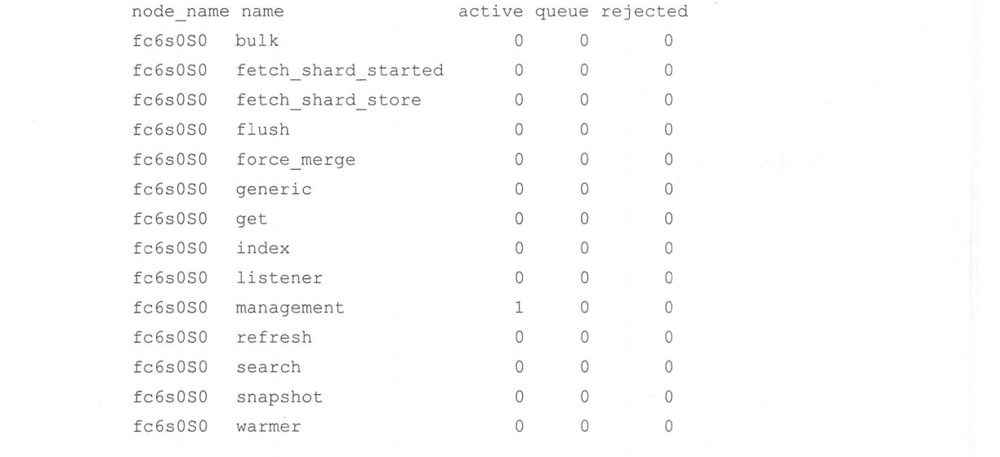
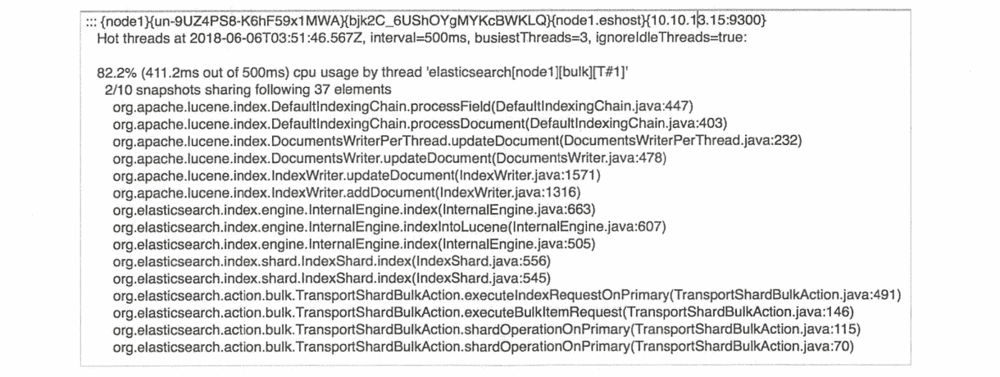
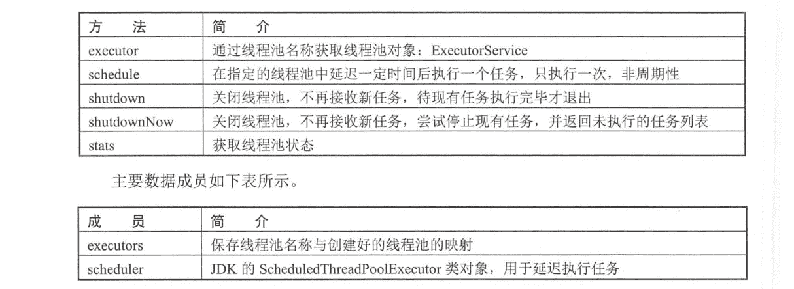

# 《Elasticsearch 源码解析与优化实战》第 16 章：ThreadPool 模块分析

> 原文：[https://cloud.tencent.com/developer/article/1862369](https://cloud.tencent.com/developer/article/1862369)

# 简介

每个节点都会创建一系列的线程池来执行任务，许多线程池都有与其相关任务队列，用来允许挂起请求，而不是丢弃它。下面列出目前 ES 版本中的线程池。

*   `generic`：用于通用的操作(例如，节点发现)，线程池类型为 scaling。
*   `index`：用于 index/delete 操作，线程池类型为 fixed，大小为处理器的数量，队列大小为 200，允许设置的最大线程数为 1+处理器数量。
*   `search`：用于 count/search/suggest 操作。线程池类型为 fixed, 大小为 int((处理器数量 3)/2)+1，队列大小为 1000。
*   `get`：用于 get 操作。线程池类型为 fixed, 大小为处理器的数量，队列大小为 1000。
*   `bulk`：用于 bulk 操作，线程池类型为 fixed,大小为处理器的数量，队列大小为 200，该线程池允许设置的最大线程数为 1+处理器数量。
*   `snapshot`：用于 snaphostrestore 操作。线程池类型为 scaling,线程保持存活时间为 5min,最大线程数为 min(5, (处理器数量)/2)。
*   `warme`：用于 segment warm-up 操作。线程池类型为 scaling， 线程保持存活时间为 5min，最大线程数为 min(5, (处理器数量)/2)。
*   `refresh`：用于 refresh 操作。线程池类型为 scaling, 线程空闲保持存活时间为 5min，最大线程数为 min(10, (处理器数量)/2)。
*   `listener`：主要用于 Java 客户端线程监听器被设置为 true 时执行动作。线程池类型为 scaling,最大线程数为 min(10, (处理器数量)/2)。
*   `same`：在调用者线程执行，不转移到新的线程池。
*   `management`：管理工作的线程池，例如，Node info、Node tats、 List tasks 等。
*   `flush`：用于索引数据的 flush 操作。
*   `force_merge`：顾名思义，用于 Lucene 分段的 force merge。
*   `fetch_shard_started` ：用于 TransportNodesAction.
*   `fetch_shard_store` ：用于 TransportNodesListShardStoreMetaData。
*   `thread_pool.search.size: 30`：线程池和队列的大小可以通过配置文件进行调整,例如，为 search 增加线程数和队列大小:

# 线程池类型

如同任何要并发处理任务的服务程序一样，线程池要处理的任务类型大致可以分为两类:CPU 计算密集型和 I/O 密集型。对于两种不同的任务类型,需要为线程池设置不同的线程数量。

一般说来，线程池的大小可以参考如下设置，其中 N 为 CPU 的个数:

*   对于 CPU 密集型任务，线程池大小设置为 N+1;
*   对于 I/O 密集型任务，线程池大小设置为 2N+1；

对于计算密集型任务，线程池的线程数量- - 般不应该超过 N+1。如果线程数量太多，则会导致更高的线程间上下文切换的代价。加 1 是为了当计算线程出现偶尔的故障,或者偶尔的 I/O、发送数据、写日志等情况时，这个额外的线程可以保证 CPU 时钟周期不被浪费。

I/O 密集型任务的线程数可以稍大一些，因为 I/O 密集型任务大部分时间阻塞在 I/O 过程，适当增加线程数可以增加并发处理能力。而上下文切换的代价相对来说已经不那么敏感。但是线程数量不一定设置为 2N+1,具体需要看 I/O 等待时间有多长。等待时间越长，需要越多的线程，等待时间越少，需要越少的线程。因此也可以参考下面的公式:

```java
最佳线程数= ((线程等待时间 + 线程 CPU 时间) /线程 CPU 时间) * CPU 数
```

为了应对这两种类型的任务，ES 封装了以下类型的线程池。

## fixed

线程池拥有固定数量的线程来处理请求，当线程空闲时不会销毁，当所有线程都繁忙时，请求被添加到队列中。

*   `size`参数用来控制线程的数量。
*   `queue_size` 参数用来控制线程池相关的任务队列大小。设置为-1 表示无限制。当请求到达时，如果队列已满，则请求将被拒绝。

例如:

```java
thread_pool.search.size: 30
thread_pool.search.queue_size: 1500
```

## scaling

scaling 线程池的线程数量是动态的，介于 core 和 max 参数之间变化。线程池的最小线程数为配置的 core 大小，随着请求的增加，当 core 数量的线程全都繁忙时，线程数逐渐增大到 max 数量。max 是线程池可拥有的线程数.上限。当线程空闲时，线程数从 max 大小逐渐降低到 core 大小。

*   `keep_alive`参数用来控制线程在线程池中的最长空闲时间。

例如：

```java
thread_pool.warmer.core: 1
thread_pool.warmer.max:8
thread_pool.warmer.keep_alive: 2m 
```

## direct

这种线程池对用户并不可见,当某个任务不需要在独立的线程执行，又想被线程池管理时，于是诞生了这种特殊类型的线程池:在调用者线程中执行任务。

## fixed_auto_queue_size

与 fixed 类型的线程池相似，该线程池的线程数量为固定值，但是队列类型不一样。 其队列大小根据利特尔法则( Little's Law) 自动调整大小。该法则的详细信息可以参考 https://en.wikipedia.org/wiki/Little%27s_law。 该线程池有以下参数可以调整:

*   `size`：用于指定线程数量;
*   `queue_size`,：指定初始队列大小; .
*   `min_queue_size`：最小队列大小;
*   `max_queue_size`：最大队列大小;
*   `auto_gueue_frame_size`： 调整队列之前进行测量的操作数;
*   `target_response_time`：一个时间值设置，用来指示任务的平均响应时间，如果任务经常高于这个时间，则线程池队列将被调小，以便拒绝任务。

该线程类型为实验性质，未来可能会移除。目前只有 search 线程池使用这种类型。

# 处理器设置

默认情况下，ES 自动探测处理器数量。各个线程池的大小基于这个数量进行初始化。在某些情况下，如果想手工指定处理器数量，则可以通过设置 processors 参数实现：

```java
processors: 2
```

有以下几种场景是需要明确设置 processors 数量的：

(1)在同一台主机上运行多个 ES 实例，但希望每个实例的线程池只根据一部分 CPU 来设置，此时可以通过 processors 参数来设置处理器数量。例如，在 16 核的服务器上运行 2 个实例，可以将 processors 设置为 8。请注意，在单台主机上运行多个实例，除了设置 processors 数量，还有许多更复杂的参数需要设置。例如，修改 GC 线程数，绑定进程到 CPU 等。

(2)有时候自动探测出的处理器数量是错误的，在这种情况下，需要明确设置处理器数量。要检查自动探测的处理器数量，可以使用节点信息 API 中的 os 字段来查看。

# 查看线程池

ES 提供了丰富的 API 查看线程池状态，在监控节点健康、排查问题时非常有用。

## cat thread pool

该命令显示每个节点的线程池统计信息。默认情况下，所有线程池都返回活动、队列和被拒绝的统计信息。我们需要特别留意被拒接的信息，例如，bulk 请求被拒绝意味着客户端写入失败。在正常情况下客户端应该捕获这种错误(错误码 429)并延迟重试，但有时客户端不一定对这种错误做了处理，导致写入集群的数据量低于预期值。

```java
curl -X GET "localhost:9200/_cat/thread_pool"
```

返回信息如下：

<figure class=""></figure>

active 表示当前正在执行任务的线程数量，queue 表示队列中等待处理的请求数量，rejected 表示由于队列已满，请求被拒绝的次数。

对返回结果进行过滤等更多用法可参考官方手册: https://www.elastic.co/guide/en/elasticsearch/reference/6\. 1/cat-thread-pool.html。

## nodes info

节点信息 API 可以返回每个线程池的类型和配置信息，例如，线程数量、队列大小等。下面的第一条命令返回所有节点的信息，第二条命令返回特定节点的信息。.

```java
curl -X GET "localhost:9200/_nodes"
curl -X GET "localhost:9200/_nodes/nodeId1, nodeId2"
```

节点信息 API 返回的信息非常大，其中与线程池相关信息在 thread_ pool 字段中，选取部分信息如下:

```java
"thread_pool" : {
    "force_merge" : {
        "type" : "fixed",
        "min" : 1,
        "max" : 1,
        "queue_size" : - 1
    },
    "fetch_ shard started" : {
        "type" : "scaling",
        "min" : 1,
        "max" : 16,
        "keep_alive" : "5m",
        "queue_size" : -1
    }
}
```

该命令的完整信息可参考官方手册: https://www.elastic.co/guide/en/elasticsearch/reference/6.1/cluster-nodes-info.html

## nodes stats

statsAPI 返回集群中一个或全部节点的统计数据。

下面的第一条命令返回所有节点的统计数据，第二条命令返回特定节点的统计数据。

```java
curl -X GET "localhost:9200/_nodes/stats"
curl -X GET "localhost:9200/_nodes/nodeId1, nodeId2/stats"
```

默认情况下，该 API 返回全部 indices、oS、process、jvm、transport、http、fs、breaker 和 thread_pool 方面的统计数据。其中线程池相关的返回结果摘要如下:

```java
"thread_pool" : {
    "bulk" : {
        "threads" : 0,
        "queue" : 0,
        "active" : 0,
        "rejected" : 0，
        "largest" : 0，
        "completed" : 0
    }
}
```

该命令的完整使用方式可参考官方手册: https://www.elastic.co/guide/en/elasticsearch/reference/6.1/cluster-nodes-stats.html。

## nodes hot threads

该 API 返回集群中一个或全部节点的热点线程。

当发现节点进程占用 CPU 非常高时，想知道是哪些线程导致的，这些线程具体在执行什么操作，常规做法是通过 top 命令配合 jstack 来定位线程，现在 ES 提供了更便捷的方式，通过 hot threads API 可以直接返回这些信息。

下面的第一条命令返回所有节点的热点线程，第二条命令返回特定节点的热点线程。

```java
curl -X GET "localhost:9200/_nodes/hot_threads"
curl -X GET "localhost:9200/nodes/nodeId1, nodeId2/hot_threads"
```

该命令支持以下参数：

*   `threads`：返回的热点线程数，默认为 3。
*   `interval：ES`对线程做两次检查,来计算某个操作.上花费时间的百分比，此参数定义这个间隔时间。默认为 500 ms。
*   `type`：定义要检查的线程状态类型,默认为 CPU.API 可以检查线程的 CPU 占用时间、阻塞(block)时间和等待(wait) 时间。
*   `ignore_idle_threads`：如果设置为 true， 则空闲线程(例如，在套接字中等待，或者从空队列中获取任务)将被过滤。默认值为 true。

其返回信息的样例如下图所示。

<figure class=""></figure>

返回信息中的第一行表明这个是哪个节点的信息，以及这个节点的 IP 地址等。

```java
::: {node1} {un- 9UZ4PS8-K6hF59x1MWA} {bjk2C_ _6USh0YgMYKcBWKLQ} {node1.eshost}
{10.10.13.15:9300}
```

接下来列出哪个线程占用较多的 CPU，以及 CPU 的占用比：

```java
82.2% (411.2ms out of 500ms) cpu usage by thread 'elasticsearch [node1]
[bulk] [T#1] '
```

最后是该线程的堆栈信息。

ES 中的线程池是基于对 Java 线程池的封装和扩展。我们先看一下 Java 线程池的结构和使用方式，这些是 ES 内部线程原理的基础知识。

## Java 的线程池结构

Java 内部的线程池称为 Executor 框架，几个基本的类概念如下：

*   Runable 定义一个要执行的任务。
*   Executor 提供了 execute 方法，接受一个 Runable 实例，用来执行一个任务。
*   ExecutorService 是线程池的虚基类，继承自 Executor, 提供了 shutdown, shutdownNow 等关闭线程池接口。
*   ThreadPoolExecutor 线程池的具体实现。继承自 ExecutorService，维护线程创建、线程生命周期、任务队列等。
*   EsThreadPoolExecutor 是 ES 对 ThreadPoolExecutor 的扩展实现。未来会增加一些统计信息。

这几个类的继承结构如下图所示。

<figure class=""></figure>

我们以一个简单的例子来看看 Java 线程池的用法，ExecutorService 类用于保存创建的线程池实例，后续调用 execute 方法执行任务。在下面的例子中，任务类 TestRunnable 只是打印当前线程名称。

```java
import java. util.concurrent.ExecutorService;
import java. util.concurrent.Executors;
public class ThreadPoolDemo {
    public static void main(String[] args) {
        //通过 Executors 构建一个固定大小的线程池，线程数量为 2，返回线程池实例
        ExecutorService executorService = Executors.newFixedThreadPool (2) ;
        //调用 线程池的 execute 方法执行一个任务
        executorService.execute(new TestRunnable());
    }
}

class TestRunnable implements Runnable {
    public void run() {
        System.out.println (Thread.currentThread().getName()) ;
    }
}
```

ES 内部创建线程池时，返回类型同样是 ExecutorService 类。接下来我们通过构建过程来看 看 ThreadPoolExecutor 的结构，其构造函数如下:

```java
public ThreadPoolExecutor (int corePoolSize,
                int maximumPoolSize,
                        long keepAl iveTime,
                TimeUnit unit,
                BlockingQueue<Runnable> workQueue,
                ThreadFactory threadFactory,
                RejectedExecutionHandler handler) {
        if (corePoolSize < 0 || max.imumPoolSize <= 0 || 
                        maximumPoolSize < corePoolSize ||
                        keepAliveTime < 0)
                throw new IllegalArgumentException() ;
        if (workQueue == null || threadFactory == null || handler == null)
                throw new Nul lPointerException() ;
        this.corePoolSize = corePoolSize;
        this.maximumPoolSize = maximumPoolSize;
        this.workQueue = workQueue ;
        this.keepAliveTime = unit.toNanos (keepAliveTime) ;
        this.threadFactory = threadFactory;
        this.handler = handler;
}
```

几个重要参数的含义如下：

*   `corePoolSize`：线程池大小;
*   `maximumPoolSize`：最大线程数量;
*   `keepAliveTime`：线程空闲回收时间;
*   `BlockingQueue`：任务队列;
*   `handler`： 队列满，拒绝请求时的回调函数。

ThreadPoolExecutor 类是 Java 线程池的具体实现，是整个线程池中最重要的类，ES 基于这个类进行了一些扩展。

# ES 的线程池实现

ES 中使用的线程池绝大部分封装在 ThreadPool 类中,个别独立线程池的实现在本章末尾讨论。除了个别情况，在 ThreadPool 类中，会创建各个模块要使用的全部线程池。本章开始所讨论的几种线程池就是在 ThreadPool 类中创建的。

ThreadPool 类创建各个线程池，要使用线程池的各个内部模块会引用 ThreadPool 类对象，通过其对外提供 executor 方法，根据线程池名称获取对应的线程池引用，进而执行某个任务。

ThreadPool 对外提供的重要方法如下表所示。

<figure class=""></figure>

当某个模块要在新的线程中启动任务时，典型的使用方式如下:

```java
threadPool.executor(ThreadPool.Names.SNAPSHOT).execute(() ->
    beginSnapshot (newState, newSnapshot, request.partial(), listener));
```

threadPool.executor 方法返回 snapshot 线程池( ExecutorService 类)的引用，通过线程池的 execute 方法执行任务，在本例中，任务的 Runnable 是 Lambda 表达式定义的。

## ThreadPool 类结构与初始化

ThreadPool 类对象在节点启动时初始化，在 Node 类的构造函数中初始化 ThreadPool 类:

```java
final ThreadPool threadPool = new ThreadPool (settings, executorBuilders.toArray (new ExecutorBuilder[0]));
```

线程池对象构建完毕，将这个类的引用传递给其他要使用线程池的模块:

```java
final ResourcewatcherService resourceWatcherService = new ResourceWatcherService (settings, threadPool);
```

线程池的名称在内部类 Names 中，最好记住它们的名字，有时需要通过 jstack 查看堆栈，ES 的堆栈非常长，这就需要通过线程池的名称去查找关注的内容。

```java
public static class Names {
    public static final String SAME = "same";
    public static final String GENERIC = "generic";
    public static final String LISTENER = "listener";
    public static final String GET = "get";
    public static final String INDEX = "index" ;
    public static final String BULK = "bulk";
    public static final String SEARCH = "search";
    public static final String MANAGEMENT = "management" ;
    public static final String FLUSH = "flush";
    public static final String REFRESH = "refresh";
    public static final String WARMER = "warmer" ;
    public static final String SNAPSHOT = "snapshot";
    public static final String FORCE MERGE = "force_merge";
    public static final String FETCH_SHARD_STARTED = "fetch_shard_started";
    public static final String FETCH_SHARD_STORE = "fetch_shard_store";
}
```

线程池类型由枚举类型 ThreadPoolType 定义：

```java
enum ThreadPoolType {
    DIRECT ("direct") ,
    FIXED ("fixed") ,
    FIXED_AUTO_QUEUE_SIZE("fixed_auto_queue_size") ,
    SCALING ("scaling") ;
}
```

在 ThreadPool 类构造函数中，全部的线程池被初始化：

```java
public ThreadPool (final Settings settings, final ExecutorBuilder<?> ... customBuilders) {
    final Map<String, ExecutorBuilder> builders = new HashMap<> () ;
    builders.put(Names.GENERIC, new ScalingExecutorBuilder(Names.GENERIC, 4, genericThreadPoolMax, TimeValue. timeValueSeconds (30))) ;
    builders.put (Names. INDEX, new FixedExecutorBuilder (settings, Names.INDEX, availableProcessors, 200)) ;
    //index/delete 操作与 bulk 使用同一个线程池
    builders.put(Names.BULK, new FixedExecutorBuilder(settings, Names.BULK, availableProcessors, 200));
    builders.put(Names.GET, new FixedExecutorBuilder(settings, Names.GET, availableProcessors, 1000)) ;
    builders.put (Names.SEARCH, new AutoQueueAdjustingExecutorBuilder(settings, Names.SEARCH, searchThreadPoolSiz (availableProcessors), 1000, 1000, 1000, 2000));
    builders.put (Names.MANAGEMENT, new Scal ingExecutorBuilder(Names.MANAGEMENT, 1, 5, TimeValue.timeValueMinutes(5))) ;
    builders.put (Names.LISTENER, new FixedExecutorBuilder (settings, Names.LISTENER, halfProcMaxAt10, -1));
    builders.put (Names.FLUSH, new ScalingExecutorBuilder (Names.FLUSH, 1, halfProcMaxAt5, TimeValue.timeValueMinutes(5))) ;
    builders.put (Names . REFRESH, new ScalingExecutorBuilder(Names.REFRESH, 1, halfProcMaxAt10, TimeValue.timeValueMinutes(5))) ;
    builders.put (Names.WARMER, new Scal ingExecutorBuilder (Names.WARMER, 1, halfProcMaxAt5, TimeValue.timeValueMinutes(5))) ;
    builders.put (Names.SNAPSHOT, new ScalingExecutorBuilder(Names.SNAPSHOT, 1, halfProcMaxAt5, TimeValue.timeValueMinutes(5))) ;
    builders.put (Names.FETCH_SHARD_STARTED, new ScalingExecutorBuilder(Names.FETCH_SHARD_STARTED, 1, 2 * availableProcessors, TimeValue.timeValueMinutes(5))) ;
    builders.put (Names.FORCE_MERGE, new FixedExecutorBuilder (settings, Names.FORCE_MERGE, 1, -1) ) ;
    builders.put (Names.FETCH_SHARD_STORE, new Scal ingExecutorBuilder(Names.FETCH_SHARD_STORE, 1, 2 * availableProcessors, TimeValue.timeValueMinutes(5))) ;
}
```

这些线程池构建成功后，最终保存到一个 map 结构中，map 列表根据 builders 信息构建， 将 SAME 线程池单独添加进去。

```java
Map<String, ExecutorHolder> executors
```

当某个模块使用线程池时，通过线程池名称从这个 map 中获取对应的线程池。

```java
public ExecutorService executor (String name) {
    final ExecutorHolder holder = executors.get(name);
    return holder.executor() ;
}
```

map 中的值： ExecutorHolder 是 ThreadPool 内部类，它只是简单封装了一下 ExecutorService。

```java
class ExecutorHolder {
    private final ExecutorService executor ;
    //Info 类主要是线程池名称、类型、队列大小、线程数量的 max 和 min、keepAlive 时间
    public final Info info;
}
```

## fixed 类型线程池构建过程

FіхеdЕхесutоrВuіldеr 类用于 fixed 类型的线程池构建，它的主要实现是通过 ЕѕЕхесutоrѕ.newFixed 方法构建一个 ExecutorService。由于是 fixed 类型的线程池，因此 EsThreadPoolExecutor 传入的 corePoolSize 和 maximumPoolSize 的大小相同。

```java
public static EsThreadPoolExecutor newFixed (String name, int size, int queueCapacity, ThreadFactory threadFactory, ThreadContext contextHolder) {
    //使用有限或无限大小的阻塞队列初始化线程池队列
    BlockingQueue<Runnable> queue;
    if (queueCapacity < 0) f
        queue = Concur rentCollections . newBlockingQueue () ;
    } else {
        queue =new SizeBlockingQueue<> (ConcurrentCollections.<Runnable> newBlockingQueue(), queueCapacity) ;
   }
   //创建线程池
    return new EsThreadPoolExecutor (name, size, size, 0, TimeUnit.MILLISECONDS, queue, threadFactory, new EsAbortPolicy(), contextHolder) ;
}
```

## scaling 类型线程池构建过程

ScalingExecutorBuilder 用于 scaling 类型线程池的构建，它的主要实现是通过 EsExecutors.newScaling 方法创建一个 ExecutorService, min 和 max 分别对应 corePoolSize 和 maximumPoolSize。

```java
public static EsThreadPoolExecutor newScaling (String name, int min, int max, long keepAliveTime, TimeUnit unit, ThreadFactory threadFactory, ThreadContext contextHolder) {
    //创建线程队列
    ExecutorScal ingQueue<Runnable> queue = new ExecutorScalingQueue<>() ;
    //min corePoolSize, max maximumPoolSize
    EsThreadPoolExecutor executor = new EsThreadPoolExecutor (name, min, max, keepAliveTime, unit, queue, threadFactory, new ForceQueuePolicy(), contextHolder) ;
    queue.executor = executor;
    return executor ;
}
```

## direct 类型线程池构建过程

direct 类型的线程池没有通过*ExecutorBuilder 类创建，而是通过`EsExecutors.newDirectExecutorService`方法直接创建的，该方法中直接返回一个定义好的简单的线程池`DIRECT_EXECUTOR_SERVICE`。该线程池的实现如下，在 execute 方法中直接运行这个任务，因此任务在调用者所执行。

```java
private static final ExecutorService DIRECT_EXECUTOR_SERVICE = new AbstractExecutorService() {
    //不支持关闭
    public void shutdown() {
        throw new UnsupportedOperationException() ;
    }
    //不支持中止
    public boolean awaitTermination (long timeout，TimeUnit unit) throws InterruptedException {
        throw new Unsuppor tedOperationException() ;
    }
    //直接调用任务的运行方法，因此在调用者的线程中执行任务
    public void execute (Runnable command) {
        command.run () ;
    }
};
```

## fixed_auto_queue_size 类型线程池构建过程

该类型的线程池通过 AutoQueueAdjustingExecutorBuilder 类构建，构建过程的主要实现是通过`EsExecutors.newAutoQueueFixed`方法创建一个`ExecutorService`。 该线程池的队列是一个大小可调整的队列，而`QueueResizingEsThreadPoolExecutor`继承自`EsThreadPoolExecutor`, 在它的基础上实现了动态调整队列大小的利特尔法则( Little's Law)。

```java
public static EsThreadPoolExecutor newAutoQueueFixed(String name, int size, int initialQueueCapacity, int minQueueSize, int maxQueueSize, int frameSize, TimeValue targetedResponseTime, ThreadFactory threadFactory, ThreadContext contextHolder) {
    //初始化大小必须大于 1
    if (initialQueueCapacity <= 0) {
        throw new IllegalArgumentException() ;
    }
    //初始化一个动态调整的队列
    ResizableBlockingQueue<Runnable> queue = new ResizableBlockingQueue<> (ConcurrentCollections. <Runnable>newBlockingQueue() , initialQueueCapacity) ;
    //创建线程池
    return new QueueResi Z ingEsThreadPool Executor (name, size, size, 0, TimeUnit.MILLISECONDS, queue, minQueueSize, maxQueueSize, TimedRunnable::new, frameSize, targetedResponseTime, threadFactory, new EsAbortPolicy(), contextHolder) ;
}
```

# 其他线程池

除了 ThreadPool 中封装的各种线程池，ES 中还有- -种支持优先级的线程池: PrioritizedEs-ThreadPoolExecutor，这个线程池同样继承自 EsThreadPoolExecutor 类。目前，只有主节点执行集群任务，以及从节点应用集群状态时使用该类型的线程池。

该线程池通过 EsExecutors.newSinglePrioritizing 方法构建，线程池有固定大小，线程数为 1。

```java
public static PrioritizedEsThreadPoolExecutor newSinglePrioritizing (String name, ThreadFactory threadFactory, ThreadContext contextHolder, ScheduledExecutorService timer) {
    //corePoolSize 和 maximumPoolSize 都为 1
    return new PrioritizedEsThreadPoolExecutor (name, 1，1，0L, TimeUnit.MILLISECONDS，threadFactory, contextHolder, timer) ;
}
```

在 PrioritizedEsThreadPoolExecutor 类的构造函数中,会为线程池创建一个支持优先级的队列: PriorityBlockingQueue,该队列是 JDK 中的实现,初始大小为 11,最大为 Integer.MAX_VALUE-8,基本是无限的。关于该队列的更多信息可以参考 JDK 手册: htps://ocs.oracle.com/javase/10/docs/api/java/util/concurrentPriorityBlockingQueue.html。

# 思考与总结

(1) 每种不同类型的线程池有各自不同的队列类型。scaling 类型的线程池动态维护线程池数量。fixed_auto_queue_size 与 fix 类型的线程池都有固定的线程数。

(2) ThreadPool 类在节点启动时初始化，然后将类的引用传递给其他模块，其他模块通过明确指定线程名称从 ThreadPool 类中获取对应的线程池，然后执行自定义的任务。

(3)节点关闭时，对线程池模块先调用 shutdown,等待 10 秒后，执行 shutdownNow。因此线程池中的任务有机会执行完毕，但在超时后会尝试终止线程池中的任务。