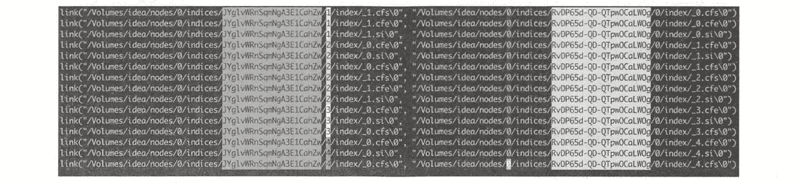

# 《Elasticsearch 源码解析与优化实战》第 17 章：Shrink 原理分析

> 原文：[https://cloud.tencent.com/developer/article/1862410](https://cloud.tencent.com/developer/article/1862410)

# 简介

[官方文档：https://www.elastic.co/guide/en/elasticsearch/reference/master/indices-shrink-index.html](https://www.elastic.co/guide/en/elasticsearch/reference/master/indices-shrink-index.html)

索引分片数量一般在模板中统一定义，在数据规模比较大的索引中，索引分片数一般也大一些，在笔者的集群中设置为 24。同时按天生成新的索引，使用别名关联。但是，并非每天的索引数据量都很大，小数据量的索引同样有较大的分片数。在 ES 中，主节点管理分片是很大的工作量，降低集群整体分片数量可以减少 recovery 时间，减小集群状态的大小。因此，可以使用 Shrink API 缩小索引分片数。当索引缩小完成后，源索引可以删除。

`**Shrink API**`**是**`**ES 5.0**`**之后提供的新功能，其可以缩小主分片数量。但其并不对源索引直接进行缩小操作，而是使用与源索引相同的配置创建一个新索引，仅降低分片数。由于添加新文档时使用对分片数量取余获取目的分片的关系，新索引的主分片数必须是源索引主分片数的因数。**例如，8 个分片可以缩小到 4、2、1 个分片。如果源索引的分片数为素数，则目标索引的分片数只能为 1。

下面举一个例子来分析缩小过程。

# 准备源索引

创建索引: `my_source_index`， 包括 5 个主分片和 1 个副分片，并写入几条测试数据通过下面的命令，将索引标记为只读，且所有分片副本都迁移到名为 node-idea 的节点上。

注意，“所有分片副本”不指索引的全部分片，无论主分片还是副分片，任意一个就可以。分配器也不允许将主副分片分配到同-节点。

```java
curl -XPUT 'localhost: 9200/my_source_index/_settings?pretty' -H 'Content. -Type : application/json' -d'
{
    "settings": {
        "index.number_of_replicas": 0, # 移除源索引的副本
        "index.routing.allocation.require._name": "node-idea", # 将源索引的分片迁移到同一个节点上
        "index.blocks.write": true  # 设置索引为只读模式
    }
}
```

选项`index.blocks.write`设置为 true 来禁止对索引的写操作。但索引的 metadata 可以正常写。

It can take a while to relocate the source index. Progress can be tracked with the[`_cat recovery`API](https://www.elastic.co/guide/en/elasticsearch/reference/master/cat-recovery.html), or the[`cluster health`API](https://www.elastic.co/guide/en/elasticsearch/reference/master/cluster-health.html)can be used to wait until all shards have relocated with the`wait_for_no_relocating_shards`parameter.

# 缩小索引

待分片迁移完毕，我们就可以执行执行 Shrink 操作了:

```java
curl - -XPOST ' localhost: 9200/my_source_index/_shrink/my_target_index?pretty'
-H 'Content-Type: application/json' -d'
{
    "settings": {
        "index.number_of_replicas": 1,
        "index.number_of_shards": 1,  #目标分片数量为原分片数量的因子
        "index.codec": "best_compression" #数据压缩方式
    },
    "aliases": {
        "my_search_indices": []
    }
}
```

以上代码将创建含有一个主分片和一个副分片的目的索引`my_target_index`。

缩小索引需要满足下列要求:

*   **目标索引存在**
*   **索引状态必须是 Green**
*   **原索引主分片数量比目标索引多，且原索引主分片数量是目标索引倍数**
*   **索引中的所有文档在目标索引将会被缩小到一个分片的数量不会超过 `2,147,483,519` ，因为这是一个分片的承受的最大文档数量。**
*   **执行缩小进程的节点必须要有足够的空闲磁盘空间满足原索引的分片能够全部复制迁徙到该节点。**

# Shrink 的工作原理

引用官方手册对 Shrink 工作过程的描述：

*   **以相同配置创建目标索引，但是降低主分片数量**
*   **从源索引的 Lucene 分段创建硬链接到目的索引。如果系统不支持硬链接，那么索引的所有分段都将复制到新索引，将会花费大量时间**
*   **对目标索引执行恢复操作，就像一个关闭的索引重新打开时一样**

## 创建新索引

**使用旧索引的配置创建新索引，只是减少主分片的数量，所有副本都迁移到同一个节点。显然，创建硬链接时，源文件和目标文件必须在同一台主机。**

## 创建硬链接

**从源索引到目的索引创建硬链接。如果操作系统不支持硬链接，则复制 Lucene 分段。**

在 Linux 下通过 strace 命令跟踪硬链接创建过程：

```java
strace -e trace=file -p {pid}
```

Linux 下的 strace 命令用于跟踪系统调用，trace=file 表示只跟踪与文件操作相关的系统调用，关于该命令的完整使用方式请求可参考 man 手册。在 strace 命令的输出结果中，我们能清晰看到内部过程：

<figure class=""></figure>

*   JYglvWRnSqmNgA3E1CahZw 为源索引;
*   RvDP65d-QD-QTpwOCaLWOg 为目的索引;
*   0.cfe、0.si、_0.cfs 类型的文件为 Lucene 编号为 0 的 segment，编号依次类推；

链接过程：从源索引的 shard[0]开始，遍历所有 shard，将所有 segment 链接到目的索引，目的索引的 segment 从 0 开始命名，依次递增。在本例中，由于源索引的 shard[0]没有数据，因此从 shard[ 1]开始链接。

### 为什么一定要硬链接，不使用软链接?

Linux 的文件系统由两部分组成(实际上任何文件系统的基本概念都相似)：inode 和 block。block 用于存储用户数据，inode 用于记录元数据，系统通过 inode 定位唯一的文件。

*   硬链接：文件有相同的 inode 和 block。
*   软链接：文件有独立的 inode 和 block，block 内容为目的文件路径名。

那么为什么一定要硬链接过去呢?从本质上来说，我们需要保证 Shrink 之后，源索引和目的索引是完全独立的，读写和删除都不应该互相影响。**如果软链接过去，删除源索引，则目的索引的数据也会被删除，硬链接则不会。**满足下面条件时操作系统才真正删除文件：

文件被打开的 fd 数量为 0 且硬链接数量为 0。

使用硬链接，删除源索引，只是将文件的硬链接数量减 1，删除源索引和目的索引中的任何一个，都不影响另一个正常读写。

由于使用了硬链接，也因为硬链接的特性带来一些限制：不能交叉文件系统或分区进行硬链接的创建，因为不同分区和文件系统有自己的 inode。

不过，既然都是链接，Shrink 完成后，修改源索引，目的索引会变吗?答案是不会。虽然链接到了源分段，Shrink 期间索引只读，目标索引能看到的只有源索引的当前数据，Shrink 完成后，由于 Lucene 中分段的不变性，“write once”机制保证每个文件都不会被更新。源索引新写入的数据随着 refresh 会生成新分段，而新分段没有链接，在目标索引中是看不到的。如果源索引进行 merge,对源分段执行删除时，只是硬链接数量减 1，目标索引仍然不受影响。因此，**Shrink 完毕后最终的效果就是，两个索引的数据看起来是完全独立的。**

经过链接过程之后，主分片已经就绪，副分片还是空的，通过 recovery 将主分片数据复制到副分片。下面看一下相关实现代码

## 硬链接过程源码分析

硬链接过程在目标索引`my_target_index` 的恢复流程中，入口为 IndexShard#startRecovery，有下列几种类型的 recovery：

*   `EXISTING_STORE`，主分片从 translog 恢复;
*   `PEER`，副分片从主分片远程拉取;
*   `SNAPSHOT`，从快照中恢复;
*   `LOCAL_SHARDS`，从同一个节点的其他分片恢复 Shrink 使用这种恢复类型；

`shrink index` 时的恢复类型为`LOCAL_SHARDS`，执行`storeRecovery.recoverFromLocalShards`。

在`addIndices`中，调用 Lucene 中的`org.apache.lucene.store.HardlinkCopyDirectoryWrapper`实现硬链接。

addIndices 将整个源索引的全部 shard 链接到目标路径：

```java
addIndices (RecoveryState.Index indexRecoveryStats, Directory target, Directory. .. sources)
```

本例中源索引有 5 个分片，sources 值如下：

```java
0 = "(store (mmapfs (/V/ idea/ nodes/0/ indices/-Puacb8gSQG4UAvr -vNopQ/0/index)))"
1 = " (store (mmapfs (/V/idea/ nodes/0/ indices/- Puacb8gSQG4UAvr -vNopQ/1/index)))"
2 = " (store (mmapfs (/V/idea/ nodes/0/ indices/-Puacb8gSQG4UAvr-vN0opQ/2/index)))"
3 = " (store (mmapfs (/V/ idea/ nodes/0/ indices/ -Puacb8gSQG4UAvr-vNopQ/3/ index)))"
4 ="(store (mmapfs (/V/idea/ nodes/0/ indices/-Puacb8gSQG4UAvr-vN0pQ/4/index)))"
```

target 值如下：

```java
store(mmapfs (/Volumes/RamDisk/idea/nodes/0/indices/Dcfi3m9kTW2Dfc2zUjMOoQ/0/index)) 
```