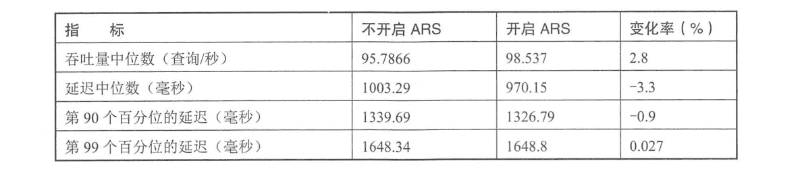
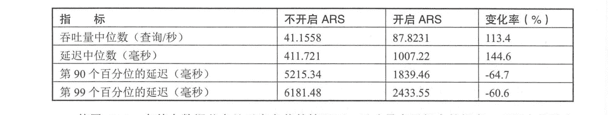

# 《Elasticsearch 源码解析与优化实战》第 19 章：搜索速度优化

> 原文：[https://cloud.tencent.com/developer/article/1845777](https://cloud.tencent.com/developer/article/1845777)

# 简介

本章讨论搜索速度的优化、搜索速度与系统资源、数据索引方式、查询方式等多个方面，下面我们逐一讨论如何优化搜索速度。

# 为文件系统 cache 预留足够的内存

在一般情况下，应用程序的读写都会被操作系统“cache”(除了 direct 方式)，cache 保存在系统物理内存中(线上应该禁用 swap)，命中 cache 可以降低对磁盘的直接访问频率。**搜索很依赖对系统`cache`的命中，如果某个请求需要从磁盘读取数据，则一定会产生相对较高的延迟。应该至少为系统`cache`预留一半的可用物理内存，更大的内存有更高的 cache 命中率。**

# 使用更快的硬件

**写入性能对`CPU`的性能更敏感，而搜索性能在一般情况下更多的是在于`I/O`能力，使用`SSD`会比旋转类存储介质好得多。**尽量避免使用`NFS`等远程文件系统，如果`NFS`比本地存储慢 3 倍，则在搜索场景下响应速度可能会慢 10 倍左右。这可能是因为搜索请求有更多的随机访问。

如果搜索类型属于计算比较多，则可以考虑使用更快的`CPU`。

# 文档模型

**为了让搜索时的成本更低，文档应该合理建模。特别是应该避免`join`操作，嵌套(`nested`)会使查询慢几倍，父子(`parent-child`)关系可能使查询慢数百倍，因此，如果可以通过非规范化(`denormalizing`) 文档来回答相同的问题，则可以显著地提高搜索速度。**

# 预索引|数据

还可以针对某些查询的模式来优化数据的索引方式。例如，如果所有文档都有一个`price`字段，并且大多数查询在一个固定的范围上运行`range`聚合，那么可以通过将范围`“pre-indexing”`到索引中并使用`terms`聚合来加快聚合速度。

例如，文档起初是这样的:

```java
PUT index/type/1
{
    "designation": " spoon",
    "price": 13
}

采用如下的搜索方式:
GET index/_ search
{
    "aggs": {
        "price_ranges": {
            "range": {
                "field": "price",
                "ranges" : {
                    { "to": 10 },
                    { "from": 10, "to": 100 },
                    { "from": 100 }
                }
            }
        }
    }
}
```

那么我们的优化是，在建立索引时对文档进行富化，增加`price_range` 字段，`mapping` 为 `keyword`类型:

```java
PUT index
{
    "mappings": {
        "type": {
            "properties": {
                "price_range": {
                    "type": "keyword"
                }
            }
        }
    }
}

PUT index/type/1
 {
    "designation": "spoon",
    "price": 13,
    "price_range": "10-100"
}
```

接下来，搜索请求可以聚合这个新字段，而不是在 price 字段上运行 range 聚合。

```java
GET index/ search
{
    "aggs": {
        "price_ranges": {
            "terms": {
                "field": "price_range "
            }
        }
    }
}
```

# 字段映射

**有些字段的内容是数值，但并不意味着其总是应该被映射为数值类型。**例如，一些标识符，将它们映射为`keyword`可能会比`integer`或`long`更好。

# 避免使用脚本

**一般来说，应该避免使用脚本。**如果一定要用，则应该优先考虑`painless`和`expressions`。

# 优化日期搜索

**在使用日期范围检索时，使用`now`的查询通常不能缓存，因为匹配到的范围一直在变化。但是，从用户体验的角度来看，切换到一个完整的日期通常是可以接受的，这样可以更好地利用查询缓存。**

例如，有下列查询：

```java
PUT index/type/1
{
    "my date":
    "2016-05-11T16:30:55.328Z"
}

GET index/ search
{
    "query": l
    "constant_ score": {
        "filter": {
            "range": {
                "my_date": {
                    "gte": "now-1h",
                    "lte": "now"
                }
            }
        }
    }
}
```

可以替换成下面的查询方式：

```java
GET index/_ search
{
    "query": {
        "constant_ score": {
            "filter": {
                "range": {
                    "my_date": {
                        "gte": "now-1h/m",
                        "lte": "now/m"
                    }
                }
            }
        }
    }
}
```

在这个例子中，我们将日期四舍五入到分钟，因此如果当前时间是 16:31:29， 那么 range 查询将匹配`my_date`字段的值在 15:31~16:31 之间的所有内容。如果几个用户同时运行一个包含此范围的查询，则查询缓存可以加快查询速度。用于舍入的时间间隔越长，查询缓存就越有帮助，但要注意，太高的舍入也可能损害用户体验。为了能够利用查询缓存，可以很容易将范围分割成一个大的可缓存部分和一个小的不可缓存部分，如下所示。

```java
GET index/_ search
{
    "query": l
        "constant_ score": {
            "filter": {
                "bool": {
                    "should": [
                    {
                        "range": {
                            "my_date": {
                                "gte": "now-1h",
                                "lte": "now-1h/m"
                             }
                         }
                     },          
                     {
                         "range": {
                            "my_date": {
                                "gt": "now-1h/m",
                                "lt": "now/m"
                            }
                        }
                    },
                    {
                        "range": {
                            "my_date": {
                                "gte": "now/m",
                                "lte": "now"
                            }
                        }
                    }
                    ]
                }
            }
        }
    }
}
```

然而，这种做法可能会使查询在某些情况下运行得更慢，因为 bool 查询引入的开销可能会抵销利用查询缓存所节省的开销。

# 为只读索引执行 force-merge

**为不再更新的只读索引执行`force merge`，将`Lucene`索引合并为单个分段，可以提升查询速度。当一个`Lucene`索引存在多个分段时，每个分段会单独执行搜索再将结果合并，将只读索引强制合并为一个`Lucene`分段不仅可以优化搜索过程，对索引恢复速度也有好处。**

基于日期进行轮询的索引的旧数据一般都不会再更新。此前的章节中说过，应该避免持续地写一个固定的索引，直到它巨大无比，而应该按一定的策略，例如，每天生成一个新的索引，然后用别名关联，或者使用索引通配符。这样，可以每天选一个时间点对昨天的索引执行`force-merge`、`Shrink`等操作。

# 预热全局序号 ( global ordinals )

全局序号是一种数据结构，用于在`keyword`字段上运行`terms`聚合。它用一个数值来代表；字段中的字符串值，然后为每一数值分配一个 `bucket`。这需要一个对 `global ordinals` 和`bucket`的构建过程。默认情况下，它们被延迟构建，因为`ES`不知道哪些字段将用于`terms`聚合，哪些字段不会。可以通过配置映射在刷新(`refresh`) 时告诉 ES`预先`加载全局序数：

```java
PUT index
{
    "mappings": {
        "type": { 
            "properties": {
                "foo": {
                    "type": "keyword",
                    "eager_global_ordinals" : true
                }
            }
        }
    }
}
```

# execution hint

terms 聚合有两种不同的机制：

*   通过直接使用字段值来聚合每个桶的数据(`map`)。
*   通过使用字段的全局序号并为每个全局序号分配一个 bucket (`global_ordinals`)。

ES 使用`global_ordinals`作为`keyword` 字段的默认选项，它使用全局序号动态地分配`bucket`，因此内存使用与聚合结果中的字段数量是线性关系。在大部分情况下，这种方式的速度很快。

当查询只会匹配少量文档时，可以考虑使用 map。默认情况下，map 只在脚本上运行聚合时使用，因为它们没有序数。

```java
GET / search
{
    "aggs" : {
        "tags" : {
            "terms" : {
                "field" : "tags",
                "execution_hint": "map"
            }
        }
    }
}
```

# 预热文件系统 cache

如果 ES 主机重启，则文件系统缓存将为空，此时搜索会比较慢。可以使用`index.store.preload`设置，通过指定文件扩展名，显式地告诉操作系统应该将哪些文件加载到内存中。

例如，配置到`elasticsearch.yml`文件中：

```java
index.store.preload: ["nvd"， "dvd"]
```

或者在索引创建时设置：

```java
PUT /my_ index
{
    "settings": {
        " index.store.preload": ["nvd", "dvd"]
    }
}
```

如果文件，系统缓存不够大，则无法保存所有数据，那么为太多文件预加载数据到文件系统缓存中会使搜索速度变慢，应谨慎使用。

# 转换查询表达式

在组合查询中可以通过`bool`过滤器进行 and、or 和 not 的多个逻辑组合检索，这种组合查询中的表达式在下面的情况下可以做等价转换：(A I B) & (C | D) ==> (A & C) | (A & D) | (B & C) | (B & D )

# 调节搜索请求中的 batched_reduce_size

**该字段是搜索请求中的一个参数。默认情况下，聚合操作在协调节点需要等所有的分片都取回结果后才执行，使用`batched_reduce_size`参数可以不等待全部分片返回结果，而是在指定数量的分片返回结果之后就可以先处理一部分(`reduce`)。 这样可以避免协调节点在等待全部结果的过程中占用大量内存，避免极端情况下可能导致的 OOM。**该字段的默认值为 512，从 ES 5.4 开始支持。

# 使用近似聚合

近似聚合以牺牲少量的精确度为代价，大幅提高了执行效率，降低了内存使用。近似聚合的使用方式可以参考官方手册：

*   Percentiles Aggregation ( https://www.elastic.co/guide/en/elasticsearch/ reference/current/search-aggregations-metrics percentile-aggregation.html)
*   Cardinality Aggregation ( https://www.elastic.co/guide/en/elasticsearch/reference/current/search- aggregations-metrics-cardinality-aggregation.html)

# 深度优先还是广度优先

ES 有两种不同的聚合方式：深度优先和广度优先。深度优先是默认设置，先构建完整的树，然后修剪无用节点。大多数情况下深度聚合都能正常工作，但是有些特殊的场景更适合广度优先，先执行第一层聚合，再继续下一层聚合之前会先做修剪，官方有一个例子可以参考：`https://www.elastic.co/guide/cn/elasticsearch/guide/current/_preventing_combinatorial_explosions.html`

# 限制搜索请求的分片数

**一个搜索请求涉及的分片数量越多，协调节点的 CPU 和内存压力就越大。默认情况下，ES 会拒绝超过 1000 个分片的搜索请求。**我们应该更好地组织数据，让搜索请求的分片数更少。如果想调节这个值，则可以通过`action.search.shard count` 配置项进行修改。

**虽然限制搜索的分片数并不能直接提升单个搜索请求的速度，但协调节点的压力会间接影响搜索速度。**例如，占用更多内存会产生更多的 GC 压力，可能导致更多的`stop-the-world`时间等，因此间接影响了协调节点的性能，所以我们仍把它列作本章的一部分。

# 利用自适应副本选择( ARS)提升 ES 响应速度

**为了充分利用计算资源和负载均衡，协调节点将搜索请求轮询转发到分片的每个副本，轮询策略是负载均衡过程中最简单的策略，任何一个负载均衡器都具备这种基础的策略，缺点是不考虑后端实际系统压力和健康水平。**

例如，一个分片的三个副本分布在三个节点上，其中 Node2 可能因为长时间 GC、磁盘 I/O 过高、网络带宽跑满等原因处于忙碌状态，如下图所示。

<figure class=""></figure>

如果搜索请求被转发到副本 2，则会看到相对于其他分片来说，副本 2 有更高的延迟。

*   分片副本 1: 100ms
*   分片副本 2 (degraded): 1350ms
*   分片副本 3: 150ms

由于副本 2 的高延迟，使得整个搜索请求产生长尾效应。

**ES 希望这个过程足够智能，能够将请求路由到其他数据副本，直到该节点恢复到足以处理更多搜索请求的程度。在 ES 中，此过程称为“自适应副本选择”。**

在实现过程中，ES 参考一篇名为 C3 的论文: Cutting Tail Latency in Cloud Data Stores via Adaptive Replica Selection ( https://www.usenix.org/conference/nsdi 15/technical-sessions/presentation/suresh)。这篇论文是为 Cassandra 写的，ES 基于这篇论文的思想做了调整以适合自己的场景。

**ES 的 ARS 实现基于这样 一个公式：对每个搜索请求，将分片的每个副本进行排序，以确定哪个最可能是转发请求的“最佳”副本。与轮询方式向分片的每个副本发送请求不同，ES 选择“最佳”副本并将请求路由到那里。**ARS 公式为:

<figure class=""></figure>

每项含义如下：

*   os(Ss)，节点未完成的搜索请求数;
*   n， 系统中数据节点的数量;
*   R(s)，响应时间的 EWMA (从协调节点上可以看到)，单位为毫秒;
*   q(s)，搜索线程池队列中等待任务数量的 EWMA;
*   μ(s)，数据节点上的搜索服务时间的 EWMA，单位为毫秒。

关于 EWMA 的解释可参考 https://en.wikipedia.org/wiki/Moving_average#Exponential_moving_average。

**通过这些信息我们大致可以评估出分片副本所在节点的压力和健康程度，这就可以让我们选出一个能够更快返回搜索请求的节点。**在上面的例子中，请求将被转发到分片副本 1 或分片副本 3。

ARS 从 6.1 版本开始支持，但是默认关闭，可以通过下面的命令动态开启：

```java
PUT /_cluster/settings
{
    "transient": {
        "cluster.routing.use_adaptive_replica_selection": true
    }
}
```

从 ES 7.0 开始，ARS 将默认开启。官方进行了多种场景的基准测试，包括某个数据节点处于高负载状态和非负载状态，测试使用 5 节点的集群，单个索引，5 个主分片，每个主分片有一个副分片。将搜索请求发送到单个协调节点。没有模拟某个节点高负载的情况下(测试前节点都处于空闲)，指标如下表所示。

<figure class=""></figure>

可见，即使集群的负载是均匀的，ARS 仍然可以改善吞吐量和响应延迟。模拟单个节点处于高负载下的情况，指标如下表所示。

<figure class=""></figure>

使用 ARS，在某个数据节点处于高负载的情况下，吞吐量有了很大的提高。延迟中位数有所增加是预料之中的，为了绕开高负载的节点，稍微增加了无压力节点的负载，从而增加了延迟。