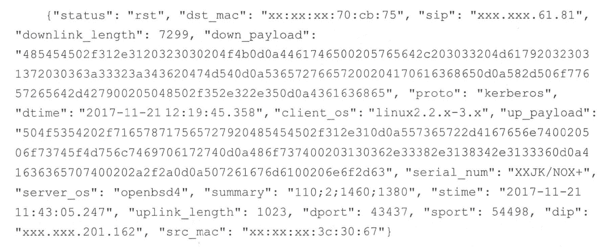

# 《Elasticsearch 源码解析与优化实战》第 20 章：磁盘使用量优化

> 原文：[https://cloud.tencent.com/developer/article/1853294](https://cloud.tencent.com/developer/article/1853294)

# 简介

优化磁盘使用量与建立索引时的映射参数和索引元数据字段密切相关，在介绍具体的优化措施之前，我们先介绍这两方面的基础知识。

# 预备知识

## 元数据字段

每个文档都有与其相关的元数据，比如`_index`、`_type` 和`_id`。 当创建映射类型时，可以定制其中一些元数据字段。 下面列出了与本文相关的元数据字段，完整的介绍请参考官方手册：[https://www.elastic.co/guide/en/elasticsearch/reference/current/mapping-fields.html](https://www.elastic.co/guide/en/elasticsearch/reference/current/mapping-fields.html)

*   _source：原始的 JSON 文档数据
*   _all：索引所有其他字段值的一种通用字段，这个字段中包含了所有其他字段的值。允许在搜索的时候不指定特定的字段名，意味着“从全部字段中搜索”，例如：http://localhost:9200/website/_search?q=keyword

_all 字段是一个全文字段，有自己的分析器。从 ES 6.0 开始该字段被禁用。之前的版本默认启用，但字段的 store 属性为 false，因此它不能被查询后取回显示。

## 索引映射参数

索引创建时可以设置很多映射参数，各种映射参数的详细说明可参考官方手册：[https://www.elastic.co/guide/en/elasticsearch/reference/master/mapping-params.html](https://www.elastic.co/guide/en/elasticsearch/reference/master/mapping-params.html)，这里只介绍与本文相关的参数。

*   `index`：控制字段值是否被索引。它可以设置为 true 或 false，默认为 true。未被索引的字段不会被查询到，但是可以聚合。除非禁用 doc_values。
*   `doc_values`：默认情况下，大多数字段都被索引，这使得它们可以搜索。倒排索引根据 term 找到文档列表，然后获取文档原始内容。但是排序和聚合，以及从脚本中访问某个字段值，需要不同的数据访问模式，它们不仅需要根据 term 找到文档，还要获取文档中字段的值。这些值需要单独存储。doc_values 就是用来存储这些字段值的。它是一种存储在磁盘上的列式存储，在文档索引时构建，这使得上述数据访问模式成为可能。它们以面向列的方式存储与 _source 相同的值，这使得排序和聚合效率更高。几乎所有字段类型都支持`doc_values`，但被分析(analyzed)的字符串字段除外(即 text 类型字符串)。`doc_values` 默认启用。
*   `store`：默认情况下，字段值会被索引使它们能搜索，但它们不会被存储( stored)。意味着可以通过这个字段查询，但不能取回它的原始值。

但这没有关系。因为字段值已经是 _source 字段的一部分， 它是被默认存储的。如果只想取回一个字段或少部分字段的值，而不是整个 _source，则可以通过 source filtering 达到目的。

在某些情况下，存储字段是有意义的。例如，如果有一个包含标题、日期和非常多的内容字段的文档，则可能希望只检索标题和日期，而不需要从大型 source 字段中提取这些字段：

例如，我们创建一个索引：

```java
PUT my_index
{
    "mappings": {
        "doc": {
            "properties": {
                "title": {
                    "type" :"text" ,
                    "store": true 
                }
                "content":{
                    "type": "text" 
                }
            }
        }
    }
}

然后写入一条数据:
PUT my_index/_doc/1
{
    "title":"Some short title",
    "content": "A very long content field.. ."
}

下面的搜索将返回 title 字段的值:
GET my_index/_search
{
    "stored fields": { "title" }
}
```

还有一种情况可能用到存储字段，就是不在`_source` 中出现的字段(例如，`copy_to`字段)。

`doc_values` 和存储字段("stored":ture) 都属于正排内容，两者的设计初衷不同。

`stored fields` 被设计为优化存储，`doc_values` 被设计为快速访问字段值。搜索可能会访问很多`doc values` 中的字段，所以必须能够快速访问，我们将`doc_values` 用于聚合、排序，以及脚本中。现在，ES 中的许多特性都会自动使用`doc_values`。

另一方面，存储字段仅用于返回前几个最匹配文档的字段值，默认情况下 ES 只将其用于这种情况，解压存储字段，将其发送给客户端。为少量文档获取存储字段还好。它不能在查询的时候使用，否则会让查询变得非常慢。脚本中可以访问存储字段，但最好不要那么做。

# 优化措施

## 禁用对你来说不需要的特性

默认情况下，ES 为大多数的字段建立索引，并添加到`doc_values`， 以便使之可以被搜索和聚合。但是有时候不需要通过某些字段过滤，例如，有一个名为 foo 的数值类型字段，需要运行直方图，但不需要在这个字段上过滤，那么可以不索引这个字段:

```java
PUT index
{
    "mappings": {
        "type": {
            "properties": {
                "foo": {
                    "type": "integer",
                    "index": false
                }
            }
        }
    }
}
```

`text`类型的字段会在索引中存储归一因子(normalization factors)， 以便对文档进行评分，如果只需要在文本字段上进行匹配，而不关心生成的得分，则可以配置 ES 不将 norms 写入索引：

```java
PUT index
{
    "mappings": {
        "type": {
            "properties": {
                "foo": {
                    "type": "text",
                    "norms": false 
                }
            }
        }
    }
}
```

`text`类型的字段默认情况下也在索引中存储频率和位置。频率用于计算得分，位置用于执行短语(phrase) 查询。如果不需要运行短语查询，则可以告诉 ES 不索引位置：

```java
PUT index
{
    "mappings": {
        "type": {
            "properties": {
                "foo": {
                    "type": "text",
                    "index_options": "freqs "
                }
            }
        }
    }
}
```

在`text`类型的字段上，`index_options` 的默认值为`positions`。`index_options` 参数用于控制添加到倒排索引中的信息。

`freqs`文档编号和词频被索引，词频用于为搜索评分，重复出现的词条比只出现一次的词条评分更高。`positions` 文档编号、词频和位置被索引。位置被用于邻近查询(proximity queries)和短语查询( phrase queries )。

完整的`index_options` 选项请参考官方手册：[https://www.elastic.co/guide/en/elasticsearch/reference/master/index-options.html](https://www.elastic.co/guide/en/elasticsearch/reference/master/index-options.html)。此外，如果也不关心评分，则可以将 ES 配置为只为每个 term 索引匹配的文档。仍然可以在这个字段上搜索，但是短语查询会出现错误，评分将假定在每个文档中只出现一次词汇。

```java
PUT index
{
    "mappings": {
        "type": {
            "properties": {
                "foo": {
                    "type": "text",
                    "norms": false,
                    "index_options": "freqs"
                }
            }
        }
    }
}
```

## 禁用 doc values

所有支持 doc value 的字段都默认启用了 doc value。如果确定不需要对字段进行排序或聚合，或者从脚本访问字段值，则可以禁用 doc value 以节省磁盘空间：

```java
PUT my_ index
{
    "mappings": {
        "_doc": {
            "properties": {
                "status_ code": {
                    "type": "keyword"
                    "doc_ values": false
                }
            }
        }
    }
}
```

## 不要使用默认的动态字符串映射

默认的动态字符串映射会把字符串类型的字段同时索引为`text`和`keyword`。如果只需要其中之一，则显然是一种浪费。通常，id 字段只需作为 keyword 类型进行索引，而 body 字段只需作为 text 类型进行索引。

要禁用默认的动态字符串映射，则可以显式地指定字段类型，或者在动态模板中指定将字符串映射为 text 或 keyword。下例将字符串字段映射为 keyword：

```java
PUT index
{
    "mappings": {
        "type": {
            "dynamic_ templates": [
            {
                "strings": {
                    "match_mapping_type": "string",
                    "mapping": {
                        "type": "keyword"
                    }
                }
            }
        }
    }
}
```

## 观察分片大小

较大的分片可以更有效地存储数据。为了增加分片大小，可以在创建索引的时候设置较少的主分片数量，或者使用 shrinkAPI 来修改现有索引的主分片数量。但是较大的分片也有缺点，例如，较长的索引恢复时间。

## 禁用 source

`_source`字段存储文档的原始内容。如果不需要访问它，则可以将其禁用。但是，需要访问`_source` 的 API 将无法使用，至少包括下列情况：

*   `update、update_ by_ query、 reindex`
*   高亮搜索
*   重建索引(包括更新`mapping`、分词器，或者集群跨大版本升级可能会用到)
*   调试聚合查询功能，需要对比原始数据

## 使用 best_compression

`_source`和设置为"store": true 的字段占用磁盘空间都比较多。默认情况下，它们都是被压缩存储的。默认的压缩算法为`LZ4`，可以通过使用`best_compression`来执行压缩比更高的算法: `DEFLATE`。 但这会占用更多的 CPU 资源。

```java
PUT index 
{
    "settings": {
        "index": {
            "codec": "best_compression"
         }
     }
 } 
```

## Fource Merge

一个 ES 索引由若干分片组成，一个分片有若干`Lucene`分段，较大的`Lucene`分段可以更有效地存储数据。

使用`_forcemerge` API 来对分段执行合并操作，通常，我们将分段合并为一个单个的分段：max_num_segments=1。

## Shrink Index

`Shrink API`允许减少索引的分片数量，结合上面的`Force Merge API`，可以显著减少索引的分片和 Lucene 分段数量。

## 数值类型长度够用就好

为数值类型选择的字段类型也可能会对磁盘使用空间产生较大影响，整型可以选择`byte、short、integer、long`， 浮点型可以选择`scaled_float、float、double、half_float`，每个数据类型的字节长度是不同的，为业务选择够用的最小数据类型，可以节省磁盘空间。

## 使用索引排序来排列类似的文档

当 ES 存储`_source`时，它同时压缩多个文档以提高整体压缩比。例如，文档共享相同的字段名，或者它们共享一些字段值，特别是在具有低基数或 zipfian 分布(参考 https://en.wikipedia.org/wiki/Zipf%27s_law) 的字段上。

默认情况下，文档按照添加到索引中的顺序压缩在一起。如果启用了索引排序，那么它们将按排序顺序压缩。对具有相似结构、字段和值的文档进行排序可以提高压缩比。

关于索引排序的详细内容请参考官方手册: https://www.elastic.co/guide/en/elasticsearch/reference/master/index-modules-index-sorting.html。

## 在文档中以相同的顺序放置字段

由于多个文档被压缩成块，如果字段总是以相同的顺序出现，那么在这些 source 文档中可以找到更长的重复字符串的可能性更大。

# 测试数据

下面是在笔者的环境中，使用测试数据调整不同索引方式的测试结论。测试数据为单个文档十几个字段，大小为 800 字节左右。数据样本如下:

<figure class=""></figure>

在其他条件不变的情况下，调整单个参数，测试结果如下：

*   禁用`_source`， 空间占用量下降 30%左右
*   禁用`doc values`，空间占用量下降 10%左右
*   压缩算法将 LZ4 改为 Deflate，空间占用量可以下降 15%~25%

对于相似结构的数据，本文的测试结果可作一定参考，实际业务最好使用自己的样本数据进行压力测试以获取准确的结果。