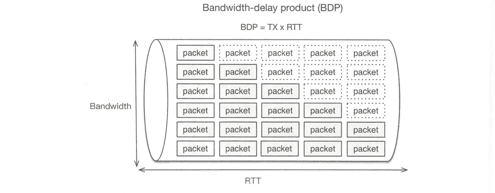

# 《Elasticsearch 源码解析与优化实战》第 21 章：综合应用实践

> 原文：[https://cloud.tencent.com/developer/article/1853295](https://cloud.tencent.com/developer/article/1853295)

# 简介

本章回答 ES 应该怎么用的问题。ES 被设计得简单易用，容易上手，如果只是把它当作黑盒来用，不了解内部原理，甚至没有一定的基础知识，当数据和节点规模达到一定程度的时候会面临许多问题。本章就重点问题给出使用和部署建议。

# 集群层

## 规划集群规模

在部署一个新集群时，应该根据多方面的情况评估需要多大的集群规模来支撑业务。这需要一些基础的测试数据，包括在特定的硬件下，特定业务数据样本的写入性能和搜索性能。然后根据具体业务情况来评估初始集群大小，这些信息包括：

*   数据总量，每天的增量
*   查询类型和搜索并发，QPS
*   SLA 级别

另一方面，需要控制最大集群规模和数据总量，参考下列两个限制条件：

*   节点总数不应该太多，一般来说，最大集群规模最好控制在 100 个节点左右。我们曾经测试过上千个节点集群，在这种规模下，节点间的连接数和通信量倍增，主节点管理压力比较大。
*   单个分片不要超过 50GB，最大集群分片总数控制在几十万的级别。太多分片同样增加了主节点的管理负担，而且集群重启恢复时间会很长。

建议为集群配置较好的硬件，而不是普通的 PC，搜索对 CPU、内存、磁盘的性能要求都很高，要达到比较低的延迟就需要较好的硬件资源。另外，如果使用不同配置的服务器混合部署，则搜索速度可能会取决于最慢的那个节点，产生长尾效应。

## 单节点还是多节点部署

ES 不建议为 JVM 配置超过 32GB 的内存，超过 32GB 时，Java 内存指针压缩失效，浪费一些内存，降低了 CPU 性能，GC 压力也较大。因此推荐设置为 31GB：-Xmx31g -Xms31g

确保堆内存最小值(Xms)与最大值(Xmx)大小相同，防止程序在运行时动态改变堆内存大小，这是很耗系统资源的过程。

当物理主机内存在 64GB 以上，并且拥有多个数据盘，不做 raid 的情况下，部署 ES 节点时有多种选择：

*   部署单个节点，JVM 内存配置不超过 32GB， 配置全部数据盘。这种部署模式的缺点是多余的物理内存只能被 cache 使用，而且只要存在一个坏盘，节点重启会无法启动。.
*   部署单个节点，JVM 内存配置超过 32GB，配置全部数据盘。接受指针压缩失效和更长时间的 GC 等负面影响。
*   有多少个数据盘就部署多少个节点，每个节点配置单个数据路径。优点是可以统一配置，缺点是节点数较多，集群管理负担大，只适用于集群规模较小的场景。
*   使用内存大小除以 64GB 来确定要部署的节点数，每个节点配置一部分数据盘，优点是利用率最高，缺点是部署复杂。

官方的建议是方案 4，但是为了管理和维护的简便，也可以使用方案 1 和 3。这两种部署模式在我们的集群中都在使用，集群规模较小时可以考虑使用多节点方式部署，例如，只有 3 台物理机。当集群规模较大时，建议单节点方式部署，例如，物理机达到 100 台以上。

## 移除节点

当由于坏盘、维护等故障需要下线一个节点时，我们需要先将该节点的数据迁移，这可以通过分配过滤器实现。例如，我们将 node-1 下线：

```java
PUT _cluster/settings
{
    "transient" : {
        "cluster.routing.allocation.exclude._name" : "node-1"
    }
}

PUT _cluster/settings
{
  "transient": {
    "cluster.routing.allocation.exclude._ip": "10.3.18.136"
  }
}
```

执行命令后，分片开始迁移，我们可以通过`_cat/shard API`来查看该节点的分片是否迁移完毕。当节点维护完毕，重新上线之后，需要取消排除设置，以便后续的分片可以分配到 node-1 节点上。

```java
PUT _cluster/settings 
{
    "transient": { 
        "cluster.routing.allocation.exclude.name":"" 
    }
}
```

完整的分配过滤器使用方式请参考官方手册: [http://www.elastic.co/guide/en/elasticsearch/ reference/current/allocation-filtering.html。](https://www.elastic.co/guide/en/elasticsearch/reference/current/allocation-filtering.html)

## 独立部署主节点

将主节点和数据节点分离部署最大的好处是 Master 切换过程可以迅速完成，有机会跳过 gateway 和分片重新分配的过程。例如，有 3 台具备 Master 资格的节点独立部署，然后关闭当前活跃的主节点，新主当选后由于内存中持有最新的集群状态，因此可以跳过 gateway 的恢复过程，并且由于主节点没有存储数据，所以旧的 Master 离线不会产生未分配状态的分片。新主当选后集群状态可以迅速变为 Green。

# 节点层

## 控制线程池的队列大小

不要为 bulk 和 search 分配过大的队列，队列并非越大越好，队列缓存的数据越多，GC 压力越大，默认的队列大小基本够用了，即使在压力测试的场景中，默认队列大小也足以支持。

除非在一些特别的情况下，例如，每个请求的数据量都非常小，可能需要增加队列大小。但是我们推荐写数据时组合较大的 bulk 请求。

## 为系统 cache 保留一半物理内存

搜索操作很依赖对系统 cache 的命中，标准的建议是把 50%的可用内存作为 ES 的堆内存，为 Lucene 保留剩下的 50%，用作系统 cache。

# 系统层

## 关闭 swap

在个人 PC 上，交换分区或许有用，如果物理内存不够，则交换分区可以让系统缓慢运行。但是在服务器系统上，无论物理内存多么小，哪怕只有 1GB，都应该关闭交换分区。当服务程序在交换分区上缓慢运行时，往往会产生更多不可预期的错误，因此当一个申请内存的操作如果真的遇到物理内存不足时，宁可让它直接失败。

一般在安装操作系统的时候直接关闭交换分区，或者通过 swapoff 命令来关闭。

## 配置 Linux OOM Killer

现在讨论的 OOM 并非 JVM 的 OOM，而是 Linux 操作系统的 OOM。在 Linux 下，进程申请的内存并不会立刻为进程分配真实大小的内存，因为进程申请的内存不一定全部使用，内核在利用这些空闲内存时采取过度分配的策略,假如物理内存为 1GB，则两个进程都可以申请 1GB 的内存，这超过了系统的实际内存大小。当应用程序实际消耗完内存的时候，怎么办?系统需要“杀掉”一些进程来保障系统正常运行。这就触发了 OOM Killer，通过一些策略给每个进程打分，根据分值高低决定“杀掉"哪些进程。默认情况下，占用内存最多的进程被“杀掉”。

如果 ES 与其他服务混合部署，当系统产生 OOM 的时候，ES 有可能会无辜被“杀”。为了避免这种情况，我们可以在用户态调节一些进程参数来让某些进程不容易被 OOM Killer “杀掉”。例如，我们不希望 ES 进程被“杀”，可以设置进程的`oom_score_adj` 参数为-17 (越小越不容易被杀)：

```java
$jps
1849 Elasticsearch
$cat /proc/1849/oom_score_adj
0
$sudo echo -17 > /proc/1849/oom_score_adj
```

可以将这个信息写到 ES 的启动脚本中自动执行。

## 优化内核参数

在生产环境上，我们可以根据自己的场景调节内核参数，让搜索服务更有效率地运行。例如，ES 集群中的节点一般处于同一个子网，也就是在同一个局域网，Linux 默认的 TCP 选项不一定完全合适，因为它需要考虑在互联网上传输时可能出现的更大的延迟和丢包率。因此我们可以调节一些 TCP 选项，让 TCP 协议在局域网上更高效。

调节内核参数可以通过两种方式：

*   临时设置，系统重启后失效。通过 sysctl -W 来设置，例如: sysctl -w net.ipv4.tcp_timestamps=1，命令执行后该参数立即生效。
*   永久设置，将参数写入配置文件/etc/sysctl.conf， 然后执行 sysctl -p 使其生效。

可以通过 sysctl -A 配合 grep 查看某个参数的当前值。

下面给出一些比较通用的内核参数设置建议，这些参数的默认值以 CentOS7.2 为参考，在其他系统上可能会有些差异。

**1\. TCP 相关参数**

```java
net.ipv4.tcp_syn_retries 
```

默认值为 6，参考值为 2。主机作为客户端，对外发起 TCP 连接时，即三次握手的第一步，内核发送 SYN 报文的重试次数，超过这个次数后放弃连接。内网环境通信良好，因此可以适度降低此值。

```java
net.ipv4.tcp_synack_retries
```

默认值为 5，参考值为 2。主机作为服务端，接受 TCP 连接时，在三次握手的第二步，向客户端发送 SYN+ACK 报文的重试次数，超过这个次数后放弃连接。内网环境中可适度降低此值。

```java
net.ipv4.tcp_timestamps
```

默认值为 1，参考值为 1。是否开启时间戳，开启后可以更精确地计算 RTT，一些其他特性也依赖时间戳字段。

```java
net.ipv4.tcp_tw_reuse
```

默认值为 0，建议值为 1。是否允许将处于 TIME_WAIT 状态的 socket 用于新的 TCP 连接。这对于降低 TIME_WAIT 数据很有效。该参数只有在开启`tcp_timestamps` 的情况下才会生效。

```java
net.ipv4.tcp_tw_recycle
```

默认值为 0，参考值为 0。是否开启 TIME_WAIT 套接字的快速回收，这是比 tcp_tw_reuse 更激进的一种方式，它同样依赖 tcp_ timestamps 选项。强烈建议不要开启 tcp_tw_recycle， 原因有两点,一是 TIME_WAIT 是十分必要的状态,避免关闭中的连接与新建连接之间的数据混淆，二是 tcp_tw_recycle 选项在 NAT 环境下会导致一些新建连接被拒绝，因为 NAT 下每个主机存在时差，这体现在套接字中的时间戳字段，服务端会发现某个 IP.上的本应递增的时间戳出现降低的情况，时间戳相对降低的报文将被丢弃。

```java
net.core.somaxconn
```

默认值为 128，参考值为 2048。定义了系统中每一个端口上最大的监听队列的长度。当服务端监听了某个端口时，操作系统内部完成对客户端连接请求的三次握手。这些已建立的连接存储在一个队列中，等待 accept 调用取走。本选项就是定义这个队列的长度。该队列实际大小取决于 listen 调用传入的第二个参数: backlog 和本选项的最小值: min(backlog,somaxconn)。 ES 需要建立许多连接，当集群节点数比较大，集群完全重启时可能会在瞬间建立大量连接，默认的连接队列长度可能不够用，因此适当提高此值。

```java
net.ipv4.tcp_max_syn_backlog
```

默认值为 128，参考值为 8192。内核会服务端的连接建立两个队列：

*   已完成三次握手，连接已建立，等待 accept 的队列，全局长度由 somaxconn 定义。
*   三次握手执行到第二步，等待客户端返回 ACK，这些未完成的连接单独放到一个队列中，由 tcp_max_syn_backlog 定义队列大小。

由于可能会有较多的连接数，我们适度增加“未完成连接”的队列大小。.

```java
net.ipv4.tcp_max_tw_buckets
```

默认值为 4096，参考值为 180000。定义系统同时保持 TIME_WAIT 套接字的最大数量，如果超过这个数，则 TIME_WAIT 套接字将立刻被清除并打印警告信息。如果系统被 TIME_WAIT 过多问题困扰，则可以调节 tcp_max_tw_buckets.tcp_tw_reuse 、tcp_timestamps 三个选项来缓解。TIME_WAIT 状态产生在 TCP 会话关闭时主动关闭的一端，如果想从根本上解决问题，则让客户端主动关闭连接，而非服务端。

```java
net.ipv4.tcp_max_orphans
```

默认值为 4096，参考值为 262144。定义最大孤儿套接字(未附加到任何用户文件句柄的套接字)数量。如果孤儿套接字数量超过此值，则这些连接立即“reset”， 并显示警告信息。该值可以简单地抵御 DOS 攻击，但不能通过降低此值来抵御 DOS。为了应对高负载，应该提高此值。

**2\. TCP 的接收窗口(RWND)**

TCP 采用两个基本原则决定何时发送及发送多少数据：

*   流量控制，为了确保接收者可以接收数据。
*   拥塞控制，为了管理网络带宽。

流量控制通过在接收方指定接收窗口大小来实现。接收窗口用于接收端告诉发送端，自己还有多大的缓冲区可以接收数据。发送端参考这个值来发送数据，就不会导致客户端处理不过来。

接收窗口的大小可以通过内核参数来调整，其理想值是 BDP ( bandwidth-delay product)：服务端可以发出的未被客户端确认的数据量，也就是在网络上缓存的数据量。

网络连接通常以管道为模型，BDP 是带宽与 RTT 的乘积，表示需要多少数据填充管道。下图展示了 BDP 的基本概念。

<figure class=""></figure>

例如，在千兆的网络上，RTT 为 10 毫秒，那么 BDP= (1000/8) X0.01s=1.25MB。 在这种情况下，如果想最大限度地提升 TCP 吞吐量，则 RWND 大小不应小于 1.25MB。

可以通过下面的选项调整 RWND：

```java
net.ipv4.tcp_rmem = <MIN> <DEFAULT> <MAX>
```

默认情况下，系统会在最大值和最小值之间自动调整缓冲区大小，是否自动调整通过 tcp_moderate_rcvbuf 选项来决定。在开启缓冲自动调整的情况下，可以把最大值设置为 BDP。

TCP 使用 2 个字节记录窗口大小，因此最大值为 64KB， 如果超过这个值，则需要使用 tcp_window_scaling 机制，通过下面的设置开启(默认启用)：

```java
net.ipv4.tcp_window_scaling = 1
```

RWND 和 CWND 可能是让系统达到最大吞吐量的两个限制因素，接下来我们讨论 CWND。

**3\. TCP 的拥塞窗口(CWND)**

TCP 的滑动窗口机制依据接收端的能力来进行流控，并不能感知网络延迟等网络因素。拥塞控制机制会评估网络能承受的负荷，避免过量数据发送到网络中，拥塞程度会涉及主机、路由器等网络上的所有因素。

拥塞控制由发送方实现，发送方会将它传输的数据量限制为 CWND 和 RWND 的最小值。CWND 会随着时间和对端的 ACK 增长，如果检测到网络拥塞，则缩小 CWND。拥塞控制主要有 4 种算法：慢启动、拥塞避免、快速重传和快速恢复。

慢启动的意思是对于刚建立的连接，开始发送数据时，一点点提速，而不是一下子使用很大的带宽。慢启动是指数上升的过程，直到 CWND≥ssthresh,进入拥塞避免算法。

本节我们讨论的问题就是调节初始拥塞窗口(INITCWND)的大小。适度增加 INITCWND 可以降低 HTTP 响应延迟，可以参考 Google 的论文: An Arygument for Increasing TCP's Initial Congestion Window。

例如，HTTP 要返回的内容为 20K，MSS 的大小为 1460，整个内容需要传送 15 个 MSS。当 INITCWND 为 3 时，服务端先发送 3 个 MSS，1460X3-4380 字节，待客户端 ACK 后，根据指数增加算法，第二次发送 9 个 MSS，1460X9=13140 字节，第三次发送 3 个 MSS 的剩余字节。整个传输过程经过了 3 次 RTT。如果 INITCWND 设置为 15，则只需要一次 RTT 就可以完成传输。

在 Linux 2.6.39 版本之前，INITCWND 值根据 MSS 值来计算，参考 RFC3390: http://www.rfe-editor.org/f/rfc3390.txt。以太网的 MSS 大小一般是 1460，因此 INITCWND 为 3,这个初始值比较小。从 2.6.39 版本及之后，采取了 Google 的建议，把 INITCWND 调到了 10， 参考：https://kereelnewvbies.org/Linux_2_6_39#head-1d11935223b203d28a660417627514973de4e218

如果系统上的 INITCWND 低于 10，可以使用 ip 命令调整。调节和测试 INITCWND 的具体方法可以参考: htps://www.cdnplanet.com/blog/une tcp-initcwnd- for-optimum-performance/

**4\. vm 相关参数**

文件的读和写操作都会经过操作系统的 cache，读缓存是比较简单的，而写缓存相对复杂。在一般情况下，写文件的数据先到系统缓存(page cache)，再由系统定期异步地刷入磁盘，这些存储于 pagecache 中尚未刷盘的数据称为脏数据(或者脏页 dirtypage)。写缓存可以提升 I/O 速度，但存在数据丢失的风险。例如，在尚未刷盘的时候主机断电。

系统当前 page cache 信息可以通过/proc/meminfo 文件查看。下面我们讨论一下写缓存的细节和控制策略。

从 page cache 刷到磁盘有以下三种时机：

*   可用物理内存低于特定阈值时，为了给系统腾出空闲内存;
*   脏页驻留时间超过特定阈值时，为了避免脏页无限期驻留内存;
*   被用户的 sync()或 fsync()触发。

由系统执行的刷盘有两种写入策略：

*   异步执行刷盘，不阻塞用户 I/O;
*   同步执行刷盘，用户 I/O 被阻塞，直到脏页低于某个阈值。

在一般情况下，系统先执行第一种策略，当脏页数据量过大，异步执行来不及完成刷盘时，切换到同步方式。我们可以通过内核参数调整脏数据的刷盘阈值：

*   `vm.dirty_background_ratio`, 默认值为 10。该参数定义了一个百分比。当内存中的脏数据超过这个百分比后，系统使用异步方式刷盘。
*   `vm.dirty_ratio`， 默认值为 30。同样定义了一个百分比，当内存中的脏数据超过这个百分比后，系统使用同步方式刷盘，写请求被阻塞，直到脏数据低于`dirty_ratio`。 如果还高于`dirty_background_ratio`， 则切换到异步方式刷盘。因此`dirty_ratio` 应高于`dirty_background_ratio`。

除了通过百分比控制，还可以指定字节大小，类似的参数有：

```java
dirty_background_bytes
dirty_bytes
```

*   `vm.dirty_expire_centisecs`， 默认值为 3000 (30 秒)，单位为百分之 1 秒，定义脏数据的过期时间，超过这个时间后，脏数据被异步刷盘。
*   `vm.dirty_writeback_centisecs`，默认值为 500 (5 秒)，单位为百分之 1 秒，系统周期性地启动线程来检查是否需要刷盘，该选项定义这个间隔时间。

可以通过下面的命令查看系统当前的脏页数量：

```java
cat /proc/vmstat | egrep "dirty Iwriteback"
nr_dirty 951
nr_writeback 0
nr_writeback_temp 0
```

输出显示有 951 个脏页等待写到磁盘。默认情况下每页大小为 4KB。另外，也可以在`/proc/meminfo`文件中看到这些信息。

如果数据安全性要求没有那么高，想要多“cache”一些数据，让读取更容易命中，则可以增加脏数据占比和过期时间：

```java
vm.dirty_background_ratio = 30
vm.dirty_ratio = 60
vm.dirty_expire_centisecs = 6000
```

反之则可以降低它们。如果只希望写入过程不要被系统的同步刷盘策略影响，则可以让系统多容纳脏数据，但早一些触发异步刷盘。这样也可以让 I/O 更平滑：

```java
vm.dirty_background_ratio = 5
vm.dirty_ratio = 60 
```

**5\. 禁用透明大页(Transparent Hugepages)**

透明大页是 Linux 的一个内核特性，它通过更有效地使用处理器的内存映射硬件来提高性能，默认情况下是启用的。禁用透明大页能略微提升程序性能，但是也可能对程序产生负面影响，甚至是严重的内存泄漏。为了避免这些问题，我们应该禁用它(许多项目都建议禁用透明大页，例如，MongoDB、 Oracle)。 可以通过下面的命令检查其是否开启：

```java
cat/sys/kernel/mm/transparent_hugepage/enabled
[always] madvise never
```

always 代表开启，通过下面的命令将其禁用( 系统重启后失效)：

```java
echo never | sudo tee /sys/kernel/mm/transparent_hugepage/enabled
```

关于透明大页对应用程序的具体影响可以参考一篇分 析文章: htp://blog.nelhage.com/post/transparent-hugepages/

更多的内核参数信息可以参考 htps:/ww.kermel.org/oc/Documnentation/networking/ip-sysctl.txt 和 https://www.kernel.org/doc/Documentation/sysctl/

# 索引层

## 使用全局模板

从 ES 5.x 开始，索引级别的配置需要写到模板中，而不是 elasticsearch.yml 配置文件，但是我们需要一些索引级别的全局设置信息，例如，translog 的刷盘方式等，因此我们可以将这些设置编写到一个模板中，并让这个模板匹配全部索引“*”， 这个模板我们称为全局模板，例如:

```java
{
    "template": "*",
    "order" : 0,
    "settings": {
        "index.number_of_replicas" : "1",
        "index.number_of_shards" : "24"
    }
}
```

order 为 0 代表该模板有最小的优先级。当索引创建时，ES 判断都匹配到哪些模板，如果匹配到多个模板，则将模板中的参数进行合并。当遇到冲突的设置项时，根据模板优先级 orde 来决定谁的配置会生效。我们为全局模板设置最低的优先级，任何其他索引自定义的模板都可以覆盖它的设置。

## 索引轮转

如果有一个索引每天都有新增内容，那么不要让这个索引持续增大，建议使用日期等规则按一定频率生成索引。同时将索引设置写入模板，让模板匹配这一系列的索引， 还可以为索引生成一个别名关联部分索引。我们一般按天生成索引，例如，要新增一个名为 dns_log 的索引，我们先创建模板，在模板中描述该索引的设置和 mapping 信息：

```java
{
    "template": "dns_log-*",
    "settings": {
        "index. refresh_interval": "120s"
     },
    "mappings": {
        "dns_log": {
            "dynamic": false,
            "properties": {
                "field1": { "type": "text"},
                "field2": { "type": "integer", "doc_values": false }
            }
        }
    }
}
```

该模块会匹配 dns_log-*规则 的索引，对匹配规则的索引应用模板设置。写入程序每天生成一个索引，例如，dns_ log20180614。在该索引中只写入当天的数据。在搜索时，可以使用索引前缀 dns_log-*进行搜索。当需要删除旧数据时，可以按日期删除索引的旧数据，删除索引会立即删除磁盘文件，释放存储空间。而如果不这么做，只删除部分 doc，则依赖 Lucene 分段的合并过程才能释放空间。

## 避免热索引分片不均

默认情况下，ES 的分片均衡策略是尽量保持各个节点分片数量大致相同。但是当集群扩容时，新加入集群的节点没有分片，此时新创建的索引分片会集中在新节点上，这导致新节点拥有太多热点数据，该节点可能会面临巨大的写入压力。因此，对于一个索引的全部分片，我们需要控制单个节点上存储的该索引的分片总数，使索引分片在节点上分布得更均匀一些。

例如，10 个节点的集群，索引主分片数为 5，副本数量为 1，那么平均下来每个节点应该

有(5X2) /10=1 个分片，考虑到节点故障、分片迁移的情况，可以设置节点分片总数为 2:

```java
curl -X PUT http://127.0.0.1:9200/myindex/_settings -d '{
    "index": { "routing.allocation.total_shards_per_node" : "2" }
}'
```

通常，我们会把`index.routing,allocation.total_shards_per_node`与索引主分片数、副本数等信息统一写到索引模板中。

## 副本数选择

由于搜索使用较好的硬件配置，硬件故障的概率相对较低。在大部分场景下，将副本数 number_of_replicas 设置为 1 即可。这样每个分片存在两个副本。如果对搜索请求的吞吐量要求较高，则可以适当增加副本数量，让搜索操作可以利用更多的节点。如果在项目初始阶段不知道多少副本数够用，则可以先设置为 1，后期再动态调整。对副本数的调整只会涉及数据复制和网络传输，不会重建索引，因此代价较小。

## Force Merge

对冷索引执行 ForceMerge 会有许多好处，我们在之前的章节中曾多次提到：

*   单一的分段比众多分段占用的磁盘空间更小一些;
*   可以大幅减少进程需要打开的文件 fd;
*   可以加快搜索过程，因为搜索需要检索全部分段;
*   单个分段加载到内存时也比多个分段更节省内存占用;
*   可以加快索引恢复速度。

可以选择在系统的空闲时间段对不再更新的只读索引执行 ForceMerge：

```java
curl -X POST "localhost:9200/twitter/_forcemerge"
```

该命令将分段合并为单个分段，执行成功后会自行“flush”。

## Shrink Index

需要密切注意集群分片总数，分片数越多集群压力越大。在创建索引时，为索引分配了较多的分片，但可能实际数据量并没有多大，例如，按日期轮询生成的索引，可能有些日子里数据量并不大，对这种索引可以执行 Shrink 操作来降低索引分片数量。Shrink 的例子可以参考 Shrink 分析一章。

我们可以为 ShrinkIndex 和上一节的 ForceMerge 编写自动运行脚本，通过 crontab 选择在凌晨的某个时间对索引进行优化，编写 crontab 文件内容如下：

```java
$cat escron
0 2 * * *  es  /home/es/software/elasticsearch/bin/index.sh
```

然后将定时任务添加到普通用户的定时任务中：

```java
crontab escron
```

我们通常会为部署集群编写部署脚本，这些工作都可以放到部署脚本中。

## close 索引

如果有些索引暂时不使用，则不会再有新增数据，也不会有对它的查询操作，但是可能以后会用而不能删除，那么可以把这些索引关闭，在需要时再打开。关闭的索引除存储空间外不占用其他资源。

通过下面的命令关闭或打-一个索引：

```java
curl -X POST "localhost:9200/my_index/_close"
curl -X POST "localhost:9200/my_index/_open"
```

## 延迟分配分片

当一个节点由于某些原因离开集群时，默认情况下 ES 会重新确定主分片，并立即重新分配缺失的副分片。但是，一般来说节点离线是常态，可能因为网络问题、主机断电、进程退出等因素是我们经常面对节点离线的情况，而重新分配副分片的操作代价是很大的，该节点上存储的数据需要在集群上重新分配，复制这些数据需要大量带宽和时间，因此我们调整节点离线后分片重新分配的延迟时间：

```java
"index.unassigned.node_left.delayed_timeout" : "5d"
```

这个索引级的设置写到模板的全局设置信息中，节点离线一般是暂时的，如果因为硬件故障，则修复时间一般是可以预期的，根据实际情况来调节这个延迟时间。

## 小心地使用 fielddata

聚合时，ES 通过`doc_values` 获取字段值，但是 text 类型不支持`doc_values`。 当在 text 类型字段上聚合时，就会依赖`fielddata`数据结构，但`fielddata`默认关闭。因为它会消耗很多堆空间，并且在 text 类型字段上聚合通常没有什么意义。

`doc_values` 在索引文档时就会创建，而 fielddata 是在聚合、排序，或者脚本中根据需要动态创建的。其读取每个分段中的整个倒排索引，反转 term 和 doc 的关系，将结果存储到 JVM 堆空间，这是非常昂贵的过程，会让用户感到明显的延迟。

`fielddata`所占用的大小默认没有上限，可以通过`indices.fielddata.cache.size`来控制，该选项设置一个堆内存的百分比，超过这个百分后，使用 LRU 算法将老数据淘汰。

# 客户端

## 使用 REST API 而非 Java API

我们在第 1 章讨论过，由于 Java API 引起版本兼容性问题，以及微弱到可以忽略的性能提升, Java API 将在未来的版本中废弃，客户端最好选择 REST API 作为客户端，而不是 Java API。

## 注意 429 状态码

bulk 请求被放入 ES 的队列，当队列满时，新请求被拒绝，并给客户端返回 429 的状态码。客户端需要处理这个状态码，并在稍后重发请求。此刻客户端需要处理 bulk 请求中部分成功、部分失败的情况。这种情况产生在协调节点转发基于分片的请求到数据节点时，有可能因为对方的 bulk 队列满而拒绝写操作，而其他数据节点正常处理，于是客户端的 bulk 请求部分写入成功、部分写入失败。客户端需要将返回 429 的对应数据重试写入，而不是全部数据，否则写入的内容就会存在重复。

产生 429 错误是因为 ES 来不及处理，一般是由于写入端的并发过大导致的，建议适当降低写入并发。

## curl 的 HEAD 请求

我们经常使用 curl 作为客户端进行一些日常操作。但是需要注意 curl 发送 HEAD 请求的方式并非我们预想的那样，例如，通过 HEAD 请求检查 doc 是否存在，官网的这个例子就是错误的：

```java
curl -X HEAD "localhost:9200/twitter/_doc/0"
```

curl -X HEAD 只是将 HTTP 头部的方法设置为 HEAD，还会等待服务器返回 body，所以现象就是 curl 命令阻塞在那里。正确的方式应该是使用-I 参数：

```java
curl -I "localhost:9200/twitter/_doc/0"
```

使用-I 参数 curl 会将 HTTP 方法设置为 HEAD，并在收到服务器返回的 HTTP 头部信息后关闭 TCP 连接。

## 了解你的搜索计划

就像在执行一条 SQL 语句时，需要了解其执行计划一样，我们需要知道一个搜索操作可能会命中多少分片，它执行的任务复杂性有多大，聚合范围有多大等情况。只有了解了搜索指令的执行代价，才能更好地使用 ES 进行搜索。例如，搜索应该只让尽量少的分片参与工作，如果只需要检索当天的内容，则在按天生成的索引中，只搜索当天的单个索引即可。通过日期范围查询会让其他天的索引不必要地执行一次搜索。

除了人为评估查询语句，还可以使用 Profile API 分析会命中哪些分片，每个分片执行的查询时间等细节。

## 为读写请求设置比较长的超时时间

读写操作都有可能是比较长的操作，例如，写一个比较大的 bulk 数据，或者执行较大范围的聚合。此时客户端为请求设置的超时时间应该尽量长，因为即使客户端断开连接，ES 仍然会在后台将请求处理完，如果超时设置比较短，则在密集的请求时会对 ES 造成非常大的压力。

# 读写

## 避免搜索操作返回巨大的结果集

我们在搜索流程中讨论过，由于协调节点的合并压力，所有的搜索系统都会限制返回的结果集大小，如果确实需要很大的结果集，则应该使用 Scroll API。

## 避免索引巨大的文档

`http.max_context_length`的默认值为 100MB, ES 会拒绝索引超过此大小的文档，可以增加这个值，但 Lucene 仍然有大约 2GB 的限制。

即使不考虑这些限制，大型文档通常也不实用。大型文档给网络、内存和磁盘造成了更大的压力。即使搜索操作设置为不返回 _source， ES 总要获取 _id，对于大型文档来说，获取这个字段的代价是很大的，这是由于操作系统的 cache 机制决定的。索引一个文档需要一些内存，所需内存大小是原始文档大小的几倍。邻近(Proximity) 搜索(例如，短语查询)和高亮也会变得更加昂贵，因为它们的成本直接取决于原始文档大小。

因此可能要重新考虑信息的单位，例如，想要为一本书建立索引使之可以被搜索，这并不意味着把整本书的内容作为单个文档进行索引。最好使用章节或段落作为文档，然后在文档中加一个属性标识它们属于哪本书。这样不仅避免了大文档的问题，还使搜索的体验更好。

## 避免使用多个 _type .

`_type`本来是用于区分存储到同一个索引中的不同格式的数据，但是实际上面对这种情况应该用不同的索引解决，而不是在同一个索引中使用不同的`_type`。 因为不能通过 type 来删除数据，这和通过 id 删除数据没什么区别。而且还容易给初学者造成“index 就像数据库，type 就像表”的误解。`_type` 是完全没必要存在的。

从 ES 6.0 开始，索引只允许存在一个`_type`，7.0 版本之后将完全废弃了`_type` 的概念。

## 避免使用 _all 字段

在写入速度优化中讨论过 all 使用字段带来的负面影响，从 ES 6.0 开始，_all 字段默认被禁用，并且不建议使用。此类需求可以通过 mapping 中的 copy_to 参数创建自定义的 _ all 字段。

参考官方手册: htps://www.elastic .co/guide/en/elasticsearch/reference/master/copy-to.html。

## 避免将请求发送到同一个协调节点

无论索引文档还是执行搜索请求，客户端都应该避免将请求发送到固定的某个或少数几个节点，因为少数几个协调节点作为整个集群对外的读写节点的情况下，它们很有可能承受不了那么多的客户端请求。尤其是搜索请求，协调节点的合并及排序会占用比较高的内存和 CPU，聚合会占用更多内存。因此会导致给客户端的返回慢，甚至导致节点 OOM。

正确的做法是将请求轮询发送到集群所有节点，如果使用 RESTAPI，则可以在构建客户端的客户端对象时传入全部节点列表。如果在前端或脚本中访问 ES 集群，则可以部署 LVS，客户端使用虚 IP，或者部署 Nginx 使用反向代理。

# 控制相关度

**通过 Painless 脚本控制搜索评分**

ES 有多种方式控制对搜索结果的评分，如果常规方式无法得到想要的评分结果，则可以通过脚本的方式完全自己实现评分算法，以得到预期的评分结果。ES 支持多种脚本语言，经历各版本演变后，从 5.0 版本开始实现了自己专用的语言: Painless。 Groovy 脚本已弃用。Painless 是内置支持的，脚本内容通过 REST 接口传递给 ES, ES 将其保存在集群状态中。在 5.x 版本中可以放到 config/scripts 下，6.x 版本中只能通 REST 接口写入。

通过脚本控制评分的原理是编写一个自定义脚本，该脚本返回评分值，该分值与原分值进行加法等运算，从而完全控制了评分算法。

例如，我们有一个通讯录的名单索引`user_info`， 为了简便说明问题，索引只有一个 name 字段：

```java
PUT user_info
{
    "mappings":{
        "user": {
            "properties": {
                "name": {
                    "type": "keyword"
                }
            }
        }
    }
}
```

写入下列测试数据：

```java
POST /user_info/_bulk
{"index" : {"_type":"user","_id":"1"}}
{"name":"高 X"}
{"index" : {"_type":"user","_id":"2"}}
{"name":"高 XX"}
{"index" : {"_type" :"user","_id":"3"}}
{"name":"X 高 X"}
{"index" : {"_type":"user","_id":"4"}}
{"name":"X 高 X"}
{"index" : {"_type":"user","_id":"5"}}
{"name":"XX 高"}
{"index" : {"_type":"user","_id":"6"}}
{"name":"高 XXX"}
```

我们期望的返回顺序与两个原则有关：关键词出现的位置越靠前，排序应该越靠前；字段值越短，说明匹配度越高，排序应该越靠前。

因此，理想的顺序应该是：

```java
高 X
高 XX
高 XXX
X 高 X
```

下面执行搜索：

```java
GET user_info/_search?size=20
{
    "query": {
        "query_ string" : {
            "query" : "(name: (*高*))"
        }
    }
}
```

实际返回结果顺序如下，每一项的得分(_score) 都是 1.0。

```java
X 高 X
高 XX
X 高 X
高 XXX
高 X
XX 高
```

我们编写一个简单的脚本，通过 doc['name'].value 获取文档值，然后根据位置和相似度分别计算评分，将结果乘以不同权重再相加。

```java
double position_ score = 0;
double similarity score = 0;
int pos = doc[ ' name'].value.indexOf (params.keyword);
if (pos != -1) {
    position_score = 10 - pos;
    if (position_score < 0) {
        position_score = 0; // 出现位置大于 10 的忽略其重要性
    }
}
double similarity = Math.abs (1.0*doc['name'].value.length() - params.keyword.length());
similarity_score = 10 - similarity;
if (similarity_ score < 0) {
    similarity_ score = 0; //相似度差 10 个字符的忽略其重
}
//在下面调节各分值的权重
return position_score * 0.6 + similarity_score * 0.4;
```

去掉脚本中的注释，并格式化为单行（在 sublime 中可以通过 Ctrl+A、Ctrl+J 组合键实现）内容后，写入 ES：

```java
POST _scripts/user_info_score
{
    "script": {
        "lang": "painless",
        "source": "格式化为单行的脚本内容"
    }
}
```

我们的脚本 id 为 user_info_score，在 script_score 函数中指定脚本 id，再次执行查询：

```java
GET user info/_search?size=20
{
    "query": {
        " function_ score": {
            "query": {
                "query_ string": {
                    "query": "(name: (*高*))"
                }
            },
            "script_ score": {
                "script": {
                    "id": "user_info_score",
                    "params": {
                        "keyword": "高"
                    }
                }
            },
            "boost_ mode": "sum"
        }
    }
}
```

function_score 查询是用来控制评分的终极武器，它允许为每个与主查询匹配的文档应用一个内置或自定义函数，以达到改变原始查询评分 _score 的目的。其中的 script_score 用于指定自定义脚本。params 指定作为变量传递到脚本中的参数。

boost_mode 字段用来指定新计算的分数与 _score 的结合方式，取值可以是: multiply 相乘(默认)、replace 替换、_score sum 相加、avg 取平均值、max 取最大值、min 取最小值。

这次查询返回了我们期望的结果：

```java
"hits" : [
    {
        "_score" : 10.6,
        "_source" : { "name" : "高 X" }
    },
    {
        "_score" : 10.2,
        "_source" : { "name" : "高 XX" }
    },
    {
        "_score" : 9.8,
        "_source" : { "name" : "高 XXX" }
    },
    {
        "_score" : 9.6,
        "_source" : { "name" : "X 高 X" }
    },
    {
        "_score" : 9\. 6,
        "_source" : { "name" : "X 高 X" }
    },
    {
        "_score" : 9.0,
        "_source" : { "name" : "XX 高" }
    }
}
```