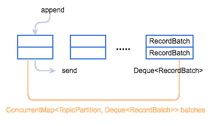

# Producer 发送模型（一）

> 原文：<http://matt33.com/2017/06/25/kafka-producer-send-module/>

早就开始计划写 Kafka 源码分析的文章，但却一直迟迟没有动手，直到看到一位同事的博客 [编程小梦](http://blog.bcmeng.com/)，彻底受到了打击，这位同事是去年本科毕业，年龄算起来应该比我小两岁，但是非常厉害，在刚工作半年的时候就成为了 Apache Kylin 的 commiter，看到身边同事这么优秀，而且还这么努力 （[编程小梦-我的书单](http://blog.bcmeng.com/post/booklist.html)），自己实在没有理由不努力了，因此，在 github 上给自己提了一个 issue [Kafka 源码分析系列](https://github.com/wangzzu/awesome/issues/7)，希望自己能够在未来半年里，至少每两周输出一篇 Kafka 源码分析的文章，本文是这个系列的第一篇 —— Producer 的发送模型（以 **Kafka 0.10.2** 为例）。

# 前言

Kafka，作为目前在大数据领域应用最为广泛的消息队列，其内部实现和设计有很多值得深入研究和分析的地方。

再 0.10.2 的 Kafka 中，其 Client 端是由 Java 实现，Server 端是由 Scala 来实现的，在使用 Kafka 时，Client 是用户最先接触到部分，因此，计划写的源码分析也会从 Client 端开始，会先从 Producer 端开始，今天讲的是 Producer 端的发送模型的实现。

# Producer 使用

在分析 Producer 发送模型之前，先看一下用户是如何使用 Producer 向 Kafka 写数据的，下面是一个关于 Producer 最简单的应用示例。

```scala
import org.apache.kafka.clients.producer.KafkaProducer;
import org.apache.kafka.clients.producer.ProducerRecord;
import org.apache.kafka.clients.producer.Producer;

import java.util.Properties;

/**
 * Created by matt on 16/7/26.
 */
public class ProducerTest {
    private static String topicName;
    private static int msgNum;
    private static int key;

    public static void main(String[] args) {
        Properties props = new Properties();
        props.put("bootstrap.servers", "127.0.0.1:9092,127.0.0.2:9092");
        props.put("key.serializer", "org.apache.kafka.common.serialization.StringSerializer");
        props.put("value.serializer", "org.apache.kafka.common.serialization.StringSerializer");

        topicName = "test";
        msgNum = 10; // 发送的消息数

        Producer<String, String> producer = new KafkaProducer<>(props);
        for (int i = 0; i < msgNum; i++) {
            String msg = i + " This is matt's blog.";
            producer.send(new ProducerRecord<String, String>(topicName, msg));
        }
        producer.close();
    }
}

```

从上面的代码可以看出 Kafka 为用户提供了非常简单的 API，在使用时，只需要如下两步：

1.  初始化 `KafkaProducer` 实例；
2.  调用 `send` 接口发送数据。

本文主要是围绕着 Producer 在内部是如何实现 `send` 接口而展开的。

# Producer 数据发送流程

下面通过对 `send` 源码分析来一步步剖析 Producer 数据的发送流程。

## Producer 的 send 实现

用户是直接使用 `producer.send()` 发送的数据，先看一下 `send()` 接口的实现

```scala
// 异步向一个 topic 发送数据
@Override
public Future<RecordMetadata> send(ProducerRecord<K, V> record) {
    return send(record, null);
}

// 向 topic 异步地发送数据，当发送确认后唤起回调函数
@Override
public Future<RecordMetadata> send(ProducerRecord<K, V> record, Callback callback) {
    // intercept the record, which can be potentially modified; this method does not throw exceptions
    ProducerRecord<K, V> interceptedRecord = this.interceptors == null ? record : this.interceptors.onSend(record);
    return doSend(interceptedRecord, callback);
}

```

数据发送的最终实现还是调用了 Producer 的 `doSend()` 接口。

## Producer 的 doSend 实现

下面是 `doSend()` 的具体实现

```scala
private Future<RecordMetadata> doSend(ProducerRecord<K, V> record, Callback callback) {
       TopicPartition tp = null;
       try {
           // 1.确认数据要发送到的 topic 的 metadata 是可用的
           ClusterAndWaitTime clusterAndWaitTime = waitOnMetadata(record.topic(), record.partition(), maxBlockTimeMs);
           long remainingWaitMs = Math.max(0, maxBlockTimeMs - clusterAndWaitTime.waitedOnMetadataMs);
           Cluster cluster = clusterAndWaitTime.cluster;
           // 2.序列化 record 的 key 和 value
           byte[] serializedKey;
           try {
               serializedKey = keySerializer.serialize(record.topic(), record.key());
           } catch (ClassCastException cce) {
               throw new SerializationException("Can't convert key of class " + record.key().getClass().getName() +
                       " to class " + producerConfig.getClass(ProducerConfig.KEY_SERIALIZER_CLASS_CONFIG).getName() +
                       " specified in key.serializer");
           }
           byte[] serializedValue;
           try {
               serializedValue = valueSerializer.serialize(record.topic(), record.value());
           } catch (ClassCastException cce) {
               throw new SerializationException("Can't convert value of class " + record.value().getClass().getName() +
                       " to class " + producerConfig.getClass(ProducerConfig.VALUE_SERIALIZER_CLASS_CONFIG).getName() +
                       " specified in value.serializer");
           }

           // 3\. 获取该 record 的 partition 的值（可以指定,也可以根据算法计算）
           int partition = partition(record, serializedKey, serializedValue, cluster);
           int serializedSize = Records.LOG_OVERHEAD + Record.recordSize(serializedKey, serializedValue);
           ensureValidRecordSize(serializedSize); // record 的字节超出限制或大于内存限制时,就会抛出 RecordTooLargeException 异常
           tp = new TopicPartition(record.topic(), partition);
           long timestamp = record.timestamp() == null ? time.milliseconds() : record.timestamp(); // 时间戳
           log.trace("Sending record {} with callback {} to topic {} partition {}", record, callback, record.topic(), partition);
           Callback interceptCallback = this.interceptors == null ? callback : new InterceptorCallback<>(callback, this.interceptors, tp);
           // 4\. 向 accumulator 中追加数据
           RecordAccumulator.RecordAppendResult result = accumulator.append(tp, timestamp, serializedKey, serializedValue, interceptCallback, remainingWaitMs);
           // 5\. 如果 batch 已经满了,唤醒 sender 线程发送数据
           if (result.batchIsFull || result.newBatchCreated) {
               log.trace("Waking up the sender since topic {} partition {} is either full or getting a new batch", record.topic(), partition);
               this.sender.wakeup();
           }
           return result.future;
       } catch (ApiException e) {
           log.debug("Exception occurred during message send:", e);
           if (callback != null)
               callback.onCompletion(null, e);
           this.errors.record();
           if (this.interceptors != null)
               this.interceptors.onSendError(record, tp, e);
           return new FutureFailure(e);
       } catch (InterruptedException e) {
           this.errors.record();
           if (this.interceptors != null)
               this.interceptors.onSendError(record, tp, e);
           throw new InterruptException(e);
       } catch (BufferExhaustedException e) {
           this.errors.record();
           this.metrics.sensor("buffer-exhausted-records").record();
           if (this.interceptors != null)
               this.interceptors.onSendError(record, tp, e);
           throw e;
       } catch (KafkaException e) {
           this.errors.record();
           if (this.interceptors != null)
               this.interceptors.onSendError(record, tp, e);
           throw e;
       } catch (Exception e) {
           if (this.interceptors != null)
               this.interceptors.onSendError(record, tp, e);
           throw e;
       }
   }

```

在 `dosend()` 方法的实现上，一条 Record 数据的发送，可以分为以下五步：

1.  确认数据要发送到的 topic 的 metadata 是可用的（如果该 partition 的 leader 存在则是可用的，如果开启权限时，client 有相应的权限），如果没有 topic 的 metadata 信息，就需要获取相应的 metadata；
2.  序列化 record 的 key 和 value；
3.  获取该 record 要发送到的 partition（可以指定，也可以根据算法计算）；
4.  向 accumulator 中追加 record 数据，数据会先进行缓存；
5.  如果追加完数据后，对应的 RecordBatch 已经达到了 batch.size 的大小（或者 batch 的剩余空间不足以添加下一条 Record），则唤醒 `sender` 线程发送数据。

数据的发送过程，可以简单总结为以上五点，下面会这几部分的具体实现进行详细分析。

# 发送过程详解

## 获取 topic 的 metadata 信息

Producer 通过 `waitOnMetadata()` 方法来获取对应 topic 的 metadata 信息，这部分后面会单独抽出一篇文章来介绍，这里就不再详述，总结起来就是：在数据发送前，需要先该 topic 是可用的。

## key 和 value 的序列化

Producer 端对 record 的 `key` 和 `value` 值进行序列化操作，在 Consumer 端再进行相应的反序列化，Kafka 内部提供的序列化和反序列化算法如下图所示：


当然我们也是可以自定义序列化的具体实现，不过一般情况下，Kafka 内部提供的这些方法已经足够使用。

## 获取 partition 值

关于 partition 值的计算，分为三种情况：

1.  指明 partition 的情况下，直接将指明的值直接作为 partiton 值；
2.  没有指明 partition 值但有 key 的情况下，将 key 的 hash 值与 topic 的 partition 数进行取余得到 partition 值；
3.  既没有 partition 值又没有 key 值的情况下，第一次调用时随机生成一个整数（后面每次调用在这个整数上自增），将这个值与 topic 可用的 partition 总数取余得到 partition 值，也就是常说的 `round-robin` 算法。

具体实现如下：

```scala
// 当 record 中有 partition 值时，直接返回，没有的情况下调用 partitioner 的类的 partition 方法去计算（KafkaProducer.class）
private int partition(ProducerRecord<K, V> record, byte[] serializedKey, byte[] serializedValue, Cluster cluster) {
    Integer partition = record.partition();
    return partition != null ?
            partition :
            partitioner.partition(
                    record.topic(), record.key(), serializedKey, record.value(), serializedValue, cluster);
}

```

Producer 默认使用的 `partitioner` 是 `org.apache.kafka.clients.producer.internals.DefaultPartitioner`，用户也可以自定义 partition 的策略，下面是这个类两个方法的具体实现：

```scala
public int partition(String topic, Object key, byte[] keyBytes, Object value, byte[] valueBytes, Cluster cluster) {
        List<PartitionInfo> partitions = cluster.partitionsForTopic(topic);
        int numPartitions = partitions.size();
        if (keyBytes == null) {// 没有指定 key 的情况下
            int nextValue = nextValue(topic); // 第一次的时候产生一个随机整数,后面每次调用在之前的基础上自增;
            List<PartitionInfo> availablePartitions = cluster.availablePartitionsForTopic(topic);
            // leader 不为 null,即为可用的 partition
            if (availablePartitions.size() > 0) {
                int part = Utils.toPositive(nextValue) % availablePartitions.size();
                return availablePartitions.get(part).partition();
            } else {
                return Utils.toPositive(nextValue) % numPartitions;
            }
        } else {// 有 key 的情况下,使用 key 的 hash 值进行计算
            return Utils.toPositive(Utils.murmur2(keyBytes)) % numPartitions; // 选择 key 的 hash 值
        }
    }

    // 根据 topic 获取对应的整数变量
    private int nextValue(String topic) {
        AtomicInteger counter = topicCounterMap.get(topic);
        if (null == counter) { // 第一次调用时，随机产生
            counter = new AtomicInteger(new Random().nextInt());
            AtomicInteger currentCounter = topicCounterMap.putIfAbsent(topic, counter);
            if (currentCounter != null) {
                counter = currentCounter;
            }
        }
        return counter.getAndIncrement(); // 后面再调用时，根据之前的结果自增
    }

```

这就是 Producer 中默认的 partitioner 实现。

## 向 accumulator 写数据

Producer 会先将 record 写入到 buffer 中，当达到一个 `batch.size` 的大小时，再唤起 `sender` 线程去发送 `RecordBatch`（第五步），这里先详细分析一下 Producer 是如何向 buffer 中写入数据的。

Producer 是通过 `RecordAccumulator` 实例追加数据，`RecordAccumulator` 模型如下图所示，一个重要的变量就是 `ConcurrentMap<TopicPartition, Deque<RecordBatch>> batches`，每个 `TopicPartition` 都会对应一个 `Deque<RecordBatch>`，当添加数据时，会向其 topic-partition 对应的这个 queue 最新创建的一个 `RecordBatch` 中添加 record，而发送数据时，则会先从 queue 中最老的那个 `RecordBatch` 开始发送。



```scala
// org.apache.kafka.clients.producer.internals.RecordAccumulator
     // 向 accumulator 添加一条 record，并返回添加后的结果（结果主要包含: future metadata、batch 是否满的标志以及新 batch 是否创建）其中， maxTimeToBlock 是 buffer.memory 的 block 的最大时间
    public RecordAppendResult append(TopicPartition tp,
                                     long timestamp,
                                     byte[] key,
                                     byte[] value,
                                     Callback callback,
                                     long maxTimeToBlock) throws InterruptedException {
        appendsInProgress.incrementAndGet();
        try {
            Deque<RecordBatch> dq = getOrCreateDeque(tp);// 每个 topicPartition 对应一个 queue
            synchronized (dq) {// 在对一个 queue 进行操作时,会保证线程安全
                if (closed)
                    throw new IllegalStateException("Cannot send after the producer is closed.");
                RecordAppendResult appendResult = tryAppend(timestamp, key, value, callback, dq); // 追加数据
                if (appendResult != null)// 这个 topic-partition 已经有记录了
                    return appendResult;
            }

            // 为 topic-partition 创建一个新的 RecordBatch, 需要初始化相应的 RecordBatch，要为其分配的大小是: max（batch.size, 加上头文件的本条消息的大小）
            int size = Math.max(this.batchSize, Records.LOG_OVERHEAD + Record.recordSize(key, value));
            log.trace("Allocating a new {} byte message buffer for topic {} partition {}", size, tp.topic(), tp.partition());
            ByteBuffer buffer = free.allocate(size, maxTimeToBlock);// 给这个 RecordBatch 初始化一个 buffer
            synchronized (dq) {
                if (closed)
                    throw new IllegalStateException("Cannot send after the producer is closed.");

                RecordAppendResult appendResult = tryAppend(timestamp, key, value, callback, dq);
                if (appendResult != null) {// 如果突然发现这个 queue 已经存在，那么就释放这个已经分配的空间
                    free.deallocate(buffer);
                    return appendResult;
                }
                // 给 topic-partition 创建一个 RecordBatch
                MemoryRecordsBuilder recordsBuilder = MemoryRecords.builder(buffer, compression, TimestampType.CREATE_TIME, this.batchSize);
                RecordBatch batch = new RecordBatch(tp, recordsBuilder, time.milliseconds());
                // 向新的 RecordBatch 中追加数据
                FutureRecordMetadata future = Utils.notNull(batch.tryAppend(timestamp, key, value, callback, time.milliseconds()));

                dq.addLast(batch);// 将 RecordBatch 添加到对应的 queue 中
                incomplete.add(batch);// 向未 ack 的 batch 集合添加这个 batch
                // 如果 dp.size()>1 就证明这个 queue 有一个 batch 是可以发送了
                return new RecordAppendResult(future, dq.size() > 1 || batch.isFull(), true);
            }
        } finally {
            appendsInProgress.decrementAndGet();
        }
    }

```

总结一下其 record 写入的具体流程如下图所示：


1.  获取该 topic-partition 对应的 queue，没有的话会创建一个空的 queue；
2.  向 queue 中追加数据，先获取 queue 中最新加入的那个 `RecordBatch`，如果不存在或者存在但剩余空余不足以添加本条 record 则返回 null，成功写入的话直接返回结果，写入成功；
3.  创建一个新的 `RecordBatch`，初始化内存大小根据 `max(batch.size, Records.LOG_OVERHEAD + Record.recordSize(key, value))` 来确定（防止单条 record 过大的情况）；
4.  向新建的 `RecordBatch` 写入 record，并将 `RecordBatch` 添加到 queue 中，返回结果，写入成功。

## 发送 RecordBatch

当 record 写入成功后，如果发现 `RecordBatch` 已满足发送的条件（通常是 queue 中有多个 batch，那么最先添加的那些 batch 肯定是可以发送了），那么就会唤醒 `sender` 线程，发送 `RecordBatch`。

`sender` 线程对 `RecordBatch` 的处理是在 `run()` 方法中进行的，该方法具体实现如下：

```scala
void run(long now) {
        Cluster cluster = metadata.fetch();
        // 获取那些已经可以发送的 RecordBatch 对应的 nodes
        RecordAccumulator.ReadyCheckResult result = this.accumulator.ready(cluster, now);

        // 如果有 topic-partition 的 leader 是未知的,就强制 metadata 更新
        if (!result.unknownLeaderTopics.isEmpty()) {
            for (String topic : result.unknownLeaderTopics)
                this.metadata.add(topic);
            this.metadata.requestUpdate();
        }

        // 如果与 node 没有连接（如果可以连接,同时初始化该连接）,就证明该 node 暂时不能发送数据,暂时移除该 node
        Iterator<Node> iter = result.readyNodes.iterator();
        long notReadyTimeout = Long.MAX_VALUE;
        while (iter.hasNext()) {
            Node node = iter.next();
            if (!this.client.ready(node, now)) {
                iter.remove();
                notReadyTimeout = Math.min(notReadyTimeout, this.client.connectionDelay(node, now));
            }
        }

        // 返回该 node 对应的所有可以发送的 RecordBatch 组成的 batches（key 是 node.id）,并将 RecordBatch 从对应的 queue 中移除
        Map<Integer, List<RecordBatch>> batches = this.accumulator.drain(cluster, result.readyNodes, this.maxRequestSize, now);
        if (guaranteeMessageOrder) {
            //记录将要发送的 RecordBatch
            for (List<RecordBatch> batchList : batches.values()) {
                for (RecordBatch batch : batchList)
                    this.accumulator.mutePartition(batch.topicPartition);
            }
        }

        // 将由于元数据不可用而导致发送超时的 RecordBatch 移除
        List<RecordBatch> expiredBatches = this.accumulator.abortExpiredBatches(this.requestTimeout, now);
        for (RecordBatch expiredBatch : expiredBatches)
            this.sensors.recordErrors(expiredBatch.topicPartition.topic(), expiredBatch.recordCount);

        sensors.updateProduceRequestMetrics(batches);

        long pollTimeout = Math.min(result.nextReadyCheckDelayMs, notReadyTimeout);
        if (!result.readyNodes.isEmpty()) {
            log.trace("Nodes with data ready to send: {}", result.readyNodes);
            pollTimeout = 0;
        }
        // 发送 RecordBatch
        sendProduceRequests(batches, now);

        this.client.poll(pollTimeout, now); // 关于 socket 的一些实际的读写操作（其中包括 meta 信息的更新）
    }

```

这段代码前面有很多是其他的逻辑处理，如：移除暂时不可用的 node、处理由于元数据不可用导致的超时 `RecordBatch`，真正进行发送发送 `RecordBatch` 的是 `sendProduceRequests(batches, now)` 这个方法，具体是：

```scala
/**
 * Transfer the record batches into a list of produce requests on a per-node basis
 */
private void sendProduceRequests(Map<Integer, List<RecordBatch>> collated, long now) {
    for (Map.Entry<Integer, List<RecordBatch>> entry : collated.entrySet())
        sendProduceRequest(now, entry.getKey(), acks, requestTimeout, entry.getValue());
}

/**
 * Create a produce request from the given record batches
 */
// 发送 produce 请求
private void sendProduceRequest(long now, int destination, short acks, int timeout, List<RecordBatch> batches) {
    Map<TopicPartition, MemoryRecords> produceRecordsByPartition = new HashMap<>(batches.size());
    final Map<TopicPartition, RecordBatch> recordsByPartition = new HashMap<>(batches.size());
    for (RecordBatch batch : batches) {
        TopicPartition tp = batch.topicPartition;
        produceRecordsByPartition.put(tp, batch.records());
        recordsByPartition.put(tp, batch);
    }

    ProduceRequest.Builder requestBuilder =
            new ProduceRequest.Builder(acks, timeout, produceRecordsByPartition);
    RequestCompletionHandler callback = new RequestCompletionHandler() {
        public void onComplete(ClientResponse response) {
            handleProduceResponse(response, recordsByPartition, time.milliseconds());
        }
    };

    String nodeId = Integer.toString(destination);
    ClientRequest clientRequest = client.newClientRequest(nodeId, requestBuilder, now, acks != 0, callback);
    client.send(clientRequest, now);
    log.trace("Sent produce request to {}: {}", nodeId, requestBuilder);
}

```

这段代码就简单很多，总来起来就是，将 `batches` 中 leader 为同一个 node 的所有 RecordBatch 放在一个请求中进行发送。

# 最后

本文是对 Kafka Producer 端发送模型的一个简单分析，下一篇文章将会详细介绍 metadata 相关的内容，包括 metadata 的内容以及在 Producer 端 metadata 的更新机制。