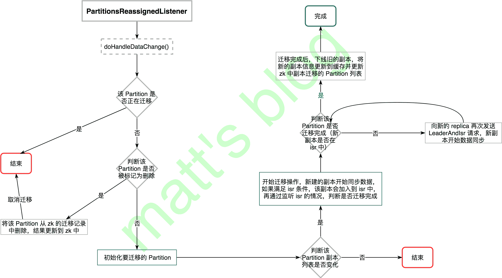

# Partition 副本迁移实现（十八）

> 原文：<http://matt33.com/2018/06/16/partition-reassignment/>

前面两篇关于 Controller 的内容分别讲述了 Controller 选举和启动，以及副本状态机和分区状态机的内容，从本文开始会详细讲述 Controller 的一些其他功能，主要是 Controller 的对不同类型监听器的处理，这部分预计分三篇左右的文章讲述。Controller 在初始化时，会利用 ZK 的 watch 机制注册很多不同类型的监听器，当监听的事件被触发时，Controller 就会触发相应的操作。

Controller 在初始化时，会注册多种类型的监听器，主要有以下 6 种：

1.  监听 `/admin/reassign_partitions` 节点，用于分区副本迁移的监听；
2.  监听 `/isr_change_notification` 节点，用于 Partition Isr 变动的监听，；
3.  监听 `/admin/preferred_replica_election` 节点，用于需要进行 Partition 最优 leader 选举的监听；
4.  监听 `/brokers/topics` 节点，用于 Topic 新建的监听；
5.  监听 `/brokers/topics/TOPIC_NAME` 节点，用于 Topic Partition 扩容的监听；
6.  监听 `/admin/delete_topics` 节点，用于 Topic 删除的监听；
7.  监听 `/brokers/ids` 节点，用于 Broker 上下线的监听。

本文主要讲解第一部分，也就是 Controller 对 Partition 副本迁移的处理，后续会单独一篇文章讲述 Topic 的新建、扩容和删除，再单独一篇文章讲述 Broker 的上下线，另外两部分将会在对 LeaderAndIsr 请求处理的文章中讲述。

## Partition 副本迁移整体流程

Partition 的副本迁移实际上就是将分区的副本重新分配到不同的代理节点上，如果 zk 中新副本的集合与 Partition 原来的副本集合相同，那么这个副本就不需要重新分配了。

Partition 的副本迁移是通过监听 zk 的 `/admin/reassign_partitions` 节点触发的，Kafka 也向用户提供相应的脚本工具进行副本迁移，副本迁移的脚本使用方法如下所示：

```scala
./bin/kafka-reassign-partitions.sh --zookeeper XXX --reassignment-json-file XXX.json --execute

```

其中 XXX.json 为要进行 Partition 副本迁移的 json 文件，json 文件的格式如下所示：

```scala
{
    "version":1,
    "partitions":[
        {
            "topic":"__consumer_offsets",
            "partition":19,
            "replicas":[
                3,
                9,
                2
            ]
        },
        {
            "topic":"__consumer_offsets",
            "partition":26,
            "replicas":[
                2,
                6,
                4
            ]
        },
        {
            "topic":"__consumer_offsets",
            "partition":27,
            "replicas":[
                5,
                3,
                8
            ]
        }
    ]
}

```

这个 json 文件的意思是将 Topic `__consumer_offsets` Partition 19 的副本迁移到 {3, 2, 9} 上，Partition 26 的副本迁移到 {6, 2, 4} 上，Partition 27 的副本迁移到 {5, 3, 8} 上。

在调用脚本向 zk 提交 Partition 的迁移计划时，迁移计划更新到 zk 前需要进行一步判断，如果该节点（写入迁移计划的节点）已经存在，即副本迁移还在进行，那么本次副本迁移计划是无法提交的，实现的逻辑如下所示：

```scala
def executeAssignment(zkUtils: ZkUtils, reassignmentJsonString: String, throttle: Long = -1) {
  val partitionsToBeReassigned = parseAndValidate(zkUtils, reassignmentJsonString)
  val reassignPartitionsCommand = new ReassignPartitionsCommand(zkUtils, partitionsToBeReassigned.toMap)

  // If there is an existing rebalance running, attempt to change its throttle
  //note: 如果副本迁移正在进行,那么这次的副本迁移计划是无法提交的
  if (zkUtils.pathExists(ZkUtils.ReassignPartitionsPath)) {
    println("There is an existing assignment running.")
    reassignPartitionsCommand.maybeLimit(throttle)
  }
  else {
    printCurrentAssignment(zkUtils, partitionsToBeReassigned)
    if (throttle >= 0)
      println(String.format("Warning: You must run Verify periodically, until the reassignment completes, to ensure the throttle is removed. You can also alter the throttle by rerunning the Execute command passing a new value."))
    //note: 将迁移计划更新到 zk 上
    if (reassignPartitionsCommand.reassignPartitions(throttle)) {
      println("Successfully started reassignment of partitions.")
    } else
      println("Failed to reassign partitions %s".format(partitionsToBeReassigned))
  }
}

```

在迁移计划提交到 zk 之后，Controller 的 PartitionsReassignedListener 就会被触发，Controller 开始 Partition 的副本迁移，触发之后 Controller 的处理流程大体如下图所示：



## PartitionsReassignedListener 副本迁移处理

在 zk 的 `/admin/reassign_partitions` 节点数据有变化时，就会触发 PartitionsReassignedListener 的 `doHandleDataChange()` 方法，实现如下：

```scala
//note: 开始进行 partition reassignment 除非这三种情况发生:
//note: 1\. 这个 partition 的 reassignment 之前已经存在, 即正在迁移中;
//note: 2\. new replica 与已经存在的 replicas 相同;
//note: 3\. Partition 所有新分配 replica 都已经 dead;
//note: 这种情况发生时,会输出一条日志,并从 zk 移除该 Partition 的迁移计划。
class PartitionsReassignedListener(protected val controller: KafkaController) extends ControllerZkDataListener {
  private val controllerContext = controller.controllerContext

  protected def logName = "PartitionsReassignedListener"

  /**
   * Invoked when some partitions are reassigned by the admin command
   *
   * @throws Exception On any error.
   */
  //note: 当一些分区需要进行迁移时
  @throws[Exception]
  def doHandleDataChange(dataPath: String, data: AnyRef) {
    debug("Partitions reassigned listener fired for path %s. Record partitions to be reassigned %s"
      .format(dataPath, data))
    val partitionsReassignmentData = ZkUtils.parsePartitionReassignmentData(data.toString)
    val partitionsToBeReassigned = inLock(controllerContext.controllerLock) { //note: 需要迁移的新副本
      //note: 过滤掉正在迁移的副本,如果 Partition 正在迁移,这一波迁移完之前不允许再次迁移
      partitionsReassignmentData.filterNot(p => controllerContext.partitionsBeingReassigned.contains(p._1))
    }
    partitionsToBeReassigned.foreach { partitionToBeReassigned =>
      inLock(controllerContext.controllerLock) {
        if(controller.deleteTopicManager.isTopicQueuedUpForDeletion(partitionToBeReassigned._1.topic)) {
          //note: 如果这个 topic 已经设置了删除，那么就不会进行迁移了（从需要副本迁移的集合中移除）
          error("Skipping reassignment of partition %s for topic %s since it is currently being deleted"
            .format(partitionToBeReassigned._1, partitionToBeReassigned._1.topic))
          controller.removePartitionFromReassignedPartitions(partitionToBeReassigned._1)
        } else { //note: 添加到需要迁移的副本集合中
          val context = new ReassignedPartitionsContext(partitionToBeReassigned._2)
          controller.initiateReassignReplicasForTopicPartition(partitionToBeReassigned._1, context)
        }
      }
    }
  }

  def doHandleDataDeleted(dataPath: String) {}
}

```

如果 Partition 出现下面的情况，将不会进行副本迁移，直接将 Partition 的迁移计划从 ZK 移除：

1.  这个 Partition 的 reassignment 之前已经存在, 即正在迁移中;
2.  这个 Partition 新分配的 replica 与之前的 replicas 相同;
3.  这个 Partition 所有新分配 replica 都已经 dead;
4.  这个 Partition 已经被设置了删除标志。

对于可以进行副本迁移的 Partition 集合，这里将会调用 Kafka Controller 的 `initiateReassignReplicasForTopicPartition()` 方法对每个 Partition 进行处理。

## 副本迁移初始化

进行了前面的判断后，这个 Partition 满足了可以迁移的条件，Controller 会首先初始化副本迁移的流程，实现如下所示：

> 如果 Partition 新分配的 replica 与之前的 replicas 相同，那么不会进行副本迁移，这部分的判断实际上是在这里实现的，前面只是为了更好地讲述。

```scala
//note: 初始化 Topic-Partition 的副本迁移
def initiateReassignReplicasForTopicPartition(topicAndPartition: TopicAndPartition,
                                      reassignedPartitionContext: ReassignedPartitionsContext) {
  //note: 要迁移的 topic-partition，及新的副本
  val newReplicas = reassignedPartitionContext.newReplicas
  val topic = topicAndPartition.topic
  val partition = topicAndPartition.partition
  try {
    val assignedReplicasOpt = controllerContext.partitionReplicaAssignment.get(topicAndPartition) //note: partition 的 AR
    assignedReplicasOpt match {
      case Some(assignedReplicas) =>
        if (assignedReplicas == newReplicas) { //note: 不需要迁移
          throw new KafkaException("Partition %s to be reassigned is already assigned to replicas".format(topicAndPartition) +
            " %s. Ignoring request for partition reassignment".format(newReplicas.mkString(",")))
        } else {
          info("Handling reassignment of partition %s to new replicas %s".format(topicAndPartition, newReplicas.mkString(",")))
          // first register ISR change listener
          //note: 首先注册 ISR 监听的变化
          watchIsrChangesForReassignedPartition(topic, partition, reassignedPartitionContext)
          //note: 正在迁移 Partition 添加到缓存中
          controllerContext.partitionsBeingReassigned.put(topicAndPartition, reassignedPartitionContext)
          // mark topic ineligible for deletion for the partitions being reassigned
          //note: 设置正在迁移的副本为不能删除
          deleteTopicManager.markTopicIneligibleForDeletion(Set(topic))
          //note: 进行副本迁移
          onPartitionReassignment(topicAndPartition, reassignedPartitionContext)
        }
      case None => throw new KafkaException("Attempt to reassign partition %s that doesn't exist"
        .format(topicAndPartition))
    }
  } catch {
    case e: Throwable => error("Error completing reassignment of partition %s".format(topicAndPartition), e)
    // remove the partition from the admin path to unblock the admin client
    removePartitionFromReassignedPartitions(topicAndPartition)
  }
}

```

对于副本迁移流程初始化如下：

1.  通过 `watchIsrChangesForReassignedPartition()` 方法监控这个 Partition 的 LeaderAndIsr 变化，如果有新的副本数据同步完成，那么 leader 会将其加到 isr 中更新到 zk 中，这时候 Controller 是可以接收到相关的信息通知的；
2.  将正在迁移的 Partition 添加到 partitionsBeingReassigned 中，它会记录当前正在迁移的 Partition 列表；
3.  将要迁移的 Topic 设置为非法删除删除状态，在这个状态的 Topic 是无法进行删除的；
4.  调用 `onPartitionReassignment()`，进行副本迁移。

在第一步中，会向这个 Partition 注册一个额外的监听器，监听其 LeaderAndIsr 信息变化，如下所示：

```scala
//note: ISR 变动的监听器（这个不是由 leader 主动触发的，而是 controller 自己触发的，主要用于 partition 迁移时，isr 变动的监听处理）
class ReassignedPartitionsIsrChangeListener(protected val controller: KafkaController, topic: String, partition: Int,
                                            reassignedReplicas: Set[Int]) extends ControllerZkDataListener {
  private val zkUtils = controller.controllerContext.zkUtils
  private val controllerContext = controller.controllerContext

  protected def logName = "ReassignedPartitionsIsrChangeListener"

  /**
   * Invoked when some partitions need to move leader to preferred replica
   */
  def doHandleDataChange(dataPath: String, data: AnyRef) {
    inLock(controllerContext.controllerLock) {
      debug("Reassigned partitions isr change listener fired for path %s with children %s".format(dataPath, data))
      val topicAndPartition = TopicAndPartition(topic, partition)
      try {
        // check if this partition is still being reassigned or not
        //note: 检查这个副本是不是还在迁移中（这个方法只用于副本迁移中）
        controllerContext.partitionsBeingReassigned.get(topicAndPartition) match {
          case Some(reassignedPartitionContext) =>
            // need to re-read leader and isr from zookeeper since the zkclient callback doesn't return the Stat object
            //note: 从 zk 获取最新的 leader 和 isr 信息
            val newLeaderAndIsrOpt = zkUtils.getLeaderAndIsrForPartition(topic, partition)
            newLeaderAndIsrOpt match {
              case Some(leaderAndIsr) => // check if new replicas have joined ISR
                val caughtUpReplicas = reassignedReplicas & leaderAndIsr.isr.toSet
                if(caughtUpReplicas == reassignedReplicas) { //note: 新分配的副本已经全部在 isr 中了
                  // resume the partition reassignment process
                  info("%d/%d replicas have caught up with the leader for partition %s being reassigned."
                    .format(caughtUpReplicas.size, reassignedReplicas.size, topicAndPartition) +
                    "Resuming partition reassignment")
                  //note: 再次触发 onPartitionReassignment 方法,副本已经迁移完成
                  controller.onPartitionReassignment(topicAndPartition, reassignedPartitionContext)
                }
                else {  //note: 否则不进行任何处理
                  info("%d/%d replicas have caught up with the leader for partition %s being reassigned."
                    .format(caughtUpReplicas.size, reassignedReplicas.size, topicAndPartition) +
                    "Replica(s) %s still need to catch up".format((reassignedReplicas -- leaderAndIsr.isr.toSet).mkString(",")))
                }
              case None => error("Error handling reassignment of partition %s to replicas %s as it was never created"
                .format(topicAndPartition, reassignedReplicas.mkString(",")))
            }
          case None =>
        }
      } catch {
        case e: Throwable => error("Error while handling partition reassignment", e)
      }
    }
  }

  def doHandleDataDeleted(dataPath: String) {}

}

```

如果该 Partition 的 LeaderAndIsr 信息有变动，那么就会触发这个 listener 的 `doHandleDataChange()` 方法：

1.  首先检查这个 Partition 是否在还在迁移中，不在的话直接结束流程，因为这个监听器本来就是为了 Partition 副本迁移而服务的；
2.  从 zk 获取最新的 leader 和 isr 信息，如果新分配的副本全部都在 isr 中，那么就再次触发 controller 的 `onPartitionReassignment()` 方法，再次调用时实际上已经证明了这个 Partition 的副本迁移已经完成，否则的话就会不进行任何处理，等待新分配的所有副本迁移完成。

## 副本迁移

Partition 副本迁移真正实际处理是在 Controller 的 `onPartitionReassignment()` 方法完成的，在看这个方法之前，先介绍几个基本的概念（假设一个 Partition 原来的 replica 是 {1、2、3}，新分配的副本列表是：{2、3、4}）：

*   RAR = Reassigned replicas，即新分配的副本列表，也就是 {2、3、4}；
*   OAR = Original list of replicas for partition，即这个 Partition 原来的副本列表，也就是 {1、2、3}；
*   AR = current assigned replicas，该 Partition 当前的副本列表，这个会随着阶段的不同而变化；
*   RAR-OAR：需要创建、数据同步的新副本，也就是 {4}；
*   OAR-RAR：不需要创建、数据同步的副本，也就是{2、3}

这个方法的实现如下所示：

```scala
//note: 这个回调方法被 reassigned partitions listener 触发,当需要进行分区副本迁移时,会在【/admin/reassign_partitions】下创建一个节点来触发操作
//note: RAR: 重新分配的副本, OAR: 这个分区原来的副本列表, AR: 当前的分配的副本
def onPartitionReassignment(topicAndPartition: TopicAndPartition, reassignedPartitionContext: ReassignedPartitionsContext) {
  val reassignedReplicas = reassignedPartitionContext.newReplicas
  if (!areReplicasInIsr(topicAndPartition.topic, topicAndPartition.partition, reassignedReplicas)) {
    //note: 新分配的并没有权限在 isr 中
    info("New replicas %s for partition %s being ".format(reassignedReplicas.mkString(","), topicAndPartition) +
      "reassigned not yet caught up with the leader")
    //note: RAR-OAR
    val newReplicasNotInOldReplicaList = reassignedReplicas.toSet -- controllerContext.partitionReplicaAssignment(topicAndPartition).toSet
    //note: RAR+OAR
    val newAndOldReplicas = (reassignedPartitionContext.newReplicas ++ controllerContext.partitionReplicaAssignment(topicAndPartition)).toSet
    //1\. Update AR in ZK with OAR + RAR.
    updateAssignedReplicasForPartition(topicAndPartition, newAndOldReplicas.toSeq)
    //2\. Send LeaderAndIsr request to every replica in OAR + RAR (with AR as OAR + RAR).
    updateLeaderEpochAndSendRequest(topicAndPartition, controllerContext.partitionReplicaAssignment(topicAndPartition),
      newAndOldReplicas.toSeq)
    //3\. replicas in RAR - OAR -> NewReplica
    //note: 新分配的副本状态更新为 NewReplica（在第二步中发送 LeaderAndIsr 请求时,新的副本会开始创建并且同步数据）
    startNewReplicasForReassignedPartition(topicAndPartition, reassignedPartitionContext, newReplicasNotInOldReplicaList)
    info("Waiting for new replicas %s for partition %s being ".format(reassignedReplicas.mkString(","), topicAndPartition) +
      "reassigned to catch up with the leader")
  } else { //note: 新副本全在 isr 中了
    //4\. Wait until all replicas in RAR are in sync with the leader.
   //note: 【OAR-RAR】
    val oldReplicas = controllerContext.partitionReplicaAssignment(topicAndPartition).toSet -- reassignedReplicas.toSet
    //5\. replicas in RAR -> OnlineReplica
    //note: RAR 中的副本都在 isr 中了,将副本状态设置为 OnlineReplica
    reassignedReplicas.foreach { replica =>
      replicaStateMachine.handleStateChanges(Set(new PartitionAndReplica(topicAndPartition.topic, topicAndPartition.partition,
        replica)), OnlineReplica)
    }
    //6\. Set AR to RAR in memory.
    //7\. Send LeaderAndIsr request with a potential new leader (if current leader not in RAR) and
    //   a new AR (using RAR) and same isr to every broker in RAR
    //note: 到这一步,新加入的 replica 已经同步完成,leader 和 isr 都更新到最新的结果
    moveReassignedPartitionLeaderIfRequired(topicAndPartition, reassignedPartitionContext)
    //8\. replicas in OAR - RAR -> Offline (force those replicas out of isr)
    //9\. replicas in OAR - RAR -> NonExistentReplica (force those replicas to be deleted)
    //note: 下线旧的副本
    stopOldReplicasOfReassignedPartition(topicAndPartition, reassignedPartitionContext, oldReplicas)
    //10\. Update AR in ZK with RAR.
    updateAssignedReplicasForPartition(topicAndPartition, reassignedReplicas)
    //11\. Update the /admin/reassign_partitions path in ZK to remove this partition.
    //note: partition 迁移完成,从待迁移的集合中移除该 Partition
    removePartitionFromReassignedPartitions(topicAndPartition)
    info("Removed partition %s from the list of reassigned partitions in zookeeper".format(topicAndPartition))
    controllerContext.partitionsBeingReassigned.remove(topicAndPartition)
    //12\. After electing leader, the replicas and isr information changes, so resend the update metadata request to every broker
    //note: 发送 metadata 更新请求给所有存活的 broker
    sendUpdateMetadataRequest(controllerContext.liveOrShuttingDownBrokerIds.toSeq, Set(topicAndPartition))
    // signal delete topic thread if reassignment for some partitions belonging to topics being deleted just completed
    //note: topic 删除恢复（如果当前 topic 设置了删除,之前由于无法删除）
    deleteTopicManager.resumeDeletionForTopics(Set(topicAndPartition.topic))
  }
}

```

这个方法整体分为以下 12 个步骤：

1.  把 AR = OAR+RAR （{1、2、3、4}）更新到 zk 及本地 Controller 缓存中;
2.  发送 LeaderAndIsr 给 AR 中每一个副本,并且会强制更新 zk 中 leader 的 epoch;
3.  创建需要新建的副本（【RAR-OAR】，即 {4}）,将其状态设置为 NewReplica；
4.  等待直到 RAR（{2、3、4}） 中的所有副本都在 ISR 中;
5.  把 RAR（{2、3、4}） 中的所有副本设置为 OnReplica 状态;
6.  将缓存中 AR 更新为 RAR（重新分配的副本列表，即 {2、3、4}）;
7.  如果 leader 不在 RAR 中, 就从 RAR 选择对应的 leader, 然后发送 LeaderAndIsr 请求；如果不需要，那么只会更新 leader epoch，然后发送 LeaderAndIsr 请求; 在发送 LeaderAndIsr 请求前设置了 AR=RAR, 这将确保了 leader 在 isr 中不会添加任何 【RAR-OAR】中的副本（old replica，即 {1}）；
8.  将【OAR-RAR】（{1}）中的副本设置为 OfflineReplica 状态，OfflineReplica 状态的变化，将会从 ISR 中删除【OAR-RAR】的副本，更新到 zk 中并发送 LeaderAndIsr 请求给 leader，通知 leader isr 变动。之后再发送 StopReplica 请求（delete=false）给【OAR-RAR】中的副本；
9.  将【OAR-RAR】中的副本设置为 NonExistentReplica 状态。这将发送 StopReplica 请求（delete=true）给【OAR-RAR】中的副本，这些副本将会从本地上删除数据；
10.  在 zk 中更新 AR 为 RAR；
11.  更新 zk 中路径 【/admin/reassign_partitions】信息，移除已经成功迁移的 Partition；
12.  leader 选举之后，这个 replica 和 isr 信息将会变动，发送 metadata 更新给所有的 broker。

上面的流程简单来说，就是先创建新的 replica，开始同步数据，等待所有新的分配都加入到了 isr 中后，开始进行 leader 选举（需要的情况下），下线不需要的副本（OAR-RAR），下线完成后将 Partition 的最新 AR （即 RAR）信息更新到 zk 中，最后发送相应的请求给 broker，到这里一个 Partition 的副本迁移算是完成了。