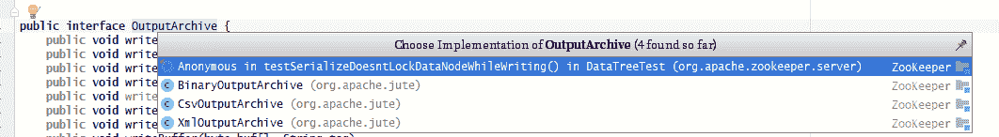
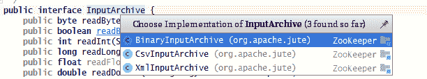

# Zookeeper 源码阅读（一）Jute 和传输协议

> 原文：[https://www.cnblogs.com/gongcomeon/p/9610936.html](https://www.cnblogs.com/gongcomeon/p/9610936.html)

### 前言

最近开始了 Zookeeper 的源码阅读和分析，也从现在开始把之前和现在学习到的一些 Zookeeper 的源码知识和我的一些理解放到博客上。不得不说这是自己第一次去完整的看一个开源项目的完整源码，从开始的第一步感觉就遇到了坑= =而且多少还有些面对庞大代码的茫然。在整个过程中（过程还没完，到现在为止）零零散散看了不少博客的分析，但是感觉都是针对某个小部分的分析，希望自己能从头到尾把自己看的过程都写下来，如果以后有别的同学也想完整的了解了解 Zookeeper 的底层原理，希望我的博客能有点抛砖引玉的作用！

### 搭建环境

我主要参考了两篇博客：[Zookeeper 的源码阅读建议](https://blog.csdn.net/po_lao/article/details/52562590)和[Zookeeper 源码阅读--环境搭建、启动服务 demo](https://www.jianshu.com/p/7ee757d6a08a)。但是有个巨大巨大巨大的坑。。。不要从 git 上直接拉最新的代码，即使是 master 分支的！可以直接从 Zookeeper 的下载页面下载成熟的版本，想看最新的代码直接下最新发布的版本就可以了。为什么要这样呢？？？这里有点血泪教训。。。我记得前段时间从 git 上拉最新的代码下来按照博客里说的方式去跑单机版的 server，死活启动不起来。。。各种修改办法都试过了，都没有效果。最后我尝试着下了成熟的发布版本，然后一跑就可以了。所以建议大家千万下载成熟的发布版本。

### 包简介

我这边简单说下包中类的大致作用，因为我也没有完全看完，所以这里会持续更新：

jute 包：是 Zookeeper 使用的序列化工具 Jute 相关的。

common 包：公共工具类；

client/server 包：和 client/server 逻辑处理相关的类；

cli 包：接收并执行用户输入的各种命令；

jmx 包：jmx 监控；

还有一些 zookeeper 包里的类：

Watcher/WathcedEvent：和监听事件有关的接口和类；

Zookeeper/ZookeeperMain：用户和 Zookeeper 交互；

### Jute

正题开始。。。Jute 对我自己也是比较陌生的，之前也没有接触过。也是在看 Zookeeper 代码的时候边看边查了一些，这边大致的总结下 Jute 的用法和在 Zookeeper 里的一些代码。

#### Record 接口

```java
@InterfaceAudience.Public
public interface Record {
    public void serialize(OutputArchive archive, String tag)
        throws IOException;
    public void deserialize(InputArchive archive, String tag)
        throws IOException;
} 
```

所有需要序列化的类都必须实现 Record 接口。在 serialize 和 deserialize 方法中，OutputArchive/InputArchive 类是 Jute 底层真正用来做序列化和反序列化的类，并且它们可以为多个对象进行序列化/反序列化操作，这也是方法中 tag 存在的作用，用来标识对象。

下面是 org.apache.zookeeper.data.ID 的 serialize 和 deserialize 方法的实现。

```java
public void serialize(OutputArchive a_, String tag) throws java.io.IOException {
    a_.startRecord(this,tag);
    a_.writeString(scheme,"scheme");
    a_.writeString(id,"id");
    a_.endRecord(this,tag);
  }
  public void deserialize(InputArchive a_, String tag) throws java.io.IOException {
    a_.startRecord(tag);
    scheme=a_.readString("scheme");
    id=a_.readString("id");
    a_.endRecord(tag);
} 
```

可以看到其实和其他的序列化工具一样，也都是一个写一个读。

#### OutputArchive 和 InputArchive 接口

特别的是这里 OutputArchive 和 InputArchive 也是接口。其中他们的实现类如下：





Binary 的实现一般是为了网络传输和本地磁盘存储的，也是最底层的序列化方式；

CSV 的实现更多的是为了方便数据对象的可视化展现；

XML 的是为了把数据保存为 XML 格式的文件。

特别的是：

在 Zookeeper 中有一个 zookeeper.jute 文件，里面定义了所有实体类的包，类名以及该类所有的成员变量及其类型。如下：

```java
module org.apache.zookeeper.data {
    class Id {
        ustring scheme;
        ustring id;
    }
    class ACL {
        int perms;
        Id id;
    }
    ... 
```

Jute 会根据这个配置文件生成一些类，这些都实现了 Record 接口且都在 generated 包下。但是对于生成类的详细步骤我也没有深入研究，也只知道个大概，因为 Jute 确实没有在别的地方见到用过，但是总体的生成步骤大概就是根据配置文件的内容去生成的，负责生成类的那些类在 src/java/generated/org/apache/zookeeper 下，有兴趣可以看下。

### 通信协议

zookeeper 的通信协议是基于 TCP/IP 的，和 http 的报文的基本格式还是挺像的。都主要由请求头和请求主体组成。

| len | header | body |
| --- | --- | --- |
| 0-3 | xid(4-7) + type(8-11) | len(12-15) + path(16-totalLen-1) + watch(totalLen) |

#### 请求头

请求头类是 RequestHeader，也是 Jute 生成的类。

```java
@InterfaceAudience.Public
public class RequestHeader implements Record {
  private int xid;
  private int type;
  ... 
```

请求头中 xid 是记录客户端请求发起的先后序号，用来标识单个客户端请求的先后顺序；

type 代表的是请求的操作类型，对应的数字存储在 OpCode 接口中，种类太多了就不粘贴上来了。

#### 请求体

1.  ##### ConnectRequest

    ```java
    public class ConnectRequest implements Record {
      private int protocolVersion;
      private long lastZxidSeen;
      private int timeOut;
      private long sessionId;
      private byte[] passwd;
      ... 
    ```

2.  ##### GetDataRequest

    ```java
    public class GetDataRequest implements Record {
      private String path;
      private boolean watch; 
    ```

3.  ##### SetDataRequest

    ```java
    public class SetDataRequest implements Record {
      private String path;
      private byte[] data;
      private int version; 
    ```

请求体里主要也就是这三种类型，很简单，而且都是 Jute 生成的。具体数据是什么看一下域的命名就知道了。

#### 响应头

```java
public class ReplyHeader implements Record {
  private int xid;
  private long zxid;
  private int err; 
```

zxid 代表服务端最新的事务 id，err 是错误码。

#### 响应体

1.  ##### ConnectResponse

    ```java
    public class ConnectResponse implements Record {
      private int protocolVersion;
      private int timeOut;
      private long sessionId;
      private byte[] passwd; 
    ```

2.  ##### GetDataResponse

    ```java
    public class GetDataResponse implements Record {
      private byte[] data;
      private org.apache.zookeeper.data.Stat stat; 
    ```

    Stat 类存的是 znode 的相关信息。

3.  ##### SetDataResponse

    ```java
    public class SetDataResponse implements Record {
      private org.apache.zookeeper.data.Stat stat; 
    ```

这些和请求的都是一一对应的，很简单。

### 思考

去查 Jute 资料的时候了解到了挺多先进的序列化工具类似 fastjson，protobuf，以后可以深入看看。

### 参考

我把我当时看的一些地方都简单说了说，因为这些地方都是些实体类，没有太多逻辑，所以没有详细介绍逻辑的部分，也算是抛砖引玉，如果想深入看看这个部分，可以参考下面的 link。

[zk 源码分析之序列化](http://www.cnblogs.com/leesf456/p/6278853.html)

[jute 与 protobuf](http://codingo.xyz/index.php/2017/01/05/zookeeper_jute/?utm_source=tuicool)

[Jute 分析](https://my.oschina.net/OutOfMemory/blog/819471)

[Record 接口](https://blog.csdn.net/quhongwei_zhanqiu/article/details/45648185)