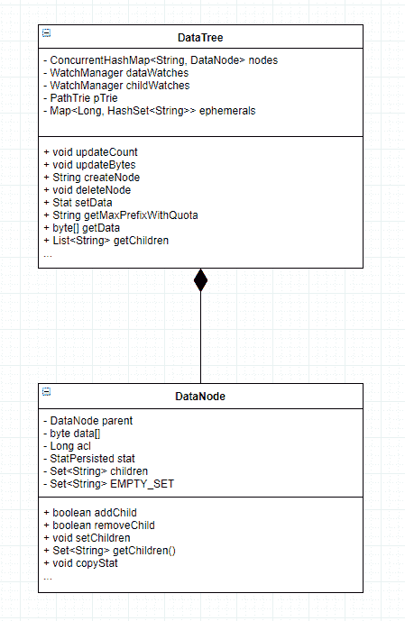
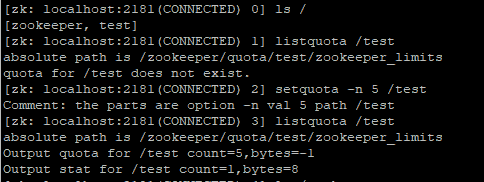
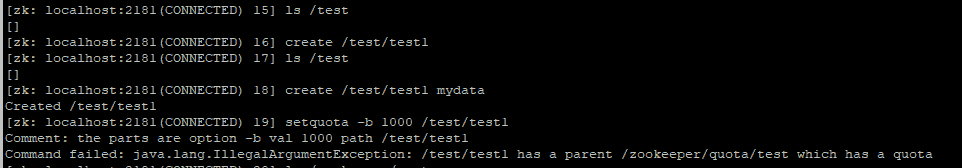
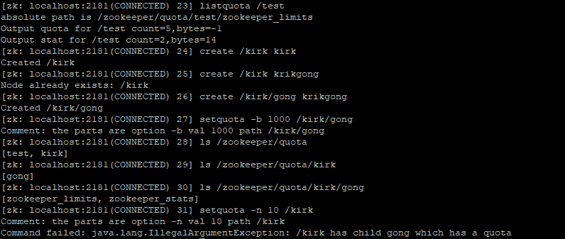

# Zookeeper 源码阅读（二）数据存储

> 原文：[https://www.cnblogs.com/gongcomeon/p/9630572.html](https://www.cnblogs.com/gongcomeon/p/9630572.html)

### 前言

在开始写具体的逻辑之前，还需要把 zk 的数据管理和事务的日志与保存了解得更深入一些。这部分内容不少，下面几篇都会是相关的内容。

### 内存数据

zk 的数据结构模型是基于 ZNode 的树状模型。在 ZK 内部通过类似内存数据库的方式保存了整棵树的内容，并定时写入磁盘。

zk 的内存数据放在 DataTree 中，它是 zk 内存数据存储的核心，也是一个树形结构。

```java
/**
 * This class maintains the tree data structure. It doesn't have any networking
 * or client connection code in it so that it can be tested in a stand alone
 * way.
 * <p>
 * The tree maintains two parallel data structures: a hashtable that maps from
 * full paths to DataNodes and a tree of DataNodes. All accesses to a path is
 * through the hashtable. The tree is traversed only when serializing to disk.
 */
public class DataTree {
    private static final Logger LOG = LoggerFactory.getLogger(DataTree.class);

    /**
     * This hashtable provides a fast lookup to the datanodes. The tree is the
     * source of truth and is where all the locking occurs
     */
    private final ConcurrentHashMap<String, DataNode> nodes =
        new ConcurrentHashMap<String, DataNode>();

    private final WatchManager dataWatches = new WatchManager();

    private final WatchManager childWatches = new WatchManager();

    /** the root of zookeeper tree */
    private static final String rootZookeeper = "/";

    /** the zookeeper nodes that acts as the management and status node **/
    private static final String procZookeeper = Quotas.procZookeeper;

    /** this will be the string thats stored as a child of root */
    private static final String procChildZookeeper = procZookeeper.substring(1);

    /**
     * the zookeeper quota node that acts as the quota management node for
     * zookeeper
     */
    private static final String quotaZookeeper = Quotas.quotaZookeeper;

    /** this will be the string thats stored as a child of /zookeeper */
    private static final String quotaChildZookeeper = quotaZookeeper
            .substring(procZookeeper.length() + 1);

    /**
     * the path trie that keeps track fo the quota nodes in this datatree
     */
    private final PathTrie pTrie = new PathTrie();

    /**
     * This hashtable lists the paths of the ephemeral nodes of a session.
     */
    private final Map<Long, HashSet<String>> ephemerals =
        new ConcurrentHashMap<Long, HashSet<String>>();

    private final ReferenceCountedACLCache aclCache = new ReferenceCountedACLCache();
    ... 
```

可以看到 DataTree 主要和四个类有关联关系，即 DataNode，Quotas，PathTrie，StatsTrack。接下来会逐个说一下。

#### DataNode

DataNode 类是 zookeeper 中数据存储的最小单元。在 DataTree 中，`private final ConcurrentHashMap<String, DataNode> nodes = new ConcurrentHashMap<String, DataNode>();`所有的 datanode 存在一个 concurrentHashMap 中，对 zk 中所有的 znode 进行操作，其实底层就是对这个 map 进行操作。其中 path 是 key，datanode 是 value。

特别的是，对于所有的临时节点，`private final Map<Long, HashSet<String>> ephemerals = new ConcurrentHashMap<Long, HashSet<String>>();`专门有一个 map 去存它们，便于实时的访问和 session 结束后的集中清理。



其中，DataNode 类的代码：

```java
public class DataNode implements Record {
    /** the parent of this datanode */
    DataNode parent;

    /** the data for this datanode */
    byte data[];

    /**
     * the acl map long for this datanode. the datatree has the map
     */
    Long acl;

    /**
     * the stat for this node that is persisted to disk.
     */
    public StatPersisted stat;

    /**
     * the list of children for this node. note that the list of children string
     * does not contain the parent path -- just the last part of the path. This
     * should be synchronized on except deserializing (for speed up issues).
     */
    private Set<String> children = null; 
```

可以看到，DataNode 中存储的信息共有三类，数据内容 data[]，acl 列表和节点状态 stat。其中数据内容和节点状态就是在客户端上 getdata 获取到的那些数据。同时，DataNode 中还记录了节点的父节点和子节点列表，并提供了对子节点列表的操作。

加孩子：

```java
/**
 * Method that inserts a child into the children set
 * 
 * @param child
 *            to be inserted
 * @return true if this set did not already contain the specified element
 */
public synchronized boolean addChild(String child) {
    if (children == null) {
        // let's be conservative on the typical number of children
        children = new HashSet<String>(8);//初始化
    }
    return children.add(child);//加入 set 中
} 
```

删孩子：

```java
/**
 * Method that removes a child from the children set
 * 
 * @param child
 * @return true if this set contained the specified element
 */
public synchronized boolean removeChild(String child) {
    if (children == null) {
        return false;
    }
    return children.remove(child);//把孩子从 set 中移除
} 
```

get/set:

```java
/**
 * convenience method for setting the children for this datanode
 * 
 * @param children
 */
public synchronized void setChildren(HashSet<String> children) {
    this.children = children;
}

/**
 * convenience methods to get the children
 * 
 * @return the children of this datanode
 */
public synchronized Set<String> getChildren() {//get/set 中都加同步，避免了多线程请求时对共享变量形成竞态条件
    if (children == null) {
        return EMPTY_SET;
    }

    return Collections.unmodifiableSet(children);
} 
```

都是很简单的方法，配合注释应该很容易看懂。

#### Quotas

在看后面的内容前，强烈建议看一看[zk 权限管理与配额](http://www.cnblogs.com/linuxbug/p/5023677.html)。Quotas 其实就是为 ZNode 设置的节点个数和数据量大小的限制（只是在日志中会提醒，并不是真正限制）。

```java
public class Quotas {

    /** the zookeeper nodes that acts as the management and status node **/
    public static final String procZookeeper = "/zookeeper";

    /** the zookeeper quota node that acts as the quota
     * management node for zookeeper */
    public static final String quotaZookeeper = "/zookeeper/quota";

    /**
     * the limit node that has the limit of
     * a subtree
     */
    public static final String limitNode = "zookeeper_limits";

    /**
     * the stat node that monitors the limit of
     * a subtree.
     */
    public static final String statNode = "zookeeper_stats"; 
```

limitnode 和 statnode 的区别：一个是在 set quota 是的限制，一个是真实的情况。这个会在后面说 PathTrie 的时候说下。这里说明一点，所有成功设立了 quota 的节点都会在/zookeeper/quota 下建立一个树形的数据结构，并且每个节点都会有两个孩子接点，即 path+"zookeeper_limits"和 path+"zookeeper_stats"。分别对应上面的 limitnode 和 statnode。特别的是，前面这句话中成功设立是有条件的，如果发现有父节点或者兄弟孩子节点有 quota，那么设置 quota 会失败。

```java
public static String quotaPath(String path) {
    return quotaZookeeper + path +
    "/" + limitNode;//limitnode
} 
```

```java
public static String statPath(String path) {
    return quotaZookeeper + path + "/" +
    statNode;//statnode
} 
```

上面两个方法负责 statnode 和 limitnode 的路径生成。

#### PathTrie

关于字典树的简介，可以看一下 [浅谈字典树](https://www.cnblogs.com/TheRoadToTheGold/p/6290732.html)。我自己简单理解了一下，大概就是如果单词有公共字串（从第一个字母开始的），那么这部分公用，剩下的再建立新的接点。

```java
public class PathTrie {
    /**
     * the logger for this class
     */
    private static final Logger LOG = LoggerFactory.getLogger(PathTrie.class);

    /**
     * the root node of PathTrie
     */
    private final TrieNode rootNode ;

    static class TrieNode {
        boolean property = false;//表示当前节点是否有配额
        final HashMap<String, TrieNode> children;
        TrieNode parent = null; 
```

结构很简单，就是典型的树结构，其中静态内部类 TrieNode 是节点。

前面说到的一点，果发现有父节点或者兄弟孩子节点有 quota，那么设置 quota 会失败。为什么会这样其实是在 PathTrie 里控制的，而且这点之前看了很多博客都没提到，一定要注意。







可以从上面三张图片里看到，一旦给一个节点加了 quota 之后，给它的父节点和子节点加 quota 都会失败。

原因：

```java
public void addPath(String path) {
    if (path == null) {
        return;
    }
    String[] pathComponents = path.split("/");//把路径按照/分开
    TrieNode parent = rootNode;
    String part = null;
    if (pathComponents.length <= 1) {
        throw new IllegalArgumentException("Invalid path " + path);
    }
    for (int i=1; i<pathComponents.length; i++) {//一层一层查
        part = pathComponents[i];
        if (parent.getChild(part) == null) {
            parent.addChild(part, new TrieNode(parent));////找到位置，插入
        }
        parent = parent.getChild(part);
    }
    parent.setProperty(true);
} 
```

从这里看，确实是按照字典树的规则插入的，但是在 zk 接受客户端命令的位置在 ZookeeperMain 中 processCMD 方法中：

```java
if (cmd.equals("setquota") && args.length >= 4) {
    String option = args[1];
    String val = args[2];
    path = args[3];
    System.err.println("Comment: the parts are " +
                       "option " + option +
                       " val " + val +
                       " path " + path);
    if ("-b".equals(option)) {
        // we are setting the bytes quota
        createQuota(zk, path, Long.parseLong(val), -1);//发送 setquota 命令后真正添加节点的
    } else if ("-n".equals(option)) {
        // we are setting the num quota
        createQuota(zk, path, -1L, Integer.parseInt(val));
    } else {
        usage();
    }

} 
```

这里可以看到 setquota 中有一个 createQuota 方法，其中:

```java
/ check for more than 2 children --
// if zookeeper_stats and zookeeper_qutoas
// are not the children then this path
// is an ancestor of some path that
// already has quota
String realPath = Quotas.quotaZookeeper + path;
//检查孩子节点中是否已经有 quota
try {
    List<String> children = zk.getChildren(realPath, false);
    for (String child: children) {
        if (!child.startsWith("zookeeper_")) {
            throw new IllegalArgumentException(path + " has child " +
                    child + " which has a quota");
        }
    }
} catch(KeeperException.NoNodeException ne) {
    // this is fine
}

//check for any parent that has been quota
//检查父节点中是否有 quota，可以点进去看，逻辑和判断孩子的差不多的。
checkIfParentQuota(zk, path); 
```

在这里判断了一下后，这也就导致了我先前描述的那种情况，为什么在父节点和子节点有 quota 时无法添加的 quota。特别重要的是，这个判断在客户端就完成了判断。如果父节点和子节点没有 quota，客户端会发送请求到服务端创建节点(代码在 ZookeeperMain 中)，如下所示：

！！！这里我之前说错了！！！！并不是仅仅依靠客户端就完成了判断，需要与服务器通信的。List <string>children = zk.getChildren(realPath, false);这里 getChildren 其实是一个与服务端通信的动作。</string>

```java
if (zk.exists(quotaPath, false) == null) {
    try {
    	//在 create 内部会将请求发送到服务器端。
        zk.create(Quotas.procZookeeper, null, Ids.OPEN_ACL_UNSAFE,
                CreateMode.PERSISTENT);
        zk.create(Quotas.quotaZookeeper, null, Ids.OPEN_ACL_UNSAFE,
                CreateMode.PERSISTENT);
    } catch(KeeperException.NodeExistsException ne) {
        // do nothing
    }
} 
```

如果想了解字典树的添加和删除，可以看一下 [Zk 数据模型-配额](https://www.jianshu.com/p/e60e292eff24)。

#### StatsTrack

StatsTrack 其实就是记录某个接点实际的 count 和 bytes 信息。

```java
/**
 * a class that represents the stats associated with quotas
 */
public class StatsTrack {
    private int count;
    private long bytes;
    private String countStr = "count";
    private String byteStr = "bytes"; 
```

StatsTrack 其实就是个实体类，存的就是字典树中 statnode 节点的数据。下面的代码就是生成 statnode 时的代码，可以看到，是把 statstrack 转化为字符串后放入 statnode 中作为它的内容。

```java
StatsTrack strack = new StatsTrack(null);
strack.setBytes(bytes);
strack.setCount(numNodes);
try {
    zk.create(quotaPath, strack.toString().getBytes(),
            Ids.OPEN_ACL_UNSAFE, CreateMode.PERSISTENT);
    StatsTrack stats = new StatsTrack(null);
    stats.setBytes(0L);
    stats.setCount(0);
    zk.create(statPath, stats.toString().getBytes(),
            Ids.OPEN_ACL_UNSAFE, CreateMode.PERSISTENT);
} 
```

### 思考：

有时间可以再仔细研究研究 quotas 的原理。

不清楚的几点：

为什么父节点、子节点有 quota 就不让添加了呢？？？为什么要这样设计。