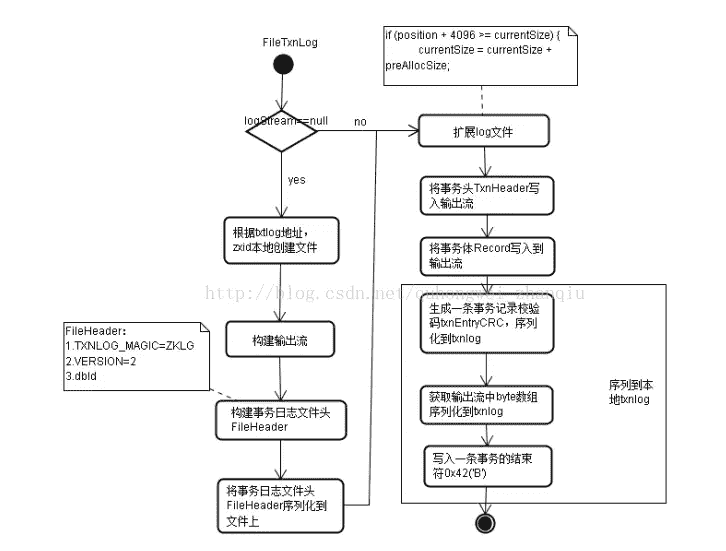
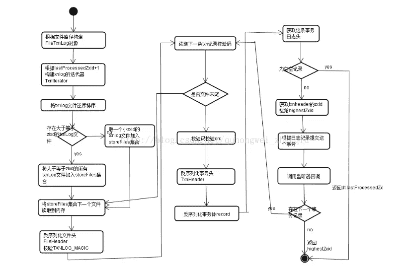

# Zookeeper 源码阅读（三）数据存储-日志

> 原文：[https://www.cnblogs.com/gongcomeon/p/9665285.html](https://www.cnblogs.com/gongcomeon/p/9665285.html)

### 前言

接着上篇的内容，上一篇主要说了下 Zookeeper 内部的数据存储基本单位 datanode 和内存中维护的 Datatree，还有和配额有关的三个实体类。具体在 zk 初始化时是怎么生成 datatree 等等后面会说。这一篇主要说下事务日志，后面也有用到。

### 事务日志

关于 zookeeper 事务日志的格式，可以参考下 [zk 事务日志](https://blog.csdn.net/quhongwei_zhanqiu/article/details/45647687)，其实简单说也就是 header+body 两个部分，header 有版本等信息，是定长的。而 body 不是，body 里放的就是真正要存的那些操作的信息和校验值等。

org.apache.zookeeper.server.persistence.TxnLog 这个接口里定义了事务日志的一些方法，具体含义在它的实现类中解释。

下面是 TxnLog 的实现类 FileTxnLog 中关于事务日志格式的解释，很简单。

```java
/**
 * This class implements the TxnLog interface. It provides api's
 * to access the txnlogs and add entries to it.
 * <p>
 * The format of a Transactional log is as follows:
 * <blockquote><pre>
 * LogFile:
 *     FileHeader TxnList ZeroPad
 * 
 * FileHeader: {
 *     magic 4bytes (ZKLG)
 *     version 4bytes
 *     dbid 8bytes//暂时没用
 *   }
 * 
 * TxnList:
 *     Txn || Txn TxnList
 *     
 * Txn:
 *     checksum Txnlen TxnHeader Record 0x42
 * 
 * checksum: 8bytes Adler32 is currently used
 *   calculated across payload -- Txnlen, TxnHeader, Record and 0x42
 * 
 * Txnlen:
 *     len 4bytes
 * 
 * TxnHeader: {
 *     sessionid 8bytes
 *     cxid 4bytes
 *     zxid 8bytes
 *     time 8bytes
 *     type 4bytes
 *   }
 *     
 * Record:
 *     See Jute definition file for details on the various record types
 *      
 * ZeroPad:
 *     0 padded to EOF (filled during preallocation stage)
 * </pre></blockquote> 
 */ 
```

下面可以通过 FileTxnLog 的几个主要方法来看下生成事务日志的主要流程：

##### 日志的写入：

```java
public synchronized boolean append(TxnHeader hdr, Record txn)
    throws IOException
{
    //TxnHeader 不可以为空
    if (hdr == null) {
        return false;
    }

    //根据事务 id 来判断目前最大的 zxid，为了判断是否是和上一个可写的事务日志有关联。
    if (hdr.getZxid() <= lastZxidSeen) {
        LOG.warn("Current zxid " + hdr.getZxid()
                + " is <= " + lastZxidSeen + " for "
                + hdr.getType());
    } else {
        lastZxidSeen = hdr.getZxid();
    }

	//logStream 即日志流为空，用来存序列化数据
    if (logStream==null) {
        if(LOG.isInfoEnabled()){
            LOG.info("Creating new log file: log." +
                    Long.toHexString(hdr.getZxid()));
        }

		//根据 zxid 创建新的文件，这里貌似有更新，根据一些博客和书，以前只有在没有关联以前的事务日志时会创建新文件，现在看代码感觉只会在 log 中有 warn，还是会创建新文件
        logFileWrite = new File(logDir, ("log." +
                Long.toHexString(hdr.getZxid())));
        //两个流
        fos = new FileOutputStream(logFileWrite);
        logStream=new BufferedOutputStream(fos);
        oa = BinaryOutputArchive.getArchive(logStream);
        FileHeader fhdr = new FileHeader(TXNLOG_MAGIC,VERSION, dbId);
        fhdr.serialize(oa, "fileheader");
        // Make sure that the magic number is written before padding.
        //提取文件流
        logStream.flush();
        currentSize = fos.getChannel().position();
        streamsToFlush.add(fos);
    }
    //这一步判断剩余空间不足 4k 时填充文件至 64M，为了效率，具体的应该是利用操作系统底层的原理。我的理解是一次开一大片区域，这样就不用每次写文件的时候硬盘去寻址什么的了。以后可以研究下。
    padFile(fos);
    //把事务头和事务体序列化
    byte[] buf = Util.marshallTxnEntry(hdr, txn);
    if (buf == null || buf.length == 0) {
        throw new IOException("Faulty serialization for header " +
                "and txn");
    }
    //生成校验值，用了 Adler32 算法
    Checksum crc = makeChecksumAlgorithm();
    crc.update(buf, 0, buf.length);
    //写入 buffer 流中
    oa.writeLong(crc.getValue(), "txnEntryCRC");
    Util.writeTxnBytes(oa, buf);

    return true;
} 
```

配合图片（来自 [斩秋的专栏](https://blog.csdn.net/quhongwei_zhanqiu?viewmode=contents)）看更好理解：



在整个写入的方法中总共有 5 步：

1.  基本校验即文件名中 zxid 的生成，文件的生成；
2.  预分配空间
3.  事务序列化
4.  生成校验
5.  写入 buffer 流。

在上面代码的注释中应该清楚得能看出。

另外，zookeeper 里是在 SyncRequestProcessor 类中写入日志文件的，大致的策略就是从请求写入的栈中 pop 出记录，一条一条写入，同时，在写入时会又 count 去记录，如果 count 大于 snapCount / 2 + randRoll，snapcount 时可配的，而 randRoll 是基于 snapcount 生成的随机值，此时就会 rolllog。开启一个新文件的写入。

但是这时候还没有写入文件！！！只在 buffer 流中。真正写入文件是在 commit 方法中。

```java
public synchronized void commit() throws IOException {
    if (logStream != null) {
        logStream.flush();
    }
    for (FileOutputStream log : streamsToFlush) {
        //这里提取文件流
        log.flush();
        //可以通过设置 zookeeper.forceSync 来控制是否需要主动调用该接口，对应这里的 forceSync
        if (forceSync) {
            long startSyncNS = System.nanoTime();
            //写入
            log.getChannel().force(false);

            long syncElapsedMS =
                TimeUnit.NANOSECONDS.toMillis(System.nanoTime() - startSyncNS);
            if (syncElapsedMS > fsyncWarningThresholdMS) {
                LOG.warn("fsync-ing the write ahead log in "
                        + Thread.currentThread().getName()
                        + " took " + syncElapsedMS
                        + "ms which will adversely effect operation latency. "
                        + "See the ZooKeeper troubleshooting guide");
            }
        }
    }
    while (streamsToFlush.size() > 1) {
        streamsToFlush.removeFirst().close();
    }
} 
```

##### 获取日志文件：

```java
public static File[] getLogFiles(File[] logDirList,long snapshotZxid) {
    List<File> files = Util.sortDataDir(logDirList, "log", true);
    long logZxid = 0;
    // Find the log file that starts before or at the same time as the
    // zxid of the snapshot
    //目的就是为了找到在快照之前的最大的那个 file 的 zxid，最大的肯定是最接近快照 id 的。
    for (File f : files) {
        //从名字中取 zxid
        long fzxid = Util.getZxidFromName(f.getName(), "log");
        if (fzxid > snapshotZxid) {
            continue;
        }
        // the files
        // are sorted with zxid's
        if (fzxid > logZxid) {
            logZxid = fzxid;
        }
    }
    List<File> v=new ArrayList<File>(5);
    //遍历，把所有早于这个 id 的文件都不要。
    for (File f : files) {
        long fzxid = Util.getZxidFromName(f.getName(), "log");
        if (fzxid < logZxid) {
            continue;
        }
        //只要大于前面选出来的 logZxid 的文件
        v.add(f);
    }
    return v.toArray(new File[0]);

} 
```

##### 获取日志中最近的 zxid：

```java
public long getLastLoggedZxid() {
    File[] files = getLogFiles(logDir.listFiles(), 0);
    //前面拿出来的 files 就是所有的 log 文件，这一步找到最大的 zxid 所在的那个文件的文件名中的 zxid
    long maxLog=files.length>0?
            Util.getZxidFromName(files[files.length-1].getName(),"log"):-1;

    // if a log file is more recent we must scan it to find
    // the highest zxid
    long zxid = maxLog;
    TxnIterator itr = null;
    try {
        FileTxnLog txn = new FileTxnLog(logDir);
         //所有 id>maxlog 的文件的都在 itr 中
        //更新：又看了下这里的代码，这个 read 函数是这里最核心的部分，内部构造了一个迭代器，会根据传入的 zxid 定位到对应文件的位置并以依次访问
        //https://www.cnblogs.com/leesf456/p/6279956.html 这篇博客这里写的很好，可以看。
        itr = txn.read(maxLog);
        while (true) {
            if(!itr.next())
                break;
            TxnHeader hdr = itr.getHeader();
            zxid = hdr.getZxid();
        }
    } catch (IOException e) {
        LOG.warn("Unexpected exception", e);
    } finally {
        close(itr);
    }
    return zxid;
} 
```

##### 可以看下 [filetxnlog 解析](https://blog.csdn.net/quhongwei_zhanqiu/article/details/45647713)关于 read 的描述很棒。

可以结合下面这张解释反序列化的图看，主要是 FileTxnIteratorz 这个迭代器的 init 方法里把所有的日志按需排列之后根据 zxid 去读的逻辑。



##### 删除日志：

```java
public boolean truncate(long zxid) throws IOException {
    FileTxnIterator itr = null;
    try {
        itr = new FileTxnIterator(this.logDir, zxid);
        PositionInputStream input = itr.inputStream;
        if(input == null) {
            throw new IOException("No log files found to truncate! This could " +
                    "happen if you still have snapshots from an old setup or " +
                    "log files were deleted accidentally or dataLogDir was changed in zoo.cfg.");
        }
        //在上面创建 FileTxnIterator 时位置就已经计算好了，如果大于这个 zxid 的全删掉，包含这个 zxid 的会删这个文件内大于这个 zxid 的部分。
        long pos = input.getPosition();
        // now, truncate at the current position
        RandomAccessFile raf = new RandomAccessFile(itr.logFile, "rw");
        raf.setLength(pos);
        raf.close();
        while (itr.goToNextLog()) {
            if (!itr.logFile.delete()) {
                LOG.warn("Unable to truncate {}", itr.logFile);
            }
        }
    } finally {
        close(itr);
    }
    return true;
} 
```

在 zk 恢复时，非 leader 机器上比 leader 服务器的 zxid 大的所有事务都要删掉。因为 zk 的原则时只要集群中有 leader，那么所有机器必须与 leader 同步！一旦有这种情况，leader 会给这台机器发送 TRUNC 命令，然后就会进行这个日志截断的方法。

##### 日志滚动

```java
/**
 * rollover the current log file to a new one.
 * @throws IOException
 */
public synchronized void rollLog() throws IOException {
    if (logStream != null) {
        this.logStream.flush();
        this.logStream = null;
        oa = null;
    }
} 
```

光看这里其实挺难理解这个函数的意义，结合在 SyncRequestProcessor 的使用

```java
if (zks.getZKDatabase().append(si)) {
    logCount++;
    //上面说 append 方法的时候说到的产生新文件的条件
    if (logCount > (snapCount / 2 + randRoll)) {
        setRandRoll(r.nextInt(snapCount/2));
        // roll the log
        //结合这里去看就知道在这里把 logStream 原有的 buffer 取出然后设置成 null，这样下次写的时候就会创建新的日志文件
        zks.getZKDatabase().rollLog();
        // take a snapshot
        if (snapInProcess != null && snapInProcess.isAlive()) {
            LOG.warn("Too busy to snap, skipping");
        } else {
            snapInProcess = new ZooKeeperThread("Snapshot Thread") {
                    public void run() {
                        try {
                            zks.takeSnapshot();
                        } catch(Exception e) {
                            LOG.warn("Unexpected exception", e);
                        }
                    }
                };
            snapInProcess.start();
        }
        logCount = 0;
    }
} 
```

##### 可视化

Zk 提供了一个负责可视化的工具类 LogFormatter，里面有一个 main 方法可以直接执行去可视化 log 文件。里面的逻辑大体上说是简易版的 read 方法。

[zk 持久化](https://www.jianshu.com/p/fa06e241b158)这个博客里做了一个简单的 demo，可以看看。之前也跑过这个类，也发现了和博主一样的问题，就是序列化和反序列化的 tag 不一样，还不太清楚为啥能正常工作。。。

### 思考

大概知道了怎么去写日志和度日志，但是有几点不是很清楚：

rolllog，append，commit 这些里面都会有 stream 的 flush，commit 里强制调用了 force 方法才会强制操作系统写入硬盘，这个还需要再了解了解工作原理；

为什么在写入和可视化的时候用不同的 tag 能正常解析？？？

Adler32 算法的工作原理