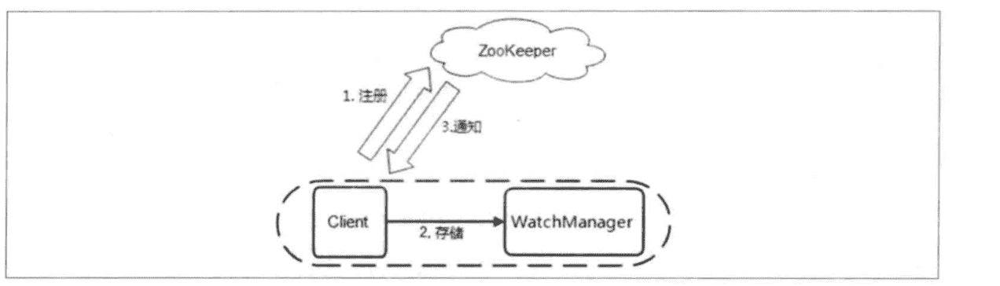
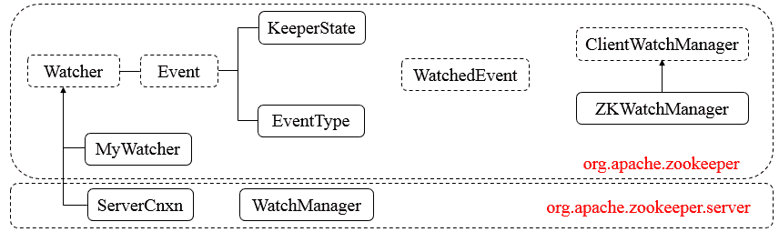
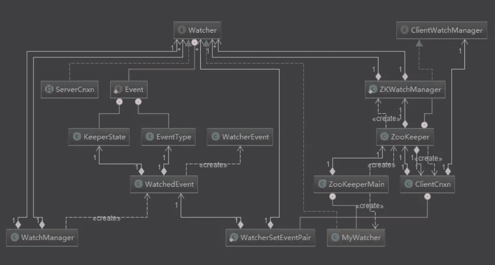
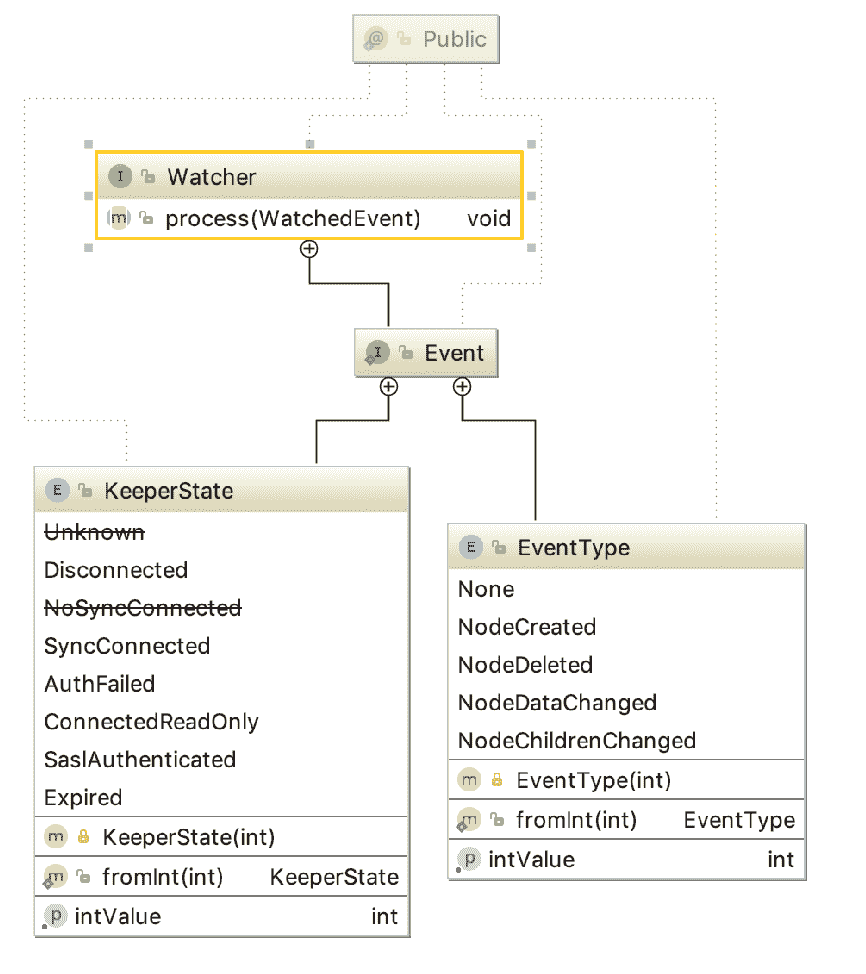
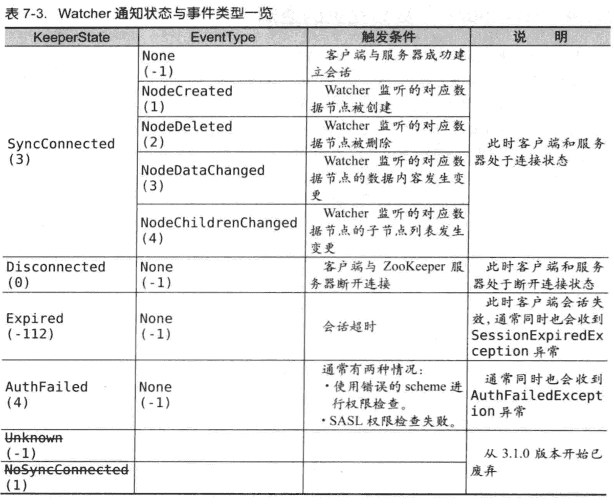

# Zookeeper 源码阅读（六） Watcher

> 原文：[https://www.cnblogs.com/gongcomeon/p/9919698.html](https://www.cnblogs.com/gongcomeon/p/9919698.html)

### 前言

继上次分析了 ZK 的 ACL 相关代码后，ZK 里非常重要的另一个特性就是 Watcher 机制了。其实在我看来，就 ZK 的使用而言，Watche 机制是最核心的特性也不为过了！这一篇先简单介绍下 watcher 相关的实体类和接口。

### Watcher 机制

在 ZK 中，客户端可以为 znode 向服务端注册监听，当相应 znode 的指定事件被触发时，服务端就会向客户端发送通知，而客户端收到通知后也会执行相应的响应逻辑。整体逻辑如下：



Watcher 特性：

1.  一次性：每次注册的 watcher 只能被触发一次，之后就会被删除，如果想继续触发需要注册新的 watcher；
2.  串行性：客户端执行 watcher 是一个串行过程；
3.  轻量性：watcher 仅包含通知状态、事件类型和节点路径。

### Watcher 总体框架

看 Watcher 相关的代码和写这篇博客参考了很多资料，首先列一下 Watcher 的总体的框架：



上面两幅图能很清楚的看到和 Watcher 有关的接口和类的结构，简单介绍下它们的功能：

Watcher 和 Event 接口：使用过 ZK 的人对 Watcher 接口应该很熟悉，内部定义的 process 方法是 watcher 被触发是 zk 调用的方法。同时，watcher 内部有内部接口 Event，定义了事件的类型（连接状态 KeeperState 和 znode 的变化状态 EventType）；

WatchedEvent 接口：连接状态和 znode 的变化状态以及 znode 的路径；

WatcherEvent 接口：内容和 WatchedEvent 一模一样，但是是负责网络传输的，由 jute 生成。

ClientWatchManager 接口：根据 event 返回相应的 watcher(Return a set of watchers that should be notified of the event.)。定义了 materialize 方法。ZKWatchManager 实现了这个接口。

### 代码分析

#### Watcher 接口



这是 watcher 接口和两个内部枚举之间的类图关系，详细看下代码：

```java
/**
 * This interface specifies the public interface an event handler class must
 * implement. A ZooKeeper client will get various events from the ZooKeeper
 * server it connects to. An application using such a client handles these
 * events by registering a callback object with the client. The callback object
 * is expected to be an instance of a class that implements Watcher interface.
 * 
 */
@InterfaceAudience.Public
public interface Watcher {

    /**
     * This interface defines the possible states an Event may represent
     */
    @InterfaceAudience.Public
    //内部接口 Event，表示事件的状态
    public interface Event {
        /**
         * Enumeration of states the ZooKeeper may be at the event
         */
        @InterfaceAudience.Public
        //内部枚举，连接状态
        public enum KeeperState {
            /** Unused, this state is never generated by the server */
            @Deprecated
            Unknown (-1),

            /** The client is in the disconnected state - it is not connected
             * to any server in the ensemble. */
             //断开连接-0
            Disconnected (0),

            /** Unused, this state is never generated by the server */
            @Deprecated
            NoSyncConnected (1),

            /** The client is in the connected state - it is connected
             * to a server in the ensemble (one of the servers specified
             * in the host connection parameter during ZooKeeper client
             * creation). */
             //连接状态-3
            SyncConnected (3),

            /**
             * Auth failed state
             */
             //认证失败
            AuthFailed (4),

            /**
             * The client is connected to a read-only server, that is the
             * server which is not currently connected to the majority.
             * The only operations allowed after receiving this state is
             * read operations.
             * This state is generated for read-only clients only since
             * read/write clients aren't allowed to connect to r/o servers.
             */
             //连接到 read-only 的 server
            ConnectedReadOnly (5),

            /**
              * SaslAuthenticated: used to notify clients that they are SASL-authenticated,
              * so that they can perform Zookeeper actions with their SASL-authorized permissions.
              */
              //Sasl 认证通过-6
            SaslAuthenticated(6),

            /** The serving cluster has expired this session. The ZooKeeper
             * client connection (the session) is no longer valid. You must
             * create a new client connection (instantiate a new ZooKeeper
             * instance) if you with to access the ensemble. */
             //session 过期状态-(-112)
            Expired (-112);

			//intValue 用来表示当前的连接状态
            private final int intValue;     // Integer representation of value
                                            // for sending over wire
			//构造器
            KeeperState(int intValue) {
                this.intValue = intValue;
            }

			//返回整型值
            public int getIntValue() {
                return intValue;
            }

			//int->状态
            public static KeeperState fromInt(int intValue) {
                switch(intValue) {
                    case   -1: return KeeperState.Unknown;
                    case    0: return KeeperState.Disconnected;
                    case    1: return KeeperState.NoSyncConnected;
                    case    3: return KeeperState.SyncConnected;
                    case    4: return KeeperState.AuthFailed;
                    case    5: return KeeperState.ConnectedReadOnly;
                    case    6: return KeeperState.SaslAuthenticated;
                    case -112: return KeeperState.Expired;

                    default:
                        throw new RuntimeException("Invalid integer value for conversion to KeeperState");
                }
            }
        }

        /**
         * Enumeration of types of events that may occur on the ZooKeeper
         */
        @InterfaceAudience.Public
        //事件类型
        public enum EventType {
            None (-1),//无事件
            NodeCreated (1),//创建节点
            NodeDeleted (2),//删除节点
            NodeDataChanged (3),//节点数据改变
            NodeChildrenChanged (4);//节点的孩子节点发生 change

			//时间整型值
            private final int intValue;     // Integer representation of value
                                            // for sending over wire
			//构造器
            EventType(int intValue) {
                this.intValue = intValue;
            }
			//获取整型值
            public int getIntValue() {
                return intValue;
            }
			//int->事件类型
            public static EventType fromInt(int intValue) {
                switch(intValue) {
                    case -1: return EventType.None;
                    case  1: return EventType.NodeCreated;
                    case  2: return EventType.NodeDeleted;
                    case  3: return EventType.NodeDataChanged;
                    case  4: return EventType.NodeChildrenChanged;

                    default:
                        throw new RuntimeException("Invalid integer value for conversion to EventType");
                }
            }           
        }
    }

	//回调方法
    abstract public void process(WatchedEvent event);
} 
```

为了更简洁的说明 Event 接口中两种状态在实际使用时的情况，用《从 zk 到 paxos》中的表来表示下：



特别的说明：

1.  NodeDataChanged 事件包含 znode 的 dataversion 和 data 本身的修改均会触发 Watcher，所以即使用相同内容来更新 data，dataversion 依然会更新；NodeChildrenDataChanged 则指的是子节点列表发生变化，如节点增加或删除时会触发。
2.  AuthFailed 和 NoAuth 是两种状态，前者是 auth 的模式不对（例如选择了 digest1，而不是正确的 digest 模式），后者是表示 auth 信息不对。
3.  process 这个回调方法非常重要。当 zk 向客户端发送一个 watcher 通知时，客户端就会对相应的 process 方法进行回调，从而实现对事件的处理。

#### WatchedEvent 和 WatcherEvent

```java
/**
 *  A WatchedEvent represents a change on the ZooKeeper that a Watcher
 *  is able to respond to.  The WatchedEvent includes exactly what happened,
 *  the current state of the ZooKeeper, and the path of the znode that
 *  was involved in the event.
 */
@InterfaceAudience.Public
public class WatchedEvent {
    final private KeeperState keeperState;//连接状态
    final private EventType eventType;//事件类型
    private String path;//路径 
```

WatchedEvent 用来封装服务端事件并传递给 Watcher，从而方便回调方法 process 来处理。

WatcherEvetn 从内容含义上来说和 WatchedEvent 是一样的，只是 WatcherEvent 实现了 Record 接口，方便序列化来进行网络传输。

```java
public class WatcherEvent implements Record {
  private int type;//事件类型
  private int state;//连接状态
  private String path;//路径 
```

特别的是，WatchedEvent 中的 getWrapper 方法就是把 WatchedEvent 包装成 WatcherEvent，代码很简单：

```java
/**
 *  Convert WatchedEvent to type that can be sent over network
 */
public WatcherEvent getWrapper() {
    return new WatcherEvent(eventType.getIntValue(), //调用 watcherevent 的构造函数
                            keeperState.getIntValue(), 
                            path);
} 
```

#### ClientWatchManager 和 ZKWatchManager

ClientWatchManager 是根据获得的 Event 得到需要通知的 watcher。

```java
public interface ClientWatchManager {
    /**
     * Return a set of watchers that should be notified of the event. The 
     * manager must not notify the watcher(s), however it will update it's 
     * internal structure as if the watches had triggered. The intent being 
     * that the callee is now responsible for notifying the watchers of the 
     * event, possibly at some later time.
     * 
     * @param state event state
     * @param type event type
     * @param path event path
     * @return may be empty set but must not be null
     */
    public Set<Watcher> materialize(Watcher.Event.KeeperState state,
        Watcher.Event.EventType type, String path); 
```

其实现类 ZKWatchManager 在 Zookeeper 类中：

```java
/**
 * Manage watchers & handle events generated by the ClientCnxn object.
 * 可以看到这个类的目的是为了处理有 clientCnxn 获取的 events 和相关的 watcher
 * We are implementing this as a nested class of ZooKeeper so that
 * the public methods will not be exposed as part of the ZooKeeper client
 * API.
 */
private static class ZKWatchManager implements ClientWatchManager {
    private final Map<String, Set<Watcher>> dataWatches =
        new HashMap<String, Set<Watcher>>();//通过 getdata 设置的 watch
    private final Map<String, Set<Watcher>> existWatches =
        new HashMap<String, Set<Watcher>>();//通过 exists 设置的 watch
    private final Map<String, Set<Watcher>> childWatches =
        new HashMap<String, Set<Watcher>>();//通过 getchildren 设置的 watch

    private volatile Watcher defaultWatcher;//client 在和 zookeeper 建立连接时传递的 watcher

    final private void addTo(Set<Watcher> from, Set<Watcher> to) {
        if (from != null) {
            to.addAll(from);
        }
    }

    /* (non-Javadoc)
     * @see org.apache.zookeeper.ClientWatchManager#materialize(Event.KeeperState, 
     *                                                        Event.EventType, java.lang.String)
     */
    @Override
    public Set<Watcher> materialize(Watcher.Event.KeeperState state,
                                    Watcher.Event.EventType type,
                                    String clientPath)
    {
        //相关的 watcher 集合
        Set<Watcher> result = new HashSet<Watcher>();

        switch (type) {
        case None://事件类型是 none
            result.add(defaultWatcher);//把 defaultWatcher 加入
            //是否清空，根据 zookeeper.disableAutoWatchReset 字段进行配置的值、Zookeeper 的状态是否为同步连接来判断
            boolean clear = ClientCnxn.getDisableAutoResetWatch() &&
                    state != Watcher.Event.KeeperState.SyncConnected;//

            //datawatches 同步块
            synchronized(dataWatches) {
                for(Set<Watcher> ws: dataWatches.values()) {
                    result.addAll(ws);//把所有的 watcher 加入...含义应该是建立连接后如果连接断开或超时会清空所有的 watcher
                }
                if (clear) {//如果要清空
                    dataWatches.clear();
                }
            }

            synchronized(existWatches) {//同上
                for(Set<Watcher> ws: existWatches.values()) {
                    result.addAll(ws);
                }
                if (clear) {
                    existWatches.clear();
                }
            }

            synchronized(childWatches) {//同上
                for(Set<Watcher> ws: childWatches.values()) {
                    result.addAll(ws);
                }
                if (clear) {
                    childWatches.clear();
                }
            }

            return result;
        case NodeDataChanged:
        case NodeCreated://nodedatachange 和新建 node
            synchronized (dataWatches) {
                addTo(dataWatches.remove(clientPath), result);//把所有 clientPath 位置的 datawatch 移除并加入 result
            }
            synchronized (existWatches) {
                addTo(existWatches.remove(clientPath), result);//把所有 clientPath 位置的 existwatch 移除并加入 result
            }
            break;
        case NodeChildrenChanged://node 的孩子节点发生改变
            synchronized (childWatches) {
                addTo(childWatches.remove(clientPath), result);//把所有 clientPath 位置的 childwatch 移除并加入 result
            }
            break;
            case NodeDeleted://node 节点被删除
            synchronized (dataWatches) {
                addTo(dataWatches.remove(clientPath), result);//把所有 clientPath 位置的 datawatch 移除并加入 result
            }
            // XXX This shouldn't be needed, but just in case
            synchronized (existWatches) {//不应该发生，为什么呢？
                Set<Watcher> list = existWatches.remove(clientPath);
                if (list != null) {
                    addTo(existWatches.remove(clientPath), result);
                    LOG.warn("We are triggering an exists watch for delete! Shouldn't happen!");
                }
            }
            synchronized (childWatches) {
                addTo(childWatches.remove(clientPath), result);//把所有 clientPath 位置的 childwatch 移除并加入 result
            }
            break;
        default://默认处理
            String msg = "Unhandled watch event type " + type
                + " with state " + state + " on path " + clientPath;
            LOG.error(msg);
            throw new RuntimeException(msg);
        }

        return result;
    }
} 
```

可以看到，这里的代码里体现了 watcher 的一次性，每次触发之后原来的 watcher 就会被删除。

#### WatcherSetEventPair

这个类的目的很简单，就是为了把 Event 和 Watcher 绑定起来，此类在 clientCnxn 中。

```java
private static class WatcherSetEventPair {
    private final Set<Watcher> watchers;//watchers
    private final WatchedEvent event;//事件

    //构造器
    public WatcherSetEventPair(Set<Watcher> watchers, WatchedEvent event) {
        this.watchers = watchers;
        this.event = event;
    }
} 
```

### 总结

这一篇主要先说一下 Watcher 相关的一些接口和实体类，但是尽管参考了许多资料，但还是有几处不太理解：

1.  #### 为什么 nodedelete 后出发的 watcher 中 exist 相关的不会被触发呢？

2.  #### 为什么需要 WatcherSetEventPair 这个类(参考，讲得很好，后面会涉及到这里)

    因为 watcher 接口 process 函数需要 event 参数
    那么在 ClientWatchManager 完成了根据 event 找到对应的 watchers 之后
    就可以直接调用 watcher.process(event)了

    但是！！！由于 ClientCnxn.EventThread 是异步处理的，通过生产消费完成
    在 processEvent 的函数中，要取出一个数据结构 Object，既包含 watchers 集合，又要包含 event，所以就把两者组合在一起出现了 WatcherSetEventPair 这个类;

3.  #### Watcher 的注册和触发

4.  #### materialize 方法中 none 时加入所有的 watcher 应该是为了在连接状态发生变化时删除所有的 watcher。

### 参考

[https://www.jianshu.com/p/4d09cc083571](https://www.jianshu.com/p/4d09cc083571)

[https://www.cnblogs.com/leesf456/p/6286827.html](https://www.cnblogs.com/leesf456/p/6286827.html)