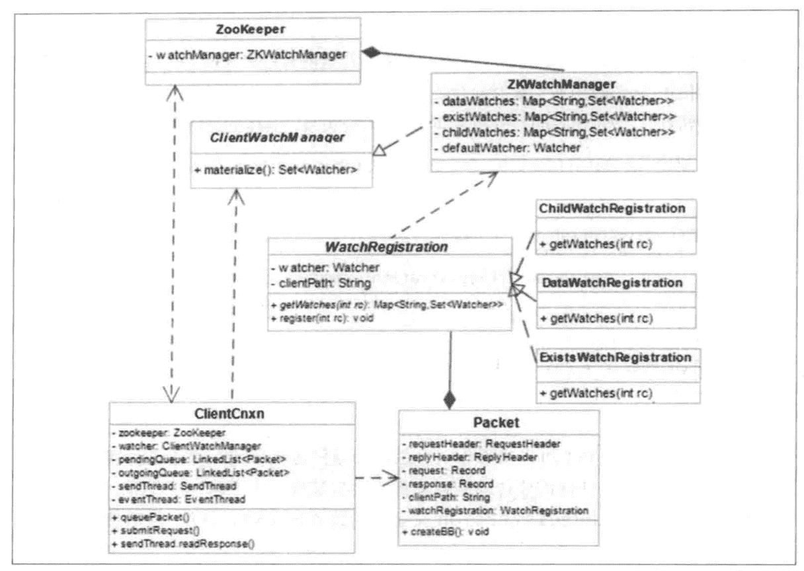
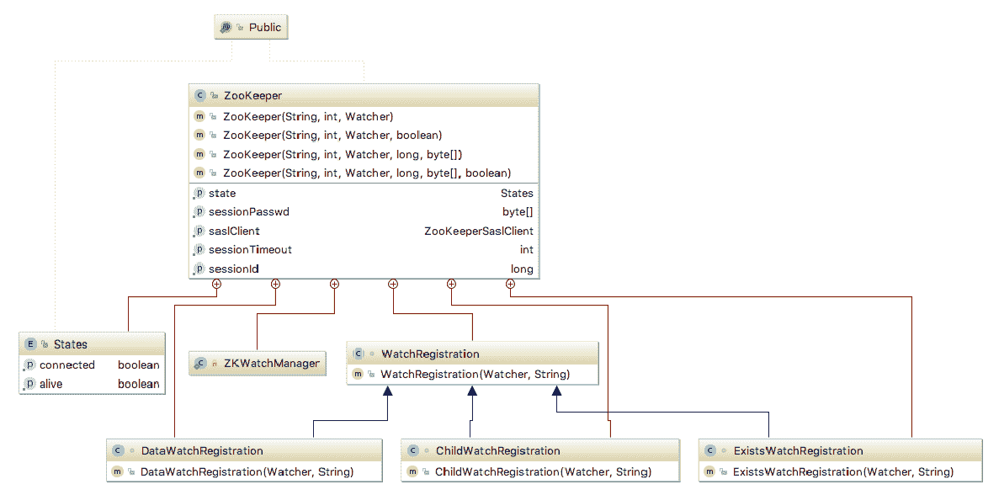
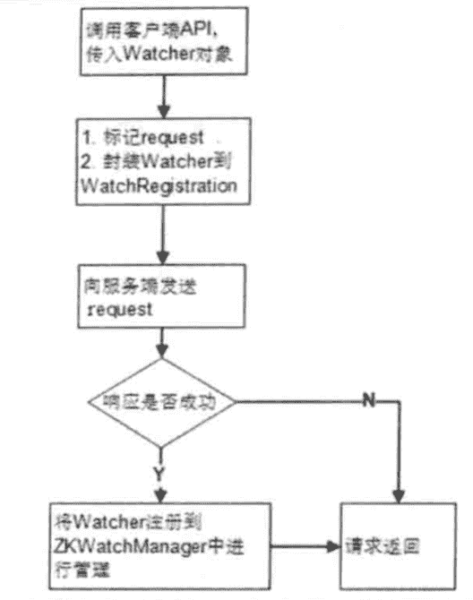
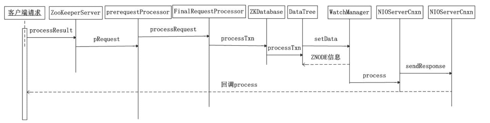
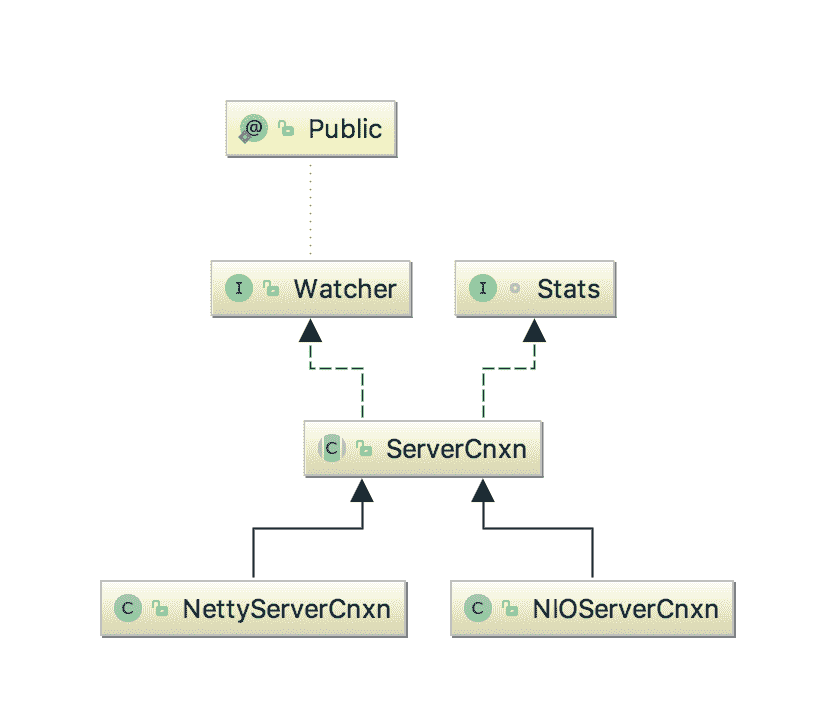

# Zookeeper 源码阅读(八) Watcher 机制与运行流程

> 原文：[https://www.cnblogs.com/gongcomeon/p/10004322.html](https://www.cnblogs.com/gongcomeon/p/10004322.html)

### 前言

前面两篇主要说了关于 watcher 在客户端和服务端的相关实体类和功能接口的相关代码，这一篇把前面的两篇的这些实体类和功能接口以及整个 watcher 的相关框架串联起来，整体地说一下 zk 的 watcher 的注册，触发等运行的机制。

总的来说，ZK 的 watcher 机制，主要可以分为三个阶段：

1.  客户端注册 watcher；
2.  服务端处理 watcher；
3.  客户端回调 watcher。

这三个过程的相关类的交互关系如下：



### 注册

使用过 ZK 原生 api 的同学都清楚，向 zookeeper 中注册 watcher 的接口大概有如下几个：

1.  建立 zk 连接时传入的 watcher；
2.  通过 getdata, exist, getchildren 来设置 watcher，而它们又各有同步和异步两种形式。

在 zk 的代码中，这两类注册的方式都在 Zookeeper 类中, Zookeeper 类的内部结构如下：



通过原生的 api 去 set watcher 大概有如下的方法：

```java
//构造器
public ZooKeeper(String connectString, int sessionTimeout, Watcher watcher)
public ZooKeeper(String connectString, int sessionTimeout, Watcher watcher, boolean canBeReadOnly)
public ZooKeeper(String connectString, int sessionTimeout, Watcher watcher, long sessionId, byte[] sessionPasswd)
public ZooKeeper(String connectString, int sessionTimeout, Watcher watcher, long sessionId, byte[] sessionPasswd, boolean canBeReadOnly)

//getData
public byte[] getData(final String path, Watcher watcher, Stat stat)
public void getData(final String path, Watcher watcher, DataCallback cb, Object ctx)

//exists
public Stat exists(final String path, Watcher watcher)
public void exists(final String path, Watcher watcher, StatCallback cb, Object ctx)

//getchildren
public List<String> getChildren(final String path, Watcher watcher)
public void getChildren(final String path, Watcher watcher, ChildrenCallback cb, Object ctx)
public List<String> getChildren(final String path, Watcher watcher, Stat stat)
public void getChildren(final String path, Watcher watcher, Children2Callback cb, Object ctx) 
```

首先是第一类通过构造器注册的：

```java
public ZooKeeper(String connectString, int sessionTimeout, Watcher watcher,
        boolean canBeReadOnly)
    throws IOException
{
    LOG.info("Initiating client connection, connectString=" + connectString
            + " sessionTimeout=" + sessionTimeout + " watcher=" + watcher);

    //把传入的 watcher 注册到 default 的 watcher 中，(留心就可以发现 getdata,exists,getchildren 提供了参数为 boolean 类型，参数名为 watch 的接口，调用这些接口触发的就是 default 的 watcher)
    watchManager.defaultWatcher = watcher; 
```

可以看到，通过构造器传入的默认 watcher 会注册到 ZKWatchManager 类型的变量 watchManager 中。

然后是通过另外三个接口注册的 watcher，其实也是分为两种情况的，以 getData 为例，getData 方法的 watcher 参数在有的接口中为 boolean 型有的中为 Watcher 类型。

Watcher 类型：

```java
public byte[] getData(final String path, Watcher watcher, Stat stat)
    throws KeeperException, InterruptedException
 {
    final String clientPath = path; //记录 znode 的 path
    PathUtils.validatePath(clientPath);//path 的合法性验证

    // the watch contains the un-chroot path
    WatchRegistration wcb = null;
    if (watcher != null) {
        wcb = new DataWatchRegistration(watcher, clientPath);//生成 datawatch 的对象
    }

    final String serverPath = prependChroot(clientPath);//chroot 是 zk 启动时配置的默认前缀，前面有提到过的

    //生成 request 的相关类
    RequestHeader h = new RequestHeader();
    h.setType(ZooDefs.OpCode.getData);
    GetDataRequest request = new GetDataRequest();
    request.setPath(serverPath);
    request.setWatch(watcher != null);
    GetDataResponse response = new GetDataResponse();
    //发送请求
    ReplyHeader r = cnxn.submitRequest(h, request, response, wcb);
    if (r.getErr() != 0) {
        throw KeeperException.create(KeeperException.Code.get(r.getErr()),
                clientPath);
    }
    if (stat != null) {
        DataTree.copyStat(response.getStat(), stat);
    }
    return response.getData();
} 
```

简单看一下 getData 的 watcher 注册流程，getChildren 和 exists 和 getData 和这个也是类似的。

Boolean 类型：

```java
public byte[] getData(String path, boolean watch, Stat stat)
        throws KeeperException, InterruptedException {
    //可以看到就是调用了 Watcher 类型的接口，只是如果传入的是 true，那么就默认使用在构造器中传入的默认 watcher
    return getData(path, watch ? watchManager.defaultWatcher : null, stat);
} 
```

可以通过上面的接口看到，通过接口设置的 watcher 会生成对应类型的 watcher。在 Zookeeper 类中，WatchRegistration 是一个抽象类，是三种负责注册的类(DataWatchRegistration, ChildWatchRegistration, ExistsWatchRegistration)的父类。

#### WatchRegistration

```java
/**
 * Register a watcher for a particular path.
 */
abstract class WatchRegistration {
    private Watcher watcher; //注册的 watcher
    private String clientPath; //znode 的 path
    public WatchRegistration(Watcher watcher, String clientPath)//构造器
    {
        this.watcher = watcher;
        this.clientPath = clientPath;
    }

    //抽象方法，获取 znode path 和对应的 watcher set 的 map 关系
    abstract protected Map<String, Set<Watcher>> getWatches(int rc);

    /**
     * Register the watcher with the set of watches on path.
     * @param rc the result code of the operation that attempted to
     * add the watch on the path.
     */
    //根据添加 watcher 的 response 码来注册 watcher
    //在 clientCnxn 中调用 p.watchRegistration.register(p.replyHeader.getErr());
    public void register(int rc) {
        if (shouldAddWatch(rc)) {//如果 rc 即 response code 为 0 则添加
            Map<String, Set<Watcher>> watches = getWatches(rc);//获取所有已经注册的 path 和 watcher 的 map 关系
            synchronized(watches) {
                Set<Watcher> watchers = watches.get(clientPath);//找到此次注册的 watcher 的 znode 的 path
                if (watchers == null) {//若之前没有 watcher，则新建 watcher 的 set
                    watchers = new HashSet<Watcher>();
                    watches.put(clientPath, watchers);
                }
                watchers.add(watcher);//把 watcher 添加到全局对应关系中
            }
        }
    }
    /**
     * Determine whether the watch should be added based on return code.
     * @param rc the result code of the operation that attempted to add the
     * watch on the node
     * @return true if the watch should be added, otw false
     */
    protected boolean shouldAddWatch(int rc) {//判断是否应该添加
        return rc == 0; //rc=0 即为添加信号
    }
} 
```

看过了父类的方法，三个子类的就很好理解了：

```java
/** Handle the special case of exists watches - they add a watcher
 * even in the case where NONODE result code is returned.
 */
class ExistsWatchRegistration extends WatchRegistration {
    public ExistsWatchRegistration(Watcher watcher, String clientPath) {
        super(watcher, clientPath);//父类构造方法
    }

    @Override
    protected Map<String, Set<Watcher>> getWatches(int rc) {
        //这里有点疑问，为什么会有 data 的 watches
        //应该是加 watch 的时候可能会出现 no node 的情况，这种情况下才放到 existwatches 里去处理，不然都是 datawatches
        return rc == 0 ?  watchManager.dataWatches : watchManager.existWatches;
    }

    @Override
    protected boolean shouldAddWatch(int rc) {
        //返回码是 0 或者是 NONODE 时添加
        return rc == 0 || rc == KeeperException.Code.NONODE.intValue();
    }
}

class DataWatchRegistration extends WatchRegistration {
    public DataWatchRegistration(Watcher watcher, String clientPath) {
        super(watcher, clientPath);
    }

    @Override
    protected Map<String, Set<Watcher>> getWatches(int rc) {
        //获取 datawatch
        return watchManager.dataWatches;
    }
}

class ChildWatchRegistration extends WatchRegistration {
    public ChildWatchRegistration(Watcher watcher, String clientPath) {
        super(watcher, clientPath);
    }

    @Override
    protected Map<String, Set<Watcher>> getWatches(int rc) {
        //获取 childwatch
        return watchManager.childWatches;
    }
} 
```

看到这里，结合之前两篇说的内容，可以知道，当利用 API 添加 watch 时，zk 客户端会把 watcher 生成对应的 Registration 对象，然后发送添加请求到服务端，根据服务端的返回结果把 Registration 对象注册到 ZKWatchManager 对应的 watch map 中。接下来详细说下客户端发送请求的流程(getData 为例)。

首先是 getData 的请求部分代码：

```java
//生成 request 的相关类
RequestHeader h = new RequestHeader();
h.setType(ZooDefs.OpCode.getData);//设置请求类型
GetDataRequest request = new GetDataRequest();//生成可序列化的 getdatarequest
request.setPath(serverPath);//设置 path 和 watcher
request.setWatch(watcher != null);
GetDataResponse response = new GetDataResponse();//生成可序列化的 getdataresponse
//发送请求
ReplyHeader r = cnxn.submitRequest(h, request, response, wcb);
if (r.getErr() != 0) {
    throw KeeperException.create(KeeperException.Code.get(r.getErr()),
                                 clientPath);
} 
```

可以看到，DataWatchRegistration 和 request/response 对象一进入了 clientCnxn 的 submitRequest 方法。

```java
public ReplyHeader submitRequest(RequestHeader h, Record request,
        Record response, WatchRegistration watchRegistration)
        throws InterruptedException {
    ReplyHeader r = new ReplyHeader();
    //把传入的参数传入 queuePacket
    Packet packet = queuePacket(h, r, request, response, null, null, null,
                null, watchRegistration);
    synchronized (packet) {
        while (!packet.finished) {//判断 packet 是否处理完，没有就 wait
            packet.wait();
        }
    }
    return r;
} 
```

```java
Packet queuePacket(RequestHeader h, ReplyHeader r, Record request,
        Record response, AsyncCallback cb, String clientPath,
        String serverPath, Object ctx, WatchRegistration watchRegistration)
{
    Packet packet = null;

    // Note that we do not generate the Xid for the packet yet. It is
    // generated later at send-time, by an implementation of ClientCnxnSocket::doIO(),
    // where the packet is actually sent.
    //在这里并没有为 packet 生成 xid
    synchronized (outgoingQueue) {
        packet = new Packet(h, r, request, response, watchRegistration);//初始化 packet
        packet.cb = cb;//属性赋值，注册 watcher 时回调为空
        packet.ctx = ctx;
        packet.clientPath = clientPath;
        packet.serverPath = serverPath;
        if (!state.isAlive() || closing) {//判断当前的连接状态
            conLossPacket(packet);
        } else {
            // If the client is asking to close the session then
            // mark as closing
            if (h.getType() == OpCode.closeSession) {
                closing = true;
            }
            outgoingQueue.add(packet);//把 packet 放入队列中(生产者)
        }
    }
    sendThread.getClientCnxnSocket().wakeupCnxn();
    return packet;
} 
```

问题来了，每次在队列中添加了一个 watch 的 registration 之后是谁消费的呢？

在 ClientCnxn 类中有一个 sendThread 线程的 run 方法里，clientCnxnSocket.doTransport(to, pendingQueue, outgoingQueue, ClientCnxn.this);这个方法就是负责消费队列里的 registration 的。

其中，ClientCnxnSocketNIO 是 clientCnxnSocket 的默认实现类，后面会大致说一下。

在 ClientCnxnSocketNIO 的 doTransport 方法中调用了 doIO(pendingQueue, outgoingQueue, cnxn);方法，这里是负责具体的序列化及 IO 的工作。其中 p.createBB();方法是负责具体的序列化的工作。

```java
public void createBB() {
    try {
        ByteArrayOutputStream baos = new ByteArrayOutputStream();//stream 和 archive 的初始化
        BinaryOutputArchive boa = BinaryOutputArchive.getArchive(baos);
        boa.writeInt(-1, "len"); // We'll fill this in later
        if (requestHeader != null) {
            requestHeader.serialize(boa, "header");//序列化 header，内容包含 znode 的路径和是否有 watcher，这里很重要，server 解析这里知道某个 znode 是否被 watch
        }
        if (request instanceof ConnectRequest) {
            request.serialize(boa, "connect");//序列化 connect
            // append "am-I-allowed-to-be-readonly" flag
            boa.writeBool(readOnly, "readOnly");
        } else if (request != null) {
            request.serialize(boa, "request");//序列化 request
        }
        baos.close();
        this.bb = ByteBuffer.wrap(baos.toByteArray());
        this.bb.putInt(this.bb.capacity() - 4);
        this.bb.rewind();
    } catch (IOException e) {
        LOG.warn("Ignoring unexpected exception", e);
    }
} 
```

可以看到，zk 只会把 request 和 header 进行初始化，也就是说，尽管 watchregistration 也作为一个参数传入，但是在序列化时并没有去吧 watchregistration 转换成二进制。这也就代表了客户端每调用一次 watcher 的注册接口，watcher 本身并不会被发送到服务端去。这样做的好处是如果所有的 watcher 实体都被上传到服务端去，随着集群规模的扩大，那么服务端的压力就会越来越大。而 zk 这样的处理方式则很好的保证了 zk 的性能不会随着规模和 watcher1 数量的扩展出现明显的下降。

#### 注册到 ZKWatchManager

在 doIO 里有 readResponse 方法负责读取从 server 端获取的 byte。其中 finishPacket 会从 Packet 中取出 Watcher 并注册到 ZKWatchManager 中。

```java
private void finishPacket(Packet p) {
    if (p.watchRegistration != null) {//registration 不为空
        p.watchRegistration.register(p.replyHeader.getErr());//根据返回码注册
    }

    if (p.cb == null) {//同步方式
        synchronized (p) {
            p.finished = true;
            p.notifyAll();//响应之前的 wait
        }
    } else {//异步方式
        p.finished = true;
        eventThread.queuePacket(p);
    }
} 
```

这里的 register 就是之前说过的三种 watchregistration 里的 register 方法了。这样就把 watcher 注册到了 zk 客户端中，同时服务端也获取到了每个 znode 是否被 watch。

#### 注册总结

《从 paxos 到 zk》中有一张图描述了注册的整个过程：



总结一下流程：

1.  用户通过三种接口或者 zk 构造器方式传入 watcher 对象；
2.  封装 Packet 对象（包含 znode 是否 watch 的信息），并把 packet 放入队列；
3.  ClientCnxn.sendThread 是队列的消费者，讲 packet 取出并序列化（此时只序列化了 znode 是否 watch 的消息，并没有序列化整个 watchregistration）发送给 server；
4.  server 处理后返回结果给客户端，这个具体过程后面详细说；
5.  ClientCnxn.sendThread 读取 server 端的回复，并把 znode 和 watcher 的对应关系注册到 ZKWatchManager 中。

### 服务端处理

首先，通过简单的时序图来了解下 server 端处理 watcher 的流程：



按照这个流程来了解 server 端是如何处理 watcher 相关的请求的。以 FinalRequestProcessor 中 processRequest 里 getdata 类型的请求为例：

```java
case OpCode.getData: {
    lastOp = "GETD";
    //初始化 getdata 的 request，内容是 path 和是否 watch( 初始化均为空)
    GetDataRequest getDataRequest = new GetDataRequest();
    ByteBufferInputStream.byteBuffer2Record(request.request,
            getDataRequest);//把 request 反序列化到 getDataRequest
    DataNode n = zks.getZKDatabase().getNode(getDataRequest.getPath());//获取对应的 node
    if (n == null) {//异常处理
        throw new KeeperException.NoNodeException();
    }
    PrepRequestProcessor.checkACL(zks, zks.getZKDatabase().aclForNode(n),
            ZooDefs.Perms.READ,
            request.authInfo);//检查是否有权限访问
    Stat stat = new Stat();
    byte b[] = zks.getZKDatabase().getData(getDataRequest.getPath(), stat,
            getDataRequest.getWatch() ? cnxn : null);//注意这里，获取是否 watch
    rsp = new GetDataResponse(b, stat);//包装 response
    break;
} 
```

getDataRequest.getWatch() ? cnxn : null 上面代码中，这里有点特殊的地方，如果 watch 存在会获取一个名为 cnxn 的 ServerCnxn 类型的变量。ServerCnxn，代表了一个服务端与客户端的连接。类图如下：



可以看到 ServerCnxn 实现了 Watcher 接口，实际上后面的回调也是通过 serverCnxn 实现的。

同时在 processRequest 里，客户端传过来的消息会被传入 ZookeeperServer 的 processTxn 方法。

```java
if (request.hdr != null) {
   TxnHeader hdr = request.hdr;//header，包含请求类型
   Record txn = request.txn;//request,路径和是否 watch

   rc = zks.processTxn(hdr, txn);
} 
```

```java
public ProcessTxnResult processTxn(TxnHeader hdr, Record txn) {
    ProcessTxnResult rc;
    int opCode = hdr.getType();
    long sessionId = hdr.getClientId();
    rc = getZKDatabase().processTxn(hdr, txn);//dataTree 相关的操作，更新树
    if (opCode == OpCode.createSession) {//是否是创建连接
        if (txn instanceof CreateSessionTxn) {
            CreateSessionTxn cst = (CreateSessionTxn) txn;
            sessionTracker.addSession(sessionId, cst
                    .getTimeOut());
        } else {
            LOG.warn("*****>>>>> Got "
                    + txn.getClass() + " "
                    + txn.toString());
        }
    } else if (opCode == OpCode.closeSession) {//是否是关连接
        sessionTracker.removeSession(sessionId);
    }
    return rc;
} 
```

这是和 datatree 相关的一些操作。而上面的 getdata 的请求处理中进入了 zkdatabase 的 getdata 方法，而它的内部实际上调用了 datatree 的 getdata 方法。

```java
public byte[] getData(String path, Stat stat, Watcher watcher)
        throws KeeperException.NoNodeException {
    DataNode n = nodes.get(path);//获取对应的 node
    if (n == null) {
        throw new KeeperException.NoNodeException();
    }
    synchronized (n) {
        n.copyStat(stat);//更新 stat
        if (watcher != null) {
            dataWatches.addWatch(path, watcher);//注册 watcher
        }
        return n.data;//返回节点的 data
    }
} 
```

dataWatches.addWatch(path, watcher);之前介绍过 Server 端的 WatchManager 有两类，一类是 data 的，另一类是 child 的。根据接口的不同加入不同的集合里。这样就完成了在 server 端的注册。

总结一下 server 端的处理：

1.维护 datatree；

2.把 watcher 注册到 watchmanager 中。

之前很奇怪 server 端不是不存储 watcher 吗，为啥还要在 server 端注册到 watchmanager 中。下面具体说下触发的流程就清晰了。

### 触发 watcher

其实看看 ServerCnxn 的子类就知道了:

```java
synchronized public void process(WatchedEvent event) {
    ReplyHeader h = new ReplyHeader(-1, -1L, 0);//包装 header
    if (LOG.isTraceEnabled()) {
        ZooTrace.logTraceMessage(LOG, ZooTrace.EVENT_DELIVERY_TRACE_MASK,
                                 "Deliver event " + event + " to 0x"
                                 + Long.toHexString(this.sessionId)
                                 + " through " + this);
    }

    // Convert WatchedEvent to a type that can be sent over the wire
    WatcherEvent e = event.getWrapper();//把 event 包装(连接和事件)

    sendResponse(h, e, "notification");
} 
```

这样就好理解了，serverCnxn 的回调是为了告诉客户端去调用哪些 watcher 里的 process。

而为什么会有这个回调呢，比如现在已经在 server 注册了一个 watcher，现在通过 setdata 把 znode 的值改掉，这时就会触发 watcher。

前面提到的 ZookeeperServer 的 processTxn 方法中，会调用 zkdatabase 的 processTxn 方法，事实上调用了 datatree 的 processTxn 方法。

```java
case OpCode.setData:
    SetDataTxn setDataTxn = (SetDataTxn) txn;
    rc.path = setDataTxn.getPath();
    rc.stat = setData(setDataTxn.getPath(), setDataTxn
            .getData(), setDataTxn.getVersion(), header
            .getZxid(), header.getTime());//调用 datatree 的 setdata 方法
    break; 
```

```java
public Stat setData(String path, byte data[], int version, long zxid,
        long time) throws KeeperException.NoNodeException {
    ...
    dataWatches.triggerWatch(path, EventType.NodeDataChanged);//触发 watch
} 
```

triggerWatch 方法前面已经说过了，可以结合前一篇博客以及上面关于 ServerCnxn 的实现类 process 方法的代码一起看就知道事实上 server 告诉客户端相应的 event 发生了。

客户端在 ClientCnxn 的 readResponse 方法中处理接收到的消息。

```java
if (replyHdr.getXid() == -1) {//通知为 watcherEvent
    // -1 means notification
    if (LOG.isDebugEnabled()) {
        LOG.debug("Got notification sessionid:0x"
            + Long.toHexString(sessionId));
    }
    WatcherEvent event = new WatcherEvent();//路径、连接状态和事件
    event.deserialize(bbia, "response");

    // convert from a server path to a client path
    //从 server 的 path->客户端定义的真实 path，因为可能有预定义的 chrootPath 存在
    if (chrootPath != null) {//判断是否有预定义的 chrootpath
        String serverPath = event.getPath();
        if(serverPath.compareTo(chrootPath)==0)
            event.setPath("/");
        else if (serverPath.length() > chrootPath.length())//加上 chrootPath
            event.setPath(serverPath.substring(chrootPath.length()));
        else {
           LOG.warn("Got server path " + event.getPath()
                 + " which is too short for chroot path "
                 + chrootPath);
        }
    }

    WatchedEvent we = new WatchedEvent(event);//路径、连接状态和事件
    if (LOG.isDebugEnabled()) {
        LOG.debug("Got " + we + " for sessionid 0x"
                + Long.toHexString(sessionId));
    }

    eventThread.queueEvent( we );//加入 eventThread 的队列
    return;
} 
```

这里 watchedEvent 被放入了队列，进入了 queueEvent 方法。

```java
public void queueEvent(WatchedEvent event) {
    if (event.getType() == EventType.None
            && sessionState == event.getState()) {//判断链接状态和事件
        return;
    }
    sessionState = event.getState();//获取 session 的连接状态

    // materialize the watchers based on the event
    //WatcherSetEventPair 为事件和 event 的对应关系
    WatcherSetEventPair pair = new WatcherSetEventPair(
            watcher.materialize(event.getState(), event.getType(),
                    event.getPath()),
                    event);
    // queue the pair (watch set & event) for later processing
    waitingEvents.add(pair);//加入消费的队列
} 
```

watcher.materialize(event.getState(), event.getType(),event.getPath())这里的 materialize 之前讲 client 的 watcher 存储时说过，实际上就是从 ZKWatchManger 中取出对应的 watcher 集合。

最终，在 EventThread 的 run 方法中调用了 processEvent 方法进行每个 event 对应的所有 watcher 的回调。

```java
if (event instanceof WatcherSetEventPair) {//如果是 event 和 watcher 的对应关系
    // each watcher will process the event
    WatcherSetEventPair pair = (WatcherSetEventPair) event;//向下转型
    for (Watcher watcher : pair.watchers) {//遍历
        try {
            watcher.process(pair.event);//回调！！！！！！！最终的真正的 watcher 的调用。
        } catch (Throwable t) {
            LOG.error("Error while calling watcher ", t);
        }
    }
} 
```

### 补充

前面说 ClientCnxnSocketNIO 是 clientCnxnSocket 的默认实现类，这里详细解释下。在 Zookeeper 类型构造器中：

```java
public ZooKeeper(String connectString, int sessionTimeout, Watcher watcher,
        boolean canBeReadOnly)
    throws IOException
{
    ...
    cnxn = new ClientCnxn(connectStringParser.getChrootPath(),
            hostProvider, sessionTimeout, this, watchManager,
            //这里获取 ClientCnxnSocket 的实例
            getClientCnxnSocket(), canBeReadOnly);
    cnxn.start();
} 
```

```java
private static ClientCnxnSocket getClientCnxnSocket() throws IOException {
    //查看系统设置，可能配置了实现
    String clientCnxnSocketName = System
            .getProperty(ZOOKEEPER_CLIENT_CNXN_SOCKET);
    if (clientCnxnSocketName == null) {
        clientCnxnSocketName = ClientCnxnSocketNIO.class.getName();//取得 ClientCnxnSocketNIO 的类名
    }
    try {
        //反射生成实例然后返回
        return (ClientCnxnSocket) Class.forName(clientCnxnSocketName).getDeclaredConstructor()
                .newInstance();
    } catch (Exception e) {
        IOException ioe = new IOException("Couldn't instantiate "
                + clientCnxnSocketName);
        ioe.initCause(e);
        throw ioe;
    }
} 
```

可以看到，ZK 在生成许多实现类时使用了反射的特性，以后再项目中也可以考虑使用反射来做，这样可以使项目的配置等更加的灵活。

### 总结

#### Watcher 特性的体现

1.  无论在 client 还是 server，watcher 一旦被触发，zk 都会移除 watcher，体现了其一次性，这样的设计也有效地减轻了 server 端的压力；
2.  从代码分析中可以看到，watcher 都是放置在 list 中，有对应的 thread 生产和消费，具有串行执行的特点；
3.  在 client 发送通知到 server 的过程中，只会告诉 server 端 1.发生了什么事件，2.znode 路径，3.是否 watch。至于 watcher 的内容根本不会被同步到 server 端，server 端存储的 watcher 是保存当前连接的 serverCnxn 对象，这样就充分体现了 zk 的轻量性！

#### Watcher 触发

1.  server 端监听目前有 watcher 的所有 path，对不同的 EventType（事件）进行不同的处理，如果不涉及 watcher 则这部分不会有相应的处理，如果有 watcher 的 path 被触发，则会通知 client。
2.  因为 server 端保存的是和 client 端的链接，所以 server 端可以知道每个 znode 的特定 watcher 属于哪个 client，这样每个 watcher 只会在对应的 client 上触发。

### Client 端发送请求的具体类型和 Server 端接受

```java
if (request instanceof ConnectRequest) { 
```

在 creatBB 方法中 request 是 ConnectRequest 类或者 null，在 server 端接收的时候以 Record 接口类型接受的。

### 思考

ServerCnxn 是否在 Session 中也有用，或者 session 全是用 socket 连接保持的？应该不是，这样过与消耗资源。

ClientCnxn 的 readResponse 方法其他几种返回的 xid 没有仔细看，有空可以再看看。

### 参考

[https://www.ibm.com/developerworks/cn/opensource/os-cn-apache-zookeeper-watcher/index.html](https://www.ibm.com/developerworks/cn/opensource/os-cn-apache-zookeeper-watcher/index.html)

[http://www.cnblogs.com/leesf456/p/6291004.html](http://www.cnblogs.com/leesf456/p/6291004.html)

[https://www.jianshu.com/p/90ff3e723356](https://www.jianshu.com/p/90ff3e723356)

结合前两篇介绍 Client 和 Server 端的 watcher