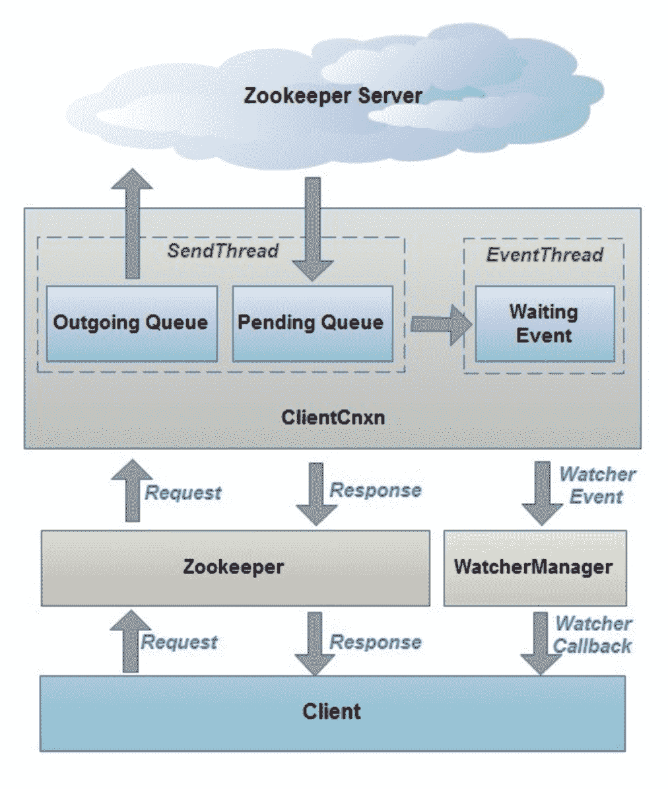
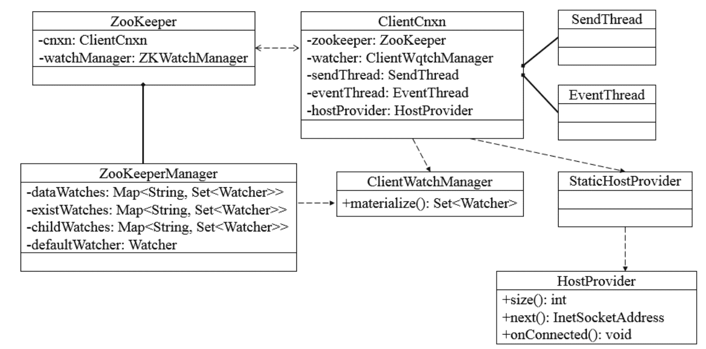
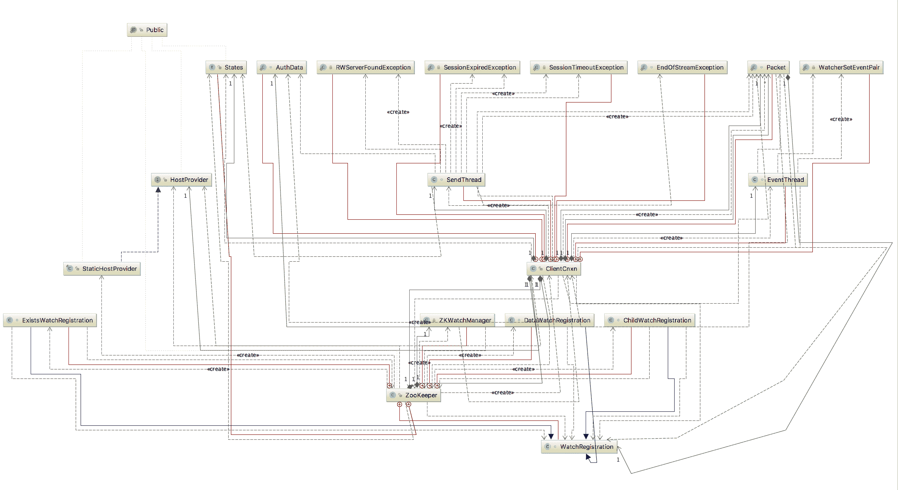
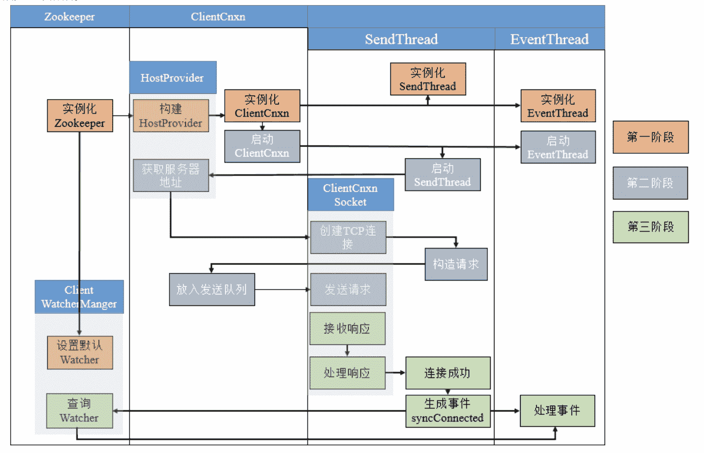
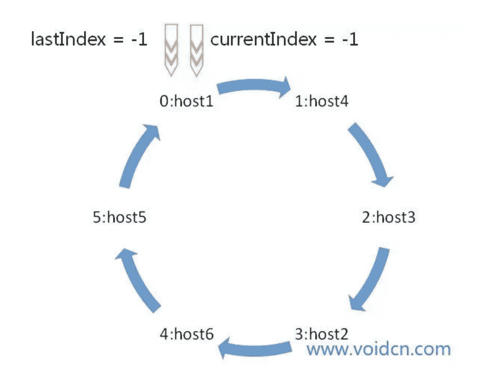
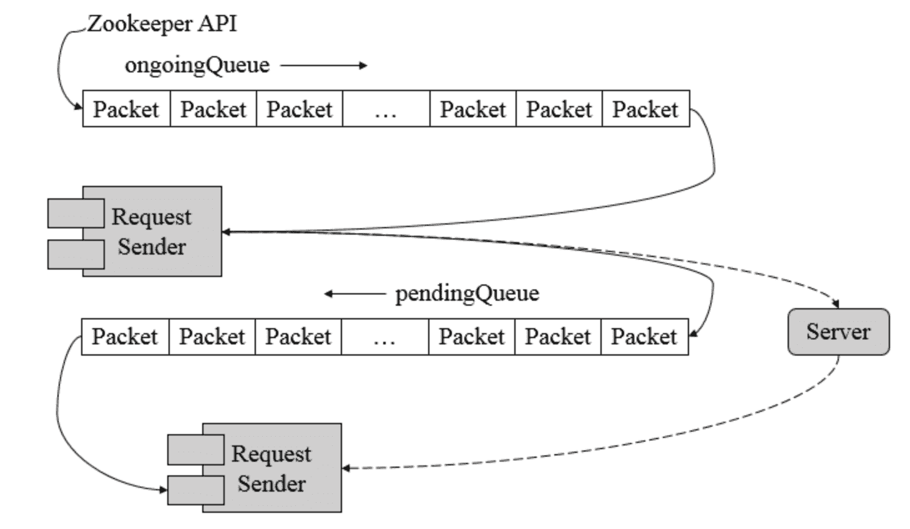

# Zookeeper 源码阅读(九) ZK Client-Server(1)

> 原文：[https://www.cnblogs.com/gongcomeon/p/10080534.html](https://www.cnblogs.com/gongcomeon/p/10080534.html)

### 前言

Watcher 部分的代码量总的来说还是比较多的，但是整个逻辑流程还是相对来说比较清晰的。不过还是需要常在脑子里过一过，zk 的 watcher 的相关的架构的设计还是挺精妙的。

从这一篇起开始说 ZK client 端-server 端交互相关的代码，主要是从 client 本身，client 和 server 的连接和会话以及 server 端这三个大点来说。这一篇主要说说大致流程和 client 端的初始化等。

### 结构

在网上看到了一张图片非常好的描述了 zk 工作的大致结构，对理解 zk client 端以至于整体的代码都挺有帮助的，这里贴出来：



上图主要描述了 ZK Client 和 Server 端互动的过程：

1.  client 端把 request 传递到 Zookeeper 类中（以 Packet 形式）；
2.  Zookeeper 类处理 request 并放入 outgoingqueue 中（sendthread 做的）；
3.  sendthread 把发出的 request 移到 pendingqueue；
4.  收到回复后，sendthread 从 pendingqueue 中取出 request，并生成 event；
5.  eventthread 处理 event 并触发 watchManager 中的 watcher，调用 callback。

#### Client 端代码结构

其实 client 端的很多重要的类在之前说 watcher，快照和 log 的时候就已经接触了很多了，这里也是系统地总结下。



其中主要几个类的功能：

Zookeeper：客户端核心类之一，也是入口；

ClientCnxn：客户端连接核心类，包含**SendThread**和**EventThread**两个线程。SendThread 为 I/O 线程，主要负责 Zookeeper 客户端和服务器之间的网络 I/O 通信；EventThread 为事件线程，主要负责对服务端事件进行处理；

ClientWatchManager：客户端 watcher 管理器；

HostProvider:客户端地址列表管理器。



上图是 Zookeeper 类及其相关的类的交互 UML 图，可以通过上图来理解下整个 Zookeeper 各个功能类之间的关系和协作流程。

### 主要流程



zk client 和 server 端建立连接从 client 来说主要分为以下三个阶段：

1.  初始化阶段：上面介绍的几个主要功能类的实例化；
2.  创建阶段：启动及创建连接；
3.  响应请求：响应及接收。

逐个介绍：

#### 初始化阶段

从上图中能看出，第一步就是从 Zookeeper 类的实例化开始，我们选取一个 Zookeeper 类的构造器开始分析：

```java
public ZooKeeper(String connectString, int sessionTimeout, Watcher watcher,
        boolean canBeReadOnly)
    throws IOException
{
    LOG.info("Initiating client connection, connectString=" + connectString
            + " sessionTimeout=" + sessionTimeout + " watcher=" + watcher);

	//设置默认 watcher，之前讲 watcher 的时候说过
    watchManager.defaultWatcher = watcher;

	//负责解析配置的 server 地址串
	//主要有两个功能：1.加 chroot(默认 prefix，之前有介绍过)；2.读字符串并把多个 server 地址分开
    ConnectStringParser connectStringParser = new ConnectStringParser(
            connectString);
    //根据之前的字符串解析 hostname，ip 等，并不一定会按照原来的顺序，在构造器中会将顺序打散
    HostProvider hostProvider = new StaticHostProvider(
            connectStringParser.getServerAddresses());
    //实例化 clientCnxn 对象
    cnxn = new ClientCnxn(connectStringParser.getChrootPath(),
            hostProvider, sessionTimeout, this, watchManager,
            getClientCnxnSocket(), canBeReadOnly);
    //启动 sendThread 和 eventThread
    cnxn.start();
} 
```

其实总结下可以看出整个初始化阶段分为四步：

1.  为默认 Watcher 赋值

2.  解析并设置 Zookeeper 服务器地址列表

3.  实例化 ClientCnxn 对象

4.  启动 clientCnxn 对象里的 sendThread 和 eventThread 线程。

在这里讲一下构造器中的几个重要类：

##### ConnectStringParser

```java
public final class ConnectStringParser {
    private static final int DEFAULT_PORT = 2181;//默认 port

    private final String chrootPath;//默认前缀

    private final ArrayList<InetSocketAddress> serverAddresses = new ArrayList<InetSocketAddress>();//地址 list 
```

ConnectStringParser 的构造器很简单，主要就是解析 chrootPath 和生成上面的 serverAddresses 地址列表。

##### StaticHostProvider

有一张图很好的形容了 StaticHostProvider 的工作原理。



在 StaticHostProvider 类中调用 next 方法会在循环队列中不断获取，特别要注意的是这个循环队列本身就已经是打乱过的。

在 StaticHostProvider 构造器中，把前面 ConnectStringParser 的 server 地址会再次解析一遍并生成一个队列（因为上一步解析的结果有的没有 address），然后就会如下打乱。

```java
Collections.shuffle(this.serverAddresses); 
```

```java
public InetSocketAddress next(long spinDelay) {
    //这个部分主要是循环
    ++currentIndex;
    if (currentIndex == serverAddresses.size()) {
        currentIndex = 0;
    }

    //如果这一次的 server 地址和上一次一样，那么就睡眠 spinDelay 时间
    if (currentIndex == lastIndex && spinDelay > 0) {
        try {
            Thread.sleep(spinDelay);
        } catch (InterruptedException e) {
            LOG.warn("Unexpected exception", e);
        }
    } else if (lastIndex == -1) {//如果是第一次访问，就不要等待
        // We don't want to sleep on the first ever connect attempt.
        lastIndex = 0;
    }

    return serverAddresses.get(currentIndex);
} 
```

#### 创建阶段

其实在 sendThread 和 eventThread 两个线程启动之后，创建和响应阶段也就开始了。具体的流程会再后面详细说，大致的流程是先从 hostprovider 获取 server 地址，然后建立连接并构造请求发送。

详细流程：

1.  获取服务器地址（从 hostprovider 中可以获得），并建立 TCP 连接；
2.  构造 ConnectRequest 请求。前面的 TCP 连接建立后，client 和 server 的会话并没有完全建立。SendThread 会根据响应的参数构造 ConnectRequest，并包装成 Packet 对象放入 outgoingqueue 中发送到 server 端，这就是实际意义上的 client 和 server 的一个会话。这部分在之前的 watcher 发送时有提到。
3.  ClientCnxnSocket 从 queue 中取出 Packet 并序列化部分属性发送到 server。

这里先把几个基础且比较重要的部分说下：

##### sendThread

功能：

1.  维护 client 和 server 的心跳连接，一旦失去连接会立即重连；
2.  管理了客户端所有的请求发送和响应接收操作，其将上层客户端 API 操作转换成相应的请求协议并发送到服务端，并完成对同步调用的返回和异步调用的回调；
3.  接受请求的返回并传递给 eventThread 去处理。



上面的图大致描述了 outgoingqueue（客户端请求等待发送的队列）和 pendingQueue(已经发送等待响应处理的队列)的关系。

##### EventThread

EventThread 是客户端 ClientCnxn 内部的一个事件处理线程，负责客户端的事件处理，并触发客户端注册的 Watcher 监听。EventThread 中的 watingEvents 队列用于临时存放那些需要被触发的 Object，包括客户端注册的 Watcher 和异步接口中注册的回调器 AsyncCallback。同时，EventThread 会不断地从 watingEvents 中取出 Object，识别具体类型（Watcher 或 AsyncCallback），并分别调用 process 和 processResult 接口方法来实现对事件的触发和回调。

##### Packet

其实之前就已经看过 Packet 的一些处理了，最重要的就是 Packet 序列化的时候 createBB 方法里只有部分属性序列化了，包括 watcher 在内的很多变量都没有序列化，这也是 watcher 轻量特性的保证。

outgoingqueue 和 pendingqueue 之前提到了主要的作用，而他们内部放置的对象都是 Packet。在发送时，sendThread 从 outgoingqueue 取出 Packet 序列化(带有生成的请求序号 XID 在请求头中)并发送，然后这个 Packet 就被转移到 pendingqueue 中，等待响应处理。

#### 响应阶段

同样的，响应阶段的代码也比较多，后面具体说，这里说下大致流程：

1.  ClientCnxnSocket 接收到响应后，首先判断客户端状态是否初始化，若未初始化，那说明当前客户端与服务端之间正在进行会话创建并反序列化 response，生成 ConnectResponse（带有 sessionid），然后会通知 sendThread 和 HostProvider 进行相应的设置；
2.  如果为初始化状态，且收到的为事件，那么会反序列化为 WatcherEvent，并放到 EventThread 的等待队列中；
3.  如果是常规的请求，如 getdata，exists 等，那么会从 pendingQueue 中取出一个 Packet 来处理。

### 思考

#### Outgoingqueue, pendingQueue 和 EventThread 的 event 等待队列关系：

outgoingqueue 就是所有要发送的客户端的请求，pendingqueue 就是发送过的等待响应的，如果客户端收到了 server 端的**回复**，就会从 pendingqueue 中取出请求 Packet 并处理；而 event 等待队列是为了处理 server 段主动发起的事件，也就是节点发生了 change，server 主动发送请求到客户端，client 把这类的通知放到 event 等待队列中。

#### notification event，非 notification event

客户端需要接受服务器发送过来的消息，第一种消息是类似于 Watcher 回掉这种的，我们叫做 notification，他的特点是服务器主动发送消息给客户端的，比如客户端 a 在数据节点 a 上设置了 getData 监听，当客户端 b 修改了节点 a 后，服务器主动发送 NodeDataChanged 消息给客户端 a。第二中消息是类似于 create，getData 这种，他们向服务器发送对应的请求后，然后将请求放进到 pendingQueue 中，然后等待服务器的响应，当接受到服务器的响应后，再从 pendingQueue 中取出请求，然后进行回掉。

### 参考

[https://www.cnblogs.com/francisYoung/p/5225703.html](https://www.cnblogs.com/francisYoung/p/5225703.html) 可以多看下理解

[http://www.cnblogs.com/leesf456/p/6098255.html](http://www.cnblogs.com/leesf456/p/6098255.html)

[https://www.jianshu.com/p/cbad04b12950](https://www.jianshu.com/p/cbad04b12950)

《Paxos 到 ZK》