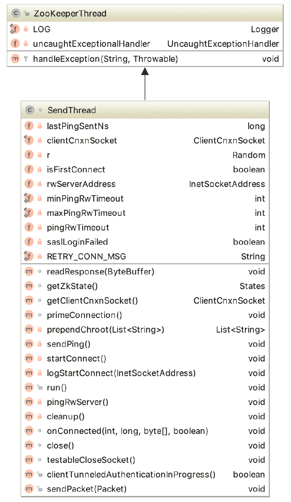

# Zookeeper 源码阅读(十) ZK Client-Server(2)

> 原文：[https://www.cnblogs.com/gongcomeon/p/10134849.html](https://www.cnblogs.com/gongcomeon/p/10134849.html)

### 前言

前面一篇博客主要从大致流程的角度说了下 client 和 server 建立连接的流程，这篇和下一篇博客会详细的把上一篇不是很细致的地方展开和补充。

### 初始化阶段

初始化阶段主要就是把 Zookeeper 类中比较重要的功能类实例化，前面对这个过程说的已经比较详细了。这里主要补充几点：

1.  #### ClientCnxn 初始化

```java
cnxn = new ClientCnxn(connectStringParser.getChrootPath(),
        hostProvider, sessionTimeout, this, watchManager,
        getClientCnxnSocket(), canBeReadOnly); 
```

```java
public ClientCnxn(String chrootPath, HostProvider hostProvider, int sessionTimeout, ZooKeeper zooKeeper,
        ClientWatchManager watcher, ClientCnxnSocket clientCnxnSocket,
        long sessionId, byte[] sessionPasswd, boolean canBeReadOnly) { 
```

可以看到 ClientCnxn 的构造器中有一个非常重要的参数是 ClientCnxnSocket，这也是 client 和 server 建立连接的功能类，这里看下如何获得的。

```java
private static ClientCnxnSocket getClientCnxnSocket() throws IOException {
    //获取系统配置
    String clientCnxnSocketName = System
            .getProperty(ZOOKEEPER_CLIENT_CNXN_SOCKET);
    //如果没有特别设置，那么采用 NIO 的实现为默认实现
    if (clientCnxnSocketName == null) {
        clientCnxnSocketName = ClientCnxnSocketNIO.class.getName();
    }
    try {
        //反射来获取对象实例
        return (ClientCnxnSocket) Class.forName(clientCnxnSocketName).getDeclaredConstructor()
                .newInstance();
    } catch (Exception e) {
        IOException ioe = new IOException("Couldn't instantiate "
                + clientCnxnSocketName);
        ioe.initCause(e);
        throw ioe;
    }
} 
```

可以看到，clientCnxn 的对象是通过反射获得的。

如果还记得的话，之前 watcher 发送的时候就是 clientCnxn 来发送的，当然，其实 client 端和 server 的连接都是通过这个类来做的，具体的方法涉及到 doTransport, doIO 等，具体使用了 NIO 的一些方法，之后把 NIO 和 Netty 弄得比较清楚后再来把这部分补上。

1.  #### StaticHostProvider 里的等待

```java
public InetSocketAddress next(long spinDelay) {
    //每尝试一次 currentindex 加一
    ++currentIndex;
    //试了所有的 server
    if (currentIndex == serverAddresses.size()) {
        currentIndex = 0;
    }
    //试了一圈就会有 currentIndex == lastIndex
    if (currentIndex == lastIndex && spinDelay > 0) {
        try {
            Thread.sleep(spinDelay);
        } catch (InterruptedException e) {
            LOG.warn("Unexpected exception", e);
        }
    } else if (lastIndex == -1) {
        // We don't want to sleep on the first ever connect attempt.
        lastIndex = 0;
    }

    return serverAddresses.get(currentIndex);
} 
```

刚开始看到这个方法的时候很奇怪，一般 next 方法基本都没有参数的，这里很奇怪的加了个 delay 的时间，仔细看了看才发现有特殊的考虑，如果所有 server 都试过了且连不上，就会 sleep spinDelay 时间再尝试。

### 创建阶段

如前篇博客所说，当 zookeeper 构造器中 clientCnxn 的 start 方法调用也就是 sendthread 和 eventthread 开始 run 起来时，创建过程便开始了。

```java
public void start() {
    sendThread.start();
    eventThread.start();
} 
```

创建连接的过程主要是 sendthread 做的，启动了 start()方法实际上就是调用了 sendthread 的 run 方法，但是这个方法比较复杂，我们从 sendThread 的别的方法开始，最后再过 run 方法这样清晰一点。而 sendthread 的功能之前有说过，这里引用一份别人的总结，下面看方法功能的时候也可以对照：

1.  维护了客户端与服务端之间的会话生命周期（通过一定周期频率内向服务端发送 PING 包检测心跳），如果会话周期内客户端与服务端出现 TCP 连接断开，那么就会自动且透明地完成重连操作。 　　
2.  管理了客户端所有的请求发送和响应接收操作，其将上层客户端 API 操作转换成相应的请求协议并发送到服务端，并完成对同步调用的返回和异步调用的回调。 　　
3.  将来自服务端的事件传递给 EventThread 去处理。



下面过一下几个比较重要的方法：

#### sendPing

这是 sendthread 功能第一点的方法，保证了和 server 之间的 ping 连接，也就是心跳。

```java
private void sendPing() {
    lastPingSentNs = System.nanoTime();//lastPingSentNs 是上一次 ping 的时间(nano time)
    RequestHeader h = new RequestHeader(-2, OpCode.ping);//生成 ping 的特殊请求头
    queuePacket(h, null, null, null, null, null, null, null, null);//把 packet 加入到 outgoingqueue 中
} 
```

这里有一点需要注意：

```java
if (p.requestHeader != null
        && p.requestHeader.getType() != OpCode.ping
        && p.requestHeader.getType() != OpCode.auth) {
    synchronized (pendingQueue) {
        pendingQueue.add(p);
    }
} 
```

这是 ClientCnxnSocketNIO 的 doIO 方法里的一段，这里想说明的是如果 header 是 ping, auth 或空，那么在发送完之后不会加入 Pendingqueue 中。

在 sendthread 的 readresponse 中，对 ping 和 auth 的请求都有特别的处理，在第八篇里有分析过这个方法。

```java
if (replyHdr.getXid() == -2) {
    // -2 is the xid for pings 
```

```java
if (replyHdr.getXid() == -4) {
    // -4 is the xid for AuthPacket 
```

#### pingRwServer

这个方法是 client 连接了只读的 server 时会尝试连接 hostprovider 里的读写 server。

```java
private void pingRwServer() throws RWServerFoundException {
    String result = null;
    InetSocketAddress addr = hostProvider.next(0);//下一个 server 地址
    LOG.info("Checking server " + addr + " for being r/w." +
            " Timeout " + pingRwTimeout);

    Socket sock = null;
    BufferedReader br = null;
    try {
        //socket 变量初始化
        sock = new Socket(addr.getHostName(), addr.getPort());
        sock.setSoLinger(false, -1);
        sock.setSoTimeout(1000);
        sock.setTcpNoDelay(true);
        sock.getOutputStream().write("isro".getBytes());
        sock.getOutputStream().flush();
        sock.shutdownOutput();
        br = new BufferedReader(
                new InputStreamReader(sock.getInputStream()));//获得连接的回复
        result = br.readLine();//读回复
    } catch (ConnectException e) {
        // ignore, this just means server is not up
    } catch (IOException e) {
        // some unexpected error, warn about it
        LOG.warn("Exception while seeking for r/w server " +
                e.getMessage(), e);
    } finally {
        //保护语句
        if (sock != null) {
            try {
                sock.close();
            } catch (IOException e) {
                LOG.warn("Unexpected exception", e);
            }
        }
        if (br != null) {
            try {
                br.close();
            } catch (IOException e) {
                LOG.warn("Unexpected exception", e);
            }
        }
    }

    //如果发现是读写 server
    if ("rw".equals(result)) {
        pingRwTimeout = minPingRwTimeout;
        // save the found address so that it's used during the next
        // connection attempt
        rwServerAddress = addr;//保存此 server 地址，更新 rwServerAddress
        throw new RWServerFoundException("Majority server found at "
                + addr.getHostName() + ":" + addr.getPort());//找到读写 server，run 方法抛异常，client 重连到 rwServerAddress
    }
} 
```

对异常的 catch 和处理部分如下：

```java
else if (e instanceof RWServerFoundException) {
    LOG.info(e.getMessage());
} else {
    LOG.warn(
            "Session 0x"
                    + Long.toHexString(getSessionId())
                    + " for server "
                    + clientCnxnSocket.getRemoteSocketAddress()
                    + ", unexpected error"
                    + RETRY_CONN_MSG, e);
}
cleanup();
if (state.isAlive()) {
    eventThread.queueEvent(new WatchedEvent(
            Event.EventType.None,
            Event.KeeperState.Disconnected,
            null));//waitingevent 队列中加入断开连接的 event，会导致重连
} 
```

可以看到这里把一个断开连接的 event 加入了队列后，eventthread 处理的时候就会重连，而重连的 server 就是先前设置好的 rwServerAddress。

#### startConnect

从方法名很容易知道，这个方法是用来建立连接的。

```java
private void startConnect() throws IOException {
    // initializing it for new connection
    //初始化变量
    saslLoginFailed = false;
    state = States.CONNECTING;

    InetSocketAddress addr;//socket 链接地址
    if (rwServerAddress != null) {
        addr = rwServerAddress;//设置为读写 server 的地址
        rwServerAddress = null;//这里设为空为了连接断开的时候下次连接可以换一个 server
    } else {
        addr = hostProvider.next(1000);//如果读写 server 地址为空就换 hostProvider 里的下一个
    }

    setName(getName().replaceAll("\\(.*\\)",
            "(" + addr.getHostName() + ":" + addr.getPort() + ")"));//设置线程的名字
    if (ZooKeeperSaslClient.isEnabled()) {//sasl 开启了，sasl 有时间再去仔细看看
        try {
            //相应的 username 和 client 的初始化
            String principalUserName = System.getProperty(
                    ZK_SASL_CLIENT_USERNAME, "zookeeper");
            zooKeeperSaslClient =
                new ZooKeeperSaslClient(
                        principalUserName+"/"+addr.getHostName());
        } catch (LoginException e) {
            // An authentication error occurred when the SASL client tried to initialize:
            // for Kerberos this means that the client failed to authenticate with the KDC.
            // This is different from an authentication error that occurs during communication
            // with the Zookeeper server, which is handled below.
            LOG.warn("SASL configuration failed: " + e + " Will continue connection to Zookeeper server without "
              + "SASL authentication, if Zookeeper server allows it.");
            eventThread.queueEvent(new WatchedEvent(
              Watcher.Event.EventType.None,
              Watcher.Event.KeeperState.AuthFailed, null));
            saslLoginFailed = true;
        }
    }
    logStartConnect(addr);//打 log

    clientCnxnSocket.connect(addr);//开始 socket 连接
} 
```

总结可以看到主要有下面几步：

1.  相关变量初始化；
2.  找到对应的 server 地址；
3.  sasl 的处理及变量初始化、异常处理；
4.  打 log；
5.  连接。

#### primeConnection

先简单看下代码：

```java
void primeConnection() throws IOException {
    LOG.info("Socket connection established to "
             + clientCnxnSocket.getRemoteSocketAddress()
             + ", initiating session");
    isFirstConnect = false;
    //seenRwServerBefore 会在第一次连接上 R/Wserver 时设置为 true
    long sessId = (seenRwServerBefore) ? sessionId : 0;//之前如果连接过 rw 的 server 会把 sessionid 设置成原来的，否则是 0
    ConnectRequest conReq = new ConnectRequest(0, lastZxid,
            sessionTimeout, sessId, sessionPasswd);//构建 connectRequest
    synchronized (outgoingQueue) {
        // We add backwards since we are pushing into the front
        // Only send if there's a pending watch
        // TODO: here we have the only remaining use of zooKeeper in
        // this class. It's to be eliminated!
        //重连 rw server 后，把所有 watch 的信息，auth 的信息都放入 outgoingqueue 发送给 server 同步
        if (!disableAutoWatchReset) {//是否设置了自动重置 watch 的选项
            List<String> dataWatches = zooKeeper.getDataWatches();
            List<String> existWatches = zooKeeper.getExistWatches();
            List<String> childWatches = zooKeeper.getChildWatches();
            if (!dataWatches.isEmpty()
                        || !existWatches.isEmpty() || !childWatches.isEmpty()) {

                Iterator<String> dataWatchesIter = prependChroot(dataWatches).iterator();
                Iterator<String> existWatchesIter = prependChroot(existWatches).iterator();
                Iterator<String> childWatchesIter = prependChroot(childWatches).iterator();
                long setWatchesLastZxid = lastZxid;

                //遍历 watch 集合
                while (dataWatchesIter.hasNext()
                               || existWatchesIter.hasNext() || childWatchesIter.hasNext()) {
                    List<String> dataWatchesBatch = new ArrayList<String>();
                    List<String> existWatchesBatch = new ArrayList<String>();
                    List<String> childWatchesBatch = new ArrayList<String>();
                    int batchLength = 0;

                    // Note, we may exceed our max length by a bit when we add the last
                    // watch in the batch. This isn't ideal, but it makes the code simpler.
                    //最长只能是 128kB
                    while (batchLength < SET_WATCHES_MAX_LENGTH) {
                        final String watch;
                        if (dataWatchesIter.hasNext()) {
                            watch = dataWatchesIter.next();
                            dataWatchesBatch.add(watch);
                        } else if (existWatchesIter.hasNext()) {
                            watch = existWatchesIter.next();
                            existWatchesBatch.add(watch);
                        } else if (childWatchesIter.hasNext()) {
                            watch = childWatchesIter.next();
                            childWatchesBatch.add(watch);
                        } else {
                            break;
                        }
                        batchLength += watch.length();
                    }

                    //构件 watchset
                    SetWatches sw = new SetWatches(setWatchesLastZxid,
                            dataWatchesBatch,
                            existWatchesBatch,
                            childWatchesBatch);
                    RequestHeader h = new RequestHeader();
                    h.setType(ZooDefs.OpCode.setWatches);//设置请求类型
                    h.setXid(-8);
                    Packet packet = new Packet(h, new ReplyHeader(), sw, null, null);
                    outgoingQueue.addFirst(packet);//加入 outgoingqueue
                }
            }
        }

        //auth 信息加入 outgoingqueue
        for (AuthData id : authInfo) {
            outgoingQueue.addFirst(new Packet(new RequestHeader(-4,
                    OpCode.auth), null, new AuthPacket(0, id.scheme,
                    id.data), null, null));
        }
        outgoingQueue.addFirst(new Packet(null, null, conReq,
                    null, null, readOnly));
    }
    //发送(开始读写)
    clientCnxnSocket.enableReadWriteOnly();
    if (LOG.isDebugEnabled()) {
        LOG.debug("Session establishment request sent on "
                + clientCnxnSocket.getRemoteSocketAddress());//打 log
    }
} 
```

可以看到，primeConnection 的功能主要就是重连 rw server 后同步 watch 和 auth 的信息。主要有三步：1\. 设置 sessionid；2\. 构建同步的数据并加入 outgoingqueue；3\. 开启读写。

特别要强调的是：

```java
outgoingQueue.addFirst(new Packet(null, null, conReq, null, null, readOnly)); 
```

在上面 auth 数据处理之后，会把带有连接数据的 packet 放到队列第一位。**确保最先发出去的是连接请求(保证了第一个 response 是被 ClientCnxnSocket#readConnectResult 处理)。**——这里参考博客，但我有点疑问，怎么就保证了收到的第一个一定是这个链接的 packet 呢？

startConnect 和 primeConnection 的关系（引用）：

两者的区别在于 NIO 的 SelectionKey
前者限于 connect 和 accept
后者已经连接完成，开始了 write 和 read，准备开始和 zk server 完成 socket io

有一篇博客讲大致创建过程比较好，引用下：

1.  启动 SendThread
2.  连接服务器（见 SendThread.startConnect）
3.  产生真正的 socket，见 ClientCnxnSocketNIO.createSock
4.  向 select 注册一个 OP_CONNECT 事件并连接服务器，由于是非阻塞连接，此时有可能并不会立即连上，如果连上就会调用 SendThread.primeConnection 初始化连接来注册读写事件，否则会在接下来的轮询 select 获取连接事件中处理
5.  复位 socket 的 incomingBuffer
6.  连接成功后会产生一个 connect 型的请求发给服务，用于获取本次连接的 sessionid
7.  进入循环等待来自应用的请求，如果没有就根据时间来 ping 服务器

为什么要引用这个是因为比较能说明 startconnect 和 primeconnection 的区别，在第二步中调用了 startconnect 建立了连接后调用 primeConnection，在 startconnect 中可以连接和接收消息，在 primeConnection()方法中主要初始化 Session、Watch 和权限信息，同时注册 ClientCnxnSocketNIO 对读时间和写时间的监听。

#### Onconnected

从注释和函数名很容易看出是 socket 连接的 callback。

```java
/**
 * Callback invoked by the ClientCnxnSocket once a connection has been
 * established.//连接建立后的 callback
 * 
 * @param _negotiatedSessionTimeout
 * @param _sessionId
 * @param _sessionPasswd
 * @param isRO
 * @throws IOException
 */
void onConnected(int _negotiatedSessionTimeout, long _sessionId,
        byte[] _sessionPasswd, boolean isRO) throws IOException {
    negotiatedSessionTimeout = _negotiatedSessionTimeout;//为连接 timeout 赋值
    if (negotiatedSessionTimeout <= 0) {//没连上
        state = States.CLOSED;//state->closed

        eventThread.queueEvent(new WatchedEvent(
                Watcher.Event.EventType.None,
                Watcher.Event.KeeperState.Expired, null));
        eventThread.queueEventOfDeath();//建立连接失效的 event 并把代表 death 的 event 加入 waitingevent 的等待队列

        String warnInfo;
        warnInfo = "Unable to reconnect to ZooKeeper service, session 0x"
            + Long.toHexString(sessionId) + " has expired";
        LOG.warn(warnInfo);
        throw new SessionExpiredException(warnInfo);//打 log，抛异常
    }
    if (!readOnly && isRO) {
        LOG.error("Read/write client got connected to read-only server");
    }
    readTimeout = negotiatedSessionTimeout * 2 / 3; //read 的 timeout 为啥设置成真实 timeout 的 2/3，
    connectTimeout = negotiatedSessionTimeout / hostProvider.size();//均分 timeout 时间
    hostProvider.onConnected();//更改 hostprovider 里的状态
    sessionId = _sessionId;
    sessionPasswd = _sessionPasswd;
    state = (isRO) ?
            States.CONNECTEDREADONLY : States.CONNECTED;//设置连接状态和 session 信息
    seenRwServerBefore |= !isRO;
    LOG.info("Session establishment complete on server "
            + clientCnxnSocket.getRemoteSocketAddress()
            + ", sessionid = 0x" + Long.toHexString(sessionId)
            + ", negotiated timeout = " + negotiatedSessionTimeout
            + (isRO ? " (READ-ONLY mode)" : ""));//打 log
    KeeperState eventState = (isRO) ?
            KeeperState.ConnectedReadOnly : KeeperState.SyncConnected;//是否是 readonly 的连接
    eventThread.queueEvent(new WatchedEvent(
            Watcher.Event.EventType.None,
            eventState, null));//吧连接成功的 event 加入队列
} 
```

#### readResponse

这个方法比较长，一段一段来分析。

```java
ByteBufferInputStream bbis = new ByteBufferInputStream(
        incomingBuffer);
BinaryInputArchive bbia = BinaryInputArchive.getArchive(bbis);//生成反序列化的 archive
ReplyHeader replyHdr = new ReplyHeader();

replyHdr.deserialize(bbia, "header");//解析出 header 
```

解析出回复头后开始处理逻辑。

```java
if (replyHdr.getXid() == -2) {//如果是 ping 的回复
    // -2 is the xid for pings
    if (LOG.isDebugEnabled()) {
        LOG.debug("Got ping response for sessionid: 0x"
                + Long.toHexString(sessionId)
                + " after "
                + ((System.nanoTime() - lastPingSentNs) / 1000000)
                + "ms");//打 log
    }
    return;
}
if (replyHdr.getXid() == -4) {//如果是 auth 的回复
    // -4 is the xid for AuthPacket               
    if(replyHdr.getErr() == KeeperException.Code.AUTHFAILED.intValue()) {//如果验证失败
        state = States.AUTH_FAILED;//状态设置                    
        eventThread.queueEvent( new WatchedEvent(Watcher.Event.EventType.None, 
            Watcher.Event.KeeperState.AuthFailed, null) );//把验证失败加入 waitingEvents 队列                                
    }
    if (LOG.isDebugEnabled()) {
        LOG.debug("Got auth sessionid:0x"
                + Long.toHexString(sessionId));//打 log
    }
    return;
}
if (replyHdr.getXid() == -1) {//如果是通知
    // -1 means notification
    if (LOG.isDebugEnabled()) {
        LOG.debug("Got notification sessionid:0x"
                  + Long.toHexString(sessionId));//打 log
    }
    WatcherEvent event = new WatcherEvent();
    event.deserialize(bbia, "response");

    // convert from a server path to a client path
    //把 server 端的 path 转换成 client 端的 path
    if (chrootPath != null) {
        String serverPath = event.getPath();
        if(serverPath.compareTo(chrootPath)==0)
            event.setPath("/");//把 server 端地址为 chrootPath 作为根节点
        else if (serverPath.length() > chrootPath.length())
            event.setPath(serverPath.substring(chrootPath.length()));//获取地址
        else {
            LOG.warn("Got server path " + event.getPath()
                     + " which is too short for chroot path "
                     + chrootPath);//server 端地址比 chrootPath.length()不正常，打 log
        }
    }

    WatchedEvent we = new WatchedEvent(event);//WatcherEvent 生成 WatchedEvent
    if (LOG.isDebugEnabled()) {
        LOG.debug("Got " + we + " for sessionid 0x"
                  + Long.toHexString(sessionId));
    }

    eventThread.queueEvent( we );//加入 waitingEvents 队列 
    return;
} 
```

```java
// If SASL authentication is currently in progress, construct and
// send a response packet immediately, rather than queuing a
// response as with other packets.
//sasl 验证失败或者验证在进行中就发送一个请求(不排队)
if (clientTunneledAuthenticationInProgress()) {
    GetSASLRequest request = new GetSASLRequest();
    request.deserialize(bbia,"token");
    zooKeeperSaslClient.respondToServer(request.getToken(),
      ClientCnxn.this);
    return;
} 
```

```java
Packet packet;
synchronized (pendingQueue) {//处理 pendingqueue
    //从前面代码的分析可知，auth 和 ping 以及正在处理的 sasl 不在 pendingqueue 中(不会走到这一步)，而触发的 watch 也不 pendingqueue 中，是 server 发过来去 watchmanager 里去找的，但是异步的 AsyncCallBack 在
    if (pendingQueue.size() == 0) {
        throw new IOException("Nothing in the queue, but got "
                + replyHdr.getXid());//没有元素
    }
    packet = pendingQueue.remove();//获取元素
}
/*
 * Since requests are processed in order, we better get a response
 * to the first request!
 */
try {
    if (packet.requestHeader.getXid() != replyHdr.getXid()) {//顺序错误
        packet.replyHeader.setErr(
                KeeperException.Code.CONNECTIONLOSS.intValue());
        throw new IOException("Xid out of order. Got Xid "
                + replyHdr.getXid() + " with err " +
                + replyHdr.getErr() +
                " expected Xid "
                + packet.requestHeader.getXid()
                + " for a packet with details: "
                + packet );
    }

    //属性设置
    packet.replyHeader.setXid(replyHdr.getXid());
    packet.replyHeader.setErr(replyHdr.getErr());
    packet.replyHeader.setZxid(replyHdr.getZxid());
    if (replyHdr.getZxid() > 0) {
        lastZxid = replyHdr.getZxid();
    }
    if (packet.response != null && replyHdr.getErr() == 0) {
        packet.response.deserialize(bbia, "response");//反序列化 response
    }

    if (LOG.isDebugEnabled()) {
        LOG.debug("Reading reply sessionid:0x"
                + Long.toHexString(sessionId) + ", packet:: " + packet);//打 log
    }
} finally {
    finishPacket(packet);//加入 waitingevents 队列，之前 watcher 工作机制时讲到 watcher 注册后会把 packet 加入队列中
} 
```

总结：

1.  反序列化 response；
2.  根据回复头来处理，如果是 ping，auth 和 sasl 直接处理后返回，不会加入 waitingevent 队列；
3.  如果是 server 的通知表示是 event，加入队列
4.  处理 pendingqueue 里已经发送的 packet。

#### run

run 方法是 sendthread 乃至建立连接最核心的方法，内容也比较长，我们一节一节来看。

```java
@Override
public void run() {
    clientCnxnSocket.introduce(this,sessionId);
    clientCnxnSocket.updateNow();
    clientCnxnSocket.updateLastSendAndHeard();
    int to;
    long lastPingRwServer = Time.currentElapsedTime();
    final int MAX_SEND_PING_INTERVAL = 10000; //10 seconds 
```

很明显，这一段最开始的代码就是 clientCnxnSocket 相关的初始化工作。

```java
while (state.isAlive()) {
    try {
        if (!clientCnxnSocket.isConnected()) {//未连接
            if(!isFirstConnect){
                try {
                    Thread.sleep(r.nextInt(1000));
                } catch (InterruptedException e) {
                    LOG.warn("Unexpected exception", e);
                }
            }
            // don't re-establish connection if we are closing
            if (closing || !state.isAlive()) {//这里最后有用到
                break;
            }
            startConnect();//连接
            clientCnxnSocket.updateLastSendAndHeard();
        } 
```

然后开始检查和服务器的连接状态，如果没有连接就会调用 startConnect()去连接 server；如果已经连接上了那么就会定期发送 ping 来维持心跳检测。

```java
if (state.isConnected()) {
    // determine whether we need to send an AuthFailed event.
    if (zooKeeperSaslClient != null) {
        boolean sendAuthEvent = false;
        if (zooKeeperSaslClient.getSaslState() == ZooKeeperSaslClient.SaslState.INITIAL) {//sasl 状态
            try {
                zooKeeperSaslClient.initialize(ClientCnxn.this);//sasl 初始化，后面再研究
            } catch (SaslException e) {
               LOG.error("SASL authentication with Zookeeper Quorum member failed: " + e);
                state = States.AUTH_FAILED;
                sendAuthEvent = true;
            }
        }
        KeeperState authState = zooKeeperSaslClient.getKeeperState();//连接状态
        if (authState != null) {
            if (authState == KeeperState.AuthFailed) {//验证失败
                // An authentication error occurred during authentication with the Zookeeper Server.
                state = States.AUTH_FAILED;
                sendAuthEvent = true;
            } else {
                if (authState == KeeperState.SaslAuthenticated) {
                    sendAuthEvent = true;
                }
            }
        }

        if (sendAuthEvent == true) {
            eventThread.queueEvent(new WatchedEvent(
                  Watcher.Event.EventType.None,
                  authState,null));
        }
    }
    //readTimeout = 2/3 的 sessiontimeout
    to = readTimeout - clientCnxnSocket.getIdleRecv();//如果已经连接上，预计读超时时间 - 距离上次读已经过去的时间
} else {
    to = connectTimeout - clientCnxnSocket.getIdleRecv();//如果没连接上,预计连接时间 - 上次读已经过去的时间，这两次获得的就是是否超过了预计的 timeout 时间
}

if (to <= 0) {//超时
    String warnInfo;
    warnInfo = "Client session timed out, have not heard from server in "
        + clientCnxnSocket.getIdleRecv()
        + "ms"
        + " for sessionid 0x"
        + Long.toHexString(sessionId);
    LOG.warn(warnInfo);
    throw new SessionTimeoutException(warnInfo);//打 log，抛异常
}
if (state.isConnected()) {//如果是连接状态
   //1000(1 second) is to prevent race condition missing to send the second ping
   //also make sure not to send too many pings when readTimeout is small 
//计算到下次 ping 的时间，这里做了优化，如果设置的时间过小会有个调节机制
    int timeToNextPing = readTimeout / 2 - clientCnxnSocket.getIdleSend() - 
          ((clientCnxnSocket.getIdleSend() > 1000) ? 1000 : 0);
    //send a ping request either time is due or no packet sent out within MAX_SEND_PING_INTERVAL
    if (timeToNextPing <= 0 || clientCnxnSocket.getIdleSend() > MAX_SEND_PING_INTERVAL) {//大约已经过了一半的 readtimeout 时间(1/3 的 sessiontimeout 时间)，这里会根据发送时间的间隔有个调节
        sendPing();//发送 ping
        clientCnxnSocket.updateLastSend();
    } else {
        if (timeToNextPing < to) {//如果预计下次 ping 的时间 < 实际距离下次 ping 的时间
            to = timeToNextPing;
        }
    }
} 
```

接下来是根据连接到的 server 的状态来决策，如果是只读的 server，会自动去寻找读写的 server。

```java
// If we are in read-only mode, seek for read/write server
if (state == States.CONNECTEDREADONLY) {//连接是 CONNECTEDREADONLY，那么连接到的 server 就是 read-only 的
    long now = Time.currentElapsedTime();
    int idlePingRwServer = (int) (now - lastPingRwServer);//离上次 ping 读写 server 的时间
    if (idlePingRwServer >= pingRwTimeout) {
        lastPingRwServer = now;//更新连接读写 server 的时间
        idlePingRwServer = 0;
        pingRwTimeout =
            Math.min(2*pingRwTimeout, maxPingRwTimeout);
        pingRwServer();//尝试去连接读写 server
    }
    to = Math.min(to, pingRwTimeout - idlePingRwServer);
} 
```

然后会把发送 outgoingqueue 中的请求数据并读取 server 的回复。

```java
clientCnxnSocket.doTransport(to, pendingQueue, outgoingQueue, ClientCnxn.this); 
```

最后是一些清理工作和对连接断开的处理。这里已经跳出了上面的循环，有几个地方需要注意：

```java
cleanup();//连接和几个 queue 的清理
clientCnxnSocket.close();//关闭连接
if (state.isAlive()) {//1️⃣
    eventThread.queueEvent(new WatchedEvent(Event.EventType.None,
            Event.KeeperState.Disconnected, null));//加入一个断开连接的 event
}
ZooTrace.logTraceMessage(LOG, ZooTrace.getTextTraceLevel(),
        "SendThread exited loop for session: 0x"
               + Long.toHexString(getSessionId()));//打 log 
```

1️⃣上面循环的条件就是 while(state.isAlive())，之所以跳出了循环这里还要判断 state 状态的原因是

```java
// don't re-establish connection if we are closing
if (closing || !state.isAlive()) {
    break;
} 
```

在 run 方法最开始的代码中会去判断 closing 的状态，closing 是在 client 主动发送断开连接的消息后 closing 才会设置成为 false，而 run 方法中的 while 循环跳出来且 state 是 alive 的状态只有可能是 client 端主动发送了断开连接的消息，这时就给 eventthread 增加一个断开连接的事件去处理。

总结，run 方法主要做了下面几个工作：

1.  clientCnxnSocket 及相关参数的初始化；
2.  如果 client 端没有连接上 server 就会去尝试连接；
3.  无论是否连接上会去检测连接是否超时；
4.  如果已经连接上了那么会定期去发送心跳检测和 server 的连接状态；
5.  如果连接到了 readonly 的 server，会主动去连接读写的 server；
6.  发送 outgoingqueue 里的请求并接受 server 的回复；
7.  包含连接断开的相关清理工作。

到这里创建阶段基本就结束了，感觉这个过程主要的流程和一些处理大致明白了，但是过程中有非常多的细节，这可能需要以后如果有用到的地方再仔细看看。

### 思考

#### primeConnection 关于 request 和 response 的顺序问题

如前面所说，怎么保证顺序

#### RW 和 readonly 模式

server 的这两种模式各自条件是？

#### session 的工作机制

#### sessId, sessionId

其实 sessId 就是 sessionId，seenRwServerBefore 在第一次连接时会被设置为 true，sessId 在未连接时为 0，第一次建立连接时构建的 ConnectRequest 中会设置 sessionId 为 0。

#### 不在 pendingqueue 里的请求

auth 和 ping 以及正在处理的 sasl 没有加入 pendingQueue,触发的 watch 也没有在 pendingQueue 中。根据上一篇的参考第一篇中 notification event 的介绍可以知道触发的 watch 是 server 的主动通知，不会存在 pendingqueue 中。针对 auth 和 ping 的处理，在第八篇里当时对 replyHdr 的 xid 不是很清楚，当时思考里也提了这个问题，现在可以知道是针对 auth 和 ping 的。

#### sendping 和 pingRwServer

前者是心跳验证，后者是连接到 readonly 的 server 后尝试连接读写 server。

#### 大致连接过程

首先与 ZooKeeper 服务器建立连接，有两层连接要建立。

1.  客户端与服务器端的 TCP 连接

2.  在 TCP 连接的基础上建立 session 关联 建立 TCP 连接之后，客户端发送 ConnectRequest 请求，申请建立 session 关联，此时服务器端会为该客户端分配 sessionId 和密码，同时开启对该 session 是否超时的检测。

3.  当在 sessionTimeout 时间内，即还未超时，此时 TCP 连接断开，服务器端仍然认为该 sessionId 处于存活状态。 此时，客户端会选择下一个 ZooKeeper 服务器地址进行 TCP 连接建立，TCP 连接建立完成后，拿着之前的 sessionId 和密码发送 ConnectRequest 请求，如果还未到该 sessionId 的超时时间，则表示自动重连成功。 对客户端用户是透明的，一切都在背后默默执行，ZooKeeper 对象是有效的。

4.  如果重新建立 TCP 连接后，已经达到该 sessionId 的超时时间了（服务器端就会清理与该 sessionId 相关的数据），则返回给客户端的 sessionTimeout 时间为 0，sessionid 为 0，密码为空字节数组。 客户端接收到该数据后，会判断协商后的 sessionTimeout 时间是否小于等于 0，如果小于等于 0，则使用 eventThread 线程先发出一个 KeeperState.Expired 事件，通知相应的 Watcher。 然后结束 EventThread 线程的循环，开始走向结束。此时 ZooKeeper 对象就是无效的了，必须要重新 new 一个新的 ZooKeeper 对象，分配新的 sessionId 了。

### 参考

[https://www.jianshu.com/p/f69e6de5f169](https://www.jianshu.com/p/f69e6de5f169)

[http://www.cnblogs.com/leesf456/p/6098255.html](http://www.cnblogs.com/leesf456/p/6098255.html)

[https://my.oschina.net/pingpangkuangmo/blog/486780](https://my.oschina.net/pingpangkuangmo/blog/486780)

[https://blog.csdn.net/cnh294141800/article/details/53039482](https://blog.csdn.net/cnh294141800/article/details/53039482)

[https://www.cnblogs.com/shangxiaofei/p/7171882.html](https://www.cnblogs.com/shangxiaofei/p/7171882.html)

《从 Paxos 到 Zookeeper》