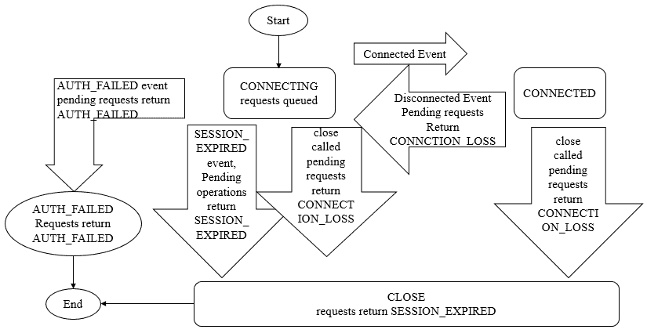

# Zookeeper 源码阅读(十二) Seesion(1)

> 原文：[https://www.cnblogs.com/gongcomeon/p/10198222.html](https://www.cnblogs.com/gongcomeon/p/10198222.html)

### 前言

前面三篇主要从 client 的角度说了下 client 和 server 建立连接的过程，这一篇和后面一篇开始看下 Zookeeper 中非常重要的一个概念：Session，session 是 zookeeper client 和 server 建立和维护连接的单位（我这个描述感觉有点奇怪 😂 ）。

### Session 状态

Zookeeper 的所有操作基本都是基于 session 的，如之前提到的 wathcer 的机制，客户端请求的顺序执行和临时节点的生命周期。

从我们使用 API 的角度，session 的连接和保持就是客户端通过实例化 Zookeeper 对象来与 Zookeeper server 端创建并保持连接 TCP 连接的过程。在客户端与服务器端成功创建了一个连接后，一个会话就被创建了。而在一个会话的生命周期中，session 的状态可能在几种不同的状态中切换，而这些状态可以分为 connecting，connected，reconnecting，reconnected，close 等。

#### 状态切换

1.  客户端尝试去连接服务器端(public ZooKeeper(String connectString, int sessionTimeout, Watcher watcher) throws IOException)，这时客户端回去尝试连接服务器，而 session 的状态就变成了 connecting。这个过程之前在讲 sengthread 的部分有详细讲过，具体是 client 会从 server（HostProvider）的列表里逐个尝试连接；
2.  由于网络或程序等原因导致服务器和客户端断开连接，此时客户端会尝试去重新连接 server，则 session 重新进入 connecting 状态；
3.  重连成功后，session 变为 connected 状态；
4.  会话超时，权限检查失败或客户端主动发起断开连接请求后 session 变为 close 状态。

p.s. 这里要提一下第一步，在 3.2.0 版本中增加了 chroot 后缀（配置时加在后面，不是说这个 chroot 的功能是后缀，而且恰恰相反，功能是前缀）的设置，在 zk 的配置中类似配置 "127.0.0.1:4545/app/a" 或者 "127.0.0.1:3000,127.0.0.1:3001,127.0.0.1:3002/app/a"这样的设置，那么在 zookeeper 上所有的节点前都回家再/app/a 的前缀。所以连接后在 server 上的根节点是/app/a。

作用：`This feature is particularly useful in multi-tenant environments where each user of a particular ZooKeeper service could be rooted differently. This makes re-use much simpler as each user can code his/her application as if it were rooted at "/", while actual location (say /app/a) could be determined at deployment time.` Zookeeper 官方文档是这样描述的，就是说在一台机器或 vm 上有多个 tenant 安装 zookeeper，通过在配置中增加这样的配置，这样根据节点本身就知道它的具体位置。

Zookeeper 官方用下图来表示状态的变化：



结合在 sendthread 介绍中说的，在 startconnect 方法中连接中会把状态设置为 States.CONNECTING，连接成功后,在 Onconnected 方法里会把状态设置为 CONNECTED。

在 zk 的 create/exists/getchildren…等等接口内部最后回去 submitRequest 并把生成的 packet 放入 queue 中，在 queuePacket 方法的 cnLossPacket 方法中会根据状态去处理 session 超时，验证失败和连接丢失的问题。

```java
private void conLossPacket(Packet p) {
    if (p.replyHeader == null) {
        return;
    }
    switch (state) {
    case AUTH_FAILED://验证失败
        p.replyHeader.setErr(KeeperException.Code.AUTHFAILED.intValue());
        break;
    case CLOSED://session 超时导致 close
        p.replyHeader.setErr(KeeperException.Code.SESSIONEXPIRED.intValue());
        break;
    default://其他原因导致连接丢失
        p.replyHeader.setErr(KeeperException.Code.CONNECTIONLOSS.intValue());
    }
    finishPacket(p);
} 
```

在创建 Session 时，需要设置 Session Timeout 这个重要参数。这是 Zookeeper 服务允许一个 Session 在定义它失效之前的时间。如果服务在时间 t 内不能看到与一个 Session 关联的消息，它将定义这个 Session 失效。如果客户端在 1/3 t 时间内没有听到任何从服务器过来的消息，它将发送一个心跳消息给服务器。在(2/3)t 时间， Zookeeper 客户端开始寻找另一个 Zookeeper 服务器，并且它有另外的(1/3)t 的时间寻找。

### 会话创建

#### 实体

```java
public interface SessionTracker {
public static interface Session {
    long getSessionId();， 
    int getTimeout();
    boolean isClosing();
}
public static interface SessionExpirer {
    void expire(Session session);

    long getServerId();
} 
```

可以看到，在 SessionTracker 接口中有两个内部接口 Session 和 SessionExpirer，可以看到分别和 session 与 session 过期有关系。

```java
public static class SessionImpl implements Session {
    SessionImpl(long sessionId, int timeout, long expireTime) {
        this.sessionId = sessionId;
        this.timeout = timeout;
        this.tickTime = expireTime;
        isClosing = false;
    }

    final long sessionId;
    final int timeout;
    long tickTime;
    boolean isClosing;

    Object owner;

    public long getSessionId() { return sessionId; }
    public int getTimeout() { return timeout; }
    public boolean isClosing() { return isClosing; }
} 
```

在 SessionTrackerImpl 类中有 Session 接口的实现类，此类也代表了一个真正的 session 对象。可以看到 SessionImpl 类中有几个变量：

sessionId：会话 ID，用来标识一个唯一会话。每次客户端和 server 连接创建新会话时，zk 会为其分别一个全局唯一的 ID；

timeout：在创建 zookeeper 对象时传入的参数，客户端向 server 发送了这个参数后，服务器会根据 timeout 时间来判断 session 的状态；

ticktime：下次会话超时的时间点，大约为当前时间+timeout，具体之后详细解释；

isclosing：表明一个会话是否已经被关闭，如果一个会话已经被标记为 closing，server 便不会处理来自此 session 的请求。

#### SessionId 生成策略

在 ZookeeperServer 的 processConnectRequest 方法中有对客户端建立连接请求的处理：

```java
if (sessionId != 0) {//sessionId 已经存在
    long clientSessionId = connReq.getSessionId();
    LOG.info("Client attempting to renew session 0x"
            + Long.toHexString(clientSessionId)
            + " at " + cnxn.getRemoteSocketAddress());
    serverCnxnFactory.closeSession(sessionId);
    cnxn.setSessionId(sessionId);
    reopenSession(cnxn, sessionId, passwd, sessionTimeout);//重新打开 session
} else {
    LOG.info("Client attempting to establish new session at "
            + cnxn.getRemoteSocketAddress());
    createSession(cnxn, passwd, sessionTimeout);//新建 session
} 
```

```java
long createSession(ServerCnxn cnxn, byte passwd[], int timeout) {
    long sessionId = sessionTracker.createSession(timeout); 
```

```java
synchronized public long createSession(int sessionTimeout) {
    addSession(nextSessionId, sessionTimeout);
    return nextSessionId++;//每次取过之后 nextSessionId+1
} 
```

```java
synchronized public void addSession(long id, int sessionTimeout) {
    sessionsWithTimeout.put(id, sessionTimeout);
    if (sessionsById.get(id) == null) {
        SessionImpl s = new SessionImpl(id, sessionTimeout, 0);//新建 sessionImpl 对象 
```

可以看到在每次新建 session 是建立在已经保存的 nextSessionId 的基础上的。然后看一下 nextSessionId 的初始化：

```java
public static long initializeNextSession(long id) {
    long nextSid = 0;
    nextSid = (Time.currentElapsedTime() << 24) >>> 8;
    nextSid =  nextSid | (id <<56);
    return nextSid;
} 
```

initializeNextSession 方法在 zookeeperserver 启动时的 startup 方法中，startup 方法会初始化 SessionTrackerImpl 变量，此时 nextSessionId 会被初始化。

这里用到了 Time.currentElapsedTime()方法去获得当前的时间，是一个 64 位的值。但是在之前的版本中用的是 System.currentTimeMillis() 方法。为什么要用新的方法替代原来的值，事实上在正常情况下都不会有问题，但是如果有人修改了系统的时间，那么原来的方法就可能有问题。

至于 nextSid 生成的算法:系统时间先左移 24 位然后无符号右移 8 位然后和 myid 文件中的唯一 id 值左移 56 位生成的值做或操作，这样可以生产一个 64 位的唯一 ID，然后后面的 session 基于这个值递增获得。这也是为什么在 myid 文件中配置唯一 id 时必须要小于 256 的原因。

### SessionTracker

sessiontracker 的作用就是 server 用来管理会话的，它负责了 session 的创建，管理和删除，整个 session 的生命周期都在 sessiontracker 的管理之下。每个 session 在 sessiontracker 内都分成三份保存。

```java
public class SessionTrackerImpl extends ZooKeeperCriticalThread implements SessionTracker {
    private static final Logger LOG = LoggerFactory.getLogger(SessionTrackerImpl.class);

    HashMap<Long, SessionImpl> sessionsById = new HashMap<Long, SessionImpl>(); 

    HashMap<Long, SessionSet> sessionSets = new HashMap<Long, SessionSet>();//

    ConcurrentHashMap<Long, Integer> sessionsWithTimeout;
    long nextSessionId = 0;//下一次 session 的 id
    long nextExpirationTime;//最近的超时时间

    int expirationInterval;//超时检查间隔 
```

```java
static class SessionSet {
    HashSet<SessionImpl> sessions = new HashSet<SessionImpl>();
} 
```

sessionsById 是根据 session 的 id 来管理 session 实体的属性；
sessionSets 则是根据下次超时时间来归档回话，便于会话管理和超时审查，也就是某个时间过期的会话集合；
sessionsWithTimeout 是线程安全的，它也是按照 id 来保存 session 的超时时间间隔，sessionsWithTimeout 和 zk 的内存数据库相通，会定期同步到快照中。

### 思考

这一篇主要说了些宏观的概念和 session id 的生成机制，比较泛，但是是下一篇的基础。

### 参考

[https://zookeeper.apache.org/doc/r3.3.6/zookeeperProgrammers.html](https://zookeeper.apache.org/doc/r3.3.6/zookeeperProgrammers.html)

[https://blog.csdn.net/jeff_fangji/article/details/43916359](https://blog.csdn.net/jeff_fangji/article/details/43916359)

[https://www.jianshu.com/p/594129a44814](https://www.jianshu.com/p/594129a44814)

[http://www.cnblogs.com/leesf456/p/6103870.html](http://www.cnblogs.com/leesf456/p/6103870.html)

[https://xt00002003.iteye.com/blog/2302392](https://xt00002003.iteye.com/blog/2302392)