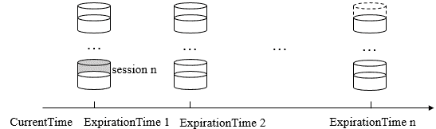
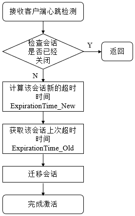

# Zookeeper 源码阅读(十三) Seesion(2)

> 原文：[https://www.cnblogs.com/gongcomeon/p/10211798.html](https://www.cnblogs.com/gongcomeon/p/10211798.html)

### 前言

前一篇主要介绍了 zookeeper 的 session 的状态，状态之间的切换以及和 session 有关的实体 session 接口和 sessiontrackimpl 类的相关属性。这一篇主要详细说下 session 相关的流程。

### session 的创建

在 ZookeeperServer 的 processConnectRequest 方法中处理了 session 的创建和重新激活的请求。

```java
public void processConnectRequest(ServerCnxn cnxn, ByteBuffer incomingBuffer) throws IOException {
    ...
    cnxn.setSessionTimeout(sessionTimeout);
    // We don't want to receive any packets until we are sure that the
    // session is setup
    cnxn.disableRecv();
    long sessionId = connReq.getSessionId();
    if (sessionId != 0) {//如果 sessionId 已经存在
        long clientSessionId = connReq.getSessionId();
        LOG.info("Client attempting to renew session 0x"
                 + Long.toHexString(clientSessionId)
                 + " at " + cnxn.getRemoteSocketAddress());
        serverCnxnFactory.closeSession(sessionId);
        cnxn.setSessionId(sessionId);
        reopenSession(cnxn, sessionId, passwd, sessionTimeout);//重新激活 session
    } else {
        LOG.info("Client attempting to establish new session at "
                 + cnxn.getRemoteSocketAddress());
        createSession(cnxn, passwd, sessionTimeout);//创建 session
    }
} 
```

之后经过 ZookeeperServer(createSession)->SessionTrackerImpl(createSession)->SessionTrackerImpl(addSession)，在 addSession 方法中新建了 session 对象。

```java
synchronized public void addSession(long id, int sessionTimeout) {
    sessionsWithTimeout.put(id, sessionTimeout);
    if (sessionsById.get(id) == null) {
        SessionImpl s = new SessionImpl(id, sessionTimeout, 0);//创建 session 对象，id 的初始化和生成在前一篇有详细讲过
        sessionsById.put(id, s);//设置属性
        if (LOG.isTraceEnabled()) {
            ZooTrace.logTraceMessage(LOG, ZooTrace.SESSION_TRACE_MASK,//打 log
                    "SessionTrackerImpl --- Adding session 0x"
                    + Long.toHexString(id) + " " + sessionTimeout);
        }
    } else {
        if (LOG.isTraceEnabled()) {
            ZooTrace.logTraceMessage(LOG, ZooTrace.SESSION_TRACE_MASK,
                    "SessionTrackerImpl --- Existing session 0x"
                    + Long.toHexString(id) + " " + sessionTimeout);
        }
    }
    touchSession(id, sessionTimeout);//session 激活，后面详细介绍
} 
```

除了 sessionid 的生成外，关于 timeout 也需要强调下，timeout 由客户端确定（在客户端），但必须在服务器规定的最大的(20*ticktime)和最小的 timeout(ticktime*2)之间。

可以看到，session 创建的场景是比较简单的，但是这是 zookeeper server 端处理 session 请求的部分，而 zookeeper client 端更新 session 的场景主要分为两大类：

1.  普通的读写请求，从上面可以看到，server 在每次处理客户端的读写请求时都会有激活 session 的操作；
2.  ping 请求。在第十篇 client-server(2)中有简单提到过。

```java
if (state.isConnected()) {
   //1000(1 second) is to prevent race condition missing to send the second ping
   //also make sure not to send too many pings when readTimeout is small 
    int timeToNextPing = readTimeout / 2 - clientCnxnSocket.getIdleSend() - ((clientCnxnSocket.getIdleSend() > 1000) ? 1000 : 0);//根据和上次发送时间的间隔和根据 api 传入的 sessiontimeout 来决定，readtimeout = 1/2 的 sessiontimeout(SendThread 的 onconnected 方法中赋值)
    //send a ping request either time is due or no packet sent out within MAX_SEND_PING_INTERVAL
    if (timeToNextPing <= 0 || clientCnxnSocket.getIdleSend() > MAX_SEND_PING_INTERVAL) {
        sendPing();
        clientCnxnSocket.updateLastSend();
    } else {
        if (timeToNextPing < to) {
            to = timeToNextPing;
        }
    }
} 
```

可以看到，如果没有其他的请求，client 端大约会在 1/3 的 sessiontimeout 时间后会去尝试 ping server，而这个请求在 server 端也会被 processconnectrequest 处理，也会达到更新 session 的作用。

在 client 端发送请求后，server 端会创建/激活 session，在激活 session 的过程中会有一些策略的处理，首先先看下 session 的分桶策略处理。

#### 分桶

Zookeeper 的会话管理主要是通过 SessionTracker 来负责，其采用了**分桶策略**（将类似的会话放在同一区块中进行管理）进行管理，以便 Zookeeper 对会话进行不同区块的隔离处理以及同一区块的统一处理。



在之前提到的，在 SessionTracker 中主要存了三分和 session 有关的数据，sessionById：这是一个 HashMap<Long,SessionImpl>类型的数据结构，用于根据 sessionID 来管理 Session 实体。sessionWithTimeout：这是一个 ConcurrentHashMap<Long,Integer>类型的数据结构，用于根据 sessionID 来管理会话的超时时间；sessionSets：这是一个 HashMap<Long,SessionSet>类型的数据结构，用于根据下次会话超时时间点来归档会话，便于进行会话管理和超时检查。

而其实所谓的分桶策略，就是按照超时时间把不同的 session 放到一起统一管理，对 session 超时等判断或处理也是按超时时间为单位进行操作，这样也能大大提高效率，也就是说 sessionSets 中，每一个 SessionSet(实际上是一个 SessionImpl 的 hashset)就是一个桶，而桶的标识就是过期时间。

##### 过期时间计算

```java
long expireTime = roundToInterval(Time.currentElapsedTime() + timeout);//timeout = 接口传入的 sessiontimeout 
```

过期时间是在 roundToInterval 方法中计算的。

```java
private long roundToInterval(long time) {
    // We give a one interval grace period
    return (time / expirationInterval + 1) * expirationInterval;//expirationInterval 一般情况是 ticktime
} 
```

这里计算出的 expireTime 就是 sessionSets 中每一个桶的 key，可以知道的是，每一个桶的 expireTime 最终计算结果一定是 expirationInterval 的倍数，而不同的 session 会根据他们激活时间的不同放到不同的桶里。

### Session 激活

在创建 session 后，每次 client 发起请求（ping 或者读写请求），server 端都会重新激活 session，而这个过程就是 session 的激活，也就是所谓的 touchSession。会话激活的过程使 server 可以检测到 client 的存活并让 client 保持连接状态。整个过程的流程图如下：



在代码中主要由 SessionTrackerImpl 的 touchSession 方法处理：

```java
synchronized public boolean touchSession(long sessionId, int timeout) {
    if (LOG.isTraceEnabled()) {//打 log
        ZooTrace.logTraceMessage(LOG,
                                 ZooTrace.CLIENT_PING_TRACE_MASK,
                                 "SessionTrackerImpl --- Touch session: 0x"
                + Long.toHexString(sessionId) + " with timeout " + timeout);
    }
    SessionImpl s = sessionsById.get(sessionId);//根据 id 从(id, session)mapping 关系中取出对应的 session
    // Return false, if the session doesn't exists or marked as closing
    if (s == null || s.isClosing()) {//判断 session 的状态，如果已经关闭就返回
        return false;
    }
    long expireTime = roundToInterval(Time.currentElapsedTime() + timeout);//计算新的超时时间
    if (s.tickTime >= expireTime) {//表明和上次激活还在同一个桶中
        // Nothing needs to be done
        return true;
    }
    SessionSet set = sessionSets.get(s.tickTime);//从老桶中删除
    if (set != null) {
        set.sessions.remove(s);
    }
    s.tickTime = expireTime;//更新过期时间
    set = sessionSets.get(s.tickTime);
    if (set == null) {
        set = new SessionSet();
        sessionSets.put(expireTime, set);
    }
    set.sessions.add(s);//放入新的桶中
    return true;
} 
```

这样整个 session 激活的流程就很清晰了，client 会在读写或者 ping 时更新 session，而 server 端收到请求后激活 session，激活的过程分为下面几步：

1.  检查会话是否已经被关闭；
2.  计算新的超时时间；
3.  定位 session 当前的桶，并从老桶中删除；
4.  根据新的超时时间把 session 迁移到新的桶中。

### session 超时检查

Zk 内部利用 SessionTracker 管理 Session 的整个会话生命周期。SessionTracker 的实现类 SessionTrackerImpl 本身就是一个 session 的超时检查线程逐个地对会话桶中剩下的会话进行清理。之前已经说过，session 被激活后会被转移到新的桶中，现在按时间先后有 t1, t2 两个时间点，如果到了 t2 时间点，t1 时间对应的桶内还有元素，那么代表 t1 对应的桶内的 session 全部过期，需要进行相关的清理工作，而实际上 zk 就是这么工作的，也即 SessionTrackerImpl 线程的检查内容。

```java
@Override
synchronized public void run() {
    try {
        while (running) {
            currentTime = Time.currentElapsedTime();
            if (nextExpirationTime > currentTime) {//如果还没有到过期检测时间
                this.wait(nextExpirationTime - currentTime);//wait 住
                continue;
            }
            SessionSet set;
            set = sessionSets.remove(nextExpirationTime);//把 nextExpirationTime 对应桶的 session 全部删掉，已经全部过期
            if (set != null) {
                for (SessionImpl s : set.sessions) {
                    setSessionClosing(s.sessionId);//设置关闭状态
                    expirer.expire(s);//发起会话关闭请求
                }
            }
            nextExpirationTime += expirationInterval;//更新下一次 session 超时检查时间
             }
    } catch (InterruptedException e) {
        handleException(this.getName(), e);
    }
    LOG.info("SessionTrackerImpl exited loop!");
} 
```

注意：之前提到 session 桶的 key 一定是 expirationInterval 的整数倍，而在 SessionTrackerImpl 中超时检测的过程中，是以 expirationInterval 为单位去进行检测的，每次增加一个 expirationInterval 的时间，这两边互相的配合保证了能检测到所有 session 的桶。

### 会话清理

在进行了 session 的超时检查后，除了把 session 从 SessionTrackerImpl 中删除，还需要针对每个 session 进行清理。SessionTrackerImpl 中的 expirer.expire(s)便发起了 session 清理的请求，开始了这个过程。

#### 标记 session 状态为 closing

因为进行会话清理的工作相对来说较为耗时，而 setSessionClosing(s.sessionId)把 isClosing 设置为了 false，这样在 server 收到来自客户端的请求时在 PrepRequestProcessor 的 pRequest2Txn 和 pRequest 中会去 checkSession 来检查 session 的状态，发现 session 处于 closing 状态后便不会处理响应的请求了。

```java
case OpCode.create:                
    zks.sessionTracker.checkSession(request.sessionId, request.getOwner()); 
```

这是收到客户端 create 请求后检查的代码，其他的请求也是一样，无法通过 checksession 状态。

#### 发起关闭 session 的请求

为了使对该会话的关闭操作在整个服务端集群都生效，Zookeeper 使用了提交会话关闭请求的方式，并立即交付给 PreRequestProcessor 进行处理。

```java
public void expire(Session session) {//zookeeperserver
    long sessionId = session.getSessionId();
    LOG.info("Expiring session 0x" + Long.toHexString(sessionId)
            + ", timeout of " + session.getTimeout() + "ms exceeded");
    close(sessionId);
} 
```

```java
private void close(long sessionId) {//zookeeperserver
    submitRequest(null, sessionId, OpCode.closeSession, 0, null, null);//通过 zookeeper server 的 submitrequest 方法加入到队列中等待 PrepRequestProcessor 处理
} 
```

```java
public void submitRequest(Request si) {
    ...
    try {
            touch(si.cnxn);
            boolean validpacket = Request.isValid(si.type);
            if (validpacket) {
                firstProcessor.processRequest(si);//加入队列
    ... 
```

```java
public void processRequest(Request request) {//
    // request.addRQRec(">prep="+zks.outstandingChanges.size());
    submittedRequests.add(request);
} 
```

通过发起关闭请求的过程可以看到这是一个异步的请求过程，和 client-server 间的异步交互有异曲同工之妙，这里完成了生产者的部分，把请求加入到了一个待处理队列中。

#### 清理临时节点

熟悉 Zk 的同学都知道，zk 的 session 一旦失效，那么在失效 session 建立的临时节点信息就会全部丢失。因此，在这里做 session 相关的清理工作时需要把 session 相关的临时节点信息全部清除。Zookeeper 在内存数据库中会为每个会话都单独保存了一份由该会话维护的所有临时节点集合，因此只需要根据失效 session 的 id 把临时节点列表取到并删除即可。但是在实际场景中有两种特殊情况：

1.  节点删除请求，且删除的节点正是上述临时节点列表中的一个；
2.  临时节点更新（创建，修改）请求，创建目标节点正好是上述临时节点列表中的一个。

**对于第一类请求，需要将所有请求对应的数据节点路径从当前临时节点列表中移出，以避免重复删除，对于第二类请求，需要将所有这些请求对应的数据节点路径添加到当前临时节点列表中，以删除这些即将被创建但是尚未保存到内存数据库中的临时节点。**

前面在发起关闭 session 请求中把请求加入到了 submittedRequests 队列中，在 PrepRequestProcessor 的 run -> pRequest 方法中进行了消费。

```java
protected void pRequest(Request request) throws RequestProcessorException {
    // LOG.info("Prep>>> cxid = " + request.cxid + " type = " +
    // request.type + " id = 0x" + Long.toHexString(request.sessionId));
    request.hdr = null;
    request.txn = null;
    ...
    case OpCode.closeSession:
        pRequest2Txn(request.type, zks.getNextZxid(), request, null, true);
        break; 
```

```java
case OpCode.closeSession:
    // We don't want to do this check since the session expiration thread
    // queues up this operation without being the session owner.
    // this request is the last of the session so it should be ok
    //zks.sessionTracker.checkSession(request.sessionId, request.getOwner());
    HashSet<String> es = zks.getZKDatabase()
            .getEphemerals(request.sessionId);//从 zk 的内存数据库中取出临时节点集合
    synchronized (zks.outstandingChanges) {
        for (ChangeRecord c : zks.outstandingChanges) {//遍历 zk 的事务队列
            //addChangeRecord(new ChangeRecord(request.hdr.getZxid(), path,
            //            null, -1, null));
            //这是 zk delete 节点是增加的 changeRecord，根据 stat 是 null 可以知道有事务是删除节点的，需要把此节点从临时节点列表中删除
            if (c.stat == null) {
                // Doing a delete
                es.remove(c.path);//从临时节点列表中删除
        } else if (c.stat.getEphemeralOwner() == request.sessionId) {//创建和修改时 stat 不为 null，且只要 sessionid 为当前 session 的 id
                es.add(c.path);//把临时节点路径加入 set
            }
        }
        for (String path2Delete : es) {//遍历
            addChangeRecord(new ChangeRecord(request.hdr.getZxid(),//添加临时节点删除的事件
                    path2Delete, null, 0, null));
        }

        zks.sessionTracker.setSessionClosing(request.sessionId);//把
    }

    LOG.info("Processed session termination for sessionid: 0x"
            + Long.toHexString(request.sessionId));
    break; 
```

```java
void addChangeRecord(ChangeRecord c) {
    synchronized (zks.outstandingChanges) {
        zks.outstandingChanges.add(c);
        zks.outstandingChangesForPath.put(c.path, c);
    }
} 
```

这样可以看到事务变更的过程也是一个异步的过程，这里添加了临时节点删除的事件到队列中，但是这里其实并不是典型的队列，因为 outstandingChanges 并不是严格意义上的队列，而是一个 arraylist。

而 FinalRequestProcessor 是此队列的消费者，在 processRequest 方法中完成了事务队列的处理。

```java
synchronized (zks.outstandingChanges) {
    ...
    while (!zks.outstandingChanges.isEmpty()
        && zks.outstandingChanges.get(0).zxid <= request.zxid) {//遍历 outstandingChanges
        ChangeRecord cr = zks.outstandingChanges.remove(0);
        if (cr.zxid < request.zxid) {//zxid 比 request 的版本要早，过期
            LOG.warn("Zxid outstanding "
                    + cr.zxid
                    + " is less than current " + request.zxid);
        }
        if (zks.outstandingChangesForPath.get(cr.path) == cr) {//路径和事务记录 mapping 关系删除
            zks.outstandingChangesForPath.remove(cr.path);
        }
    }
    if (request.hdr != null) {
       TxnHeader hdr = request.hdr;
       Record txn = request.txn;

       rc = zks.processTxn(hdr, txn);//根据事务类型处理事务，closeseesion 就是在 zookeeperserver 中 sessionTracker.removeSession(sessionId);
    }
    // do not add non quorum packets to the queue.
    if (Request.isQuorum(request.type)) {
        zks.getZKDatabase().addCommittedProposal(request);//集群操作，提出 proposal，保证对集群中所有实例可见
    }
} 
```

在 processRequest 中可以看到在消费事务的记录过程中，会根据 request 的类型进行事务处理，调用了 zookeeperserver 的 processTxn 方法。

```java
public ProcessTxnResult processTxn(TxnHeader hdr, Record txn) {
    ProcessTxnResult rc;
    int opCode = hdr.getType();
    long sessionId = hdr.getClientId();//获取 sessionid
    //case OpCode.closeSession:
    //killSession(header.getClientId(), header.getZxid());
    //从 datatree 中删除 session 相关的临时节点
    rc = getZKDatabase().processTxn(hdr, txn);
    if (opCode == OpCode.createSession) {//createsession
        if (txn instanceof CreateSessionTxn) {
            CreateSessionTxn cst = (CreateSessionTxn) txn;
            sessionTracker.addSession(sessionId, cst//增加 session
                    .getTimeOut());
        } else {
            LOG.warn("*****>>>>> Got "
                    + txn.getClass() + " "
                    + txn.toString());
        }
    } else if (opCode == OpCode.closeSession) {
        sessionTracker.removeSession(sessionId);//利用 sessionTracker 删除 session
    }
    return rc;
} 
```

具体删除 session 的操作:

```java
synchronized public void removeSession(long sessionId) {
    SessionImpl s = sessionsById.remove(sessionId);//从 sessionsById 中移除
    sessionsWithTimeout.remove(sessionId);//移除 sessionid 和对应的 timeout
    if (LOG.isTraceEnabled()) {
        ZooTrace.logTraceMessage(LOG, ZooTrace.SESSION_TRACE_MASK,//打 log
                "SessionTrackerImpl --- Removing session 0x"
                + Long.toHexString(sessionId));
    }
    if (s != null) {
        SessionSet set = sessionSets.get(s.tickTime);//把 session 从桶里删除
        // Session expiration has been removing the sessions   
        if(set != null){
            set.sessions.remove(s);
        }
    }
} 
```

到这里 session 及相关的临时节点的有关数据就被删除完了。其实清理 session 临时节点的过程还是比较长的，总结下可以分为下面几步：

1.  收集需要清理的临时节点，收集的方法是从 zkdatabase 中利用 mapping 关系取出，并对两种特殊情况有相应的处理；
2.  添加节点删除事务变更，这里是把 outstandingChanges 当做了一个队列（也可以理解为不是，但是作用类似），在 outstandingChanges 储存了新来的事务变更的记录；
3.  真正删除临时节点，在 zkdatabase 中把 datatree 中的和失效 session 有关的临时节点全部删除；
4.  删除失效 session，这是通过把 SessionTrackerImpl 中的 sessionsById， sessionSets， sessionsWithTimeout 失效 session 的记录都删除做到的。

#### 关闭 NIOServerCnxn

在 FinalRequestProcessor 的 processRequest 方法中会根据请求类型处理 serverCnxn，如果是 closeSession 就会通过 NIOServerCnxnFactory 找到对应的 NIOServerCnxn 并将其删除。

```java
if (request.hdr != null && request.hdr.getType() == OpCode.closeSession) {
    ServerCnxnFactory scxn = zks.getServerCnxnFactory();
    // this might be possible since
    // we might just be playing diffs from the leader
    if (scxn != null && request.cnxn == null) {
        // calling this if we have the cnxn results in the client's
        // close session response being lost - we've already closed
        // the session/socket here before we can send the closeSession
        // in the switch block below
        scxn.closeSession(request.sessionId);//关闭 connection
        return;
    }
} 
```

在 server 端关闭连接后，server 还会把 buffer 中的关闭连接请求发送给客户端。

```java
case OpCode.closeSession: {
    lastOp = "CLOS";
    closeSession = true;//设置 closeSession 状态
    err = Code.get(rc.err);
    break;
} 
```

```java
try {
    cnxn.sendResponse(hdr, rsp, "response");
    if (closeSession) {
        cnxn.sendCloseSession();//发送关闭连接请求给客户端
    } 
```

### session 重连

当客户端与服务端之间的网络连接断开时，Zookeeper 客户端会自动进行反复的重连，直到最终成功连接上 Zookeeper 集群中的一台机器。此时，再次连接上服务端的客户端有可能处于以下两种状态之一。

1.  connected：在会话超时时间内连接上了集群中的任意一台 server；
2.  expired：连接上 server 时已经超时，服务端其实已经进行了会话清理操作，再次连接上的 session 会被视为非法会话。

在客户端与服务端之间维持的是一个长连接，在 sessionTimeout 时间内，服务端会不断地检测该客户端是否还处于正常连接（SessionTrackerImpl），服务端会将客户端的每次操作视为一次有效的心跳检测来反复地进行会话激活。因此，在正常情况下，客户端会话时一直有效的。然而，当客户端与服务端之间的连接断开后，用户在客户端可能主要看到两类异常：CONNECTION_LOSS（连接断开）和 SESSION_EXPIRED（会话过期）。

#### CONNECTION_LOSS

若客户端在 setData 时出现了 CONNECTION_LOSS 现象，此时客户端会收到 None-Disconnected 通知，同时会抛出异常。应用程序需要捕捉异常并且等待 Zookeeper 客户端自动完成重连，一旦重连成功，那么客户端会收到 None-SyncConnected 通知，之后就可以重试 setData 操作。

这里给出客户端判断 connection 丢失重连的情景：

1.  无法连接上 server

```java
to = readTimeout - clientCnxnSocket.getIdleRecv();
} else {
    to = connectTimeout - clientCnxnSocket.getIdleRecv();
}

if (to <= 0) {
    String warnInfo;
    warnInfo = "Client session timed out, have not heard from server in "
        + clientCnxnSocket.getIdleRecv()
        + "ms"
        + " for sessionid 0x"
        + Long.toHexString(sessionId);
    LOG.warn(warnInfo);
    throw new SessionTimeoutException(warnInfo);//抛出 session 超时异常
} 
```

在 clientCnxn 的 sendthread 的 run 方法中对几种 exception 进行了处理：

```java
// this is ugly, you have a better way speak up
if (e instanceof SessionExpiredException) {
    LOG.info(e.getMessage() + ", closing socket connection");
} else if (e instanceof SessionTimeoutException) {
    LOG.info(e.getMessage() + RETRY_CONN_MSG);
} else if (e instanceof EndOfStreamException) {
    LOG.info(e.getMessage() + RETRY_CONN_MSG);
} else if (e instanceof RWServerFoundException) {
    LOG.info(e.getMessage());
} else if (e instanceof SocketException) {
    LOG.info("Socket error occurred: {}: {}", serverAddress, e.getMessage());
} else {
    LOG.warn("Session 0x{} for server {}, unexpected error{}",
                    Long.toHexString(getSessionId()),
                    serverAddress,
                    RETRY_CONN_MSG,
                    e);
}
cleanup();//清理客户端的队列等的残留 
```

```java
private void cleanup() {
    clientCnxnSocket.cleanup();
    synchronized (pendingQueue) {//清除 pendingqueue 中的 request
        for (Packet p : pendingQueue) {
            conLossPacket(p);
        }
        pendingQueue.clear();
    }
    synchronized (outgoingQueue) {//清除 outgoingqueue 中的 packet
        for (Packet p : outgoingQueue) {
            conLossPacket(p);
        }
        outgoingQueue.clear();
    } 
```

#### Session Expired

客户端与服务端断开连接后，重连时间耗时太长，超过了会话超时时间限制后没有成功连上服务器，服务器会进行会话清理，此时，客户端不知道会话已经失效，状态还是 DISCONNECTED，如果客户端重新连上了服务器，此时状态为 SESSION_EXPIRED，用于需要重新实例化 Zookeeper 对象，并且看应用的复杂情况，重新恢复临时数据。

1.  连接 server 时间过长：

```java
void onConnected(int _negotiatedSessionTimeout, long _sessionId,
        byte[] _sessionPasswd, boolean isRO) throws IOException {
    negotiatedSessionTimeout = _negotiatedSessionTimeout;
    if (negotiatedSessionTimeout <= 0) {
        state = States.CLOSED;
	   ...
        warnInfo = "Unable to reconnect to ZooKeeper service, session 0x"
            + Long.toHexString(sessionId) + " has expired";
        LOG.warn(warnInfo);
        throw new SessionExpiredException(warnInfo);//抛出 session 过期异常
    } 
```

这里跑出了 session 超时的异常，也会被上面的函数捕捉并清理队列重新进行连接。

#### Session Moved

客户端会话从一台服务器转移到另一台服务器，即客户端与服务端 S1 断开连接后，重连上了服务端 S2，此时会话就从 S1 转移到了 S2。当多个客户端使用相同的 sessionId/sessionPasswd 创建会话时，会收到 SessionMovedException 异常。因为一旦有第二个客户端连接上了服务端，就被认为是会话转移了。

```java
synchronized public void checkSession(long sessionId, Object owner) throws KeeperException.SessionExpiredException, KeeperException.SessionMovedException {
    SessionImpl session = sessionsById.get(sessionId);
    if (session == null || session.isClosing()) {
        throw new KeeperException.SessionExpiredException();
    }
    if (session.owner == null) {
        session.owner = owner;
    } else if (session.owner != owner) {//session 的 owner 不一致
        throw new KeeperException.SessionMovedException();
    }
} 
```

### 思考

#### 针对 zkdatabase 临时节点列表的两种特殊处理

针对删除的请求对应的节点直接把节点从临时节点列表删除，这样在删除的事务中会把节点真正删掉；而更新的则不需要判断，因为除了删除请求外其他事务请求中只要 sessionid 和失效 sessionid 一致的都加入待删除队列就 OK。而之所以要处理更新的节点是因为如果增加节点那么很有可能这些几点还没有写入内存数据库中，需要在这里再扫描一次事务队列，确保不会有临时节点的残留。

```java
 for (ChangeRecord c : zks.outstandingChanges) {//遍历 zk 的事务队列
            //addChangeRecord(new ChangeRecord(request.hdr.getZxid(), path,
            //            null, -1, null));
            //这是 zk delete 节点是增加的 changeRecord，根据 stat 是 null 可以知道有事务是删除节点的，需要把此节点从临时节点列表中删除
            if (c.stat == null) {
                // Doing a delete
                es.remove(c.path);//从临时节点列表中删除
        } else if (c.stat.getEphemeralOwner() == request.sessionId) {//创建和修改时 stat 不为 null，且只要 sessionid 为当前 session 的 id
                es.add(c.path);//把临时节点路径加入 set
            }
        } 
```

#### session owner

每一个 ServerCnxn 对象都有一个 me 属性(object)标识自己，在 zookeeperserver 中 si.setOwner(ServerCnxn.me);设置了 request 的 owner，也初始化为 session 的 owner。

### 参考

[https://www.jianshu.com/p/594129a44814](https://www.jianshu.com/p/594129a44814)

[http://www.cnblogs.com/leesf456/p/6103870.html](http://www.cnblogs.com/leesf456/p/6103870.html)

[https://blog.csdn.net/pwlazy/article/details/8157368](https://blog.csdn.net/pwlazy/article/details/8157368)

[https://www.jianshu.com/p/3b7f9a032ded](https://www.jianshu.com/p/3b7f9a032ded)

[https://www.cnblogs.com/davidwang456/p/5009659.html](https://www.cnblogs.com/davidwang456/p/5009659.html)

zk session 代码在 3.5 之后有修改，可参考 https://blog.csdn.net/jpf254/article/details/80804458

《从 paxos 到 zookeeper》