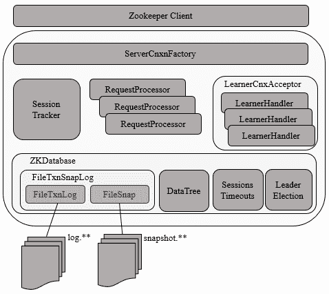
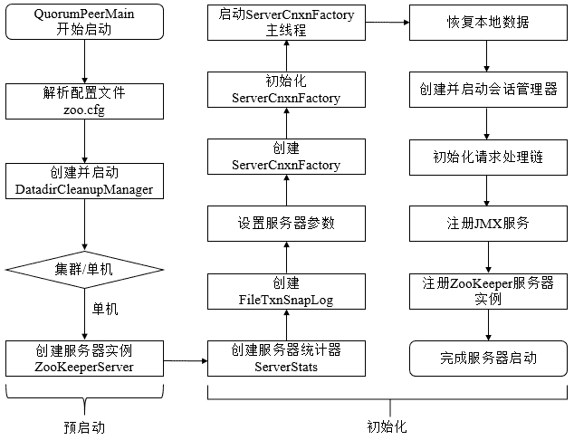

# Zookeeper 源码阅读(十四) 单机 Server

> 原文：[https://www.cnblogs.com/gongcomeon/p/10247122.html](https://www.cnblogs.com/gongcomeon/p/10247122.html)

### 前言

前面两篇主要说了下 client-server 的 session 相关的内容，到这里 client 的内容以及 client-server 的连接的内容也就基本告一段落了，剩下的部分就是 server 部分内部的结构，zk 的选举以及 server 部分的工作机制等了。 这一篇主要说下单机 server 的启动过程，里面会涉及到一些 server 内部的工作机制和机构。

### Server 架构



可以看到 Zookeeper 的 server 端主要分为几个大模块，ZKDatabase 是 zk server 内部的内存数据库，内部维护了节点数据等关键数据，负责快照和日志的记录，同时也管理了 session 的超时和集群的选举，其他的部分主要有负责管理 session 的 sessiontracker，负责处理请求的请求链和 Learner 模块（集群沟通？目前还不是特别清楚）。

### 单机版 Server 启动

单机版 Server 主要流程：



从上图中可以看到单机 server 启动可以分为预启动和初始化两个部分。

#### 预启动

##### 1\. 统一由 QuorumPeerMain 作为启动类

无论单机或集群，在 zkServer.cmd 和 zkServer.sh 中都配置了 QuorumPeerMain 作为启动入口类。

##### 2\. 解析 zoo.cfg

用过 ZK 的同学都知道 zoo.cfg 是用户配置的 zookeeper 核心配置文件，ticktime，dataDir，dataLogDir，集群 ip:port 等都配置在其中。在实例化 QuorumPeerMain 对象后会去解析 zoo.cfg 文件。

QuorumPeerMain(Main)->QuorumPeerMain(initializeAndRun)->QuorumPeerConfig(parse)->QuorumPeerConfig(parseProperties)

parseProperties 函数太长了。。。而且都是很简单的 property 文件取值的操作，可以简单看下。

##### 3\. 创建并启动历史文件清理器 DatadirCleanupManager

DatadirCleanupManager 的 start 方法负责自动清理历史的快照和事务日志。

```java
public void start() {
    if (PurgeTaskStatus.STARTED == purgeTaskStatus) {
        LOG.warn("Purge task is already running.");
        return;
    }
    // Don't schedule the purge task with zero or negative purge interval.
    if (purgeInterval <= 0) {
        LOG.info("Purge task is not scheduled.");
        return;
    }

    timer = new Timer("PurgeTask", true);//利用了 java 的 Timer 类来做定时任务
    TimerTask task = new PurgeTask(dataLogDir, snapDir, snapRetainCount);//PurgeTask 是一个 timertask
    timer.scheduleAtFixedRate(task, 0, TimeUnit.HOURS.toMillis(purgeInterval));//设置频率

    purgeTaskStatus = PurgeTaskStatus.STARTED;
} 
```

##### 4\. 判断启动模式

```java
if (args.length == 1 && config.servers.size() > 0) {//通过解析 zoo.cfg server 数量来判断是否是集群
    runFromConfig(config);//如果是集群，直接用 QuorumPeerMain 中集群启动方法
} else {
    LOG.warn("Either no config or no quorum defined in config, running "
            + " in standalone mode");
    // there is only server in the quorum -- run as standalone
    ZooKeeperServerMain.main(args);//如果是单机就用单机启动方法
} 
```

##### 5\. 再次解析 zoo.cfg

ZooKeeperServerMain(Main)->ZooKeeperServerMain(initializeAndRun)->ServerConfig(parse)->QuorumPeerConfig(parse)->QuorumPeerConfig(parseProperties)。

这里之所以还要进行一次解析是因为这里是调用的 zookeeperserver 的 main 方法，无法把原来解析的参数传入。而且配置文件比较小，解析并不是特别耗资源，可以接受。

##### 6\. 创建 ZookeeperServer 实例

ZookeeperServer 是 server 端的核心类，在启动时会创建 zookeeperserver 的一个实例。

```java
final ZooKeeperServer zkServer = new ZooKeeperServer(); 
```

到这里位置就完成了所谓的预启动，可以看出，在预启动阶段 Zookeeper 的 server 干了下面几件事：

1.  清理历史快照和 log 文件；
2.  解析配置文件并进行初步的分析，判断 Server 端状态（Standalone/Cluster）；
3.  实例化 ZookeeperServer。

#### 初始化

在实例化了 zookeeperserver 之后，zookeeper server 端的启动过程便来到了初始化阶段，这个过程也是比较长的。

首先是在 runfromconfig 方法中：

```java
public void runFromConfig(ServerConfig config) throws IOException {
    LOG.info("Starting server");
    FileTxnSnapLog txnLog = null;
    try {
        // Note that this thread isn't going to be doing anything else,
        // so rather than spawning another thread, we will just call
        // run() in this thread.
        // create a file logger url from the command line args
        final ZooKeeperServer zkServer = new ZooKeeperServer();//1
        // Registers shutdown handler which will be used to know the
        // server error or shutdown state changes.
        final CountDownLatch shutdownLatch = new CountDownLatch(1);//2
        zkServer.registerServerShutdownHandler(
                new ZooKeeperServerShutdownHandler(shutdownLatch));

        txnLog = new FileTxnSnapLog(new File(config.dataLogDir), new File(//3
                config.dataDir));
        zkServer.setTxnLogFactory(txnLog);
        zkServer.setTickTime(config.tickTime);
        zkServer.setMinSessionTimeout(config.minSessionTimeout);
        zkServer.setMaxSessionTimeout(config.maxSessionTimeout);
        cnxnFactory = ServerCnxnFactory.createFactory();
        cnxnFactory.configure(config.getClientPortAddress(),
                config.getMaxClientCnxns());
        cnxnFactory.startup(zkServer);
        // Watch status of ZooKeeper server. It will do a graceful shutdown
        // if the server is not running or hits an internal error.
        shutdownLatch.await();
        shutdown();

        cnxnFactory.join();
        if (zkServer.canShutdown()) {
            zkServer.shutdown(true);
        }
    } catch (InterruptedException e) {
        // warn, but generally this is ok
        LOG.warn("Server interrupted", e);
    } finally {
        if (txnLog != null) {
            txnLog.close();
        }
    }
} 
```

##### 1\. 创建服务器统计器 ServerStats

在上面代码的 1 处，也就是 zookeeperserver 的构造函数内实例化了 Server 的统计器 ServerStats。

```java
public ZooKeeperServer() {
    serverStats = new ServerStats(this); //ServerStats 统计了基本的 server 的数据如收发 packet 数，延迟信息等。
    listener = new ZooKeeperServerListenerImpl(this);
} 
```

简单介绍下 ServerStats：

```java
/**
 * Basic Server Statistics
 */
 //从注释也可以知道 ServerStats 是 server 数据的基础类
public class ServerStats {
    private long packetsSent;//zkserver 启动后，或是最近一次充值服务端统计信息后，服务端->客户端发送的响应次数
    private long packetsReceived;//zkserver 启动后，或是最近一次充值服务端统计信息后，服务端收到的客户端发送的响应次数
    private long maxLatency;//zkserver 启动后，或是最近一次充值服务端统计信息后，server 端请求处理的最大延时
    private long minLatency = Long.MAX_VALUE;//zkserver 启动后，或是最近一次充值服务端统计信息后，server 端请求处理的最小延时
    private long totalLatency = 0;//zkserver 启动后，或是最近一次充值服务端统计信息后，server 端请求处理的总延时
    private long count = 0;//zkserver 启动后，或是最近一次充值服务端统计信息后，server 端处理的客户端请求总次数

    private final Provider provider;//provider 对象提供部分统计数据，如下

    public interface Provider {
        public long getOutstandingRequests();//获取队列中还没有被处理的请求数量，在 zookeeperserver 和 finalrequestprocessor 中
        public long getLastProcessedZxid();//获得目前最新的 zxid
        public String getState();//获取服务器状态
        public int getNumAliveConnections();//获取存活的客户端连接总数
    }

    public ServerStats(Provider provider) {//构造器
        this.provider = provider;
    } 
```

##### 2\. 创建数据管理器 FileTxnSnapLog

> FileTxnSnapLog 是 Zookeeper 上层服务器和底层数据存储之间的对接层，提供了一系列操作数据文件的接口，如事务日志文件和快照数据文件。Zookeeper 根据 zoo.cfg 文件中解析出的快照数据目录 dataDir 和事务日志目录 dataLogDir 来创建 FileTxnSnapLog。

其实这里的 FileTxnSnapLog 就是包含了第 3，4 篇中讲的快照和日志类 FileTxnLog，FileSnap 的功能类，FileTxnLog，FileSnap 的生成以来 dataDir 和 snapDir（dataLogDir）来生成。

##### 3\. 设置服务器 tickTime 和会话超时时间限制

```java
zkServer.setTickTime(config.tickTime);
zkServer.setMinSessionTimeout(config.minSessionTimeout);
zkServer.setMaxSessionTimeout(config.maxSessionTimeout); 
```

##### 4\. 创建 ServerCnxnFactory

通过配置系统属性 zookeper.serverCnxnFactory 来指定使用 Zookeeper 自己实现的 NIO 还是使用 Netty 框架作为 Zookeeper 服务端网络连接工厂。

```java
cnxnFactory = ServerCnxnFactory.createFactory();//创建 ServerCnxnFactory
cnxnFactory.configure(config.getClientPortAddress(),
        config.getMaxClientCnxns());//初始化 ServerCnxnFactory
cnxnFactory.startup(zkServer);//启动 ServerCnxnFactory 
```

之前提到过这里利用到了反射。

```java
static public ServerCnxnFactory createFactory() throws IOException {
    String serverCnxnFactoryName =
        System.getProperty(ZOOKEEPER_SERVER_CNXN_FACTORY);//读取配置
    if (serverCnxnFactoryName == null) {
        serverCnxnFactoryName = NIOServerCnxnFactory.class.getName();//默认是 NIO 实现
    }
    try {
        ServerCnxnFactory serverCnxnFactory = (ServerCnxnFactory) Class.forName(serverCnxnFactoryName)//如果配置了，则按照配置来实例化。反射
                .getDeclaredConstructor().newInstance();
        LOG.info("Using {} as server connection factory", serverCnxnFactoryName);
        return serverCnxnFactory;
    } catch (Exception e) {
        IOException ioe = new IOException("Couldn't instantiate "
                + serverCnxnFactoryName);
        ioe.initCause(e);
        throw ioe;
    }
} 
```

##### 5\. 初始化 ServerCnxnFactory

NIOServerCnxnFactory(configure)

```java
@Override
public void configure(InetSocketAddress addr, int maxcc) throws IOException {
    configureSaslLogin();

    thread = new ZooKeeperThread(this, "NIOServerCxn.Factory:" + addr);//传入的 runnable 对象是 ServerCnxnFactory 的实现类
thread.setDaemon(true);//设置为 daemon 线程
    maxClientCnxns = maxcc;//NIO 相关的设置
    this.ss = ServerSocketChannel.open();
    ss.socket().setReuseAddress(true);
    LOG.info("binding to port " + addr);
    ss.socket().bind(addr);
    ss.configureBlocking(false);
    ss.register(selector, SelectionKey.OP_ACCEPT);
} 
```

可以看到，Zookeeper 会初始化 Thread 作为 ServerCnxnFactory 的主线程，然后再初始化 NIO 服务器。而 zookeeper 初始化的 thread 传入的 runnable 对象依然是 ServerCnxnFactory 的实现类，也就是说 run 的时候依然是执行 ServerCnxnFactory。

##### 6\. 启动 ServerCnxnFactory 主线程

```java
@Override
public void startup(ZooKeeperServer zks) throws IOException,
        InterruptedException {
    start();//启动主线程
    setZooKeeperServer(zks);//设置 server 端对象
    zks.startdata();//恢复数据等
    zks.startup();
} 
```

其中 start 方法启动了线程。

```java
public void start() {
    // ensure thread is started once and only once
    if (thread.getState() == Thread.State.NEW) {//如果是刚启动
        thread.start();//启动线程
    }
} 
```

NIOServerCnxnFactory 的 run 方法是 NIO 异步连接的一些基本设置如建立连接等。

##### 7\. 恢复本地数据

每次 zk 启动时，都需要从本地块找数据文件和事务日志文件中进行数据恢复。NIOServerCnxnFactory(startdata)->ZooKeeperServer(startdata)中进行了恢复 data 的操作。

##### 8\. 创建并启动 session 管理器

所谓的 session 管理器就是前面说的 sessiontracker。

```java
public synchronized void startup() {
    if (sessionTracker == null) {
        createSessionTracker();//创建 session 管理器
    }
    startSessionTracker();//启动 session 管理器
    setupRequestProcessors();//初始化 zookeeper 请求处理链

    registerJMX();//注册 JMX 服务

    setState(State.RUNNING);
    notifyAll();
} 
```

```java
protected void createSessionTracker() {
    sessionTracker = new SessionTrackerImpl(this, zkDb.getSessionWithTimeOuts(),
            tickTime, 1, getZooKeeperServerListener());//创建 sessiontrack，初始化管理器里的 sessionsWithTimeout,expirationInterval 等变量，特别的是，初始化 sessionId 也在这里一起做了
} 
```

##### 9\. 初始化 Zookeeper 的请求处理链

```java
protected void setupRequestProcessors() {
    RequestProcessor finalProcessor = new FinalRequestProcessor(this);
    RequestProcessor syncProcessor = new SyncRequestProcessor(this,
            finalProcessor);
    ((SyncRequestProcessor)syncProcessor).start();
    firstProcessor = new PrepRequestProcessor(this, syncProcessor);
    ((PrepRequestProcessor)firstProcessor).start();
} 
```


zookeeper 请求处理方式基于责任链模式，也就是说在 server 端有多个请求处理器一次来处理一个客户端请求。在服务器启动的时候，会将这些处理器串联起来形成一个处理链。上图是单机 server 的处理器。

##### 10\. 注册 JMX 服务

ZK 服务器的信息会以 JXM 的方式暴露给外部。这里还不太了解。

##### 11\. 注册 ZK 服务器实例

```java
public void submitRequest(Request si) {
    if (firstProcessor == null) {
        synchronized (this) {
            try {
                // Since all requests are passed to the request
                // processor it should wait for setting up the request
                // processor chain. The state will be updated to RUNNING
                // after the setup.
                while (state == State.INITIAL) {//如果在初始化时会 wait 住
                    wait(1000);
                }
            } catch (InterruptedException e) {
                LOG.warn("Une 
```

通过上面代码的注释可以知道在初始化时请求提交处理会 wait 住，而这个函数是在 NIOServerCnxnFactory(run)->NIOServerCnxn(doIO)->ZookeeperServer(processConnectRequest)->ZookeeperServer(createSession)->ZookeeperServer(submitRequest)中调用的，也即是前面在启动 ServerCnxnFactory 主线程时便会在这里 wait 住。

```java
setState(State.RUNNING);
notifyAll(); 
```

而在这里便会 notify 时线程可以完全工作。

### 思考

#### JMX 需要再学习

#### 请求链和日志/快照清理过程

### 参考

[http://www.cnblogs.com/leesf456/p/6105276.html](http://www.cnblogs.com/leesf456/p/6105276.html)

[https://www.jianshu.com/p/47cb9e6d309d](https://www.jianshu.com/p/47cb9e6d309d)
[https://my.oschina.net/pingpangkuangmo/blog/491673](https://my.oschina.net/pingpangkuangmo/blog/491673)

[https://my.oschina.net/xianggao/blog/537902](https://my.oschina.net/xianggao/blog/537902)

[https://www.jianshu.com/p/76d6d674530b](https://www.jianshu.com/p/76d6d674530b)

从 paxos 到 zk