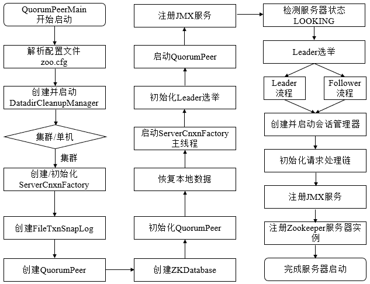

# Zookeeper 源码阅读(十五) Zookeeper 集群之 server 启动

> 原文：[https://www.cnblogs.com/gongcomeon/p/10333999.html](https://www.cnblogs.com/gongcomeon/p/10333999.html)

### 前言

最近又开启了一个新项目，时间比较紧，博客写的速度也比较慢，但是还是不能放松要求<sub>希望最近周末能抽点时间把上周漏掉的博客补上</sub>

在前一篇大致描述了单机 server 的启动过程后，从这一篇开始我们将开始集群 server 的一些机制的一些了解，主要还有 servr 的启动，处理链，选举等等大的模块需要完善。

### 流程

其实从大致的流程上来说，单机 server 和集群 server 的处理是基本一致的，都是会从主函数启动然后去初始化一些 zookeeper 运行必须的一些功能类，而最大的不同点也就在于集群 server 是分布式的，多了一个选举的过程，这个选举的过程本篇不会深入去讲，应该会分为两篇，一篇讲 Zookeeper 选举依赖的 ZAB 算法，另一篇主要说下具体的流程。

首先通过流程图看下集群 server 的启动过程：



从图中也可以看到，确实和上一篇所说的单机 server 的启动流程大致一致。

总的来说，和单机 server 的启动过程相比，除了预启动和初始化两个状态之外，还有一个 leader 选举的过程。

### 预启动

1.  与单机 server 启动过程一样，集群 server 启动同样以 QuorumPeerMain 类作为启动类；

2.  解析 zoo.cfg；

3.  创建并启动历史文件清理器 DatadirCleanupManager；

4.  判断启动模式。

    ```java
    if (args.length == 1 && config.servers.size() > 0) {
        runFromConfig(config);
    } 
    ```

    可以看到，在集群模式下（zoo.cfg 中配置了多个 server），zk 会直接开始以集群模式启动 server。这部分的启动顺序和单机版的是基本一致的，它们都是共用的同一份代码。

### 初始化

在预启动之后便是初始化的过程。

```java
public void runFromConfig(QuorumPeerConfig config) throws IOException {
  try {
      ManagedUtil.registerLog4jMBeans();//注册 log 的 bean
  } catch (JMException e) {
      LOG.warn("Unable to register log4j JMX control", e);
  }

  LOG.info("Starting quorum peer");
  try {
      ServerCnxnFactory cnxnFactory = ServerCnxnFactory.createFactory();//创建 ServerCnxnFactory
      cnxnFactory.configure(config.getClientPortAddress(),//初始化 ServerCnxnFactory
                            config.getMaxClientCnxns());

      //创建并初始化 QuorumPeer
      quorumPeer = getQuorumPeer();

      //初始化的数据基本都是从 zoo.cfg 中读到的值，方法名也叫 runFromConfig
      quorumPeer.setQuorumPeers(config.getServers());
      quorumPeer.setTxnFactory(new FileTxnSnapLog(//创建数据管理器 FileTxnSnapLog
              new File(config.getDataLogDir()),
              new File(config.getDataDir())));
      quorumPeer.setElectionType(config.getElectionAlg());
      quorumPeer.setMyid(config.getServerId());
      quorumPeer.setTickTime(config.getTickTime());
      quorumPeer.setInitLimit(config.getInitLimit());
      quorumPeer.setSyncLimit(config.getSyncLimit());
      quorumPeer.setQuorumListenOnAllIPs(config.getQuorumListenOnAllIPs());
      quorumPeer.setCnxnFactory(cnxnFactory);
      quorumPeer.setQuorumVerifier(config.getQuorumVerifier());
      quorumPeer.setClientPortAddress(config.getClientPortAddress());
      quorumPeer.setMinSessionTimeout(config.getMinSessionTimeout());
      quorumPeer.setMaxSessionTimeout(config.getMaxSessionTimeout());
      quorumPeer.setZKDatabase(new ZKDatabase(quorumPeer.getTxnFactory()));
      quorumPeer.setLearnerType(config.getPeerType());
      quorumPeer.setSyncEnabled(config.getSyncEnabled());

      // sets quorum sasl authentication configurations
      quorumPeer.setQuorumSaslEnabled(config.quorumEnableSasl);
      if(quorumPeer.isQuorumSaslAuthEnabled()){
          quorumPeer.setQuorumServerSaslRequired(config.quorumServerRequireSasl);
          quorumPeer.setQuorumLearnerSaslRequired(config.quorumLearnerRequireSasl);
          quorumPeer.setQuorumServicePrincipal(config.quorumServicePrincipal);
          quorumPeer.setQuorumServerLoginContext(config.quorumServerLoginContext);
          quorumPeer.setQuorumLearnerLoginContext(config.quorumLearnerLoginContext);
      }

      quorumPeer.setQuorumCnxnThreadsSize(config.quorumCnxnThreadsSize);
      quorumPeer.initialize();

      quorumPeer.start();
      quorumPeer.join();
  } catch (InterruptedException e) {
      // warn, but generally this is ok
      LOG.warn("Quorum Peer interrupted", e);
  }
} 
```

通过上面的代码及注释可以看出，初始化过程分为下面几步：

1.  创建和初始化 ServerCnxnFactory；
2.  创建 QuorumPeer 实例，并初始化。
    1.  创建数据管理器 FileTxnSnapLog；
    2.  创建内存数据库 ZKDatabase；
3.  恢复本地数据；
4.  启动 ServerCnxnFactory 线程。

3,4 两步都是在 quorumPeer.start();中完成的，特别要注意的是，QuorumPeer 重写了 thread 类的 start 方法，所以这里调用了 start 方法并不是直接去调用 QuorumPeer 的 run 方法，而真正调用 QuorumPeer 的 run 方法是在 QuorumPeer 的 start 方法中 super.start()这一步。

```java
@Override
public synchronized void start() {
    loadDataBase();//恢复本地数据
    cnxnFactory.start();//启动 ServerCnxnFactory 线程
    startLeaderElection();//启动 leader 选举
    super.start();//启动 QuorumPeer 线程，并在
} 
```

这里可以看到，在 start 的过程中，会有一步是做 leader 的选举的，而这也是集群和单机 server 启动时最大的区别，这一步将在下篇博客中专门讲一下。

而至于 super.start()，这部分主要干了两个是：

1.  JMX 服务注册；
2.  检查 server 状态，并在适当状态进行 leader 选举。

这两部在下篇也会详细说。

### 思考

单机和集群 server 启动中，除了集群 server 启动多了一个 leader 选举过程外，还有个区别是单机 server 会读两遍 zoo.cfg，其实为什么不在 ZookeeperMain 里“重载”main 方法（写个流程差不多的方法），以 QuorumPeerConfig 作为参数，这样就不用读第二遍了。不过估计是因为读配置工作量比较小，所以没有做这个事。

### 参考

从 paxos 到 zk