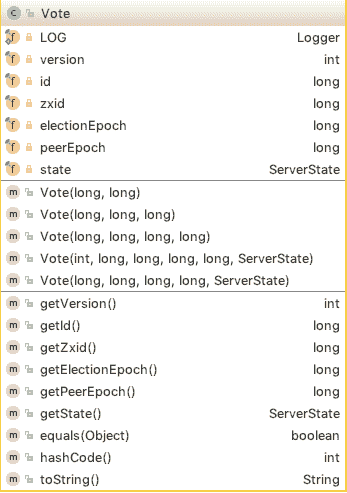
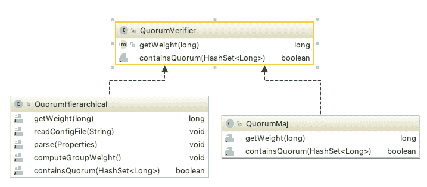

# Zookeeper 源码阅读（十六）选举之选票与集群校验

> 原文：[https://www.cnblogs.com/gongcomeon/p/10817001.html](https://www.cnblogs.com/gongcomeon/p/10817001.html)

目录

*   [前言](#前言)
*   [状态](#状态)
*   [选票](#选票)
*   [集群校验](#集群校验)
    *   [调用](#调用)
*   [思考](#思考)
*   [参考](#参考)

### 前言

前面一篇博客分析了 ZAB 的设计思想和包括快速选举在内的基本的过程，但在实际的 Zookeeper 工程中，为了达到 ZAB 的目标，还是有许多的内部的逻辑和机制，这一篇我们会先分析下为了实现选举 Zookeeper 所做的准备工作。

值得一提的是，Zookeeper 的选举可以分为几步去讲，在写这几篇博客之前参考了不少资料，建议读者在完整过我这几篇博客之前可以先完整看一下参考一，这篇博客从整体上比较完整地叙述了真实的 zookeeper 工程里的选举过程。

### 状态

我们首先看一些基本的概念。

```java
public enum ServerState {
    LOOKING, FOLLOWING, LEADING, OBSERVING;
} 
```

可以看到，在 Zookeeper 中总共定义了 4 中状态：

LOOKING: 表示此台机器正在寻找 leader，也就是说在选举状态；

FOLLOWING: 表示此台机器是 follower；

LEADING: 表示此台机器是 leader；

OBSERVING: 表示此台机器是 observer。

### 选票



Vote 类是 zk 选举的实体类，通过上图可以看到 Vote 类中有几个核心的成员变量，这几个成员变量在后面具体的选举算法中起到了很关键的作用，Zookeeper 的快速选举算法就是利用 id, zxid 和 epoch 来选举出新的 leader。

先简单介绍下几个核心成员变量的含义：

id：选票推举的 leader 的 SID(配置文件中配置的)

zxid：被推举的 leader 的事务 ID

electionEpoch：逻辑时钟。是一个递增的数字，通过对比 electionEpoch 来判断 server 自己的 Vote 和其他 Vote 是否在同一个选举轮次中。每次进入一个新的选举轮次，electionEpoch 都会+1。

peerEpoch：被推举的 leader 的 epoch。

state：就是前面说的几种当前 server 的状态。

### 集群校验

在 [ZK 思考](https://www.cnblogs.com/gongcomeon/p/10733150.html) 这一篇最后有提出一个问题，也就是 zookeeper 集群出现了网络分区的情况，集群中的 server 会怎么处理呢？利用 QuorumVerifier 可以部分回答这个问题。



可以看到，QuorumVerifier 有两个实现类，但现在基本都默认使用 QuorumMaj 类，即投票是否满足超过一半的集群数目。可以简单分析下代码：

```java
/**
 * This class implements a validator for majority quorums. The 
 * implementation is straightforward.
 *
 */
public class QuorumMaj implements QuorumVerifier {
    private static final Logger LOG = LoggerFactory.getLogger(QuorumMaj.class);

    int half;

    /**
     * Defines a majority to avoid computing it every time.
     * 
     * @param n number of servers
     */
    public QuorumMaj(int n){
        this.half = n/2;
    }

    /**
     * Returns weight of 1 by default.
     * 
     * @param id 
     */
  	//这个方法在此类中是没有太多含义的，之所返回 1 是因为在 totalOrderPredicate 方法中有个判断，如果返回值==0 会直接判小，这个在 QuorumVerifier 的另一个实现类中才会有返回 0 的可能性。
    public long getWeight(long id){
        return (long) 1;
    }

    /**
     * Verifies if a set is a majority.
     */
  	//判断投票值是否超过了一半的 server
    public boolean containsQuorum(HashSet<Long> set){
        return (set.size() > half);
    }

} 
```

#### 调用

```java
/**
 * Termination predicate. Given a set of votes, determines if
 * have sufficient to declare the end of the election round.
 *
 *  @param votes    Set of votes
 *  @param l        Identifier of the vote received last
 *  @param zxid     zxid of the the vote received last
 */
protected boolean termPredicate(
        HashMap<Long, Vote> votes,
        Vote vote) {

    HashSet<Long> set = new HashSet<Long>();

    /*
     * First make the views consistent. Sometimes peers will have
     * different zxids for a server depending on timing.
     */
    for (Map.Entry<Long,Vote> entry : votes.entrySet()) {
        if (vote.equals(entry.getValue())){
            set.add(entry.getKey());
        }
    }

    return self.getQuorumVerifier().containsQuorum(set);//1
} 
```

termPredicate 是决定当前 server 收到的投票是否生效的方法，也就是之前提到的部分回答了网络分区的问题的地方。这里可以看到在 1 处当 server 收集了收到的所有的选票后，会和所有 server 个数作对比，如果没有超过一般的话依然无效。也就是说，即使出现了网络分区的情况，少部分的机器即使进入了选举状态也无法选出 LEADER。

### 思考

值得注意的是，observer 并不在校验的集群列表里。在 QuorumPeerConfig 类的读取配置的时候就已经把 observer 过滤了。

### 参考

[https://www.cnblogs.com/leesf456/p/6107600.html](https://www.cnblogs.com/leesf456/p/6107600.html)

[https://www.jianshu.com/p/e5ae0b6e07a2](https://www.jianshu.com/p/e5ae0b6e07a2)