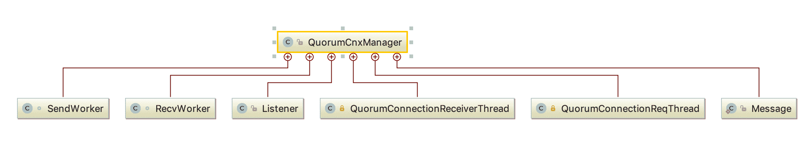

# Zookeeper 源码阅读(十七) 选举之队列机制与网络 IO

> 原文：[https://www.cnblogs.com/gongcomeon/p/11065703.html](https://www.cnblogs.com/gongcomeon/p/11065703.html)

目录

*   [前言](#前言)
*   [队列机制概述](#队列机制概述)
*   [网络 IO 与 QuorumCnxManager 类](#网络 io 与 quorumcnxmanager 类)
    *   [队列相关](#队列相关)
    *   [工具类介绍](#工具类介绍)
        *   [SendWorker](#sendworker)
        *   [Message](#message)
        *   [Listener](#listener)
        *   [RecvWorker](#recvworker)
        *   [QuorumConnectionReceiverThread](#quorumconnectionreceiverthread)
        *   [QuorumConnectionReqThread](#quorumconnectionreqthread)
    *   [QuorumCnxManager 类的功能方法](#quorumcnxmanager 类的功能方法)
    *   [生产与消费](#生产与消费)
        *   [发送队列的生产](#发送队列的生产)
        *   [发送队列的消费](#发送队列的消费)
        *   [接收队列的生产](#接收队列的生产)
        *   [接收队列的消费](#接收队列的消费)
*   [思考](#思考)
    *   *   [发送队列的生产，消费与调用顺序](#发送队列的生产消费与调用顺序)
        *   [对于接收队列满了时删除第一个这个不是很理解，如果集群很大，处理得比较慢，这样是不是会丢掉选票？](#对于接收队列满了时删除第一个这个不是很理解如果集群很大处理得比较慢这样是不是会丢掉选票)
*   [参考](#参考)

### 前言

前一篇已经大概讲了基本 Zookeeper 选举时的选票和关于集群校验的一些概念，这一篇讲一下为了达到 Zookeeper 选举所设计的队列机制和实现队列机制所做的网络 IO 类。这部分对于 zookeeper 选举算法来说是基础，也是非常重要的组成部分。

### 队列机制概述

在 [Zk 思考](https://www.cnblogs.com/gongcomeon/p/10733150.html)中提到过，在 zookeeper 的快速选举算法真实实现中，server 会为每一个 peer 维护一个队列来接收和发送选票。而真实的代码结构中，为了实现异步发送、接收消息的目标，zookeeper 除了维护了消费队列和发送队列外，还为每一个发送队列都维护了一个发送器。值得一提的是，除了消费(接收)队列外，对于每一个发送队列和每一个发送器都是按照 peer 的 sid 分组的。

### 网络 IO 与 QuorumCnxManager 类

首先看下 QuorumCnxManager 类的结构：


#### 队列相关

RECV_CAPACITY 最大能接受的消息数，默认是 100；

SEND_CAPACITY 发送队列最大容量，默认为 1。这里这样设置是因为如果选票还没有投出去就有新的选票产生，那么代表原有的选票应该被抛弃；

recvQueue 消息接收队列，用于存放那些从其他服务器接收到的消息。

queueSendMap：消息发送队列，每个 sid 都会有一个队列。

senderWorkerMap：发送器集合，每个 sid 都会有一个发送器，用来发送对应 sid 的消息发送队列的消息。

lastMessageSent：保存每个 sid 发送的最后一条消息。

#### 工具类介绍



可以见到，QuorumCnxManager 共有 6 个内部类，而它们都是为了实现选举投票传输的网络 IO 的内部功能类，这也是内部类设计的目的之一。我们先大致看下这些功能类的作用。

##### SendWorker

SendWorker 就如先前所说，就是为了从发送队列中取出消息发送。sendworker 类继承了 ZookeeperThread 类，其 run 方法主要就是从队列中取出相应的消息，并发送。

```java
Long sid; //对应的发送消息队列的 sid
Socket sock;
RecvWorker recvWorker; //每个接收队列对应的接收器
volatile boolean running = true;
DataOutputStream dout; 
```

```java
@Override
public void run() {
    threadCnt.incrementAndGet();//记录当前工作线程数
    try {
        /**
         * If there is nothing in the queue to send, then we
         * send the lastMessage to ensure that the last message
         * was received by the peer. The message could be dropped
         * in case self or the peer shutdown their connection
         * (and exit the thread) prior to reading/processing
         * the last message. Duplicate messages are handled correctly
         * by the peer.
         *
         * If the send queue is non-empty, then we have a recent
         * message than that stored in lastMessage. To avoid sending
         * stale message, we should send the message in the send queue.
         */
        ArrayBlockingQueue<ByteBuffer> bq = queueSendMap.get(sid);//从对应的 sid 的发送队列中取出发送的消息
        if (bq == null || isSendQueueEmpty(bq)) {
           ByteBuffer b = lastMessageSent.get(sid);//如果没有消息了，那么取出上次发送的最后一条消息
           if (b != null) {
               LOG.debug("Attempting to send lastMessage to sid=" + sid);
               send(b);//发送上次的最后一条消息
           }
        }
    } catch (IOException e) {
        LOG.error("Failed to send last message. Shutting down thread.", e);
        this.finish();
    }

    try {
        while (running && !shutdown && sock != null) {

            ByteBuffer b = null;
            try {
                ArrayBlockingQueue<ByteBuffer> bq = queueSendMap
                        .get(sid); //从对应的 sid 的发送队列中取出发送的消息
                if (bq != null) {
                    b = pollSendQueue(bq, 1000, TimeUnit.MILLISECONDS);取出并发送
                } else {//没有记录
                    LOG.error("No queue of incoming messages for " +
                              "server " + sid);
                    break;
                }

                if(b != null){//更新最后一条消息，并发送
                    lastMessageSent.put(sid, b);
                    send(b);
                }
            } catch (InterruptedException e) {
                LOG.warn("Interrupted while waiting for message on queue",
                        e);
            }
        }
    } catch (Exception e) {
        LOG.warn("Exception when using channel: for id " + sid
                 + " my id = " + QuorumCnxManager.this.mySid
                 + " error = " + e);
    }
    this.finish();
    LOG.warn("Send worker leaving thread");
} 
```

可以看到在 run 方法中，主要的逻辑是比较清晰的，但是要注意注释中提到的，最后一条消息会发送两次的这个特点。这是为了防止如果接收方在接收消息前挂了消息没有被正确处理，算是一种重试的措施吧。而且在接收方对于受到重复消息有处理措施。但是如果丢失了超过一条怎么办呢。。。

另外，send 方法中主要处理了一些序列化相关的操作，比较清晰，而 finish 方法主要对 socket 连接及接收器等进行了清理操作，并设置了运行的状态等相关参数。

```java
synchronized void send(ByteBuffer b) throws IOException {
    byte[] msgBytes = new byte[b.capacity()];
    try {
        b.position(0);
        b.get(msgBytes);
    } catch (BufferUnderflowException be) {
        LOG.error("BufferUnderflowException ", be);
        return;
    }
    dout.writeInt(b.capacity());
    dout.write(b.array());//写消息
    dout.flush();
} 
```

```java
synchronized boolean finish() {
    if (LOG.isDebugEnabled()) {
        LOG.debug("Calling finish for " + sid);
    }

    if(!running){//如果已经关闭，不再重复清理
        /*
         * Avoids running finish() twice. 
         */
        return running;
    }

    running = false;//设置 running 状态
    closeSocket(sock);//关闭 socket 连接
    // channel = null;

    this.interrupt();//设置线程中断
    if (recvWorker != null) {
        recvWorker.finish();//关闭接收器
    }

    if (LOG.isDebugEnabled()) {
        LOG.debug("Removing entry from senderWorkerMap sid=" + sid);
    }
    senderWorkerMap.remove(sid, this);//删除接收器
    threadCnt.decrementAndGet();//计算工作线程，-1
    return running;
} 
```

##### Message

Message 类是 server(peer)间相互传输的数据结构，简单清晰。

```java
static public class Message {

    Message(ByteBuffer buffer, long sid) {
        this.buffer = buffer;
        this.sid = sid;
    }

    ByteBuffer buffer; //消息体
    long sid; // peer 的 sid
} 
```

##### Listener

Listener 类也是一个线程，一直在监听 electionPort，然后接受外部连接。

```java
if (listenOnAllIPs) {
    int port = view.get(QuorumCnxManager.this.mySid)
        .electionAddr.getPort();
    addr = new InetSocketAddress(port);//获取 peer 的连接信息，是从配置中读到，然后存在 QuorumPeer.QuorumServer 内部类中
} else {
    addr = view.get(QuorumCnxManager.this.mySid)
        .electionAddr;//
}
LOG.info("My election bind port: " + addr.toString());
setName(view.get(QuorumCnxManager.this.mySid)
        .electionAddr.toString());
ss.bind(addr);//绑定连接地址
while (!shutdown) {
    Socket client = ss.accept();
    setSockOpts(client);//建立连接
    LOG.info("Received connection request "
            + client.getRemoteSocketAddress());

    // Receive and handle the connection request
    // asynchronously if the quorum sasl authentication is
    // enabled. This is required because sasl server
    // authentication process may take few seconds to finish,
    // this may delay next peer connection requests.
    if (quorumSaslAuthEnabled) {
        receiveConnectionAsync(client);//接受新的连接，之所以要分异步和同步是因为 sasl 校验比较耗时，所以采用异步的方式，在后面会详细解释
    } else {
        receiveConnection(client);
    }

    numRetries = 0;
} 
```

异步接收 peer 的 connection 连接这部分在 3.4.12 之后的版本里都是有的，但是不确定 3.4.10-11 这几个版本是否有。这部分主要是

##### RecvWorker

RecvWorker 和 SendWorker 类似，区别是 sendworker 是从队列中取出消息发出，而且发送队列的长度为 1，而接收队列的默认长度为 100。

```java
@Override
public void run() {
    threadCnt.incrementAndGet();//活跃线程计数
    try {
        while (running && !shutdown && sock != null) {
            /**
             * Reads the first int to determine the length of the
             * message
             */
            int length = din.readInt();
            if (length <= 0 || length > PACKETMAXSIZE) {
                throw new IOException(
                        "Received packet with invalid packet: "
                                + length);
            }
            /**
             * Allocates a new ByteBuffer to receive the message
             */
          	//为新来的消息分配内存
            byte[] msgArray = new byte[length];
            din.readFully(msgArray, 0, length);
            ByteBuffer message = ByteBuffer.wrap(msgArray);
            addToRecvQueue(new Message(message.duplicate(), sid));//把消息加入接收队列
        }
    } catch (Exception e) {
        LOG.warn("Connection broken for id " + sid + ", my id = "
                 + QuorumCnxManager.this.mySid + ", error = " , e);
    } finally {
        LOG.warn("Interrupting SendWorker");
        sw.finish();
        if (sock != null) {
            closeSocket(sock);
        }
    }
} 
```

这里加入接收队列有一点特别：

```java
public void addToRecvQueue(Message msg) {
    synchronized(recvQLock) {
        if (recvQueue.remainingCapacity() == 0) {//如果没有空余空间
            try {
                recvQueue.remove();//会强制把第一条消息删掉
            } catch (NoSuchElementException ne) {
                // element could be removed by poll()
                 LOG.debug("Trying to remove from an empty " +
                     "recvQueue. Ignoring exception " + ne);
            }
        }
        try {
            recvQueue.add(msg);
        } catch (IllegalStateException ie) {
            // This should never happen
            LOG.error("Unable to insert element in the recvQueue " + ie);
        }
    }
} 
```

可以看到，如果接收队列满了，接收队列的第一条消息会被强制删除。

##### QuorumConnectionReceiverThread

```java
/**
 * Thread to receive connection request from peer server.
 */
private class QuorumConnectionReceiverThread extends ZooKeeperThread {
    private final Socket sock;
    QuorumConnectionReceiverThread(final Socket sock) {
        super("QuorumConnectionReceiverThread-" + sock.getRemoteSocketAddress());
        this.sock = sock;
    }

    @Override
    public void run() {
        receiveConnection(sock);
    }
} 
```

可以看到，QuorumConnectionReceiverThread 目的就是为了接收新的 socket 连接。在 listener 部分提到，在侦听 electionPort 时发现新的连接可能会有异步的处理，实现代码如下：

```java
/**
 * Server receives a connection request and handles it asynchronously via
 * separate thread.
 */
public void receiveConnectionAsync(final Socket sock) {
    try {
        connectionExecutor.execute(
                new QuorumConnectionReceiverThread(sock));//把 QuorumConnectionReceiverThread 放入线程池中并执行
        connectionThreadCnt.incrementAndGet();
    } catch (Throwable e) {
        LOG.error("Exception handling connection, addr: {}, closing server connection",
                 sock.getRemoteSocketAddress());
        closeSocket(sock);
    }
} 
```

可以看到，这里利用了线程池来管理 QuorumConnectionReceiverThread 线程，并利用线程池的线程和队列实现异步处理的目的。

##### QuorumConnectionReqThread

QuorumConnectionReqThread 和 QuorumConnectionReceiverThread 非常类似，只是 QuorumConnectionReqThread 是负责向 peer 建立连接的线程。

```java
/**
 * Thread to send connection request to peer server.
 */
private class QuorumConnectionReqThread extends ZooKeeperThread {
    final Socket sock;
    final Long sid;
    QuorumConnectionReqThread(final Socket sock, final Long sid) {
        super("QuorumConnectionReqThread-" + sid);
        this.sock = sock;
        this.sid = sid;
    }

    @Override
    public void run() {
        try{
            initiateConnection(sock, sid);//和 sid 的 peer 建立连接
        } finally {
            inprogressConnections.remove(sid);//把 connection 删掉
        }
    }
} 
```

#### QuorumCnxManager 类的功能方法

初始化连接：initiateConnection 与 startConnection。前者主要就是调用后者，进行了一些异常的处理，主要的功能部分在 startConnection。

```java
private boolean startConnection(Socket sock, Long sid)
        throws IOException {
    DataOutputStream dout = null;
    DataInputStream din = null;
    try {
        // Sending id and challenge
        dout = new DataOutputStream(sock.getOutputStream());
        dout.writeLong(this.mySid);//把自己的 sid 写入
        dout.flush();

        din = new DataInputStream(
                new BufferedInputStream(sock.getInputStream()));
    } catch (IOException e) {
        LOG.warn("Ignoring exception reading or writing challenge: ", e);
        closeSocket(sock);
        return false;
    }

    // authenticate learner
    authLearner.authenticate(sock, view.get(sid).hostname);//加入了 sasl 的认证

    // If lost the challenge, then drop the new connection
    if (sid > this.mySid) {//如果自己的 sid 小于连接的 sid，直接关闭
        LOG.info("Have smaller server identifier, so dropping the " +
                 "connection: (" + sid + ", " + this.mySid + ")");
        closeSocket(sock);
        // Otherwise proceed with the connection
    } else {//如果自己的 sid 大于连接的 sid，初始化 sendworker 和 recvworker
        SendWorker sw = new SendWorker(sock, sid);
        RecvWorker rw = new RecvWorker(sock, din, sid, sw);
        sw.setRecv(rw);//sengworker 记录 recvworker

        SendWorker vsw = senderWorkerMap.get(sid);//校验原有的 senderWorkerMap 里是否有 sendworker

        if(vsw != null)
            vsw.finish();//如果有，直接关闭

        senderWorkerMap.put(sid, sw);//加入新建的 sendworker
        queueSendMap.putIfAbsent(sid, new ArrayBlockingQueue<ByteBuffer>(SEND_CAPACITY));//新建发送队列

        sw.start();//启动 sendworker 和 recvworker
        rw.start();

        return true;    

    }
    return false;
} 
```

开始连接 peer。上面初始化连接主要初始化了 sendworker，recvworker 和相关队列，但是对于实际的网络连接来说，这些都是底层的相关逻辑，对于一个进程来说，连接到一台 peer 才是真正比较完整的业务功能，而这部分业务逻辑是在 connectOne 里实现的。

```java
/**
 * Try to establish a connection to server with id sid.
 * 
 *  @param sid  server id
 */
synchronized public void connectOne(long sid){
    if (!connectedToPeer(sid)){//没连接上的时候去尝试连接
        InetSocketAddress electionAddr;
        if (view.containsKey(sid)) {
            electionAddr = view.get(sid).electionAddr;//获取对应的 sid 的地址
        } else {
            LOG.warn("Invalid server id: " + sid);
            return;
        }
        try {

            LOG.debug("Opening channel to server " + sid);
            Socket sock = new Socket();
            setSockOpts(sock);
            sock.connect(view.get(sid).electionAddr, cnxTO);//socket 连接信息
            LOG.debug("Connected to server " + sid);

            // Sends connection request asynchronously if the quorum
            // sasl authentication is enabled. This is required because
            // sasl server authentication process may take few seconds to
            // finish, this may delay next peer connection requests.
            if (quorumSaslAuthEnabled) {
                initiateConnectionAsync(sock, sid);//这里就是用之前说的 QuorumConnectionReqThread 线程去连接
            } else {
                initiateConnection(sock, sid);
            }
        } catch (UnresolvedAddressException e) {
            // Sun doesn't include the address that causes this
            // exception to be thrown, also UAE cannot be wrapped cleanly
            // so we log the exception in order to capture this critical
            // detail.
            LOG.warn("Cannot open channel to " + sid
                    + " at election address " + electionAddr, e);
            // Resolve hostname for this server in case the
            // underlying ip address has changed.
            if (view.containsKey(sid)) {
                view.get(sid).recreateSocketAddresses();//重连
            }
            throw e;
        } catch (IOException e) {
            LOG.warn("Cannot open channel to " + sid
                    + " at election address " + electionAddr,
                    e);
            // We can't really tell if the server is actually down or it failed
            // to connect to the server because the underlying IP address
            // changed. Resolve the hostname again just in case.
            if (view.containsKey(sid)) {
                view.get(sid).recreateSocketAddresses();//重连
            }
        }
    } else {
        LOG.debug("There is a connection already for server " + sid);
    }
} 
```

其实逻辑上来说就是一台 server 要连接另一台 peer，connectOne 方法里通过起 QuorumConnectionReqThread 来 initiateConnection(同步或者异步)，在这一步会初始化队列和相关的发送器、接收器。

接收 connection。正如初始化 connection 分为两个函数，接收 connection 也类似。接收 connection 分为同步和异步两种方式，receiveConnection 和 receiveConnectionAsync，区别在于是否用 QuorumConnectionReceiverThread 去做这件事。但无论哪种方式，最终都会进入 handleConnection。

```java
private void handleConnection(Socket sock, DataInputStream din)
        throws IOException {
    Long sid = null;
    try {
        // Read server id
        sid = din.readLong();//读取连接的 sid
        if (sid < 0) { // this is not a server id but a protocol version (see ZOOKEEPER-1633)//这个可能是之前 zk 报文的一个 bug
            sid = din.readLong();//重新读

            // next comes the #bytes in the remainder of the message
            // note that 0 bytes is fine (old servers)
            int num_remaining_bytes = din.readInt();
            if (num_remaining_bytes < 0 || num_remaining_bytes > maxBuffer) {
                LOG.error("Unreasonable buffer length: {}", num_remaining_bytes);
                closeSocket(sock);
                return;
            }
            byte[] b = new byte[num_remaining_bytes];

            // remove the remainder of the message from din
            int num_read = din.read(b);
            if (num_read != num_remaining_bytes) {
                LOG.error("Read only " + num_read + " bytes out of " + num_remaining_bytes + " sent by server " + sid);
            }
        }
        if (sid == QuorumPeer.OBSERVER_ID) {//如果是 observer
            /*
             * Choose identifier at random. We need a value to identify
             * the connection.
             */
        		sid = observerCounter.getAndDecrement();//生成一个 id
            LOG.info("Setting arbitrary identifier to observer: " + sid);
        }
    } catch (IOException e) {
        closeSocket(sock);//关闭 socket
        LOG.warn("Exception reading or writing challenge: " + e.toString());
        return;
    }

    // do authenticating learner
    LOG.debug("Authenticating learner server.id: {}", sid);
    authServer.authenticate(sock, din);//sasl 认证

    //If wins the challenge, then close the new connection.
    if (sid < this.mySid) {//如果大于自己 sid
        /*
         * This replica might still believe that the connection to sid is
         * up, so we have to shut down the workers before trying to open a
         * new connection.
         */
        SendWorker sw = senderWorkerMap.get(sid);//取出 sendworker 并关闭
        if (sw != null) {
            sw.finish();
        }

        /*
         * Now we start a new connection
         */
        LOG.debug("Create new connection to server: " + sid);
        closeSocket(sock);//关闭 socket
        connectOne(sid);

        // Otherwise start worker threads to receive data.
    } else {
        SendWorker sw = new SendWorker(sock, sid);//初始化
        RecvWorker rw = new RecvWorker(sock, din, sid, sw);
        sw.setRecv(rw);

        SendWorker vsw = senderWorkerMap.get(sid);

        if(vsw != null)
            vsw.finish();//删除原来的 worker

        senderWorkerMap.put(sid, sw);//新建队列，添加 worker
        queueSendMap.putIfAbsent(sid, new ArrayBlockingQueue<ByteBuffer>(SEND_CAPACITY));

        sw.start();
        rw.start();//启动 sendworker 和 recvworker

        return;
    }
} 
```

通过初始化连接和关闭连接可以知道，在这两步 zk 都会根据 sid 来进行判断，标准就是：

> 发出连接时，要求自己 sid 大，完成 SendWorker 和 ReceiveWorker 的构造以及线程启动，否则 close
> 接收连接时，要求自己 sid 小，完成 SendWorker 和 ReceiveWorker 的构造以及线程启动，否则 close

#### 生产与消费

##### 发送队列的生产

在 zk 选举时，主要利用 toSend 方法发送消息。这里需要强调的是，这里的生产指的是发送队列的生产。

```java
/**
 * Processes invoke this message to queue a message to send. Currently, 
 * only leader election uses it.
 */
public void toSend(Long sid, ByteBuffer b) {
    /*
     * If sending message to myself, then simply enqueue it (loopback).
     */
    if (this.mySid == sid) {//如果是发给自己，直接加入到 recv 的队列。
         b.position(0);
         addToRecvQueue(new Message(b.duplicate(), sid));//这里因为是特殊情况，所以这里实际上为接收队列做了生产
        /*
         * Otherwise send to the corresponding thread to send.
         */
    } else {
         /*
          * Start a new connection if doesn't have one already.
          */
      	//发送到别的，那么把消息放到发送队列中
         ArrayBlockingQueue<ByteBuffer> bq = new ArrayBlockingQueue<ByteBuffer>(SEND_CAPACITY);
         ArrayBlockingQueue<ByteBuffer> bqExisting = queueSendMap.putIfAbsent(sid, bq);
         if (bqExisting != null) {
             addToSendQueue(bqExisting, b);//逻辑很简单，就是往发送队列里插入一条消息
         } else {
             addToSendQueue(bq, b);
         }
         connectOne(sid);

    }
} 
```

##### 发送队列的消费

在 ZK 选举时，利用 tosend 方法实现了发送队列的生产。在之前的代码中也有看到，在 QuorumCnxManager 中，线程会一直从发送队列中取出消息发送，而这个消费的过程就是在 pollSendQueue 方法中。

```java
/**
 * Retrieves and removes buffer at the head of this queue,
 * waiting up to the specified wait time if necessary for an element to
 * become available.
 *
 * {@link ArrayBlockingQueue#poll(long, java.util.concurrent.TimeUnit)}
 */
private ByteBuffer pollSendQueue(ArrayBlockingQueue<ByteBuffer> queue,
      long timeout, TimeUnit unit) throws InterruptedException {
   return queue.poll(timeout, unit);//从队列中取出
} 
```

##### 接收队列的生产

正如发送队列的生产中可以看到，在 sid 是自己的时候会加入接收队列中，而且在 RecvWorker 中，会增加持续插入接收到的消息。

```java
public void addToRecvQueue(Message msg) {
    synchronized(recvQLock) {
        if (recvQueue.remainingCapacity() == 0) {//如果没有剩余容量，删除一个
            try {
                recvQueue.remove();
            } catch (NoSuchElementException ne) {
                // element could be removed by poll()
                 LOG.debug("Trying to remove from an empty " +
                     "recvQueue. Ignoring exception " + ne);
            }
        }
        try {
            recvQueue.add(msg);//把消息加入对垒
        } catch (IllegalStateException ie) {
            // This should never happen
            LOG.error("Unable to insert element in the recvQueue " + ie);
        }
    }
} 
```

##### 接收队列的消费

```java
public Message pollRecvQueue(long timeout, TimeUnit unit)
   throws InterruptedException {
   return recvQueue.poll(timeout, unit);//从接收队列取出
} 
```

### 思考

QuorumCnxManager 作为网络 IO 的管理器，我们其实需要从收发两端去理解。在 zk 的机制里，只有 sid 大的机器才能有效连接 sid 小的机器。QuorumCnxManager 里有收发线程利用异步的方式，或者 QuorumCnxManager 主体本身的同步机制来管理收发 Worker，一旦一个大 sid 的机器主动连接了另一台小 sid 的机器，在发送方，QuorumCnxManager 就会自动创建发送队列和对应 sid 的收发 worker(注意，虽然接收队列只有一条，但是对于每一个)，在接收方也同样，每个 sid 对应的收发 worker 和发送队列也会被建立。而在选举的实现中，只需要不断从接收队列中取出消息或者往发送队列中添加消息即可。从方法的角度来说：

Server A(sid: 2)和 Server B(sid: 1)相互连接，A 和 B 都通过 connectAll，实际上是 connectone 方法相互连接，在方法内部调用了 initiateConnection 和 startConnection 建立连接，只有 A->B 的连接会生效， 这时 A 会初始化 sid 为 1 的发送队列和收发 worker。而由于 Listener 线程一直在监控 electionPort 端口，一旦有连接上来，B 便会初始化自己这边的发送队列和收发 worker。最终通过双方建立的队列和 worker 进行通信。

##### 发送队列的生产，消费与调用顺序

> ```java
> 生产 
> QuorumCnxManager#toSend
> QuorumCnxManager#addToSendQueue
> 
> 消费
> QuorumCnxManager.SendWorker#run
> QuorumCnxManager#pollSendQueue
> 
> 发送
> QuorumCnxManager.SendWorker#run
> SendWorker#send 
> ```

##### 对于接收队列满了时删除第一个这个不是很理解，如果集群很大，处理得比较慢，这样是不是会丢掉选票？

### 参考

从 Paxos 到 zookeeper

[https://www.cnblogs.com/leesf456/p/6107600.html](https://www.cnblogs.com/leesf456/p/6107600.html)

[https://www.jianshu.com/p/bfa3d40742bd](https://www.jianshu.com/p/bfa3d40742bd)