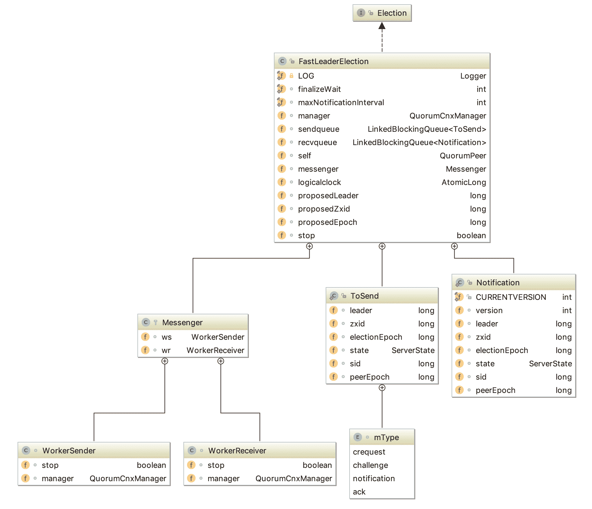
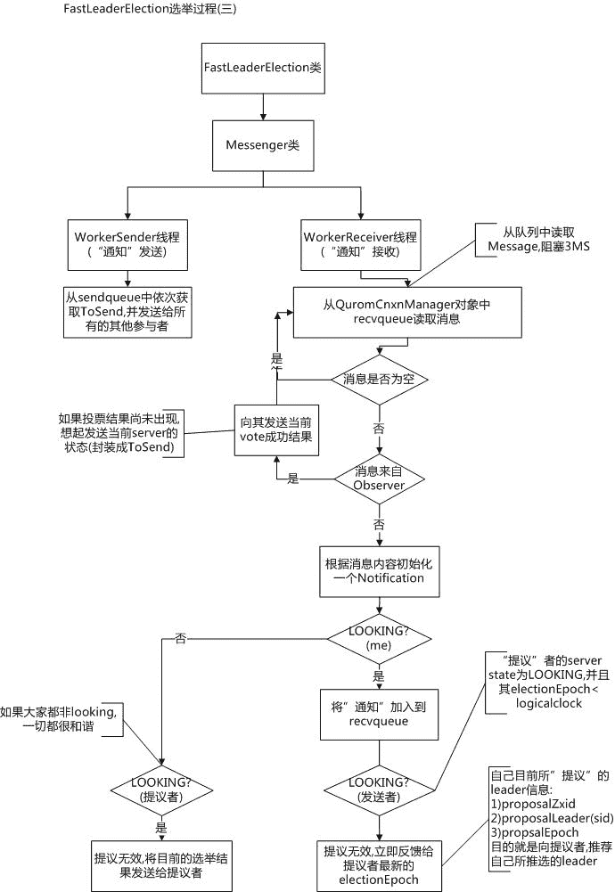
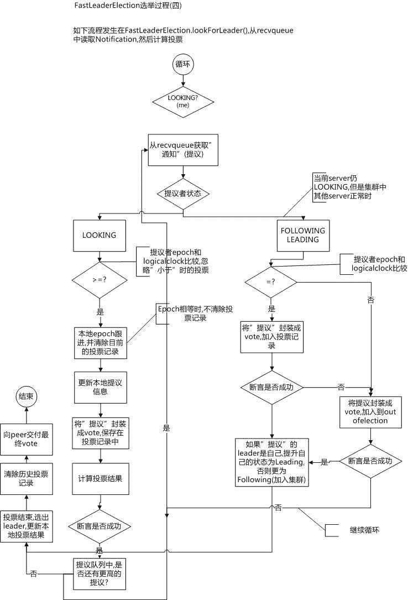
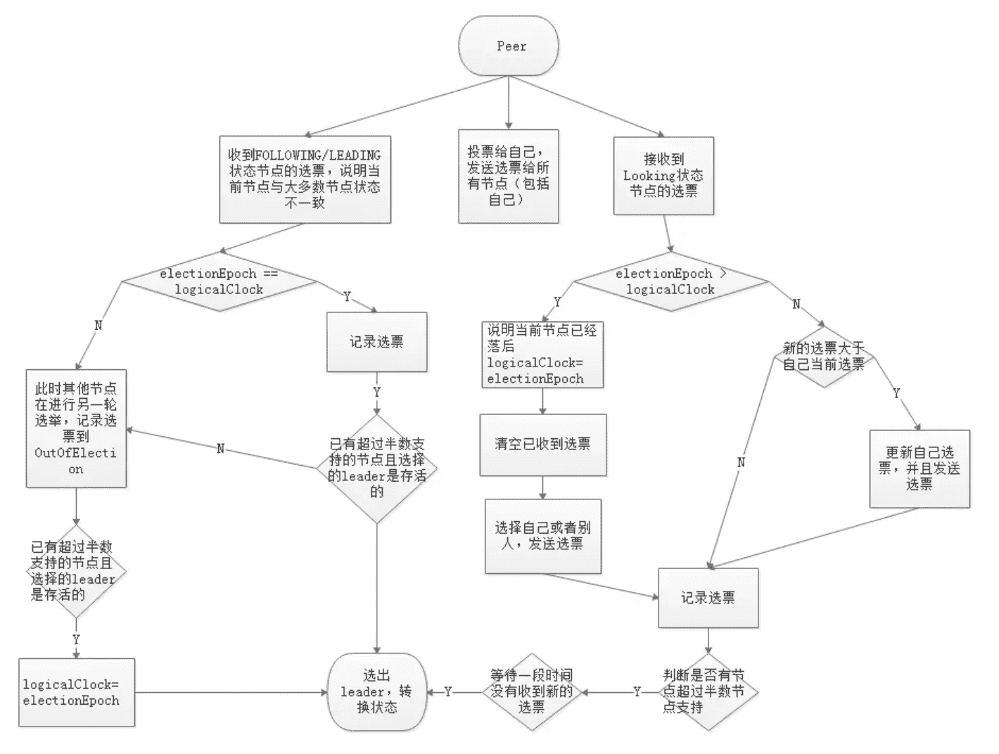

# Zookeeper 源码阅读(十八) 选举之快速选举算法 FastLeaderElection

> 原文：[https://www.cnblogs.com/gongcomeon/p/11073608.html](https://www.cnblogs.com/gongcomeon/p/11073608.html)

目录

*   [前言](#前言)
*   [FastLeaderEleaction 基本结构](#fastleadereleaction 基本结构)
    *   [Notification](#notification)
    *   [ToSend](#tosend)
    *   [Messenger](#messenger)
        *   [WorkerReceiver](#workerreceiver)
        *   [WorkerSender](#workersender)
*   [选举方法分析](#选举方法分析)
    *   *   [updateProposal](#updateproposal)
        *   [getInitId(), getInitLastLoggedZxid(), getPeerEpoch()](#getinitid-getinitlastloggedzxid-getpeerepoch)
        *   [totalOrderPredicate](#totalorderpredicate)
        *   [sendNotification](#sendnotification)
        *   [termPredicate](#termpredicate)
        *   [ooePredicate，checkLeader](#ooepredicatecheckleader)
*   [思考](#思考)
*   [参考](#参考)

### 前言

在过去的两节里已经分析了选举过程中的一些实体类和网络 IO 相关的机制与源码，这一节将会对 zookeeper 选举的核心类 FastLeaderElection 进行分析。

### FastLeaderEleaction 基本结构



可以看到 FastLeaderElection 的基本结构还是比较清晰的，主要从新的成员变量类和内部类来分析下 FastLeaderElection 的基本结构。

#### Notification

```java
/**
 * Notifications are messages that let other peers know that
 * a given peer has changed its vote, either because it has
 * joined leader election or because it learned of another
 * peer with higher zxid or same zxid and higher server id
 */

static public class Notification { 
```

从 Notification 的注释我们能看到，它的目的就是通知其他 peer 修改了选票。从 Notification 的成员变量可以看，Notification 基本和 Vote 类一致。但是在 Notification 类里有一个 version 用来标记当前 Notification 的 version，可能是为了用来做不同版本 zk 之间通信来做一些逻辑处理，这部分目前没看到有什么实际的使用。

#### ToSend

ToSend 主体和 Vote 类也一致，但是 ToSend 类多了一个 sid，用来判断发给哪个 server，为了要包装这样一个类，我的想法是方便在 FastLeaderElection 处理业务逻辑的便利。

#### Messenger

从代码结构中可以看到，Messenger 主要分为 WorkerReceiver 和 WorkerSender 两个子类。

##### WorkerReceiver

```java
/**
 * Receives messages from instance of QuorumCnxManager on
 * method run(), and processes such messages.
 */ 
```

从注释可以看到，WorkerReceiver 的目的就是为了从 peer 接收消息并进行处理的。Workerreceiver 继承了 ZookeeperThread，所以也是一个单独的处理任务的线程。它的 run 方法代码比较长，从参考 2 里取了一张流程图来表示，并对关键部分解析一下。



可以看到，receiver 在收到消息后，会去判断是否是 observer 发来的消息，如果是 observer 直接给它同步就可以了，如果是非 observer 的 peer，就去看自己的状态是否是 LOOKING，如果自己是 LOOING，且对方的选举周期比自己小，那么就给对方同步自己的提议；如果自己不是 LOOKING，但对方是 LOOKING，那么就把之前的投票结果发给对方。

```java
/*
 * If it is from an observer, respond right away.
 * Note that the following predicate assumes that
 * if a server is not a follower, then it must be
 * an observer. If we ever have any other type of
 * learner in the future, we'll have to change the
 * way we check for observers.
 */
if(!self.getVotingView().containsKey(response.sid)){//votingview 是有投票资格的 peer 列表，没在列表里代表是 observer
    Vote current = self.getCurrentVote();
    ToSend notmsg = new ToSend(ToSend.mType.notification,
            current.getId(),
            current.getZxid(),
            logicalclock.get(),
            self.getPeerState(),
            response.sid,
            current.getPeerEpoch());

    sendqueue.offer(notmsg);
} 
```

可以看到，如果是 observer 的消息，那么直接生成一条 notification 类型的信息发送给对应的 peer 就可以。

```java
/*
 * If this server is looking, then send proposed leader
 */

if(self.getPeerState() == QuorumPeer.ServerState.LOOKING){//如果自己是 LOOKING 状态
    recvqueue.offer(n);//把消息放入 recvqueue

    /*
     * Send a notification back if the peer that sent this
     * message is also looking and its logical clock is
     * lagging behind.
     */
    if((ackstate == QuorumPeer.ServerState.LOOKING)//发送方也是 LOOKING
            && (n.electionEpoch < logicalclock.get())){
        Vote v = getVote();
        ToSend notmsg = new ToSend(ToSend.mType.notification,
                v.getId(),
                v.getZxid(),
                logicalclock.get(),
                self.getPeerState(),
                response.sid,
                v.getPeerEpoch());
        sendqueue.offer(notmsg);//发送自己的 Vote 给对方
    }
} else {
    /*
     * If this server is not looking, but the one that sent the ack
     * is looking, then send back what it believes to be the leader.
     */
    Vote current = self.getCurrentVote();//如果自己不是 LOOKING，那么就生成自己认为的当前的 Vote 情况
    if(ackstate == QuorumPeer.ServerState.LOOKING){
        if(LOG.isDebugEnabled()){
            LOG.debug("Sending new notification. My id =  " +
                    self.getId() + " recipient=" +
                    response.sid + " zxid=0x" +
                    Long.toHexString(current.getZxid()) +
                    " leader=" + current.getId());
        }

        ToSend notmsg;
        if(n.version > 0x0) {//这里根据 version 生成不同的消息，但是 version 具体的作用还是不太清除
            notmsg = new ToSend(
                    ToSend.mType.notification,
                    current.getId(),
                    current.getZxid(),
                    current.getElectionEpoch(),
                    self.getPeerState(),
                    response.sid,
                    current.getPeerEpoch());

        } else {
            Vote bcVote = self.getBCVote();
            notmsg = new ToSend(
                    ToSend.mType.notification,
                    bcVote.getId(),
                    bcVote.getZxid(),
                    bcVote.getElectionEpoch(),
                    self.getPeerState(),
                    response.sid,
                    bcVote.getPeerEpoch());
        }
        sendqueue.offer(notmsg);//把要发送的消息放入 sendqueue
    }
} 
```

这里逻辑蛮清晰的，但是有一点要强调一下，FastLeaderElection 中也有收发队列，上一篇讲的网络 IO 里也有收发队列，他们是怎么配合工作的呢。看下 WorkerReceiver 的 run 方法的开头就可以看到

```java
response = manager.pollRecvQueue(3000, TimeUnit.MILLISECONDS); 
```

这样就很清晰了，FastLeaderElection 的 WorkerReceiver 里的网络 IO 的 receiver 从 IO 的队列中取出，然后放到 FastLeaderElection 的接收队列中。这就是一个两层队列的关系，IO 中的队列专门用来处理底层 byte 的处理及一些基础逻辑，然后设计到算法的逻辑在 FastLeaderElection 的中处理，并在 FastLeaderElection 的队列中生产消费。简单点说就是 FastLeaderElection 的队列是以来网络 IO 的队列的。

##### WorkerSender

WorkerSender 的逻辑就比较简单了。

```java
public void run() {
    while (!stop) {
        try {
            ToSend m = sendqueue.poll(3000, TimeUnit.MILLISECONDS);//从发送队列中取出
            if(m == null) continue;

            process(m);//放到网络 io 的放松队列中
        } catch (InterruptedException e) {
            break;
        }
    }
    LOG.info("WorkerSender is down");
} 
```

### 选举方法分析

FastLeaderElection 的主要选举逻辑在 lookForLeader 方法里，先通过分析 lookForLeader 来看下选举的主要流程。这里面有许多还没有分析的方法，可以先看大致的逻辑，然后针对具体的方法进行分析。

```java
/**
 * Starts a new round of leader election. Whenever our QuorumPeer
 * changes its state to LOOKING, this method is invoked, and it
 * sends notifications to all other peers.
 */
public Vote lookForLeader() throws InterruptedException {
    try {
        self.jmxLeaderElectionBean = new LeaderElectionBean();
        MBeanRegistry.getInstance().register(//注册 JMX 监控
                self.jmxLeaderElectionBean, self.jmxLocalPeerBean);
    } catch (Exception e) {
        LOG.warn("Failed to register with JMX", e);
        self.jmxLeaderElectionBean = null;
    }
    if (self.start_fle == 0) {
       self.start_fle = Time.currentElapsedTime();//初始化选举时间
    }
    try {
        HashMap<Long, Vote> recvset = new HashMap<Long, Vote>();//recvset 是本轮选举收到的选票集合，按 sid 分

        HashMap<Long, Vote> outofelection = new HashMap<Long, Vote>();//FOLLOWING 和 LEADING 的 peer 发来的选票

        int notTimeout = finalizeWait;

        synchronized(this){
            logicalclock.incrementAndGet();//增加选举轮次
            updateProposal(getInitId(), getInitLastLoggedZxid(), getPeerEpoch());//初始化选票，投自己
        }

        LOG.info("New election. My id =  " + self.getId() +
                ", proposed zxid=0x" + Long.toHexString(proposedZxid));
        sendNotifications();//给每个 peer 发送自己的提议

        /*
         * Loop in which we exchange notifications until we find a leader
         */

        while ((self.getPeerState() == ServerState.LOOKING) &&
                (!stop)){//交互的选举过程开始
            /*
             * Remove next notification from queue, times out after 2 times
             * the termination time
             */
            Notification n = recvqueue.poll(notTimeout,
                    TimeUnit.MILLISECONDS);//从接收队列中取出通知

            /*
             * Sends more notifications if haven't received enough.
             * Otherwise processes new notification.
             */
            if(n == null){//这时选举还没有结束，而接收队列一个通知都没有，就代表需要去连接 peer 主动获取他们的 vote 信息
                if(manager.haveDelivered()){//如果已经发送过消息，即所有 sid 对应的发送队列都空了
                    sendNotifications();//重发一遍
                } else {
                    manager.connectAll();//如果发送队列里还有消息，代表可能连接断开了，那就重连一次
                }

                /*
                 * Exponential backoff
                 */
                int tmpTimeOut = notTimeout*2;
                notTimeout = (tmpTimeOut < maxNotificationInterval?
                        tmpTimeOut : maxNotificationInterval);//这里从接收队列取出通知的等待时间是会加长的，
                LOG.info("Notification time out: " + notTimeout);
            }
            else if(self.getVotingView().containsKey(n.sid)) {//是其他 peer 发来的消息
                /*
                 * Only proceed if the vote comes from a replica in the
                 * voting view.
                 */
                switch (n.state) {
                case LOOKING://是 looking 状态的
                    // If notification > current, replace and send messages out
                    if (n.electionEpoch > logicalclock.get()) {//对方的 epoch 比自己高
                        logicalclock.set(n.electionEpoch);//更新自己的 logicalLock
                        recvset.clear();//清除之前收到的选票(这些选票一定是跟自己更新前的 logicalClock 一个 epoch，不然之前就被清掉了)
                        if(totalOrderPredicate(n.leader, n.zxid, n.peerEpoch,
                                getInitId(), getInitLastLoggedZxid(), getPeerEpoch())) {//对方的选票比自己的本身的初始 vote 要“好”
                            updateProposal(n.leader, n.zxid, n.peerEpoch);//换成自己的选票
                        } else {
                            updateProposal(getInitId(),
                                    getInitLastLoggedZxid(),
                                    getPeerEpoch());//不然把自己现在的选票发给对方
                        }
                        sendNotifications();//给大家更新一份自己的选票
                    } else if (n.electionEpoch < logicalclock.get()) {//对方 epoch 比自己低就不用管，等对方收到 peer 的通知就知道了，对方自己回去走上面的逻辑去更新
                        if(LOG.isDebugEnabled()){
                            LOG.debug("Notification election epoch is smaller than logicalclock. n.electionEpoch = 0x"
                                    + Long.toHexString(n.electionEpoch)
                                    + ", logicalclock=0x" + Long.toHexString(logicalclock.get()));
                        }
                        break;
                    } else if (totalOrderPredicate(n.leader, n.zxid, n.peerEpoch,
                            proposedLeader, proposedZxid, proposedEpoch)) {//如果 epoch 相同，那么就比较自己当前的 vote 和对方的 vote 信息，对方比自己“好”
                        updateProposal(n.leader, n.zxid, n.peerEpoch);//更新提议
                        sendNotifications();//发送通知
                    }

                    if(LOG.isDebugEnabled()){
                        LOG.debug("Adding vote: from=" + n.sid +
                                ", proposed leader=" + n.leader +
                                ", proposed zxid=0x" + Long.toHexString(n.zxid) +
                                ", proposed election epoch=0x" + Long.toHexString(n.electionEpoch));
                    }

                    recvset.put(n.sid, new Vote(n.leader, n.zxid, n.electionEpoch, n.peerEpoch));//更新接受的选票集合

                    if (termPredicate(recvset,
                            new Vote(proposedLeader, proposedZxid,
                                    logicalclock.get(), proposedEpoch))) {//如果自己投的票的 sid 被选为 leader

                        // Verify if there is any change in the proposed leader
                        while((n = recvqueue.poll(finalizeWait,
                                TimeUnit.MILLISECONDS)) != null){//接收队列还有消息
                            if(totalOrderPredicate(n.leader, n.zxid, n.peerEpoch,
                                    proposedLeader, proposedZxid, proposedEpoch)){//接收队列新的消息比自己投的还要好(注意，这时候已经认为自己投的是 leader 了)
                                recvqueue.put(n);//再把消息放进接收队列，为啥这样做?我的想法是因为因为有网络的延迟，所以可能出现一种情况就是比如集群里有一台机器的选票没有发过来，但是它的选票是最优的，在其他的完成选举后，它的选票发来了，但是这时候当前 server 的状态还没有改掉，于是就把这个选票再放回去，下次取出来的时候就在 switch 的其他逻辑里处理了
                                break;
                            }
                        }

                        /*
                         * This predicate is true once we don't read any new
                         * relevant message from the reception queue
                         */
                        if (n == null) {//当前接收队列里没有其他逻辑了
                            self.setPeerState((proposedLeader == self.getId()) ?
                                    ServerState.LEADING: learningState());//设置自己的状态

                            Vote endVote = new Vote(proposedLeader,
                                                    proposedZxid,
                                                    logicalclock.get(),
                                                    proposedEpoch);
                            leaveInstance(endVote);//清空接收队列
                            return endVote;
                        }
                    }
                    break;
                case OBSERVING:
                    LOG.debug("Notification from observer: " + n.sid);
                    break;
                case FOLLOWING:
                case LEADING:
                    /*
                     * Consider all notifications from the same epoch
                     * together.
                     */
                    if(n.electionEpoch == logicalclock.get()){//选举周期是同一个
                        recvset.put(n.sid, new Vote(n.leader,
                                                      n.zxid,
                                                      n.electionEpoch,
                                                      n.peerEpoch));//

                      if(ooePredicate(recvset, outofelection, n)) {//判断选举是否成功，即 leader 是否选出即 leader 是否认为自己是 leader(leader 可能失效)
                            self.setPeerState((n.leader == self.getId()) ?
                                    ServerState.LEADING: learningState());//设置状态

                            Vote endVote = new Vote(n.leader, 
                                    n.zxid, 
                                    n.electionEpoch, 
                                    n.peerEpoch);
                            leaveInstance(endVote);
                            return endVote;
                        }
                    }

                    /*
                     * Before joining an established ensemble, verify
                     * a majority is following the same leader.
                     */
                    outofelection.put(n.sid, new Vote(n.version,
                                                        n.leader,
                                                        n.zxid,
                                                        n.electionEpoch,
                                                        n.peerEpoch,
                                                        n.state));//更新 follower 或 leader 的选票集合

                    if(ooePredicate(outofelection, outofelection, n)) {
                        synchronized(this){
                            logicalclock.set(n.electionEpoch);//更新 epoch
                            self.setPeerState((n.leader == self.getId()) ?
                                    ServerState.LEADING: learningState());
                        }
                        Vote endVote = new Vote(n.leader,
                                                n.zxid,
                                                n.electionEpoch,
                                                n.peerEpoch);
                        leaveInstance(endVote);
                        return endVote;
                    }
                    break;
                default:
                    LOG.warn("Notification state unrecognized: {} (n.state), {} (n.sid)",
                            n.state, n.sid);
                    break;
                }
            } else {
                LOG.warn("Ignoring notification from non-cluster member " + n.sid);
            }
        }
        return null;
    } finally {
        try {
            if(self.jmxLeaderElectionBean != null){
                MBeanRegistry.getInstance().unregister(
                        self.jmxLeaderElectionBean);//卸载 jmx
            }
        } catch (Exception e) {
            LOG.warn("Failed to unregister with JMX", e);
        }
        self.jmxLeaderElectionBean = null;//帮助 GC
        LOG.debug("Number of connection processing threads: {}",
                manager.getConnectionThreadCount());
    }
} 
```

大致的逻辑是这样，在网上看资料的时候看到了两张图讲的蛮好的，贴在这里，可以按照这个逻辑再看一下。





其实无论是从流程图还是代码都可以看到，如果进行了一些更新之后发现没有达到 ooePredicate 的要求，也就是说支持某一个 sid 的选票没有过半或者选举出来的 leader 不合格（epoch 不对或者状态不对等），那么 server 自己的状态不会修改，这样在下一次循环里又会重新连接其他 server 或者重新接受选票进行选举。

选举的逻辑在代码分析里已经讲的比较详细了，再把里面具体的方法过一下。

##### updateProposal

```java
synchronized void updateProposal(long leader, long zxid, long epoch){
    if(LOG.isDebugEnabled()){
        LOG.debug("Updating proposal: " + leader + " (newleader), 0x"
                + Long.toHexString(zxid) + " (newzxid), " + proposedLeader
                + " (oldleader), 0x" + Long.toHexString(proposedZxid) + " (oldzxid)");
    }
    proposedLeader = leader;
    proposedZxid = zxid;
    proposedEpoch = epoch;
} 
```

很简单，把自己 propose 的 leader 信息更新。

##### getInitId(), getInitLastLoggedZxid(), getPeerEpoch()

```java
private long getInitId(){
    if(self.getLearnerType() == LearnerType.PARTICIPANT)
        return self.getId();
    else return Long.MIN_VALUE;
} 
```

返回自己的 sid。

```java
private long getInitLastLoggedZxid(){
    if(self.getLearnerType() == LearnerType.PARTICIPANT)
        return self.getLastLoggedZxid();
    else return Long.MIN_VALUE;
} 
```

返回自己最大的 zxid。

```java
private long getPeerEpoch(){
    if(self.getLearnerType() == LearnerType.PARTICIPANT)
       try {
          return self.getCurrentEpoch();
       } catch(IOException e) {
          RuntimeException re = new RuntimeException(e.getMessage());
          re.setStackTrace(e.getStackTrace());
          throw re;
       }
    else return Long.MIN_VALUE;
} 
```

逻辑同样很简单。获取到自己的 epoch。

##### totalOrderPredicate

正如在 lookForLeader 中看的，这个方法是用来比较选票的优劣的。

```java
/**
 * Check if a pair (server id, zxid) succeeds our
 * current vote.
 *
 * @param id    Server identifier
 * @param zxid  Last zxid observed by the issuer of this vote
 */
protected boolean totalOrderPredicate(long newId, long newZxid, long newEpoch, long curId, long curZxid, long curEpoch) {
    LOG.debug("id: " + newId + ", proposed id: " + curId + ", zxid: 0x" +
            Long.toHexString(newZxid) + ", proposed zxid: 0x" + Long.toHexString(curZxid));
    if(self.getQuorumVerifier().getWeight(newId) == 0){
        return false;
    }

    /*
     * We return true if one of the following three cases hold:
     * 1- New epoch is higher
     * 2- New epoch is the same as current epoch, but new zxid is higher
     * 3- New epoch is the same as current epoch, new zxid is the same
     *  as current zxid, but server id is higher.
     */

    return ((newEpoch > curEpoch) || 
            ((newEpoch == curEpoch) &&
            ((newZxid > curZxid) || ((newZxid == curZxid) && (newId > curId)))));
} 
```

如注释所言，三种情况，1\. epoch 高；2\. epoch 一样 zxid 大；3\. epoch 和 zxid 都一样，sid 大。

##### sendNotification

```java
/**
 * Send notifications to all peers upon a change in our vote
 */
private void sendNotifications() {
    for (QuorumServer server : self.getVotingView().values()) {//遍历 peer
        long sid = server.id;

        ToSend notmsg = new ToSend(ToSend.mType.notification,
                proposedLeader,
                proposedZxid,
                logicalclock.get(),
                QuorumPeer.ServerState.LOOKING,
                sid,
                proposedEpoch);
        if(LOG.isDebugEnabled()){
            LOG.debug("Sending Notification: " + proposedLeader + " (n.leader), 0x"  +
                  Long.toHexString(proposedZxid) + " (n.zxid), 0x" + Long.toHexString(logicalclock.get())  +
                  " (n.round), " + sid + " (recipient), " + self.getId() +
                  " (myid), 0x" + Long.toHexString(proposedEpoch) + " (n.peerEpoch)");
        }
        sendqueue.offer(notmsg);//给每个 peer 发送自己的 vote 信息
    }
} 
```

##### termPredicate

```java
/**
 * Termination predicate. Given a set of votes, determines if
 * have sufficient to declare the end of the election round.
 *
 *  @param votes    Set of votes
 *  @param l        Identifier of the vote received last
 *  @param zxid     zxid of the the vote received last
 */
protected boolean termPredicate(
        HashMap<Long, Vote> votes,
        Vote vote) {

    HashSet<Long> set = new HashSet<Long>();

    /*
     * First make the views consistent. Sometimes peers will have
     * different zxids for a server depending on timing.
     */
    for (Map.Entry<Long,Vote> entry : votes.entrySet()) {//看所有选票里投的 sid 和 vote 一致的
        if (vote.equals(entry.getValue())){
            set.add(entry.getKey());
        }
    }

    return self.getQuorumVerifier().containsQuorum(set);//用校验器校验
} 
```

termPredicate 是用来判断 vote 是否是选出的 leader 选票的。

##### ooePredicate，checkLeader

```java
/**
 * In the case there is a leader elected, and a quorum supporting
 * this leader, we have to check if the leader has voted and acked
 * that it is leading. We need this check to avoid that peers keep
 * electing over and over a peer that has crashed and it is no
 * longer leading.
 *
 * @param votes set of votes
 * @param   leader  leader id
 * @param   electionEpoch   epoch id
 */
protected boolean checkLeader(
        HashMap<Long, Vote> votes,
        long leader,
        long electionEpoch){

    boolean predicate = true;

    /*
     * If everyone else thinks I'm the leader, I must be the leader.
     * The other two checks are just for the case in which I'm not the
     * leader. If I'm not the leader and I haven't received a message
     * from leader stating that it is leading, then predicate is false.
     */

    if(leader != self.getId()){//自己不是 leader
        if(votes.get(leader) == null) predicate = false;//如果 leader 投过票
        else if(votes.get(leader).getState() != ServerState.LEADING) predicate = false;//或者 leader 的状态不是 leading，那么认为这个投票是无效的(如注释，只要我自己不是 leader，且我没有收到 leader 给我发它是 leader，那么就不行)
    } else if(logicalclock.get() != electionEpoch) {//我自己是 leader，但是 epoch 不对，说明我曾经挂过
        predicate = false;
    } 

    return predicate;
} 
```

```java
/**
 * This predicate checks that a leader has been elected. It doesn't
 * make a lot of sense without context (check lookForLeader) and it
 * has been separated for testing purposes.
 * 
 * @param recv  map of received votes 
 * @param ooe   map containing out of election votes (LEADING or FOLLOWING)
 * @param n     Notification
 * @return          
 */
protected boolean ooePredicate(HashMap<Long,Vote> recv, 
                                HashMap<Long,Vote> ooe, 
                                Notification n) {

    return (termPredicate(recv, new Vote(n.version, 
                                         n.leader,
                                         n.zxid, 
                                         n.electionEpoch, 
                                         n.peerEpoch, 
                                         n.state))
            && checkLeader(ooe, n.leader, n.electionEpoch));//过半的校验加上 leader 的检查

} 
```

到这里差不多选举的算法代码部分逻辑就清晰了，主要的部分和在 zab 思考那一节里讲的一致，但是实现工程代码还是多考虑到了很多网络丢失或者别的情况带来的一些异常，逻辑还是比较复杂的。

### 思考

1.  在 fastleaderelection 中，有一个 currentVote 变量保存的是从第一轮到现在为止自己决定的最终的投票，一般是用来做通知，而在动态地投票过程中，临时生成的投票都是用 getVote new 出来的，并不会使用 currentVote。
2.  有一段代码逻辑值得仔细去思考

> while((n = recvqueue.poll(finalizeWait,
> TimeUnit.MILLISECONDS)) != null){//接收队列还有消息
> if(totalOrderPredicate(n.leader, n.zxid, n.peerEpoch,
> proposedLeader, proposedZxid, proposedEpoch)){//接收队列新的消息比自己投的还要好(注意，这时候已经认为自己投的是 leader 了)
> recvqueue.put(n);//再把消息放进接收队列，为啥这样做?我的想法是因为因为有网络的延迟，所以可能出现一种情况就是比如集群里有一台机器的选票没有发过来，但是它的选票是最优的，在其他的完成选举后，它的选票发来了，但是这时候当前 server 的状态还没有改掉，于是就把这个选票再放回去，下次取出来的时候就在 switch 的其他逻辑里处理了

这种异常情况具体描述就是 ABCDE 五台 server 都进行选举，它们的 epoch 和 zxid 相互网络一切正常，A 在 lookForLeader 的 looking 状态处理时发现选举了 D，然后这个时候 E 发送的消息来到了 queue 里，这时 A 去检查 queue 里发现这个投票居然比选出来的 leader 还要好，但是 leader 已经选出来了不能改了，于是就放回去，下一轮循坏在处理，因为下一次来的时候自己已经是 following 的状态了，在 switch 的 following 处理逻辑里，下一次这个选票其实啥逻辑都不会走，会变成一张"废票"。这种延迟的策略还是比较机智的。

3.  选举的检查

其实主要就是过半检查和 leader 的有效性检查。

上面说的推迟一轮之后，那张选票为啥会变成废票呢，就是因为过不了选举的检查策略。

### 参考

1.  从 paxos 到 zookeeper
2.  [https://shift-alt-ctrl.iteye.com/blog/1846562](https://shift-alt-ctrl.iteye.com/blog/1846562)
3.  [https://www.jianshu.com/p/3b295d7eccf2](https://www.jianshu.com/p/3b295d7eccf2)
4.  [https://www.cnblogs.com/leesf456/p/6107600.html](https://www.cnblogs.com/leesf456/p/6107600.html)
5.  [https://www.cnblogs.com/leesf456/p/6508185.html](https://www.cnblogs.com/leesf456/p/6508185.html)