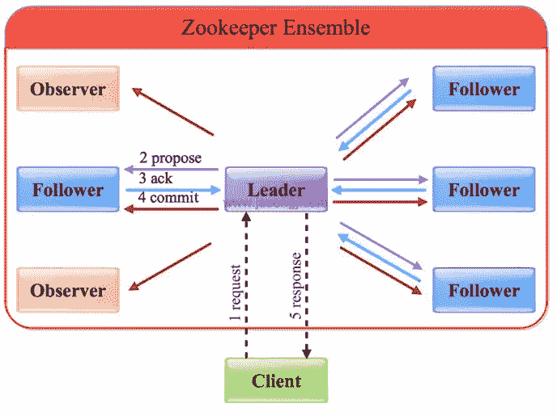
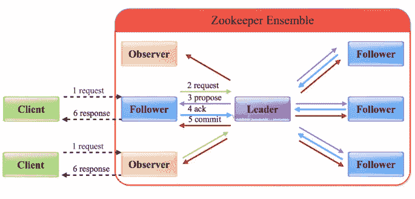

# ZAB 思考

> 原文：[https://www.cnblogs.com/gongcomeon/p/10733150.html](https://www.cnblogs.com/gongcomeon/p/10733150.html)

目录

*   [前言](#前言)
*   [脉络](#脉络)
    *   [ZAB 的大致内容](#zab 的大致内容)
    *   [ZAB 的效果](#zab 的效果)
    *   [ZAB 原理](#zab 原理)
*   [内容](#内容)
    *   [消息广播](#消息广播)
    *   [崩溃恢复](#崩溃恢复)
        *   [选举](#选举)
        *   [同步](#同步)
        *   [广播](#广播)
*   [思考与问题](#思考与问题)
*   [参考](#参考)

### 前言

ZAB 是专门为 Zookeeper 设计的分布式协调协议，其全称是 Zookeeper Atomic Broadcast(Zookeeper 原子广播协议) 。

在本篇文章中，我不会特别详细地去讲 ZAB 的详细内容和步骤，而是会列出一些我觉得很重要的点或者是理解 ZAB 的脉络，然后从这些点展开来讲。在看文章之前建议先看下本文的参考博客。

### 脉络

#### ZAB 的大致内容

1.  ZAB 的出现是为了解决 Zookeeper 内部的一致性问题，它主要分为两大部分，崩溃恢复和原子广播。
2.  与 Paxos 不同，在 ZAB 中，每个进程最终是会有主备的关系的，在 ZAB 内部被称为 Leader 和 Follower。与很多其他的主从架构一样，对于系统的写操作，都是最终会由 Leader 来统一处理，而对于读操作，Follower 可以单独来处理。而正因为这个原因，Zookeeper 在一定程度上丧失了强一致性，后面具体解释。

#### ZAB 的效果

1.  使用单一进程来处理写请求，并把请求以 proposal 的方式广播到所有的 follower 上去；
2.  保证了全局事务的有序性。因为利用单进程来处理写请求，那么就可以在处理写请求的时候为每个请求生成一个独特的 id，在后续的广播或者崩溃恢复的过程中利用这个 id 来保证所有副本上的全局事务的有序性；
3.  当 leader 挂掉的时候，可以利用 ZAB 的崩溃恢复中的选举部分选举新的 leader。

#### ZAB 原理

**发现，同步，广播**

*   **发现**：要求 zookeeper 集群必须选举出一个 Leader 进程，同时 Leader 会维护一个 Follower 可用客户端列表。将来客户端可以和这些 Follower 节点进行通信。
*   **同步**：Leader 要负责将本身的数据与 Follower 完成同步，做到多副本存储。这样也是提现了 CAP 中的高可用和分区容错。Follower 将队列中未处理完的请求消费完成后，写入本地事务日志中。
*   **广播**：Leader 可以接受客户端新的事务 Proposal 请求，将新的 Proposal 请求广播给所有的 Follower。

其实用通俗一点的话说，理解 ZAB 最重要的就是要知道，ZAB 是利用单一的 leader 节点来作为写请求的入口，而且 leader 和所有的 follower 互相之间都知道彼此的存在，这样就可以在每个节点内部维护一份全量的节点名单。而 leader 在获取写请求后，会把请求包装成 proposal 发送给所有的 follower 做备份，与 2PC 不一样的是，只要有超过一半的 follower 返回了 ACK，那么 leader 就会向所有的 follower 发送 Commit，并且自己也会做 commit。

### 内容

#### 消息广播

ZAB 之所以对 2PC 做出了改进，不需要所有的 follower 作出 ack 后才会提出 commit，是因为这样可以大大减小阻塞的时间。

在真实的应用中，客户端会随机连接到 Zookeeper 的任意节点，这样客户端的写请求就可能发送到 leader 节点或者是 follower。但是大致区别是不大的，本质上都是一个 2PC（改进版的）过程。

写 leader 节点：

写 follower 节点：

根据上图总的来说，写 Leader 主要有：

1.  客户端向 Leader 发起写请求
2.  Leader 将写请求以 Proposal 的形式发给所有 Follower 并等待 ACK
3.  Follower 收到 Leader 的 Proposal 后返回 ACK
4.  Leader 得到过半数的 ACK（Leader 对自己默认有一个 ACK）后向所有的 Follower 和 Observer 发送 Commmit
5.  Leader 将处理结果返回给客户端

而写 follower 只是在写 leader 的第一步之前加了一步转发给 leader 而已。

另外值得一提的是，leader 服务器与每个 follower 之间都有一个单独的队列进行收发消息，使用队列消息可以做到异步解耦。leader 和 follower 之间只要往队列中发送了消息即可。如果使用同步方式容易引起阻塞。性能上要下降很多。

#### 崩溃恢复

既然 ZK 内部发生了崩溃，那么是如何恢复数据，保证数据的一致性呢？在广播中我们可以知道是通过类似 2PC 的过程来做的，但是既然 ZK 内部 Leader 崩溃了，那么便无法像原子广播一样直接采取这种方式来做。在 Leader 崩溃后，一般来说会有两种情况：

1.  leader 在提出 proposal 时未提交之前崩溃，则经过崩溃恢复之后，新选举的 leader 一定不能是刚才的 leader。因为这个 leader 存在未提交的 proposal。
2.  leader 在发送 commit 消息之后，崩溃。即消息已经发送到队列中。经过崩溃恢复之后，参与选举的 follower 服务器(刚才崩溃的 leader 有可能已经恢复运行，也属于 follower 节点范畴)中有的节点已经是消费了队列中所有的 commit 消息。即该 follower 节点将会被选举为最新的 leader。剩下动作就是数据同步过程。

其实总的来说就是一种是在 commit 前，一种在 commit 后，区别核心在于 follower 是否有机会执行 commit。

为了解决这个问题，ZAB 提出了崩溃恢复的两个要求：

1.  确保 leader 提交的 proposal 必须被所有的 follower 服务器提交；
2.  确保丢弃已经被 leader 提出的但没有提交的 proposal。

为了解决这个问题，ZAB 采用的策略是重新进行选举，然后利用特殊的机制同步新的 leader 和 follower 之间的数据，这样保证新的 leader 和 follower 之间的数据一致性。总的来说就是三个阶段：1\. 选举； 2\. 恢复； 3\. 广播。

##### 选举

ZAB 利用了特殊的被称为 Fast Leader Election 的选举策略。

简单的来说，在 Zookeeper 内部的 zxid 是一个 64 位的变量，其中前 32 位被称为 epoch 或者 logicalClock，它的含义是代表这是该服务器发起的第多少轮投票；而低 32 位则代表这是当前 epoch 下第多少次的写请求。在参考 1 和 3 中有详细的分析过程。

选举的流程大致如下：

1.  follower 发现 leader 崩溃，这时就会把自己的 epoch+1；
2.  初始化投票(投给自己)
3.  接受外部投票，投票更新规则如下：
    1.  判断选举轮次(epoch)
    2.  若 epoch 相等，选 zxid 最大的
    3.  若 epoch 和 zxid 都一样，那么选择 serverid 最大的(myid 最大)
4.  统计选票，如果有过半选择了自己，那么自己成为 leader
5.  更新状态。Looking===>Leading/Following

具体的过程可以看参考中的第 1,2 篇。

##### 同步

选举完后的 leader 只是准 leader，只有当准 leader 和 follower 完成了数据的同步后才能成为真正的 leader。

之前说过 ZAB 对崩溃恢复有两个要求，在同步过程中为了满足这两个要求做了下面的操作：

1.  首先 leader 会和 follower 交换最大的 commit 的 zxid，如果发现 follower 有部分 zxid 没有 commit，那么会把 commit 这些事务的任务放入各个 follower 的队列中，这样保证了所有 leader 的 commit 都提交了；
2.  如果 follower 的 zxid 有大于 leader 的 zxid 的，那么 leader 会发送 trunc 命令让 follower 删除这些 zxid 对应的事务。这个就保证了未被 commit 的消息会被丢弃。

##### 广播

这个过程和之前的原子广播一致。

### 思考与问题

1.  ZAB 和 Paxos

zookeeper 之所以没有采用 Paxos，是因为 Paxos 无法保证全局有序，并且因为在 Paxos 中，第一阶段会一直竞争 acceptor 的 promise，这个阶段很容易发生活锁，造成效率低下。因此 zookeeper 引入了 leader 的概念，并用 leader 的选举，恢复等(即崩溃恢复)保证系统的高可用。在崩溃恢复的过程中，leader 的选举、同步与 paxos 有一定程度的相似。

2.  Zookeeper 是不保证读一致性的

如文章开头部分所说，因为在消息的原子广播过程中，只要得到了大部分的 follower 的 ack 就会让 follower 做 commit。而客户端是可以任意连接 zookeeper 集群的任意节点，如果客户端连接到的节点还没有给 leader 返回 ack，但是大部分的节点都给 leader 返回了 ack 并做了 commit，那么这时候客户端读取的便不是最新的状态。可以参考 4 了解详细分析。

3.  zookeeper 内部 follower 是怎么知道 leader 挂了的？

有几点还没有完全理解，如果一个 follower 和其他所有 follower 和 leader 都失去了联系，它会做什么操作？或者说 zookeeper 在什么情况下知道 leader 挂了，特别是 follower 没办法和其他所有 follower 联系的情况下，比如集群分裂成两部分，少的那部分会怎么做？在什么时候把 following 状态改成 looking 状态？

### 参考

1.  [https://blog.csdn.net/a724888/article/details/80757503](https://blog.csdn.net/a724888/article/details/80757503)

2.  [https://www.jianshu.com/p/2bceacd60b8a](https://www.jianshu.com/p/2bceacd60b8a)

3.  [https://mp.weixin.qq.com/s?__biz=MzI4NTA1MDEwNg==&mid=2650764806&idx=1&sn=48d6d8a99bbaee3dcac2e12e3bf04ea7&chksm=f3f9c393c48e4a85dd5e4b2f741934ec3919c7fc4d4b7cfc26422f6f0977fbcafb8b30dcec5a&mpshare=1&scene=24&srcid=0105FEZLQd1wIshoJGfSDSX4&key=e58c60872eb97b11b762dca1ca1a39524e285b7e7e284fa90d835cc587cd24be77863773de3eb26f4f361ce6d2cc7102954c85abb312df1ae20260f353cfbffe6df7e7547f7d769809a9156ad4122cb5&ascene=0&uin=Nzc5NTUyMTQw&devicetype=iMac14%252C1+OSX+OSX+10.12.5+build(16F73)&version=12020610&nettype=WIFI&lang=zh_CN&fontScale=100&pass_ticket=S3JxgA9EegL3%252FLyZHJR7A4UUD6efECHmVViRoiiCAEvrQ%252FsOgKfJU7SiM8TTfYn3](https://mp.weixin.qq.com/s?__biz=MzI4NTA1MDEwNg==&mid=2650764806&idx=1&sn=48d6d8a99bbaee3dcac2e12e3bf04ea7&chksm=f3f9c393c48e4a85dd5e4b2f741934ec3919c7fc4d4b7cfc26422f6f0977fbcafb8b30dcec5a&mpshare=1&scene=24&srcid=0105FEZLQd1wIshoJGfSDSX4&key=e58c60872eb97b11b762dca1ca1a39524e285b7e7e284fa90d835cc587cd24be77863773de3eb26f4f361ce6d2cc7102954c85abb312df1ae20260f353cfbffe6df7e7547f7d769809a9156ad4122cb5&ascene=0&uin=Nzc5NTUyMTQw&devicetype=iMac14%2C1+OSX+OSX+10.12.5+build(16F73)&version=12020610&nettype=WIFI&lang=zh_CN&fontScale=100&pass_ticket=S3JxgA9EegL3%2FLyZHJR7A4UUD6efECHmVViRoiiCAEvrQ%2FsOgKfJU7SiM8TTfYn3)

4.  [http://www.crazyant.net/2120.html](http://www.crazyant.net/2120.html)

5.  [https://www.cnblogs.com/Desneo/p/7608441.html](https://www.cnblogs.com/Desneo/p/7608441.html)