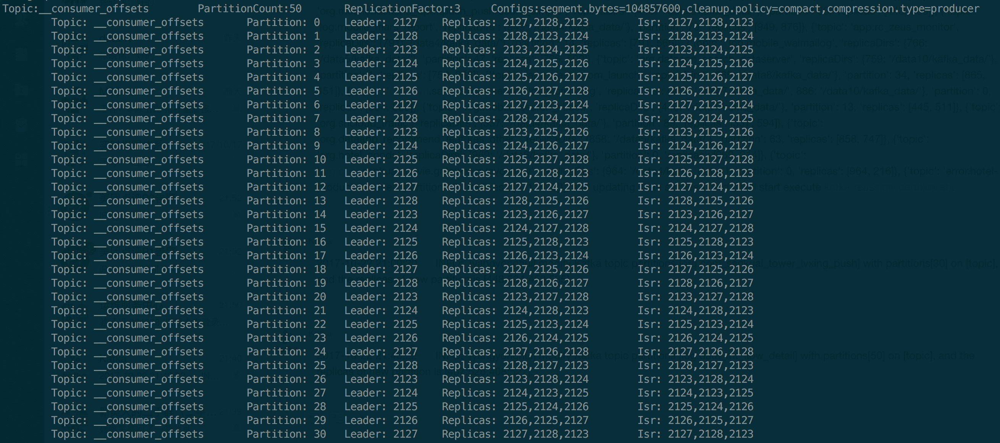
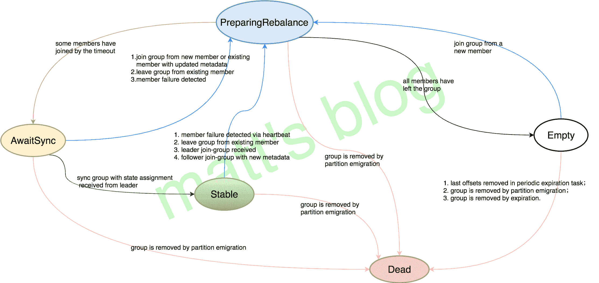

# Kafka 源码解析之 Consumer 如何加入一个 Group（六）

> 原文：[http://matt33.com/2017/10/22/consumer-join-group/](http://matt33.com/2017/10/22/consumer-join-group/)

距离上一篇博客（2017-09-10），到现在已经过去一个多月了，理论上这篇文章在上个月就应该写完，无奈拖延症又犯了，一直以这部分过于复杂为借口拖了好久，这两天逼了自己一把，先整理出其中的一篇，后续要加把劲，要不然今年的年度计划（年底前把这个系列写完）就完不成了，废话到此为止，下面步入正文。在 Kafka 中，Consumer 的复杂度要比 producer 高出很多，对于 Producer 而言，没有 producer 组的概念的、也不需要 care offset 等问题，而 Consumer 就不一样了，它需要关注的内容很多，需要考虑分布式消费（Consumer Group），为了防止重复消费或者部分数据未消费需要考虑 offset，这些都对 Consumer 的设计以及 Server 对其处理提出了很高的要求。本来计划是先进行综述，然后再分别介绍各个模块，现在打算反过来，先介绍各个模块，最后再进行综述，本篇为 Consumer 源码分析开篇，先从一个 Consumer 实例如何加入一个 Consumer Group 讲起。

这里的分析是以 0.10.2 为准，在 0.10.2 版的 KafkaConsumer 中，相比于老版的 KafkaConsumer（0.9 以前的），新版从 0.9 开始做了很大改进，总结起来，其优势有以下两点：

*   实现了 High Level 与 Simple Level Consumer API 的统一，极大地简化了实现的复杂度；
*   增加了 GroupCoordinator 角色，它作用是：`GroupCoordinator handles general group membership and offset management`；

接下来会按照下面这个流程来讲述：

1.  GroupCoordinator 简单介绍；
2.  Consumer poll 模型：join-group 是 poll 模型的第一步，其他部分后续再讲；
3.  Consumer join-group 的详细过程以及在这个过程中 group 状态的变化。

## GroupCoordinator 简介

这里先简单介绍一下 GroupCoordinator 这个角色，后续有一篇文章进行专门讲述，GroupCoordinator 是运行在 Kafka Broker 上的一个服务，每台 Broker 在运行时都会启动一个这样的服务，但一个 consumer 具体与哪个 Broker 上这个服务交互，就需要先介绍一下 `__consumer_offsets` 这个 topic。

### `__consumer_offsets` topic

`__consumer_offsets` 是 Kafka 内部使用的一个 topic，专门用来存储 group 消费的情况，默认情况下有 50 个 partition，每个 partition 三副本，如下图所示（只列出了 30 个 partition）：



### GroupCoordinator

GroupCoordinator 是负责 consumer group member 管理以及 offset 管理。

每个 Consumer Group 都有其对应的 GroupCoordinator，但具体是由哪个 GroupCoordinator 负责与 group.id 的 hash 值有关，通过这个 **abs(GroupId.hashCode()) % NumPartitions** 来计算出一个值（其中，NumPartitions 是 `__consumer_offsets` 的 partition 数，默认是 50 个），这个值代表了 `__consumer_offsets` 的一个 partition，而这个 partition 的 leader 即为这个 Group 要交互的 GroupCoordinator 所在的节点。

## Consumer poll 模型

Consumer poll 方法的真正实现是在 `pollOnce()` 方法中，这里直接看下其源码：

```scala
/**
 * Do one round of polling. In addition to checking for new data, this does any needed offset commits
 * (if auto-commit is enabled), and offset resets (if an offset reset policy is defined).
 * @param timeout The maximum time to block in the underlying call to {@link ConsumerNetworkClient#poll(long)}.
 * @return The fetched records (may be empty)
 */
// note: 一次 poll 过程,包括检查新的数据、做一些必要的 commit 以及 offset  重置操作
private Map<TopicPartition, List<ConsumerRecord<K, V>>> pollOnce(long timeout) {
    // note： 1\. 获取 GroupCoordinator 并连接、加入 Group、sync Group, 期间 group 会进行 rebalance 并获取
    coordinator.poll(time.milliseconds());
    // assignment

    // fetch positions if we have partitions we're subscribed to that we
    // don't know the offset for
    // note: 2\. 更新要拉取 partition 的 offset（如果需要更新的话）
    if (!subscriptions.hasAllFetchPositions())
        updateFetchPositions(this.subscriptions.missingFetchPositions());

    // if data is available already, return it immediately
    // note: 3\. 获取 fetcher 已经拉取到的数据
    Map<TopicPartition, List<ConsumerRecord<K, V>>> records = fetcher.fetchedRecords();
    if (!records.isEmpty())
        return records;
    // note: 说明上次 fetch 到是的数据已经全部拉取了,需要再次发送 fetch 请求,从 broker 拉取数据

    // send any new fetches (won't resend pending fetches)
    // note: 4\. 向订阅的所有 partition 发送 fetch 请求,会从多个 partition 拉取数据
    fetcher.sendFetches();

    long now = time.milliseconds();
    long pollTimeout = Math.min(coordinator.timeToNextPoll(now), timeout);

    //note: 5\. 调用 poll 方法发送数据
    client.poll(pollTimeout, now, new PollCondition() {
        @Override
        public boolean shouldBlock() {
            // since a fetch might be completed by the background thread, we need this poll condition
            // to ensure that we do not block unnecessarily in poll()
            return !fetcher.hasCompletedFetches();
        }
    });

    // after the long poll, we should check whether the group needs to rebalance
    // prior to returning data so that the group can stabilize faster
    //note: 6\. 如果 group 需要 rebalance, 直接返回空数据,这样更快地让 group 进行稳定状态
    if (coordinator.needRejoin())
        return Collections.emptyMap();

    return fetcher.fetchedRecords();
}

```

在这里，我们把一个 pollOnce 模型分为 6 个部分，这里简单介绍一下：

1.  连接 GroupCoordinator，并发送 join-group、sync-group 请求，加入 group 成功，并获取其分配的 tp 列表；
2.  更新这些分配的 tp 列表的 the last committed offset（没有的话，根据其设置进行获取 offset）；
3.  调用 Fetcher 获取拉取的数据，如果有数据，立马返回，没有的话就进行下面的操作；
4.  调用 Fetcher 发送 fetch 请求（只是加入队列，并未真正发送）；
5.  调用 poll() 方法发送请求；
6.  如果 group 之前是需要 rebalacne 的，直接返回空集合，这样可以便于 group 尽快达到一个稳定的状态。

一个 Consumer 实例消费数据的前提是能够加入一个 group 成功，并获取其要订阅的 tp（topic-partition）列表，这都是在第一步中完成的，如果这个 group 是一个新的 group，那么 group 的状态将会由 **Empty –> PreparingRebalance –> AwaitSync –> Stable** 的变化过程，下面将会详细介绍。

## Consumer join-group 详解

通过上面，我们知道，poll 模型的第一步是在 `ConsumerCoordinator.poll()` 中实现的，其整体过程如下所示。


> 其实，主要观察图中左边的部分即可，也就是 ConsumerCoordinator 和 AbstractCoordinator 中的方法。

对于一个 Consumer Group，其状态变化图下图所示（后面会讲到）。



### `ConsumerCoordinator.poll()`

先看一下 `ConsumerCoordinator.poll()` 的具体实现

```scala
// note: 它确保了这个 group 的 coordinator 是已知的,并且这个 consumer 是已经加入到了 group 中,也用于 offset 周期性的 commit
public void poll(long now) {
    invokeCompletedOffsetCommitCallbacks();// note: 用于测试

    // note: Step1 通过 subscribe() 方法订阅 topic,并且 coordinator 未知,初始化 Consumer Coordinator
    if (subscriptions.partitionsAutoAssigned() && coordinatorUnknown()) {
        // note: 获取 GroupCoordinator 地址,并且建立连接
        ensureCoordinatorReady();
        now = time.milliseconds();
    }

    // note: Step2 判断是否需要重新加入 group,如果订阅的 partition 变化或则分配的 partition 变化时,需要 rejoin
    if (needRejoin()) {
        // due to a race condition between the initial metadata fetch and the initial rebalance,
        // we need to ensure that the metadata is fresh before joining initially. This ensures
        // that we have matched the pattern against the cluster's topics at least once before joining.
        // note: rejoin group 之前先刷新一下 metadata（对于 AUTO_PATTERN 而言）
        if (subscriptions.hasPatternSubscription())
            client.ensureFreshMetadata();

        // note: 确保 group 是 active; 加入 group; 分配订阅的 partition
        ensureActiveGroup();
        now = time.milliseconds();
    }

    // note: Step3 检查心跳线程运行是否正常,如果心跳线程失败,则抛出异常,反之更新 poll 调用的时间
    pollHeartbeat(now);
    // note: Step4 自动 commit 时,当定时达到时,进行自动 commit
    maybeAutoCommitOffsetsAsync(now);
}

```

在 poll 方法中，具体实现，可以分为以下三步：

1.  通过 `subscribe()` 方法订阅 topic, 并且 coordinator 未知，就初始化 Consumer Coordinator（在 `ensureCoordinatorReady()` 中实现，主要的作用是发送 GroupCoordinator 请求，并建立连接）；
2.  判断是否需要重新加入 group，如果订阅的 partition 变化或则分配的 partition 变化时，需要 rejoin，通过 `ensureActiveGroup()` 发送 join-group、sync-group 请求，加入 group 并获取其 assign 的 tp list；
3.  检测心跳线程运行是否正常（需要定时向 GroupCoordinator 发送心跳线程，长时间未发送的话 group 就会认为该实例已经挂了）；
4.  如果设置的是自动 commit，如果定时达到自动 commit。

这其中，有两个地方需要详细介绍，那就是第一步中的 `ensureCoordinatorReady()` 方法和第二步中的 `ensureActiveGroup()` 方法。

### `ensureCoordinatorReady()`

这个方法的作用是：选择一个连接数最小的 broker，向其发送 GroupCoordinator 请求，并建立相应的 TCP 连接。

*   其方法的调用如前面的流程图所示：ensureCoordinatorReady() –> lookupCoordinator() –> sendGroupCoordinatorRequest()。
*   如果 client 获取到 Server response，那么就会与 GroupCoordinator 建立连接；

```scala
// note: 确保 coordinator 已经 ready（已经连接,并可以发送请求）
// note: 如果 coordinator 已经 ready 返回 true,否则返回 flase。
protected synchronized boolean ensureCoordinatorReady(long startTimeMs, long timeoutMs) {
    long remainingMs = timeoutMs;

    while (coordinatorUnknown()) {
        // note:  获取 GroupCoordinator,并建立连接
        RequestFuture<Void> future = lookupCoordinator();
        client.poll(future, remainingMs);

        if (future.failed()) {// note: 如果获取的过程中失败了
            if (future.isRetriable()) {
                remainingMs = timeoutMs - (time.milliseconds() - startTimeMs);
                if (remainingMs <= 0)
                    break;

                log.debug("Coordinator discovery failed for group {}, refreshing metadata", groupId);
                client.awaitMetadataUpdate(remainingMs);
            } else
                throw future.exception();
        } else if (coordinator != null && client.connectionFailed(coordinator)) {
            // we found the coordinator, but the connection has failed, so mark
            // it dead and backoff before retrying discovery
            coordinatorDead();
            time.sleep(retryBackoffMs);
        }

        remainingMs = timeoutMs - (time.milliseconds() - startTimeMs);
        if (remainingMs <= 0)
            break;
    }

    return !coordinatorUnknown();
}

// note: 选择一个连接最小的节点,发送 groupCoordinator 请求
protected synchronized RequestFuture<Void> lookupCoordinator() {
    if (findCoordinatorFuture == null) {
        // find a node to ask about the coordinator
        Node node = this.client.leastLoadedNode();//NOTE: 找一个节点,发送 groupCoordinator 的请求
        if (node == null) {
            // TODO: If there are no brokers left, perhaps we should use the bootstrap set
            // from configuration?
            log.debug("No broker available to send GroupCoordinator request for group {}", groupId);
            return RequestFuture.noBrokersAvailable();
        } else
            findCoordinatorFuture = sendGroupCoordinatorRequest(node);//NOTE: 发送请求，并对 response 进行处理
    }
    return findCoordinatorFuture;
}

//NOTE: 发送 GroupCoordinator 的请求
private RequestFuture<Void> sendGroupCoordinatorRequest(Node node) {
    // initiate the group metadata request
    log.debug("Sending GroupCoordinator request for group {} to broker {}", groupId, node);
    GroupCoordinatorRequest.Builder requestBuilder =
            new GroupCoordinatorRequest.Builder(this.groupId);
    return client.send(node, requestBuilder)
                 .compose(new GroupCoordinatorResponseHandler());
    //NOTE: compose 的作用是将 GroupCoordinatorResponseHandler 类转换为 RequestFuture
    //NOTE: 实际上就是为返回的 Future 类重置 onSuccess() 和 onFailure() 方法
}

//NOTE: 对 GroupCoordinator 的 response 进行处理,回调
private class GroupCoordinatorResponseHandler extends RequestFutureAdapter<ClientResponse, Void> {

    @Override
    public void onSuccess(ClientResponse resp, RequestFuture<Void> future) {
        log.debug("Received GroupCoordinator response {} for group {}", resp, groupId);

        GroupCoordinatorResponse groupCoordinatorResponse = (GroupCoordinatorResponse) resp.responseBody();
        // use MAX_VALUE - node.id as the coordinator id to mimic separate connections
        // for the coordinator in the underlying network client layer
        // TODO: this needs to be better handled in KAFKA-1935
        Errors error = Errors.forCode(groupCoordinatorResponse.errorCode());
        clearFindCoordinatorFuture();
        if (error == Errors.NONE) {
            // note: 如果正确获取 GroupCoordinator 时, 建立连接,并更新心跳时间
            synchronized (AbstractCoordinator.this) {
                AbstractCoordinator.this.coordinator = new Node(
                        Integer.MAX_VALUE - groupCoordinatorResponse.node().id(),
                        groupCoordinatorResponse.node().host(),
                        groupCoordinatorResponse.node().port());
                log.info("Discovered coordinator {} for group {}.", coordinator, groupId);
                client.tryConnect(coordinator);//note: 初始化 tcp 连接
                heartbeat.resetTimeouts(time.milliseconds());//note: 更新心跳时间
            }
            future.complete(null);
        } else if (error == Errors.GROUP_AUTHORIZATION_FAILED) {
            future.raise(new GroupAuthorizationException(groupId));
        } else {
            log.debug("Group coordinator lookup for group {} failed: {}", groupId, error.message());
            future.raise(error);
        }
    }

    @Override
    public void onFailure(RuntimeException e, RequestFuture<Void> future) {
        clearFindCoordinatorFuture();
        super.onFailure(e, future);
    }
}

```

### `ensureActiveGroup()`

这个方法的作用是：向 GroupCoordinator 发送 join-group、sync-group 请求，获取 assign 的 tp list。

*   如前面图中所示，ensureActiveGroup 方法的调用过程：ensureActiveGroup() –> ensureCoordinatorReady() –> startHeartbeatThreadIfNeeded() –> joinGroupIfNeeded()；
*   `joinGroupIfNeeded()` 方法中最重要的方法是 `initiateJoinGroup()`，其方法的调用过程为：initiateJoinGroup() –> sendJoinGroupRequest() –> JoinGroupResponseHandler.handle().succeed –> onJoinLeader()/onJoinFollower() –> sendSyncGroupRequest() –> SyncGroupResponseHandler。

```scala
//NOTE: 确保 Group 是 active,并且加入该 group
public void ensureActiveGroup() {
    // always ensure that the coordinator is ready because we may have been disconnected
    // when sending heartbeats and does not necessarily require us to rejoin the group.
    ensureCoordinatorReady();//NOTE: 确保 GroupCoordinator 已经连接
    startHeartbeatThreadIfNeeded();//NOTE: 启动心跳发送线程（并不一定发送心跳,满足条件后才会发送心跳）
    joinGroupIfNeeded();//NOTE: 发送 JoinGroup 请求,并对返回的信息进行处理
}

```

join-group 的请求是在 `joinGroupIfNeeded()` 中实现的。

```scala
// note: join group
public void joinGroupIfNeeded() {
    while (needRejoin() || rejoinIncomplete()) {
        ensureCoordinatorReady();
        // call onJoinPrepare if needed. We set a flag to make sure that we do not call it a second
        // time if the client is woken up before a pending rebalance completes. This must be called
        // on each iteration of the loop because an event requiring a rebalance (such as a metadata
        // refresh which changes the matched subscription set) can occur while another rebalance is
        // still in progress.
        //note: 触发 onJoinPrepare, 包括 offset commit 和 rebalance listener
        if (needsJoinPrepare) {
            onJoinPrepare(generation.generationId, generation.memberId);
            needsJoinPrepare = false;
        }

        // note: 初始化 JoinGroup 请求,并发送该请求
        RequestFuture<ByteBuffer> future = initiateJoinGroup();
        client.poll(future);
        resetJoinGroupFuture();//NOTE: 重置 joinFuture 为空

        if (future.succeeded()) {//note: join succeed,这一步时,时间上 sync-group 已经成功了
            needsJoinPrepare = true;
            onJoinComplete(generation.generationId, generation.memberId, generation.protocol, future.value());
        } else {
            RuntimeException exception = future.exception();
            if (exception instanceof UnknownMemberIdException ||
                    exception instanceof RebalanceInProgressException ||
                    exception instanceof IllegalGenerationException)
                continue;
            else if (!future.isRetriable())
                throw exception;
            time.sleep(retryBackoffMs);
        }
    }
}

```

`sendJoinGroupRequest()` 方法是由 `initiateJoinGroup()` 方法来调用的。

```scala
//NOTE: 发送 JoinGroup 的请求, 并添加 listener
private synchronized RequestFuture<ByteBuffer> initiateJoinGroup() {
    // we store the join future in case we are woken up by the user after beginning the
    // rebalance in the call to poll below. This ensures that we do not mistakenly attempt
    // to rejoin before the pending rebalance has completed.
    if (joinFuture == null) {
        // fence off the heartbeat thread explicitly so that it cannot interfere with the join group.
        // Note that this must come after the call to onJoinPrepare since we must be able to continue
        // sending heartbeats if that callback takes some time.
        // note: rebalance 期间,心跳线程停止
        disableHeartbeatThread();

        state = MemberState.REBALANCING;//NOTE: 标记为 rebalance
        joinFuture = sendJoinGroupRequest();//NOTE: 发送 JoinGroup 请求
        joinFuture.addListener(new RequestFutureListener<ByteBuffer>() {
            @Override
            public void onSuccess(ByteBuffer value) {
                // handle join completion in the callback so that the callback will be invoked
                // even if the consumer is woken up before finishing the rebalance
                synchronized (AbstractCoordinator.this) {
                    log.info("Successfully joined group {} with generation {}", groupId, generation.generationId);
                    state = MemberState.STABLE;//NOTE: 标记 Consumer 为 stable

                    if (heartbeatThread != null)
                        heartbeatThread.enable();
                }
            }

            @Override
            public void onFailure(RuntimeException e) {
                // we handle failures below after the request finishes. if the join completes
                // after having been woken up, the exception is ignored and we will rejoin
                synchronized (AbstractCoordinator.this) {
                    state = MemberState.UNJOINED;//NOTE: 标记 Consumer 为 Unjoined
                }
            }
        });
    }
    return joinFuture;
}

```

sendJoinGroupRequest() 及其处理如下所示。

```scala
/**
 * Join the group and return the assignment for the next generation. This function handles both
 * JoinGroup and SyncGroup, delegating to {@link #performAssignment(String, String, Map)} if
 * elected leader by the coordinator.
 * @return A request future which wraps the assignment returned from the group leader
 */
//NOTE: 发送 JoinGroup 请求并返回 the assignment for the next generation（这个是在 JoinGroupResponseHandler 中做的）
private RequestFuture<ByteBuffer> sendJoinGroupRequest() {
    if (coordinatorUnknown())
        return RequestFuture.coordinatorNotAvailable();

    // send a join group request to the coordinator
    log.info("(Re-)joining group {}", groupId);
    JoinGroupRequest.Builder requestBuilder = new JoinGroupRequest.Builder(
            groupId,
            this.sessionTimeoutMs,
            this.generation.memberId,
            protocolType(),
            metadata()).setRebalanceTimeout(this.rebalanceTimeoutMs);

    log.debug("Sending JoinGroup ({}) to coordinator {}", requestBuilder, this.coordinator);
    return client.send(coordinator, requestBuilder)
            .compose(new JoinGroupResponseHandler());
}

//NOTE: 处理 JoinGroup response 的 handler（同步 group 信息）
private class JoinGroupResponseHandler extends CoordinatorResponseHandler<JoinGroupResponse, ByteBuffer> {
    @Override
    public void handle(JoinGroupResponse joinResponse, RequestFuture<ByteBuffer> future) {
        Errors error = Errors.forCode(joinResponse.errorCode());
        if (error == Errors.NONE) {
            log.debug("Received successful JoinGroup response for group {}: {}", groupId, joinResponse);
            sensors.joinLatency.record(response.requestLatencyMs());

            synchronized (AbstractCoordinator.this) {
                if (state != MemberState.REBALANCING) {//NOTE: 如果此时 Consumer 的状态不是 rebalacing,就引起异常
                    // if the consumer was woken up before a rebalance completes, we may have already left
                    // the group. In this case, we do not want to continue with the sync group.
                    future.raise(new UnjoinedGroupException());
                } else {
                    AbstractCoordinator.this.generation = new Generation(joinResponse.generationId(),
                            joinResponse.memberId(), joinResponse.groupProtocol());
                    AbstractCoordinator.this.rejoinNeeded = false;
                    //NOTE: join group 成功,下面需要进行 sync-group,获取分配的 tp 列表。
                    if (joinResponse.isLeader()) {
                        onJoinLeader(joinResponse).chain(future);
                    } else {
                        onJoinFollower().chain(future);
                    }
                }
            }
        } else if (error == Errors.GROUP_LOAD_IN_PROGRESS) {
            log.debug("Attempt to join group {} rejected since coordinator {} is loading the group.", groupId,
                    coordinator());
            // backoff and retry
            future.raise(error);
        } else if (error == Errors.UNKNOWN_MEMBER_ID) {
            // reset the member id and retry immediately
            resetGeneration();
            log.debug("Attempt to join group {} failed due to unknown member id.", groupId);
            future.raise(Errors.UNKNOWN_MEMBER_ID);
        } else if (error == Errors.GROUP_COORDINATOR_NOT_AVAILABLE
                || error == Errors.NOT_COORDINATOR_FOR_GROUP) {
            // re-discover the coordinator and retry with backoff
            coordinatorDead();
            log.debug("Attempt to join group {} failed due to obsolete coordinator information: {}", groupId, error.message());
            future.raise(error);
        } else if (error == Errors.INCONSISTENT_GROUP_PROTOCOL
                || error == Errors.INVALID_SESSION_TIMEOUT
                || error == Errors.INVALID_GROUP_ID) {
            // log the error and re-throw the exception
            log.error("Attempt to join group {} failed due to fatal error: {}", groupId, error.message());
            future.raise(error);
        } else if (error == Errors.GROUP_AUTHORIZATION_FAILED) {
            future.raise(new GroupAuthorizationException(groupId));
        } else {
            // unexpected error, throw the exception
            future.raise(new KafkaException("Unexpected error in join group response: " + error.message()));
        }
    }
}

```

sendJoinGroupRequest()：向 GroupCoordinator 发送 join-group 请求

1.  如果 group 是新的 group.id，那么此时 group 初始化的状态为 **Empty**；
2.  当 GroupCoordinator 接收到 consumer 的 join-group 请求后，由于此时这个 group 的 member 列表还是空（group 是新建的，每个 consumer 实例被称为这个 group 的一个 member），第一个加入的 member 将被选为 leader，也就是说，对于一个新的 consumer group 而言，当第一个 consumer 实例加入后将会被选为 leader；
3.  如果 GroupCoordinator 接收到 leader 发送 join-group 请求，将会触发 rebalance，group 的状态变为 **PreparingRebalance**；
4.  此时，GroupCoordinator 将会等待一定的时间，如果在一定时间内，接收到 join-group 请求的 consumer 将被认为是依然存活的，此时 group 会变为 **AwaitSync** 状态，并且 GroupCoordinator 会向这个 group 的所有 member 返回其 response；
5.  consumer 在接收到 GroupCoordinator 的 response 后，如果这个 consumer 是 group 的 leader，那么这个 consumer 将会负责为整个 group assign partition 订阅安排（默认是按 range 的策略，目前也可选 roundrobin），然后 leader 将分配后的信息以 `sendSyncGroupRequest()` 请求的方式发给 GroupCoordinator，而作为 follower 的 consumer 实例会发送一个空列表；
6.  GroupCoordinator 在接收到 leader 发来的请求后，会将 assign 的结果返回给所有已经发送 sync-group 请求的 consumer 实例，并且 group 的状态将会转变为 **Stable**，如果后续再收到 sync-group 请求，由于 group 的状态已经是 Stable，将会直接返回其分配结果。

sync-group 请求的发送及其实现如下所示。

```scala
//note: 当 consumer 为 follower 时,从 GroupCoordinator 拉取分配结果
private RequestFuture<ByteBuffer> onJoinFollower() {
    // send follower's sync group with an empty assignment
    SyncGroupRequest.Builder requestBuilder =
            new SyncGroupRequest.Builder(groupId, generation.generationId, generation.memberId,
                    Collections.<String, ByteBuffer>emptyMap());
    log.debug("Sending follower SyncGroup for group {} to coordinator {}: {}", groupId, this.coordinator,
            requestBuilder);
    return sendSyncGroupRequest(requestBuilder);
}

//note: 当 consumer 客户端为 leader 时,对 group 下的所有实例进行分配,将 assign 的结果发送到 GroupCoordinator
private RequestFuture<ByteBuffer> onJoinLeader(JoinGroupResponse joinResponse) {
    try {
        // perform the leader synchronization and send back the assignment for the group
        Map<String, ByteBuffer> groupAssignment = performAssignment(joinResponse.leaderId(), joinResponse.groupProtocol(),
                joinResponse.members());//NOTE: 进行 assign 操作

        SyncGroupRequest.Builder requestBuilder =
                new SyncGroupRequest.Builder(groupId, generation.generationId, generation.memberId, groupAssignment);
        log.debug("Sending leader SyncGroup for group {} to coordinator {}: {}",
                groupId, this.coordinator, requestBuilder);
        return sendSyncGroupRequest(requestBuilder);//NOTE: 发送 sync-group 请求
    } catch (RuntimeException e) {
        return RequestFuture.failure(e);
    }
}

//NOTE: 发送 SyncGroup 请求,获取对 partition 分配的安排
private RequestFuture<ByteBuffer> sendSyncGroupRequest(SyncGroupRequest.Builder requestBuilder) {
    if (coordinatorUnknown())
        return RequestFuture.coordinatorNotAvailable();
    return client.send(coordinator, requestBuilder)
            .compose(new SyncGroupResponseHandler());
}

private class SyncGroupResponseHandler extends CoordinatorResponseHandler<SyncGroupResponse, ByteBuffer> {
    @Override
    public void handle(SyncGroupResponse syncResponse,
                       RequestFuture<ByteBuffer> future) {
        Errors error = Errors.forCode(syncResponse.errorCode());
        if (error == Errors.NONE) {//note: 同步成功
            sensors.syncLatency.record(response.requestLatencyMs());
            future.complete(syncResponse.memberAssignment());
        } else {
            requestRejoin();//note: join 的标志位设置为 true

            if (error == Errors.GROUP_AUTHORIZATION_FAILED) {
                future.raise(new GroupAuthorizationException(groupId));
            } else if (error == Errors.REBALANCE_IN_PROGRESS) {//NOTE: group 正在进行 rebalance,任务失败
                log.debug("SyncGroup for group {} failed due to coordinator rebalance", groupId);
                future.raise(error);
            } else if (error == Errors.UNKNOWN_MEMBER_ID
                    || error == Errors.ILLEGAL_GENERATION) {
                log.debug("SyncGroup for group {} failed due to {}", groupId, error);
                resetGeneration();
                future.raise(error);
            } else if (error == Errors.GROUP_COORDINATOR_NOT_AVAILABLE
                    || error == Errors.NOT_COORDINATOR_FOR_GROUP) {
                log.debug("SyncGroup for group {} failed due to {}", groupId, error);
                coordinatorDead();
                future.raise(error);
            } else {
                future.raise(new KafkaException("Unexpected error from SyncGroup: " + error.message()));
            }
        }
    }
}

```

### `onJoinComplete()`

经过上面的步骤，一个 consumer 实例就已经加入 group 成功了，加入 group 成功后，将会触发 ConsumerCoordinator 的 `onJoinComplete()` 方法，其作用就是：更新订阅的 tp 列表、更新其对应的 metadata 及触发注册的 listener。

```scala
// note: 加入 group 成功
@Override
protected void onJoinComplete(int generation,
                              String memberId,
                              String assignmentStrategy,
                              ByteBuffer assignmentBuffer) {
    // only the leader is responsible for monitoring for metadata changes (i.e. partition changes)
    if (!isLeader)
        assignmentSnapshot = null;

    PartitionAssignor assignor = lookupAssignor(assignmentStrategy);
    if (assignor == null)
        throw new IllegalStateException("Coordinator selected invalid assignment protocol: " + assignmentStrategy);

    Assignment assignment = ConsumerProtocol.deserializeAssignment(assignmentBuffer);

    // set the flag to refresh last committed offsets
    //note: 设置是否需要拉取 last committed offsets 为 true
    subscriptions.needRefreshCommits();

    // update partition assignment
    //note: 更新订阅的 tp list
    subscriptions.assignFromSubscribed(assignment.partitions());

    // check if the assignment contains some topics that were not in the original
    // subscription, if yes we will obey what leader has decided and add these topics
    // into the subscriptions as long as they still match the subscribed pattern
    //
    // TODO this part of the logic should be removed once we allow regex on leader assign
    Set<String> addedTopics = new HashSet<>();
    for (TopicPartition tp : subscriptions.assignedPartitions()) {
        if (!joinedSubscription.contains(tp.topic()))
            addedTopics.add(tp.topic());
    }

    if (!addedTopics.isEmpty()) {
        Set<String> newSubscription = new HashSet<>(subscriptions.subscription());
        Set<String> newJoinedSubscription = new HashSet<>(joinedSubscription);
        newSubscription.addAll(addedTopics);
        newJoinedSubscription.addAll(addedTopics);

        this.subscriptions.subscribeFromPattern(newSubscription);
        this.joinedSubscription = newJoinedSubscription;
    }

    // update the metadata and enforce a refresh to make sure the fetcher can start
    // fetching data in the next iteration
    //note: 更新 metadata,确保在下一次循环中可以拉取
    this.metadata.setTopics(subscriptions.groupSubscription());
    client.ensureFreshMetadata();

    // give the assignor a chance to update internal state based on the received assignment
    assignor.onAssignment(assignment);

    // reschedule the auto commit starting from now
    this.nextAutoCommitDeadline = time.milliseconds() + autoCommitIntervalMs;

    // execute the user's callback after rebalance
    //note: 执行 listener
    ConsumerRebalanceListener listener = subscriptions.listener();
    log.info("Setting newly assigned partitions {} for group {}", subscriptions.assignedPartitions(), groupId);
    try {
        Set<TopicPartition> assigned = new HashSet<>(subscriptions.assignedPartitions());
        listener.onPartitionsAssigned(assigned);
    } catch (WakeupException | InterruptException e) {
        throw e;
    } catch (Exception e) {
        log.error("User provided listener {} for group {} failed on partition assignment",
                listener.getClass().getName(), groupId, e);
    }
}

```

至此，一个 consumer 实例算是真正上意义上加入 group 成功。