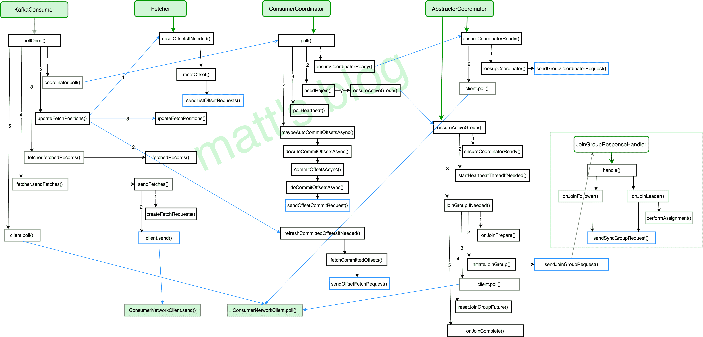

# Kafka 源码解析之 Consumer Poll 模型（七）

> 原文：<http://matt33.com/2017/11/11/consumer-pollonce/>

在上一篇问文章中已经介绍一个 Consumer 实例如何加入到一个 group 中，它是 Consumer Poll 模型第一步要做的事件，本文会完整讲述一个 Consumer 实例在 poll 模型过程中会做哪些事情，只有理解了 poll 模型才能更好地理解 Consumer 端的处理逻辑。

## Consumer 示例

这里以一个 Consumer 的实例代码作为开始，一个比较常见的 Consumer 示例代码如下所示，其主要包含一下几个步骤：

1.  构造 Propertity，进行 consumer 相关的配置；
2.  创建 KafkaConsumer 的对象 consumer；
3.  订阅相应的 topic 列表；
4.  调用 consumer 的 poll 方法拉取订阅的消息。

前面两步在 Consumer 底层上只是创建了一个 consumer 对象，第三步只有记录一下订阅的 topic 信息，consumer 实际的操作都是第四步，也就是在 `poll` 方法中实现的，这也是 poll 模型对于理解 consumer 设计非常重要的原因。

```scala
import org.apache.kafka.clients.consumer.ConsumerRecord;
import org.apache.kafka.clients.consumer.ConsumerRecords;
import org.apache.kafka.clients.consumer.KafkaConsumer;

import java.util.Arrays;
import java.util.Properties;

/**
 * 自动 commit 的情况
 * Created by matt on 16/7/14.
 */
public class ConsumerAutoOffsetCommit {
    private static String topic;
    private static String group;
    public static void main(String[] args) {
        Properties props = new Properties();
        topic=args[0];
        group=args[1]; // auto-offset-commit
        props.put("bootstrap.servers", "XXX:9092,XXX:9092");
        props.put("group.id", group);
        props.put("auto.offset.reset", "earliest");
        props.put("enable.auto.commit", "true"); // 自动 commit
        props.put("auto.commit.interval.ms", "1000"); // 自动 commit 的间隔
        props.put("session.timeout.ms", "30000");
        props.put("key.deserializer", "org.apache.kafka.common.serialization.StringDeserializer");
        props.put("value.deserializer", "org.apache.kafka.common.serialization.StringDeserializer");
        KafkaConsumer<String, String> consumer = new KafkaConsumer<>(props);
        consumer.subscribe(Arrays.asList(topic)); // 可消费多个 topic,组成一个 list
        while (true) {
            ConsumerRecords<String, String> records = consumer.poll(100);
            for (ConsumerRecord<String, String> record : records) {
                System.out.printf("offset = %d, key = %s, value = %s \n", record.offset(), record.key(), record.value());
                try {
                    Thread.sleep(100);
                } catch (InterruptedException e) {
                    e.printStackTrace();
                }
            }
        }
    }
}

```

## Poll 模型综述

当一个 consumer 对象创建之后，只有 poll 方法调用时，consumer 才会真正去连接 kafka 集群，进行相关的操作，其 poll 方法具体实现如下：

```scala
//timeout(ms): buffer 中的数据未就绪情况下，等待的最长时间，如果设置为 0，立即返回 buffer 中已经就绪的数据
public ConsumerRecords<K, V> poll(long timeout) {
    acquire();
    try {
        if (timeout < 0)
            throw new IllegalArgumentException("Timeout must not be negative");

        if (this.subscriptions.hasNoSubscriptionOrUserAssignment())
            throw new IllegalStateException("Consumer is not subscribed to any topics or assigned any partitions");

        // poll for new data until the timeout expires
        long start = time.milliseconds();
        long remaining = timeout;
        do {
            Map<TopicPartition, List<ConsumerRecord<K, V>>> records = pollOnce(remaining);
            //note: 从订阅的 partition 中拉取数据,pollOnce() 才是对 Consumer 客户端拉取数据的核心实现
            if (!records.isEmpty()) {
                // 在返回数据之前，发送下次的 fetch 请求，避免用户在下次获取数据时线程 block
                if (fetcher.sendFetches() > 0 || client.pendingRequestCount() > 0)
                    client.pollNoWakeup();

                if (this.interceptors == null)
                    return new ConsumerRecords<>(records);
                else
                    return this.interceptors.onConsume(new ConsumerRecords<>(records));
            }

            long elapsed = time.milliseconds() - start;
            remaining = timeout - elapsed;
        } while (remaining > 0);

        return ConsumerRecords.empty();
    } finally {
        release();
    }
}

```

consumer `poll` 方法主要做了以下几件事情：

1.  检查这个 consumer 是否订阅的相应的 topic-partition；
2.  调用 `pollOnce()` 方法获取相应的 records；
3.  在返回获取的 records 前，发送下一次的 fetch 请求，避免用户在下次请求时线程 block 在 `pollOnce()` 方法中；
4.  如果在给定的时间（timeout）内获取不到可用的 records，返回空数据。

这里可以看出，poll 方法的真正实现是在 pollOnce 方法中，poll 方法通过 pollOnce 方法获取可用的数据。

### pollOnce 方法

这里看下 pollOnce 方法主要做了哪些事情，其具体实现如下所示：

```scala
// note: 一次 poll 过程，除了获取新数据外，还会做一些必要的 offset-commit 核 reset-offset  的操作
private Map<TopicPartition, List<ConsumerRecord<K, V>>> pollOnce(long timeout) {
    // note： 1\. 获取 GroupCoordinator 地址并连接、加入 Group、sync Group、自动 commit, join 及 sync 期间 group 会进行 rebalance
    coordinator.poll(time.milliseconds());
    // note: 2\. 更新订阅的 topic-partition 的 offset（如果订阅的 topic-partition list 没有有效的 offset 的情况下）
    if (!subscriptions.hasAllFetchPositions())
        updateFetchPositions(this.subscriptions.missingFetchPositions());

    // note: 3\. 获取 fetcher 已经拉取到的数据
    Map<TopicPartition, List<ConsumerRecord<K, V>>> records = fetcher.fetchedRecords();
    if (!records.isEmpty())
        return records;
    // note: 说明上次 fetch 到是的数据已经全部拉取了,需要再次发送 fetch 请求,从 broker 拉取数据

    // note: 4\. 发送 fetch 请求,会从多个 topic-partition 拉取数据（只要对应的 topic-partition 没有未完成的请求）
    fetcher.sendFetches();

    long now = time.milliseconds();
    long pollTimeout = Math.min(coordinator.timeToNextPoll(now), timeout);

    //note: 5\. 调用 poll 方法发送请求（底层发送请求的接口）
    client.poll(pollTimeout, now, new PollCondition() {
        @Override
        public boolean shouldBlock() {
            return !fetcher.hasCompletedFetches();//note: 有完成的 fetcher 请求的话,这里就不会 block,但是 block 也是有最大时间限制
        }
    });

    //note: 6\. 如果 group 需要 rebalance,直接返回空数据,这样更快地让 group 进行稳定状态
    if (coordinator.needRejoin())
        return Collections.emptyMap();

    return fetcher.fetchedRecords();
}

```

pollOnce 可以简单分为 6 步来看，其作用分别如下：

1.  `coordinator.poll()`：获取 GroupCoordinator 的地址，并建立相应 tcp 连接，发送 join-group、sync-group，之后才真正加入到了一个 group 中，这时会获取其要消费的 topic-partition 列表，如果设置了自动 commit，也会在这一步进行 commit，具体可见 [Kafka 源码解析之 Consumer 如何加入一个 Group（六）](http://matt33.com/2017/10/22/consumer-join-group/)，总之，对于一个新建的 group，group 状态将会从 **Empty –> PreparingRebalance –> AwaiSync –> Stable**；
2.  `updateFetchPositions()`： 在上一步中已经获取到了这个 consumer 实例要订阅的 topic-partition list，这一步更新其 fetch-position offset，以便进行拉取；
3.  `fetcher.sendFetches()`：返回其 fetched records，并更新其 fetch-position offset，只有在 offset-commit 时（自动 commit 时，是在第一步实现的），才会更新其 committed offset；
4.  `fetcher.sendFetches()`：只要订阅的 topic-partition list 没有未处理的 fetch 请求，就发送对这个 topic-partition 的 fetch 请求，在真正发送时，还是会按 node 级别去发送，leader 是同一个 node 的 topic-partition 会合成一个请求去发送；
5.  `client.poll()`：调用底层 NetworkClient 提供的接口去发送相应的请求；
6.  `coordinator.needRejoin()`：如果当前实例分配的 topic-partition 列表发送了变化，那么这个 consumer group 就需要进行 rebalance。

### PollOnce 整体流程

通过上面一节的介绍，pollOnce 方法做的事情现在已经有了一个比较清晰的认识，PollOnce 其详细流程图如下所示：



从上图可以看出，Consumer 在实现上，其调用还是比较复杂，不过复杂的地方都封装在底层了，Consumer 的网络模型如下图所示：


上面这张图，主要介绍了 KafkaConsumer 的封装模型。

## PollOnce 模型详解

这一节详细讲述一下 PollOnce 模型的实现，主要讲述其前 4 步，最后的两步比较简单（跟之前也有重复），这里就不再细讲了。

### `coordinator.poll()`

这部分的内容还是挺多的，其详细内部见：[Kafka 源码解析之 Consumer 如何加入一个 Group（六）](http://matt33.com/2017/10/22/consumer-join-group/)，一个 consumer 实例在这一步实现的内容是：

1.  获取 GroupCoordinator 的地址，并建立相应 tcp 连接；
2.  发送 join-group 请求，然后 group 将会进行 rebalance；
3.  发送 sync-group 请求，之后才正在加入到了一个 group 中，这时会通过请求获取其要消费的 topic-partition 列表；
4.  如果设置了自动 commit，也会在这一步进行 commit offset。

通过前面的 pollOnce 流程图也能清楚地看到各个部分是在哪个方法中实现的。

### `updateFetchPositions()`

这个方法主要是用来更新这个 consumer 实例订阅的 topic-partition 列表的 fetch-offset 信息。

在 Fetcher 中，这个 consumer 实例订阅的每个 topic-partition 都会有一个对应的 TopicPartitionState 对象，在这个对象中会记录以下这些内容：

```scala
//note: 记录 tp 的一些 offset 信息
private static class TopicPartitionState {
    private Long position; // last consumed position
    private Long highWatermark; // the high watermark from last fetch
    private OffsetAndMetadata committed;  // last committed position
    private boolean paused;  // whether this partition has been paused by the user
    private OffsetResetStrategy resetStrategy;  // the strategy to use if the offset needs resetting
}

```

其中需要关注的几个属性是：

1.  position：Fetcher 下次去拉取时的 offset，Fecher 在拉取时需要知道这个值；
2.  committed：consumer 已经处理完的最新一条消息的 offset，consumer 主动调用 offset-commit 时会更新这个值；
3.  resetStrategy：这 topic-partition offset 重置的策略，重置之后，这个策略就会改为 null，防止再次操作。

`updateFetchPositions()` 这个方法的目的就是为了获取其订阅的每个 topic-partition 对应的 position，这样 Fetcher 才知道从哪个 offset 开始去拉取这个 topic-partition 的数据。

```scala
//将 the fetch position 设置为 the committed position（如果有 committed offset 的话），否则就使用配置的重置策略去设置 offset
private void updateFetchPositions(Set<TopicPartition> partitions) {
    //note: 先重置那些调用 seekToBegin 和 seekToEnd 的 offset 的 tp,设置其  the fetch position 的 offset
    fetcher.resetOffsetsIfNeeded(partitions);

    if (!subscriptions.hasAllFetchPositions(partitions)) {
        //note: 获取所有分配 tp 的 offset, 即 committed offset, 更新到 TopicPartitionState 中的 committed offset 中
        coordinator.refreshCommittedOffsetsIfNeeded();

        //note: 如果 the fetch position 值无效,则将上步获取的 committed offset 设置为 the fetch position
        fetcher.updateFetchPositions(partitions);
    }
}

```

上述过程主要分为三步，可以结合前面的流程来看，这里就不再详细去介绍其下面几层调用的实现了：

1.  `fetcher.resetOffsetsIfNeeded()`：处理那些 resetStrategy 不为 null 的 topic-partition（一般是使用了 `seekToBegin()` 和 `seekToEnd()` 方法的 topic-partition），Fetcher 会发送 list-offset 请求去获取相应的 offset，实际上在获取时，是根据时间戳（earliest：-2， latest：-1）去查找的相应的 offset，因为从 0.10.2 之后系统在保存 topic 数据时，会保存相应的 timestrap 信息；
2.  `coordinator.refreshCommittedOffsetsIfNeeded()`：发送 offset-fetch 请求获取其所订阅的所有 topic-partition 的 commited offset，如果这个 group 没有关于这个 topic-partition 的 offset 就会根据其默认的 `auto.offset.reset` 信息返回 -1 或-2，并将获取到的信息更新到 committed offset 中；
3.  `fetcher.updateFetchPositions()`：如果 the fetch position 还没有有效值（第一步处理的那些 topic-partition 已经有了有效值），那么就将 the fetch position 设置为 committed offset。

到这一步，这个 consumer 订阅的 topic-partition list 都有了相应的 the fetch position，Fetcher 在发送 fetch 请求就知道应该从哪个 offset 开始去拉取这个 topic-partition，自此，发送 fetch 请求前的准备都已经完成。

### `fetcher.sendFetches()`

这个虽然是 pollOnce 的第四步，但我们这里放在第三步来讲，只有在发送 fetch 请求后，才能调用 `fetcher.fetchedRecords()` 获取到其拉取的数据，所以这里先介绍这个方法，其具体实现如下：

```scala
//note: 向订阅的所有 partition （只要该 leader 暂时没有拉取请求）所在 leader 发送 fetch 请求
public int sendFetches() {
    //note: 1 创建 Fetch Request
    Map<Node, FetchRequest.Builder> fetchRequestMap = createFetchRequests();
    for (Map.Entry<Node, FetchRequest.Builder> fetchEntry : fetchRequestMap.entrySet()) {
        final FetchRequest.Builder request = fetchEntry.getValue();
        final Node fetchTarget = fetchEntry.getKey();

        log.debug("Sending fetch for partitions {} to broker {}", request.fetchData().keySet(), fetchTarget);
        //note: 2 发送 Fetch Request
        client.send(fetchTarget, request)
                .addListener(new RequestFutureListener<ClientResponse>() {
                    @Override
                    public void onSuccess(ClientResponse resp) {
                        FetchResponse response = (FetchResponse) resp.responseBody();
                        if (!matchesRequestedPartitions(request, response)) {
                            // obviously we expect the broker to always send us valid responses, so this check
                            // is mainly for test cases where mock fetch responses must be manually crafted.
                            log.warn("Ignoring fetch response containing partitions {} since it does not match " +
                                    "the requested partitions {}", response.responseData().keySet(),
                                    request.fetchData().keySet());
                            return;
                        }

                        Set<TopicPartition> partitions = new HashSet<>(response.responseData().keySet());
                        FetchResponseMetricAggregator metricAggregator = new FetchResponseMetricAggregator(sensors, partitions);

                        for (Map.Entry<TopicPartition, FetchResponse.PartitionData> entry : response.responseData().entrySet()) {
                            TopicPartition partition = entry.getKey();
                            long fetchOffset = request.fetchData().get(partition).offset;
                            FetchResponse.PartitionData fetchData = entry.getValue();
                            completedFetches.add(new CompletedFetch(partition, fetchOffset, fetchData, metricAggregator,
                                    request.version()));//note: 成功后加入 CompletedFetch
                        }

                        sensors.fetchLatency.record(resp.requestLatencyMs());
                        sensors.fetchThrottleTimeSensor.record(response.getThrottleTime());
                    }

                    @Override
                    public void onFailure(RuntimeException e) {
                        log.debug("Fetch request to {} for partitions {} failed", fetchTarget, request.fetchData().keySet(), e);
                    }
                });
    }
    return fetchRequestMap.size();
}

```

在发送的 fetch 的过程中，总共分为以下两步：

1.  `createFetchRequests()`：为订阅的所有 topic-partition list 创建 fetch 请求（只要该 topic-partition 没有还在处理的请求），创建的 fetch 请求依然是按照 node 级别创建的；
2.  `client.send()`：发送 fetch 请求，并设置相应的 Listener，请求处理成功的话，就加入到 completedFetches 中，在加入这个 completedFetches 集合时，是按照 topic-partition 级别去加入，这样也就方便了后续的处理。

从这里可以看出，在每次发送 fetch 请求时，都会向所有可发送的 topic-partition 发送 fetch 请求，调用一次 `fetcher.sendFetches`，拉取到的数据，可需要多次 pollOnce 循环才能处理完，因为 Fetcher 线程是在后台运行，这也保证了尽可能少地阻塞用户的处理线程，因为如果 Fetcher 中没有可处理的数据，用户的线程是会阻塞在 poll 方法中的。

### `fetcher.fetchedRecords()`

这个方法的作用就获取已经从 Server 拉取到的 Records，其源码实现如下所示：

```scala
// 返回获取到的 the fetched records， 并更新 the consumed position
public Map<TopicPartition, List<ConsumerRecord<K, V>>> fetchedRecords() {
    Map<TopicPartition, List<ConsumerRecord<K, V>>> drained = new HashMap<>();
    int recordsRemaining = maxPollRecords;//NOTE: 在 max.poll.records 中设置单词最大的拉取条数

    while (recordsRemaining > 0) {
        if (nextInLineRecords == null || nextInLineRecords.isDrained()) { //note: nextInLineRecords 为空时
            CompletedFetch completedFetch = completedFetches.poll();//note: 当一个 nextInLineRecords 处理完,就从 completedFetches 处理下一个完成的 Fetch 请求
            if (completedFetch == null)
                break;

            nextInLineRecords = parseCompletedFetch(completedFetch);//note: 获取下一个要处理的 nextInLineRecords
        } else {
            TopicPartition partition = nextInLineRecords.partition;
            List<ConsumerRecord<K, V>> records = drainRecords(nextInLineRecords, recordsRemaining);//note:拉取 records,更新 position
            if (!records.isEmpty()) {
                List<ConsumerRecord<K, V>> currentRecords = drained.get(partition);
                if (currentRecords == null) { //note: 正常情况下,一个 node 只会发送一个 request,一般只会有一个
                    drained.put(partition, records);
                } else {
                    List<ConsumerRecord<K, V>> newRecords = new ArrayList<>(records.size() + currentRecords.size());
                    newRecords.addAll(currentRecords);
                    newRecords.addAll(records);
                    drained.put(partition, newRecords);
                }
                recordsRemaining -= records.size();
            }
        }
    }

    return drained;
}

private List<ConsumerRecord<K, V>> drainRecords(PartitionRecords<K, V> partitionRecords, int maxRecords) {
    if (!subscriptions.isAssigned(partitionRecords.partition)) {
        // this can happen when a rebalance happened before fetched records are returned to the consumer's poll call
        log.debug("Not returning fetched records for partition {} since it is no longer assigned", partitionRecords.partition);
    } else {
        // note that the consumed position should always be available as long as the partition is still assigned
        long position = subscriptions.position(partitionRecords.partition);
        if (!subscriptions.isFetchable(partitionRecords.partition)) {//note: 这个 tp 不能来消费了,比如调用 pause
            log.debug("Not returning fetched records for assigned partition {} since it is no longer fetchable", partitionRecords.partition);
        } else if (partitionRecords.fetchOffset == position) {//note: offset 对的上,也就是拉取是按顺序拉的
            //note: 获取该 tp 对应的 records,并更新 partitionRecords 的 fetchOffset（用于判断是否顺序）
            List<ConsumerRecord<K, V>> partRecords = partitionRecords.drainRecords(maxRecords);
            if (!partRecords.isEmpty()) {
                long nextOffset = partRecords.get(partRecords.size() - 1).offset() + 1;
                log.trace("Returning fetched records at offset {} for assigned partition {} and update " +
                        "position to {}", position, partitionRecords.partition, nextOffset);

                subscriptions.position(partitionRecords.partition, nextOffset);//note: 更新消费的到 offset（ the fetch position）
            }

            //note: 获取 Lag（即 position 与 hw 之间差值）,hw 为 null 时,才返回 null
            Long partitionLag = subscriptions.partitionLag(partitionRecords.partition);
            if (partitionLag != null)
                this.sensors.recordPartitionLag(partitionRecords.partition, partitionLag);

            return partRecords;
        } else {
            // these records aren't next in line based on the last consumed position, ignore them
            // they must be from an obsolete request
            log.debug("Ignoring fetched records for {} at offset {} since the current position is {}",
                    partitionRecords.partition, partitionRecords.fetchOffset, position);
        }
    }

    partitionRecords.drain();
    return Collections.emptyList();
}

```

PartitionRecords 是 `parseCompletedFetch()` 处理后的类型，其成员变量如下所示：

```scala
private static class PartitionRecords<K, V> {
    private long fetchOffset;
    private TopicPartition partition;
    private List<ConsumerRecord<K, V>> records;
    private int position = 0;
}

```

consumer 的 Fetcher 处理从 server 获取的 fetch response 大致分为以下几个过程：

1.  通过 `completedFetches.poll()` 获取已经成功的 fetch response（在 `sendFetches()` 方法中会把成功的结果放在这个集合中，是拆分为 topic-partition 的粒度放进去的）；
2.  `parseCompletedFetch()` 处理上面获取的 completedFetch，构造成 PartitionRecords 类型；
3.  通过 `drainRecords()` 方法处理 PartitionRecords 对象，在这个里面会去验证 fetchOffset 是否能对得上，只有 fetchOffset 是一致的情况下才会去处理相应的数据，并更新 the fetch offset 的信息，如果 fetchOffset 不一致，这里就不会处理，the fetch offset 就不会更新，下次 fetch 请求时是会接着 the fetch offset 的位置去请求相应的数据。
4.  返回相应的 Records 数据。

自此，consumer 的 poll 模型处理的逻辑就已经基本上讲完了，下篇博客会讲述下面三点内容：

1.  consumer 的两种订阅模型；
2.  consumer 的同步 commit 和异步 commit；
3.  consumer 提供的两种 `partition.assignment.strategy`。