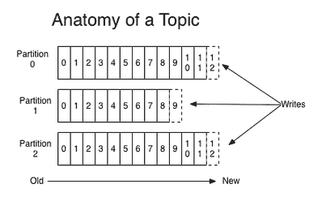

# 日志管理（十一）

> 原文：<http://matt33.com/2018/03/12/kafka-log-manager/>

上篇文章在介绍完 Kafka 的 GroupCoordinator 之后，下面开始介绍 Kafka 存储层的内容，也就是 Kafka Server 端 Log 部分的内容，Log 部分是 Kafka 比较底层的代码，日志的读写、分段、清理和管理都是在这一部分完成的，内容还是比较多的，会分为三篇左右的文章介绍，本篇先介绍最简单的部分，主要是日志的基本概念、日志管理、日志刷新和日志清理四部分（后两个其实也属于日志管理，为便于讲解，这里分开讲述），日志的读写和分段将在下一篇讲述。

本篇主要的内容如下：

1.  Kafka 中 Log 的基本概念；
2.  日志管理；
3.  日志刷新；
4.  日志清理；

## 日志的基本概念

在 Kafka 的官方文档中，最开始介绍 Kafka 的一句话是：

> Kafka is a distributed, partitioned, replicated commit log service. （0.10.0 之前）
> 
> Apache Kafka is a distributed streaming platform. （0.10.0 及之后）

可以说在 KafkaStream 之前，Kafka 最开始的应用场景就是日志场景或 mq 场景，更多的扮演着一个存储系统，这是 Kafka 立家之本。

Kafka 是一个分布式的（distributed）、可分区的（partitioned）、支持多副本（replicated）的日志提交系统，分布式这个概念很好理解，Kafka 本身就是一个分布式系统，那另外两个概念什么意思呢？

*   可分区的：一个 topic 是可以设置多个分区的，可分区解决了单 topic 线性扩展的问题（也解决了负载均衡的问题）；
*   支持多副本的：使得 topic 可以做到更多容错性，牺牲性能与空间去换取更高的可靠性。

一个 Topic 基本结果如下：



图中的 topic 由三个 partition 组成，topic 在创建开始，每个 partition 在写入时，其 offset 值是从 0 开始逐渐增加。topic 的 partition 是可以分配到 Kafka 集群的任何节点上，在实际存储时，每个 partition 是按 segment 文件去存储的（segment 的大小是在 server 端配置的，这就是日志的分段），如下图所示：


> 注：上图是 0.8.2.1 版的 segment 的结构，0.10.2.0 版每个 segment 还会有一个对应的 timestrap 文件。

再简单介绍一下 topic 的副本的概念，kafka 中为了保证一定可靠性，一般会为设置多个副本，假设一个 topic 设置了三个副本：

*   每个 partition 都会有三个副本，这个三个副本需要分配在不同的 broker 上，在同一台 broker 上的话，就没有什么意义了；
*   这个三个副本中，会有选举出来了一个 leader，另外两个就是 follower，topic 的读写都是在 leader 上进行的，follower 从 leader 同步 partition 的数据。

> follower 不支持读的原因，个人感觉是对于流式系统而言，如果允许 follower 也可以读的话，数据一致性、可见性将会很难保证，对最初 Kafka 的设计将会带来很大的复杂性。

有了对 topic、partition、副本（replica）、segment、leader、follower 概念的理解之后，下面再看 Kafka 存储层的内容，就不会那么云里雾里了。

## 日志管理

Kafka 的日志管理（LogManager）主要的作用是负责日志的创建、检索、清理，日志相关的读写操作实际上是由日志实例对象（Log）来处理的。

### KafkaServer 启动 LogManager 线程

LogManager 线程是在节点的 Kafka 服务启动时启动的，相关代码如下：

```scala
//kafka.server.KafkaServer
def startup() {
  try {
    info("starting")
    /* start log manager */
    //note: 启动日志管理线程
    logManager = createLogManager(zkUtils.zkClient, brokerState)
    logManager.startup()
    }
  catch {
    case e: Throwable =>
    fatal("Fatal error during KafkaServer startup. Prepare to shutdown", e)
    isStartingUp.set(false)
    shutdown()
    throw e
  }
}

private def createLogManager(zkClient: ZkClient, brokerState: BrokerState): LogManager = {
  val defaultProps = KafkaServer.copyKafkaConfigToLog(config)
  val defaultLogConfig = LogConfig(defaultProps)

  val configs = AdminUtils.fetchAllTopicConfigs(zkUtils).map { case (topic, configs) =>
    topic -> LogConfig.fromProps(defaultProps, configs)
  }
  // read the log configurations from zookeeper
  val cleanerConfig = CleanerConfig(numThreads = config.logCleanerThreads, //note: 日志清理线程数,默认是 1
                                    dedupeBufferSize = config.logCleanerDedupeBufferSize, //note: 日志清理使用的总内容,默认 128MB
                                    dedupeBufferLoadFactor = config.logCleanerDedupeBufferLoadFactor, //note:  buffer load factor
                                    ioBufferSize = config.logCleanerIoBufferSize, //note:
                                    maxMessageSize = config.messageMaxBytes, //note:
                                    maxIoBytesPerSecond = config.logCleanerIoMaxBytesPerSecond, //note:
                                    backOffMs = config.logCleanerBackoffMs, //note: 没有日志清理时的 sleep 时间,默认 15s
                                    enableCleaner = config.logCleanerEnable) //note: 是否允许对 compact 日志进行清理
  new LogManager(logDirs = config.logDirs.map(new File(_)).toArray, //note: 日志目录列表
                 topicConfigs = configs,
                 defaultConfig = defaultLogConfig,
                 cleanerConfig = cleanerConfig,
                 ioThreads = config.numRecoveryThreadsPerDataDir,//note: 每个日志目录在开始时用日志恢复以及关闭时日志 flush 的线程数,默认 1
                 flushCheckMs = config.logFlushSchedulerIntervalMs,
                 flushCheckpointMs = config.logFlushOffsetCheckpointIntervalMs, //note: 更新 check-point 的频率,默认是 60s
                 retentionCheckMs = config.logCleanupIntervalMs, //note: log-cleaner 检查 topic 是否需要删除的频率,默认是 5min
                 scheduler = kafkaScheduler,
                 brokerState = brokerState,
                 time = time)
}

```

### LogManager 初始化

LogManager 在初始化时，首先会检查 server 端配置的日志目录信息，然后会加载日志目录下的所有分区日志，其实现如下：

```scala
class LogManager(){
  //note: 检查点表示日志已经刷新到磁盘的位置，主要是用于数据恢复
  val RecoveryPointCheckpointFile = "recovery-point-offset-checkpoint" //note: 检查点文件

  private val logs = new Pool[TopicPartition, Log]() //note: 分区与日志实例的对应关系

  createAndValidateLogDirs(logDirs) //note: 检查日志目录
  private val dirLocks = lockLogDirs(logDirs)
  //note: 每个数据目录都有一个检查点文件,存储这个数据目录下所有分区的检查点信息
  private val recoveryPointCheckpoints = logDirs.map(dir => (dir, new OffsetCheckpoint(new File(dir, RecoveryPointCheckpointFile)))).toMap
  loadLogs()

  //note: 创建指定的数据目录,并做相应的检查:
  //note: 1.确保数据目录中没有重复的数据目录;
  //note: 2.数据不存在的话就创建相应的目录;
  //note: 3.检查每个目录路径是否是可读的。
  private def createAndValidateLogDirs(dirs: Seq[File]) {
    if(dirs.map(_.getCanonicalPath).toSet.size < dirs.size)
      throw new KafkaException("Duplicate log directory found: " + logDirs.mkString(", "))
    for(dir <- dirs) {
      if(!dir.exists) {
        info("Log directory '" + dir.getAbsolutePath + "' not found, creating it.")
        val created = dir.mkdirs()
        if(!created)
          throw new KafkaException("Failed to create data directory " + dir.getAbsolutePath)
      }
      if(!dir.isDirectory || !dir.canRead)
        throw new KafkaException(dir.getAbsolutePath + " is not a readable log directory.")
    }
  }

  //note: 加载所有的日志,而每个日志也会调用 loadSegments() 方法加载所有的分段,过程比较慢,所有每个日志都会创建一个单独的线程
  //note: 日志管理器采用线程池提交任务,标识不用的任务可以同时运行
  private def loadLogs(): Unit = {
    info("Loading logs.")
    val startMs = time.milliseconds
    val threadPools = mutable.ArrayBuffer.empty[ExecutorService]
    val jobs = mutable.Map.empty[File, Seq[Future[_]]]

    for (dir <- this.logDirs) { //note: 处理每一个日志目录
      val pool = Executors.newFixedThreadPool(ioThreads) //note: 默认为 1
      threadPools.append(pool) //note: 每个对应的数据目录都有一个线程池

      val cleanShutdownFile = new File(dir, Log.CleanShutdownFile)

      if (cleanShutdownFile.exists) {
        debug(
          "Found clean shutdown file. " +
          "Skipping recovery for all logs in data directory: " +
          dir.getAbsolutePath)
      } else {
        // log recovery itself is being performed by `Log` class during initialization
        brokerState.newState(RecoveringFromUncleanShutdown)
      }

      var recoveryPoints = Map[TopicPartition, Long]()
      try {
        recoveryPoints = this.recoveryPointCheckpoints(dir).read //note: 读取检查点文件
      } catch {
        case e: Exception =>
          warn("Error occured while reading recovery-point-offset-checkpoint file of directory " + dir, e)
          warn("Resetting the recovery checkpoint to 0")
      }

      val jobsForDir = for {
        dirContent <- Option(dir.listFiles).toList //note: 数据目录下的所有日志目录
        logDir <- dirContent if logDir.isDirectory //note: 日志目录下每个分区目录
      } yield {
        CoreUtils.runnable { //note: 每个分区的目录都对应了一个线程
          debug("Loading log '" + logDir.getName + "'")

          val topicPartition = Log.parseTopicPartitionName(logDir)
          val config = topicConfigs.getOrElse(topicPartition.topic, defaultConfig)
          val logRecoveryPoint = recoveryPoints.getOrElse(topicPartition, 0L)

          val current = new Log(logDir, config, logRecoveryPoint, scheduler, time)//note: 创建 Log 对象后，初始化时会加载所有的 segment
          if (logDir.getName.endsWith(Log.DeleteDirSuffix)) { //note: 该目录被标记为删除
            this.logsToBeDeleted.add(current)
          } else {
            val previous = this.logs.put(topicPartition, current) //note: 创建日志后,加入日志管理的映射表
            if (previous != null) {
              throw new IllegalArgumentException(
                "Duplicate log directories found: %s, %s!".format(
                  current.dir.getAbsolutePath, previous.dir.getAbsolutePath))
            }
          }
        }
      }

      jobs(cleanShutdownFile) = jobsForDir.map(pool.submit).toSeq //note: 提交任务
    }

    try {
      for ((cleanShutdownFile, dirJobs) <- jobs) {
        dirJobs.foreach(_.get)
        cleanShutdownFile.delete()
      }
    } catch {
      case e: ExecutionException => {
        error("There was an error in one of the threads during logs loading: " + e.getCause)
        throw e.getCause
      }
    } finally {
      threadPools.foreach(_.shutdown())
    }

    info(s"Logs loading complete in ${time.milliseconds - startMs} ms.")
  }
}

```

初始化 LogManger 代码有两个主要方法：

1.  `createAndValidateLogDirs()`：创建指定的数据目录，并做相应的检查： 1.确保数据目录中没有重复的数据目录、2.数据目录不存在的话就创建相应的目录；3\. 检查每个目录路径是否是可读的；
2.  `loadLogs()`：加载所有的日志分区，而每个日志也会调用 `loadSegments()` 方法加载该分区所有的 segment 文件，过程比较慢，所以 LogManager 使用线程池的方式，为每个日志的加载都会创建一个单独的线程。

虽然使用的是线程池提交任务，并发进行 load 分区日志，但这个任务本身是阻塞式的，只有当所有的分区日志加载完成，才能调用 `startup()` 启动 LogManager 线程。

### LogManager 启动

在日志目录的所有分区日志都加载完成后，KafkaServer 调用 `startup()` 方法启动 LogManager 线程，LogManager 启动后，后台会运行四个定时任务，代码实现如下：

```scala
def startup() {
  /* Schedule the cleanup task to delete old logs */
  if(scheduler != null) {
    //note: 定时清理过期的日志 segment,并维护日志的大小
    info("Starting log cleanup with a period of %d ms.".format(retentionCheckMs))
    scheduler.schedule("kafka-log-retention",
                       cleanupLogs,
                       delay = InitialTaskDelayMs,
                       period = retentionCheckMs,
                       TimeUnit.MILLISECONDS)
    //note: 定时刷新还没有写到磁盘上日志
    info("Starting log flusher with a default period of %d ms.".format(flushCheckMs))
    scheduler.schedule("kafka-log-flusher",
                       flushDirtyLogs,
                       delay = InitialTaskDelayMs,
                       period = flushCheckMs,
                       TimeUnit.MILLISECONDS)
    //note: 定时将所有数据目录所有日志的检查点写到检查点文件中
    scheduler.schedule("kafka-recovery-point-checkpoint",
                       checkpointRecoveryPointOffsets,
                       delay = InitialTaskDelayMs,
                       period = flushCheckpointMs,
                       TimeUnit.MILLISECONDS)
    //note: 定时删除标记为 delete 的日志文件
    scheduler.schedule("kafka-delete-logs",
                       deleteLogs,
                       delay = InitialTaskDelayMs,
                       period = defaultConfig.fileDeleteDelayMs,
                       TimeUnit.MILLISECONDS)
  }
  //note: 如果设置为 true， 自动清理 compaction 类型的 topic
  if(cleanerConfig.enableCleaner)
    cleaner.startup()
}

```

四个后台定时线程的作用：

1.  `cleanupLogs`：定时清理过期的日志 segment，并维护日志的大小（默认 5min）；
2.  `flushDirtyLogs`：定时刷新将还没有写到磁盘上日志刷新到磁盘（默认 无限大）；
3.  `checkpointRecoveryPointOffsets`：定时将所有数据目录所有日志的检查点写到检查点文件中（默认 60s）；
4.  `deleteLogs`：定时删除标记为 delete 的日志文件（默认 30s）。

### 检查点文件

在 LogManager 中有一个非常重要的文件——检查点文件：

1.  Kafka 启动时创建 LogManager，读取检查点文件，并把每个分区对应的检查点（checkPoint）作为日志的恢复点（recoveryPoint），最后创建分区对应的日志实例；
2.  消息追加到分区对应的日志，在刷新日志时，将最新的偏移量作为日志的检查点（也即是刷新日志时，会更新检查点位置）；
3.  LogManager 会启动一个定时任务，读取所有日志的检查点，并写入全局的检查点文件（定时将检查点的位置更新到检查点文件中）。

```scala
//note：通常所有数据目录都会一起执行，不会专门操作某一个数据目录的检查点文件
def checkpointRecoveryPointOffsets() {
  this.logDirs.foreach(checkpointLogsInDir)
}

/**
 * Make a checkpoint for all logs in provided directory.
 */
//note: 对数据目录下的所有日志（即所有分区），将其检查点写入检查点文件
private def checkpointLogsInDir(dir: File): Unit = {
  val recoveryPoints = this.logsByDir.get(dir.toString)
  if (recoveryPoints.isDefined) {
    this.recoveryPointCheckpoints(dir).write(recoveryPoints.get.mapValues(_.recoveryPoint))
  }
}

```

> 这里留一个问题：启动时，如果发现检查点文件的 offset 比 segment 中最大的 offset 小时（最新的检查点在更新到文件前机器宕机了），应该怎么处理？答案将在下一篇文章中讲述。

## 日志刷新

日志管理器会定时调度 `flushDirtyLogs()` 方法，定期将页面缓存中的数据真正刷新到磁盘文件中。如果缓存中的数据（在 pagecache 中）在 flush 到磁盘之前，Broker 宕机了，那么会导致数据丢失（多副本减少了这个风险）。

在 Kafka 中有两种策略，将日志刷新到磁盘上：

*   时间策略，（`log.flush.interval.ms` 中配置调度周期，默认为无限大，即选择大小策略）：
*   大小策略，（`log.flush.interval.messages` 中配置当未刷新的 msg 数超过这个值后，进行刷新）。

LogManager 刷新日志的实现方法如下：

```scala
//note: LogManager 启动时，会启动一个周期性调度任务，调度这个方法，定时刷新日志。
private def flushDirtyLogs() = {
  debug("Checking for dirty logs to flush...")

  for ((topicPartition, log) <- logs) {
    try {
      //note: 每个日志的刷新时间并不相同
      val timeSinceLastFlush = time.milliseconds - log.lastFlushTime
      debug("Checking if flush is needed on " + topicPartition.topic + " flush interval  " + log.config.flushMs +
            " last flushed " + log.lastFlushTime + " time since last flush: " + timeSinceLastFlush)
      if(timeSinceLastFlush >= log.config.flushMs)
        log.flush
    } catch {
      case e: Throwable =>
        error("Error flushing topic " + topicPartition.topic, e)
    }
  }
}

```

LogManager 这个方法最后的结果还是调用了 `log.flush()` 进行刷新操作：

```scala
/**
 * Flush all log segments
 */
def flush(): Unit = flush(this.logEndOffset)

/**
 * Flush log segments for all offsets up to offset-1
 *
 * @param offset The offset to flush up to (non-inclusive); the new recovery point
 */
def flush(offset: Long) : Unit = {
  if (offset <= this.recoveryPoint)
    return
  debug("Flushing log '" + name + " up to offset " + offset + ", last flushed: " + lastFlushTime + " current time: " +
        time.milliseconds + " unflushed = " + unflushedMessages)
  //note: 刷新检查点到最新偏移量之间的所有日志分段
  for(segment <- logSegments(this.recoveryPoint, offset))
    segment.flush()//note: 刷新数据文件和索引文件（调用操作系统的 fsync）
  lock synchronized {
    if(offset > this.recoveryPoint) {
      this.recoveryPoint = offset
      lastflushedTime.set(time.milliseconds)//note: 更新刷新时间
    }
  }
}

```

上面的内容实际上只是按 `log.flush.interval.ms` 设置去 flush 日志到磁盘，那么 `log.flush.interval.messages` 策略是在什么地方生效的呢？用心想一下，大家应该能猜出来，是在数据追加到 Log 中的时候，这时候会判断没有 flush 的数据大小是否达到阈值，具体实现如下所示：

```scala
// 其他部分这里暂时忽略了
def append(records: MemoryRecords, assignOffsets: Boolean = true): LogAppendInfo = {
  // now append to the log
  segment.append(firstOffset = appendInfo.firstOffset,
    largestOffset = appendInfo.lastOffset,
    largestTimestamp = appendInfo.maxTimestamp,
    shallowOffsetOfMaxTimestamp = appendInfo.offsetOfMaxTimestamp,
    records = validRecords)

  // increment the log end offset
  updateLogEndOffset(appendInfo.lastOffset + 1)

  trace("Appended message set to log %s with first offset: %d, next offset: %d, and messages: %s"
    .format(this.name, appendInfo.firstOffset, nextOffsetMetadata.messageOffset, validRecords))

  if (unflushedMessages >= config.flushInterval)
    flush()
}

```

## 日志清理

为了保证分区的总大小不超过阈值（`log.retention.bytes`），日志管理器会定时清理旧的数据。

> 不过一般情况下，都是通过配置 `log.retention.hours` 来配置 segment 的保存时间，而不是通过单日志的总大小配置，因为不同的 topic，其 partition 大小相差很大，导致最后的保存时间可能也不一致，不利于管理。

清理旧日志分段方法，主要有两种：

1.  删除：超过时间或大小阈值的旧 segment，直接进行删除；
2.  压缩：不是直接删除日志分段，而是采用合并压缩的方式进行。

这里主要讲述第一种方法，第二种将会后续文章介绍。

先看下 LogManager 中日志清除任务的实现：

```scala
/**
 * Delete any eligible logs. Return the number of segments deleted.
 * Only consider logs that are not compacted.
 */
//note: 日志清除任务
def cleanupLogs() {
  debug("Beginning log cleanup...")
  var total = 0
  val startMs = time.milliseconds
  for(log <- allLogs; if !log.config.compact) {
    debug("Garbage collecting '" + log.name + "'")
    total += log.deleteOldSegments() //note: 清理过期的 segment
  }
  debug("Log cleanup completed. " + total + " files deleted in " +
                (time.milliseconds - startMs) / 1000 + " seconds")
}

```

日志清除任务的实现还是在 Log 的 `deleteOldSegments()` 中实现的：

```scala
/**
  * Delete any log segments that have either expired due to time based retention
  * or because the log size is > retentionSize
  */
def deleteOldSegments(): Int = {
  if (!config.delete) return 0
  deleteRetenionMsBreachedSegments() + deleteRetentionSizeBreachedSegments()
}

//note: 清除保存时间满足条件的 segment
private def deleteRetenionMsBreachedSegments() : Int = {
  if (config.retentionMs < 0) return 0
  val startMs = time.milliseconds
  deleteOldSegments(startMs - _.largestTimestamp > config.retentionMs)
}

//note: 清除保存大小满足条件的 segment
private def deleteRetentionSizeBreachedSegments() : Int = {
  if (config.retentionSize < 0 || size < config.retentionSize) return 0
  var diff = size - config.retentionSize
  def shouldDelete(segment: LogSegment) = {
    if (diff - segment.size >= 0) {
      diff -= segment.size
      true
    } else {
      false
    }
  }
  deleteOldSegments(shouldDelete)
}

```

清除日志的两个方法：

1.  `deleteRetenionMsBreachedSegments()`：如果 segment 保存时间超过设置的时间，那么进行删除；
2.  `deleteRetentionSizeBreachedSegments()`：如果当前最新的日志大小减少下一个即将删除的 segment 分段的大小超过阈值，那么就允许删除该 segment，否则就不允许。

调用 `deleteOldSegments()` 方法删除日志数据文件及索引文件的具体实现如下：

```scala
//note: 清除相应的 segment 及相应的索引文件
//note: 其中 predicate 是一个高阶函数，只有返回值为 true 该 segment 才会被删除
private def deleteOldSegments(predicate: LogSegment => Boolean): Int = {
  lock synchronized {
    val deletable = deletableSegments(predicate)
    val numToDelete = deletable.size
    if (numToDelete > 0) {
      // we must always have at least one segment, so if we are going to delete all the segments, create a new one first
      if (segments.size == numToDelete)
        roll()
      // remove the segments for lookups
      deletable.foreach(deleteSegment) //note: 删除 segment
    }
    numToDelete
  }
}

private def deleteSegment(segment: LogSegment) {
  info("Scheduling log segment %d for log %s for deletion.".format(segment.baseOffset, name))
  lock synchronized {
    segments.remove(segment.baseOffset) //note:  从映射关系表中删除数据
    asyncDeleteSegment(segment) //note: 异步删除日志 segment
  }
}

/**
 * Perform an asynchronous delete on the given file if it exists (otherwise do nothing)
 *
 * @throws KafkaStorageException if the file can't be renamed and still exists
 */
private def asyncDeleteSegment(segment: LogSegment) {
  segment.changeFileSuffixes("", Log.DeletedFileSuffix) //note: 先将 segment 的数据文件和索引文件后缀添加 `.deleted`
  def deleteSeg() {
    info("Deleting segment %d from log %s.".format(segment.baseOffset, name))
    segment.delete()
  }
  scheduler.schedule("delete-file", deleteSeg, delay = config.fileDeleteDelayMs) //note: 异步调度进行删除
}

```

从上面的讲解来看，Kafka LogManager 线程工作还是比较清晰简洁的，它的作用就是负责日志的创建、检索、清理，并不负责日志的读写等实际操作。