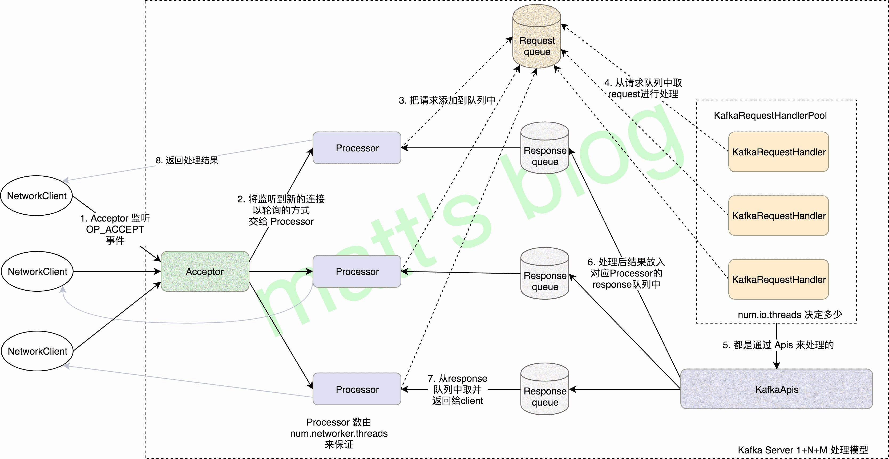

# Kafka 源码解析之 Server 1+N+M 网络处理模型（二十三）

> 原文：<http://matt33.com/2018/06/27/kafka-server-process-model/>

前面 7 篇对 Kafka Controller 的内容做了相应的总结，Controller 这部分的总结算是暂时告一段落，本节会讲述 Kafka 源码分析系列中最后一节的内容，是关于 Server 端对不同类型请求处理的网络模型。在前面的文章中也讲述过几种不同类型的请求处理实现，如果还有印象，就会知道它们都是通过 KafkaApis 对象处理的，但是前面并没有详细讲述 Server 端是如何监听到相应的请求、请求是如何交给 KafkaApis 对象进行处理，以及处理后是如何返回给请求者（请求者可以是 client 也可以是 server），这些都属于 Server 的网络处理模型，也是本文讲述的主要内容。

## Server 网络模型整体流程

Kafka Server 启动后，会通过 KafkaServer 的 `startup()` 方法初始化涉及到网络模型的相关对象，如下所示：

```scala
def startup(){
  //note: socketServer
  socketServer = new SocketServer(config, metrics, time, credentialProvider)
  socketServer.startup()
  //NOTE: 初始化 KafkaApis 实例,每个 Server 只会启动一个线程
  apis = new KafkaApis(socketServer.requestChannel, replicaManager, adminManager, groupCoordinator,
    kafkaController, zkUtils, config.brokerId, config, metadataCache, metrics, authorizer, quotaManagers,
    clusterId, time)

  requestHandlerPool = new KafkaRequestHandlerPool(config.brokerId, socketServer.requestChannel, apis, time,
    config.numIoThreads)
}

```

Kafka Server 在启动时会初始化 SocketServer、KafkaApis 和 KafkaRequestHandlerPool 对象，这也是 Server 网络处理模型的主要组成部分。Kafka Server 的网络处理模型也是基于 Java NIO 机制实现的，实现模式与 Reactor 模式类似，其完整的处理流程图如下所示：



上图如果现在不理解，并不要紧，这里先简单介绍一些，讲述一下整体的流程，本节下面会结合 Kafka 的代码详细来讲述图中的过程。上图的网络模型可以简要总结为以下三个重要组成部分：

1.  1 个 Acceptor 线程，负责监听 Socket 新的连接请求，注册了 `OP_ACCEPT` 事件，将新的连接按照 round robin 方式交给对应的 Processor 线程处理；
2.  N 个 Processor 线程，其中每个 Processor 都有自己的 selector，它会向 Acceptor 分配的 SocketChannel 注册相应的 `OP_READ` 事件，N 的大小由 `num.networker.threads` 决定；
3.  M 个 KafkaRequestHandler 线程处理请求，并将处理的结果返回给 Processor 线程对应的 response queue 中，由 Processor 将处理的结果返回给相应的请求发送者，M 的大小由 `num.io.threads` 来决定。

上图展示的整体的处理流程如下所示：

1.  Acceptor 监听到来自请求者（请求者可以是来自 client，也可以来自 server）的新的连接，Acceptor 将这个请求者按照 round robin 的方式交给对对应的 Processor 进行处理；
2.  Processor 注册这个 SocketChannel 的 `OP_READ` 的事件，如果有请求发送过来就可以被 Processor 的 Selector 选中；
3.  Processor 将请求者发送的请求放入到一个 Request Queue 中，这是所有 Processor 共有的一个队列；
4.  KafkaRequestHandler 从 Request Queue 中取出请求；
5.  调用 KafkaApis 进行相应的处理；
6.  处理的结果放入到该 Processor 对应的 Response Queue 中（每个 request 都标识它们来自哪个 Processor），Request Queue 的数量与 Processor 的数量保持一致；
7.  Processor 从对应的 Response Queue 中取出 response；
8.  Processor 将处理的结果返回给对应的请求者。

上面是 Server 端网络处理的整体流程，下面我们开始详细讲述上面内容在 Kafka 中实现。

## SocketServer

SocketServer 是接收 Socket 连接、处理请求并返回处理结果的地方，Acceptor 及 Processor 的初始化、处理逻辑都是在这里实现的。在 SocketServer 内有几个比较重要的变量，这里先来看下：

```scala
class SocketServer(val config: KafkaConfig, val metrics: Metrics, val time: Time, val credentialProvider: CredentialProvider) extends Logging with KafkaMetricsGroup {

  private val endpoints = config.listeners.map(l => l.listenerName -> l).toMap //note: broker 开放的端口数
  private val numProcessorThreads = config.numNetworkThreads //note: num.network.threads 默认为 3 个，即 processor
  private val maxQueuedRequests = config.queuedMaxRequests //note:  queued.max.requests，request 队列中允许的最多请求数，默认是 500
  private val totalProcessorThreads = numProcessorThreads * endpoints.size //note: 每个端口会对应 N 个 processor

  private val maxConnectionsPerIp = config.maxConnectionsPerIp //note: 默认 2147483647
  private val maxConnectionsPerIpOverrides = config.maxConnectionsPerIpOverrides

  this.logIdent = "[Socket Server on Broker " + config.brokerId + "], "

  //note: 请求队列
  val requestChannel = new RequestChannel(totalProcessorThreads, maxQueuedRequests)
  private val processors = new Array[Processor](totalProcessorThreads)

  private[network] val acceptors = mutable.Map[EndPoint, Acceptor]()
}

class RequestChannel(val numProcessors: Int, val queueSize: Int) extends KafkaMetricsGroup {
  private var responseListeners: List[(Int) => Unit] = Nil
  //note: 一个 requestQueue 队列,N 个 responseQueues 队列
  private val requestQueue = new ArrayBlockingQueue[RequestChannel.Request](queueSize)
  private val responseQueues = new Array[BlockingQueue[RequestChannel.Response]](numProcessors)
}

```

其中

1.  `numProcessorThreads`：决定了 Processor 的个数，默认是 3 个，也就是 1+N+M 的 N 的数值；
2.  `maxQueuedRequests`：决定了 request queue 中最多允许放入多少个请求（等待处理的请求），默认是 500；
3.  在 `RequestChannel` 中初始化了一个 requestQueue 和 N 个 responseQueue。

### SocketServer 初始化

在 SocketServer 初始化方法 `startup()` 中，会初始化 1 个 Acceptor 和 N 个 Processor 线程（每个 EndPoint 都会初始化这么多，一般来说一个 Server 只会设置一个端口），其实现如下：

```scala
def startup() {
  this.synchronized {
    //note: 一台 broker 一般只设置一个端口，当然这里也可以设置两个
    config.listeners.foreach { endpoint =>
      val listenerName = endpoint.listenerName
      val securityProtocol = endpoint.securityProtocol
      val processorEndIndex = processorBeginIndex + numProcessorThreads

      //note: N 个 processor
      for (i <- processorBeginIndex until processorEndIndex)
        processors(i) = newProcessor(i, connectionQuotas, listenerName, securityProtocol)

      //note: 1 个 Acceptor
      val acceptor = new Acceptor(endpoint, sendBufferSize, recvBufferSize, brokerId,
        processors.slice(processorBeginIndex, processorEndIndex), connectionQuotas)
      acceptors.put(endpoint, acceptor)
      Utils.newThread(s"kafka-socket-acceptor-$listenerName-$securityProtocol-${endpoint.port}", acceptor, false).start()
      acceptor.awaitStartup()

      processorBeginIndex = processorEndIndex
    }
  }
}

```

### Acceptor 处理

SocketServer 在初始化后 Acceptor 线程后，Acceptor 启动，会首先注册 `OP_ACCEPT` 事件，监听是否有新的连接，如果来了新的连接就将该 SocketChannel 交给对应的 Processor 进行处理，Processor 是通过 round robin 方法选择的，这样可以保证 Processor 的负载相差无几（至少可以保证监听的 SocketChannel 差不多），实现如下：

```scala
def run() {
  serverChannel.register(nioSelector, SelectionKey.OP_ACCEPT)//note: 注册 accept 事件
  startupComplete()
  try {
    var currentProcessor = 0
    while (isRunning) {
      try {
        val ready = nioSelector.select(500)
        if (ready > 0) {
          val keys = nioSelector.selectedKeys()
          val iter = keys.iterator()
          while (iter.hasNext && isRunning) {
            try {
              val key = iter.next
              iter.remove()
              if (key.isAcceptable)
                accept(key, processors(currentProcessor))//note: 拿到一个 socket 连接，轮询选择一个 processor 进行处理
              else
                throw new IllegalStateException("Unrecognized key state for acceptor thread.")

              //note: 轮询算法,使用 round robin
              // round robin to the next processor thread
              currentProcessor = (currentProcessor + 1) % processors.length
            } catch {
              case e: Throwable => error("Error while accepting connection", e)
            }
          }
        }
      }
      catch {
        // We catch all the throwables to prevent the acceptor thread from exiting on exceptions due
        // to a select operation on a specific channel or a bad request. We don't want
        // the broker to stop responding to requests from other clients in these scenarios.
        case e: ControlThrowable => throw e
        case e: Throwable => error("Error occurred", e)
      }
    }
  } finally {
    debug("Closing server socket and selector.")
    swallowError(serverChannel.close())
    swallowError(nioSelector.close())
    shutdownComplete()
  }
}

```

Acceptor 通过 `accept()` 将该新连接交给对应的 Processor，其实现如下：

```scala
//note: 处理一个新的连接
def accept(key: SelectionKey, processor: Processor) {
  //note: accept 事件发生时，获取注册到 selector 上的 ServerSocketChannel
  val serverSocketChannel = key.channel().asInstanceOf[ServerSocketChannel]
  val socketChannel = serverSocketChannel.accept()
  try {
    connectionQuotas.inc(socketChannel.socket().getInetAddress)
    socketChannel.configureBlocking(false)
    socketChannel.socket().setTcpNoDelay(true)
    socketChannel.socket().setKeepAlive(true)
    if (sendBufferSize != Selectable.USE_DEFAULT_BUFFER_SIZE)
      socketChannel.socket().setSendBufferSize(sendBufferSize)

    debug("Accepted connection from %s on %s and assigned it to processor %d, sendBufferSize [actual|requested]: [%d|%d] recvBufferSize [actual|requested]: [%d|%d]"
          .format(socketChannel.socket.getRemoteSocketAddress, socketChannel.socket.getLocalSocketAddress, processor.id,
                socketChannel.socket.getSendBufferSize, sendBufferSize,
                socketChannel.socket.getReceiveBufferSize, recvBufferSize))

    //note: 轮询选择不同的 processor 进行处理
    processor.accept(socketChannel)
  } catch {
    case e: TooManyConnectionsException =>
      info("Rejected connection from %s, address already has the configured maximum of %d connections.".format(e.ip, e.count))
      close(socketChannel)
  }
}

```

### Processor 处理

在前面，Acceptor 通过 `accept()` 将新的连接交给 Processor，Processor 实际上是将该 SocketChannel 添加到该 Processor 的 `newConnections` 队列中，实现如下：

```scala
def accept(socketChannel: SocketChannel) {
  newConnections.add(socketChannel)//note: 添加到队列中
  wakeup()//note: 唤醒 Processor 的 selector（如果此时在阻塞的话）
}

```

这里详细看下 Processor 线程做了什么事情，其 `run()` 方法的实现如下：

```scala
override def run() {
  startupComplete()
  while (isRunning) {
    try {
      // setup any new connections that have been queued up
      configureNewConnections()//note: 对新的 socket 连接,并注册 READ 事件
      // register any new responses for writing
      processNewResponses()//note: 处理 response 队列中 response
      poll() //note: 监听所有的 socket channel，是否有新的请求发送过来
      processCompletedReceives() //note: 处理接收到请求，将其放入到 request queue 中
      processCompletedSends() //note: 处理已经完成的发送
      processDisconnected() //note: 处理断开的连接
    } catch {
      // We catch all the throwables here to prevent the processor thread from exiting. We do this because
      // letting a processor exit might cause a bigger impact on the broker. Usually the exceptions thrown would
      // be either associated with a specific socket channel or a bad request. We just ignore the bad socket channel
      // or request. This behavior might need to be reviewed if we see an exception that need the entire broker to stop.
      case e: ControlThrowable => throw e
      case e: Throwable =>
        error("Processor got uncaught exception.", e)
    }
  }

  debug("Closing selector - processor " + id)
  swallowError(closeAll())
  shutdownComplete()
}

```

Processor 在一次循环中，主要做的事情如下：

1.  `configureNewConnections()`：对新添加到 `newConnections` 队列中的 SocketChannel 进行处理，这里主要是 Processor 的 selector 注册该连接的 `OP_READ` 事件；
2.  `processNewResponses()`：从该 Processor 对应的 response queue 中取出一个 response，进行发送；
3.  `poll()`：调用 selector 的 `poll()` 方法，遍历注册的 SocketChannel，查看是否有事件准备就绪；
4.  `processCompletedReceives()`：将接收到请求添加到的 request queue 中；
5.  `processCompletedSends()`：处理已经完成的响应发送；
6.  `processDisconnected()`：处理断开的 SocketChannel。

上面就是 Processor 线程处理的主要逻辑，先是向新的 SocketChannel 注册相应的事件，监控是否有请求发送过来，接着从 response queue 中取出处理完成的请求发送给对应的请求者，然后调用一下 selector 的 `poll()`，遍历一下注册的所有 SocketChannel，判断是否有事件就绪，然后做相应的处理。这里需要注意的是，request queue 是所有 Processor 公用的一个队列，而 response queue 则是与 Processor 一一对应的，因为每个 Processor 监听的 SocketChannel 并不是同一批的，如果公有一个 response queue，那么这个 N 个 Processor 的 selector 要去监听所有的 SocketChannel，而不是现在这种，只需要去关注分配给自己的 SocketChannel。

下面分别看下上面的这些方法的具体实现。

#### configureNewConnections

`configureNewConnections()` 对新添加到 `newConnections` 队列中的 SocketChannel 进行处理，主要是 selector 注册相应的 `OP_READ` 事件，其实现如下：

```scala
//note: 如果有新的连接过来，将该 Channel 的 OP_READ 事件注册到 selector 上
private def configureNewConnections() {
  while (!newConnections.isEmpty) {
    val channel = newConnections.poll()
    try {
      debug(s"Processor $id listening to new connection from ${channel.socket.getRemoteSocketAddress}")
      val localHost = channel.socket().getLocalAddress.getHostAddress
      val localPort = channel.socket().getLocalPort
      val remoteHost = channel.socket().getInetAddress.getHostAddress
      val remotePort = channel.socket().getPort
      val connectionId = ConnectionId(localHost, localPort, remoteHost, remotePort).toString
      selector.register(connectionId, channel)
    } catch {
      // We explicitly catch all non fatal exceptions and close the socket to avoid a socket leak. The other
      // throwables will be caught in processor and logged as uncaught exceptions.
      case NonFatal(e) =>
        val remoteAddress = channel.getRemoteAddress
        // need to close the channel here to avoid a socket leak.
        close(channel)
        error(s"Processor $id closed connection from $remoteAddress", e)
    }
  }
}

```

#### processNewResponses

`processNewResponses()` 方法是从该 Processor 对应的 response queue 中取出一个 response，Processor 是通过 RequestChannel 的 `receiveResponse()` 从该 Processor 对应的 response queue 中取出 response，如下所示：

```scala
//note: 获取 response
def receiveResponse(processor: Int): RequestChannel.Response = {
  val response = responseQueues(processor).poll()
  if (response != null)
    response.request.responseDequeueTimeMs = Time.SYSTEM.milliseconds
  response
}

```

取到相应的 response 之后，会判断该 response 的类型，进行相应的操作，如果需要返回，那么会调用 `sendResponse()` 发送该 response，如下所示：

```scala
//note: 处理一个新的 response 响应
private def processNewResponses() {
  var curr = requestChannel.receiveResponse(id)
  while (curr != null) {
    try {
      curr.responseAction match {
        case RequestChannel.NoOpAction => //note: 如果这个请求不需要返回 response，再次注册该监听事件
          // There is no response to send to the client, we need to read more pipelined requests
          // that are sitting in the server's socket buffer
          curr.request.updateRequestMetrics
          trace("Socket server received empty response to send, registering for read: " + curr)
          val channelId = curr.request.connectionId
          if (selector.channel(channelId) != null || selector.closingChannel(channelId) != null)
              selector.unmute(channelId)
        case RequestChannel.SendAction => //note: 需要发送的 response，那么进行发送
          sendResponse(curr)
        case RequestChannel.CloseConnectionAction => //note: 要关闭的 response
          curr.request.updateRequestMetrics
          trace("Closing socket connection actively according to the response code.")
          close(selector, curr.request.connectionId)
      }
    } finally {
      curr = requestChannel.receiveResponse(id)
    }
  }
}

/* `protected` for test usage */
//note: 发送的对应的 response
protected[network] def sendResponse(response: RequestChannel.Response) {
  trace(s"Socket server received response to send, registering for write and sending data: $response")
  val channel = selector.channel(response.responseSend.destination)
  // `channel` can be null if the selector closed the connection because it was idle for too long
  if (channel == null) {
    warn(s"Attempting to send response via channel for which there is no open connection, connection id $id")
    response.request.updateRequestMetrics()
  }
  else {
    selector.send(response.responseSend) //note: 发送该 response
    inflightResponses += (response.request.connectionId -> response) //note: 添加到 inflinght 中
  }
}

```

#### processCompletedReceives

`processCompletedReceives()` 方法的主要作用是处理接收到请求，并将其放入到 request queue 中，其实现如下：

```scala
//note: 处理接收到的所有请求
private def processCompletedReceives() {
  selector.completedReceives.asScala.foreach { receive =>
    try {
      val openChannel = selector.channel(receive.source)
      val session = {
        // Only methods that are safe to call on a disconnected channel should be invoked on 'channel'.
        val channel = if (openChannel != null) openChannel else selector.closingChannel(receive.source)
        RequestChannel.Session(new KafkaPrincipal(KafkaPrincipal.USER_TYPE, channel.principal.getName), channel.socketAddress)
      }
      val req = RequestChannel.Request(processor = id, connectionId = receive.source, session = session,
        buffer = receive.payload, startTimeMs = time.milliseconds, listenerName = listenerName,
        securityProtocol = securityProtocol)
      requestChannel.sendRequest(req) //note: 添加到请求队列，如果队列满了，将会阻塞
      selector.mute(receive.source) //note: 移除该连接的 OP_READ 监听
    } catch {
      case e @ (_: InvalidRequestException | _: SchemaException) =>
        // note that even though we got an exception, we can assume that receive.source is valid. Issues with constructing a valid receive object were handled earlier
        error(s"Closing socket for ${receive.source} because of error", e)
        close(selector, receive.source)
    }
  }
}

```

#### processCompletedSends

`processCompletedSends()` 方法是处理已经完成的发送，其实现如下：

```scala
private def processCompletedSends() {
  selector.completedSends.asScala.foreach { send =>
    //note: response 发送完成，从正在发送的集合中移除
    val resp = inflightResponses.remove(send.destination).getOrElse {
      throw new IllegalStateException(s"Send for ${send.destination} completed, but not in `inflightResponses`")
    }
    resp.request.updateRequestMetrics()
    selector.unmute(send.destination) //note: 完成这个请求之后再次监听 OP_READ 事件
  }
}

```

## KafkaRequestHandlerPool

上面主要是讲述 SocketServer 中 Acceptor 与 Processor 的处理内容，也就是 1+N+M 模型中 1+N 部分，下面开始讲述 M 部分，也就是 KafkaRequestHandler 的内容，其初始化实现如下：

```scala
class KafkaRequestHandlerPool(val brokerId: Int,
                              val requestChannel: RequestChannel,
                              val apis: KafkaApis,
                              time: Time,
                              numThreads: Int) extends Logging with KafkaMetricsGroup {

  /* a meter to track the average free capacity of the request handlers */
  private val aggregateIdleMeter = newMeter("RequestHandlerAvgIdlePercent", "percent", TimeUnit.NANOSECONDS)

  this.logIdent = "[Kafka Request Handler on Broker " + brokerId + "], "
  val threads = new Array[Thread](numThreads)
  val runnables = new Array[KafkaRequestHandler](numThreads)
  //note: 建立 M 个（numThreads）KafkaRequestHandler
  for(i <- 0 until numThreads) {
    //note: requestChannel 是 Processor 存放 request 请求的地方,也是 Handler 处理完请求存放 response 的地方
    runnables(i) = new KafkaRequestHandler(i, brokerId, aggregateIdleMeter, numThreads, requestChannel, apis, time)
    threads(i) = Utils.daemonThread("kafka-request-handler-" + i, runnables(i))
    threads(i).start()
  }

  def shutdown() {
    info("shutting down")
    for(handler <- runnables)
      handler.shutdown
    for(thread <- threads)
      thread.join
    info("shut down completely")
  }
}

```

如上面实现所示：

1.  KafkaRequestHandlerPool 会初始化 M 个 KafkaRequestHandler 线程，并启动该线程；
2.  在初始化 KafkaRequestHandler 时，传入一个 requestChannel 变量，这个是 Processor 存放 request 的地方，KafkaRequestHandler 在处理请求时，会从这个 queue 中取出相应的 request。

### KafkaRequestHandler

KafkaRequestHandler 线程的处理实现如下：

```scala
def run() {
  while(true) {
    try {
      var req : RequestChannel.Request = null
      while (req == null) {
        // We use a single meter for aggregate idle percentage for the thread pool.
        // Since meter is calculated as total_recorded_value / time_window and
        // time_window is independent of the number of threads, each recorded idle
        // time should be discounted by # threads.
        val startSelectTime = time.nanoseconds
        req = requestChannel.receiveRequest(300) //note: 从 request queue 中拿去 request
        val idleTime = time.nanoseconds - startSelectTime
        aggregateIdleMeter.mark(idleTime / totalHandlerThreads)
      }

      if(req eq RequestChannel.AllDone) {
        debug("Kafka request handler %d on broker %d received shut down command".format(
          id, brokerId))
        return
      }
      req.requestDequeueTimeMs = time.milliseconds
      trace("Kafka request handler %d on broker %d handling request %s".format(id, brokerId, req))
      apis.handle(req) //note: 处理请求,并将处理的结果通过 sendResponse 放入 response queue 中
    } catch {
      case e: Throwable => error("Exception when handling request", e)
    }
  }
}

```

上述方法的实现逻辑：

1.  从 RequestChannel 取出相应的 request；
2.  KafkaApis 处理这个 request，并通过 `requestChannel.sendResponse()` 将处理的结果放入 requestChannel 的 response queue 中，如下所示：

```scala
//note: 将 response 添加到对应的队列中
def sendResponse(response: RequestChannel.Response) {
  responseQueues(response.processor).put(response)
  for(onResponse <- responseListeners)
    onResponse(response.processor) //note: 调用对应 processor 的 wakeup 方法
}

```

到这里为止，一个请求从 Processor 接收，到 KafkaRequestHandler 通过 KafkaApis 处理并放回该 Processor 对应的 response queue 这整个过程就完成了（建议阅读本文的时候结合最前面的流程图一起看）。